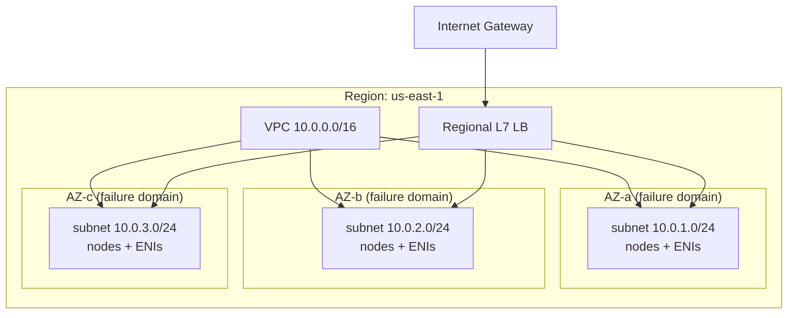

# 01 — Cloud Provider Foundations

> **Audience:** Staff/principal engineers who will run production services on Kubernetes at cloud-provider/FAANG scale. Before you reason about pods and reconciliation, you must reason about the *substrate*: the regions, instances, VPCs, IAM, and the cost model that K8s is merely a control plane over. This chapter is opinionated, provider-agnostic, and concrete. Everything here is the ground truth your cluster inherits — get it wrong and no amount of YAML saves you.

---

## 1. The Service Models & the Shared Responsibility Model

Cloud isn't one thing — it's a spectrum of how much of the stack the provider operates for you.

| Model | You run | Provider runs | K8s analogy |
|-------|---------|---------------|-------------|
| **IaaS** | OS, runtime, app, data | Virtualization, network, hardware | Self-managed K8s on raw VMs |
| **PaaS** | App, data | OS, runtime, scaling | Managed control plane (EKS/GKE/AKS) |
| **SaaS** | Config only | Everything | A hosted DB you just `connect` to |

The **shared responsibility model** is the contract that defines *who is accountable for what*. The canonical framing: the provider is responsible for security **of** the cloud (hypervisor, physical DCs, managed-service internals); you are responsible for security **in** the cloud (your IAM policies, your data encryption, your network rules, your patching of self-run OSes).

- **Symptom:** "We assumed the provider encrypts our S3 buckets / patches our EC2 OS."
- **Cause:** Misreading the responsibility boundary — the line moves with the service model.
- **Fix:** For every service, explicitly enumerate the boundary. Managed services (PaaS) shift more left to the provider; raw VMs shift it back to you. K8s on a managed control plane is a *split*: provider owns the API server/etcd, you own the nodes, workloads, and RBAC.

> **The managed-vs-self spectrum is the single most important architectural decision you'll repeat.** Default to managed unless you have a concrete reason (cost at scale, compliance, a capability gap) to self-operate.

---

## 2. Regions & Availability Zones — The Failure Domains

- **Region:** A geographic area (e.g. `us-east-1`, `europe-west1`). Independent power, cooling, network. Data residency and latency boundary.
- **Availability Zone (AZ):** One or more discrete datacenters within a region, with independent power/cooling/networking, interconnected by low-latency (<2ms typically) links. **AZs are the primary failure domain you design around.**



**Why multi-AZ is table-stakes:** A single AZ *will* fail (power event, network partition, fiber cut). Spreading replicas across ≥3 AZs survives one AZ loss with quorum intact. K8s gives you this for free via topology spread constraints — but only if your nodes actually span AZs.

**Why multi-region is hard and expensive:**
- **Data gravity & consistency:** Synchronous cross-region replication adds 30–100ms+ latency; asynchronous means accepting RPO > 0 (data loss window).
- **Cost:** Inter-region egress is billed (see §8). Doubling capacity for active-active doubles spend.
- **Operational complexity:** Failover orchestration, split-brain, global DNS/traffic management. Most "multi-region" stories are really active-passive DR, not active-active.

> Rule of thumb: **Multi-AZ for availability, multi-region for disaster recovery or data residency** — and only when the business case justifies the 1.5–2x cost.

---

## 3. Compute — Instances, Pricing Models, Scaling

### 3.1 Instance families

| Family | Optimized for | Example workload | AWS / GCP / Azure |
|--------|---------------|------------------|-------------------|
| General purpose | balanced vCPU:mem | web tiers, K8s default nodes | m7i / e2,n2 / Dsv5 |
| Compute optimized | high CPU:mem | batch, encoding, HPC | c7i / c2 / Fsv2 |
| Memory optimized | high mem:CPU | in-mem caches, big JVMs, DBs | r7i / m2 / Esv5 |
| GPU/accelerated | GPU/TPU | ML training/inference | p5,g5 / a2,a3 / NC,ND |
| Storage optimized | local NVMe/IOPS | NoSQL, analytics | i4i / — / Lsv3 |

A **vCPU** is typically a hyperthread, not a physical core — benchmark, don't assume. Memory is hard-allocated; over-committing memory is how you OOM-kill pods.

### 3.2 Pricing models — the lever that dominates your bill

| Model | Discount vs on-demand | Interruptible? | Use for |
|-------|----------------------|----------------|---------|
| **On-demand** | baseline (0%) | No | spiky/unknown, bursty workloads |
| **Spot / Preemptible** | 60–90% | **Yes (minutes notice)** | stateless, fault-tolerant, batch, CI |
| **Reserved / Committed / Savings Plans** | 30–72% | No | steady-state baseline |

```bash
# Spot is the single biggest K8s cost lever. Run a Karpenter/cluster-autoscaler
# node pool that prefers spot, with on-demand fallback + PodDisruptionBudgets.
# Always handle the interruption notice (2 min on AWS, 30s on GCP):
#   - drain the node gracefully
#   - never put stateful quorum members on a single spot pool
```

- **Spot vs on-demand vs reserved decision:** Cover your *baseline* with reserved/savings plans, your *steady variable* with on-demand, your *fault-tolerant burst* with spot. Diversify spot across instance types and AZs so a single capacity pool draining doesn't take you down.

### 3.3 Images, autoscaling, placement

- **Image / AMI / machine image:** Immutable golden disk a VM boots from. Bake your node image (or use the managed K8s-optimized image) — never configure at boot for prod.
- **Autoscaling group (ASG) / MIG / VMSS:** Maintains a desired count of identical instances across AZs, replaces unhealthy ones. K8s node groups sit on top of these.
- **Placement groups:** Influence physical placement — *cluster* (tight, low-latency, same rack — fragile to correlated failure), *spread* (anti-affinity across hardware for HA). Use spread for K8s control-plane-adjacent or quorum workloads.

---

## 4. Networking — The VPC Is Your Blast Radius Boundary

> Cross-ref: [../os_net/comp_networking/10_cloud_sdn_overlays.md](../os_net/comp_networking/10_cloud_sdn_overlays.md) for how cloud SDN/overlays actually move packets.

- **VPC / VNet:** Your private, isolated L3 network with a CIDR (e.g. `10.0.0.0/16`). Plan CIDRs generously — K8s pod/service CIDRs and node IPs all live here, and IP exhaustion is a painful, hard-to-fix outage.
- **Subnets:** Slices of the VPC CIDR, each pinned to **one AZ**. *Public* = has a route to the internet gateway; *private* = no direct inbound, egress via NAT.
- **Route tables:** Decide where traffic for a destination CIDR goes (IGW, NAT, peering, transit gateway).
- **Internet Gateway (IGW):** Bidirectional internet for public subnets.
- **NAT Gateway:** Lets private subnets reach out (pull images, call APIs) without being reachable. **Watch the cost** — NAT gateways charge per-GB processed; high-egress clusters rack up surprising bills here.

### Security groups vs NACLs

| | Security Group | NACL |
|---|----------------|------|
| Scope | per instance/ENI | per subnet |
| State | **stateful** (return traffic auto-allowed) | **stateless** (must allow both directions) |
| Rules | allow only | allow + deny |
| Use | primary control, fine-grained | coarse subnet guardrail |

### Load balancers

- **L4 (NLB / TCP):** Fast, preserves source IP, no app awareness. K8s `Service type=LoadBalancer`.
- **L7 (ALB / HTTP):** Path/host routing, TLS termination, WAF. K8s `Ingress` / Gateway API.

- **Private Link / Service endpoints:** Reach a provider service or partner privately, off the public internet — also dodges NAT/egress charges.
- **Peering / Transit Gateway:** Connect VPCs without traversing the internet.

---

## 5. Storage — Block vs Object vs File

| Type | Examples (AWS / GCP / Azure) | Access | K8s use |
|------|------------------------------|--------|---------|
| **Block** | EBS / Persistent Disk / Managed Disk | single-attach, low latency | `PersistentVolume` for DBs, StatefulSets |
| **Object** | S3 / GCS / Blob | HTTP API, infinite scale, 11 nines durability | backups, artifacts, data lake |
| **File** | EFS / Filestore / Azure Files | NFS, multi-attach (RWX) | shared config, legacy apps |

- **Durability vs availability:** Durability = "will my bytes survive" (object storage targets ~99.999999999%, 11 nines). Availability = "can I reach them right now" (tiered: e.g. standard ~99.99% vs cheaper infrequent-access tiers with lower SLA).
- **IOPS & throughput provisioning:** Block volumes have baseline IOPS that scale with size, plus *provisioned IOPS* tiers (io2) for DBs that need guaranteed performance. **Symptom:** mysterious DB latency. **Cause:** burst-balance exhausted on a gp3/gp2 volume. **Fix:** provision IOPS/throughput explicitly, or right-size the volume.

> Block is single-AZ (replicate at the app layer). Object is regional/multi-region durable by default. Don't put a database on object storage or expect RWX from a block volume.

---

## 6. Identity — IAM, Least Privilege, Workload Roles

- **Users / Roles / Policies:** *Users* are human/long-lived principals; *roles* are assumable identities with temporary credentials; *policies* are JSON documents granting actions on resources.
- **Least privilege:** Grant the minimum actions on the minimum resources. Start from deny, add narrowly, audit with access analyzers.
- **Workload/instance roles — no long-lived keys:** Never bake static access keys into images or env vars. Use **instance roles** (EC2 instance profile) or, for K8s, **workload identity**: IRSA on EKS, Workload Identity on GKE, Azure AD Workload Identity on AKS. Pods assume a role and get short-lived, auto-rotated credentials.

```yaml
# EKS IRSA: ServiceAccount mapped to an IAM role — pods get scoped temp creds.
apiVersion: v1
kind: ServiceAccount
metadata:
  name: s3-reader
  annotations:
    eks.amazonaws.com/role-arn: arn:aws:iam::123456789012:role/s3-readonly
```

- **Org/account structure:** Use multiple accounts/projects/subscriptions as hard blast-radius and billing boundaries (prod vs staging vs sandbox, per-team). An IAM misconfig in one account can't reach another. This is your strongest isolation primitive — stronger than namespaces.

- **Symptom:** Leaked credentials in a repo cause an account-wide incident.
- **Cause:** Long-lived static keys with broad scope.
- **Fix:** Workload identity (temp creds) + least privilege + account-level isolation.

---

## 7. The Managed Services Trade-off — Buy vs Build

Managed databases (RDS/Cloud SQL/Aurora), queues (SQS/Pub-Sub), caches, and search are PaaS offerings that absorb undifferentiated heavy lifting.

| | Managed (buy) | Self-hosted on K8s (build) |
|---|---------------|----------------------------|
| Ops burden | provider handles patching, backups, failover | you operate it (operators help, don't eliminate) |
| Cost | premium per unit | cheaper compute, expensive *your* time |
| Control | limited tuning, version lag | full control |
| Scale ceiling | provider's limits | yours to engineer |

> **Default: buy the stateful, undifferentiated stuff (databases, queues) managed; build only what is your differentiator.** Running Postgres on K8s at FAANG scale is doable but you are now signing up to be a database SRE team. The cost that matters is usually engineering time, not the line item.

---

## 8. Cost Model & FinOps Basics

> "**The cloud is not cheap — it's elastic.**" You pay for the ability to scale on demand. Unmanaged, it is *more* expensive than a datacenter.

### The cost dimensions

| Dimension | Billed on | Trap |
|-----------|-----------|------|
| **Compute** | instance-hours × type | idle/oversized nodes; not using spot/reserved |
| **Egress** | GB leaving the cloud / cross-AZ / cross-region | the classic surprise |
| **Storage** | GB-month + provisioned IOPS + snapshots | orphaned volumes/snapshots |
| **Requests/API** | per-million ops, NAT GB, LB hours | chatty services, NAT-heavy egress |

- **The egress-cost trap:** Ingress is usually free; **egress is not**. Cross-AZ traffic, cross-region replication, internet egress, and NAT-processed bytes all bill. A chatty multi-AZ service can spend more on inter-AZ data transfer than on compute. **Fix:** topology-aware routing (keep traffic in-AZ), Private Link for provider services, CDN for internet egress.
- **Tagging:** Mandate cost-allocation tags (`team`, `env`, `service`) at creation via policy. Untagged spend is unattributable spend — you can't optimize what you can't attribute.
- **Rightsizing:** Continuously match instance/volume size to actual utilization. In K8s, set realistic requests/limits — over-requesting strands capacity and inflates the bill; under-requesting causes OOM/throttle.

```bash
# FinOps loop: attribute -> right-size -> commit
#  1. Tag everything; build per-team/per-service showback dashboards.
#  2. Right-size from real metrics (P95 CPU/mem), not guesses.
#  3. Cover the proven baseline with savings plans / committed use.
#  4. Push fault-tolerant load onto spot. Re-evaluate monthly.
```

> Cost is an architectural property, not an afterthought. See [../system_design/](../system_design/README.md) for where cost meets capacity and reliability trade-offs.

---

## 9. Provider Comparison — Terms Side by Side

| Concept | AWS | GCP | Azure |
|---------|-----|-----|-------|
| Region/zone | Region / AZ | Region / Zone | Region / Availability Zone |
| Virtual network | VPC | VPC | VNet |
| VM | EC2 instance | Compute Engine VM | Virtual Machine |
| Autoscaler | Auto Scaling Group | Managed Instance Group | VM Scale Set |
| Cheap interruptible | Spot | Preemptible / Spot VM | Spot VM |
| Commitment discount | Savings Plans / Reserved | Committed Use Discounts | Reserved Instances |
| Block storage | EBS | Persistent Disk | Managed Disk |
| Object storage | S3 | Cloud Storage (GCS) | Blob Storage |
| File storage | EFS | Filestore | Azure Files |
| Managed SQL | RDS / Aurora | Cloud SQL / AlloyDB | Azure SQL DB |
| Queue | SQS | Pub/Sub | Service Bus / Queue |
| L7 LB | ALB | (Global/Regional) HTTP(S) LB | Application Gateway |
| L4 LB | NLB | Network LB | Azure Load Balancer |
| Private connectivity | PrivateLink | Private Service Connect | Private Link |
| Identity | IAM | Cloud IAM | Entra ID / RBAC |
| Workload identity | IRSA / Pod Identity | Workload Identity | Workload Identity (Entra) |
| Managed K8s | EKS | GKE | AKS |
| Account boundary | Account / Organizations | Project / Folder | Subscription / Mgmt Group |

---

## 10. Takeaways

- The provider substrate is the contract K8s inherits — **AZs are your failure domains, the VPC is your blast radius, IAM is your isolation, and the cost model is an architectural input.**
- Multi-AZ is mandatory; multi-region is a deliberate, expensive DR/residency decision.
- Cover baseline compute with commitments, burst with spot, and never ship long-lived credentials.
- Buy managed for undifferentiated stateful services; build only your differentiator.
- Watch egress and idle/orphaned resources — that's where the surprise bills live.

These foundations map directly onto K8s: nodes are instances, topology spread mirrors AZs, `PersistentVolumes` are block storage, `Service`/`Ingress` are LBs, and workload identity replaces secrets. See also [04 — Kubernetes Networking](04_kubernetes_networking.md) for how the CNI overlays this VPC.

---

> Next: [02 — Kubernetes Architecture & the Reconciliation Model](02_kubernetes_architecture.md) — how the control plane, etcd, and controllers turn the static cloud substrate above into a self-healing, declaratively-driven system, and why "reconcile toward desired state" is the idea everything else is built on.
