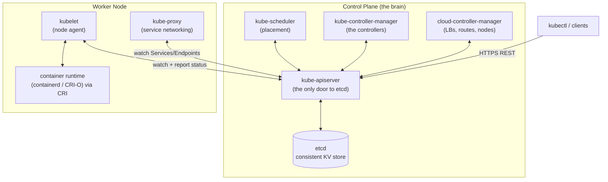
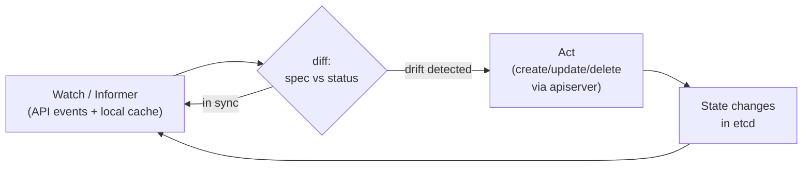
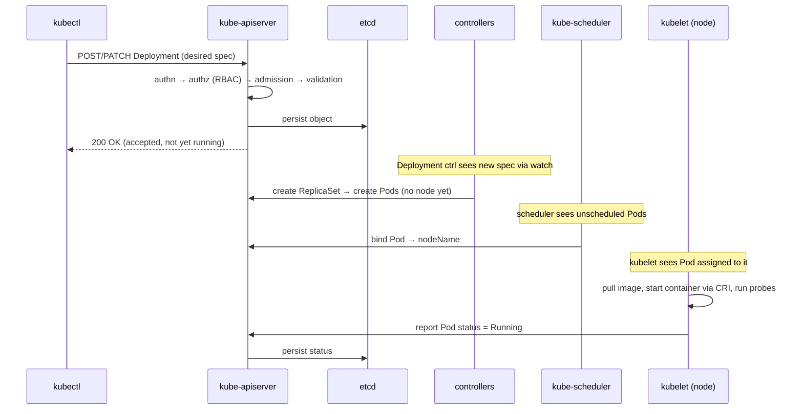

# 02 — Kubernetes Architecture & the Reconciliation Model

> **Audience:** Staff/principal engineers who already run containers and now need a precise mental model of *how Kubernetes actually works* — the control plane, the node agents, and the reconciliation loop that ties them together. We assume you know what a container is; if you want the kernel mechanics (namespaces, cgroups, runc, OCI images), read [../os_net/operating_system/07_virtualization_containers.md](../os_net/operating_system/07_virtualization_containers.md). This chapter is strictly about the *orchestration layer*.

---

## 1. What Kubernetes Is (and the Problem It Solves)

You have a fleet of machines and hundreds of containers. Someone has to decide *which container runs on which machine*, restart the ones that die, reschedule when a node fails, roll out new versions without downtime, wire up networking, and keep doing it at 3am without paging you. Doing this by hand (or with shell scripts and `ssh`) does not scale and is not self-healing.

Kubernetes is a **declarative container orchestrator**. You describe the *desired state* of the world — "I want 3 replicas of this image, reachable on port 80" — as data, and the system continuously works to make reality match that description.

The single most important idea in Kubernetes:

> **Desired state vs. actual state.** You declare *what* you want (the `spec`). The system observes *what is* (the `status`). Control loops continuously diff the two and take action to close the gap. Forever.

This is the opposite of imperative tooling ("run this command, then that command"). You never tell Kubernetes *how* to get from A to B; you tell it B, and it figures out the steps repeatedly. That property is what makes the system **self-healing** and **idempotent**: re-applying the same desired state is a no-op, and a node dying just becomes a new gap to close.

This chapter explains the components that store, observe, and act on that state.

---

## 2. The Big Picture: Control Plane + Nodes

A cluster is split into a **control plane** (the brain — stores state and makes decisions) and a set of **worker nodes** (the muscle — run your actual containers).



**Key invariant:** *Everything* goes through `kube-apiserver`. Components never talk to etcd or to each other directly. The scheduler does not call the kubelet; it writes a decision to the API, and the kubelet reads it. This hub-and-spoke design is why the system is loosely coupled and extensible.

---

## 3. Control Plane Components

### 3.1 `kube-apiserver` — the hub

The apiserver is the front door and the **only component that talks to etcd**. It exposes a RESTful API over HTTPS and is responsible for:

- **Authentication** (who are you? — certs, tokens, OIDC),
- **Authorization** (are you allowed? — RBAC),
- **Admission control** (should this be mutated/rejected? — webhooks, defaulting, quotas),
- **Validation** (is the object well-formed?),
- persisting accepted objects to etcd and serving **watch** streams to everyone else.

It is stateless and horizontally scalable — run several behind a load balancer. All cluster intelligence is *downstream* of the apiserver reading and writing objects.

### 3.2 etcd — the source of truth

[etcd](https://etcd.io) is a distributed, strongly-consistent key-value store. It holds the *entire* cluster state: every object, its spec, and its status.

- It uses the **Raft** consensus algorithm. A cluster of (usually) **3 or 5** members elects a leader; writes are committed only when a **quorum** (majority) acknowledges. Quorum is `floor(N/2)+1`, so 3 members tolerate 1 failure, 5 tolerate 2. Even numbers buy you nothing — never run 4.
- It is **latency-sensitive and disk-fsync-bound**. Every write must be durably persisted on a quorum of members before it returns. Slow or contended disks (or high network latency between members) directly slow down *every* API write.

> etcd is the most fragile and most important part of the cluster. Treat its disk like a database's: low-latency SSD/NVMe, dedicated I/O, regular backups (`etcdctl snapshot save`). If you lose etcd quorum without a backup, the cluster's declared state is gone.

### 3.3 `kube-scheduler` — placement

The scheduler watches for Pods with no assigned node (`spec.nodeName` is empty) and decides where each should run. It runs a two-phase algorithm:

1. **Filtering** — eliminate nodes that can't fit (insufficient CPU/memory, taints not tolerated, node selectors/affinity unmet).
2. **Scoring** — rank the survivors (spread, resource balance, affinity preferences) and pick the best.

Crucially, the scheduler does **not** start the container. It only writes the chosen `nodeName` back to the Pod object via the apiserver. The kubelet on that node notices and acts. See [03 — Workloads, Pods & Scheduling](03_workloads_pods_scheduling.md) for affinity, taints, and topology spread.

### 3.4 `kube-controller-manager` — the controllers

A single binary running dozens of **controllers** — the loops that implement reconciliation (Section 5). Examples: the Deployment controller (manages ReplicaSets), the ReplicaSet controller (manages Pod count), the Node controller (marks nodes NotReady), the Job, Endpoints, ServiceAccount, and namespace controllers. Each watches a resource type and drives actual toward desired.

### 3.5 `cloud-controller-manager` — provider glue

Separates cloud-specific logic so the core stays portable. It talks to the cloud API to provision **load balancers** (for `Service type=LoadBalancer`), configure **routes**, and reconcile **node** lifecycle (detecting deleted VMs). See [01 — Cloud Provider Foundations](01_cloud_provider_foundations.md).

### 3.6 HA control plane

For production, run **≥3 apiserver replicas** behind a load balancer (active/active, all stateless) and a **3- or 5-member etcd** cluster. The scheduler and controller-manager run multiple replicas but use **leader election** (a lease in the API) so only one instance is active at a time — they're active/passive, not active/active.

---

## 4. Node Components

Every worker node runs three things:

### 4.1 `kubelet` — the node agent

The kubelet is the per-node daemon and the workhorse. It:

- **watches** the apiserver for Pods assigned to *its* node,
- instructs the container runtime to pull images and start/stop containers,
- runs **liveness/readiness/startup probes**,
- mounts volumes and injects secrets/configmaps,
- continuously **reports node and Pod status** back to the apiserver (this is the `status` half of reconciliation).

The kubelet manages Pods, not bare containers. It is not managed by the control plane via RPC — it pulls its work by watching the API.

### 4.2 Container runtime via the CRI

The kubelet does not know how to run containers itself. It speaks the **Container Runtime Interface (CRI)**, a gRPC API, to a runtime such as **containerd** or **CRI-O**. The runtime pulls OCI images and uses a low-level runtime (`runc`) to create the container's namespaces and cgroups.

> Dockershim was removed in Kubernetes 1.24. Modern clusters use containerd or CRI-O directly. The low-level mechanics of namespaces, cgroups, OCI images, and `runc` are out of scope here — see [../os_net/operating_system/07_virtualization_containers.md](../os_net/operating_system/07_virtualization_containers.md).

### 4.3 `kube-proxy` — service networking

Implements the **Service** abstraction on each node. It watches Services and EndpointSlices and programs the kernel (via **iptables** or **IPVS**, or is replaced by an eBPF dataplane like Cilium) so that traffic to a stable virtual Service IP is load-balanced across the healthy backing Pods. Networking details live in a later chapter.

---

## 5. The Reconciliation Loop — the Central Concept

Everything above exists to serve one pattern. A **controller** is a loop that:

```text
forever:
    desired = read spec from API
    actual  = observe the world (status, runtime, cloud)
    if desired != actual:
        take action to converge toward desired
    # then loop again — even if nothing changed
```



### 5.1 Level-triggered, not edge-triggered

This is the deep insight. A controller does **not** react to *events* ("a Pod was deleted"); it reacts to the *current level* ("desired=3, observed=2, therefore create 1"). It periodically re-evaluates the whole desired-vs-actual gap regardless of what events fired.

Why this matters: edge-triggered systems lose correctness if they miss an event (controller restart, network blip, dropped message). A level-triggered controller that wakes up and re-reads the world always self-corrects — a missed event just means it converges on the next sync. **This is the property that makes Kubernetes self-healing.** Kill a Pod, lose a node, restart a controller — the next reconciliation pass closes the gap.

### 5.2 Informers, watches, and caches (the mechanics)

Polling the apiserver in a tight loop would melt it. Instead controllers use the **informer** pattern:

- A **watch** is a long-lived streaming connection: the apiserver pushes object change events (ADD/UPDATE/DELETE) as they happen.
- An **informer** consumes that watch and maintains a **local in-memory cache** (the "store") of the objects it cares about, plus an index. Reads hit the cache, not etcd.
- Changes are placed on a **work queue**; the controller's reconcile function dequeues a key, reads current state from the cache, and acts. A periodic **resync** re-enqueues everything to guarantee level-triggered correctness even with no events.

So "watch" gives timeliness, the local cache gives scalability, and the resync gives correctness. This is also exactly the machinery your own **operators** use (Section 6.5).

---

## 6. The API Model

### 6.1 Objects: kind / apiVersion / metadata / spec / status

Every Kubernetes object has the same shape:

```yaml
apiVersion: apps/v1          # API group + version
kind: Deployment             # the type
metadata:
  name: web
  namespace: shop
  labels:                    # for grouping/selection
    app: web
  annotations:               # arbitrary non-identifying metadata
    kubernetes.io/change-cause: "bump to v2"
spec:                        # DESIRED state — written by you
  replicas: 3
  selector:
    matchLabels: { app: web }
  template:
    metadata:
      labels: { app: web }
    spec:
      containers:
        - name: web
          image: registry.example.com/web:v2
status:                      # ACTUAL state — written by the controller
  availableReplicas: 3
  observedGeneration: 7
```

### 6.2 The spec/status split

This split *is* the reconciliation model in data form: **you own `spec`, the system owns `status`.** You declare intent in `spec`; controllers report observed reality in `status`. Never hand-edit `status` — it will be overwritten on the next reconcile.

### 6.3 `kubectl apply` and declarative config

```bash
kubectl apply -f deployment.yaml        # declare desired state; idempotent
kubectl apply -k ./overlays/prod        # kustomize: declarative overlays
kubectl diff  -f deployment.yaml        # preview the gap before applying
```

`apply` is declarative: it computes a 3-way merge between your file, the live object, and the last-applied config. Run it twice with no changes → nothing happens. Contrast with imperative `kubectl create`/`edit`/`scale`, which describe actions, not desired state. Keep your YAML in git as the source of truth (GitOps).

### 6.4 Labels, selectors, annotations, namespaces, API groups

| Concept | Purpose |
|---|---|
| **Labels** | Identifying key/value tags used to *select* sets of objects (`app=web`). The glue between Deployments→Pods, Services→Pods. |
| **Selectors** | Queries over labels (`app=web,env in (prod,staging)`). |
| **Annotations** | Non-identifying metadata (changelogs, tool config). Not selectable. |
| **Namespaces** | Virtual cluster partitions for scoping names, RBAC, and quotas. Not a hard security boundary by themselves. |
| **API groups** | Versioned namespaces for kinds: core (`v1`), `apps/v1`, `batch/v1`, `networking.k8s.io/v1`, etc. Enables independent evolution. |

```bash
kubectl get pods -l 'app=web,env in (prod,staging)'   # selector query
kubectl get pods -A                                    # across all namespaces
```

### 6.5 CRDs — extension as a first-class citizen

A **CustomResourceDefinition** registers a brand-new object kind. The apiserver then stores, validates, and serves your `kind: Database` objects exactly like built-ins. Pair a CRD with a custom controller (an **operator**) using the same informer/watch/reconcile machinery from Section 5, and you've taught Kubernetes to manage *your* domain declaratively. CRDs are how the entire ecosystem (cert-manager, Istio, Argo, Prometheus Operator) extends the platform without forking it.

---

## 7. A Request's Life: `kubectl apply` → Running Pod



The reply to `apply` means **"accepted and stored,"** not "running." Everything after is asynchronous reconciliation: controllers create child objects, the scheduler binds, the kubelet runs, and status flows *back* through the apiserver into etcd — where you can observe it with `kubectl get`.

---

## 8. Managed Kubernetes (EKS / GKE / AKS)

With a managed offering the provider runs and operates the **control plane** for you:

| Layer | Managed service runs it | You run / own it |
|---|---|---|
| etcd | ✅ provider (backed up, HA) | ❌ |
| apiserver / scheduler / controller-manager | ✅ provider (patched, HA) | ❌ |
| Control-plane upgrades | ✅ provider-assisted | trigger + validate |
| Worker nodes (VMs, kubelet, runtime) | sometimes (node pools / autopilot) | ✅ usually |
| Your workloads, RBAC, quotas, networking policy | ❌ | ✅ all yours |

You typically cannot SSH to the control plane or read etcd directly — you get an apiserver endpoint and an SLA. You still own node sizing, autoscaling, security context, and *all* your workloads. See [01 — Cloud Provider Foundations](01_cloud_provider_foundations.md) for IAM and VPC integration.

---

## 9. Symptom / Cause / Fix

**etcd slow → the whole cluster is slow**
- **Symptom:** `kubectl` commands lag for seconds; high apiserver request latency; controllers fall behind.
- **Cause:** etcd writes are quorum + fsync bound. Slow/contended disk, network latency between members, a huge object count, or oversized objects (large ConfigMaps/Secrets, leaked events) blow up write latency. Every API write waits on it.
- **Fix:** Put etcd on low-latency dedicated SSD/NVMe; watch `etcd_disk_wal_fsync_duration_seconds` and `etcd_server_leader_changes_seen_total`; keep the DB under the (default 2–8 GB) quota and defrag/compact; remove churny objects; don't store bulk data in the API. See [09 — Observability & Day-2 Operations](09_observability_day2_operations.md).

**apiserver throttling (HTTP 429)**
- **Symptom:** Clients/controllers get `429 Too Many Requests` or "client-side throttling"; reconciliation stalls.
- **Cause:** A hot client (a misbehaving controller, a tight `kubectl get` loop, an operator with no rate limiting) exceeds API Priority and Fairness (APF) limits or client-side QPS.
- **Fix:** Identify the noisy client (audit logs, APF metrics `apiserver_flowcontrol_*`); fix it to use **informers/watches instead of polling**; tune APF FlowSchemas/PriorityLevels; raise client QPS/burst only if justified.

**Node NotReady**
- **Symptom:** A node shows `NotReady`; its Pods get evicted/rescheduled after the toleration window.
- **Cause:** The kubelet stopped posting heartbeats (node leases) — kubelet crashed, the container runtime is down, the node lost network to the apiserver, or it's out of disk/memory (kubelet self-protects).
- **Fix:** `kubectl describe node <n>` for conditions (MemoryPressure/DiskPressure/PIDPressure); check `kubelet` and `containerd`/`crio` services on the host; verify connectivity to the apiserver and disk space. The Node controller will mark it and the scheduler reschedules its Pods elsewhere — self-healing in action.

---

> Next: [03 — Workloads, Pods & Scheduling](03_workloads_pods_scheduling.md) — now that you know *how* the machine thinks, we'll put workloads on it: Pods, controllers (Deployments/StatefulSets/DaemonSets/Jobs), and exactly how the scheduler decides where each Pod lands.
