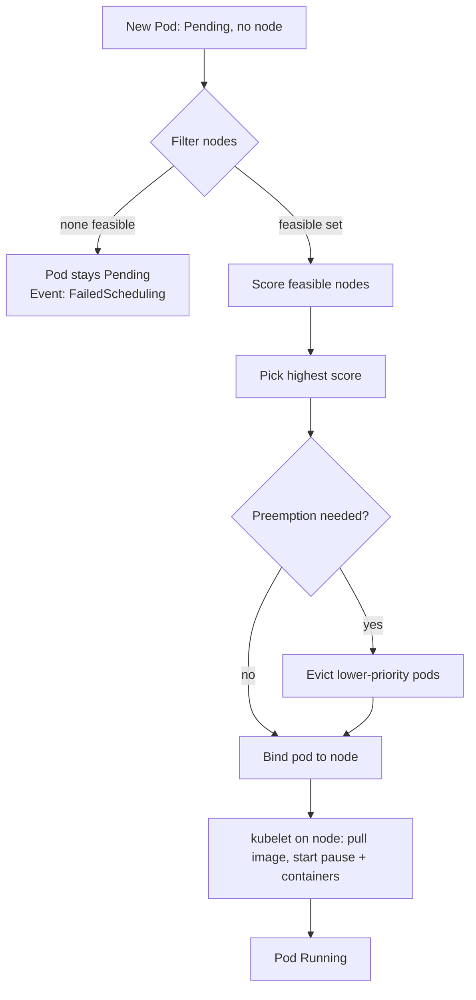

# 03 — Workloads, Pods & Scheduling

> **Audience:** Staff/principal engineers who already run Kubernetes in production and need a precise mental model of *how pods get scheduled, why they get evicted, and why they crash*. We assume you've read [02 — Kubernetes Architecture](02_kubernetes_architecture.md) and know what the scheduler, kubelet, and API server are. This chapter is the load-bearing one: most production incidents are scheduling, resource, or probe misconfigurations — not exotic bugs.

---

## 1. The Pod: the atomic unit

A Pod is the smallest deployable unit — not a container. It's a **shared execution context**: one or more containers that share a network namespace (same IP, same `localhost`, same port space), share IPC, and can share volumes. You never schedule a bare container; you schedule a Pod.

### 1.1 The pause container

Every Pod has a hidden **pause container** (the "infra" or "sandbox" container). It is created first, holds the network and IPC namespaces open, and does nothing but `pause()` on a signal. App containers *join* its namespaces. This is why a container can crash and restart while the Pod keeps its IP: the pause container — not the app — owns the namespace.

```bash
# On a node, you'll see one pause container per pod
crictl ps -a | grep pause
# Each app container shares the pause container's netns → same IP, same localhost
```

### 1.2 Multi-container pods & the sidecar pattern

Containers in the same Pod are co-scheduled, co-located, and share `localhost`. Use this only when containers are *tightly* coupled.

```yaml
apiVersion: v1
kind: Pod
metadata:
  name: web-with-sidecar
spec:
  # Init containers run to completion, in order, BEFORE app containers start.
  initContainers:
    - name: fetch-config
      image: busybox:1.36
      command: ["sh", "-c", "wget -O /work/config.json http://config-svc/app"]
      volumeMounts:
        - { name: shared, mountPath: /work }
  containers:
    - name: app                       # main container
      image: myapp:1.4.2
      ports: [{ containerPort: 8080 }]
      volumeMounts:
        - { name: shared, mountPath: /etc/app }
    - name: log-shipper               # classic sidecar (pre-1.28 style)
      image: fluent-bit:2.2
      volumeMounts:
        - { name: shared, mountPath: /etc/app }
  volumes:
    - name: shared
      emptyDir: {}
```

**Init containers** run sequentially to completion before app containers start — use for migrations, waiting on dependencies, fetching secrets. If an init container fails, the Pod restarts it (subject to `restartPolicy`) and never starts the app.

**Native sidecars (1.28+, stable 1.29):** A sidecar is now an *init container with `restartPolicy: Always`*. The key wins over the old pattern: it starts **before** main containers (so the proxy/log shipper is ready first), stays running during the main phase, and — critically — **does not block Job completion** and is terminated *after* the main containers on shutdown.

```yaml
spec:
  initContainers:
    - name: istio-proxy
      image: istio/proxyv2:1.21
      restartPolicy: Always          # <-- makes this a NATIVE SIDECAR
  containers:
    - name: app
      image: myapp:1.4.2
```

### 1.3 Pod lifecycle / phases

| Phase | Meaning |
|---|---|
| `Pending` | Accepted by API server, not yet running (unscheduled, or pulling images). |
| `Running` | Bound to a node; at least one container started. |
| `Succeeded` | All containers exited 0 (Jobs). |
| `Failed` | All containers terminated, at least one non-zero. |
| `Unknown` | Node unreachable. |

Container states within a Pod: `Waiting` (e.g. `CrashLoopBackOff`, `ImagePullBackOff`), `Running`, `Terminated`. The `restartPolicy` (`Always`/`OnFailure`/`Never`) governs restarts.

---

## 2. Controllers / workload types

You almost never create bare Pods. Controllers reconcile desired vs actual state. Pick the right one:

| Workload | Identity | Use for | Key behavior |
|---|---|---|---|
| **Deployment** | Interchangeable, random names | Stateless services (APIs, web) | Owns a ReplicaSet; rolling updates & rollback |
| **StatefulSet** | Stable, ordinal (`db-0`, `db-1`) | Databases, Kafka, clustered apps | Ordered create/delete, stable per-pod PVC & DNS |
| **DaemonSet** | One per (matching) node | Node agents: CNI, logging, metrics | Auto-scales with node count |
| **Job** | Run-to-completion | Batch, migrations | Retries to success, then stops |
| **CronJob** | Scheduled Jobs | Periodic batch | Spawns Jobs on a cron schedule |

### 2.1 Deployment (stateless)

A Deployment manages a **ReplicaSet** (which manages Pods). Updating the pod template creates a *new* ReplicaSet and rolls traffic over.

```yaml
apiVersion: apps/v1
kind: Deployment
metadata: { name: api }
spec:
  replicas: 6
  selector: { matchLabels: { app: api } }
  strategy:
    type: RollingUpdate
    rollingUpdate:
      maxSurge: 1            # at most 1 extra pod above replicas during rollout
      maxUnavailable: 0      # never drop below desired count (zero-downtime)
  template:
    metadata: { labels: { app: api } }
    spec:
      containers:
        - name: api
          image: myapp:1.4.2
```

```bash
kubectl rollout status deploy/api          # watch the rollout
kubectl rollout history deploy/api         # revision list
kubectl rollout undo deploy/api            # roll back to previous ReplicaSet
kubectl rollout undo deploy/api --to-revision=3
```

### 2.2 StatefulSet (stable identity & storage)

For data systems where pod `N` must keep the *same* persistent volume and a stable network name. See [05 — Storage & Stateful Workloads](05_storage_stateful_workloads.md) for the storage half.

```yaml
apiVersion: apps/v1
kind: StatefulSet
metadata: { name: pg }
spec:
  serviceName: pg-headless        # stable DNS: pg-0.pg-headless, pg-1.pg-headless
  replicas: 3
  selector: { matchLabels: { app: pg } }
  template:
    metadata: { labels: { app: pg } }
    spec:
      containers:
        - name: pg
          image: postgres:16
          volumeMounts: [{ name: data, mountPath: /var/lib/postgresql/data }]
  volumeClaimTemplates:           # each pod gets its OWN PVC, kept across restarts
    - metadata: { name: data }
      spec:
        accessModes: ["ReadWriteOnce"]
        resources: { requests: { storage: 50Gi } }
```

### 2.3 DaemonSet & Job/CronJob

```yaml
apiVersion: apps/v1
kind: DaemonSet
metadata: { name: node-exporter }
spec:
  selector: { matchLabels: { app: node-exporter } }
  template:
    metadata: { labels: { app: node-exporter } }
    spec:
      tolerations:                       # so it ALSO lands on tainted/control-plane nodes
        - { operator: "Exists" }
      containers: [{ name: ne, image: prom/node-exporter:1.7 }]
---
apiVersion: batch/v1
kind: CronJob
metadata: { name: nightly-report }
spec:
  schedule: "0 2 * * *"                   # 02:00 daily
  concurrencyPolicy: Forbid              # don't overlap runs
  jobTemplate:
    spec:
      backoffLimit: 3                     # retries before marking Failed
      template:
        spec:
          restartPolicy: OnFailure
          containers: [{ name: report, image: reporter:2.0 }]
```

---

## 3. Requests & limits — the most important scheduling concept

> If you internalize one thing in this chapter, make it this section.

- **`requests`** = what the scheduler *reserves*. It is the basis for the bin-packing decision. A pod is only placed on a node with enough *unreserved* (allocatable) capacity for its requests.
- **`limits`** = the hard ceiling the kubelet/cgroup enforces at runtime.

CPU and memory behave **completely differently**:

| Resource | Unit | Compressible? | Exceed the limit → |
|---|---|---|---|
| **CPU** | millicores (`500m` = 0.5 core) | Yes | **Throttled** (CFS), pod survives |
| **Memory** | bytes (`512Mi`, `2Gi`) | No | **OOMKilled** (container killed) |

CPU is *compressible*: over the limit, the kernel CFS scheduler throttles you — latency rises, nothing dies. Memory is *incompressible*: there is no "use less for a moment," so the cgroup OOM killer terminates the container. CPU throttling mechanics (CFS quota/period) are covered in [../os_net/enterprise_scenarios/01_cpu_memory_incidents.md](../os_net/enterprise_scenarios/01_cpu_memory_incidents.md).

### 3.1 QoS classes & eviction order

The combination of requests/limits assigns a QoS class, which determines *eviction priority* under node memory pressure (BestEffort dies first):

| QoS class | Condition | Evicted |
|---|---|---|
| **Guaranteed** | requests == limits for *every* container, both CPU & memory set | Last |
| **Burstable** | requests set but < limits (or partial) | Middle |
| **BestEffort** | no requests or limits at all | **First** |

### 3.2 The tuning art — WRONG then RIGHT

```yaml
# WRONG #1 — no requests at all (BestEffort). First to be evicted, can be
# scheduled onto a node with nothing left, starves under contention.
containers:
  - name: api
    image: myapp:1.4.2
    # resources: {}   <-- implicit, the #1 beginner mistake
```

```yaml
# WRONG #2 — CPU limit == request set artificially low. CPU is compressible,
# so a tight CPU *limit* just throttles you under load for no benefit and
# tanks p99 latency. Don't cap CPU just because you cap memory.
resources:
  requests: { cpu: "250m", memory: "256Mi" }
  limits:   { cpu: "250m", memory: "256Mi" }   # CPU ceiling causes throttling
```

```yaml
# RIGHT — request what you typically need; pin memory limit == request
# (so memory is Guaranteed and predictable); leave CPU limit OFF or generous
# (let it burst). Measure with actual usage data, don't guess.
resources:
  requests: { cpu: "500m", memory: "512Mi" }
  limits:   {            memory: "512Mi" }   # mem limit == request; no cpu limit
```

**Rules of thumb for staff engineers:**
- **Always set memory request == memory limit** for latency-sensitive services → Guaranteed-ish memory, no surprise OOM from overcommit.
- **Set CPU request, usually omit CPU limit** (or set it well above request). Throttling a healthy service to enforce an arbitrary CPU cap is self-harm. See [07 — Scaling & Autoscaling](07_scaling_autoscaling.md) — HPA scales on CPU *request* utilization.
- Right-size requests from real data (VPA in recommend mode, or metrics). Inflated requests waste capacity (poor bin-packing); deflated requests cause noisy-neighbor and eviction.

---

## 4. The scheduler

The kube-scheduler watches for unscheduled pods and binds each to a node in two phases:

1. **Filtering (predicates):** eliminate nodes that *can't* run the pod — insufficient allocatable resources, unsatisfied `nodeSelector`/affinity, untolerated taints, volume zone mismatch.
2. **Scoring (priorities):** rank the remaining feasible nodes (spread, least/most allocated, affinity preferences) and pick the highest; bind via the API server.



### 4.1 nodeSelector & node affinity

```yaml
# Simplest: hard requirement on a node label.
spec:
  nodeSelector: { disktype: ssd }
```

```yaml
# Node affinity: required (hard) + preferred (soft).
spec:
  affinity:
    nodeAffinity:
      requiredDuringSchedulingIgnoredDuringExecution:
        nodeSelectorTerms:
          - matchExpressions:
              - { key: kubernetes.io/arch, operator: In, values: ["amd64"] }
      preferredDuringSchedulingIgnoredDuringExecution:
        - weight: 100
          preference:
            matchExpressions:
              - { key: node-type, operator: In, values: ["compute"] }
```

### 4.2 Pod anti-affinity & topology spread (HA)

To survive a node or AZ failure, spread replicas. **Pod anti-affinity** repels replicas from each other; **topology spread constraints** are the modern, cheaper, more expressive way to do the same.

```yaml
# Spread replicas evenly across zones; allow at most 1 skew.
spec:
  topologySpreadConstraints:
    - maxSkew: 1
      topologyKey: topology.kubernetes.io/zone
      whenUnsatisfiable: DoNotSchedule        # hard: don't pile into one zone
      labelSelector: { matchLabels: { app: api } }
    - maxSkew: 1
      topologyKey: kubernetes.io/hostname
      whenUnsatisfiable: ScheduleAnyway       # soft: prefer per-node spread
      labelSelector: { matchLabels: { app: api } }
```

### 4.3 Taints & tolerations (dedicated nodes)

A **taint** on a node repels pods that don't **tolerate** it. Used for dedicated node pools (GPU, special hardware) and to keep workloads off control-plane nodes.

```bash
# Reserve GPU nodes: only pods that tolerate this taint can land here.
kubectl taint nodes gpu-1 dedicated=gpu:NoSchedule
```

```yaml
spec:
  tolerations:
    - { key: "dedicated", operator: "Equal", value: "gpu", effect: "NoSchedule" }
  nodeSelector: { hardware: gpu }   # toleration ALLOWS; selector ATTRACTS — use both
```

> Toleration ≠ attraction. A toleration only *permits* a pod onto a tainted node; it does not *pull* it there. Pair with `nodeSelector`/affinity to actually target the pool.

### 4.4 Priority & preemption

PriorityClasses let critical pods preempt (evict) lower-priority pods when the cluster is full.

```yaml
apiVersion: scheduling.k8s.io/v1
kind: PriorityClass
metadata: { name: high-priority }
value: 1000000
globalDefault: false
description: "Critical online services"
```

---

## 5. Health probes

Three probe types, three *different* consequences. Confusing them is a top cause of self-inflicted outages.

| Probe | Fails → action | Purpose |
|---|---|---|
| **liveness** | **Restart the container** | Detect deadlock/wedge |
| **readiness** | **Remove from Service endpoints** (no restart) | Don't send traffic until ready / during overload |
| **startup** | **Restart**, but holds off liveness/readiness until it passes | Slow-starting apps (JVM, large caches) |

```yaml
containers:
  - name: api
    image: myapp:1.4.2
    startupProbe:                  # gives slow starters up to 5*30s = 150s
      httpGet: { path: /healthz, port: 8080 }
      failureThreshold: 30
      periodSeconds: 5
    readinessProbe:                # gate traffic; cheap, fast
      httpGet: { path: /ready, port: 8080 }
      periodSeconds: 5
    livenessProbe:                 # restart only on real wedge
      httpGet: { path: /healthz, port: 8080 }
      periodSeconds: 10
      failureThreshold: 3
      timeoutSeconds: 2
```

```yaml
# WRONG — liveness probe that depends on the database. When the DB blips,
# EVERY replica fails liveness and gets restarted simultaneously → a healthy
# app is killed cluster-wide, turning a transient dependency hiccup into an outage.
livenessProbe:
  httpGet: { path: /healthz?check=db, port: 8080 }   # checks downstream deps
  failureThreshold: 1                                  # flaps instantly
```

```yaml
# RIGHT — liveness checks ONLY the process itself (am I wedged?). Dependency
# health belongs in READINESS, which sheds traffic without killing the pod.
livenessProbe:
  httpGet: { path: /livez, port: 8080 }   # returns 200 if the event loop runs
  failureThreshold: 3                       # tolerate transient blips
  periodSeconds: 10
```

**Probe rules:** liveness = "is the process wedged?" (cheap, no dependencies). readiness = "should I get traffic *right now*?" (may check deps). startup = give slow boots room *before* liveness can kill them.

---

## 6. Resource management at scale

- **Bin-packing:** scheduler packs pods onto nodes by *requests*. Accurate requests = efficient packing. Over-requesting strands capacity; under-requesting causes contention.
- **Overcommit:** because limits > requests, total limits can exceed node capacity. This is intentional density — but a spike can drive memory pressure and trigger evictions. Keep critical workloads Guaranteed.
- **LimitRange** (per namespace): default requests/limits and min/max, so no pod sneaks in as BestEffort.
- **ResourceQuota** (per namespace): cap aggregate requests/limits and object counts per team.

```yaml
apiVersion: v1
kind: LimitRange
metadata: { name: defaults, namespace: team-a }
spec:
  limits:
    - type: Container
      default:        { cpu: "500m", memory: "512Mi" }   # applied if limits omitted
      defaultRequest: { cpu: "250m", memory: "256Mi" }   # applied if requests omitted
---
apiVersion: v1
kind: ResourceQuota
metadata: { name: quota, namespace: team-a }
spec:
  hard:
    requests.cpu: "20"
    requests.memory: 40Gi
    limits.cpu: "40"
    pods: "100"
```

---

## 7. Symptom / Cause / Fix

**Pod stuck `Pending` forever**
- *Symptom:* `kubectl get pod` shows `Pending`; `describe` shows `FailedScheduling`.
- *Cause:* No feasible node — insufficient allocatable CPU/memory for *requests*, an untolerated taint, an unsatisfiable affinity/topology constraint, or no node in the required volume zone.
- *Fix:* `kubectl describe pod` → read the event. Lower requests, add a toleration, relax `whenUnsatisfiable: DoNotSchedule` → `ScheduleAnyway`, or add capacity (cluster autoscaler — see [07 — Scaling & Autoscaling](07_scaling_autoscaling.md)).

**`CrashLoopBackOff`**
- *Symptom:* Container restarts repeatedly with growing backoff.
- *Cause:* App exits non-zero (bad config/missing secret/dependency), a too-aggressive liveness probe, or it crashes on startup before readiness.
- *Fix:* `kubectl logs <pod> --previous` for the dying container's logs; check `describe` for the exit code and probe events; verify env/secrets/init containers.

**`OOMKilled`**
- *Symptom:* `describe` shows `Last State: Terminated, Reason: OOMKilled (exit 137)`.
- *Cause:* Container exceeded its **memory limit** (incompressible) — leak, large request, or under-set limit.
- *Fix:* Raise the memory limit, fix the leak, or set request==limit for predictability. Profile heap usage. See [../os_net/enterprise_scenarios/01_cpu_memory_incidents.md](../os_net/enterprise_scenarios/01_cpu_memory_incidents.md).

**"All replicas landed on one node, then it died"**
- *Symptom:* A node failure took the whole service down despite `replicas: 6`.
- *Cause:* No anti-affinity / topology spread — the scheduler bin-packed all replicas onto one underutilized node.
- *Fix:* Add `topologySpreadConstraints` across `kubernetes.io/hostname` and `topology.kubernetes.io/zone` (§4.2). Use a PodDisruptionBudget too — see [09 — Observability & Day-2 Operations](09_observability_day2_operations.md).

**"Liveness probe is killing healthy pods"**
- *Symptom:* Pods restart during traffic spikes or dependency blips; restarts cascade.
- *Cause:* Liveness probe checks downstream dependencies, has `failureThreshold: 1`, or a `timeoutSeconds` shorter than a GC pause / slow start.
- *Fix:* Move dependency checks to *readiness*; keep liveness self-only with `failureThreshold: 3+`; add a `startupProbe` for slow boots (§5).

---

> Next: [04 — Kubernetes Networking](04_kubernetes_networking.md) — how that shared Pod IP actually routes: CNI, Services, kube-proxy/IPVS, DNS, and Ingress/Gateway. We'll trace a packet from client to container and back.
