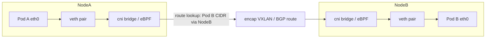
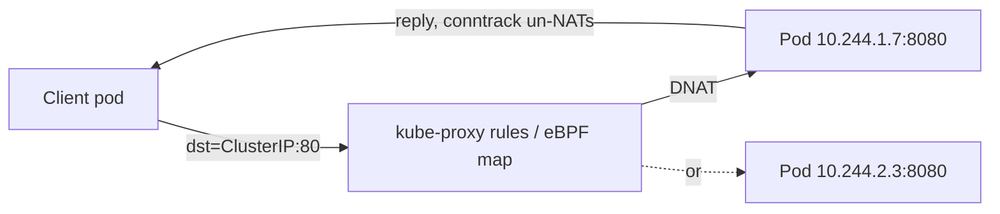
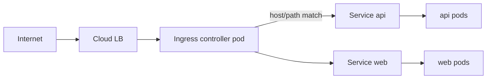

# 04 — Kubernetes Networking

> **Audience:** Staff/principal engineers who already know TCP/IP, DNS, NAT, and load balancing at the OS level. This chapter is about how Kubernetes *layers* networking on top of those primitives — the flat pod network, CNI, Services, kube-proxy, DNS, Ingress, NetworkPolicy, and service mesh. For the fundamentals (how DNS resolution actually works, how L4/L7 load balancers behave, how cloud SDN/overlays are built), follow the cross-references into the sibling [os_net networking reference](../os_net/comp_networking/05_dns.md). We do not re-teach them here.

---

## 1. The Kubernetes network model — the four rules

Kubernetes does not invent a networking stack. It defines a **contract** that any implementation must satisfy, then delegates the implementation to a CNI plugin. The contract is deliberately small:

1. **Every pod gets its own unique, routable IP address.** Not a port on a shared host IP — a real IP.
2. **Pods can communicate with all other pods on any node without NAT.** The IP a pod sees as its own is the same IP other pods use to reach it.
3. **Agents on a node (kubelet, system daemons) can reach all pods on that node.**
4. **Pods in the host network namespace are an explicit exception** (`hostNetwork: true`).

This is the **"IP-per-pod" flat network model**. The mental model is: a pod behaves like a tiny VM with its own network interface. Containers *inside* a pod share that one network namespace — they reach each other over `localhost` and must not collide on ports.

### Why this differs from Docker default

Docker's default bridge networking gives each container a private IP on a per-host `docker0` bridge (e.g. `172.17.0.0/16`), and containers reach the outside world via **SNAT** through the host. Cross-host container traffic requires **published ports** (`-p 8080:80`) and explicit DNAT. Two containers on different hosts cannot address each other directly.

Kubernetes rejects this. NAT between pods destroys the assumption that "the IP I bind to is the IP others use to reach me," which breaks peer discovery, return-path routing, and connection logging. The flat model means application code never has to reason about host boundaries.

> The trade-off: you now need a real network implementation that makes every pod IP routable across the cluster. That is what CNI provides.

See [02 — Kubernetes Architecture](02_kubernetes_architecture.md) for how kubelet invokes the CNI plugin during pod sandbox creation.

---

## 2. CNI — the Container Network Interface

CNI is a thin spec: when the kubelet creates a pod sandbox, it calls the configured CNI plugin binary with `ADD` (and `DEL` on teardown). The plugin's job: create/attach the pod's network interface, assign an IP from an IPAM pool, and program routes so the four rules hold. The kubelet does **not** care *how*.

```bash
# CNI config lives here; kubelet reads the first file lexically
ls /etc/cni/net.d/
# 10-calico.conflist
# Plugin binaries:
ls /opt/cni/bin/   # calico, host-local, portmap, loopback, ...
```

| CNI | Data plane | Policy | Notable for |
|-----|-----------|--------|-------------|
| **Calico** | BGP-routed (or VXLAN overlay) | Rich `NetworkPolicy` + Calico CRDs | Pod IPs advertised via BGP; near-native performance, no overlay tax if L3 fabric cooperates |
| **Cilium** | **eBPF** | eBPF-based, L3–L7 policy | Modern default; can **replace kube-proxy**, Hubble observability, ambient mesh |
| **flannel** | VXLAN overlay (usually) | None (pair with Calico for policy) | Simplest; good for learning / small clusters |
| **AWS VPC CNI** | Real VPC IPs via ENIs | Via Calico/Cilium add-on | Pods are first-class VPC citizens; **IP-exhaustion gotcha** (see §11) |
| Azure CNI / GKE | Native VNet/VPC IPs | Cloud + add-on | Same "real IP" model as AWS |

**Overlay vs underlay.** Overlay CNIs (flannel VXLAN, Calico in VXLAN mode) encapsulate pod packets inside node-to-node UDP — works on any L3 network but adds MTU overhead and CPU. Underlay/routed CNIs (Calico BGP, AWS VPC CNI) make pod IPs natively routable — faster, but require the fabric (or VPC) to know the routes. For the underlying SDN/overlay mechanics see [../os_net/comp_networking/10_cloud_sdn_overlays.md](../os_net/comp_networking/10_cloud_sdn_overlays.md).

### Pod-to-pod packet path (same overlay CNI)



Pod A's packet leaves via a `veth` into the node's root namespace. A route says "Pod B's /24 lives on Node B." Overlay CNIs encapsulate and ship it node-to-node; routed CNIs just forward it because the fabric has the route. On Node B the reverse path delivers it to Pod B's `veth`. **No NAT touches the pod IPs.**

---

## 3. Services — stable VIPs over ephemeral pods

Pods are cattle: they die, reschedule, and get new IPs. A **Service** is the stable abstraction — a long-lived name and virtual IP that fronts a *changing set* of pod endpoints selected by label.

| Type | What it gives you | Reachable from | Typical use |
|------|------------------|----------------|-------------|
| **ClusterIP** (default) | A cluster-internal virtual IP | Inside cluster only | East-west service-to-service |
| **NodePort** | ClusterIP + a port (30000–32767) on **every** node | Outside, via any node IP | Bare-metal, behind an external LB |
| **LoadBalancer** | NodePort + provisions a **cloud LB** | Internet / VPC | North-south ingress on cloud |
| **Headless** (`clusterIP: None`) | **No VIP**; DNS returns pod IPs directly | Inside cluster | StatefulSets, client-side LB, peer discovery |
| **ExternalName** | CNAME to an external DNS name | Inside cluster | Aliasing an external dependency |

```yaml
apiVersion: v1
kind: Service
metadata: { name: payments }
spec:
  selector: { app: payments }    # selects pods by label
  ports:
    - port: 80                   # the Service (VIP) port
      targetPort: 8080           # the container port
```

### EndpointSlices

The Service controller watches pods matching the selector **and** that are `Ready`, and writes their IP:port pairs into **EndpointSlices** (the scalable successor to the single `Endpoints` object — large Services shard across multiple slices instead of one giant object that thrashes etcd and watchers).

```bash
kubectl get endpointslices -l kubernetes.io/service-name=payments
# If this is EMPTY, the Service has no backends — see §11.
```

A **headless** Service skips the VIP entirely: DNS returns the *set of pod IPs*, so a StatefulSet client can address `pod-0.payments.ns.svc.cluster.local` for stable per-pod identity. See [05 — Storage & Stateful Workloads](05_storage_stateful_workloads.md).

For L4 vs L7 load-balancer semantics behind `LoadBalancer`/`NodePort`, see [../os_net/comp_networking/07_load_balancing_proxies.md](../os_net/comp_networking/07_load_balancing_proxies.md).

---

## 4. kube-proxy — making the VIP real

A ClusterIP is **fictional**: no interface owns it, nothing answers ARP for it. Something must intercept traffic to that VIP and DNAT it to a real pod IP. That something is **kube-proxy** (or its replacement). It watches Services and EndpointSlices and programs the node's data plane.

| Mode | Mechanism | Scaling | Notes |
|------|-----------|---------|-------|
| **iptables** | Linear-ish chains of DNAT rules + random selection | O(n) rule eval; slow at thousands of Services | Default for years; correct but rule churn hurts at scale |
| **IPVS** | In-kernel L4 LB (hash tables) | O(1) lookup; real LB algorithms (rr, lc, sh) | Better at scale; needs IPVS kernel modules |
| **eBPF (Cilium)** | Replaces kube-proxy entirely | Hash-map lookup in eBPF | No iptables churn, lower latency, native to Cilium |

### How a ClusterIP gets DNAT'd (iptables mode, conceptually)

```bash
# Pod connects to 10.96.0.50:80 (the ClusterIP)
# PREROUTING/OUTPUT -> KUBE-SERVICES chain matches dst 10.96.0.50:80
#   -> KUBE-SVC-XXXX (picks an endpoint by probability)
#     -> KUBE-SEP-AAAA: DNAT to 10.244.1.7:8080  (pod A)
#     -> KUBE-SEP-BBBB: DNAT to 10.244.2.3:8080  (pod B)
# conntrack remembers the choice so the whole connection sticks to one pod
```



The selection is **per-connection**, not per-packet, because conntrack pins the flow. With **Cilium kube-proxy replacement**, the same logic runs as eBPF programs attached at the socket/TC layer — no iptables, no `KUBE-SVC` chains.

---

## 5. DNS — CoreDNS and service discovery

**CoreDNS** runs as a Deployment in `kube-system`, fronted by a ClusterIP Service (conventionally `10.96.0.10`) injected into every pod's `/etc/resolv.conf`.

```
# A pod's /etc/resolv.conf
nameserver 10.96.0.10
search myns.svc.cluster.local svc.cluster.local cluster.local
options ndots:5
```

**Service DNS names:** `<service>.<namespace>.svc.cluster.local`. Within the same namespace, `payments` resolves via the `search` suffixes. Headless services and StatefulSet pods also get `<pod>.<service>.<namespace>.svc.cluster.local`.

### The `ndots:5` performance trap

`ndots:5` means: any name with **fewer than 5 dots** gets each `search` suffix appended and tried first. So resolving `api.github.com` (2 dots) issues `api.github.com.myns.svc.cluster.local`, `...svc.cluster.local`, `...cluster.local` — all NXDOMAIN — **before** the real query. That is 4+ round trips per external lookup, doubled for A + AAAA.

- **Symptom:** external calls intermittently slow by ~5s (resolver timeout) under load.
- **Fixes:** use a **trailing dot** (`api.github.com.`) for FQDNs; lower `ndots` per-pod via `dnsConfig`; run **NodeLocal DNSCache** to terminate retries locally; scale CoreDNS and tune cache TTLs.

DNS is one of the most common cluster-wide latency bottlenecks. For the mechanics of why these round trips and timeouts cost what they do, see [../os_net/comp_networking/05_dns.md](../os_net/comp_networking/05_dns.md).

---

## 6. Ingress — L7 HTTP routing into the cluster

A `LoadBalancer` Service per microservice means one cloud LB (and bill) per service. **Ingress** consolidates: one entrypoint, L7 routing by host/path to many backend Services, plus **TLS termination**.

```yaml
apiVersion: networking.k8s.io/v1
kind: Ingress
metadata:
  name: web
  annotations: { nginx.ingress.kubernetes.io/ssl-redirect: "true" }
spec:
  tls:
    - hosts: [shop.example.com]
      secretName: shop-tls          # cert/key from a Secret (see chapter 06)
  rules:
    - host: shop.example.com
      http:
        paths:
          - path: /api
            pathType: Prefix
            backend: { service: { name: api, port: { number: 80 } } }
```

The `Ingress` object is inert without an **Ingress controller** — ingress-nginx, Envoy-based (Contour, Emissary), Traefik, or a cloud ALB controller — that watches Ingress objects and reconfigures its proxy.



### Gateway API — the modern successor

Ingress overloaded vendor-specific annotations for anything beyond host/path. **Gateway API** (GA) is the role-oriented, extensible replacement: `GatewayClass` (infra), `Gateway` (listeners/ports/TLS, owned by platform), and `HTTPRoute`/`TCPRoute`/`GRPCRoute` (owned by app teams). It models L4 and L7, header-based routing, and traffic splitting as first-class fields — no annotation soup. New designs should prefer Gateway API.

---

## 7. NetworkPolicy — default-allow to zero-trust

By default, **every pod can talk to every pod** — the flat model is wide open. **NetworkPolicy** restricts this. The key inversion: as soon as *any* policy selects a pod for a direction (ingress/egress), that pod becomes **default-deny** for that direction, and you must explicitly allow what you want.

```yaml
apiVersion: networking.k8s.io/v1
kind: NetworkPolicy
metadata: { name: payments-allow }
spec:
  podSelector: { matchLabels: { app: payments } }
  policyTypes: [Ingress, Egress]
  ingress:
    - from:
        - podSelector: { matchLabels: { app: checkout } }   # only checkout may call us
      ports: [{ port: 8080 }]
  egress:
    - to: [{ podSelector: { matchLabels: { app: ledger } } }]
    - to: [{ namespaceSelector: {} }]                       # allow DNS to kube-dns
      ports: [{ port: 53, protocol: UDP }]
```

> **WRONG:** add an Ingress policy, forget Egress — pod can be reached but can't resolve DNS or reach dependencies, and you spend an hour confused.
> **RIGHT:** when you set `policyTypes: [Ingress, Egress]`, always allow egress to **CoreDNS (port 53)** plus required dependencies, or everything else silently breaks.

NetworkPolicy requires a CNI that enforces it (Calico, Cilium). This is the foundation of **east-west micro-segmentation / zero-trust** — combined with RBAC ([06 — Config, Secrets, RBAC & Admission Control](06_config_secrets_rbac_admission.md)) and tenancy boundaries ([10 — Production Hardening & Multi-Tenancy](10_production_hardening_multitenancy.md)).

---

## 8. Service mesh — and whether you need one

A mesh injects a **sidecar proxy** (Envoy) beside each pod, intercepting all traffic to provide:

- **mTLS** everywhere (identity-based, automatic cert rotation) — true zero-trust transport.
- **Traffic management:** retries, timeouts, circuit breaking, canary/weighted routing, fault injection.
- **Observability:** golden-signal metrics, distributed tracing, per-call telemetry — without app changes.

| Option | Model | Cost |
|--------|-------|------|
| **Istio (sidecar)** | Envoy per pod | Most features; highest resource/latency/complexity tax |
| **Istio ambient** | Per-node `ztunnel` + optional L7 waypoint | No per-pod sidecar; lower overhead |
| **Linkerd** | Lightweight Rust micro-proxy | Simpler, opinionated, fast |
| **Cilium mesh** | **eBPF**, sidecar-free | mTLS + L7 in the kernel data plane |

> **The honest take:** a mesh is an entire distributed system you now operate. If you only need encryption in transit, NetworkPolicy + TLS or Cilium's transparent mTLS may suffice. Adopt a full mesh when you genuinely need **mTLS + advanced traffic shaping + uniform observability across many services** — not because it is fashionable. Sidecar latency and the upgrade burden are real. Prefer ambient/eBPF data planes to avoid the per-pod sidecar tax.

---

## 9. North-south vs east-west, and egress control

- **North-south:** traffic crossing the cluster boundary — Internet → Ingress/LoadBalancer → pods, and pods → external APIs.
- **East-west:** pod-to-pod inside the cluster. This is the bulk of traffic in a microservice system and the main target of NetworkPolicy and mesh mTLS.

**Egress control** is often overlooked. By default pods can reach anything routable, including the Internet. Lock it down with egress `NetworkPolicy`, an **egress gateway** (Cilium/Istio) that gives outbound traffic a stable, allowlistable source IP, or cloud firewall rules. This matters for compliance ("which workloads can exfiltrate data?") and for whitelisting your source IP with partner APIs.

---

## 10. Symptom / Cause / Fix

**Service has no endpoints (connection refused / timeout to ClusterIP)**
- *Symptom:* `kubectl get endpointslices` for the Service is empty; clients hang or get refused.
- *Cause:* Service `selector` labels don't match pod labels; or pods aren't `Ready` (failing readiness probe = excluded from endpoints); or `targetPort` ≠ container port.
- *Fix:* `kubectl get pods --show-labels` vs the selector; check readiness with `kubectl describe pod`; confirm `targetPort` matches the listening port.

**DNS slow / intermittent timeouts**
- *Symptom:* external (and sometimes internal) calls stall ~5s, sporadic resolution failures under load.
- *Cause:* `ndots:5` fan-out of failed search-domain queries; under-scaled CoreDNS; conntrack/UDP races on busy nodes.
- *Fix:* FQDN trailing dot, per-pod `dnsConfig` lowering `ndots`, deploy **NodeLocal DNSCache**, scale CoreDNS, tune cache. Cross-ref [../os_net/comp_networking/05_dns.md](../os_net/comp_networking/05_dns.md).

**LoadBalancer Service stuck `<pending>`**
- *Symptom:* `EXTERNAL-IP` never leaves `<pending>`.
- *Cause:* No cloud controller manager / LB provider — common on bare-metal and kind/minikube; or missing IAM/quota.
- *Fix:* On bare-metal install **MetalLB** (or use NodePort + external LB); on cloud verify the cloud-controller-manager runs and the node has LB-provisioning IAM.

**Pod IPs exhausted (pods stuck `ContainerCreating`, CNI "no IP available")**
- *Symptom:* New pods won't schedule networking; events show IPAM failure. Classic on **AWS VPC CNI**.
- *Cause:* Each node's pod capacity is bounded by ENIs × IPs-per-ENI (instance-type dependent); the subnet's IP space is depleted; or `WARM_IP_TARGET` over-allocates.
- *Fix:* Enable **prefix delegation** (assign /28 prefixes per ENI — far more IPs), use larger instance types, expand/add subnets, or tune `WARM_IP_TARGET`/`MINIMUM_IP_TARGET`. Background: [../os_net/comp_networking/10_cloud_sdn_overlays.md](../os_net/comp_networking/10_cloud_sdn_overlays.md).

**NetworkPolicy blocked legitimate traffic**
- *Symptom:* After applying a policy, a pod can't reach DNS or a dependency; failures are silent (drops, not refusals).
- *Cause:* Adding any Egress rule flips the pod to default-deny egress — DNS (UDP/TCP 53 to CoreDNS) and other deps were not explicitly allowed.
- *Fix:* Always add an egress allow for kube-dns; verify the enforcing CNI is installed (a policy with no enforcer is a silent no-op); test with `kubectl exec ... -- nc -vz`.

---

> Next: [05 — Storage & Stateful Workloads](05_storage_stateful_workloads.md) — pods are ephemeral and so are their IPs; now we make their *data* durable. PersistentVolumes, CSI drivers, StorageClasses, and why StatefulSets pair stable network identity (headless Services from this chapter) with stable storage.
