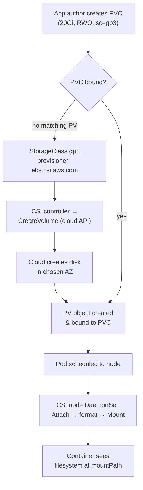

# 05 — Storage & Stateful Workloads

> **Audience:** Staff/principal engineers who already know that bytes land on disks and how filesystems, block devices, and IO queues behave. This chapter is *not* about storage theory — that lives in [../os_net/operating_system/05_file_systems_storage.md](../os_net/operating_system/05_file_systems_storage.md) and the war stories in [../os_net/enterprise_scenarios/02_io_storage_incidents.md](../os_net/enterprise_scenarios/02_io_storage_incidents.md). This is about how Kubernetes models, provisions, and binds storage — and the brutally honest question of whether your database belongs here at all.

---

## 1. The ephemeral-by-default problem

A container's writable layer is a scratchpad. A Pod is a scheduling unit that can be evicted, rescheduled, OOM-killed, or rolled in a deploy at any moment. Kill the Pod and the writable layer is gone. This is *correct* for stateless workloads — it is the whole point of [03 — Workloads, Pods & Scheduling](03_workloads_pods_scheduling.md). It is catastrophic if you wrote state there.

State has to outlive the Pod. Kubernetes gives you a spectrum:

| Need | Mechanism | Lifetime |
| --- | --- | --- |
| Scratch space, shared between containers in a Pod | `emptyDir` | Pod |
| Inject config / credentials | `configMap` / `secret` volume | Pod (source object outlives it) |
| Node-local files (rarely justified) | `hostPath` | Node |
| Durable, survives Pod *and* node | **PersistentVolume** via **PVC** | Independent of Pod |

The rest of the chapter is about climbing that table from top (ephemeral) to bottom (durable).

---

## 2. Volumes: the ephemeral tier

### emptyDir — scratch that dies with the Pod

```yaml
apiVersion: v1
kind: Pod
metadata: { name: scratch }
spec:
  containers:
    - name: app
      image: myapp:1.0
      volumeMounts:
        - { name: cache, mountPath: /var/cache }
  volumes:
    - name: cache
      emptyDir:
        sizeLimit: 1Gi          # cap it, or a runaway fills the node
        # medium: Memory        # tmpfs — counts against the container memory limit!
```

`emptyDir` is created empty when the Pod is assigned to a node and **deleted when the Pod leaves the node**. Use it for caches, sort/spill space, sidecar-to-app handoff. Never use it for anything you want to keep — see the symptom in §10.

### hostPath — the loaded gun

```yaml
# WRONG — using hostPath for application data
volumes:
  - name: data
    hostPath:
      path: /data/myapp        # only this node has it; reschedule = data gone
      type: DirectoryOrCreate  # silently creates /data/myapp owned by root
```

`hostPath` mounts a node directory into the Pod. It is dangerous because: (1) it pins data to one node — reschedule and the new node has different (or no) data; (2) it punches through container isolation — a writable `hostPath` over `/var/lib/kubelet`, `/etc`, or the Docker socket is a node-takeover primitive (see [10 — Production Hardening & Multi-Tenancy](10_production_hardening_multitenancy.md)); (3) `type` defaults are surprising. Legitimate uses are node-agent DaemonSets (log shippers, CSI drivers, CNI) that *intend* to touch the host — not your app.

### configMap / secret volumes

```yaml
volumes:
  - name: config
    configMap:
      name: app-config
      items: [{ key: app.yaml, path: app.yaml }]
  - name: creds
    secret:
      secretName: db-creds
      defaultMode: 0400        # don't leave secrets world-readable
```

These project key/value data as files, updated in-place when the source object changes (with propagation delay; subPath mounts do **not** update). Mechanics and RBAC live in [06 — Config, Secrets, RBAC & Admission Control](06_config_secrets_rbac_admission.md).

---

## 3. Persistent storage: the claim/supply model

Kubernetes deliberately splits *what storage exists* from *what a workload asks for*. This decouples app authors from infrastructure.

| Object | Owned by | Answers | Namespaced? |
| --- | --- | --- | --- |
| **PersistentVolume (PV)** | cluster/infra | "Here is a 100Gi RWO disk in zone us-east-1a" | No (cluster-scoped) |
| **PersistentVolumeClaim (PVC)** | app team | "I need 20Gi RWO, fast tier" | Yes |
| **StorageClass (SC)** | platform team | "Here's how to *manufacture* a PV on demand" | No |

A PVC is the supply request; a PV is the supply. The control plane *binds* a PVC to a satisfying PV. Without a StorageClass, an admin pre-creates PVs by hand (static provisioning). With one, PVs are created dynamically the moment a PVC appears.

```yaml
apiVersion: v1
kind: PersistentVolumeClaim
metadata: { name: data-pvc }
spec:
  accessModes: ["ReadWriteOnce"]
  storageClassName: gp3        # "" = no provisioning; omit = cluster default SC
  resources:
    requests: { storage: 20Gi }
```

```yaml
apiVersion: storage.k8s.io/v1
kind: StorageClass
metadata: { name: gp3 }
provisioner: ebs.csi.aws.com   # the CSI driver that does the work
parameters: { type: gp3, iops: "5000", throughput: "250" }
reclaimPolicy: Delete          # Delete (default for dynamic) | Retain
allowVolumeExpansion: true
volumeBindingMode: WaitForFirstConsumer
```

### Access modes

| Mode | Short | Meaning | Reality |
| --- | --- | --- | --- |
| ReadWriteOnce | RWO | One **node** mounts read-write | Block storage (EBS/PD/Azure Disk). The common case. |
| ReadOnlyMany | ROX | Many nodes mount read-only | Rare; immutable datasets. |
| ReadWriteMany | RWX | Many nodes mount read-write | **File** storage only (NFS/EFS/Azure Files/CephFS). Block storage cannot do this. |
| ReadWriteOncePod | RWOP | Exactly one **Pod** | Stricter RWO; needs CSI support. |

> The single most common storage misconception: "RWO means one Pod." It means one **node**. Multiple Pods on the *same* node can share an RWO volume. But a block device fundamentally cannot be safely mounted read-write by two nodes — that is a filesystem-corruption recipe, which is why RWX requires a network *file* protocol. See §10.

### Reclaim policy & binding mode

- **`reclaimPolicy: Delete`** — when the PVC is deleted, the backing cloud disk is destroyed. Convenient; a foot-gun for databases. **`Retain`** keeps the PV and the data for manual recovery — use it for anything precious.
- **`volumeBindingMode: WaitForFirstConsumer`** — do **not** provision/bind the PV until a Pod that uses the PVC is scheduled. This lets the scheduler pick the node *first*, then provision the disk in that node's zone. The alternative, `Immediate`, provisions instantly in *some* zone and then constrains the Pod to it — the classic AZ-pinning trap in §10. **Use WaitForFirstConsumer for any zonal block storage.**

---

## 4. CSI — the Container Storage Interface

CSI is the plugin contract between Kubernetes and storage systems. In-tree volume plugins are gone; everything is a CSI driver — a deployment with a **controller** (provision/attach/snapshot, talks to the cloud API) and a per-node **DaemonSet** (mounts/formats on the host). Cloud drivers: `ebs.csi.aws.com`, `pd.csi.storage.gke.io`, `disk.csi.azure.com`; file: `efs.csi.aws.com`, `file.csi.azure.com`.



What CSI gives you beyond provisioning:

- **Snapshots** — `VolumeSnapshot` / `VolumeSnapshotClass`. A point-in-time crash-consistent copy you can restore into a new PVC. **Crash-consistent ≠ application-consistent**: quiesce the DB or use its native backup for transactional integrity.
- **Online resize** — bump `spec.resources.requests.storage` on the PVC (needs `allowVolumeExpansion: true`). The cloud grows the disk and CSI grows the filesystem, usually without unmount. **You cannot shrink.**
- **Topology awareness** — the driver advertises which zones it can serve. The scheduler uses this with `WaitForFirstConsumer` so a Pod never lands where its disk can't follow.

```yaml
apiVersion: snapshot.storage.k8s.io/v1
kind: VolumeSnapshot
metadata: { name: pg-snap-2026-06-23 }
spec:
  volumeSnapshotClassName: ebs-snap
  source: { persistentVolumeClaimName: data-postgres-0 }
```

> **The AZ stickiness gotcha.** A cloud block volume lives in exactly one availability zone. Once a Pod's PVC is bound to a disk in `us-east-1a`, that Pod can only ever run in `us-east-1a`. Lose that AZ and the Pod cannot reschedule until the AZ returns — the disk is unreachable, not replicated. This is data gravity, and it shapes every stateful-on-K8s decision below.

---

## 5. StatefulSets + storage

Deployments give you interchangeable Pods. Clustered stateful systems (Postgres replicas, Kafka brokers, etcd, Elasticsearch) need **stable identity + stable storage**. That's the StatefulSet.

```yaml
apiVersion: apps/v1
kind: StatefulSet
metadata: { name: postgres }
spec:
  serviceName: postgres-hl       # headless Service for stable DNS
  replicas: 3
  selector: { matchLabels: { app: postgres } }
  template:
    metadata: { labels: { app: postgres } }
    spec:
      containers:
        - name: postgres
          image: postgres:16
          volumeMounts:
            - { name: data, mountPath: /var/lib/postgresql/data }
  volumeClaimTemplates:          # ONE PVC PER REPLICA, created automatically
    - metadata: { name: data }
      spec:
        accessModes: ["ReadWriteOnce"]
        storageClassName: gp3
        resources: { requests: { storage: 100Gi } }
---
apiVersion: v1
kind: Service
metadata: { name: postgres-hl }
spec:
  clusterIP: None                # headless = per-Pod DNS, no load balancing
  selector: { app: postgres }
  ports: [{ port: 5432 }]
```

The guarantees that make this work:

- **Per-replica PVC** — `volumeClaimTemplates` mints `data-postgres-0`, `data-postgres-1`, `data-postgres-2`. Each Pod always re-binds to *its own* disk.
- **Stable identity** — Pod `postgres-1` keeps that name and DNS (`postgres-1.postgres-hl`) across reschedules. Replication configs can reference peers by name.
- **Ordered ops** — Pods come up `0,1,2` and terminate `2,1,0` (`podManagementPolicy: OrderedReady`), so a leader can establish before followers join.
- **Headless Service** — `clusterIP: None` gives each Pod its own DNS A record instead of a single VIP — essential for peer discovery.

Note: deleting a StatefulSet **does not delete its PVCs** by default — the data is preserved deliberately. Clean up with `kubectl delete pvc -l app=postgres` when you truly mean it.

---

## 6. Should you run your database on Kubernetes? — the principal take

Yes, you *can*. The honest question is whether you *should*, per workload.

**What makes it hard:**

- **Data gravity / AZ pinning (§4).** A PV is welded to one AZ. Failover means promoting a replica in another AZ that has *its own copy* of the data — Kubernetes does not move your bytes for you. The storage layer does not give you HA; your database's replication does.
- **Failover is the operator's job, not K8s's.** Vanilla StatefulSets reschedule Pods; they do **not** promote replicas, fence the old primary, or reconfigure clients. You need an **operator** (CloudNativePG, Zalando/Crunchy Postgres, Strimzi for Kafka, Vitess for MySQL) to encode that domain logic — see [08 — Deploying to Kubernetes](08_deploying_helm_gitops_operators.md). A database without an operator is an outage waiting for a node reboot.
- **Backup/restore is on you.** CSI snapshots are crash-consistent, not point-in-time-recoverable. Real DR means WAL/binlog archiving to object storage plus tested restores. Untested backups are decoration.
- **Noisy-neighbor IO.** Pods share node IO bandwidth; a batch job can starve your DB's IOPS unless you isolate it (dedicated node pools, taints, QoS).

**When a managed cloud DB wins (RDS / Aurora / Cloud SQL / Azure SQL):** standard relational workloads where the cloud's automated failover, patching, multi-AZ replication, and PITR are exactly what you'd otherwise rebuild — badly — with an operator. The managed service *is* a mature operator run by people whose full-time job is that database. Default to managed unless you have a concrete reason not to.

**When self-hosting on K8s is defensible:** a battle-tested operator exists and you've run it; you need a DB the cloud doesn't offer; strict data-locality/compliance requires it; cost at scale clearly favors it; or you want one declarative control plane for *everything*. Go in with eyes open and a runbook.

> Rule of thumb: **stateless on K8s by default; stateful on K8s only with a mature operator and a tested backup story; otherwise buy the managed service.** Your on-call rotation will thank you.

---

## 7. Storage performance

Storage classes map to cloud disk tiers — pick deliberately, because the defaults are usually "cheap and slow."

| Tier (AWS examples) | IOPS / throughput | Use |
| --- | --- | --- |
| `gp3` (SSD, baseline) | 3k IOPS / 125 MB/s, tunable | Most general workloads |
| `io2` Block Express | up to 256k IOPS | High-throughput OLTP databases |
| `st1` (HDD) | throughput-optimized | Logs, big sequential scans |
| **Local NVMe** | hundreds of k IOPS, sub-ms | Latency-critical: caches, scratch, some DBs |

**Local NVMe** (instance store, `local` provisioner) is the fastest option and the most dangerous: it is **node-ephemeral** — reboot or replace the node and the data is gone. Use it only where the application replicates state itself (Cassandra, Kafka with replication factor ≥ 3, search index shards) or for pure scratch. Never put unreplicated primary data on local NVMe. Right-size IOPS/throughput in the StorageClass `parameters`; an undersized `gp3` throttling at 3k IOPS looks exactly like an application latency bug.

---

## 8. Symptom / Cause / Fix

**Pod stuck `Pending`, PVC `Pending`/unbound**
- *Symptom:* `kubectl describe pvc` shows no volume; events say "no persistent volumes available" or "no storage class."
- *Cause:* No StorageClass named (and no default), or no provisioner can satisfy it, or static PVs ran out.
- *Fix:* Set `storageClassName` to a real class, or mark one default (`storageclass.kubernetes.io/is-default-class`). Confirm the CSI driver is installed and its controller healthy.

**Pod won't schedule — volume in another AZ**
- *Symptom:* `node(s) had volume node affinity conflict`.
- *Cause:* PV provisioned in one zone (often via `Immediate` binding); no schedulable node there.
- *Fix:* Use `volumeBindingMode: WaitForFirstConsumer` so the disk follows the scheduler's node choice. Existing zone-pinned data: snapshot and restore into the target zone.

**RWX needed but block storage is RWO**
- *Symptom:* `Multi-Attach error for volume`, or a second Pod hangs mounting.
- *Cause:* Multiple nodes trying to RW-mount a block device, which is RWO by nature.
- *Fix:* Use a *file* backend that supports RWX (EFS, Azure Files, NFS, CephFS). If you truly need shared write, you need network file storage — not a bigger block disk. Or rearchitect so each replica owns its own RWO volume.

**Data lost on Pod restart**
- *Symptom:* State vanishes whenever the Pod reschedules.
- *Cause:* Data written to `emptyDir`, a container layer, or `hostPath` — none of which survive rescheduling.
- *Fix:* Mount a PVC. For multi-replica stateful apps, use a StatefulSet with `volumeClaimTemplates`. Set `reclaimPolicy: Retain` on anything irreplaceable.

---

## 9. Operational checklist

```bash
kubectl get pvc -A                              # any stuck Pending?
kubectl get pv                                  # capacity, reclaim policy, status
kubectl get storageclass                        # which is (default)?
kubectl describe pvc <name>                     # events explain unbound claims
kubectl get volumesnapshot -A                   # backup posture
kubectl get csidrivers                          # installed drivers & capabilities
```

- StorageClasses set deliberately, with `WaitForFirstConsumer` for zonal block.
- `reclaimPolicy: Retain` on everything you can't afford to lose.
- `allowVolumeExpansion: true` so you can grow without a migration.
- Stateful systems run under a mature **operator**, not a hand-rolled StatefulSet, when failover matters.
- Backups are **tested restores**, not just snapshots — schedule the drill.
- IOPS/throughput sized to the workload; local NVMe only for self-replicating or scratch data.

---

> Next: [06 — Config, Secrets, RBAC & Admission Control](06_config_secrets_rbac_admission.md) — we mounted ConfigMaps and Secrets as volumes here; next we make them *safe*: secret encryption at rest, who can read what via RBAC, and admission controllers that reject the dangerous `hostPath` and privileged Pods this chapter warned you about.
