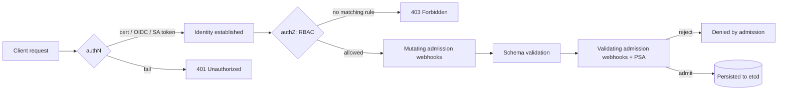

# 06 — Configuration, Secrets, RBAC & Admission Control

> **Audience:** Staff/principal engineers who own multi-tenant clusters and the security posture around them. You already know how to `kubectl apply`. This chapter is about *who* and *what* gets to talk to the apiserver, how config and secrets flow into pods without leaking, and how to enforce org policy as code. The throughline: **the Kubernetes Secret is not a security boundary by itself**, and **admission control is the gate that actually enforces your rules**.

---

## 1. ConfigMaps — config that lives outside the image

A ConfigMap decouples configuration from the container image. Two consumption modes, and the choice has real consequences.

```yaml
apiVersion: v1
kind: ConfigMap
metadata:
  name: app-config
data:
  LOG_LEVEL: "info"
  app.properties: |
    timeout=30s
    retries=3
immutable: true   # see §1.2
```

**As env vars** — flat, simple, read once at process start:

```yaml
        envFrom:
        - configMapRef:
            name: app-config
        # or selectively:
        env:
        - name: LOG_LEVEL
          valueFrom:
            configMapKeyRef: { name: app-config, key: LOG_LEVEL }
```

**As mounted files** — the kubelet projects keys as files and *updates them in place* when the ConfigMap changes (subPath mounts do NOT update):

```yaml
        volumeMounts:
        - name: cfg
          mountPath: /etc/app
      volumes:
      - name: cfg
        configMap: { name: app-config }
```

| Concern | Env vars | Mounted files |
|---|---|---|
| Picks up live changes | No (process read once) | Yes (~kubelet sync period), unless `subPath` |
| Visible in `kubectl describe pod` | Yes (leaks values) | No |
| Good for | small scalars, 12-factor | large/structured files, certs |

### 1.2 Immutability

Set `immutable: true` so the value can never be edited (you must create a new ConfigMap and roll the Deployment). This also lets the kubelet **stop watching** it — a real apiserver/etcd load win at scale (thousands of pods watching mutable ConfigMaps is a known bottleneck).

### 1.3 The rollout problem — the #1 ConfigMap gotcha

**Editing a ConfigMap does not restart pods.** Env-var consumers never see the change. File consumers eventually see new file contents, but the *application* usually only reads config at boot. Result: half your fleet runs old config after a "deploy."

The fix is to make the pod spec change when the config changes, so the Deployment controller triggers a rollout:

```yaml
# RIGHT — checksum annotation forces a new pod template hash
spec:
  template:
    metadata:
      annotations:
        checksum/config: {{ sha256sum (toYaml .Values.config) }}  # Helm
```

```bash
# Or imperatively, to force a restart after editing a ConfigMap:
kubectl rollout restart deployment/app
```

For automatic restarts on change, run **stakater/Reloader** (watches ConfigMaps/Secrets, patches a pod annotation to trigger rollout). See Symptom/Cause/Fix in §10.

---

## 2. Secrets — and why they are NOT secret

A Secret looks like a ConfigMap with `data` base64-encoded:

```yaml
apiVersion: v1
kind: Secret
metadata: { name: db-creds }
type: Opaque
data:
  password: c3VwZXJzZWNyZXQ=   # echo -n 'supersecret' | base64
# stringData lets you write plaintext; the apiserver encodes it.
```

> **The weakness:** base64 is **encoding, not encryption**. Anyone who can `kubectl get secret -o yaml` (or read etcd) reads the value instantly. By default Secrets sit in **etcd in plaintext** (only base64). The three things that make a Secret actually secret:

1. **Encryption at rest** — configure the apiserver `EncryptionConfiguration` so etcd stores ciphertext. Best practice: a KMS provider (envelope encryption with a cloud KMS key), not a static `aescbc` key on disk.

```yaml
# /etc/kubernetes/enc/enc.yaml  (apiserver --encryption-provider-config=...)
apiVersion: apiserver.config.k8s.io/v1
kind: EncryptionConfiguration
resources:
- resources: ["secrets"]
  providers:
  - kms:
      apiVersion: v2
      name: cloud-kms
      endpoint: unix:///var/run/kmsplugin/socket.sock
  - identity: {}        # fallback; lets you read pre-encryption secrets
```
```bash
# Re-encrypt everything after enabling:
kubectl get secrets -A -o json | kubectl replace -f -
```

2. **RBAC** to limit who can read Secrets (see §4). `get/list secrets` is effectively "read all credentials in the namespace."
3. **Don't mount what you don't need**, and avoid env-var Secrets (they leak into `describe`, crash dumps, and child processes).

### 2.1 External secrets — the modern stance

> **Don't commit secrets to Git, and don't trust K8s Secrets as your system of record.** Keep the source of truth in a real secrets manager and *sync* into the cluster (or skip the K8s Secret entirely).

| Option | How it works | Notes |
|---|---|---|
| **External Secrets Operator (ESO)** | CRD `ExternalSecret` pulls from Vault/AWS SM/GCP SM/Azure KV → creates a K8s Secret | Most popular; multi-backend |
| **Secrets Store CSI Driver** | Mounts secrets as a tmpfs volume from a provider; can also sync to a K8s Secret | No etcd copy if you skip sync; supports auto-rotation |
| **HashiCorp Vault** | Agent/sidecar injects, or via ESO/CSI; dynamic short-lived creds | Best for dynamic DB creds, leasing |
| **Cloud Secrets Manager + KMS** | AWS/GCP/Azure managed store; pods authenticate via workload identity (§3) | No keys in cluster |
| **Sealed Secrets (Bitnami)** | Encrypt locally with cluster public key → commit the `SealedSecret` to Git safely | GitOps-friendly; controller decrypts in-cluster |

```yaml
# RIGHT — ESO: K8s Secret is generated, never authored by humans
apiVersion: external-secrets.io/v1beta1
kind: ExternalSecret
metadata: { name: db-creds }
spec:
  refreshInterval: 1h
  secretStoreRef: { name: aws-sm, kind: SecretStore }
  target: { name: db-creds }      # the K8s Secret ESO maintains
  data:
  - secretKey: password
    remoteRef: { key: prod/db, property: password }
```

```bash
# WRONG — committing this to Git, even "just base64"
git add k8s/secret.yaml   # base64 is reversible; now it's in history forever
```

Cross-ref: [../sdlc/08_devsecops_security_sdlc.md](../sdlc/08_devsecops_security_sdlc.md) for secret scanning in CI and supply-chain controls.

---

## 3. ServiceAccounts & workload identity federation

Every pod runs as a **ServiceAccount** (SA) — its identity to the apiserver. Modern clusters use **projected, time-bound, audience-scoped tokens** (BoundServiceAccountTokenVolume), not the legacy long-lived secret token.

```yaml
spec:
  serviceAccountName: app-sa
  containers:
  - name: app
    volumeMounts:
    - { name: token, mountPath: /var/run/secrets/tokens }
  volumes:
  - name: token
    projected:
      sources:
      - serviceAccountToken:
          audience: vault            # scoped to one audience
          expirationSeconds: 3600    # auto-rotated, short-lived
          path: token
```

### 3.1 Workload identity federation — the big one

> The single most important secrets practice in cloud Kubernetes: **pods assume cloud IAM roles with NO long-lived keys.** The SA token is exchanged (via OIDC) for short-lived cloud credentials.

- **EKS — IRSA** (IAM Roles for Service Accounts): the cluster OIDC provider is trusted by an IAM role; annotate the SA.
- **GKE — Workload Identity**: bind a K8s SA to a Google SA.
- **AKS — Azure Workload Identity**: federate the SA with an Entra ID app.

```yaml
# RIGHT — IRSA: no AWS keys anywhere in the cluster
apiVersion: v1
kind: ServiceAccount
metadata:
  name: app-sa
  annotations:
    eks.amazonaws.com/role-arn: arn:aws:iam::111122223333:role/app-s3-read
```
```yaml
# WRONG — long-lived static keys baked into a Secret/env
env:
- { name: AWS_ACCESS_KEY_ID,     value: "AKIA..." }
- { name: AWS_SECRET_ACCESS_KEY, value: "wJalr..." }   # leak = full breach
```

The SDK inside the pod finds the projected token and calls STS `AssumeRoleWithWebIdentity` automatically — credentials are vended for minutes and rotated. See [01 — Cloud Provider Foundations](01_cloud_provider_foundations.md) for the IAM/OIDC trust setup, and [../sdlc/08_devsecops_security_sdlc.md](../sdlc/08_devsecops_security_sdlc.md) for keeping keys out of pipelines.

---

## 4. RBAC — least-privilege authorization

RBAC has four object types and two scopes:

- **Role** (namespaced) / **ClusterRole** (cluster-wide or aggregatable) — *what* (verbs × resources).
- **RoleBinding** (namespaced) / **ClusterRoleBinding** (cluster-wide) — bind a Role/ClusterRole to **subjects** (users, groups, ServiceAccounts).

A RoleBinding can reference a ClusterRole — common pattern: define a reusable ClusterRole, grant it per-namespace.

```yaml
apiVersion: rbac.authorization.k8s.io/v1
kind: Role
metadata: { namespace: team-a, name: pod-reader }
rules:
- apiGroups: [""]                 # core group
  resources: ["pods", "pods/log"]
  verbs: ["get", "list", "watch"]
---
apiVersion: rbac.authorization.k8s.io/v1
kind: RoleBinding
metadata: { namespace: team-a, name: read-pods }
subjects:
- { kind: ServiceAccount, name: app-sa, namespace: team-a }
- { kind: Group, name: "team-a-devs" }   # group from your OIDC provider
roleRef: { kind: Role, name: pod-reader, apiGroup: rbac.authorization.k8s.io }
```

| Verb | Meaning |
|---|---|
| `get` / `list` / `watch` | read one / read collection / stream changes |
| `create` / `update` / `patch` | write |
| `delete` / `deletecollection` | remove |
| `*` | all verbs — avoid in production |
| `impersonate` | act as another user — highly privileged |
| sub-resources e.g. `pods/exec`, `pods/portforward` | shell-into / tunnel — treat as admin-level |

### 4.1 Common over-permissioning

```yaml
# WRONG — the classic: cluster-admin to a CI ServiceAccount "to make it work"
roleRef: { kind: ClusterRole, name: cluster-admin, apiGroup: rbac.authorization.k8s.io }
```
`cluster-admin` + `pods/exec` or `secrets get` is game over: anyone with it can read every Secret and run code on every node. Wildcards (`resources: ["*"]`, `verbs: ["*"]`) and namespace-wide `secrets` access are the usual leaks.

### 4.2 Auditing RBAC

```bash
# What can this SA actually do?  (the canonical check)
kubectl auth can-i --list --as=system:serviceaccount:team-a:app-sa
kubectl auth can-i get secrets --as=system:serviceaccount:team-a:app-sa -n team-a

# Who has cluster-admin?  Find the dangerous bindings.
kubectl get clusterrolebindings -o json \
  | jq -r '.items[] | select(.roleRef.name=="cluster-admin") | .metadata.name'
```
Tools: `kubectl-who-can`, `rbac-lookup`, `rbac-tool` (krew plugins). Audit quarterly; bindings rot.

Cross-ref OS-level privilege concepts in [../modern_os/linux/12_security_access_control.md](../modern_os/linux/12_security_access_control.md).

---

## 5. The apiserver request path — authN → authZ → admission

Every `kubectl` / controller / pod request runs this gauntlet:



- **AuthN** (who are you): client certs, **OIDC** (enterprise SSO → users/groups), bearer/SA tokens, or webhook. K8s has no user objects — identity comes from the authenticator.
- **AuthZ** (may you): RBAC evaluates verb × resource × subject. Default deny.
- **Admission** (should this object exist as-is): plugins and webhooks run *after* authZ but *before* persistence — mutating first, then validating.

---

## 6. Admission control — the real enforcement gate

RBAC says *who can create a pod*. Admission says *what that pod is allowed to look like*. This is where org policy lives.

| Webhook type | Can do | Example |
|---|---|---|
| **Mutating** | modify the object | inject sidecar, add default labels, set `imagePullPolicy` |
| **Validating** | accept/reject only | reject `latest` tag, require resource limits |

### 6.1 Pod Security Standards / Pod Security Admission (PSA)

**PodSecurityPolicy is removed (since 1.25).** Its replacement is built-in **Pod Security Admission**, enforcing the three **Pod Security Standards** at the namespace level via labels — no controller to install.

| Level | Allows | Use for |
|---|---|---|
| **privileged** | everything (host mounts, privileged, hostNetwork) | trusted infra/system namespaces |
| **baseline** | blocks known privilege escalations; permits most apps | general workloads |
| **restricted** | hardened: non-root, drop ALL caps, seccomp, no privilege escalation | security-sensitive / regulated |

```yaml
# RIGHT — enforce restricted, but warn+audit on the stricter target
apiVersion: v1
kind: Namespace
metadata:
  name: team-a
  labels:
    pod-security.kubernetes.io/enforce: restricted
    pod-security.kubernetes.io/warn: restricted
    pod-security.kubernetes.io/audit: restricted
```

### 6.2 Policy engines — policy-as-code beyond PSS

For org rules PSA can't express (require team labels, restrict registries, block `:latest`, mandate limits), use a policy engine via admission webhooks.

| | **OPA / Gatekeeper** | **Kyverno** |
|---|---|---|
| Language | Rego (separate DSL) | YAML (K8s-native) |
| Mutation | limited | first-class |
| Generate resources | no | yes (e.g. default NetworkPolicy) |
| Learning curve | steeper (Rego) | gentle |
| Best when | complex cross-object logic, multi-platform | K8s-only, fast adoption |

```yaml
# Kyverno — block the :latest tag (validating)
apiVersion: kyverno.io/v1
kind: ClusterPolicy
metadata: { name: disallow-latest-tag }
spec:
  validationFailureAction: Enforce
  rules:
  - name: require-pinned-tag
    match: { any: [{ resources: { kinds: ["Pod"] } }] }
    validate:
      message: "Image tag ':latest' is not allowed; pin a version."
      pattern:
        spec:
          containers:
          - image: "!*:latest"
```

```rego
# Gatekeeper ConstraintTemplate (Rego) — require a 'team' label
violation[{"msg": msg}] {
  not input.review.object.metadata.labels.team
  msg := "every workload must carry a 'team' label"
}
```

Common policies: enforce resource requests/limits, restrict image registries to your private registry, require `runAsNonRoot`, mandate readiness probes, deny `hostPath`. Pair with NetworkPolicy from [04 — Kubernetes Networking](04_kubernetes_networking.md).

---

## 7. Symptom / Cause / Fix

- **"Secret is visible to everyone / showed up in a dump."**
  - *Cause:* no RBAC on `secrets`, and/or etcd not encrypted at rest (base64 only).
  - *Fix:* scope `get/list secrets` to specific SAs; enable KMS `EncryptionConfiguration` and re-encrypt; move source of truth to ESO/Vault (§2).

- **"I changed the ConfigMap but pods still run old config."**
  - *Cause:* editing a ConfigMap doesn't restart pods; env vars are read once at boot.
  - *Fix:* `kubectl rollout restart`, add a `checksum/config` annotation, or run Reloader (§1.3).

- **"Pod denied by admission / `violates PodSecurity restricted`."**
  - *Cause:* PSA or a Kyverno/Gatekeeper policy rejected the spec (e.g. runs as root, missing limits, `:latest`).
  - *Fix:* read the rejection message; harden the pod spec (non-root, drop caps, set limits) or move to a namespace with the right enforce level (§6).

- **"`Error from server (Forbidden): User cannot list pods`."**
  - *Cause:* RBAC default-deny — subject has no Role/binding granting that verb/resource.
  - *Fix:* `kubectl auth can-i --list --as=<subject>`; add a least-privilege Role + binding (§4).

- **"A long-lived cloud key leaked from a pod / appeared in logs."**
  - *Cause:* static `AWS_ACCESS_KEY_ID`-style creds in env or a Secret.
  - *Fix:* delete the static keys, rotate them at the provider, switch to IRSA / Workload Identity / Azure Workload Identity — no long-lived keys in the cluster (§3).

---

## 8. Principal-level checklist

- etcd encrypted at rest with **KMS** (not a static key); Secrets RBAC scoped tight.
- Source of truth for secrets is **external** (ESO/Vault/CSI); nothing reversible committed to Git.
- All cloud access via **workload identity federation**; zero long-lived keys.
- RBAC is least-privilege; **no `cluster-admin`** on workload/CI ServiceAccounts; audited quarterly.
- Namespaces labeled with **Pod Security Admission** (`restricted` where feasible).
- A **policy engine** enforces org rules (registries, labels, limits, no `:latest`) in `Enforce` mode.
- Config changes trigger rollouts (checksum annotations / Reloader).

See [10 — Production Hardening & Multi-Tenancy](10_production_hardening_multitenancy.md) for how these compose into tenant isolation.

---

> Next: [07 — Scaling & Autoscaling](07_scaling_autoscaling.md) — once the cluster is locked down, we make it elastic: HPA, VPA, Cluster Autoscaler vs Karpenter, and why your replicas won't scale until requests/limits (enforced by the policies above) are actually set.
