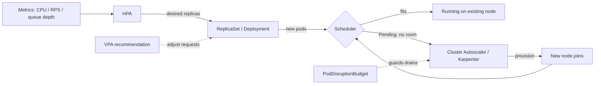

# 07 — Scaling & Autoscaling

> **Audience:** Staff/principal engineers who own capacity, cost, and availability for Kubernetes platforms. You already run workloads (see [03 — Workloads, Pods & Scheduling](03_workloads_pods_scheduling.md)); now you need them to grow and shrink *correctly* — on the right signal, without melting the cluster, without paging at 3am when a Spot node vanishes.

This chapter is opinionated. Most autoscaling outages come from scaling on the wrong metric, missing PodDisruptionBudgets, or HPA and VPA fighting each other. We cover the mechanics, the math, and the failure modes.

---

## 1. The three scaling dimensions

Autoscaling is not one thing. There are three independent axes, and they form a chain:

| Dimension | What changes | Controller | Unit |
|-----------|--------------|------------|------|
| **Horizontal (pods)** | Replica count of a workload | HPA / KEDA | pods |
| **Vertical (pod resources)** | CPU/memory `requests`/`limits` per pod | VPA | millicores / MiB |
| **Cluster (nodes)** | Number/type of nodes | Cluster Autoscaler / Karpenter | nodes |

**How they interact.** HPA adds pods → those pods need to be *scheduled* → if no node has room, they go `Pending` → the node autoscaler provisions capacity → pods schedule. VPA changes per-pod requests, which changes how many pods fit per node, which changes node demand. The flow:



**The golden rule:** horizontal autoscaling is only as fast as your slowest link. HPA can decide to add 10 pods in 15 seconds, but if a new node takes 90s to provision and 30s to pull images, your real scale-up latency is ~2 minutes. Plan headroom accordingly (§9).

---

## 2. Horizontal Pod Autoscaler (HPA)

### 2.1 The algorithm

HPA polls metrics (default every 15s) and computes:

```
desiredReplicas = ceil( currentReplicas * ( currentMetricValue / targetMetricValue ) )
```

Example: 4 replicas, current avg CPU = 80%, target = 50% → `ceil(4 * 80/50) = ceil(6.4) = 7`. A 10% deadband around the ratio (0.9–1.1) prevents thrashing on noise.

### 2.2 Scaling on the right signal

The single most important decision. **Scale on the metric that represents your actual bottleneck.**

#### WRONG — CPU target for an I/O-bound service

```yaml
# This API spends its time waiting on a database and external calls.
# CPU stays near 20% even while p99 latency blows past SLO.
# HPA never scales; users get timeouts.
apiVersion: autoscaling/v2
kind: HorizontalPodAutoscaler
metadata:
  name: orders-api
spec:
  scaleTargetRef: { apiVersion: apps/v1, kind: Deployment, name: orders-api }
  minReplicas: 2
  maxReplicas: 20
  metrics:
    - type: Resource
      resource:
        name: cpu
        target: { type: Utilization, averageUtilization: 70 }
```

#### RIGHT — scale on requests-per-second (the real bottleneck)

```yaml
apiVersion: autoscaling/v2
kind: HorizontalPodAutoscaler
metadata:
  name: orders-api
spec:
  scaleTargetRef: { apiVersion: apps/v1, kind: Deployment, name: orders-api }
  minReplicas: 3            # never below 3 — survive a node loss + give baseline headroom
  maxReplicas: 50
  metrics:
    - type: Pods            # per-pod custom metric from Prometheus Adapter
      pods:
        metric: { name: http_requests_per_second }
        target: { type: AverageValue, averageValue: "100" }   # 100 rps/pod is the sweet spot
  behavior:
    scaleUp:
      stabilizationWindowSeconds: 0      # react to load spikes immediately
      policies:
        - type: Percent
          value: 100                     # at most double per step
          periodSeconds: 30
        - type: Pods
          value: 4                       # ...or +4 pods, whichever is larger
          periodSeconds: 30
      selectPolicy: Max
    scaleDown:
      stabilizationWindowSeconds: 300    # wait 5 min of sustained low load before shrinking
      policies:
        - type: Percent
          value: 10                      # shrink slowly to avoid yo-yo
          periodSeconds: 60
```

For queue/stream workers, the right signal is **queue depth / consumer lag**, not CPU or RPS — see KEDA (§7).

### 2.3 External metrics

`type: External` scales on cluster-external signals (e.g., SQS `ApproximateNumberOfMessagesVisible`, a cloud LB's active connections) divided across replicas.

```yaml
  metrics:
    - type: External
      external:
        metric:
          name: sqs_messages_visible
          selector: { matchLabels: { queue: "image-jobs" } }
        target: { type: AverageValue, averageValue: "30" }   # 30 backlog msgs per pod
```

### 2.4 Stabilization, cold start, thundering herd

- **`stabilizationWindowSeconds`** — HPA picks the *highest* recommendation within the window (for scale-down, prevents premature shrink). Set scale-up to 0 for spiky traffic; scale-down to 300–600s.
- **Cold start / thundering herd** — when HPA adds many pods at once, they all hit cold caches, warm up JITs, and open new DB connections simultaneously. Mitigate with: a `readinessProbe` that gates traffic until warm, a startup throttle, connection-pool limits, and a **scaleUp `Pods` cap** so you don't 10x in one step. Pair with PDBs (§6) so scale-*down* doesn't drop you below safe capacity.

---

## 3. Vertical Pod Autoscaler (VPA)

VPA right-sizes `requests` (and optionally `limits`) from observed usage — solving the chronic over-/under-provisioning that wrecks bin-packing and cost.

```yaml
apiVersion: autoscaling.k8s.io/v1
kind: VerticalPodAutoscaler
metadata:
  name: batch-worker
spec:
  targetRef: { apiVersion: apps/v1, kind: Deployment, name: batch-worker }
  updatePolicy:
    updateMode: "Off"        # recommend only — emit suggestions, change nothing
  resourcePolicy:
    containerPolicies:
      - containerName: "*"
        minAllowed: { cpu: 50m,  memory: 128Mi }
        maxAllowed: { cpu: "2",  memory: 4Gi }
```

**Modes:**
- `Off` — recommendation only. Read it with `kubectl describe vpa batch-worker`. **Start here.** Use the numbers to set requests by hand or via your deploy pipeline.
- `Initial` — sets requests only at pod creation.
- `Auto`/`Recreate` — evicts and recreates pods to apply new requests. Disruptive; needs a PDB and is unsuitable for latency-sensitive services without in-place resize.

### 3.1 Why HPA + VPA on the same metric conflict

If HPA scales on CPU **and** VPA adjusts CPU requests, they form a feedback loop: VPA raises requests → per-pod utilization% drops → HPA removes pods → load concentrates → VPA raises requests again. They chase each other and oscillate.

**Rule:** Never let HPA and VPA both act on the same resource. Safe combinations:
- HPA on a **custom metric** (RPS, queue depth) + VPA on **CPU/memory** — orthogonal, works well.
- HPA on CPU + VPA in `Off` mode (recommendations feed your manifests) — fine.
- HPA on CPU + VPA `Auto` on CPU — **forbidden.**

---

## 4. Node autoscaling: Cluster Autoscaler vs Karpenter

When pods are `Pending` because no node has room, a node autoscaler provisions capacity. Two approaches:

| | **Cluster Autoscaler (CA)** | **Karpenter** |
|---|---|---|
| Model | Scales pre-defined node groups / ASGs | Provisions individual nodes just-in-time |
| Instance flexibility | Per node-group instance type | Picks from many instance types per pod shape |
| Scheduling awareness | Simulates against existing groups | Solves bin-packing across types directly |
| Scale-down | Removes underused nodes (group-aware) | **Consolidation** — actively repacks & replaces |
| Speed | Slower (ASG round-trip) | Faster, fewer moving parts |
| Scope | Cloud-agnostic | AWS-native (others emerging) |

### 4.1 Karpenter: just-in-time, flexible, bin-packing

Karpenter looks at *pending pods*, computes the cheapest instance type(s) that fit them, and launches nodes directly — no node-group sizing puzzle. **Consolidation** continuously asks "can I repack these pods onto fewer/cheaper nodes?" and replaces nodes to do so.

```yaml
apiVersion: karpenter.sh/v1
kind: NodePool
metadata: { name: default }
spec:
  template:
    spec:
      requirements:
        - { key: karpenter.sh/capacity-type, operator: In, values: ["spot", "on-demand"] }
        - { key: kubernetes.io/arch,         operator: In, values: ["amd64", "arm64"] }
        - { key: karpenter.k8s.aws/instance-category, operator: In, values: ["c","m","r"] }
        - { key: karpenter.k8s.aws/instance-generation, operator: Gt, values: ["5"] }
      nodeClassRef: { group: karpenter.k8s.aws, kind: EC2NodeClass, name: default }
  disruption:
    consolidationPolicy: WhenEmptyOrUnderutilized
    consolidateAfter: 1m
  limits: { cpu: "1000" }     # hard ceiling so a runaway HPA can't provision the world
```

**Scale-down safety:** Both controllers respect PodDisruptionBudgets (§6) and `do-not-disrupt` annotations. Karpenter drains via the eviction API; pods protected by a PDB block the drain until a replacement is ready. Mark stateful/long-running pods that must not move:

```yaml
metadata:
  annotations: { karpenter.sh/do-not-disrupt: "true" }
```

---

## 5. Spot / preemptible at scale

Spot capacity is 60–90% cheaper but can be reclaimed with ~2 minutes' notice (AWS) or 30s (GCP preemptible). The art is mixing it safely.

| Strategy | Why |
|----------|-----|
| **Diversify instance types/AZs** | Reclaims correlate within a pool; spread reduces simultaneous loss |
| **Mix Spot + on-demand** | Keep a baseline (e.g., 30%) on-demand so an SLO floor survives a Spot wipeout |
| **Spread by topology** | `topologySpreadConstraints` keeps replicas off the same Spot pool |
| **Run only interruptible work on Spot** | Stateless web, batch, CI — not the leader of a quorum (see [05 — Storage & Stateful Workloads](05_storage_stateful_workloads.md)) |

**Interruption handling.** Run a **node termination handler** (AWS NTH, or Karpenter's native interruption queue) that catches the reclaim notice, cordons + drains the node, and lets the scheduler reschedule pods *before* the instance dies. Combine with:
- **PDBs** so the drain can't take down too many replicas at once.
- A `terminationGracePeriodSeconds` long enough to finish in-flight requests, with `preStop` hooks to deregister from the LB.

```yaml
# Keep replicas spread so one Spot pool reclaim can't kill them all
spec:
  topologySpreadConstraints:
    - maxSkew: 1
      topologyKey: topology.kubernetes.io/zone
      whenUnsatisfiable: ScheduleAnyway
      labelSelector: { matchLabels: { app: orders-api } }
```

---

## 6. PodDisruptionBudgets (PDB) — the must-have for HA

A PDB caps how many pods of a workload can be down due to **voluntary** disruptions: node drains, upgrades, scale-down, Spot reclaim handling. Without one, a single `kubectl drain` or autoscaler consolidation can evict all your replicas at once.

```yaml
apiVersion: policy/v1
kind: PodDisruptionBudget
metadata: { name: orders-api }
spec:
  minAvailable: 2            # OR use maxUnavailable: 1 — never both
  selector:
    matchLabels: { app: orders-api }
```

- Use `minAvailable` for a hard floor; `maxUnavailable` to express "drain at most N at a time."
- **`minAvailable` must be < replica count**, or drains deadlock forever. A PDB of `minAvailable: 3` on a 3-replica Deployment blocks every node drain.
- PDBs only protect against *voluntary* disruption — they do **not** save you from a node crash or an OOM kill. For those you need replicas + spread + correct requests.

---

## 7. Scaling to zero / event-driven with KEDA

HPA can't scale a Deployment to zero, and it scales on resource utilization, not events. **KEDA** fills both gaps: it scales on event sources (Kafka lag, queue length, cron, Prometheus, Redis) and can go to **0 replicas** when idle, then activate on the first event.

```yaml
apiVersion: keda.sh/v1alpha1
kind: ScaledObject
metadata: { name: kafka-consumer }
spec:
  scaleTargetRef: { name: kafka-consumer }
  minReplicaCount: 0          # scale to zero when the topic is quiet
  maxReplicaCount: 30
  cooldownPeriod: 120         # wait before scaling back to 0
  triggers:
    - type: kafka
      metadata:
        bootstrapServers: kafka:9092
        consumerGroup: orders
        topic: orders
        lagThreshold: "100"   # ~100 unprocessed msgs per replica
    - type: cron              # pre-warm before the daily 09:00 spike
      metadata: { timezone: "UTC", start: "0 9 * * *", end: "0 18 * * *", desiredReplicas: "5" }
```

KEDA creates and manages a regular HPA under the hood for the 1→N range, and handles the 0↔1 activation itself. Scaling to zero trades latency (cold start on first event) for cost — acceptable for async workers, usually not for user-facing APIs.

---

## 8. Symptom / Cause / Fix

**HPA shows `<unknown>/70%` and never scales**
- *Cause:* no metrics-server (for CPU/mem) or no Prometheus Adapter / KEDA (for custom/external metrics). `kubectl top pods` failing is the tell.
- *Fix:* install/repair metrics-server; verify `kubectl get apiservice v1beta1.metrics.k8s.io` is `Available`; for custom metrics confirm the `custom.metrics.k8s.io` API responds.

**HPA scales but latency still violates SLO**
- *Cause:* scaling on CPU for an I/O-bound app — CPU never moves while the real bottleneck (RPS, lag, connections) saturates.
- *Fix:* switch the HPA to the bottleneck metric (§2.2). Validate the choice against your golden signals — see [../sdlc/05_observability_slos.md](../sdlc/05_observability_slos.md).

**Pods stuck `Pending`, no nodes added**
- *Cause:* autoscaler misconfig (wrong node-group tags, no matching `NodePool` requirements), hit an instance/quota limit, or pod requests exceed any available instance.
- *Fix:* check autoscaler logs and the `FailedScheduling` event; verify cloud quota and `limits`; confirm a Karpenter `NodePool`/CA node group can satisfy the pod's requests, arch, and taints/affinity.

**Spot reclaim caused an outage**
- *Cause:* no PDB, no instance/AZ diversification, and/or stateful leader on Spot — many replicas vanished simultaneously.
- *Fix:* add a PDB (§6), diversify instance types + AZs, keep an on-demand baseline, run a node termination handler, add `topologySpreadConstraints`.

**Scaled up but cold starts caused errors**
- *Cause:* new pots took traffic before warm; thundering herd on cache/DB/connection pools.
- *Fix:* tighten `readinessProbe`/`startupProbe`; cap scaleUp step (`Pods`/`Percent`); pre-warm caches; keep `minReplicas` headroom so you scale from a warm base, not from cold.

**HPA and VPA fighting (replica/request oscillation)**
- *Cause:* both acting on the same resource (§3.1).
- *Fix:* split signals — HPA on a custom metric, VPA on CPU/mem; or run VPA in `Off` mode and feed recommendations into manifests.

---

## 9. Capacity planning, headroom & the cost/latency trade-off

- **Headroom.** Run at a target utilization (e.g., 60–70%), not 95%. The gap absorbs spikes during the seconds-to-minutes it takes to provision pods *and* nodes. Pre-provision "pause pod" overprovisioning (low-priority placeholder pods) so the node autoscaler keeps a warm node ready.
- **Overcommit.** Setting `limits` > `requests` raises bin-packing density and cuts cost, but risks CPU throttling and OOM kills under contention. Overcommit memory only with eyes open — memory has no graceful throttle.
- **Bin-packing efficiency.** Right-sized requests (via VPA recommendations) + Karpenter consolidation is the biggest cost lever. Oversized requests strand capacity; undersized requests cause eviction.
- **The trade-off.** More headroom and on-demand = lower latency, higher cost. Aggressive consolidation, Spot, and scale-to-zero = lower cost, higher tail-latency/interruption risk. Tie the dial to the workload's SLO, and watch it on your dashboards — see [09 — Observability & Day-2 Operations](09_observability_day2_operations.md).

```bash
# Quick capacity / autoscaling triage
kubectl get hpa -A                              # current vs target, current/desired replicas
kubectl describe hpa orders-api                 # events: why it did/didn't scale
kubectl get vpa batch-worker -o yaml            # read recommendations
kubectl get pdb -A                              # are workloads protected?
kubectl get nodes -o wide                       # node count, instance types, capacity-type
kubectl get events -A --field-selector reason=FailedScheduling   # pending-pod reasons
```

---

> Next: [08 — Deploying to Kubernetes](08_deploying_helm_gitops_operators.md) — packaging all this (HPAs, VPAs, PDBs, NodePools) with Helm, shipping it via GitOps, and encoding scaling policy as code so capacity changes flow through review, not `kubectl edit`.
