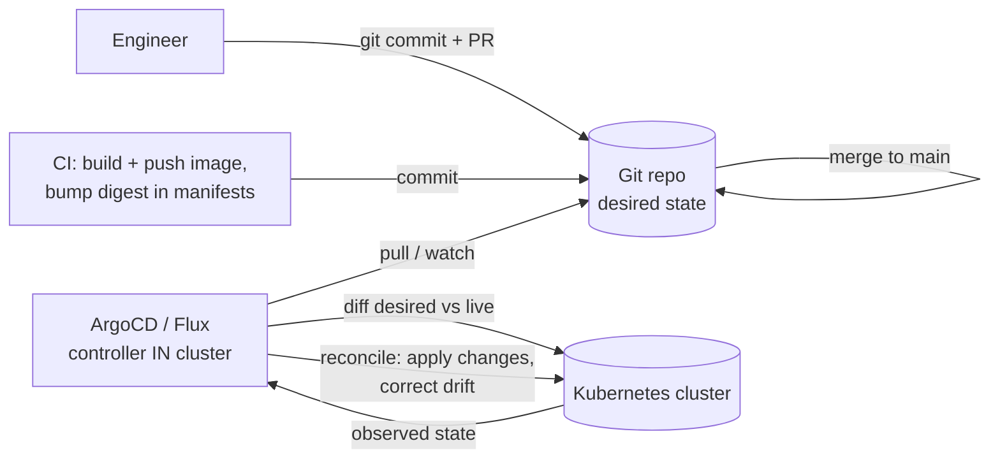

# 08 — Deploying to Kubernetes: Helm, Kustomize, GitOps & Operators

> **Audience:** Staff/principal engineers who own how software lands on Kubernetes clusters. You know what a Deployment is (chapter [02 — Kubernetes Architecture](02_kubernetes_architecture.md)); this chapter is about *getting your manifests onto the cluster repeatably, auditable, and safely across environments*. General CI/CD pipelines, release engineering, and progressive-delivery theory live in [../sdlc/03_cicd_release_engineering.md](../sdlc/03_cicd_release_engineering.md) — link there for the "why." **This** is the K8s-specific "how": templating, overlays, GitOps reconciliation, and operators.

---

## 1. The raw-YAML problem at scale

A single `kubectl apply -f deployment.yaml` is fine for a demo. At organizational scale it collapses:

- **No templating.** Three environments (dev/staging/prod) means three near-identical YAML files. Change the resource limits and you edit three files by hand. Drift is inevitable.
- **No environment awareness.** `replicas: 2` in dev but `replicas: 20` in prod has to be encoded *somewhere*. Copy-paste does not scale and silently diverges.
- **No release tracking.** `kubectl apply` is fire-and-forget. There is no "release 14," no record of *what* the cluster looked like before, no atomic rollback. If an apply half-fails, you own the cleanup.
- **No dependency model.** Your app needs a Redis, a ConfigMap, an Ingress, a ServiceAccount, RBAC. Raw YAML has no way to package and version those together.
- **Orphaning.** Rename a resource and `kubectl apply -f .` creates the new one but leaves the old one running. Nothing tracks "what should no longer exist."

Everything below is a response to one or more of these failures. Two answers to templating/environments (Helm, Kustomize) and one answer to *delivery* (GitOps).

---

## 2. Helm — the package manager for Kubernetes

Helm packages a set of templated manifests into a **chart**, renders it with **values**, and installs the result as a tracked **release**.

```
mychart/
  Chart.yaml          # name, version, appVersion, dependencies
  values.yaml         # default values (the variables)
  templates/
    deployment.yaml   # Go-template manifests
    service.yaml
    _helpers.tpl      # reusable template snippets
  charts/             # vendored dependency charts (subcharts)
```

A template uses Go templating + Sprig functions:

```yaml
# templates/deployment.yaml
apiVersion: apps/v1
kind: Deployment
metadata:
  name: {{ include "mychart.fullname" . }}
spec:
  replicas: {{ .Values.replicaCount }}        # injected from values
  template:
    spec:
      containers:
        - name: app
          image: "{{ .Values.image.repository }}@{{ .Values.image.digest }}"
          resources:
            {{- toYaml .Values.resources | nindent 12 }}
```

Per-environment config is a values file, not a copy of the manifests:

```bash
helm install myapp ./mychart -f values-prod.yaml      # first install -> Release "myapp" rev 1
helm upgrade myapp ./mychart -f values-prod.yaml       # rev 2 (records diff in a Secret)
helm rollback myapp 1                                   # atomic revert to rev 1
helm history myapp                                      # the release ledger
helm uninstall myapp                                    # removes ALL tracked resources (fixes orphaning)
```

Releases solve tracking and orphaning: Helm stores a manifest of *every* object it created (in a Secret in-cluster), so upgrade/rollback/uninstall operate on the full set, not just the files in your current directory.

**Repositories and dependencies.** Charts are published to repos (OCI registries or HTTP indexes) and pulled by reference. Charts depend on other charts:

```yaml
# Chart.yaml
dependencies:
  - name: postgresql
    version: "15.x.x"
    repository: "oci://registry-1.docker.io/bitnamicharts"
```
```bash
helm dependency update    # vendors subcharts into charts/
```

**Pros:** real package + dependency management, release history, atomic rollback, a huge ecosystem of off-the-shelf charts, conditional logic. **Cons:** Go templating over YAML is genuinely painful — whitespace/indent bugs (`nindent`), `{{- -}}` chomping, no type safety, and string-templating a structured format means you can render invalid YAML that only fails at apply time. Debugging a 400-line community chart's value precedence is a known tax.

> Always render before you trust: `helm template myapp ./mychart -f values-prod.yaml` shows the exact YAML, and `helm upgrade --dry-run --debug` validates server-side.

---

## 3. Kustomize — overlays without a templating language

Kustomize takes the opposite philosophy: **no templating**. You write plain, valid YAML once (the *base*) and layer environment-specific *patches* (the *overlays*) on top. It's built into `kubectl` (`kubectl apply -k`).

```
base/
  deployment.yaml
  service.yaml
  kustomization.yaml      # lists resources
overlays/
  prod/
    kustomization.yaml    # references ../../base + patches
    replicas-patch.yaml
```
```yaml
# overlays/prod/kustomization.yaml
resources:
  - ../../base
replicas:
  - name: myapp
    count: 20             # override base's replicas for prod
images:
  - name: myapp
    newName: registry.example.com/myapp
    digest: sha256:abc123...   # pin the digest, not a tag
patches:
  - path: resources-patch.yaml
```
```bash
kubectl apply -k overlays/prod/      # renders base + overlay and applies
kustomize build overlays/prod/       # render to stdout to inspect
```

Because everything is valid YAML, your editor's schema validation works and there are no whitespace-chomping bugs. The cost is expressiveness: there are no loops, no conditionals, no functions. Complex parameterization gets awkward (lots of small patch files).

### Helm vs Kustomize

| Dimension | Helm | Kustomize |
|---|---|---|
| Mechanism | Go templating + values | Overlays (strategic-merge / JSON patches) |
| Templating language | Yes (Go/Sprig) | No — valid YAML always |
| Packaging / distribution | First-class (charts, repos, OCI) | None (just directories) |
| Dependencies | Subcharts, versioned | Via remote bases (looser) |
| Release tracking / rollback | Yes (release ledger, `helm rollback`) | No (delegated to GitOps/`kubectl`) |
| Conditionals & loops | Yes | No |
| Learning curve | Higher (template debugging) | Lower (just YAML) |
| Best for | Redistributable apps, 3rd-party software | Owning your own manifests across envs |

They are not mutually exclusive: a common pattern is `helm template | kustomize` (or Helm's post-renderer hook) to post-process a vendored chart with overlays — letting you patch a community chart without forking it.

---

## 4. GitOps — Git as the single source of truth

The model from chapter [02 — Kubernetes Architecture](02_kubernetes_architecture.md) — a controller continuously **reconciles** observed state toward declared state — applies to *deployment itself*. In GitOps, the **declared state is a Git repo**, and a controller running *inside* the cluster (**ArgoCD** or **Flux**) continuously reconciles the live cluster to match it.

### WRONG — imperative push from outside the cluster

```bash
# On a laptop or in a CI job:
kubectl apply -f ./manifests/   # or: helm upgrade ... against the prod context
```
Problems: the cluster's truth is now "whatever the last person ran." There's no record of who applied what, credentials to prod live in CI/laptops, and any manual `kubectl edit` silently diverges with nothing to correct it. This is **push-based** and laptop-driven — fragile and unauditable.

### RIGHT — declarative pull, reconciled from Git



The only way to change prod is to **merge a commit**. The controller pulls, diffs, and applies. Benefits:

- **Audit & rollback by Git.** Every change is a reviewed, signed commit. Rollback is `git revert`. Your deploy history *is* your Git history.
- **Drift detection / auto-sync.** Someone `kubectl edit`s a Deployment? The controller sees live ≠ desired and (if auto-sync is on) reverts it. Drift becomes self-healing instead of a mystery.
- **Pull, not push.** The cluster reaches *out* to Git; no external system holds cluster-admin credentials. The blast radius of leaked CI creds shrinks dramatically.
- **Separation of concerns.** CI builds and tests artifacts and bumps an image digest in the config repo. CD (the GitOps controller) deploys. The two never need each other's credentials. (See [../sdlc/03_cicd_release_engineering.md](../sdlc/03_cicd_release_engineering.md) for the CI half.)

### ArgoCD vs Flux

| | ArgoCD | Flux |
|---|---|---|
| Model | App-centric (`Application` CR) | Toolkit of controllers (Source, Kustomize, Helm) |
| UI | Rich web UI, visual diff/sync | Minimal (CLI/`flux` + dashboards) |
| Multi-tenancy | Projects, RBAC, SSO | Namespaced, GitOps-native RBAC |
| Helm / Kustomize | Both, natively | Both, natively |
| Image automation | Via add-on | Built-in image-update controller |
| Feel | "Deploy dashboard" | "Composable Kubernetes-native primitives" |

A minimal ArgoCD `Application` ties a repo path to a cluster namespace and turns on self-healing:

```yaml
apiVersion: argoproj.io/v1alpha1
kind: Application
metadata:
  name: myapp-prod
spec:
  source:
    repoURL: https://git.example.com/org/deploy.git
    path: overlays/prod
    targetRevision: main
  destination: { server: https://kubernetes.default.svc, namespace: prod }
  syncPolicy:
    automated: { prune: true, selfHeal: true }   # prune fixes orphans; selfHeal fixes drift
```

This is the same fleet/desired-state philosophy as host config management — see [../modern_os/linux/16_fleet_config_management.md](../modern_os/linux/16_fleet_config_management.md) for the OS-level analogue.

---

## 5. Progressive delivery on Kubernetes

A plain Deployment rollout is a rolling update — it has no idea whether the new pods are *healthy beyond passing a readiness probe*. Progressive delivery adds **metric-driven** canary and blue-green with **automated analysis and rollback**. On K8s the two tools are **Argo Rollouts** and **Flagger**. (The strategy theory — error budgets, what to measure, bake times — is in [../sdlc/03_cicd_release_engineering.md](../sdlc/03_cicd_release_engineering.md) and the deployment-strategies/SLO chapters of sdlc ch05.)

`Rollout` replaces `Deployment` and runs the new version through weighted steps gated by an `AnalysisTemplate` that queries Prometheus:

```yaml
apiVersion: argoproj.io/v1alpha1
kind: Rollout
spec:
  strategy:
    canary:
      steps:
        - setWeight: 10
        - pause: { duration: 5m }
        - analysis:                       # query metrics; abort if they fail
            templates: [{ templateName: success-rate }]
        - setWeight: 50
        - pause: { duration: 5m }
        - setWeight: 100
---
apiVersion: argoproj.io/v1alpha1
kind: AnalysisTemplate
metadata: { name: success-rate }
spec:
  metrics:
    - name: success-rate
      successCondition: result >= 0.99    # 99% non-5xx or it rolls back
      provider:
        prometheus:
          query: |
            sum(rate(http_requests_total{status!~"5..",app="myapp"}[2m]))
            / sum(rate(http_requests_total{app="myapp"}[2m]))
```

| Strategy | What it does | Rollback cost | Use when |
|---|---|---|---|
| Rolling (default Deployment) | Replace pods gradually, probe-gated only | Re-roll previous | Low-risk, internal services |
| Blue-green | Stand up full new version, switch traffic at once | Flip back instantly | Need atomic cutover, can pay 2x capacity |
| Canary (metric-driven) | Shift % of traffic, analyze metrics each step | Auto-abort, traffic to old | High-traffic, measurable SLOs |

The point is **automated analysis**: the rollout promotes itself only if the metric query passes at each step, and aborts (drains the canary) automatically if it fails. No human watching a Grafana dashboard at 2 a.m.

---

## 6. Operators, the controller pattern & CRDs

Kubernetes is extensible. A **CustomResourceDefinition (CRD)** teaches the API server a new resource type (`kind: PostgresCluster`), and a **custom controller** watches those objects and reconciles real-world state to match their spec — the *exact* reconciliation loop from chapter [02 — Kubernetes Architecture](02_kubernetes_architecture.md), now for your domain. CRD + controller = an **Operator**: it encodes the operational knowledge of a human SRE (how to provision, back up, fail over, upgrade) as software.

```yaml
# A CRD lets you write this; an operator makes it real:
apiVersion: acme.example.com/v1
kind: PostgresCluster
metadata: { name: orders-db }
spec:
  replicas: 3
  version: "16"
  backup: { schedule: "0 2 * * *", retention: 30 }
```

The operator's reconcile loop: *observe* `PostgresCluster` objects → *diff* against the StatefulSets, PVCs, Services, and backup CronJobs that should exist → *act* to converge → repeat on every change and on a timer. This is why operators shine for **stateful apps** — databases, message brokers, search clusters — where the StatefulSet primitives from chapter [05 — Storage & Stateful Workloads](05_storage_stateful_workloads.md) aren't enough and you need failover/backup/upgrade logic.

**When to build one:** the operational logic is non-trivial, repeated, and worth encoding (a database platform team, a multi-tenant internal service). Use **Kubebuilder** or the **Operator SDK** to scaffold it. **When NOT to:** a stateless app needs no operator — a Helm chart or Kustomize overlay is the right tool. Building an operator is real Go software with its own bugs, RBAC, and upkeep; reach for an existing mature operator (or a managed service) before writing one. Do not build an operator to avoid learning Helm.

---

## 7. Image management — never deploy `:latest`

The most common source of "unpredictable rollouts" is the image reference itself.

- **Tags are mutable; digests are immutable.** `myapp:1.4.2` can be re-pushed to point at different bytes. `myapp@sha256:abc...` cannot. **Pin digests** in the manifests the cluster actually deploys.
- **Never `:latest`.** `:latest` means "whatever happened to be tagged most recently," so two pods in the same rollout can run *different* code, and a node reschedule can silently pull a newer image. There's no record of what's running.
- **`imagePullPolicy`.** `Always` re-pulls every start (slow, and re-resolves a mutable tag — dangerous with tags). `IfNotPresent` uses the cached image. With a **digest**, the reference is already immutable, so `IfNotPresent` is both fast and correct.

```yaml
# WRONG
image: myapp:latest
imagePullPolicy: Always          # re-resolves a moving target on every restart

# RIGHT
image: registry.example.com/myapp@sha256:abc123def456...   # immutable, auditable
imagePullPolicy: IfNotPresent
```

In a GitOps flow, CI builds the image, computes the digest, and commits the digest into the config repo (Flux's image-update controller or Argo Image Updater can automate the commit). The deploy is then exactly reproducible from Git.

---

## 8. Symptom / Cause / Fix

**"Deployed from a laptop; cluster drifted from Git."**
- *Symptom:* live cluster doesn't match the repo; nobody knows who changed what.
- *Cause:* imperative `kubectl apply`/`helm upgrade` from outside; no controller enforcing desired state.
- *Fix:* adopt GitOps. Make merge-to-Git the only write path; enable `selfHeal: true` so manual edits are reverted; revoke human write access to prod.

**"Helm upgrade left orphaned resources."**
- *Symptom:* old Service/ConfigMap still running after a rename or template change.
- *Cause:* the object was removed from the chart but Helm/Argo wasn't told to prune; or you `kubectl apply`-ed around Helm.
- *Fix:* let one tool own the release set. In Helm, the release ledger handles removed templates; in ArgoCD set `prune: true`. Never mix raw `kubectl apply` with a Helm-managed release.

**"Canary promoted despite errors."**
- *Symptom:* a bad version reached 100% even though error rate spiked.
- *Cause:* the rollout had time-based `pause` steps but no `analysis` step — it was a slow rolling update, not a real canary.
- *Fix:* add an `AnalysisTemplate` with a `successCondition` querying real metrics; gate each `setWeight` on analysis so failures auto-abort.

**"`:latest` tag → unpredictable rollouts."**
- *Symptom:* pods in one ReplicaSet run different code; restarts change behavior.
- *Cause:* mutable tag + `imagePullPolicy: Always`.
- *Fix:* pin image digests in manifests; use `IfNotPresent`; ban `:latest` in admission policy/CI lint.

**"CRD/operator stuck reconciling."**
- *Symptom:* a custom resource never reaches `Ready`; the controller logs the same error in a loop.
- *Cause:* missing RBAC for the controller, an unmet dependency (storage class, secret), a finalizer that can't complete, or a webhook rejecting the object.
- *Fix:* `kubectl describe` the CR and read `status`/events; check the controller's RBAC and logs; if a deleted resource hangs, inspect the stuck **finalizer** (and only remove it manually as a last resort). Operator reconcile is the ch02 loop — debug it the same way: observed vs desired vs why-it-can't-converge.

---

> Next: [09 — Observability & Day-2 Operations](09_observability_day2_operations.md) — once it's deployed (and reconciling itself from Git), how do you *know* it's healthy? Metrics, logs, traces, SLOs, and the day-2 toil of running clusters in production.
