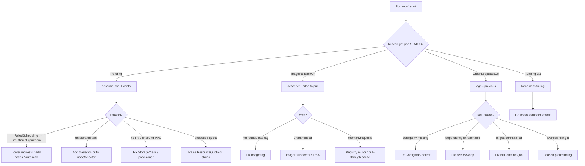

# 09 — Observability & Day-2 Operations

> **Audience:** Staff/principal engineers running production Kubernetes. This chapter is **K8s-specific** observability and debugging — the daily toolkit, the failure-mode decision trees, and the cost/right-sizing lens. General SLO/observability theory (RED/USE, SLIs, error budgets, tracing concepts) lives in [../sdlc/05_observability_slos.md](../sdlc/05_observability_slos.md); host-level perf (CPU/mem/IO/network internals) lives in [../os_net/operating_system/08_linux_internals_observability.md](../os_net/operating_system/08_linux_internals_observability.md). When the symptom crosses layers, drive it top-down with [../os_net/enterprise_scenarios/05_cross_layer_triage.md](../os_net/enterprise_scenarios/05_cross_layer_triage.md).

---

## 1. The K8s observability stack

Three signals (metrics, logs, traces) plus the **most underused signal in K8s: events**.

| Component | Provides | Consumed by | Not the same as |
|---|---|---|---|
| **metrics-server** | live CPU/mem per pod/node | `kubectl top`, **HPA** | a TSDB — no history, ~60s window |
| **Prometheus** | scraped time-series, alerting | Grafana, Alertmanager | metrics-server (which it does *not* replace) |
| **kube-state-metrics (KSM)** | object *state* (replicas desired vs ready, pod phase, restarts) | Prometheus | cAdvisor (which gives *resource* usage) |
| **node-exporter** | host metrics (disk, fs, load) | Prometheus | tied to [os_net](../os_net/operating_system/08_linux_internals_observability.md) |
| **cAdvisor** (in kubelet) | per-container CPU/mem/net/fs | Prometheus, metrics-server | KSM |
| **Grafana** | dashboards | humans | a data source |

**metrics-server vs Prometheus is the #1 confusion.** metrics-server feeds the *control loop* (HPA/`kubectl top`); it keeps no history. Prometheus is your *forensic* store. You need both. **cAdvisor answers "how much is this container using"; KSM answers "what does the API say about this object" (e.g., `kube_pod_status_phase`, `kube_deployment_status_replicas_available`).** Right-sizing and "desired vs ready" alerts come from KSM, not cAdvisor.

```bash
kubectl top nodes                       # needs metrics-server
kubectl top pods -A --sort-by=memory    # find the memory hog
kubectl top pod web-x --containers      # per-container breakdown
```

### Events — read these first

```bash
kubectl get events -n prod --sort-by=.lastTimestamp        # cluster narrative
kubectl get events --for pod/web-7c9 -n prod               # scoped to one object (1.26+)
kubectl get events -A --field-selector type=Warning
```

Events are **stored ~1h by default** (`--event-ttl`) — they vanish. For incidents, scrape them into Prometheus/Loki or use an event-exporter. The scheduler, kubelet, and controllers all narrate failures here before anything else surfaces.

### Logs & traces

Logs flow **stdout/stderr → container runtime → node files (`/var/log/pods`) → aggregator**. The node-level files rotate (~10Mi default); if a pod is deleted, its logs go with it unless shipped. Aggregate with **Loki** (label-based, cheap, pairs with Grafana), **ELK/EFK** (heavy, full-text), or **cloud logging** (CloudWatch/Stackdriver). Never write app logs to files inside the container — you lose them and bloat the writable layer.

**Traces** use **OpenTelemetry**: instrument app → OTel Collector (often a DaemonSet) → Tempo/Jaeger/cloud. Propagate `traceparent` through your ingress and service mesh so a span tree spans pods. Concepts and sampling strategy: [../sdlc/05_observability_slos.md](../sdlc/05_observability_slos.md).

---

## 2. The `kubectl` debugging toolkit

The daily loop. Memorize these.

```bash
# describe — the single highest-value command. Events at the bottom explain WHY.
kubectl describe pod web-7c9 -n prod

# logs — current, follow, and the crash-loop lifesaver: --previous
kubectl logs web-7c9 -n prod                 # current container
kubectl logs web-7c9 -c sidecar -n prod      # specific container
kubectl logs -f deploy/web -n prod           # follow a Deployment's pods
kubectl logs -p web-7c9 -n prod              # --previous: the container that just DIED

# exec into a running container
kubectl exec -it web-7c9 -n prod -- sh

# port-forward to test a service/pod locally (bypasses ingress)
kubectl port-forward svc/web 8080:80 -n prod

# copy files in/out
kubectl cp prod/web-7c9:/app/heap.hprof ./heap.hprof

# get the live, server-side object (defaults, status, managedFields)
kubectl get pod web-7c9 -n prod -o yaml

# events scoped to an object
kubectl events --for deploy/web -n prod
```

### `kubectl debug` + ephemeral containers — the distroless/crashed-pod answer

A **distroless** image has no shell; a **crashed** pod has nothing to exec into. Ephemeral containers attach a fresh debug image into the *running pod's namespaces* without restarting it.

```bash
# attach a debug container sharing the target's process namespace
kubectl debug -it web-7c9 -n prod \
  --image=nicolaka/netshoot \
  --target=web --share-processes
# now: ps aux, ss -tlnp, curl localhost:8080/healthz, nslookup ...

# debug a NODE (mounts host fs at /host, host namespaces)
kubectl debug node/ip-10-0-1-5 -it --image=busybox
chroot /host                                  # full host access for kubelet/disk triage

# copy a crashed pod, override the command so it stays up to inspect
kubectl debug web-7c9 -n prod --copy-to=web-dbg \
  --container=web -- sleep infinity
```

`--share-processes` lets you see the app's PIDs from the debug container (read `/proc/<pid>/`, attach strace). This is the modern replacement for baking `bash`/`curl` into prod images.

---

## 3. Failure-mode decision trees

The core of this chapter. Each is **Symptom → Cause → Fix**. Quick index:

| Symptom (`kubectl get pods` STATUS) | Most likely cause | First command |
|---|---|---|
| `Pending` | unschedulable: resources/taints/affinity/PVC/quota | `describe pod` (events) |
| `ImagePullBackOff` / `ErrImagePull` | bad tag / creds / rate limit | `describe pod` (events) |
| `CrashLoopBackOff` | app exits on start | `logs --previous` |
| `OOMKilled` (in last state) | limit too low / leak | `describe` → `top` |
| `Running` 0/1 READY | readiness probe / dep down | `describe` + `logs` |
| Node `NotReady` | kubelet/disk/network/PLEG | `describe node` |
| Service: no endpoints | selector mismatch / no ready pods | `get endpoints` |



### 3.1 Pending — unschedulable

> **Symptom:** Pod stuck `Pending`, no node assigned.
> **Cause/Fix** (read `describe pod` Events — the scheduler tells you exactly which predicate failed):

- **`Insufficient cpu`/`Insufficient memory`** → requests exceed any node's allocatable. **Fix:** lower requests, add/scale nodes, or enable Cluster Autoscaler/Karpenter. See [03 — Workloads, Pods & Scheduling](03_workloads_pods_scheduling.md).
- **`node(s) had untolerated taint`** → node tainted (e.g., `node-role.kubernetes.io/control-plane`, GPU, spot). **Fix:** add matching `tolerations` or correct `nodeSelector`/affinity.
- **`node(s) didn't match Pod's node affinity/selector`** → label mismatch. **Fix:** correct labels/affinity.
- **`pod has unbound immediate PersistentVolumeClaims`** → no PV, broken StorageClass/provisioner, or `WaitForFirstConsumer` zonal mismatch. **Fix:** check `kubectl get pvc,pv,sc`; verify CSI driver pods are healthy.
- **`exceeded quota`** → namespace `ResourceQuota` hit. **Fix:** `kubectl describe quota -n <ns>`; raise quota or reduce footprint.
- **All nodes `Unschedulable`** (cordoned) → see §5.

### 3.2 ImagePullBackOff / ErrImagePull

> **Symptom:** Pod `ImagePullBackOff` (after retries) or `ErrImagePull`.

- **`not found` / `manifest unknown`** → typo'd repo, wrong tag, or image never pushed. **Fix:** verify with `docker pull`/`crane manifest`; pin a digest.
- **`unauthorized` / `denied`** → private registry, missing creds. **Fix:** create `imagePullSecrets` (or use IRSA/workload identity for ECR/GCR/ACR). Confirm secret is referenced and in the right namespace.
- **`toomanyrequests` (Docker Hub rate limit)** → anonymous pulls throttled. **Fix:** authenticate, or run a pull-through cache / registry mirror.
- **`x509` / TLS** → private registry cert not trusted by the node. **Fix:** add CA to node's containerd config.

### 3.3 CrashLoopBackOff

> **Symptom:** Pod restarts repeatedly; backoff grows (10s → 20s → ... → 5m). **The status is a *consequence*; the cause is in the previous container's logs.**

```bash
kubectl logs -p web-7c9 -n prod              # the dead container's last words
kubectl describe pod web-7c9 -n prod         # Last State: Terminated, Exit Code, Reason
```

- **Exit on startup, config error** → missing/bad env var, ConfigMap/Secret not mounted, malformed config. **Fix:** correct config; verify mounts with `describe`.
- **Missing dependency / DB unreachable at boot** → app does `exit(1)` when it can't connect. **Fix:** fix networking/DNS ([04 — Kubernetes Networking](04_kubernetes_networking.md)); add retry/backoff in the app so a transient dep doesn't crash-loop.
- **Failed migration / init container** → `initContainer` errors block the main container forever. **Fix:** `kubectl logs web-7c9 -c <init> -n prod`.
- **Liveness probe killing a healthy-but-slow app** → probe fires before the app warms up. **Fix:** add `startupProbe` or raise `initialDelaySeconds`/`failureThreshold`. **This is a frequent self-inflicted CrashLoop.**
- **Exit Code 137** → SIGKILL — almost always OOM (see §3.4) or failed liveness.

### 3.4 OOMKilled

> **Symptom:** `describe` shows `Last State: Terminated, Reason: OOMKilled, Exit Code: 137`.

- **Limit too low** → working set legitimately exceeds `resources.limits.memory`. **Fix:** raise the limit; right-size from real usage (§4).
- **Memory leak** → usage grows unbounded until the cgroup kills it. **Fix:** profile (heap dump via `kubectl cp`), fix the leak. Distinguish leak vs spike using Prometheus `container_memory_working_set_bytes` over time.
- **JVM/runtime not container-aware** → heap sized off the *node*, not the *cgroup limit*. **Fix:** `-XX:MaxRAMPercentage` (modern JVMs are cgroup-aware), or set explicit heap < limit.
- **The kernel OOM-killer mechanics, RSS vs working set, and cgroup v2 `memory.max`** → [../os_net/operating_system/08_linux_internals_observability.md](../os_net/operating_system/08_linux_internals_observability.md). Note: only `working_set` counts toward the cgroup limit, not page cache.

### 3.5 Running but not Ready (0/1)

> **Symptom:** Pod `Running`, `READY 0/1`, **no traffic** (removed from Service endpoints).

- **Readiness probe failing** → wrong path/port, app slow to warm, or probe stricter than reality. **Fix:** `describe` shows `Readiness probe failed: ...`; test with `kubectl exec ... -- curl localhost:<port>/healthz`.
- **Probe depends on a down dependency** → readiness checks the DB; DB is down → whole fleet goes NotReady → outage amplified. **Fix:** make readiness check *self*, not deep deps (deep checks belong in a separate health endpoint/alert).
- **App bound to `localhost`, not `0.0.0.0`** → probe and Service can't reach it. **Fix:** bind all interfaces.

### 3.6 Node NotReady

> **Symptom:** `kubectl get nodes` shows `NotReady`; pods on it eventually evicted.

```bash
kubectl describe node ip-10-0-1-5             # Conditions + Events
kubectl debug node/ip-10-0-1-5 -it --image=busybox   # then chroot /host
```

- **Kubelet down / not reporting** → service crashed or clock skew. **Fix:** check `systemctl status kubelet`, `journalctl -u kubelet`.
- **`DiskPressure`** → node disk full (images, logs, ephemeral). **Fix:** prune images (`crictl rmi --prune`), fix log rotation, raise eviction thresholds.
- **`MemoryPressure`/`PIDPressure`** → node exhausted → kubelet evicts. **Fix:** right-size pods; set system-reserved.
- **`PLEG is not healthy`** → container runtime (containerd) hung/slow — the classic. **Fix:** check runtime health/disk IO; often a symptom of disk or too many containers.
- **Network/CNI** → node can't reach API or CNI broken. **Fix:** see [04 — Kubernetes Networking](04_kubernetes_networking.md).

### 3.7 Service has no endpoints

> **Symptom:** `curl svc` times out / connection refused; `kubectl get endpoints web` is `<none>`.

```bash
kubectl get endpoints web -n prod            # empty?
kubectl get pods -l app=web -n prod          # does the selector match anything?
```

- **Selector ↔ pod label mismatch** → Service `selector` doesn't match pod labels. **Fix:** align them. **The #1 cause** — Endpoints only populate from matching, **Ready** pods.
- **No Ready pods** → pods exist but `0/1` (see §3.5). Endpoints only include Ready pods. **Fix:** fix readiness.
- **`targetPort` wrong** → endpoints exist but point at a port the app isn't listening on. **Fix:** match `targetPort` to container port.
- **Headless/`ClusterIP: None`** mis-set, or NetworkPolicy blocking. **Fix:** see [04 — Kubernetes Networking](04_kubernetes_networking.md).

---

## 4. Resource & cost observability — right-sizing

The structural waste in every cluster: **requests are guesses set high "to be safe."** Requests reserve capacity on the node (scheduler math); if requests >> actual usage, you pay for idle reservation. Limits cap usage; limits too low cause OOMKills/throttling.

```bash
# requests vs reality
kubectl top pods -A
kubectl describe node ip-10-0-1-5 | grep -A6 "Allocated resources"
# Requests: cpu 3800m (95%)  but node CPU usage is 12% -> massive over-reservation
```

**Right-sizing rule of thumb:** set **CPU request** near the *typical* usage (p50–p90) and usually **no CPU limit** (avoid throttling); set **memory request = limit** near the *peak* working set (memory is incompressible — a too-low limit = OOMKill, not slowdown).

- **Over-provisioning waste** → requests far above usage → scheduler thinks the node is full while CPUs idle → you scale out nodes you don't need. **Fix:** use **VPA in recommendation mode** or historical Prometheus to set requests from data. Cross-ref [03 — Workloads, Pods & Scheduling](03_workloads_pods_scheduling.md) (QoS classes: Guaranteed/Burstable/BestEffort).
- **CPU throttling (hidden)** → pod under its CPU limit but `container_cpu_cfs_throttled_periods_total` high → latency you can't see in `top`. **Fix:** raise/remove CPU limit.
- **Idle nodes** → fragmentation or scaled-out-and-never-back. **Fix:** Cluster Autoscaler scale-down / Karpenter consolidation; bin-pack with priorities.
- **Cost attribution** → **OpenCost** (CNCF, open source) or **Kubecost** map spend to namespace/label/team using requests + cloud pricing. **Fix:** chargeback/showback by team label; alert on cost regressions. Mechanically: `cost ≈ Σ(request × node $/unit × time)` plus idle.

---

## 5. Cluster upgrades & node lifecycle (brief)

Day-2 nodes get patched, drained, and replaced. Full hardening, PDB strategy, and upgrade choreography are in [10 — Production Hardening, Multi-Tenancy & Upgrades](10_production_hardening_multitenancy.md); the essentials:

```bash
kubectl cordon ip-10-0-1-5                          # mark unschedulable (no new pods)
kubectl drain ip-10-0-1-5 \
  --ignore-daemonsets --delete-emptydir-data        # evict gracefully
# ... patch / replace the node ...
kubectl uncordon ip-10-0-1-5                         # back in rotation
```

- **`drain` blocks on `PodDisruptionBudgets`** → a PDB (`minAvailable`/`maxUnavailable`) refuses eviction that would breach availability. **This is correct behavior** — it protects you from draining the last replica. **Fix if stuck:** the workload only has 1 replica (scale up first), or a PDB is mis-set to `minAvailable: 100%` (a deadlock).
- **No PDB** → drain evicts everything at once → momentary outage. **Fix:** define PDBs for every stateful/critical Deployment.
- **`emptyDir`/local data lost on drain** → expected; persist to PVCs.
- **Rolling node upgrades** → surge new nodes, drain old, respect PDBs; one node group at a time. Validate with the symptom trees above after each batch.

---

## 6. "The service on K8s is slow / erroring" — top-down drill

When the alert is vague, **drive down the stack** instead of guessing. This mirrors the cross-layer method in [../os_net/enterprise_scenarios/05_cross_layer_triage.md](../os_net/enterprise_scenarios/05_cross_layer_triage.md) — bisect the path, don't tunnel on one layer.

1. **Pod** — `kubectl get pods -l app=web` → any not Ready/restarting? `kubectl top pods` → CPU/mem pressure? `kubectl logs` → app errors? Check restart counts and §3.3–3.5.
2. **Service** — `kubectl get endpoints web` → are there Ready endpoints? `port-forward` directly to a pod: if **pod is fast but Service is slow**, the problem is between them (endpoints/kube-proxy/NetworkPolicy) → [04](04_kubernetes_networking.md).
3. **Ingress** — `kubectl describe ingress` and controller logs; check TLS, timeouts, 502/504 (upstream unready) vs 503 (no endpoints). Test internal `svc` vs external URL to isolate ingress.
4. **Node** — `kubectl top nodes`, `describe node` Conditions; is one node hot/under DiskPressure causing skewed latency? Use node-exporter dashboards.
5. **Dependency** — DB/cache/external API. Use **traces** (OTel) to find which span dominates latency; check connection-pool saturation. Concepts: [../sdlc/05_observability_slos.md](../sdlc/05_observability_slos.md).
6. **Host/kernel** — if a single node is pathological, drop to host tools (CPU run-queue, IO wait, conntrack table full, ephemeral port exhaustion): [../os_net/operating_system/08_linux_internals_observability.md](../os_net/operating_system/08_linux_internals_observability.md).

**Bisection beats intuition:** confirm each hop is healthy before descending. `port-forward` (skip Service+ingress) and curl-from-debug-pod (skip ingress) are your two best bisection probes.

---

> Next: [10 — Production Hardening, Multi-Tenancy & Upgrades](10_production_hardening_multitenancy.md) — RBAC least-privilege, Pod Security Standards, NetworkPolicy default-deny, namespace isolation and quotas, PDB-safe upgrade choreography, and admission control (OPA/Kyverno) that keeps the failure modes in this chapter from ever reaching prod.
