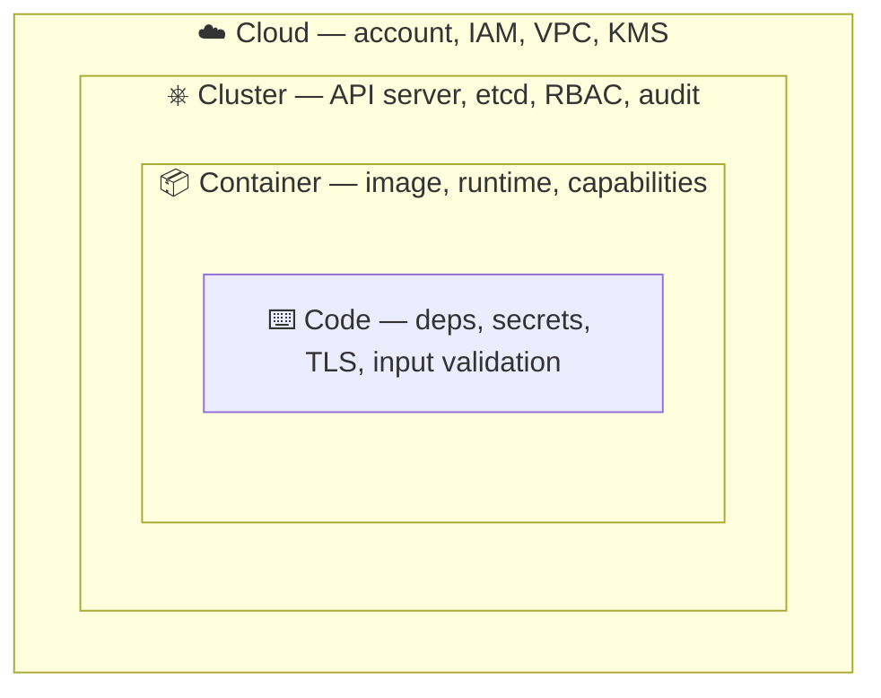

# 10 — Production Hardening, Multi-Tenancy, Upgrades & When-Not-To

> **Audience:** Staff/principal engineers owning Kubernetes in production. The **capstone** — final chapter of the `cloud_kubernetes/` track. Earlier chapters taught how K8s works; this is the principal's playbook for running it *safely*, for *many* teams, *over years* — and the honesty to say when you shouldn't run it at all.

---

## 1. Security hardening — the 4 C's

Security is layered: each layer is only as secure as the one outside it — a hardened pod on a compromised node is still compromised. Fix outside in.



**Code** is where *you* introduce most risk (deps, hardcoded secrets, injection); ties directly to [../sdlc/08_devsecops_security_sdlc.md](../sdlc/08_devsecops_security_sdlc.md). The outer three are platform concerns covered below.

### 1.1 Cluster hardening

- **RBAC least-privilege.** No `cluster-admin` for humans or CI; scope `Role` to namespaces; no wildcard `verbs`/`resources`. See [06 — Config, Secrets, RBAC & Admission Control](06_config_secrets_rbac_admission.md).
- **Disable anonymous auth** (`--anonymous-auth=false`).
- **Audit logging** on, shipped off-cluster — a deleted audit log on a breached cluster is useless.
- **Encrypt etcd at rest** (KMS) — etcd holds every Secret in plaintext otherwise.
- **Private API endpoint** — no public `kube-apiserver`; reach it via VPC/bastion/VPN.

```bash
# WRONG: kube-apiserver --anonymous-auth=true              # ❌ default-open, public
# RIGHT (managed clusters expose these as flags/config):
kube-apiserver --anonymous-auth=false \
  --audit-log-path=/var/log/k8s-audit.log \
  --encryption-provider-config=/etc/kubernetes/enc.yaml    # KMS-backed
```

### 1.2 Node hardening

- **Minimal OS** — Bottlerocket, Flatcar, GKE COS. Smaller attack surface, faster patching.
- **No SSH.** Debug via `kubectl debug node/...` ephemeral containers — an SSH key on a node is a lateral-movement vector.
- **Read-only root filesystem** where supported; immutable, image-based nodes you *replace*, not patch in place.

### 1.3 Pod / container security — **Pod Security Standards: `restricted`**

Enforce via the built-in Pod Security Admission. The `restricted` profile blocks privileged pods, host namespaces, and requires non-root + dropped capabilities.

```yaml
# Namespace enforcing the restricted PSS profile
apiVersion: v1
kind: Namespace
metadata:
  name: payments
  labels:
    pod-security.kubernetes.io/enforce: restricted   # block; also /warn + /audit
    pod-security.kubernetes.io/enforce-version: latest
```

```yaml
# WRONG — root, writable fs, full caps, privileged, mutable tag
spec:
  containers:
    - { name: app, image: myapp:latest, securityContext: { privileged: true } }  # ❌ owns the node
```

```yaml
# RIGHT — non-root, read-only fs, all caps dropped, seccomp on, digest-pinned
spec:
  securityContext: { runAsNonRoot: true, seccompProfile: { type: RuntimeDefault } }
  containers:
    - name: app
      image: registry.internal/myapp@sha256:abc123…   # pinned digest
      securityContext:
        allowPrivilegeEscalation: false
        readOnlyRootFilesystem: true
        capabilities: { drop: ["ALL"] }
```

### 1.4 Image & supply-chain security

- **Scan** images in CI and continuously in the registry (Trivy, Grype).
- **Sign & verify** — Cosign/Sigstore; admission policy rejects unsigned images.
- **Minimal / distroless** base images — no shell, no package manager, nothing to pivot with.
- **Pin by digest**, never `:latest`. Tags are mutable; digests are not.
- The SDLC supply chain — SBOMs, provenance, attestations → [../sdlc/08_devsecops_security_sdlc.md](../sdlc/08_devsecops_security_sdlc.md).

### Hardening checklist

- [ ] RBAC reviewed; no human/CI `cluster-admin`; no wildcard roles
- [ ] Anonymous auth disabled; API endpoint private
- [ ] etcd encrypted at rest (KMS); audit logs shipped off-cluster
- [ ] Nodes: minimal OS, no SSH, image-based & replaceable
- [ ] PSS `restricted` enforced on workload namespaces
- [ ] Images scanned + signed + distroless + digest-pinned
- [ ] Default-deny NetworkPolicy per namespace (see §2)

---

## 2. Multi-tenancy — soft vs hard

K8s has **no hard tenant boundary** by default — a namespace is a *name* scope, not a security boundary. You build isolation from primitives.

| Dimension | Soft multi-tenancy | Hard multi-tenancy |
|---|---|---|
| Mechanism | Namespaces + RBAC + ResourceQuota + NetworkPolicy + PSS | Separate clusters / vClusters / dedicated node pools |
| Tenant boundary | Logical | Physical (kernel/node/cluster) |
| Blast radius | Whole cluster on control-plane failure | Per-tenant |
| Noisy neighbor | Possible (shared kernel/nodes) | Contained |
| Cost / overhead | Low — shared control plane | High — N control planes |
| Trust model | Cooperative internal teams | Untrusted / regulated / external |

**Soft tenancy** (namespace-per-team) suits cooperating internal teams. Enforce with all four primitives together — any one alone leaks:

```yaml
# ResourceQuota: cap a tenant's footprint (stop noisy neighbors)
apiVersion: v1
kind: ResourceQuota
metadata: { name: team-quota, namespace: team-a }
spec:
  hard:
    requests.cpu: "20"
    requests.memory: 64Gi
    pods: "100"
---
# Default-deny NetworkPolicy: tenants can't reach each other's pods
apiVersion: networking.k8s.io/v1
kind: NetworkPolicy
metadata: { name: default-deny, namespace: team-a }
spec:
  podSelector: {}
  policyTypes: ["Ingress", "Egress"]
```

**Hard tenancy** when tenants are untrusted, regulated (PCI/HIPAA), or business-critical enough to need their own blast radius. Options, increasing cost: dedicated **node pools** (taints/tolerations) → **virtual clusters** (vCluster: own API server, shared nodes) → **separate clusters**.

**When to split clusters:** untrusted tenants; hard regulatory isolation; independent upgrade cadence; blast-radius limits for tier-0; or a single cluster past practical scale (~5k nodes). **Cluster-per-team** trades operational overhead (N upgrades, N add-on stacks) for isolation — don't pay it for cooperating teams.

---

## 3. Cluster upgrades & lifecycle

### 3.1 Version-skew policy

- **kubelet may be up to 3 minor versions behind** the API server (1.30 API ↔ 1.27 kubelet OK).
- **kubelet must never be newer** than the API server.
- Therefore: **upgrade the control plane first, then nodes** — never the reverse.

### 3.2 Upgrade strategy

1. Read release notes for **removed APIs** and behavioral changes.
2. Upgrade **control plane** one minor version at a time (no skipping).
3. Roll **node pools** behind it. Prefer **blue-green node pools**: stand up a new pool, cordon+drain the old, delete it — instant rollback by keeping the old pool around.

```bash
# Drain a node safely — respects PodDisruptionBudgets
kubectl cordon node-old-1                       # stop new scheduling
kubectl drain node-old-1 \
  --ignore-daemonsets --delete-emptydir-data    # evict, honoring PDBs
```

```yaml
# PDB: keep capacity during drains/upgrades — without it, drain can take you to zero
apiVersion: policy/v1
kind: PodDisruptionBudget
metadata: { name: api-pdb }
spec:
  minAvailable: 80%
  selector:
    matchLabels: { app: api }
```

### 3.3 Deprecated API migration (the real pain)

Upgrades break when an `apiVersion` is *removed* (not just deprecated). Classic: `extensions/v1beta1 Ingress` → `networking.k8s.io/v1`. Find usage *before* upgrading.

- **Symptom:** post-upgrade `kubectl apply` fails `no matches for kind ... in version ...`; GitOps sync errors.
- **Cause:** manifests / Helm charts pinned to a removed apiVersion.
- **Fix:** scan with `kubent` (kube-no-trouble) or `pluto`; bump apiVersions in Git; re-render Helm charts **before** the control-plane upgrade lands.

### 3.4 Managed auto-upgrade channels & testing

Managed clusters offer release channels (GKE rapid/regular/stable; EKS/AKS auto-upgrade). Use **stable/regular** for prod, **set maintenance windows**, and **always upgrade a staging cluster first** — the same GitOps config replayed against staging ([08 — Deploying to Kubernetes](08_deploying_helm_gitops_operators.md)).

---

## 4. Managed K8s differences (EKS vs GKE vs AKS)

Managed control plane removes etcd/API-server toil — but **you still own nodes, add-ons, RBAC, networking, upgrades**.

| Aspect | EKS (AWS) | GKE (Google) | AKS (Azure) |
|---|---|---|---|
| Control plane | Managed, hourly $ | Managed (Autopilot = fully managed nodes too) | Managed, free tier |
| Identity → pods | IRSA / EKS Pod Identity | Workload Identity | Workload Identity / AAD |
| Default CNI | AWS VPC CNI (pod = VPC IP, IP-exhaustion gotcha) | GKE native, alias IPs | Azure CNI / kubenet |
| Upgrade ownership | You trigger CP + nodes | Channels can auto-upgrade | Channels + you |
| Notable gotcha | VPC CNI IP exhaustion; add-on version drift | Autopilot constraints (no DaemonSets/privileged) | kubenet vs Azure CNI choice is sticky |

**Self-managed (kubeadm/kops)** only when you need control the cloud won't give (air-gapped, custom control-plane flags, on-prem) — you then own etcd backups, API-server HA, and cert rotation, all recurring toil. **Default to managed.**

---

## 5. Disaster recovery

The principal's test: **"Can you rebuild the entire cluster from Git + backups, with no manual snowflake steps?"** If not, you don't have DR — you have hope.

- **etcd backup/restore** (self-managed): scheduled `etcdctl snapshot save`, off-cluster, restore *tested*. Managed clusters do this for the control plane — but **not your workloads**.
- **Velero** for workload + PV backup/restore and cross-cluster migration. Schedule it; test restores into a scratch cluster.
- **Multi-AZ** (nodes/control plane across zones) is table stakes — survives a zone outage. **Multi-region** is for region-failure tolerance: expensive, usually active-passive; justify it against the actual RTO/RPO.
- **Stateful data** is the hard part — DB DR lives in the *data layer* (replication, PITR backups), not in K8s manifests. K8s reschedules pods; it does not restore your data.

```bash
# Velero: scheduled backup + restore-test (chaos-style validation)
velero schedule create daily --schedule="0 2 * * *" --include-namespaces=team-a
velero restore create --from-backup daily-20260623 --namespace-mappings team-a:dr-test
```

Rebuild-from-Git is the GitOps payoff ([08](08_deploying_helm_gitops_operators.md)); rehearse it as a game day → [../sdlc/07_chaos_resilience_engineering.md](../sdlc/07_chaos_resilience_engineering.md).

---

## 6. Cost & efficiency at scale — the FinOps loop

K8s makes waste invisible: requests reserve capacity whether used or not. Three levers, run on a loop.

- **Rightsizing** — set requests from observed P95 (VPA, [09 — Observability & Day-2 Operations](09_observability_day2_operations.md)). Over-requesting is the #1 cost leak.
- **Bin-packing** — let the scheduler/Karpenter consolidate pods onto fewer, fuller nodes; scale node count to demand.
- **Spot/preemptible** for fault-tolerant + batch (huge savings); keep tier-0 on on-demand.
- **Idle reduction** — scale dev/staging to zero off-hours; delete zombie namespaces.

> **FinOps loop:** *attribute* (cost per team via labels + Kubecost/OpenCost) → *report* (showback/chargeback) → *optimize* (rightsize, spot, consolidate) → repeat. Without attribution, no team owns its waste.

---

## 7. When NOT to use Kubernetes

The principal's honesty: **K8s is a platform for building platforms** — rarely the answer for *running one app*. It carries a permanent **complexity tax**, paid continuously in upgrades, security, networking, and on-call.

| Situation | Better choice |
|---|---|
| One/few stateless web services | **Cloud Run / App Runner / Fargate / ECS** — no nodes to own |
| Event-driven / spiky / glue code | **Serverless functions** (Lambda/Cloud Functions) |
| Classic monolith, stable footprint | **PaaS (Heroku-style)** or plain **VMs + autoscaling group** |
| Tiny team, no platform/ops maturity | Managed PaaS — you cannot afford the K8s tax |
| Strict, simple, single-tenant compliance app | A locked-down VM may be easier to certify |

**Prerequisites:** more than a handful of services *and* teams; dedicated platform/SRE capability; operational maturity (CI/CD, observability, on-call) already in place. Adopting K8s to *get* those things is backwards — get them first. It's a system-design trade-off → [../system_design/](../system_design/README.md).

- **Symptom:** one team fighting Helm/Ingress/upgrades instead of shipping. **Cause:** adopted K8s for hype, not requirements. **Fix:** move to Cloud Run/Fargate; revisit when scale and team count justify the tax.

---

## 8. Platform engineering & paved roads

At scale you don't hand app teams raw K8s — you hand them a **paved road (golden path):** the supported, secure, easy way to ship, with the platform absorbing the YAML.

- **Internal Developer Platform (IDP)** — a thin self-service layer (Backstage, a CLI, curated Helm/Crossplane templates) emitting pre-hardened manifests (PSS `restricted`, NetworkPolicy, PDB, requests, dashboards) by default.
- **Abstract K8s away** — teams declare *intent* ("a service, this image, this traffic"); the platform renders the K8s reality. Secure-by-default, not secure-if-remembered.
- The paved road must be the *path of least resistance*, or teams route around it — golden paths win on ergonomics, not mandates.

---

## 9. Production-readiness checklist (a service on K8s)

- [ ] **Resources:** requests *and* limits set from real usage
- [ ] **Resilience:** ≥2 replicas; PDB; anti-affinity/topology spread across zones
- [ ] **Health:** liveness, readiness, *and* startup probes correct (not copy-pasted)
- [ ] **Security:** PSS `restricted`; non-root; read-only fs; caps dropped; signed, digest-pinned, scanned image
- [ ] **Network:** default-deny NetworkPolicy + explicit allows
- [ ] **Config/secrets:** externalized; secrets from a manager, not env literals ([06](06_config_secrets_rbac_admission.md))
- [ ] **Observability:** RED/USE metrics, structured logs, traces, SLOs + alerts ([09](09_observability_day2_operations.md))
- [ ] **Lifecycle:** graceful `SIGTERM` + `terminationGracePeriodSeconds`; no removed apiVersions
- [ ] **Delivery:** deployed via GitOps; rollback rehearsed ([08](08_deploying_helm_gitops_operators.md))
- [ ] **DR:** workload/data backup tested; rebuild-from-Git verified
- [ ] **Cost:** owning team labeled; cost attributed; rightsized

If a service can't tick these, it isn't production-ready — it's an incident waiting for a pager.

---

> **Related:** [README](README.md) · [../sdlc/](../sdlc/README.md) · [../os_net/](../os_net/README.md) · [../system_design/](../system_design/README.md). The final chapter of the track — go build platforms, not snowflakes.
