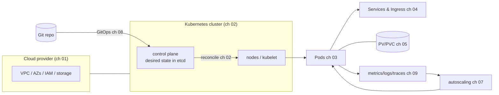

# Cloud & Kubernetes — running services on the provider substrate ☁️⎈

> **Audience:** staff/principal engineers who operate real services on Kubernetes at
> a cloud provider, at FAANG scale. This is the **substrate the day job runs on** —
> not container internals (those live in [`../os_net/`](../os_net/README.md)) and not
> distributed-systems architecture (that's [`../system_design/`](../system_design/README.md)),
> but the operational reality between them: how a cloud account is shaped, how a
> Kubernetes cluster actually works, and how you deploy, scale, secure, observe, and
> harden workloads on it without paging yourself at 3am.

Kubernetes is the dominant orchestration substrate, and "it works on my cluster" is
no more acceptable than "works on my machine." The difference between a senior and a
principal here is operating it: requests/limits and QoS that don't OOMKill under load,
networking that doesn't black-hole traffic, autoscaling that tracks the *real*
bottleneck, GitOps so the cluster never drifts from Git, and the judgment to know
**when not to use Kubernetes at all**. This track teaches the substrate first
principles → production.

---

## 📚 Chapters

| # | Doc | What it covers |
|---|-----|----------------|
| 01 | [Cloud Provider Foundations](01_cloud_provider_foundations.md) | IaaS/PaaS, the shared-responsibility model, regions/AZs as failure domains, compute (spot/reserved), VPC networking, block/object/file storage, cloud IAM, the cost model — AWS/GCP/Azure side by side |
| 02 | [Kubernetes Architecture & the Reconciliation Model](02_kubernetes_architecture.md) | control plane (apiserver/etcd/scheduler/controllers), nodes (kubelet/CRI/kube-proxy), the **reconciliation loop**, the API/object model (spec vs status), managed K8s |
| 03 | [Workloads, Pods & Scheduling](03_workloads_pods_scheduling.md) | Pods/init/sidecars, Deployment vs StatefulSet vs DaemonSet vs Job, **requests/limits & QoS**, affinity/taints/topology-spread, priority/preemption, **health probes** |
| 04 | [Kubernetes Networking](04_kubernetes_networking.md) | the pod-IP model, **CNI** (Calico/Cilium/eBPF), Services (ClusterIP/LB/headless) & kube-proxy, CoreDNS, Ingress/Gateway API, **NetworkPolicy**, service mesh |
| 05 | [Storage & Stateful Workloads](05_storage_stateful_workloads.md) | volumes, **PV/PVC/StorageClass**, CSI & dynamic provisioning, StatefulSet storage & AZ-pinning, databases-on-K8s honesty, snapshots/backup |
| 06 | [Configuration, Secrets, RBAC & Admission Control](06_config_secrets_rbac_admission.md) | ConfigMaps, Secrets & their weakness (external secrets/KMS), ServiceAccounts & **workload identity** (no long-lived keys), **RBAC**, admission webhooks, **Pod Security Standards**, OPA/Kyverno |
| 07 | [Scaling & Autoscaling](07_scaling_autoscaling.md) | **HPA** (on the right metric), VPA, **Cluster Autoscaler vs Karpenter**, spot at scale, **PodDisruptionBudgets**, KEDA/scale-to-zero, capacity & bin-packing |
| 08 | [Deploying: Helm, Kustomize, GitOps & Operators](08_deploying_helm_gitops_operators.md) | Helm vs Kustomize, **GitOps** (ArgoCD/Flux reconcile from Git), progressive delivery (Argo Rollouts/Flagger), **Operators/CRDs**, pin-the-digest |
| 09 | [Observability & Day-2 Operations](09_observability_day2_operations.md) | Prometheus/kube-state-metrics/OTel, the `kubectl` debug toolkit + `kubectl debug`, the **failure-mode decision trees** (Pending/CrashLoop/OOMKilled/ImagePull/NotReady), cost observability |
| 10 | [Production Hardening, Multi-Tenancy, Upgrades & When-Not-To](10_production_hardening_multitenancy.md) | the **4 C's** of security, soft vs hard multi-tenancy, cluster upgrades & version skew, DR/etcd backup, managed-K8s differences, **when NOT to use K8s**, platform engineering |

---

## 🎯 The mental model

The recurring idea is **reconciliation**: you declare desired state (in the cluster
API, and in Git via GitOps), and controllers continuously drive reality toward it.
Everything else — scheduling, scaling, deployment, self-healing — is a controller
loop on that principle.

---

## 🧵 The through-lines

- **Declare, don't imperatively script.** The cluster (ch 02) and your deploys (ch 08)
  are desired-state reconciled, not commands run once. Drift is the enemy.
- **Requests/limits are the contract.** Get them wrong (ch 03) and you OOMKill, throttle,
  or waste money — the #1 source of K8s production pain (cross-ref [os_net CFS/OOM incidents](../os_net/enterprise_scenarios/01_cpu_memory_incidents.md)).
- **Scale on the real bottleneck, never default to CPU** (ch 07) — and protect availability
  with PodDisruptionBudgets during the inevitable node churn.
- **Identity without long-lived keys.** Workload identity federation (ch 06) is the modern
  answer to "a pod needs cloud access" — pair it with RBAC least-privilege and admission policy.
- **K8s is a platform for building platforms.** It is powerful and complex; a principal knows
  the complexity tax and when serverless/PaaS/VMs win instead (ch 10).

---

## 🔗 Where this connects

- **Container internals** (namespaces/cgroups/runc/overlayfs) and **host observability**:
  [`../os_net/operating_system/`](../os_net/operating_system/README.md) ·
  **network stack & cloud networking**: [`../os_net/comp_networking/`](../os_net/comp_networking/README.md) ·
  **incident runbooks**: [`../os_net/enterprise_scenarios/`](../os_net/enterprise_scenarios/README.md).
- **The process spine** — CI/CD, progressive delivery, observability/SLOs, DevSecOps:
  [`../sdlc/`](../sdlc/README.md) (this track is where those land on K8s).
- **Fleet/config-mgmt & immutable images** at the host level: [`../modern_os/linux/16_fleet_config_management.md`](../modern_os/linux/16_fleet_config_management.md).
- **Architecture above**: [`../system_design/`](../system_design/README.md).

> Staff/principal engineers are expected to run services on this substrate *and* to
> push back on it when it's the wrong tool. This track is both halves.
