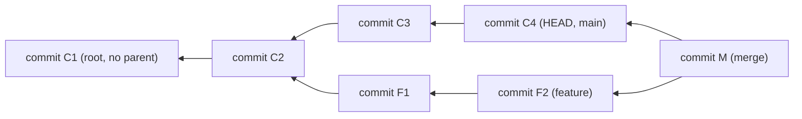
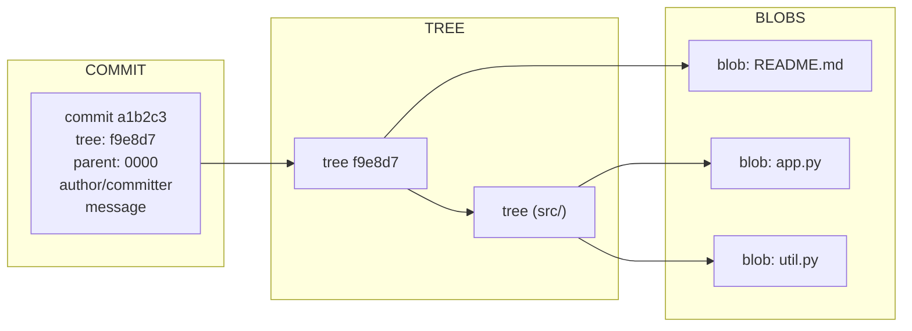
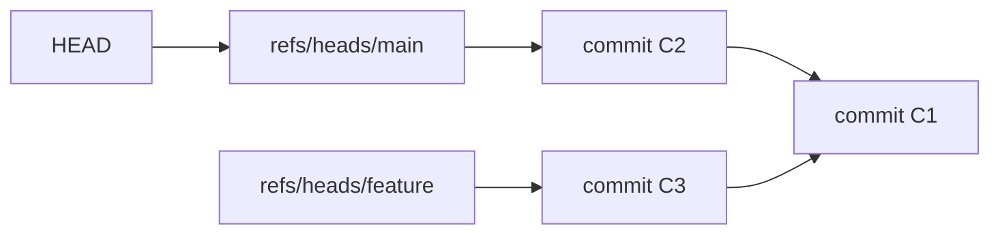
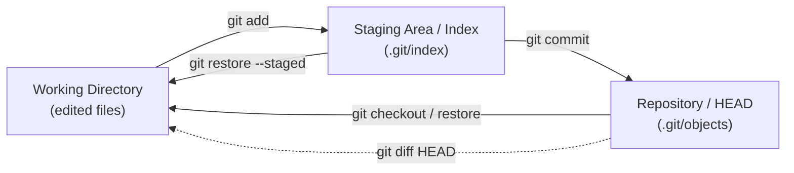
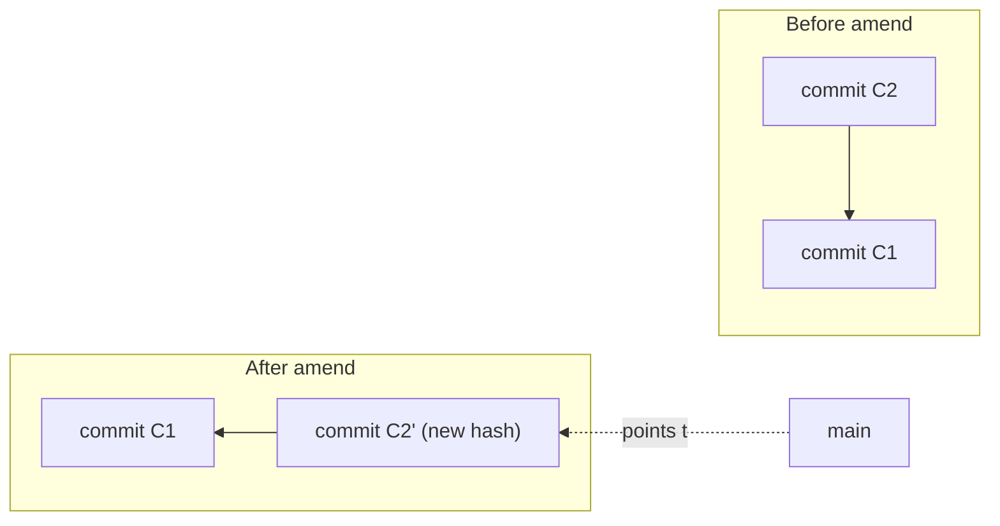

# 01 — Git Foundations & the Object Model

> **Audience:** Engineers starting from zero who want more than recipes. We build Git from first principles — what it *actually stores on disk* — so that every later command (rebase, cherry-pick, reflog surgery) feels obvious instead of magical. By the end you will be able to reach into `.git/` with `git cat-file` and read history the way the plumbing does. This is the foundation a principal engineer relies on when the porcelain commands stop being enough.

---

## 1. What Git Is

Git is a **distributed version control system (DVCS)**. "Distributed" means every clone is a *complete* repository: full history, every version of every file, all branches. There is no privileged central server in the Git model itself — GitHub is a *convention*, not a requirement. You can commit, branch, diff, and view history with the network unplugged.

Contrast this with **centralized VCS** like Subversion (SVN):

| | Centralized (SVN) | Distributed (Git) |
|---|---|---|
| History location | On the server only | In every clone |
| Commit | Requires server round-trip | Local, instant |
| Offline work | Mostly blocked | Fully functional |
| Branching | Heavy (server-side copy) | Cheap (a 40-byte pointer) |
| Unit of versioning | File deltas (diffs) | **Snapshots** of the whole tree |

That last row is the deepest idea. Many systems store a file as *the original plus a chain of deltas*. **Git does not think in deltas.** Each commit records a complete **snapshot** of what every tracked file looked like at that moment. (Git *compresses* identical content and *packs* deltas on disk for efficiency — but that is a storage optimization, invisible to the model. Conceptually: snapshots all the way down.)

Git is also a **content-addressable filesystem**. You hand it content; it hands you back a hash. That hash *is* the address — give the same content again, get the same hash. History is a **DAG** (directed acyclic graph) of commits, each pointing at its parent(s).



Arrows point **backward in time**: a child knows its parent, never the reverse. That single rule explains why commits are immutable and why "rewriting history" creates *new* commits rather than editing old ones (Section 8).

---

## 2. Setup: init, clone, config

Start a brand-new repository, or copy an existing one:

```bash
git init my-project        # create .git/ in a new/existing dir
# Initialized empty Git repository in /home/p/my-project/.git/

git clone https://github.com/org/repo.git   # full copy: history + a 'origin' remote
# Cloning into 'repo'...
```

### Configuration scopes

`git config` reads/writes three layered files. More specific wins:

| Scope | Flag | File | Applies to |
|---|---|---|---|
| System | `--system` | `/etc/gitconfig` | All users on the machine |
| Global | `--global` | `~/.gitconfig` | All your repos |
| Local | `--local` | `.git/config` | This repo only (default) |

```bash
git config --global user.name  "Parveen Kumar"
git config --global user.email "parveen.kumar@takeda.com"
git config --global core.editor "code --wait"     # editor for commit msgs
git config --global alias.lg "log --oneline --graph --all --decorate"

git config --list --show-origin   # see every setting and which file it came from
git config user.email             # read the effective value here
```

Aliases turn long incantations into muscle memory. `git lg` (defined above) becomes your everyday history viewer.

### The `.git/` directory tour

```bash
ls -F .git/
# HEAD          -> symbolic ref naming the current branch
# config        -> this repo's --local settings
# description   -> used only by GitWeb
# hooks/        -> sample pre-commit / pre-push scripts
# index         -> the staging area (binary)
# objects/      -> the object database: blobs, trees, commits, tags
# refs/         -> heads/ (branches), tags/, remotes/
```

`objects/` and `refs/` are the whole game. Everything else is configuration and convenience.

---

## 3. The Object Model — the Heart

Git stores exactly **four** types of object, each named by the **hash of its own content**:

| Object | Stores | Points to | Analogy |
|---|---|---|---|
| **blob** | Raw file *contents* (no name, no mode) | nothing | A file's bytes |
| **tree** | A directory listing: names + modes + child hashes | blobs & trees | A folder |
| **commit** | One tree hash + parent(s) + author + committer + message | one tree, parent commit(s) | A snapshot + metadata |
| **tag** | A name + target hash + tagger + message (annotated tags) | usually a commit | A labeled bookmark |

Every object is keyed by a cryptographic hash of its content — historically **SHA-1** (40 hex chars), now migrating to **SHA-256**. Same bytes → same hash, always. This is what "content-addressable" means.

### Hashing content yourself

```bash
echo "hello git" | git hash-object --stdin
# 8d0e41234f24b6da002d962a26c2495ea16a425f   <- the blob's SHA-1

echo "hello git" | git hash-object -w --stdin   # -w also writes it into objects/
```

The hash is computed over a header (`blob <size>\0`) plus the content — which is why an empty file and a one-byte file get wildly different addresses.

### How a commit points to a tree points to blobs



A commit names **one** top-level tree. That tree lists files (blobs) and subdirectories (more trees). Walk the tree and you have the *entire* project at that instant — a true snapshot.

### Reading the database directly

```bash
git cat-file -t a1b2c3        # what TYPE is this object?
# commit

git cat-file -p HEAD          # PRETTY-print the commit object
# tree f9e8d7a...
# parent 0000000...
# author Parveen Kumar <parveen.kumar@takeda.com> 1718000000 +0000
# committer Parveen Kumar <parveen.kumar@takeda.com> 1718000000 +0000
#
# Initial commit

git ls-tree HEAD              # list the top-level tree
# 100644 blob 8d0e412...    README.md
# 040000 tree 2b1c3d4...    src

git cat-file -p 8d0e412       # print a blob = the file's contents
# hello git
```

Notice the commit carries **both** `author` (who wrote the change) and `committer` (who applied it). They differ after a rebase or a patch applied on someone's behalf — a detail that matters in Section 9 and in [07 — Advanced Git Internals](07_advanced_internals_power_tools.md).

---

## 4. Refs: Branches and Tags Are Just Pointers

A **branch** is not a container of commits. It is a single file holding one 40-char SHA — a *pointer* to the tip commit. Tags are the same.

```bash
cat .git/refs/heads/main
# a1b2c3d4e5f6...        <- main is literally this commit

git update-ref refs/heads/experiment a1b2c3   # create a branch = write a file
```

This is why branching is O(1) and effectively free: creating a branch writes ~41 bytes. Committing on a branch just advances its file to the new commit's hash.

### HEAD — where am I?

**HEAD** is a *symbolic ref*: a pointer to a pointer. Normally it names the branch you're on.

```bash
cat .git/HEAD
# ref: refs/heads/main      <- HEAD -> main -> commit a1b2c3
```



When HEAD points at a *branch*, new commits move that branch forward. When HEAD points *directly at a commit*, you are in **detached HEAD** (Section 9).

### packed-refs

With thousands of refs, one tiny file per ref is wasteful. `git gc` collapses them into a single `.git/packed-refs` file. If a ref isn't in `refs/heads/` as a loose file, look there:

```bash
cat .git/packed-refs
# 5a6b7c8... refs/tags/v1.0.0
# 9d0e1f2... refs/remotes/origin/main
```

Loose refs override packed ones, so you rarely think about this — until a script greps the wrong place.

---

## 5. The Three Areas (Trees)

Every file in a Git workflow lives in one of three "trees." Understanding the boundaries between them eliminates the single most common beginner confusion (Section 9).

| Area | A.k.a. | Where it lives | Holds |
|---|---|---|---|
| **Working directory** | worktree | Your actual files on disk | What you currently see/edit |
| **Staging area** | index, cache | `.git/index` (binary) | The *proposed* next snapshot |
| **Repository** | HEAD | `.git/objects` + refs | The *last committed* snapshot |



The flow:

```bash
# 1. You edit app.py in the working directory
git status
# Changes not staged for commit:
#   modified:   app.py

# 2. Stage it -> creates/refers a blob, updates the index
git add app.py
git status
# Changes to be committed:
#   modified:   app.py

# 3. Commit -> writes a tree from the index + a commit object, advances the branch
git commit -m "Fix bug in app.py"
# [main 7f8a9b0] Fix bug in app.py
```

`git add` is the often-missed middle step. It is *not* "mark file for the next commit" in a vague sense — it physically snapshots the file's current content into the index. Edit the file again *after* `git add` and you must `add` again, or the commit captures the earlier version. We drill this in [02 — Everyday Workflow](02_everyday_workflow.md).

---

## 6. Immutability & Integrity

Because every object's name **is** the hash of its content, you cannot alter an object without changing its address. Change one byte of a file → new blob hash → the enclosing tree's hash changes → the commit's hash changes → every descendant commit's hash changes. History is therefore a **Merkle chain**: each commit's identity cryptographically incorporates its entire ancestry.

Consequences:

- **Tamper-evident.** If an object on disk is corrupted or maliciously edited, its content no longer matches its hash. `git fsck` detects this instantly.
- **Deduplication is free.** Two identical files anywhere in history share one blob.
- **Verification is cheap.** A commit hash certifies the exact state of the whole tree and all history behind it. This is the basis of signed commits/tags (covered later).

```bash
git fsck --full
# Checking object directories: 100% (256/256), done.
# Checking objects: 100% (1024/1024), done.
```

---

## 7. What "Rewriting History" Really Means

You can never *edit* a commit. `git commit --amend`, `git rebase`, and `git filter-repo` all do the same thing under the hood: **build new objects** and **move a ref** to point at them.



The original `C2` is not deleted — it becomes **unreachable** (no ref points to it) and survives in the **reflog** until garbage collection. That is your safety net: nearly every "I destroyed my work" panic is recoverable via `git reflog`, explored in [07 — Advanced Git Internals](07_advanced_internals_power_tools.md).

The practical rule: rewriting history is safe on commits *only you* have; rewriting *shared* history forces everyone else's view out of sync (because their refs still point at the old, now-orphaned commits).

---

## 8. Putting It Together — Trace One Commit

```bash
echo "print('hi')" > app.py
git add app.py            # blob written to objects/, recorded in index
git commit -m "add app"   # tree built from index, commit object created
# [main (root-commit) c0ffee1] add app

git cat-file -p HEAD              # see the commit -> note its tree hash
git cat-file -p HEAD^{tree}       # see that tree -> note app.py's blob hash
git cat-file -p HEAD:app.py       # see the blob -> print('hi')
```

Three objects, one ref move. That is the entire mechanism behind every commit you will ever make.

---

## 9. Symptom / Cause / Fix

**Symptom:** `git status` says *"HEAD detached at a1b2c3"*.
- **Cause:** HEAD points directly at a commit, not a branch (you ran `git checkout <sha>` or `git checkout <tag>`). New commits won't belong to any branch and risk becoming unreachable.
- **Fix:** Create a branch *before* committing, or rescue committed work afterward.

```bash
# WRONG: commit while detached, then checkout away -> commits orphaned
git checkout a1b2c3
git commit -m "work"     # lives nowhere

# RIGHT: anchor a branch to keep the work
git switch -c my-fix     # new branch starts at current HEAD commit
# (already committed while detached? rescue it:)
git branch my-fix a1b2c3
```

---

**Symptom:** *"nothing to commit, working tree clean"* — but you definitely edited a file.
- **Cause:** You changed the working directory but never staged it; OR you staged then edited again; OR the file is ignored by `.gitignore`.
- **Fix:** Stage explicitly and verify with `status`.

```bash
git status            # look for "Changes not staged" vs "untracked"
git add path/to/file
git check-ignore -v path/to/file   # is .gitignore swallowing it?
```

---

**Symptom:** Commits show the wrong author email (e.g., a personal address on work commits).
- **Cause:** `user.email` was unset locally, so Git fell back to global/system — or the global value is wrong.
- **Fix:** Set the correct identity (per-repo if this machine mixes work and personal repos), then fix existing commits if needed.

```bash
# WRONG: relying on a stale global identity
git config --global user.email "old@personal.com"

# RIGHT: set it correctly, locally for this repo
git config user.email "parveen.kumar@takeda.com"
git log -1 --format='%an <%ae>'   # verify the latest commit's author

# Fix the most recent commit's author:
git commit --amend --reset-author --no-edit
```

For bulk author rewrites across many commits, see [07 — Advanced Git Internals](07_advanced_internals_power_tools.md).

---

## 10. Mental Model Recap

- Git stores **snapshots**, not diffs; identical content is deduplicated by hash.
- Four object types — **blob, tree, commit, tag** — all **content-addressed**.
- A **commit** = one tree + parent(s) + metadata; the tree graph is the snapshot.
- **Branches and HEAD are pointers** (tiny files in `.git/`).
- Three areas: **working dir → index (add) → repository (commit)**.
- History is **immutable**; "rewriting" mints new objects and moves refs.

You now understand what every later command is really doing to `.git/`. Build daily fluency next.

---

> Next: [02 — The Everyday Workflow](02_everyday_workflow.md) — status, add, commit, diff, log, undoing changes, and writing commits that future-you will thank you for. Then [03 — Branching & Merging](03_branching_merging.md) puts the pointer model to work.
