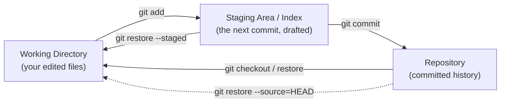
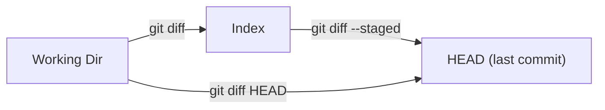

# 02 — The Everyday Workflow

> **Audience:** You can create a repo and make a commit, but you still treat `git add` and `git commit` as one magic incantation. This chapter turns the daily edit/stage/commit loop into something you *control* — crafting clean commits, reading diffs, navigating history, and undoing small mistakes. By the end you'll know exactly which command shows you what, and why the staging area is a feature rather than ceremony.

If you're fuzzy on what a commit, the index, or HEAD actually *are*, read [01 — Git Foundations & the Object Model](01_git_foundations_object_model.md) first. This chapter assumes those three words mean something to you.

---

## 1. The Core Loop

Day-to-day Git is a tight cycle. You edit files, check what changed, stage what you want, commit it, repeat.

```bash
# edit some files in your editor, then:
git status                 # what changed? what's staged?
git add src/parser.py      # stage a specific file
git commit -m "Fix off-by-one in tokenizer"
# back to editing...
```

There are **three places a file can live**, and almost every confusion in Git comes from not knowing which one you're looking at:



- **Working directory** — the actual files on disk, as you've edited them.
- **Staging area (index)** — a *draft* of your next commit. `git add` copies a snapshot of a file into it.
- **Repository** — the permanent, content-addressed history once you `git commit`.

`git status` is your compass. Run it constantly.

```bash
$ git status
On branch main
Changes to be committed:        # <- staged (in the index)
  (use "git restore --staged <file>..." to unstage)
        modified:   src/parser.py
Changes not staged for commit:  # <- modified, but not yet staged
  (use "git add <file>..." to update what will be committed)
        modified:   src/lexer.py
Untracked files:                # <- Git has never seen these
        notes.txt
```

---

## 2. The Staging Area Is a Feature

New users see the index as a pointless extra step. It is actually the tool that lets you **craft a commit** instead of dumping every change into one blob. You made five edits across three files to fix two unrelated bugs? Stage and commit them separately.

The killer move is **partial staging** — staging *parts* of a file:

```bash
git add -p src/parser.py    # interactively pick hunks
```

```
@@ -42,7 +42,7 @@ def tokenize(s):
-    pos = 0
+    pos = 1   # bug fix
Stage this hunk [y,n,q,a,d,s,e,?]?
```

| Key | Meaning |
|-----|---------|
| `y` | stage this hunk |
| `n` | skip this hunk |
| `s` | split into smaller hunks |
| `e` | edit the hunk by hand |
| `q` | quit, keep what you've chosen so far |

This is how you keep "fix bug" and "rename variable" out of the same commit even when they're three lines apart.

> Mental model: `git add` doesn't mark a file as "to be committed" — it **takes a snapshot right now**. If you `add` a file, then edit it again, the new edits are *not* staged until you `add` again. `git status` will show the same file under both "Changes to be committed" and "Changes not staged."

---

## 3. `git diff` — Which Diff Compares What

`diff` is the single most under-used everyday command. The trick is knowing **which two things** each variant compares.



| Command | Compares | Answers |
|---------|----------|---------|
| `git diff` | working dir ↔ index | "What have I changed but **not staged**?" |
| `git diff --staged` | index ↔ HEAD | "What will go into the **next commit**?" |
| `git diff HEAD` | working dir ↔ HEAD | "What have I changed since the **last commit** (staged or not)?" |
| `git diff abc123 def456` | two commits | "What changed **between** these?" |

`--staged` and `--cached` are exact synonyms.

### Reading a hunk

```bash
$ git diff
diff --git a/src/lexer.py b/src/lexer.py
index 3a1f..9c2e 100644
--- a/src/lexer.py        # "a" = old version (index)
+++ b/src/lexer.py        # "b" = new version (working dir)
@@ -10,6 +10,7 @@ class Lexer:    # hunk header
     def __init__(self, text):
         self.text = text
-        self.pos = 0
+        self.pos = 0
+        self.line = 1      # lines starting with + are added
```

The `@@ -10,6 +10,7 @@` header reads: *old* file shows 6 lines starting at line 10; *new* file shows 7 lines starting at line 10. Lines with `-` were removed, `+` added, leading-space lines are unchanged context.

---

## 4. Commits

### The mechanics

```bash
git commit -m "Short summary here"   # commit the staged index
git commit -a -m "..."               # auto-stage all *tracked* modified files, then commit
git commit                            # opens your editor for a full message
```

`-a` is convenient but blunt: it stages every tracked file's changes (it does **not** add untracked files) and skips the chance to craft the commit. Use it only when you genuinely want everything.

### `--amend` — fix the last commit

`--amend` *replaces* the most recent commit with a new one. Use it to fix a typo in the message or to add a forgotten file.

```bash
git commit -m "Add login endpiont"     # oops, typo
git commit --amend -m "Add login endpoint"   # rewrites the last commit

# forgot a file?
git add forgotten_test.py
git commit --amend --no-edit           # keep the existing message
```

> **Amending creates a *new* commit object with a new hash.** The old one is discarded. That's harmless locally — but dangerous once shared.

> **Golden rule: never amend (or rebase) a commit you've already pushed to a shared branch.** Everyone else still has the old hash; rewriting it forces them into a messy reconciliation. See the Symptom/Cause/Fix below and [06 — Undoing & Recovery](06_undoing_recovery.md).

### Writing good commit messages

The convention almost everyone follows (the "50/72" rule):

```
Summarize the change in ~50 chars or less

Wrap the body at ~72 chars. Explain *why* the change was made,
not just what — the diff already shows the what. Mention side
effects, trade-offs, or links to issues.

Fixes #123
```

- **Imperative mood** in the subject: "Add cache", not "Added cache" / "Adds cache". Read it as "*If applied, this commit will* add cache."
- Blank line between subject and body — many tools rely on it.
- **Conventional Commits** is a popular structured style: `feat:`, `fix:`, `docs:`, `refactor:`, etc. (e.g. `fix(parser): handle empty input`). It enables automated changelogs and semver bumps. Adopt it if your team does; it's optional.

### Atomic commits

Each commit should be **one logical change** that leaves the tree in a working state. Why bother?

- `git bisect` can pinpoint the exact commit that broke a test — useless if a commit mixes five things.
- `git revert` cleanly undoes one change.
- Reviewers read intent, not noise.

This is exactly what the staging area (§2) buys you.

---

## 5. `git log` Mastery

Plain `git log` is verbose. These flags turn it into a precision tool. Combine freely.

```bash
git log --oneline                  # one compact line per commit
git log --oneline --graph --all    # ASCII graph of ALL branches
git log -p                          # show the full diff of each commit
git log --stat                      # files changed + insert/delete counts
git log --author="Parveen"          # filter by author
git log --since="2 weeks ago"       # by date; also --until
git log -3                          # last 3 commits only
```

```bash
$ git log --oneline --graph --all
* a1b2c3d (HEAD -> main) Fix tokenizer off-by-one
* d4e5f6g Add lexer line tracking
| * 9z8y7x (feature/api) Add login endpoint
|/
* 0011223 Initial commit
```

### The pickaxe — search history by *content*

```bash
git log -S "tokenize"   # commits that changed the NUMBER of occurrences of "tokenize"
git log -G "def parse"  # commits whose diff text matches the regex "def parse"
```

`-S` answers "when was this string added or removed?" — perfect for "where did this function go?". `-G` matches any diff line touching the pattern.

### Custom formatting

```bash
git log --pretty=format:"%h %an %ar : %s"
# a1b2c3d Parveen 2 hours ago : Fix tokenizer off-by-one
#   %h=short hash  %an=author name  %ar=relative date  %s=subject
```

### `git show` — inspect one object

```bash
git show                 # the HEAD commit, with its diff
git show a1b2c3d         # a specific commit
git show HEAD~2          # two commits before HEAD
git show a1b2c3d:src/lexer.py   # a file AS IT WAS in that commit
```

---

## 6. `.gitignore` and `.gitattributes`

### `.gitignore`

A list of patterns for files Git should not track. One pattern per line.

```gitignore
# comment lines start with #
*.log               # any .log file, in any directory
build/              # a directory and everything under it
node_modules/       # never commit dependencies
/secrets.env        # leading / anchors to the repo root only
!keep.log           # ! negates — DON'T ignore this one
temp?.txt           # ? matches a single char; * matches many
**/cache/           # ** matches across directory levels
```

**Precedence rules:**

- Later patterns override earlier ones in the same file.
- A `.gitignore` deeper in the tree overrides a parent's rules for that subtree.
- A `!` negation re-includes a file — *but you cannot re-include a file if its parent directory is ignored.*

**Global ignore** (editor/OS junk you never want anywhere):

```bash
git config --global core.excludesFile ~/.gitignore_global
# then put .DS_Store, *.swp, Thumbs.db, etc. in that file
```

**Crucial gotcha:** `.gitignore` only affects **untracked** files. If a file is *already tracked*, adding it to `.gitignore` does nothing. You must untrack it first:

```bash
git rm --cached secrets.env   # stop tracking, KEEP the file on disk
git rm -r --cached node_modules/
# then commit the removal + the .gitignore update
```

**Debugging:** "why is this file ignored?"

```bash
$ git check-ignore -v node_modules/foo.js
.gitignore:3:node_modules/    node_modules/foo.js
# tells you the exact file:line:pattern that matched
```

### `.gitattributes` (brief)

A sibling file that sets per-path behavior — line-ending normalization, marking files binary, diff/merge drivers, and Git LFS routing.

```gitattributes
* text=auto                 # normalize line endings on commit
*.png binary                # never try to diff/merge as text
*.psd filter=lfs -text      # route through Git LFS
```

---

## 7. Inspecting and Restoring

### `git blame` — who/when for each line

```bash
$ git blame src/lexer.py
a1b2c3d (Parveen 2026-06-20 14:02 10)     def __init__(self, text):
d4e5f6g (Asha    2026-05-11 09:30 11)         self.text = text
# each line: commit, author, date, line number, content
git blame -L 10,20 src/lexer.py   # only lines 10–20
```

Pair blame with `git show <hash>` to read the full context of *why* a line exists.

### Restoring files — `git restore` (modern) and `git checkout --` (classic)

```bash
# discard UNSTAGED changes to a file (revert it to the index)
git restore src/lexer.py
git checkout -- src/lexer.py        # old equivalent

# unstage a file (keep your edits, just remove from index)
git restore --staged src/lexer.py
git reset HEAD src/lexer.py         # old equivalent

# restore a file as it was in a specific commit
git restore --source=HEAD~2 src/lexer.py
```

> `git restore` (introduced in Git 2.23) split the overloaded `git checkout` into two clear commands: `restore` for files, `switch` for branches. Prefer it.

---

## 8. Undo Basics (Preview)

Small, everyday reversals — full coverage of resets, reverts, and reflog is in [06 — Undoing & Recovery](06_undoing_recovery.md).

```bash
# "I staged the wrong thing" — unstage, keep edits
git restore --staged <file>

# "I want to throw away my unsaved edits" — DESTRUCTIVE
git restore <file>          # this file
git restore .               # everything in the working tree

# "I want to discard a hunk but keep the rest"
git restore -p <file>       # interactive, hunk by hunk
```

> ⚠️ `git restore <file>` (discarding working changes) **cannot be undone** — those edits were never committed, so there's nothing to recover. Pause before running it on a file you've spent an hour on.

---

## 9. Symptom / Cause / Fix

**Symptom: "I committed a secret (API key / password) or a huge file."**
- **Cause:** It's now in history. Deleting it in a *new* commit does **not** remove it from past commits — it's still recoverable from the repo.
- **Fix (if not yet pushed):** the simplest case is to amend/reset the last commit; for deeper history you'll rewrite it. **Rotate the secret regardless** — assume it's compromised. Full procedure (`git filter-repo`, BFG, history rewrite) in [06 — Undoing & Recovery](06_undoing_recovery.md) and the large-file/LFS discussion in [01 — Git Foundations & the Object Model](01_git_foundations_object_model.md).

**Symptom: "I accidentally `git add`-ed (and maybe committed) `node_modules/`."**
- **Cause:** It got tracked before it was ignored; `.gitignore` won't retroactively untrack it.
- **Fix:**
  ```bash
  echo "node_modules/" >> .gitignore
  git rm -r --cached node_modules/   # untrack, keep on disk
  git commit -m "Stop tracking node_modules; add to .gitignore"
  ```
  Verify with `git check-ignore -v node_modules/anything`.

**Symptom: "I amended (or force-pushed a rewrite of) a commit others had already pulled, and now everyone's branch is broken."**
- **Cause:** Amending creates a *new* hash. Teammates still have the old commit; their next pull diverges, producing duplicate commits and ugly merges.
- **Fix:** Coordinate immediately. The cleanest recovery is usually to restore the original commit (it's in your `reflog`) and force-push it back, then have everyone `git pull`. Going forward: **only amend/rebase commits that live solely on your local machine.** See [06 — Undoing & Recovery](06_undoing_recovery.md).

---

## 10. Cheat Sheet

```bash
git status                         # always your first move
git add -p                         # craft commits hunk by hunk
git diff / --staged / HEAD         # unstaged / staged / total
git commit -m "..." | --amend      # record | fix the last one
git log --oneline --graph --all    # see the shape of history
git log -S "needle"                # find when text appeared/vanished
git show <ref>[:path]              # inspect a commit or a past file
git restore [--staged] <file>      # discard edits | unstage
git rm --cached <file>             # untrack but keep on disk
git check-ignore -v <file>         # why is this ignored?
```

---

> Next: [03 — Branching & Merging](03_branching_merging.md) — now that you can craft clean commits on a single line of history, we'll learn to branch off, work in parallel, and stitch the timelines back together with merge and rebase.
