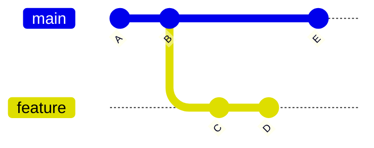
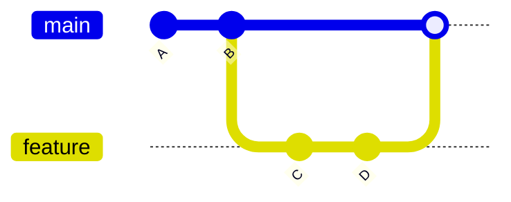
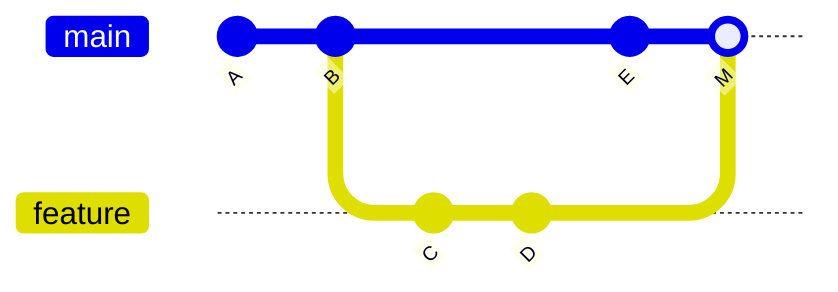
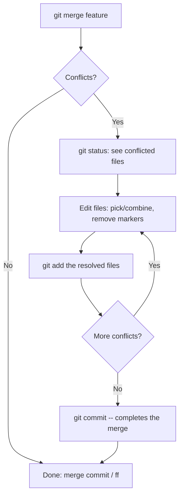
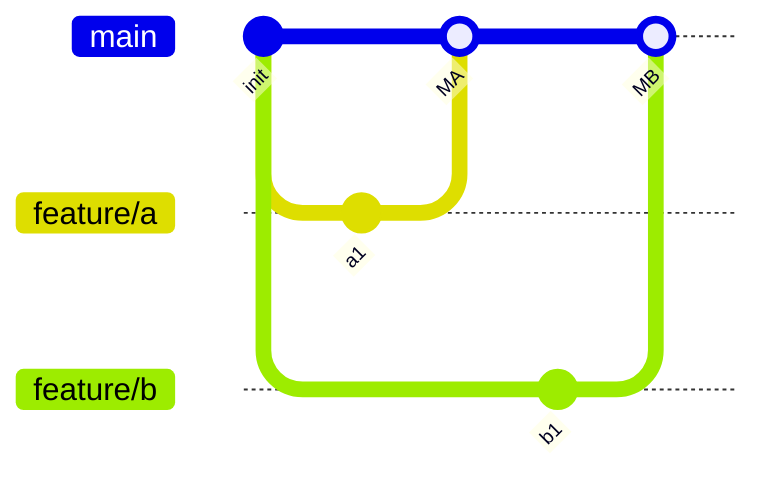

# 03 — Branching & Merging

> **Audience:** You can commit and read history (see [01 — Git Foundations & the Object Model](01_git_foundations_object_model.md)), and now you need to work on parallel lines of development and bring them back together. This chapter takes you from "what is a branch" through fast-forward vs three-way merges, conflict resolution, and the diagnostic tools to see what merged where.

---

## 1. Recap: a branch is a cheap pointer

From [01 — Git Foundations & the Object Model](01_git_foundations_object_model.md): a branch is **not** a copy of your files. It is a 41-byte file containing one commit SHA. `HEAD` points at the current branch; the branch points at a commit; the commit points at its parent(s).

```bash
git branch                 # list local branches; * marks current
git branch -vv             # list with last commit + upstream tracking
git switch -c feature/login   # create AND switch (modern verb)
git checkout -b feature/login # older equivalent (-b = branch)
git switch main            # move HEAD back to main
git branch -d old-feature  # delete (refuses if unmerged — safe)
git branch -D old-feature  # FORCE delete (loses unmerged commits!)
git branch -m old new      # rename a branch
```

`switch`/`checkout` move `HEAD`; the *commit* a branch points to only changes when you commit on it (or move it explicitly). Creating a branch is O(1) — it writes one ref file. There is no reason to be stingy with branches.



Above: after `branch feature`, both `main` and `feature` point at `B`. New commits on each line make them **diverge** — `feature` has `C`,`D`; `main` has `E`. That divergence is what determines how a later merge behaves.

---

## 2. Fast-forward vs three-way merge

`git merge <branch>` integrates `<branch>` into your **current** branch. There are two outcomes.

### 2.1 Fast-forward (no divergence)

If the current branch has **not** moved since the other branch was created, Git just slides the pointer forward. No new commit is created.



`main` had no commits of its own past `B`, so `git merge feature` moves `main` from `B` to `D`. History stays linear.

```bash
git switch main
git merge feature          # Fast-forward: main now points at D
```

### 2.2 Three-way merge (divergence → merge commit)

If **both** branches have new commits, Git computes a new commit with **two parents**, using the common ancestor (the *merge base*) as the third reference point — hence "three-way".



`M` is the **merge commit**. Its parents are `E` (main's tip) and `D` (feature's tip). `git log` shows two parent lines for `M`.

### 2.3 Controlling the behavior

| Option | Behavior | When |
|---|---|---|
| (default) | Fast-forward if possible, else three-way | General use |
| `--no-ff` | **Always** create a merge commit, even if ff is possible | Teams wanting an explicit "feature X merged here" node |
| `--ff-only` | Refuse to merge unless it's a clean fast-forward | CI / protected branches that forbid merge commits |

```bash
git merge --no-ff feature   # records a merge commit even with no divergence
git merge --ff-only feature # errors out if a merge commit would be needed
```

**Why `--no-ff`?** A merge commit is a permanent, single node that marks "this whole feature landed here." It keeps the feature's commits grouped and makes `git revert -m 1 <merge>` able to undo the entire feature at once. Many teams set `--no-ff` for merges into `main`.

---

## 3. Merge conflicts

A conflict happens when **both sides changed the same region of the same file** (or one side edited a file the other deleted). Git can auto-merge non-overlapping changes; overlapping ones it hands to you.

### 3.1 The conflict markers

```text
<<<<<<< HEAD
price = compute_total(cart)      # your current branch's version
=======
price = compute_total(cart, tax) # the incoming branch's version
>>>>>>> feature/tax
```

- `<<<<<<< HEAD` → top block is **ours** (the branch you're merging into).
- `=======` → divider.
- `>>>>>>> feature/tax` → bottom block is **theirs** (the branch being merged in).

### 3.2 The resolution loop



```bash
git merge feature/tax
# CONFLICT (content): Merge conflict in pricing.py
git status                 # lists "both modified" files
# ...edit pricing.py, delete ALL the <<< === >>> markers...
git add pricing.py
git commit                 # message is prefilled; just save to finish
```

### 3.3 Escape hatches and shortcuts

```bash
git merge --abort          # bail out entirely, restore pre-merge state
git checkout --ours  conf.txt   # take OUR whole version of this file
git checkout --theirs conf.txt  # take THEIR whole version of this file
git add conf.txt                # then stage it
git mergetool              # launch a configured 3-way visual merge tool
```

| Term | During a merge means | Memory aid |
|---|---|---|
| **ours** | The branch you ran `git merge` *from* (current `HEAD`) | "where I am standing" |
| **theirs** | The branch named in the merge command | "the one coming in" |

> WRONG — committing the markers because the build "passed":
> ```bash
> git add . && git commit   # markers still in file → broken source
> ```
> RIGHT — open the file, decide the correct combined logic, delete every `<<<`/`===`/`>>>` line, then add. Grep for leftover markers before committing:
> ```bash
> git diff --check          # warns about leftover conflict markers
> ```

### 3.4 `rerere` — reuse recorded resolution (preview)

If you keep merging long-lived branches (or rebasing repeatedly), you hit *the same conflict over and over*. `rerere` ("reuse recorded resolution") memorizes how you resolved a given conflict hunk and replays it automatically next time.

```bash
git config --global rerere.enabled true
# Resolve a conflict once → Git records the before/after.
# Next time the identical conflict appears, it auto-applies your fix.
git rerere status          # what it would reuse
git rerere diff            # the recorded resolution
```

This is the cure for "I fix this exact conflict every single merge." Full treatment alongside rebase in [04 — Rebase, Cherry-pick & Rewriting History](04_rebase_cherry_pick_history.md).

---

## 4. Comparing & visualizing

```bash
git log --graph --oneline --all   # ASCII DAG of every branch — the workhorse
git log --graph --oneline --all --decorate

git branch --merged main     # branches already merged INTO main (safe to delete)
git branch --no-merged main  # branches with work NOT yet in main (don't -d these)

git diff main..feature       # changes between the two branch tips
```

`git branch --merged` is the right way to find dead branches before cleanup — anything it lists can be removed with `git branch -d` without losing work.

---

## 5. Two dots vs three dots (range semantics)

This trips up everyone. The meaning **differs between `git diff` and `git log`**.

| Context | `A..B` | `A...B` |
|---|---|---|
| `git log` | Commits reachable from **B but not A** | Commits on **either** side but not both (symmetric difference) |
| `git diff` | Diff from **A's tip to B's tip** | Diff from the **merge base** of A,B to B |

```bash
git log  main..feature    # what feature adds that main doesn't have
git log  main...feature   # commits unique to either side (often with --left-right)
git diff main...feature   # what feature changed since it diverged (ignores main's new work)
```

For "what does my feature actually introduce on top of where it branched," `git diff main...feature` (three dots) is usually what you want — it excludes commits that landed on `main` after the branch point.

---

## 6. Branching strategies — preview

Full coverage is in [10 — DevOps, Branching Strategies & Release Engineering](10_devops_branching_release.md). The core idea:

- **Feature branches** — branch off `main`, do focused work, merge back (often via PR + `--no-ff`). Short-lived branches conflict less.
- **Merge vs rebase** — *merge* preserves the true, divergent history with a merge commit; *rebase* (see [04 — Rebase, Cherry-pick & Rewriting History](04_rebase_cherry_pick_history.md)) replays your commits onto the new base for a linear history but **rewrites commit SHAs**. Rule of thumb: rebase your *local, unpushed* work to tidy it; merge to integrate *shared* branches.



---

## 7. Symptom / Cause / Fix

**"My merge created an unexpected merge commit."**
- *Symptom:* you expected a linear fast-forward, but got an extra "Merge branch..." commit.
- *Cause:* the branches had diverged, or a config/alias forced `--no-ff`.
- *Fix:* use `git merge --ff-only` to *guarantee* a fast-forward (it errors instead of creating a commit). If you wanted linear history over divergence, rebase first — see [04](04_rebase_cherry_pick_history.md).

**"I resolve the same conflict every time I merge."**
- *Symptom:* identical conflict hunks on each merge of a long-lived branch.
- *Cause:* the two lines repeatedly touch the same region; Git doesn't remember your past fix.
- *Fix:* `git config --global rerere.enabled true` so resolutions are recorded and replayed.

**"I deleted a branch that still had unmerged work."**
- *Symptom:* `git branch -D wip` removed the only ref to commits you needed.
- *Cause:* `-D` force-deletes; the commits are now unreferenced (but **not yet gone**).
- *Fix:* the commits live until garbage collection. Find them in `git reflog` and recreate the branch: `git branch wip <sha>`. Full recovery workflow in [06 — Undoing & Recovery](06_undoing_recovery.md).

**"I merged the wrong direction."**
- *Symptom:* you ran `git merge main` while on `feature`, polluting the feature branch with main's history (or vice versa).
- *Cause:* `git merge X` always merges *into the current branch*. You were standing on the wrong branch.
- *Fix:* if not pushed, `git reset --hard ORIG_HEAD` (or the pre-merge SHA from `git reflog`) undoes the merge, then `git switch` to the correct branch and merge again. See [06 — Undoing & Recovery](06_undoing_recovery.md).

---

## 8. Mental model checklist

- A branch is a movable pointer; switching branches is nearly free.
- **No divergence → fast-forward** (pointer moves, no new commit). **Divergence → three-way merge** (new merge commit with two parents).
- `--no-ff` forces a merge commit for a clean audit trail; `--ff-only` forbids merge commits.
- Conflicts come from overlapping edits: edit → `git add` → `git commit`; `--abort` to bail; `--ours`/`--theirs` to take a whole side; `rerere` to stop re-solving.
- `git log --graph --oneline --all` is your eyes; `--merged`/`--no-merged` guide cleanup.
- `..` vs `...` mean different things in `log` vs `diff` — check the table before trusting output.

---

> Next: [04 — Rebase, Cherry-pick & Rewriting History](04_rebase_cherry_pick_history.md) — instead of joining histories with a merge commit, *replay* commits onto a new base for a clean linear story, lift individual commits with cherry-pick, and learn why rewriting *shared* history is dangerous.
