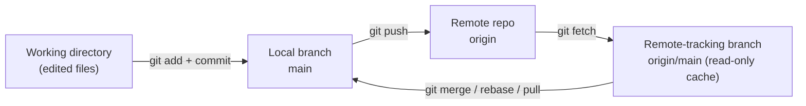
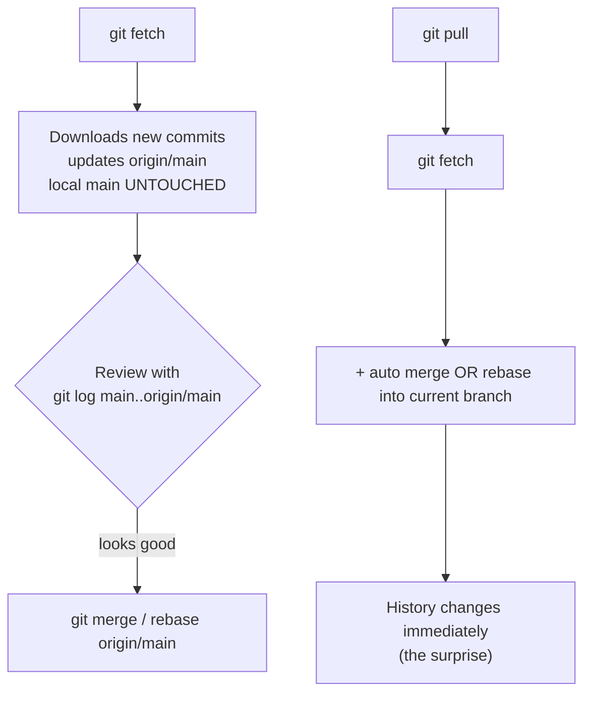
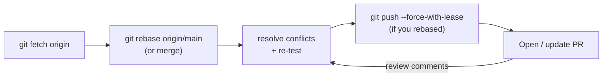

# 05 — Remotes & Collaboration

> **Audience:** You can commit, branch, and rebase locally (chapters 01–04), but the moment a second human shows up, Git becomes a *distributed* system. This chapter explains how your repo talks to other repos — fetch, pull, push, remote-tracking branches, refspecs, tags, force-with-lease, and the day-to-day collaboration loop — plus the exact symptoms you hit when it goes sideways and how to fix them.

---

## 1. The distributed model — every clone is a full repo

Git has no privileged "server." When you `git clone`, you get the **entire history**, every branch's commits, and the full object database. A "remote" is just a named URL pointing at *another* copy of the repo.

```bash
git clone https://github.com/acme/widgets.git   # full history, not a checkout snapshot
git log --oneline                                # works offline — it's all local
```

The convention `origin` is simply the default name `clone` gives the URL you cloned from. There is nothing magic about it.

```bash
git remote                       # list remote names
git remote -v                    # list with fetch/push URLs (verbose)
git remote add upstream https://github.com/acme/widgets.git
git remote show origin           # detailed: branches, tracking, push/pull config
git remote rename origin gh      # rename
git remote remove upstream       # delete a remote (just forgets the URL)
```

**origin vs upstream (the fork model).** When you fork a repo on GitHub, you clone *your fork* (`origin`) and add the *original* as `upstream`. You pull updates from `upstream`, push your work to `origin`, and open a PR back ([08 — GitHub: Collaboration Platform](08_github_collaboration.md)).

```bash
git remote add upstream https://github.com/acme/widgets.git
git fetch upstream
git merge upstream/main          # or: git rebase upstream/main
git push origin my-feature
```

---

## 2. The sync model — four layers

There are **four** places a branch can "exist." Confusing them is the root cause of most remote pain.



- **Working directory** — your files on disk.
- **Local branch** (`main`) — what your commits move forward.
- **Remote-tracking branch** (`origin/main`) — a *local, read-only snapshot* of where the remote's branch was the **last time you fetched**. It does **not** update on its own.
- **Remote** (`origin`) — the actual other repo, only contacted by `fetch`/`pull`/`push`.

> Key insight: `origin/main` is **not** the remote. It is your last-known cache of it. It only moves when you `fetch`.

---

## 3. Fetch vs pull



`git fetch` is **always safe** — it never touches your working tree or local branches. It only updates remote-tracking refs. `git pull` is `fetch` **plus** an automatic integration step, which is where surprises live.

| | `git fetch` | `git pull` |
|---|---|---|
| Downloads remote commits | Yes | Yes |
| Updates `origin/main` | Yes | Yes |
| Touches your local branch | **No** | **Yes** (merge or rebase) |
| Can create a surprise merge commit | No | Yes (default) |
| Safe to run anytime | Yes | Mostly — but review first |

```bash
git fetch origin                 # safe: just download
git fetch --all                  # all remotes
git log --oneline main..origin/main   # what did I just fetch that I don't have?
git merge origin/main            # integrate when ready
```

**`git pull --rebase`** replays your local commits on top of the fetched ones instead of making a merge commit — a linear history (see [04 — Rebase, Cherry-pick & Rewriting History](04_rebase_cherry_pick_history.md)).

```bash
git pull --rebase                # fetch + rebase instead of merge
git config --global pull.rebase true     # make rebase the default for pull
git config --global pull.ff only         # refuse to pull if it can't fast-forward
```

`pull.ff only` is a great safety setting: it forces you to *explicitly* choose merge or rebase whenever histories diverge, rather than silently making a merge commit.

> **Why many teams prefer fetch-then-review:** `fetch` lets you inspect *exactly* what changed (`git log main..origin/main`, `git diff main origin/main`) before deciding how to integrate. `pull` commits you before you've looked.

---

## 4. Remote-tracking branches & `-vv`

A **local tracking branch** is a local branch configured to follow a remote-tracking branch ("upstream"). That link enables bare `git push`/`git pull` and the "ahead 2, behind 1" status.

```bash
git branch -vv                   # show each local branch + its upstream + ahead/behind
# main      9f3c1a [origin/main] Fix login
# feature   1a2b3c [origin/feature: ahead 2, behind 1] WIP
```

```bash
git branch --set-upstream-to=origin/main main   # link an existing branch
git fetch --prune                # delete origin/* refs for branches deleted on remote
git config --global fetch.prune true             # always prune on fetch
```

`--prune` matters: when a teammate deletes a merged branch on the remote, your stale `origin/old-feature` lingers forever until you prune.

---

## 5. Push — sending commits up

```bash
git push                         # push current branch to its upstream
git push origin main             # explicit remote + branch
git push -u origin feature       # push AND set upstream (do this the first time)
git push origin --delete feature # delete a branch on the remote
```

The `-u` (`--set-upstream`) flag is what makes future bare `git push`/`git pull` work for that branch — set it once when you first publish.

### 5.1 Pushing tags

Tags are **not** pushed by default — you must push them explicitly.

```bash
git push origin v1.4.0           # push one tag
git push origin --tags           # push all tags
git push origin --follow-tags    # push commits + annotated tags reachable from them
git push origin --delete v1.4.0  # delete a remote tag
```

### 5.2 Force pushing — `--force-with-lease`, not `--force`

After rebasing or amending ([04](04_rebase_cherry_pick_history.md)), your local history diverges from the remote and a normal push is **rejected**. You must overwrite remote history — but `--force` is a chainsaw.

```bash
# WRONG — clobbers whatever is on the remote, even commits you've never seen
git push --force origin feature

# RIGHT — refuse to push if origin/feature moved since your last fetch
git push --force-with-lease origin feature
```

| | `--force` (`-f`) | `--force-with-lease` |
|---|---|---|
| Overwrites remote history | Always | Only if remote == your last-fetched state |
| Protects teammates' new commits | **No** | **Yes** — aborts if someone pushed |
| Safe default for shared branches | Never | Yes |

`--force-with-lease` checks that `origin/feature` still points where *you* last saw it. If a teammate pushed in the meantime, the push aborts instead of erasing their work. **Always prefer it.** Only force-push branches you own — never a shared `main`.

---

## 6. Refspecs (brief, advanced)

Every fetch/push is governed by a **refspec**: `<src>:<dst>`, optionally prefixed with `+` to allow non-fast-forward updates.

```bash
git push origin main:main                 # local main -> remote main
git push origin HEAD:refs/heads/feature   # current commit -> remote feature
git push origin :old-branch               # empty src = DELETE old-branch on remote
git fetch origin main:refs/remotes/origin/main
```

The default fetch refspec a clone writes into `.git/config`:

```
[remote "origin"]
    fetch = +refs/heads/*:refs/remotes/origin/*
```

That single line is *why* fetching maps every remote `main` into your local `origin/main`. You rarely write refspecs by hand, but knowing they exist explains the mapping.

---

## 7. Tags & releases

A **tag** is a permanent name for a specific commit — used to mark releases.

| Type | Command | Stores | Use for |
|---|---|---|---|
| Lightweight | `git tag v1.0` | Just a pointer | Private/temporary markers |
| Annotated | `git tag -a v1.0 -m "..."` | Tagger, date, message, can be signed | **Releases** — recommended |

```bash
git tag v1.0.0                              # lightweight
git tag -a v1.0.0 -m "First release"        # annotated (preferred for releases)
git tag -s v1.0.0 -m "Signed release"       # GPG/SSH-signed annotated tag
git tag                                     # list
git show v1.0.0                             # inspect
git tag -v v1.0.0                           # verify a signature
git push origin --tags                      # publish
```

**Semantic-version tags** like `v1.4.2` (MAJOR.MINOR.PATCH) are the convention for releases — covered in depth in chapter 10. Signing (`-s`) lets consumers verify a release genuinely came from you; signing setup recaps the SSH/GPG key material in [../modern_os/linux/12_security_access_control.md](../modern_os/linux/12_security_access_control.md).

---

## 8. The collaboration loop

On a shared repo or a fork, the rhythm is the same. Keep your branch current, push, open a PR.



```bash
git checkout feature
git fetch origin                 # 1. get latest
git rebase origin/main           # 2. replay your work on top (or: git merge)
# ...fix conflicts, run tests...
git push --force-with-lease      # 3. publish (force-with-lease because you rebased)
# 4. open a PR on GitHub  -> ch08
```

If you used `merge` instead of `rebase` in step 2, no force is needed — a plain `git push` works because history was only added to, not rewritten.

---

## 9. Authentication — HTTPS vs SSH

The remote URL's scheme decides how Git authenticates.

| | HTTPS | SSH |
|---|---|---|
| URL | `https://github.com/acme/widgets.git` | `git@github.com:acme/widgets.git` |
| Credential | Personal Access Token (PAT) via credential helper | SSH key pair |
| Setup | Easy through firewalls/proxies | One-time key + agent setup |
| Prompts | Caches token in credential helper | Silent once agent is loaded |

```bash
# HTTPS: cache the PAT so you aren't prompted every push
git config --global credential.helper manager      # Windows
git config --global credential.helper store        # plaintext file (avoid on shared boxes)

# SSH: use a key-based remote
git remote set-url origin git@github.com:acme/widgets.git
ssh -T git@github.com            # test the key + agent
```

Generating keys, loading the agent, and verifying host CA fingerprints are OS-level topics — see [../modern_os/linux/12_security_access_control.md](../modern_os/linux/12_security_access_control.md). For PATs, treat the token like a password and scope it minimally.

> Rule of thumb: **HTTPS + PAT** is simplest to start and proxy-friendly; **SSH** is smoother for daily use once configured. You can switch any time with `git remote set-url`.

---

## 10. Symptom / Cause / Fix

**Symptom: `! [rejected] main -> main (non-fast-forward)` on push.**
- **Cause:** The remote moved on (a teammate pushed) since you last fetched. Your push would lose their commits, so Git refuses.
- **Fix:** Integrate first, then push.
  ```bash
  git fetch origin
  git rebase origin/main      # or: git merge origin/main
  git push                    # now fast-forwards cleanly
  ```

**Symptom: `git pull` made a weird empty "Merge branch 'main' of ..." commit.**
- **Cause:** Default `pull` does fetch **+ merge**; when histories diverged it created a merge commit.
- **Fix:** Prefer rebase or refuse non-ff pulls.
  ```bash
  git config --global pull.rebase true   # or: pull.ff only
  ```

**Symptom: A force-push wiped a teammate's commit.**
- **Cause:** `git push --force` overwrote remote history blindly, including a commit pushed after your last fetch.
- **Fix:** Recover the lost commit via reflog ([06 — Undoing & Recovery](06_undoing_recovery.md)) and re-push; from now on always use `--force-with-lease`, which would have aborted.

**Symptom: Pushed to the wrong remote or branch.**
- **Cause:** Wrong upstream, or a typo'd `git push origin wrong-branch`.
- **Fix:** Check and correct the target.
  ```bash
  git branch -vv                          # see actual upstreams
  git push origin --delete wrong-branch   # remove the mistaken branch
  git push -u origin right-branch         # push to the intended one
  ```

---

> Next: [06 — Undoing & Recovery](06_undoing_recovery.md) — reset vs revert vs restore, the reflog safety net, and rescuing commits you thought a bad force-push destroyed.
