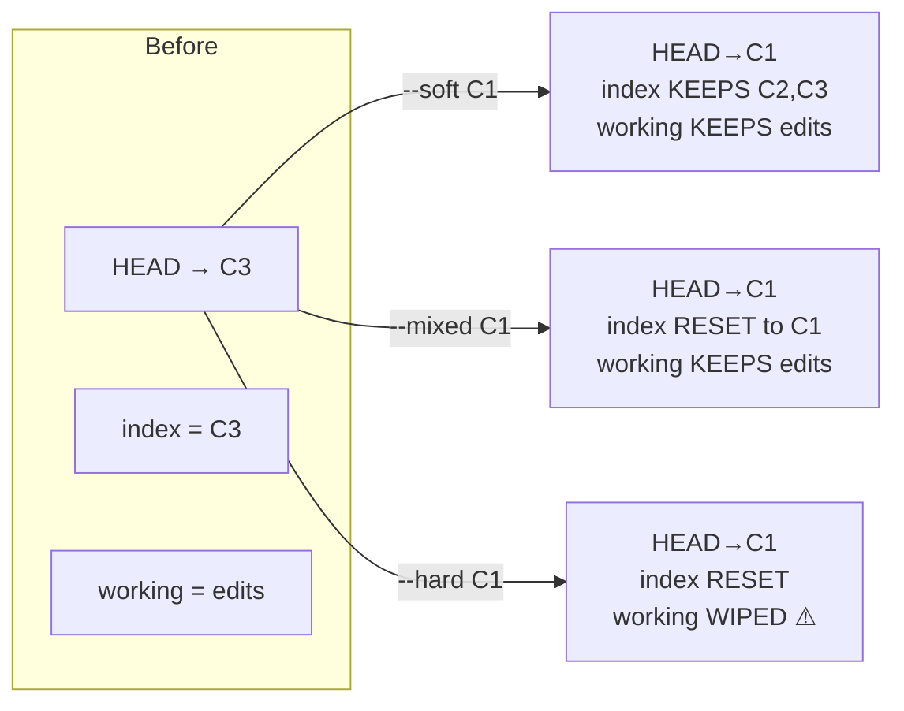
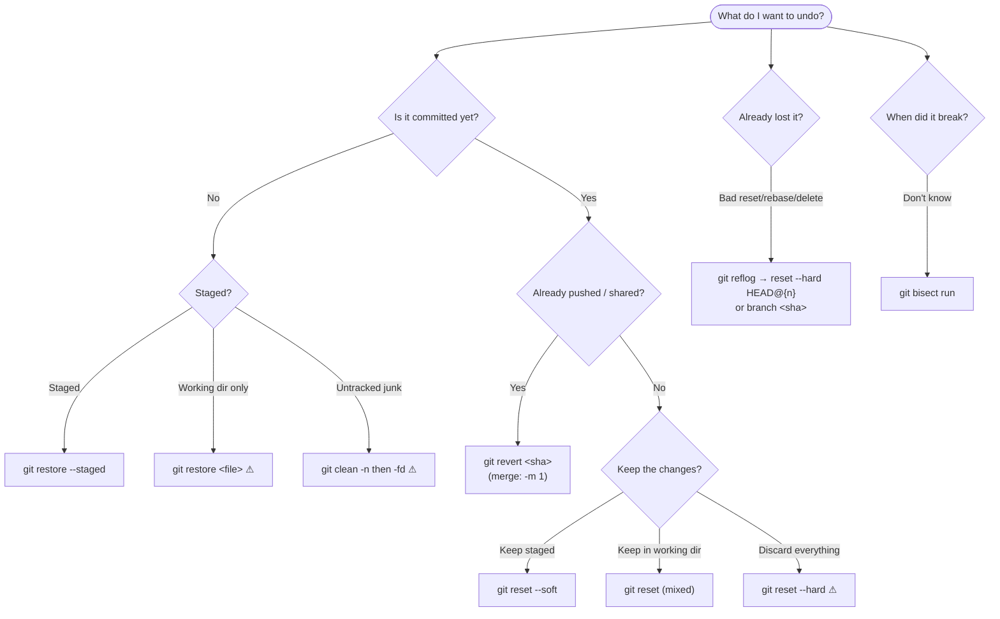

# 06 — Undoing & Recovery

> **Audience:** Anyone who just typed something and felt their stomach drop. This is the "I messed up, fix it" chapter — the go-to recovery reference. Almost nothing in Git is truly lost; the trick is knowing *which* tool matches *which* mistake. Read the decision table in §9 first if you're panicking, then come back for the why.

---

## 1. First principles: what can you actually undo?

Git tracks three areas (see [02 — The Everyday Workflow](02_everyday_workflow.md)):

- **Working directory** — the files on disk you edit.
- **Index / staging area** — what `git add` has queued for the next commit.
- **HEAD / commits** — the committed history.

Every recovery command moves changes between these three areas (or rewrites history). The single most important rule:

> **Rewriting *shared* history (reset, rebase, amend, force-push) breaks everyone who pulled it.** On public branches, *add* a new commit (`git revert`) instead of *editing* the past. See [05 — Remotes & Collaboration](05_remotes_collaboration.md).

And the safety net that makes Git forgiving: **the reflog** (§7). Almost any "destructive" local operation can be walked back as long as the old commit still exists in the object database.

---

## 2. The three resets — `git reset --soft/--mixed/--hard <target>`

`git reset` moves the current branch tip (HEAD) to `<target>` and *optionally* updates the index and working tree. The three flags differ only in **how far the reset reaches**.

| Flag | Moves HEAD | Resets index | Resets working tree | Destructive? | Typical use |
|------|:----------:|:------------:|:-------------------:|:------------:|-------------|
| `--soft`  | ✅ | ❌ | ❌ | No  | Undo a commit but keep changes **staged** (re-commit differently). |
| `--mixed` *(default)* | ✅ | ✅ | ❌ | No  | Undo a commit and **unstage**; keep edits in working dir. |
| `--hard`  | ✅ | ✅ | ✅ | **YES** | Throw everything away back to `<target>`. |



```bash
# Undo the last commit but keep its content staged (fix message / re-split)
git reset --soft HEAD~1

# Default: undo last commit, unstage everything, keep file edits on disk
git reset HEAD~1            # same as --mixed
git reset                   # with no target: unstage everything (HEAD stays put)

# Nuke local changes AND the last commit — there is no confirmation prompt
git status                  # LOOK before you leap
git reset --hard HEAD~1     # ⚠ working-dir edits since C1 are gone
```

`<target>` can be a SHA, `HEAD~n`, a branch, or a tag.

- **Symptom:** "I committed too early / want a different message." → **Cause:** commit is fine but premature. → **Fix:** `git reset --soft HEAD~1`, then re-commit. (Or `git commit --amend` for message-only — see [04 — Rebase, Cherry-pick & Rewriting History](04_rebase_cherry_pick_history.md).)
- **Symptom:** "`git add`'d the wrong file." → **Fix:** `git reset <file>` (mixed reset of one path) or the modern `git restore --staged <file>` (§4).
- **Symptom:** "Hard reset nuked my work!" → **Cause:** `--hard` overwrote the working tree. → **Fix:** committed work is recoverable via the **reflog** (§7); *uncommitted* edits that were never staged are gone (this is why you dry-run and stash first).

---

## 3. `git revert` — undo safely on shared history

`git revert <commit>` does **not** delete anything. It computes the inverse of `<commit>` and records a **brand-new commit** applying that inverse. History only grows — no one downstream is disrupted.

```bash
# Undo a single commit by adding an inverse commit (safe to push)
git revert <sha>

# Revert several commits (newest applied first)
git revert <old>..<new>

# Stage the inverse but don't commit yet (batch several reverts into one)
git revert --no-commit <sha1> <sha2>
git commit -m "Revert feature X rollout"
```

**Reset vs revert:**

| | `git reset` | `git revert` |
|---|---|---|
| Mechanism | Moves branch pointer (rewrites history) | Adds a new inverse commit |
| Safe on pushed/shared branches? | ❌ no | ✅ yes |
| Leaves a record of the undo? | No | Yes (explicit commit) |
| Use when | Local, unpublished mistakes | Anything already pushed |

### Reverting a merge commit (`-m`)

A merge commit has two (or more) parents, so Git can't guess "undo relative to which?" You must name the **mainline parent** with `-m`:

```bash
# -m 1 = keep the first parent (usually the branch you merged INTO)
git revert -m 1 <merge-sha>
```

- **Symptom:** "`git revert` says *commit is a merge but no -m option given*." → **Fix:** add `-m 1`.
- **Symptom:** "I reverted but the bug is still there." → **Cause:** you reverted the wrong commit, or reverted a *merge* (which only undoes the merge resolution, not the individual feature commits), or the bug predates the commit. → **Fix:** use `git bisect` (§8) to find the real culprit; revert *that*. Note: re-merging a reverted branch later won't re-introduce the changes — you must revert the revert.

---

## 4. `git restore` (modern) / `git checkout --`

Historically `git checkout` was overloaded — it switched branches **and** restored files, which was confusing and dangerous (a typo'd path silently discarded edits). Git 2.23 split it:

- **`git switch`** — change branches (see [02 — The Everyday Workflow](02_everyday_workflow.md)).
- **`git restore`** — restore file contents in the working tree and/or index.

```bash
# Discard unstaged changes to a file (working dir → match index) ⚠ irreversible
git restore <file>
git restore .                       # all files — there is no undo

# Unstage a file (index → match HEAD), keep working-dir edits
git restore --staged <file>

# Restore a file's content from a specific commit (into working dir)
git restore --source=HEAD~2 <file>

# Restore into BOTH index and working tree from a commit
git restore --staged --worktree --source=<sha> <file>
```

Old-school equivalents (still work, still confusing):

```bash
git checkout -- <file>              # == git restore <file>
git checkout <sha> -- <file>        # == git restore --source=<sha> <file>
```

- **Symptom:** "I want to abandon edits to one file." → **Fix:** `git restore <file>` (it's unrecoverable, so be sure).
- **Symptom:** "Staged something by mistake." → **Fix:** `git restore --staged <file>`.
- **Symptom:** "Deleted a tracked file and want it back." → **Fix:** `git restore <file>` (restores from index/HEAD).

---

## 5. `git stash` — park work in progress

A stash records your **uncommitted** changes (tracked, by default) and reverts your working tree to a clean HEAD, so you can switch context. Stashes form a **stack** (`stash@{0}` is newest).

```bash
git stash push -m "wip: half-done login form"   # save (push is explicit form)
git stash                                        # shorthand for push
git stash -u                                     # also stash UNTRACKED files
git stash -a                                     # also include ignored files

git stash list                                   # show the stack
git stash show -p stash@{0}                       # view the diff of a stash

git stash pop                                     # apply newest AND drop it
git stash apply stash@{1}                          # apply but KEEP it on the stack
git stash drop stash@{0}                           # delete one entry
git stash clear                                    # delete ALL ⚠
```

**Stashing partial work** — pick hunks interactively (like `add -p`):

```bash
git stash push -p -m "only the parser bits"
```

**Branch from a stash** when it no longer applies cleanly:

```bash
git stash branch fix/from-stash stash@{0}
```

**Stash vs commit-WIP:**

- Use **stash** for short-lived, throwaway context switches ("pull real quick, then back to work").
- Use a **WIP commit** (`git commit -m "WIP" --no-verify`) when the work is meaningful, must survive on a branch, needs sharing, or might live for days — stashes are easy to lose track of and don't push.

- **Symptom:** "`git stash pop` says *conflict* and didn't drop the stash." → **Cause:** pop applied with conflicts, so it intentionally keeps the entry. → **Fix:** resolve conflicts, `git add`, then `git stash drop` manually.
- **Symptom:** "My new untracked file didn't get stashed." → **Cause:** plain `stash` ignores untracked. → **Fix:** use `git stash -u`.

---

## 6. `git clean` — remove untracked files

`reset`/`restore` only touch *tracked* content. To delete **untracked** files and directories (build junk, stray scratch files) use `git clean`. It is **destructive and not in the reflog** — deleted untracked files are gone.

```bash
# ALWAYS dry-run first: -n lists what WOULD be deleted, changes nothing
git clean -n
git clean -nd                     # include untracked directories in preview

# Then actually delete
git clean -fd                     # -f force (required), -d directories
git clean -fdx                    # also remove IGNORED files (e.g. node_modules) ⚠⚠
git clean -fdi                    # interactive: choose what to remove
```

- **Symptom:** "Repo full of leftover generated files." → **Fix:** `git clean -nd` then `git clean -fd`.
- **Symptom:** "`git clean` deleted files I needed." → **Cause:** no dry-run, no backup; clean bypasses Git's object store. → **Fix:** unrecoverable via Git — check editor local history / OS trash. **Lesson: always `-n` first.**

---

## 7. `git reflog` — the ultimate safety net

Every time HEAD moves — commit, reset, rebase, checkout, merge, amend — Git logs it in the **reflog**. So even after a "destructive" command, the old commit usually still exists; you just need its SHA.

```bash
git reflog                        # HEAD's movement history, newest first
# ab12cd3 HEAD@{0}: reset: moving to HEAD~3
# 9f8e7d6 HEAD@{1}: commit: the work I thought I lost
# ...

git reflog show <branch>          # reflog for a specific branch
```

**Recover after a bad reset / rebase:**

```bash
# Option A: move the branch back to where it was
git reset --hard HEAD@{1}         # the state just BEFORE the bad reset

# Option B (safer): create a new branch at the lost commit, inspect first
git branch recover-work 9f8e7d6
git switch recover-work
```

**Recover a deleted branch** — its tip commit is still in the reflog:

```bash
git reflog                        # find the SHA the branch pointed to
git branch my-feature <sha>       # recreate it
```

**Garbage-collection grace period:** unreferenced objects aren't deleted immediately. `git gc` keeps reflog entries for `gc.reflogExpire` (**90 days** default) and unreachable objects for `gc.reflogExpireUnreachable` (**30 days** default). So you have weeks to recover — but don't run `git gc --prune=now` while a commit is still "lost," or it's truly gone.

- **Symptom:** "`git rebase` / `git reset --hard` lost my commits." → **Fix:** `git reflog`, find the pre-disaster `HEAD@{n}`, `git reset --hard HEAD@{n}` (or branch off the SHA).
- **Symptom:** "Deleted the wrong branch." → **Fix:** find its tip in the reflog and `git branch <name> <sha>`.
- **Symptom:** "Detached HEAD and made commits, then switched away — they're gone." → **Fix:** reflog still lists them; branch off the SHA.

---

## 8. `git bisect` — find the commit that broke it

When you know it *used* to work and now it doesn't, bisect does a **binary search** through history. With ~1000 commits between good and bad, you test only ~10.

```bash
git bisect start
git bisect bad                    # current commit is broken
git bisect good v1.4.0            # this older tag/sha worked

# Git checks out a midpoint. Test it, then mark:
git bisect good                   # ...or...
git bisect bad
# Repeat until Git prints "<sha> is the first bad commit"

git bisect reset                  # restore your original HEAD when done
```

**Automate it** with a script that exits `0` for good, non-zero for bad (use `125` to skip a commit that can't be tested):

```bash
git bisect start HEAD v1.4.0      # bad good in one line
git bisect run ./test-the-bug.sh  # Git drives the whole search
git bisect reset
```

- **Symptom:** "Something regressed but I don't know when." → **Fix:** `git bisect run <test>`.
- **Symptom:** "Bisect landed on a commit that won't build." → **Fix:** mark it `git bisect skip`.

---

## 9. Master "I want to UNDO X" decision table

> Start here when you're stuck. Find your situation, run the command.

| I want to undo… | Published? | Command |
|---|:---:|---|
| Unstaged edits to a file | n/a | `git restore <file>` ⚠ |
| All unstaged edits | n/a | `git restore .` ⚠ |
| A `git add` (unstage, keep edits) | n/a | `git restore --staged <file>` |
| The last commit, **keep** changes staged | not yet | `git reset --soft HEAD~1` |
| The last commit, **keep** changes unstaged | not yet | `git reset HEAD~1` (mixed) |
| The last commit **and** its changes | not yet | `git reset --hard HEAD~1` ⚠ |
| Just the last commit **message** | not yet | `git commit --amend` |
| A commit that's already **pushed** | ✅ | `git revert <sha>` |
| A **merge** that's already pushed | ✅ | `git revert -m 1 <merge-sha>` |
| A bad `reset`/`rebase` (recover commits) | n/a | `git reflog` → `git reset --hard HEAD@{n}` |
| A **deleted branch** | n/a | `git reflog` → `git branch <name> <sha>` |
| Work committed on the **wrong branch** | not yet | `git switch right; git cherry-pick <sha>; git switch wrong; git reset --hard HEAD~1` |
| Untracked files / build junk | n/a | `git clean -n` → `git clean -fd` ⚠ |
| Park WIP to switch tasks | n/a | `git stash -u` … `git stash pop` |
| Find which commit caused a bug | n/a | `git bisect start` / `bad` / `good` / `run` |



---

## 10. Golden rules

- **Dry-run destructive commands.** `git clean -n`, `git status`, and reading the diff cost seconds; recovery costs hours.
- **Stash or commit before any `--hard` or `clean`.** It converts an "oops" into a non-event.
- **Reset for private, revert for public.** If others have it, don't rewrite it.
- **The reflog is your time machine — but only for ~30–90 days.** Recover *now*, don't wait.
- **`git clean` is the one with no net** — untracked files never entered the object store, so nothing can bring them back.

---

> Next: [07 — Advanced Git Internals & Power Tools](07_advanced_internals_power_tools.md) — pop the hood: blobs, trees, and the commit DAG; how the reflog and `gc` actually work under the object store; plus power tools like `worktree`, `filter-repo`, and custom plumbing.
