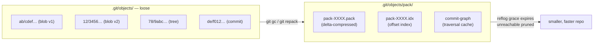
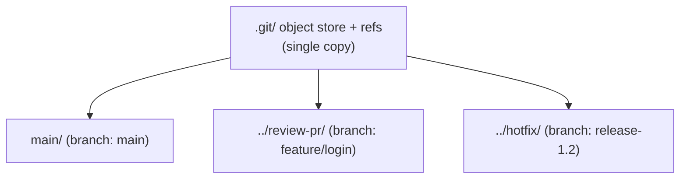

# 07 — Advanced Git Internals & Power Tools

> **Audience:** Principal-level engineers who already trust the porcelain and now need the plumbing. This chapter goes under the hood — how objects are stored, packed, and garbage-collected — and then hands you the power tools (hooks, worktrees, submodules vs subtrees vs monorepo, LFS/partial clone/sparse-checkout, pickaxe search, `.gitattributes`, signing) you reach for when a repo is huge, a team is mixed-platform, or you need to prove who deleted a line three years ago. If [01 — Git Foundations & the Object Model](01_git_foundations_object_model.md) taught you *what* a commit is, this chapter teaches you how to *operate the machine* at scale.

---

## 1. Plumbing vs Porcelain

Git ships two command tiers. **Porcelain** is the human-facing UX (`git commit`, `git log`, `git merge`) — stable, friendly, occasionally chatty. **Plumbing** is the low-level, script-stable core (`git cat-file`, `git rev-parse`, `git ls-tree`, `git hash-object`, `git update-ref`). Porcelain output changes between versions and locales; **never parse it in scripts**. Plumbing output is contractually stable.

```bash
# WRONG — scraping porcelain in a script (breaks on locale/version changes)
git log --oneline | head -1 | awk '{print $1}'

# RIGHT — ask plumbing directly
git rev-parse HEAD                      # full SHA of current commit
git rev-parse --short HEAD              # abbreviated
git rev-parse --abbrev-ref HEAD         # current branch name
```

Useful plumbing for inspecting the object DB (see [01](01_git_foundations_object_model.md) for the blob/tree/commit model):

| Command | What it does | Example |
|---|---|---|
| `git cat-file -t <sha>` | print object **type** (blob/tree/commit/tag) | `git cat-file -t HEAD` → `commit` |
| `git cat-file -p <sha>` | **pretty-print** object contents | `git cat-file -p HEAD` |
| `git cat-file -s <sha>` | object **size** in bytes | `git cat-file -s HEAD:big.bin` |
| `git ls-tree HEAD` | list a tree's entries (mode, type, sha, name) | `git ls-tree -r HEAD` (recursive) |
| `git rev-parse <rev>` | resolve any revspec to a full SHA | `git rev-parse v1.2^{commit}` |
| `git rev-list --count HEAD` | count reachable commits | depth/age metrics |
| `git update-ref` | create/move/delete a ref atomically | `git update-ref refs/heads/x <sha>` |
| `git hash-object -w f` | write a blob, return its SHA | content-addressing |

```bash
# Walk an object graph by hand: commit -> tree -> blob
git cat-file -p HEAD              # shows tree <sha>, parent, author, message
git cat-file -p HEAD^{tree}       # the root tree
git cat-file -p HEAD:src/app.js   # a specific blob via path
```

`update-ref` is how you move a branch without checking it out — the safe scriptable form of "force the branch here":

```bash
git update-ref refs/heads/release abc123     # point release at abc123
git update-ref -d refs/heads/stale           # delete a ref atomically
```

---

## 2. Storage Internals: Loose Objects, Packfiles & GC

Every object starts **loose**: one zlib-compressed file at `.git/objects/ab/cdef…` (first 2 hex chars = directory). Loose objects are cheap to write but space-inefficient — every version of a file is stored whole. Periodically Git **packs** many objects into a single `.git/objects/pack/pack-*.pack` with **delta compression**: similar objects are stored as deltas against a base, and the whole pack is zlib-compressed on top. A `.idx` sidecar gives O(log n) lookup into the pack.



`git gc` is the maintenance entry point: it runs `git repack` (consolidate packs + delta-compress), prunes loose objects already in a pack, expires the reflog, and (re)builds the **commit-graph** file.

```bash
git count-objects -vH            # how many loose objects + on-disk size
git gc                           # standard housekeeping
git gc --aggressive              # recompute deltas from scratch (slow; rarely needed)
git repack -ad                   # repack into a single pack, drop redundant ones
git commit-graph write --reachable   # build commit-graph for fast log/merge-base
git config fetch.writeCommitGraph true   # keep it fresh on fetch
```

**What `gc` actually deletes.** `gc` prunes **unreachable** objects — those not reachable from any ref **and** not protected by the reflog. The reflog has a grace period (`gc.reflogExpire`, default **90 days**; `gc.reflogExpireUnreachable`, default **30 days**). So a commit you "lost" via reset is recoverable from the reflog until that window passes (see [04 — Rebase, Cherry-pick & Rewriting History](04_rebase_cherry_pick_history.md) for recovery). Force immediate cleanup only when you mean it:

```bash
# WRONG — assuming a hard reset frees disk immediately
git reset --hard HEAD~5          # objects still pinned by reflog for ~30–90 days

# RIGHT — expire reflog, then prune now (destructive; recovery window gone)
git reflog expire --expire-unreachable=now --all
git gc --prune=now
```

The **commit-graph** is a performance cache, not part of the object store — it stores commit parents, generation numbers, and (optionally) changed-path Bloom filters, making `git log`, `git merge-base`, and `--graph` dramatically faster on large histories. Safe to delete and rebuild.

---

## 3. Git Hooks

Hooks are executable scripts in `.git/hooks/` that fire at lifecycle events. **Client-side** hooks run on the developer's machine; **server-side** hooks run on the receiving repo.

| Hook | Fires | Typical use | Can block? |
|---|---|---|---|
| `pre-commit` | before commit is created | lint, format, secret-scan | yes (non-zero exit) |
| `commit-msg` | after message entered | enforce Conventional Commits / ticket ID | yes |
| `pre-push` | before objects sent | run tests, block WIP commits | yes |
| `pre-receive` (server) | before refs updated on server | reject non-fast-forward, policy gates | yes |
| `update` (server) | per-ref on receive | per-branch permission checks | yes |
| `post-receive` (server) | after refs updated | trigger deploy/CI, notify | no |

```bash
# .git/hooks/pre-commit — block commits that contain a private key
#!/usr/bin/env bash
if git diff --cached -U0 | grep -qE 'BEGIN (RSA|OPENSSH) PRIVATE KEY'; then
  echo "Refusing to commit a private key." >&2
  exit 1
fi
```

`.git/hooks/` is **not versioned and not shared**. The standard solution is the **pre-commit framework** (`pre-commit.com`), which stores config in a tracked `.pre-commit-config.yaml`, manages hook tool versions in isolated environments, and installs the dispatcher into `.git/hooks/`:

```yaml
# .pre-commit-config.yaml — shared, versioned, language-agnostic
repos:
  - repo: https://github.com/pre-commit/pre-commit-hooks
    rev: v4.6.0
    hooks:
      - id: trailing-whitespace
      - id: end-of-file-fixer
      - id: detect-private-key
  - repo: https://github.com/astral-sh/ruff-pre-commit
    rev: v0.5.0
    hooks: [{ id: ruff }, { id: ruff-format }]
```

```bash
pre-commit install            # wire the dispatcher into .git/hooks
pre-commit run --all-files    # run gates across the whole tree (good in CI too)
```

This ties directly to the SDLC: hooks are the *first* enforcement of the lint/format/secret-scan gates described in [../sdlc/04_code_review_code_health.md](../sdlc/04_code_review_code_health.md).

> **Hooks are NOT a security control.** Client-side hooks live in the developer's checkout — anyone can edit them, skip them with `git commit --no-verify`, or push with a hook that does nothing. Treat them as *fast developer feedback*, not enforcement. Real gates run server-side or in CI ([09 — GitHub Actions & CI/CD](09_github_actions_cicd.md)) where the developer cannot bypass them. Run the *same* gates in both places: hook for speed, CI for trust.

---

## 4. Worktrees: Many Working Dirs, One Repo

`git worktree` gives you multiple checked-out directories backed by a single `.git` object store. This is the right tool when you must review a colleague's PR while keeping your half-finished WIP intact — far cheaper than a second clone (no re-download, shared objects) and cleaner than `git stash` (no risk of stash confusion).

```bash
# WRONG — stash your WIP, switch, review, switch back, pop (fragile)
git stash && git switch pr-branch && git switch - && git stash pop

# RIGHT — a separate directory for the PR, your WIP untouched
git worktree add ../review-pr origin/feature/login   # new dir on that branch
cd ../review-pr                                       # build, test, review here
cd -                                                  # your main dir is unchanged
git worktree list                                     # see all worktrees
git worktree remove ../review-pr                      # clean up when done
git worktree prune                                    # tidy stale admin entries
```



Rules: a branch can be checked out in only one worktree at a time; deleting a worktree directory by hand leaves a stale admin record (`git worktree prune` fixes it). Worktrees can also be **detached** for throwaway builds: `git worktree add --detach ../tmp HEAD`.

---

## 5. Submodules vs Subtrees vs Monorepo

Three answers to "I depend on another repo's code."

- **Submodule** — a *pinned pointer* (a gitlink: a tree entry recording a commit SHA of another repo). The parent stores a reference, not the content. Clean separation, exact pinning, but operationally painful: clones need `--recurse-submodules`, the submodule sits in **detached HEAD**, and forgetting to commit the pointer bump is a classic footgun.
- **Subtree** — the dependency's files are *vendored* (merged) into a subdirectory of your repo. Everything is present on clone, no special commands for consumers, but updates use the less-familiar `git subtree pull/push` and history grows.
- **Monorepo** — one repo for everything; dependencies are just directories. No cross-repo pinning problem at all, atomic cross-cutting commits, but needs the scale tooling in §6 (and see [../sdlc/01_engineering_workflow_vcs.md](../sdlc/01_engineering_workflow_vcs.md)).

| Dimension | Submodule | Subtree | Monorepo |
|---|---|---|---|
| Dependency stored as | pinned SHA pointer | vendored files | just a directory |
| Clone for consumer | `--recurse-submodules` | normal clone | normal clone |
| Pin to exact version | yes (native) | yes (commit you merged) | n/a |
| Atomic cross-repo change | no | no | **yes** |
| Common footgun | detached HEAD / unbumped pointer | confusing update flow | repo size / build scale |
| Best for | shared lib with strict versioning | small vendored 3rd-party code | one org, tightly coupled code |

```bash
git submodule add https://example.com/lib vendor/lib   # add a submodule
git clone --recurse-submodules <url>                    # clone parent + submodules
git submodule update --init --recursive                 # populate after a plain clone
git submodule update --remote vendor/lib                # advance to remote's latest
```

---

## 6. Large Repos at Scale

When clones take minutes and disk fills with blobs you'll never edit, reach for these — they compose.

| Tool | Solves | Mechanism |
|---|---|---|
| **Git LFS** | huge binaries bloating history | replaces files with text pointers; blobs in separate LFS store |
| **Partial clone** | downloading all blob history | `--filter=blob:none` — fetch blobs lazily on demand |
| **Sparse-checkout** | populating the whole tree on disk | check out only chosen paths |
| **Sparse-index** | index slow on giant trees | index tracks sparse cones, not every file |
| **Shallow clone** | deep history you don't need | `--depth N` truncates history |
| **VFS / Scalar** | FAANG-scale monorepos | virtualization + background maintenance |

```bash
# Git LFS — track large binaries; pointers go in git, blobs in the LFS store
git lfs install
git lfs track "*.psd" "*.bin"     # writes patterns to .gitattributes
git add .gitattributes

# Partial clone — skip blob history, fetch on demand (great for CI checkouts)
git clone --filter=blob:none <url>
git clone --filter=tree:0 <url>   # even leaner: defer trees too

# Sparse-checkout — only materialize the directories you work in
git sparse-checkout init --cone
git sparse-checkout set apps/web libs/ui

# Shallow — only the latest commit (CI builds that don't need history)
git clone --depth 1 <url>
```

FAANG-scale monorepos (Microsoft Windows/Office, Google) stay fast by combining **partial clone + sparse-checkout + sparse-index + background prefetch/maintenance**, packaged as **Scalar** (now built into Git: `scalar clone <url>`) or historically GVFS/VFS for Git. The developer sees a normal-looking tree while objects stream in lazily. This is the engine under the monorepo workflow in [../sdlc/01_engineering_workflow_vcs.md](../sdlc/01_engineering_workflow_vcs.md).

```bash
scalar clone <url>                # opinionated large-repo clone + maintenance
git maintenance start             # enable background gc/commit-graph/prefetch
```

---

## 7. Searching History Like a Detective

Most engineers stop at `git log` and `git blame`. The power tools find *when a string appeared or vanished* and *who touched a single line*.

```bash
# Pickaxe -S: find commits that CHANGED THE COUNT of a string (added/removed)
git log -S 'AWS_SECRET_KEY' --oneline        # when did this token enter/leave?
git log -S 'deprecatedApi(' --patch          # show the diffs too

# Pickaxe -G: commits whose diff matches a REGEX (any line touching it)
git log -G 'TODO.*security' --oneline

# -L: full history of one function or line range in a file
git log -L :handleLogin:src/auth.js          # evolution of handleLogin()
git log -L 40,60:src/server.py               # lines 40–60 over time

# blame with movement detection
git blame -M src/util.js     # detect lines MOVED within the file
git blame -C src/util.js     # detect lines COPIED from other files (use -C -C -C for aggression)
git blame -L 100,120 -w src/util.js   # blame a range, ignore whitespace-only changes

# git grep — search the working tree (or any revision) fast, respecting .gitignore
git grep -n 'TODO' $(git rev-parse HEAD)     # search at a specific commit
git grep -n --heading --break 'parseToken'   # readable grouped output
```

**`-S` vs `-G`:** `-S` ("does the *number of occurrences* of this string change?") is best for "when was this introduced/deleted." `-G` matches any commit whose diff *touches* the regex, even if the count is unchanged (e.g. a line was edited). Use `-S` to find the introduction of a secret; `-G` to find every commit that fiddled with a pattern.

---

## 8. `.gitattributes`: Path-Specific Behavior

`.gitattributes` (committed, per-path) overrides Git's per-file handling — line endings, diff/merge strategy, archive contents, and filters like LFS.

```gitattributes
# Normalize line endings: LF in the repo, native on checkout
*           text=auto
*.sh        text eol=lf          # always LF (shell scripts)
*.bat       text eol=crlf        # always CRLF (Windows batch)
*.png       binary               # never diff/merge, never EOL-convert

# Diff & merge drivers
*.md        diff=markdown
package-lock.json  merge=ours    # prefer ours on conflict (regen instead)
*.ipynb     merge=nbdime         # smart notebook merges

# Keep generated/test files out of `git archive` tarballs
/tests      export-ignore
.github     export-ignore

# LFS filter (added by `git lfs track`)
*.psd       filter=lfs diff=lfs merge=lfs -text
```

Prefer committing `text=auto` in `.gitattributes` over relying on each developer's `core.autocrlf` — the attribute travels with the repo and applies uniformly; the config setting does not (see §9 symptom below).

---

## 9. Signing Commits & Tags

Anyone can set `user.name`/`user.email` to *yours* and author a commit — author identity is unauthenticated metadata. **Signing** proves a commit/tag came from a key you control; GitHub/GitLab then show a **Verified** badge. This is a building block of supply-chain integrity (provenance of what entered `main`).

```bash
# GPG signing
git config user.signingkey <KEYID>
git config commit.gpgsign true
git commit -S -m "feat: signed commit"
git tag -s v1.0 -m "release 1.0"          # signed, annotated tag

# SSH signing (simpler — reuse your existing SSH key)
git config gpg.format ssh
git config user.signingkey ~/.ssh/id_ed25519.pub
git config commit.gpgsign true

# Verify
git log --show-signature -1
git verify-tag v1.0
git verify-commit HEAD
```

Upload the public key to your forge so signatures verify, and add it to an `allowed_signers` file for local SSH verification. Tag signing matters most for releases — it lets downstream consumers verify the exact release commit was published by you.

---

## 10. Symptom / Cause / Fix

**"Repo is huge / slow to clone."**
- *Symptom:* multi-GB clone, slow `status`, full disk.
- *Cause:* large binaries committed into history, and/or a giant blob added then "deleted" (still in history).
- *Fix:* for ongoing large files, adopt **Git LFS** (§6); for fast CI, use `--filter=blob:none` + `--depth 1`; for a blob already baked into history, rewrite it out with **`git filter-repo --strip-blobs-bigger-than 50M`** (then force-push and have everyone re-clone — see [04](04_rebase_cherry_pick_history.md)). For day-to-day speed on a healthy big repo, **sparse-checkout** + `git maintenance start`.

**"Submodule is in a detached/empty state."**
- *Symptom:* the submodule directory is empty, or `HEAD detached at <sha>`.
- *Cause:* cloned without `--recurse-submodules`, or you checked out a parent commit pinning a different submodule SHA (detached HEAD is *normal* for submodules — they track a commit, not a branch).
- *Fix:* `git submodule update --init --recursive`. To work on the submodule, `cd` in and `git switch <branch>` before committing; then commit the updated pointer in the parent.

**"CRLF / LF churn on a mixed team."**
- *Symptom:* whole files show as changed with no real edits; diffs full of line-ending noise.
- *Cause:* developers on Windows/macOS/Linux with mismatched `core.autocrlf`, no repo-level policy.
- *Fix:* commit a `.gitattributes` with `* text=auto` (and explicit `eol=lf`/`binary` where needed, §8), then renormalize once: `git add --renormalize . && git commit -m "Normalize line endings"`. The attribute is authoritative and travels with the repo.

**"Need to know who deleted this line and when."**
- *Symptom:* a function/config value vanished; blame on the current file is useless (the line is gone).
- *Cause:* blame shows *current* lines; deleted content needs a history search.
- *Fix:* pickaxe — `git log -S '<the exact text>' --patch` finds the commit (and author/date) that removed it. For a still-present line that keeps changing, `git log -L <start>,<end>:<file>` shows its full evolution; `git blame -C -M` finds where surviving lines moved from.

---

> Next: [08 — GitHub: The Collaboration Platform](08_github_collaboration.md) — we leave the local object store behind and turn the plumbing and gates from this chapter into a team workflow: pull requests, protected branches, required checks, code owners, and the review machinery that turns "verified, signed, gated" from theory into the path every change takes to `main`.
