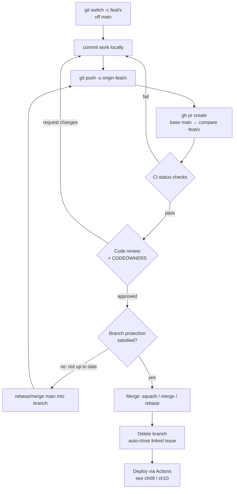
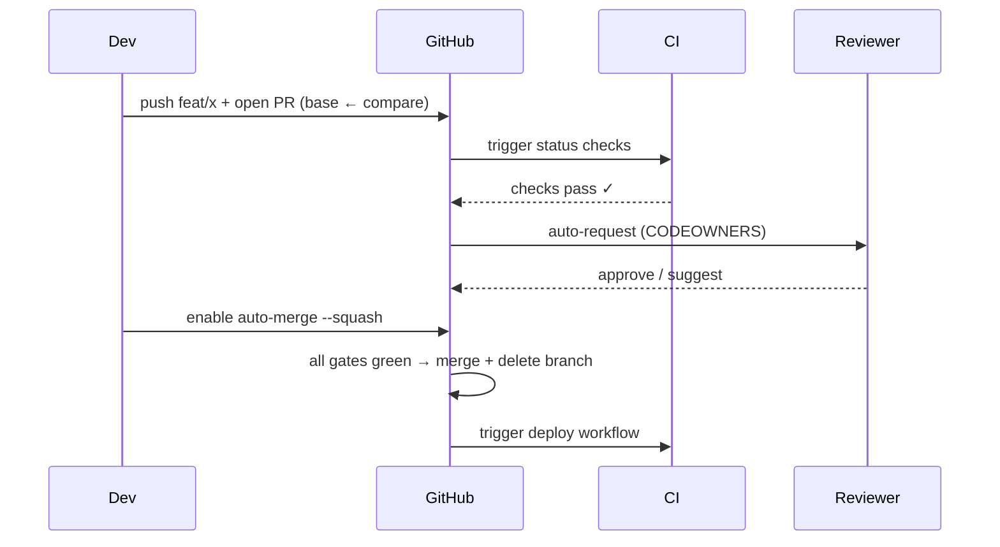

# 08 — GitHub: The Collaboration Platform

> **Audience:** Engineers who know Git the tool (commits, branches, remotes from [05 — Remotes & Collaboration](05_remotes_collaboration.md)) and now need GitHub the *platform* — where teams actually collaborate. From your first Pull Request to running a governed, protected `main` branch as the repo principal. Scratch → advanced, with mermaid.

This chapter shifts from **Git** (a distributed version-control tool you run locally) to **GitHub** (a hosted platform built *around* Git). Git doesn't know what a "Pull Request" is — that's pure GitHub. Keep that boundary in mind: everything here is convention and tooling layered on top of plain Git.

---

## 1. What GitHub Adds On Top of Git

Git gives you history, branching, and merging. GitHub wraps that with the *social and operational* layer:

| Layer | What GitHub provides | Plain Git equivalent |
|---|---|---|
| **Hosting** | A canonical remote (`origin`), durable, backed up | A bare repo on a server |
| **Collaboration** | Forks, Pull Requests, @-mentions, teams | Emailing patches / shared SSH access |
| **Code review** | Inline comments, approvals, suggestions | `git format-patch` + mailing list |
| **Automation** | GitHub Actions (CI/CD), webhooks | Cron + your own scripts |
| **Project mgmt** | Issues, Projects, Milestones, Discussions | None |
| **Security** | Dependabot, secret/code scanning, advisories | None |

> **Parallels:** **GitLab** (Merge Requests, built-in CI, self-hostable) and **Bitbucket** (PRs, tight Jira integration) offer the same shape. The vocabulary differs — GitLab says *Merge Request* where GitHub says *Pull Request* — but the workflows in this chapter transfer almost one-to-one.

---

## 2. The Repository Model

A **repository** ("repo") is a Git repo plus GitHub metadata (issues, PRs, settings, wiki). Repos have **visibility**:

- **Public** — anyone can read; write still gated by permissions.
- **Private** — only invited collaborators/teams.
- **Internal** — visible across an organization (Enterprise).

### Two collaboration models

| | **Fork-and-Pull** | **Shared-Repository** |
|---|---|---|
| Typical use | Open source, external contributors | Companies, trusted teams |
| Where you push | Your **fork** (a server-side copy) | Branches on the **shared** repo |
| Trust needed | None — no write access required | Write access to the repo |
| Sync source | `upstream` remote (original repo) | `origin` (the one repo) |
| PR direction | your-fork:branch → upstream:main | origin:branch → origin:main |

**Fork-and-pull** (open source): you fork, clone *your fork*, add the original as `upstream`, and open PRs back to it.

```bash
# Fork-and-pull: clone YOUR fork, track the original as `upstream`
git clone git@github.com:you/project.git      # origin = your fork
cd project
git remote add upstream git@github.com:org/project.git

# Keep your fork's main in sync with the real upstream
git fetch upstream                  # pull down upstream's history
git switch main
git merge upstream/main             # or: git rebase upstream/main
git push origin main                # update your fork
```

**Shared-repository** (most companies): everyone clones the *same* repo and pushes feature branches to it.

```bash
# Shared model: one repo, feature branches, no fork
git clone git@github.com:acme/payments.git    # origin = the shared repo
cd payments
git switch -c feat/add-refunds                # branch off main
# ...work, commit...
git push -u origin feat/add-refunds           # push branch to origin
```

---

## 3. Pull Requests — The Core Unit

A **Pull Request (PR)** is a request to merge a **compare** branch into a **base** branch, wrapped with discussion, review, and checks. Mentally: **base ← compare** ("merge *compare* into *base*").

> ⚠️ The single most common PR mistake is getting **base** and **compare** backwards, or picking the wrong base. See §10.

### 3.1 Opening a PR

```bash
# After pushing your branch, open a PR with the gh CLI
gh pr create \
  --base main \                       # where it lands (base)
  --head feat/add-refunds \           # your branch (compare)
  --title "Add refunds endpoint" \
  --body "Implements POST /refunds. Closes #142." \
  --reviewer alice,bob \
  --label backend
```

`Closes #142` (or `Fixes`, `Resolves`) **links the issue** — merging the PR auto-closes it.

### 3.2 Code review

Reviewers can **Comment**, **Approve**, or **Request changes**. Tools:

- **Inline comments** — pinned to specific lines.
- **Suggestions** — propose exact replacement text the author can apply in one click:

  ````markdown
  ```suggestion
  const timeout = 30_000; // ms
  ```
  ````

- **Draft PRs** — `gh pr create --draft`. Signals "work in progress, don't review/merge yet"; cannot be merged until marked ready.

### 3.3 Required reviews & status checks

Branch protection (§4) can demand **N approving reviews** and that all **status checks** (CI from [09 — GitHub Actions & CI/CD](09_github_actions_cicd.md)) pass green before the merge button unlocks.

### 3.4 Merge methods — the team trade-off

| Method | Resulting history | Pros | Cons |
|---|---|---|---|
| **Merge commit** | Keeps all commits + a merge node | Full, true history; nothing lost | Noisy graph; many WIP commits on `main` |
| **Squash** | All PR commits → **one** commit on base | Clean, linear `main`; one commit per PR | Loses intra-PR granularity |
| **Rebase** | Replays PR commits onto base, no merge node | Linear *and* keeps each commit | Rewrites SHAs; messy if PR has fixups |

**Team rule of thumb:** most teams pick **squash** for a tidy, bisectable `main`. Pick **merge commit** when intra-PR history is meaningful. Whatever you choose, *enforce one method* — mixing them is what produces the messy history in §10.

### 3.5 Auto-merge

```bash
# Queue the PR to merge automatically once all checks + reviews pass
gh pr merge 153 --auto --squash --delete-branch
```

---

## 4. Branch Protection Rules (and Rulesets)

This is the **repo principal's governance** layer — how you protect `main` from accidents and enforce the SDLC. Configured under *Settings → Branches* (classic **branch protection rules**) or *Settings → Rules* (newer **rulesets**, which can target multiple branches/tags by pattern and layer on top of each other).

| Option | What it enforces |
|---|---|
| **Require a PR before merging** | No direct pushes to `main` |
| **Require approvals** (N) | At least N reviewers approved |
| **Dismiss stale approvals** | New commits invalidate old approvals |
| **Require status checks** | Named CI checks must pass |
| **Require branches up to date** | Branch must be rebased/merged on latest `main` before merge |
| **Require linear history** | Blocks merge commits (forces squash/rebase) |
| **Require signed commits** | All commits GPG/SSH-signed |
| **Require conversation resolution** | All review threads resolved |
| **Restrict who can push** | Only named users/teams/apps |
| **Include administrators** | Rules apply to admins too (recommended) |

A sane starting setup for `main`: require PR + 1 approval + CI checks + up-to-date + conversation resolution, dismiss stale approvals, include admins.

---

## 5. CODEOWNERS — Auto-Request Reviews by Path

A `CODEOWNERS` file maps paths to owners. When a PR touches a path, GitHub **auto-requests review** from the owners — and a protection rule can **require** code-owner review. This ties directly into the review discipline in [../sdlc/04_code_review_code_health.md](../sdlc/04_code_review_code_health.md).

Place it in `.github/CODEOWNERS`, repo root, or `docs/`:

```yaml
# .github/CODEOWNERS — last matching pattern wins (order matters)
*                       @acme/platform-team   # default owners for everything
/frontend/              @acme/web-team         # anything under frontend/
*.tf                    @acme/infra            # all Terraform files
/payments/**            @alice @bob            # specific owners for a subtree
/docs/                  @acme/tech-writers
```

> "Review never happened" (§10) is almost always *no CODEOWNERS* (or no rule requiring it). Codify ownership so the right humans are pulled in automatically.

---

## 6. Issues & Projects

- **Issues** — the unit of work/bug tracking. Support **labels** (`bug`, `p1`), **milestones** (group toward a release), **assignees**, and **templates** (`.github/ISSUE_TEMPLATE/`) to standardize bug/feature reports.
- **Projects** — flexible **boards** (kanban/table/roadmap) with custom fields (status, priority, sprint); pull in issues and PRs from many repos.
- **Discussions** — threaded Q&A / announcements / RFCs, separate from actionable Issues.

A minimal **PR template** at `.github/pull_request_template.md` nudges authors to supply context:

```yaml
## What & why
<!-- Summary of the change and the motivation -->

## Linked issues
Closes #

## Checklist
- [ ] Tests added/updated
- [ ] Docs updated
- [ ] CI green
```

---

## 7. Releases

A **GitHub Release** is built on a Git **tag** ([04 — tags] in your tagging chapter) and adds a human-facing page: title, notes, and downloadable **assets** (binaries, archives).

```bash
# Create an annotated tag, push it, then cut a Release with auto notes + an asset
git tag -a v1.4.0 -m "Refunds GA"
git push origin v1.4.0

gh release create v1.4.0 \
  --title "v1.4.0 — Refunds GA" \
  --generate-notes \                 # auto release notes from merged PRs
  ./dist/app-v1.4.0.tar.gz           # attach a build artifact
```

`--generate-notes` builds the changelog from PRs merged since the previous tag (configurable via `.github/release.yml` to group by label).

---

## 8. The `gh` CLI — Scripting GitHub From the Terminal

`gh` brings PRs, repos, and CI runs to your shell — scriptable and CI-friendly.

```bash
# Pull Requests
gh pr create --fill                    # PR using commit msgs as title/body
gh pr checkout 153                     # check out someone's PR branch locally
gh pr review 153 --approve             # approve (or --request-changes -b "...")
gh pr review 153 --comment -b "nit: rename var"
gh pr merge 153 --squash --delete-branch
gh pr status                           # PRs relevant to you
gh pr diff 153                         # view the diff

# Repositories
gh repo clone acme/payments
gh repo create acme/new-svc --private --clone
gh repo view --web                     # open in browser

# CI runs (Actions — see ch09)
gh run list                            # recent workflow runs
gh run watch                           # live-tail the current run
gh run view <id> --log-failed          # only the failed step logs
```

---

## 9. Security Features (brief — deep in ch09 / sdlc)

GitHub bundles supply-chain and code security; enable these on every repo that ships:

- **Dependabot** — alerts + automated PRs to bump vulnerable/outdated dependencies.
- **Secret scanning** — detects committed credentials (API keys, tokens); **push protection** blocks the push before the secret lands.
- **Code scanning** — static analysis (e.g. CodeQL) surfaces vulnerabilities as PR annotations.
- **Security advisories** — privately coordinate, fix, and disclose vulnerabilities.

These run *as checks* and integrate with the same PR/branch-protection gates. Full treatment in [09 — GitHub Actions & CI/CD](09_github_actions_cicd.md) and the SDLC reference.

---

## 10. The GitHub Collaboration Flow, End to End

Branch → push → PR → CI checks → review → merge → deploy. The whole loop:



The same exchange as a sequence:



---

## 11. Symptom / Cause / Fix

**Symptom — "Can't merge: the merge button is disabled / branch protection blocks."**
- **Cause:** Required reviews or required status checks aren't satisfied (missing approval, a check is red or never ran, branch not up to date, unresolved conversations).
- **Fix:** Open the PR's *merge box* and read the blockers. Get the required approval(s); rerun/fix failing checks (`gh run view <id> --log-failed`); resolve threads; update the branch:
  ```bash
  git fetch origin
  git rebase origin/main        # bring branch up to date with main
  git push --force-with-lease   # safe force-push of the rebased branch
  ```

**Symptom — "PR shows thousands of unrelated changes."**
- **Cause:** Wrong **base** branch, or your branch is far behind `main` so the diff includes everyone else's work. (Often: based off an old branch instead of `main`.)
- **Fix:** Verify base is correct (`gh pr edit <n> --base main`), then rebase onto current `main` so the diff shows *only your* changes:
  ```bash
  git fetch origin
  git rebase origin/main
  git push --force-with-lease
  ```

**Symptom — "Merge vs squash made history messy."**
- **Cause:** No enforced team merge policy — some PRs squashed, some merge-committed, producing an inconsistent graph.
- **Fix:** Pick one method (usually **squash** — see §3.4). In *Settings → General → Pull Requests* disable the other merge buttons, and enable *Require linear history* to make the rule structural, not a habit.

**Symptom — "Review never happened — code merged unreviewed."**
- **Cause:** No `CODEOWNERS`, and/or branch protection didn't *require* reviews, so the author self-merged.
- **Fix:** Add `.github/CODEOWNERS` (§5), then in branch protection enable *Require a PR before merging*, *Require approvals*, and *Require review from Code Owners*.

---

> **Next:** [09 — GitHub Actions & CI/CD](09_github_actions_cicd.md) — those green "status checks" gating your PR are GitHub Actions. We'll write workflows from scratch, wire them into branch protection, and build the pipeline that takes a merge all the way to **deploy** ([10 — DevOps, Branching Strategies & Release Engineering](10_devops_branching_release.md)).
