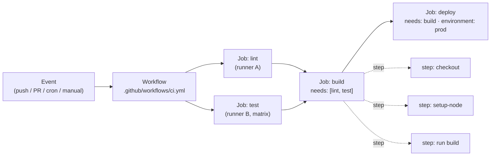
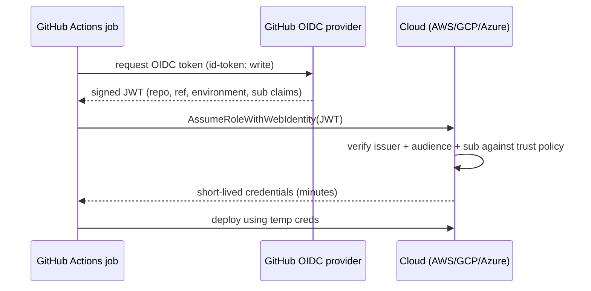

# 09 — GitHub Actions & CI/CD

> **Audience:** You can branch, push, and open PRs ([08 — GitHub: The Collaboration Platform](08_github_collaboration.md)), and you understand CI/CD *theory* from the SDLC reference ([../sdlc/03_cicd_release_engineering.md](../sdlc/03_cicd_release_engineering.md)). This chapter is **GitHub Actions specifically** — the YAML, the runners, the security model — from scratch to production-grade pipelines. For *why* you build pipelines (DORA metrics, deployment strategies, gates) read the sibling SDLC chapter; this is *how* you build them on GitHub.

---

## 1. The mental model: workflow → jobs → steps

GitHub Actions has exactly three nested concepts. Burn them in:

| Concept | Lives in | Runs on | Parallelism |
|---|---|---|---|
| **Workflow** | `.github/workflows/*.yml` (one file = one workflow) | — | Many workflows can run at once |
| **Job** | a top-level key under `jobs:` | a fresh **runner** (VM/container) | **Parallel by default** |
| **Step** | a list item under `steps:` | the job's runner | **Sequential**, top to bottom |

A **runner** is the machine that executes a job. Each job gets a *clean* runner — nothing is shared between jobs unless you explicitly pass it (artifacts, outputs, cache). Steps within a job *do* share the same filesystem and environment.



The arrows between jobs are `needs:` dependencies — they form a **DAG**. Jobs with no edge between them run concurrently.

---

## 2. Anatomy of a workflow file

```yaml
# .github/workflows/ci.yml
name: CI                         # shown in the Actions UI

on:                              # WHAT triggers this workflow
  push:
    branches: [main]
  pull_request:

permissions:                     # least-privilege (see §7) — set at top level
  contents: read

concurrency:                     # cancel superseded runs (see §3)
  group: ci-${{ github.ref }}
  cancel-in-progress: true

jobs:
  build:                         # job id (used in needs:)
    name: Build & test           # display name
    runs-on: ubuntu-latest       # the runner
    steps:
      - uses: actions/checkout@v4 # an ACTION (reusable unit)
      - name: Install
        run: npm ci               # a SHELL command
```

Every workflow is `name` + `on` + `jobs`. The rest (`permissions`, `concurrency`, `env`, `defaults`) is optional but you should treat `permissions` as mandatory.

---

## 3. Triggers / events

The `on:` key decides *when* a workflow runs.

| Event | Fires when | Common use |
|---|---|---|
| `push` | commits land on a branch/tag | CI on main, tag releases |
| `pull_request` | PR opened/synchronized/reopened | PR validation (runs from the **fork's** code, restricted secrets) |
| `workflow_dispatch` | a human clicks "Run workflow" | manual deploys, ad-hoc jobs |
| `schedule` | cron timer (UTC) | nightly builds, dependency scans |
| `release` | a GitHub Release is published | publish artifacts/packages |
| `workflow_call` | another workflow calls it | **reusable** workflows (§9) |
| `pull_request_target` | like `pull_request` but runs in the **base** repo context with secrets — **dangerous** (§7) | labeling bots (rarely) |

```yaml
on:
  push:
    branches: [main, 'release/**']   # branch filter (globs allowed)
    paths: ['src/**', '!**/*.md']    # path filter: skip docs-only pushes
    tags: ['v*.*.*']
  schedule:
    - cron: '0 6 * * 1'              # 06:00 UTC every Monday
  workflow_dispatch:                 # adds the manual "Run workflow" button
    inputs:
      environment:
        description: Target env
        type: choice
        options: [staging, production]
```

> **Tip:** `paths`/`branches` filters apply per-event. A `paths` filter on `push` does **not** automatically apply to `pull_request` — declare it under each event.

---

## 4. Jobs: runners, DAGs, conditions, matrices

### 4.1 `runs-on` — GitHub-hosted vs self-hosted

| | GitHub-hosted | Self-hosted |
|---|---|---|
| Provisioning | fresh ephemeral VM per job | your own machine/VM/pod |
| Maintenance | none | you patch & secure it |
| Cost | per-minute (free tier for public) | your infra cost |
| Network | public egress | can reach private networks/VPC |
| Security | strong isolation | **see §7 — big risk on public repos** |

```yaml
jobs:
  on-cloud:
    runs-on: ubuntu-latest
  on-prem:
    runs-on: [self-hosted, linux, x64, gpu]   # matches by labels
```

### 4.2 `needs` — building the DAG

```yaml
jobs:
  lint:  { runs-on: ubuntu-latest, steps: [ ... ] }
  test:  { runs-on: ubuntu-latest, steps: [ ... ] }
  build:
    needs: [lint, test]        # waits for BOTH; runs only if both succeed
    runs-on: ubuntu-latest
    steps: [ ... ]
```

### 4.3 `if` conditions

```yaml
  deploy:
    needs: build
    if: github.ref == 'refs/heads/main' && github.event_name == 'push'
    runs-on: ubuntu-latest
```

To run a job *even when an upstream job failed*, you need `if: always()` (or `failure()`), otherwise a failed `needs` skips the dependent job.

### 4.4 Matrix builds, `strategy`, `fail-fast`

```yaml
  test:
    runs-on: ${{ matrix.os }}
    strategy:
      fail-fast: false          # let all combos finish even if one fails
      max-parallel: 4
      matrix:
        os: [ubuntu-latest, windows-latest, macos-latest]
        node: [18, 20, 22]
        exclude:
          - { os: macos-latest, node: 18 }   # prune a combo
    steps:
      - uses: actions/checkout@v4
      - uses: actions/setup-node@v4
        with: { node-version: ${{ matrix.node }} }
      - run: npm test
```

This expands to 3×3 − 1 = **8 parallel jobs**. `fail-fast: true` (default) cancels siblings on the first failure — good for fast feedback, bad when you want the full failure map.

### 4.5 Concurrency

```yaml
concurrency:
  group: deploy-${{ github.ref }}
  cancel-in-progress: true     # new push cancels the stale running deploy
```

Use `cancel-in-progress: true` for CI on PRs (no point testing an outdated commit). Use `cancel-in-progress: false` for production deploys — you want them to **queue**, not cancel mid-deploy.

---

## 5. Steps & actions

A step is either `uses:` (an action) or `run:` (shell) — never both.

```yaml
steps:
  - uses: actions/checkout@v4        # an action from the marketplace
  - uses: actions/setup-python@v5
    with:                            # inputs to the action
      python-version: '3.12'
      cache: pip
  - name: Run tests                  # a shell step
    run: |
      pip install -r requirements.txt
      pytest -q
    shell: bash
    env:
      PYTHONDONTWRITEBYTECODE: '1'
```

### Pin actions to a SHA (supply-chain security)

A floating tag like `@v3` is **mutable** — the owner (or an attacker who steals their account) can repoint it at malicious code that runs with your `GITHUB_TOKEN` and secrets.

```yaml
# WRONG — floating tag, can be moved under you
- uses: actions/checkout@v4

# RIGHT — immutable commit SHA, with the version in a comment
- uses: actions/checkout@b4ffde65f46336ab88eb53be808477a3936bae11 # v4.1.1
```

Pin **third-party** actions to a full 40-char SHA without exception. First-party `actions/*` you may pin to a SHA too; at minimum keep them on a major tag and let Dependabot bump them. This ties directly to [../sdlc/08_devsecops_security_sdlc.md](../sdlc/08_devsecops_security_sdlc.md).

---

## 6. Caching, artifacts, and passing data between jobs

### Cache (speed up dependency installs)

```yaml
- uses: actions/cache@v4
  with:
    path: ~/.npm
    key: npm-${{ runner.os }}-${{ hashFiles('**/package-lock.json') }}
    restore-keys: npm-${{ runner.os }}-   # partial fallback
```

The cache key changes when the lockfile changes, so you rebuild only when deps change. Many `setup-*` actions have a built-in `cache:` input that does this for you.

### Artifacts (files that outlive the job)

```yaml
- uses: actions/upload-artifact@v4
  with: { name: dist, path: dist/, retention-days: 7 }
# ... in a later job:
- uses: actions/download-artifact@v4
  with: { name: dist, path: dist/ }
```

### Job outputs (small values between jobs)

```yaml
jobs:
  setup:
    runs-on: ubuntu-latest
    outputs:
      version: ${{ steps.v.outputs.version }}   # expose to other jobs
    steps:
      - id: v
        run: echo "version=1.4.2" >> "$GITHUB_OUTPUT"
  build:
    needs: setup
    runs-on: ubuntu-latest
    steps:
      - run: echo "Building ${{ needs.setup.outputs.version }}"
```

> **Rule of thumb:** cache = *reproducible* speed-ups (can be rebuilt), artifacts = *files* you need downstream or for download, outputs = *small strings* (versions, flags). Never put secrets in any of them.

---

## 7. Secrets, the `GITHUB_TOKEN`, and least-privilege permissions

### Secret scopes

| Scope | Set where | Visible to |
|---|---|---|
| **Repository** | repo Settings → Secrets | all workflows in the repo |
| **Organization** | org Settings | selected repos in the org |
| **Environment** | repo → Environments → *env* | only jobs targeting that environment (gateable, §8) |

```yaml
steps:
  - run: ./deploy.sh
    env:
      API_TOKEN: ${{ secrets.API_TOKEN }}   # injected at runtime
```

Secret values are **masked** in logs (printed as `***`). But masking is best-effort — base64-encoding or splitting a secret defeats it, so never deliberately echo secrets.

### The auto `GITHUB_TOKEN`

Every job gets a short-lived `${{ secrets.GITHUB_TOKEN }}` (also `${{ github.token }}`) to call the GitHub API for *this* repo. By default in many older repos it has **write** scope to everything — the default-write danger. Lock it down:

```yaml
# WRONG — implicit broad write to contents, packages, issues, ...
# (no permissions: block at all)

# RIGHT — start from nothing, grant only what each job needs
permissions:
  contents: read            # workflow-wide default
jobs:
  release:
    permissions:
      contents: write        # this job tags/creates a release
      id-token: write        # this job uses OIDC (§8)
```

Set `permissions: {}` at the top and elevate per-job. This is the single highest-leverage hardening you can do.

---

## 8. OIDC to cloud — the modern best practice

Putting long-lived `AWS_SECRET_ACCESS_KEY` in repo secrets is the legacy way: those keys never expire, leak easily, and rotate painfully. The modern approach is **OIDC federation** — GitHub mints a short-lived signed token describing *this run*, the cloud verifies it against a trust policy, and hands back **temporary** credentials. No standing cloud keys in GitHub at all. This ties to cloud workload identity in [../sdlc/08_devsecops_security_sdlc.md](../sdlc/08_devsecops_security_sdlc.md).



```yaml
jobs:
  deploy:
    runs-on: ubuntu-latest
    permissions:
      id-token: write        # REQUIRED to request the OIDC token
      contents: read
    steps:
      - uses: aws-actions/configure-aws-credentials@v4
        with:
          role-to-assume: arn:aws:iam::123456789012:role/gha-deploy
          aws-region: eu-west-1
          # no aws-access-key-id / secret — OIDC handles it
      - run: aws s3 sync dist/ s3://my-bucket --delete
```

On the cloud side, scope the trust policy tightly — e.g. AWS condition `token.actions.githubusercontent.com:sub` matching `repo:my-org/my-repo:environment:production`. Without the `sub` condition, *any* repo could assume your role.

---

## 9. Environments — gating production deploys

An **environment** (repo Settings → Environments) wraps a deploy target with **protection rules**: required reviewers, wait timers, branch restrictions, and environment-scoped secrets.

```yaml
jobs:
  deploy-prod:
    runs-on: ubuntu-latest
    environment:
      name: production          # binds protection rules + env secrets
      url: https://app.example.com
    steps:
      - run: ./deploy.sh
        env:
          DEPLOY_KEY: ${{ secrets.DEPLOY_KEY }}   # the PRODUCTION env's secret
```

When this job is reached, GitHub **pauses** it until a required reviewer approves. The job's `secrets.DEPLOY_KEY` resolves to the production environment's value, not the repo-level one. This is how you enforce "no one deploys to prod without a second pair of eyes."

---

## 10. Reusable & composite workflows; expressions & contexts

### Reusable workflow (`workflow_call`)

```yaml
# .github/workflows/reusable-deploy.yml
on:
  workflow_call:
    inputs:
      environment: { required: true, type: string }
    secrets:
      token: { required: true }
jobs:
  deploy:
    runs-on: ubuntu-latest
    environment: ${{ inputs.environment }}
    steps:
      - run: echo "Deploying to ${{ inputs.environment }}"
```

```yaml
# caller
jobs:
  call-deploy:
    uses: my-org/my-repo/.github/workflows/reusable-deploy.yml@main
    with: { environment: staging }
    secrets: { token: ${{ secrets.DEPLOY_TOKEN }} }
```

### Composite action (bundle steps into a `uses:`)

```yaml
# .github/actions/setup/action.yml
runs:
  using: composite
  steps:
    - uses: actions/setup-node@v4
      with: { node-version: 20 }
    - run: npm ci
      shell: bash      # composite run steps MUST declare shell
```

### Expressions & contexts

`${{ ... }}` evaluates expressions. Key contexts: `github` (event, ref, sha, actor), `env`, `secrets`, `steps`, `needs`, `matrix`, `runner`. Write step outputs and env vars via files:

```yaml
- id: meta
  run: |
    echo "tag=v$(date +%Y%m%d)" >> "$GITHUB_OUTPUT"   # step output
    echo "BUILD_ENV=ci" >> "$GITHUB_ENV"              # env for later steps
- run: echo "${{ steps.meta.outputs.tag }} / $BUILD_ENV"
```

> Use the `$GITHUB_OUTPUT` / `$GITHUB_ENV` *files* — the old `::set-output` and `::set-env` workflow commands are removed for security.

---

## 11. Security checklist

- **Pin actions to SHAs** — never trust a floating `@v3` for third-party actions (§5).
- **Scope `permissions:`** — start at `read`/`{}`, elevate per job (§7).
- **`pull_request_target` + untrusted code** — this event runs in the *base* repo with secrets and the *fork's* code. Never `checkout` and run a fork's PR code under it. Use plain `pull_request` for fork CI.
- **Secret exposure** — don't print secrets, don't pass them to untrusted actions, prefer **OIDC** over stored cloud keys (§8).
- **Self-hosted runners on public repos** — a forked PR can run arbitrary code on your runner. Don't attach self-hosted runners to public repos; if you must, require manual approval for first-time contributors.

---

## 12. Complete example: lint + test (matrix) → build → OIDC deploy

```yaml
# .github/workflows/pipeline.yml
name: Pipeline
on:
  push: { branches: [main] }
  pull_request:

permissions:
  contents: read              # least-privilege default

concurrency:
  group: pipeline-${{ github.ref }}
  cancel-in-progress: true

jobs:
  lint:
    runs-on: ubuntu-latest
    steps:
      - uses: actions/checkout@b4ffde65f46336ab88eb53be808477a3936bae11 # v4.1.1
      - uses: actions/setup-node@v4
        with: { node-version: 20, cache: npm }
      - run: npm ci
      - run: npm run lint

  test:
    runs-on: ${{ matrix.os }}
    strategy:
      fail-fast: false
      matrix:
        os: [ubuntu-latest, windows-latest]
        node: [18, 20, 22]
    steps:
      - uses: actions/checkout@b4ffde65f46336ab88eb53be808477a3936bae11 # v4.1.1
      - uses: actions/setup-node@v4
        with: { node-version: ${{ matrix.node }}, cache: npm }
      - run: npm ci
      - run: npm test

  build:
    needs: [lint, test]
    runs-on: ubuntu-latest
    steps:
      - uses: actions/checkout@b4ffde65f46336ab88eb53be808477a3936bae11 # v4.1.1
      - uses: actions/setup-node@v4
        with: { node-version: 20, cache: npm }
      - run: npm ci && npm run build
      - uses: actions/upload-artifact@v4
        with: { name: dist, path: dist/ }

  deploy:
    needs: build
    if: github.ref == 'refs/heads/main' && github.event_name == 'push'
    runs-on: ubuntu-latest
    environment:                       # gated by reviewers + env secrets
      name: production
      url: https://app.example.com
    permissions:
      id-token: write                  # OIDC
      contents: read
    steps:
      - uses: actions/download-artifact@v4
        with: { name: dist, path: dist/ }
      - uses: aws-actions/configure-aws-credentials@v4
        with:
          role-to-assume: arn:aws:iam::123456789012:role/gha-deploy
          aws-region: eu-west-1        # no long-lived keys — OIDC
      - run: aws s3 sync dist/ s3://my-bucket --delete
```

This pipeline runs lint and an 6-cell test matrix in parallel, fans into a single build, then gates the OIDC-authenticated production deploy behind an environment — on `main` pushes only. The actual deploy target could equally be Kubernetes via GitOps — see [../cloud_kubernetes/08_deploying_helm_gitops_operators.md](../cloud_kubernetes/08_deploying_helm_gitops_operators.md).

---

## 13. Symptom / Cause / Fix

- **Symptom:** `${{ secrets.X }}` is empty in a PR from a fork.
  **Cause:** secrets are **not exposed to fork PRs** — by design, so a malicious PR can't exfiltrate them.
  **Fix:** run secret-needing steps only on `push`/after merge, or use a separate gated workflow. Don't switch to `pull_request_target` to "fix" it — that reintroduces the risk.

- **Symptom:** the workflow can push commits, edit issues, publish packages — far more than it should.
  **Cause:** no `permissions:` block, so `GITHUB_TOKEN` defaults to broad write.
  **Fix:** add `permissions: contents: read` at the top and grant write per-job only where needed.

- **Symptom:** a third-party action you used was hijacked and stole secrets.
  **Cause:** you referenced a **floating tag** (`@v3`); the maintainer's tag was repointed at malicious code.
  **Fix:** pin to a full commit **SHA** (§5) and enable Dependabot for actions.

- **Symptom:** code deployed to production without anyone approving it.
  **Cause:** the deploy job had no `environment:` with protection rules.
  **Fix:** bind the deploy job to an **environment** with required reviewers (§9).

- **Symptom:** CI is slow and flaky; stale runs pile up.
  **Cause:** no dependency cache, serial tests, and superseded runs aren't cancelled.
  **Fix:** add `actions/cache` (or `setup-*` `cache:`), parallelize with a **matrix**, and add a **concurrency** group with `cancel-in-progress: true`.

---

> Next: [10 — DevOps, Branching Strategies & Release Engineering](10_devops_branching_release.md) — now that pipelines run on every push, how do you organize branches (trunk-based vs GitFlow), version and release, and connect green CI to actual delivery cadence?
