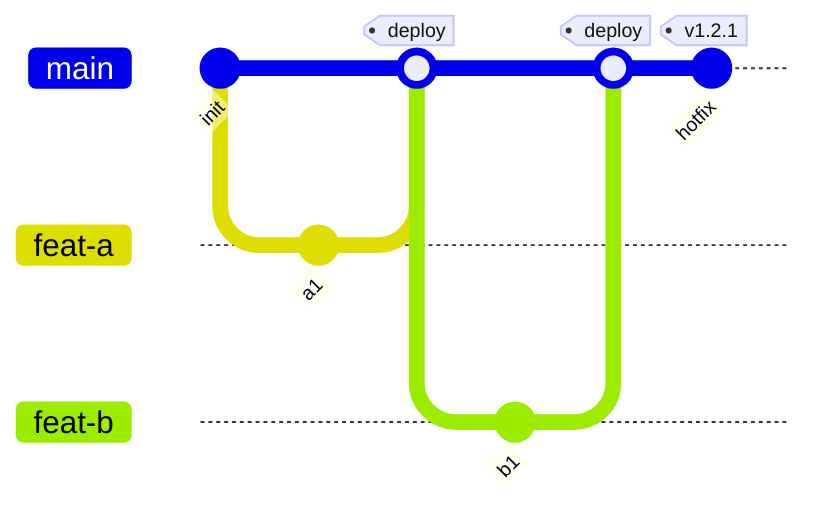
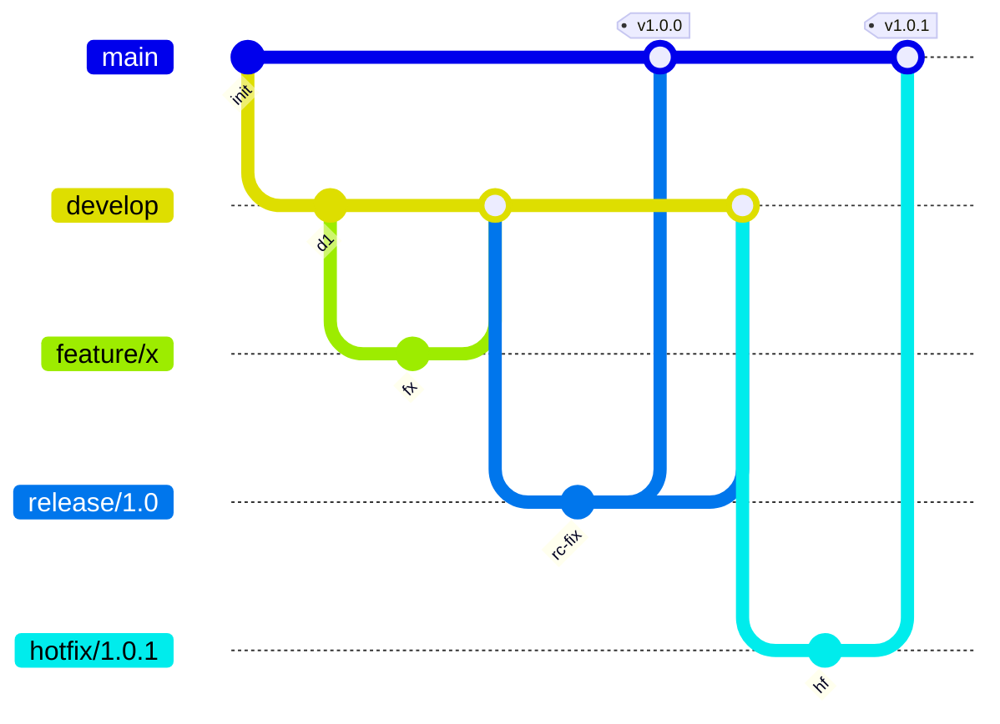
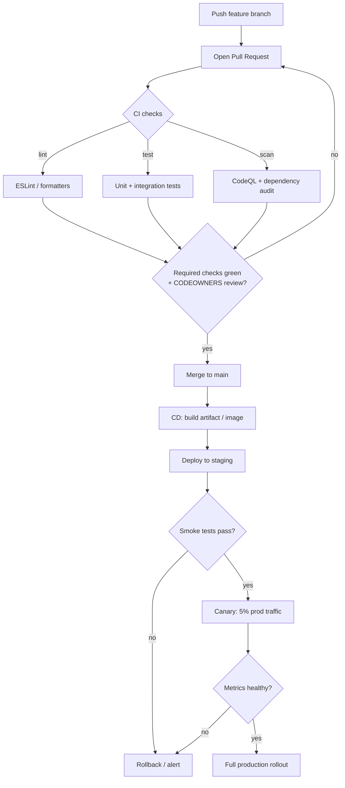

# 10 — DevOps, Branching Strategies & Release Engineering

> **Audience:** Engineers and tech leads choosing *how their team ships*. This is the **capstone** — the final chapter of the `git_concepts/` reference. We tie Git and GitHub to the **delivery lifecycle**: how code becomes a running, versioned, deployed product. General release/CI-CD *theory* lives in the sibling [../sdlc/](../sdlc/README.md); here we focus on the **concrete Git/GitHub mechanics** of branching and release engineering.

---

## 1. The big decision: which branching strategy?

Your branching model dictates how often you integrate, how painful merges are, and how fast you can ship. There is no universal "best" — only a best *for your release cadence and team size*. The four contenders:

- **GitHub Flow** — Branch off `main` → PR → review/CI → merge → deploy. One long-lived branch; simple, web-app friendly.
- **Trunk-based (TBD)** — Commit to `main` via tiny short-lived branches (hours, not days) guarded by **feature flags**. The default at Google/Meta and most CD-mature orgs.
- **GitFlow** — `develop`, `release/*`, `hotfix/*`, `feature/*` around `main`. Heavyweight ceremony; mostly **legacy** or for explicit, infrequent cadences (installed software, firmware).
- **Release trains** — Cut a `release/x.y` branch on a schedule; fixes ride the next train. Common for mobile and versioned SDKs.

### 1.1 Comparison table

| Strategy | Long-lived branches | Integration frequency | Best for | Avoid when |
|---|---|---|---|---|
| **GitHub Flow** | `main` only | Per PR (hours–days) | Web apps, SaaS, small/mid teams, continuous deploy | You need staged releases or multiple supported versions |
| **Trunk-based** | `main` only | Many times/day | High-velocity teams, true CD, FAANG-scale | Team lacks CI discipline or feature-flag tooling |
| **GitFlow** | `main` + `develop` | At release time | Scheduled releases, installed/desktop software, multi-version support | You want to deploy continuously (it fights you) |
| **Release trains** | `main` + `release/*` | Per train (weekly/biweekly) | Mobile, SDKs, API versioning | Pure web SaaS (overhead with no payoff) |

> **Rule of thumb:** If you *can* deploy on every merge, use **GitHub Flow or trunk-based**. Reach for GitFlow/trains only when external constraints (app-store review, customer upgrade windows, supported LTS versions) force a release cadence. Ties to the [../sdlc/](../sdlc/README.md) workflow chapter.

---

## 2. Trunk-based vs GitFlow, visualized

**Trunk-based** — tiny branches merge back to `main` within hours; `main` is always releasable:



**GitFlow** — work pools on `develop`, releases stabilize on `release/*`, hotfixes branch off `main`:



GitFlow has **two permanent integration points** (`main` and `develop`) plus ceremonial release/hotfix branches — and that ceremony is exactly what slows it down.

---

## 3. Why long-lived branches hurt

Long-lived branches feel safe ("I'll integrate when it's done") and are actually the **#1 source of delivery pain**.

- **Merge hell** — The longer a branch lives, the more `main` moves underneath it. A 3-week branch can require resolving hundreds of conflicts nobody remembers the context for.
- **Integration debt** — Two branches each "work" in isolation but break when combined — discovered at merge time, the worst possible moment.
- **Hidden coupling** — Reviewers face a 4,000-line PR and rubber-stamp it; bugs slip through.
- **Stale dependencies** — The branch was written against an API that `main` has since changed.

```bash
# WRONG: a feature branch that diverged for weeks
git checkout -b big-feature
# ... 3 weeks, 47 commits, 'main' moved 200 commits ahead ...
git merge main          # 80 conflicting files; a full day of pain

# RIGHT: trunk-based — integrate continuously, hide incomplete work behind a flag
git checkout -b small-slice
# ... a few hours of work, gated by a flag ...
git rebase main         # trivial: main has barely moved
gh pr create --fill     # merged same day
```

**The fix is structural, not heroic:** trunk-based development + **feature flags** (ship dormant code, flip on later) + **CI on every push**. See [../sdlc/](../sdlc/README.md) ch01 (workflow) and ch03 (CI/testing) for the principles.

---

## 4. Semantic versioning (SemVer)

A version is a **promise to consumers**. SemVer encodes that promise as `MAJOR.MINOR.PATCH`:

| Bump | Meaning | Example |
|---|---|---|
| **MAJOR** | Breaking change — consumers must adapt | `2.4.1 → 3.0.0` |
| **MINOR** | Backward-compatible new feature | `2.4.1 → 2.5.0` |
| **PATCH** | Backward-compatible bug fix | `2.4.1 → 2.4.2` |

Pre-release and build metadata: `1.0.0-rc.1`, `1.0.0+build.42`.

**Its limits:** SemVer only works if you *honestly* classify changes, and "breaking" is subjective (a bug fix can break someone relying on the bug). It says nothing about security urgency or deprecation timelines. A strong default, not gospel.

### Tagging releases in Git/GitHub

```bash
# Annotated tags (preferred — they carry author, date, message, and can be signed)
git tag -a v1.4.0 -m "Release 1.4.0: add canary deploys"
git push origin v1.4.0          # tags do NOT push with 'git push' by default

# WRONG: lightweight tag (just a pointer, no metadata) for a release
git tag v1.4.0

# A GitHub Release is built on top of a tag — created via UI, gh, or automation
gh release create v1.4.0 --generate-notes
```

---

## 5. Release automation: commits → versions → changelogs

Manual version bumps and hand-written changelogs are tedious and error-prone. The modern approach: **let your commit messages drive everything.**

### 5.1 Conventional Commits

A lightweight commit-message convention that machines can parse:

```bash
# <type>(<scope>): <description>
feat(auth): add OAuth login        # → MINOR bump
fix(api): handle null user id      # → PATCH bump
feat(api)!: drop v1 endpoints      # ! or BREAKING CHANGE footer → MAJOR bump
docs(readme): clarify setup        # → no release
```

### 5.2 The automated release pipeline

Tools read commits since the last tag, compute the next SemVer, write the changelog, tag, and publish:

- **release-please** (Google) — opens a "release PR" accumulating the changelog/version bump; **merging it** cuts the release. Great GitHub-native fit.
- **semantic-release** — fully automated; releases directly on merge to `main`.
- **changesets** — explicit author-written change notes; ideal for **monorepos**.

```yaml
# .github/workflows/release.yml — release-please example
name: release
on:
  push:
    branches: [main]
permissions:
  contents: write      # to create tags + releases
  pull-requests: write # to open the release PR
jobs:
  release:
    runs-on: ubuntu-latest
    steps:
      - uses: googleapis/release-please-action@v4
        with:
          release-type: node
```

The loop: **merge to `main` → tool computes version from commits → updates CHANGELOG → tags → creates a GitHub Release**. Zero manual version math.

---

## 6. CI/CD with GitHub, end-to-end

This ties together [08 — GitHub: The Collaboration Platform](08_github_collaboration.md) (PRs, branch protection, CODEOWNERS) and [09 — GitHub Actions & CI/CD](09_github_actions_cicd.md) (workflows, environments). The full path from keyboard to production:



The **gate** is the diamond `D`: branch protection makes required CI checks and review *mandatory* — you cannot merge a red or unreviewed PR. After merge, CD does progressive delivery (staging → canary → prod) so a bad change is caught on a fraction of traffic.

---

## 7. GitOps: Git as the source of truth

**GitOps** extends "everything in Git" to your *infrastructure and deployment state*. The desired state lives in a Git repo; an agent reconciles reality to match.

- **Push model** — GitHub Actions runs `kubectl apply` / `helm upgrade` after merge.
- **Pull model** — **ArgoCD** or **Flux** runs *inside* the cluster, watches the repo, and continuously reconciles. Drift (someone `kubectl edit`-ing prod) is auto-reverted. See [../cloud_kubernetes/](../cloud_kubernetes/README.md) ch08 for the Kubernetes details.

```yaml
# Argo CD Application — declares "this repo path IS prod"
apiVersion: argoproj.io/v1alpha1
kind: Application
metadata:
  name: payments-prod
spec:
  source:
    repoURL: https://github.com/acme/k8s-manifests
    path: apps/payments/prod
    targetRevision: main          # Git is the source of truth
  destination:
    namespace: payments
    server: https://kubernetes.default.svc
  syncPolicy:
    automated:
      selfHeal: true              # revert manual drift
      prune: true
```

Pair this with **GitHub Environments + deployment protection rules** ([09 — GitHub Actions & CI/CD](09_github_actions_cicd.md)): require reviewer approval before the `production` job runs, restrict which branches deploy, and gate on wait timers.

---

## 8. DevOps supporting practices on GitHub

GitHub bundles much of the DevOps toolchain into the repo itself:

- **Dependabot** — automated dependency-update PRs and security alerts. Triage them like any other PR (CI must pass).
- **Code scanning (CodeQL)** — static analysis on every PR; findings surface as PR annotations and in the Security tab.
- **DORA metrics lens** — measure deployment frequency, lead time for changes, change-failure rate, and MTTR. Trunk-based + automated release directly improves all four. The theory and targets live in [../sdlc/](../sdlc/README.md).
- **Infrastructure-as-Code in the repo** — Terraform/OpenTofu lives alongside app code, reviewed as PRs: **plan on PR** (preview the diff), **apply on merge** (execute the reviewed plan).

```yaml
# Terraform: plan on PR (preview), apply on merge (execute)
on:
  pull_request:        # PR: show the plan, do NOT change anything
  push:
    branches: [main]   # merge: apply the reviewed plan
jobs:
  plan-or-apply:
    runs-on: ubuntu-latest
    steps:
      - uses: actions/checkout@v4
      - uses: hashicorp/setup-terraform@v3
      - run: terraform init
      - run: terraform plan            # always: comment the diff on the PR
      - if: github.ref == 'refs/heads/main'
        run: terraform apply -auto-approve   # only after review + merge
```

---

## 9. Hotfix flow

A production incident needs a fix *now* — but `main` may contain unreleased work you can't ship. The discipline: **branch from the released tag, fix, ship, then forward-port.**

```bash
# 1. Branch from the EXACT released tag (not the moving tip of main)
git checkout -b hotfix/1.4.1 v1.4.0

# 2. Make the minimal fix, commit it atomically
git commit -am "fix(billing): correct tax rounding"

# 3. Tag + release the hotfix
git tag -a v1.4.1 -m "Hotfix 1.4.1"
git push origin hotfix/1.4.1 v1.4.1

# 4. CRITICAL: forward-port the fix back to main so it isn't lost
git checkout main
git cherry-pick <hotfix-sha>     # see ch04 — replay the commit onto main
git push origin main
```

The cherry-pick mechanics (and how to avoid duplicate-commit pitfalls) are covered in [04 — Rebase, Cherry-pick & Rewriting History](04_rebase_cherry_pick_history.md). The non-negotiable rule: **every hotfix must land on `main` too**, or you'll reintroduce the bug on the next release.

---

## 10. The principal's synthesis

Fast *and* safe shipping is not a tooling accident — it's three disciplines reinforcing each other:

1. **Git discipline** — atomic commits, conventional messages, clean history (no merge-hell branches). This makes review, bisecting, changelogs, and reverts trivial.
2. **GitHub governance** — branch protection, CODEOWNERS, required status checks and reviews. The merge gate is where quality is *enforced*, not requested.
3. **Automated delivery** — Actions/GitOps turning a green merge into a versioned, deployed release with no manual steps.

> Remove any one leg and the stool falls: clean commits with no gate (anyone can push junk), a strict gate with manual deploys (slow and error-prone), or automation over messy history (you automate the chaos). All three together = **fast, safe shipping.**

---

## 11. Symptom / Cause / Fix

- **Symptom:** A long release branch diverged painfully from `main`; merging it took a full day of conflict resolution.
  - **Cause:** Long-lived branch accumulated integration debt while `main` moved ahead.
  - **Fix:** Adopt **trunk-based development** with **feature flags** — integrate to `main` continuously and gate incomplete work behind flags (see §3).

- **Symptom:** Manual version bumps and changelogs are inconsistent and frequently wrong.
  - **Cause:** Humans deciding SemVer by hand and hand-editing CHANGELOG.
  - **Fix:** **Conventional Commits** + **release-please/semantic-release/changesets** to derive the version and changelog from commit history (see §5).

- **Symptom:** A hotfix shipped to prod but the bug reappeared in the next release.
  - **Cause:** The fix went out from a hotfix/release branch but was never merged back to `main`.
  - **Fix:** **Forward-port discipline** — cherry-pick every hotfix onto `main` as part of the hotfix checklist (see §9 and [04 — Rebase, Cherry-pick & Rewriting History](04_rebase_cherry_pick_history.md)).

- **Symptom:** Production infrastructure changed out-of-band from what the repo says.
  - **Cause:** Someone applied a manual `kubectl`/console change; the repo and reality drifted.
  - **Fix:** **IaC + GitOps** — make Git the source of truth and let ArgoCD/Flux `selfHeal` revert drift; all changes go through PR (see §7–§8).

---

> **Related:** [README — git_concepts index](README.md) · [../sdlc/](../sdlc/README.md) · [../cloud_kubernetes/](../cloud_kubernetes/README.md) · [../system_design/](../system_design/README.md) · earlier chapters: [04 — Rebase, Cherry-pick & Rewriting History](04_rebase_cherry_pick_history.md), [08 — GitHub: The Collaboration Platform](08_github_collaboration.md), [09 — GitHub Actions & CI/CD](09_github_actions_cicd.md)
>
> *This is the final chapter of the `git_concepts/` reference. From scratch to advanced — go ship something.*
