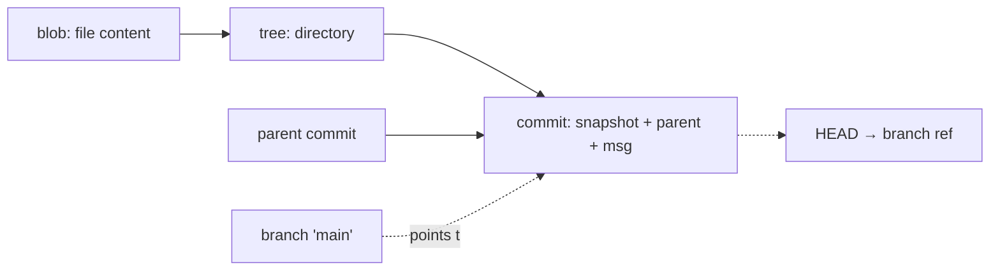

# Git, GitHub & DevOps — from scratch to advanced 🌿🐙🚀

> **Audience:** from "what is a commit?" to the principal who designs the
> branching strategy, the branch-protection rules, and the GitHub Actions delivery
> pipeline for a whole org. Git is the substrate of all modern software work — every
> change, review, build, and deploy flows through it — yet most engineers know only a
> handful of memorized incantations and freeze the moment history goes sideways. This
> series teaches the **model**, not the spells: once you understand that Git is a
> content-addressed DAG of snapshots and that branches are just pointers, every
> command (merge, rebase, reset, reflog) becomes obvious and recoverable.

It runs in three arcs: **Git the tool** (01–07) from the object model to advanced
internals; **GitHub the platform** (08) for collaboration and governance; and
**DevOps** (09–10) — GitHub Actions and the branching/release engineering that turns
a repo into a delivery pipeline. Concepts are taught with **mermaid diagrams**
throughout — commit graphs, branch/merge/rebase `gitGraph`s, reset effects, PR and
CI/CD flows — because Git is visual and a picture ends most confusion.

---

## 📚 Chapters

| # | Doc | What it covers |
|---|-----|----------------|
| 01 | [Git Foundations & the Object Model](01_git_foundations_object_model.md) | distributed VCS, the **commit DAG**, blob/tree/commit/tag objects, content-addressing (SHA), refs & **HEAD**, the three areas (working/index/repo), `config`/`init`/`clone` |
| 02 | [The Everyday Workflow](02_everyday_workflow.md) | `add`/`commit`/`status`/`diff`, the staging area & `add -p`, `--amend`, good commit messages, `log` mastery, `.gitignore`, `blame`/`show` |
| 03 | [Branching & Merging](03_branching_merging.md) | branches as pointers, `switch`/`branch`, **fast-forward vs 3-way merge**, `--no-ff`, **conflict resolution**, `rerere`, range (`..`/`...`) semantics |
| 04 | [Rebase, Cherry-pick & Rewriting History](04_rebase_cherry_pick_history.md) | rebase vs merge, **interactive rebase** (squash/fixup/reorder), the **golden rule**, `cherry-pick`, `filter-repo`, the **reflog** safety net |
| 05 | [Remotes & Collaboration](05_remotes_collaboration.md) | remotes/origin/upstream, **fetch vs pull**, `pull --rebase`, push & **`--force-with-lease`**, remote-tracking branches, refspecs, tags, auth (SSH/HTTPS) |
| 06 | [Undoing & Recovery](06_undoing_recovery.md) | the **three resets** (soft/mixed/hard), `revert` (safe undo), `restore`, **`stash`**, `clean`, **reflog recovery**, **`bisect`**, the master "undo X" decision table |
| 07 | [Advanced Git Internals & Power Tools](07_advanced_internals_power_tools.md) | plumbing, packfiles/`gc`, **hooks** (pre-commit), **worktrees**, submodules vs subtree vs monorepo, **LFS/partial clone/sparse-checkout** at scale, pickaxe/`log -L`, `.gitattributes`, signing |
| 08 | [GitHub: The Collaboration Platform](08_github_collaboration.md) | fork-and-pull vs shared-repo, **Pull Requests** & review, merge vs squash vs rebase, **branch protection/rulesets**, CODEOWNERS, Issues/Projects, Releases, the **`gh` CLI** |
| 09 | [GitHub Actions & CI/CD](09_github_actions_cicd.md) | workflows/jobs/steps/runners, triggers, **matrix** & `needs` DAG, caching/artifacts, secrets & least-privilege `permissions`, **OIDC to cloud** (no long-lived keys), environments, pinning actions, a full pipeline |
| 10 | [DevOps, Branching Strategies & Release Engineering](10_devops_branching_release.md) | **trunk-based vs GitHub Flow vs GitFlow**, SemVer, **release automation** (conventional commits/release-please), end-to-end PR→CI→CD, GitOps, Dependabot/DORA/IaC, hotfix forward-port |

---

## 🧭 The one idea that makes Git click

A **commit** is a snapshot (a tree of blobs) plus parent links and metadata, named by
the hash of its content. A **branch** is just a movable pointer to a commit; **HEAD**
points to your current branch. *Merge* joins two lines (a commit with two parents);
*rebase* replays commits onto a new base (new commits, new hashes); *reset* moves a
pointer; *reflog* remembers where pointers have been so nothing is ever truly lost.
Every chapter is a consequence of this one picture.

---

## 🎯 The progression

- **Scratch (01–02):** the model + the daily loop. Most bugs ("nothing to commit",
  "detached HEAD") dissolve once the object model and three areas are clear.
- **Core (03–06):** branching, merging, rebasing, and — critically — **recovery**.
  Chapter 06 is the one to bookmark: with `reflog`, `revert`, `reset`, `stash`, and
  `bisect`, almost nothing is unrecoverable.
- **Advanced (07):** internals and power tools — hooks, worktrees, monorepo-at-scale,
  history surgery, signing.
- **Platform & DevOps (08–10):** GitHub PRs/governance, GitHub Actions, and the
  branching/release strategy that ties Git discipline to safe, automated delivery.

---

## 🧵 Principal-level through-lines

- **Understand the DAG; stop memorizing commands.** Every operation is a transformation
  on the commit graph and a move of a pointer.
- **History is recoverable — be fearless, then disciplined.** The reflog (04/06) makes
  local experimentation safe; the **golden rule** (never rewrite *shared* history) keeps
  the team safe.
- **`--force-with-lease`, never `--force`** (05): the difference between safely updating
  your branch and clobbering a teammate's work.
- **Automate governance, not just builds** (08–10): branch protection, required checks,
  CODEOWNERS, signed commits, OIDC (no long-lived keys), and least-privilege
  `GITHUB_TOKEN` are how a principal makes "the right way" the easy way for the whole org.
- **Trunk-based + feature flags + CI** beats long-lived branches at scale (10).

---

## 🔗 Where this connects

- **The engineering process** this feeds — testing, CI/CD, code review, release
  engineering as disciplines (tool-agnostic): [`../sdlc/`](../sdlc/README.md).
- **Where the pipeline deploys** — running the result on Kubernetes/a cloud provider:
  [`../cloud_kubernetes/`](../cloud_kubernetes/README.md).
- **SSH keys / certificate authorities** behind Git auth at scale:
  [`../modern_os/linux/12_security_access_control.md`](../modern_os/linux/12_security_access_control.md).
- **Architecture above** ([`../system_design/`](../system_design/README.md)) and the
  language books that produce the code flowing through these pipelines.

> A principal is fluent in Git the way a writer is fluent in a language: not reciting
> grammar rules, but expressing intent — and never afraid of the blank-page panic of a
> botched merge, because they know exactly how to get back.
