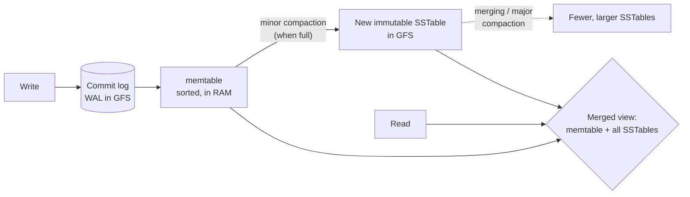

# Bigtable

> *"Bigtable: A Distributed Storage System for Structured Data"* — Fay Chang, Jeffrey Dean, Sanjay Ghemawat, Wilson C. Hsieh, Deborah A. Wallach, Mike Burrows, Tushar Chandra, Andrew Fikes, Robert E. Gruber. OSDI 2006.

---

## Overview

Bigtable is a **distributed, sparse, persistent, multi-dimensional sorted map** for managing **structured data at petabyte scale** across thousands of commodity machines. Built at Google, it backed dozens of products (web indexing, Google Earth, Google Analytics, Personalized Search, Gmail metadata, etc.) — workloads ranging from latency-sensitive serving to throughput-oriented batch.

Bigtable is *not* a relational database. It deliberately gives up the relational model, SQL, and (in the original paper) cross-row transactions, in exchange for **massive horizontal scalability, predictable performance, and a simple, flexible data model** that lets each application control its own data layout and locality.

| | |
|---|---|
| **Built by** | Google |
| **Seminal paper** | OSDI 2006 |
| **Builds on** | GFS (storage), Chubby (coordination), SSTable format |
| **Open-source descendants** | Apache HBase, Apache Cassandra (data model), Apache Accumulo |
| **Hosted version** | Google Cloud Bigtable |

---

## The Problem It Solved

Google needed to store and serve **structured data** (URLs and their crawl metadata, per-user data, geographic data) at a scale and cost no commercial database could touch, with **wildly different workloads** (bulk MapReduce throughput vs. single-row low-latency serving) and the ability to **scale incrementally** by adding cheap machines. It also needed applications to control physical data layout for locality and to evolve schemas cheaply.

A relational DB would have imposed a rigid schema, struggled to shard across thousands of nodes, and been ruinously expensive. So Google built a system around a simpler, application-controlled data model.

---

## Data Model

> Bigtable is *a sparse, distributed, persistent multi-dimensional sorted map.*

The map is indexed by a **row key, a column key, and a timestamp**; each value is an **uninterpreted array of bytes**:

```
(row:string, column:string, time:int64)  ->  string
```

### Rows

- Row keys are arbitrary strings (up to 64 KB). Data is **kept sorted lexicographically by row key.**
- Every **read or write of data under a single row key is atomic** (regardless of how many columns are involved) — but the original Bigtable offers **no cross-row transactions**.
- The sorted-key design is the single most important physical decision: applications **choose row keys to control locality**. Classic example — the Webtable stores web pages keyed by **reversed hostname**: `com.google.maps/index.html`. Reversing the domain groups all pages from the same site into contiguous rows, so a scan over one domain hits a contiguous range.

### Tablets

- The row range is dynamically partitioned into **tablets** — contiguous ranges of rows — which are the **unit of distribution and load balancing**. A tablet is ~100–200 MB by default; large tablets split, small adjacent ones merge.
- Because tablets are row-key ranges, a **range scan** touches few tablets, but a poorly chosen key (e.g., monotonically increasing timestamps) creates a **hot tablet** — the eternal "hot-spotting" warning that propagated to HBase, Cassandra, and DynamoDB.

### Column families

- Columns are grouped into **column families**: `family:qualifier`, e.g. `anchor:cnnsi.com`.
- A **column family** is the **unit of access control and of locality/storage tuning**, and must be created before data is stored in it (there are few, relatively static families per table). The number of *qualifiers* within a family, however, is unbounded and dynamic.
- Each **locality group** is a set of column families stored together in separate SSTables — so a scan that needs only some families doesn't read the others (column-oriented benefit). Locality groups can be tuned (e.g., kept in memory, compressed).

### Timestamps / versions

- Each cell can hold **multiple versions**, indexed by 64-bit **timestamp** (real time in microseconds, or app-assigned). Versions are stored **most-recent-first** so the latest is read first.
- Garbage-collection policies per family: keep **last N versions** or keep versions **newer than T**.

### Example (the Webtable from the paper)

| Row key `com.cnn.www` | `contents:` | `anchor:cnnsi.com` | `anchor:my.look.ca` |
|---|---|---|---|
| t6 | `<html>…` (v3) | | |
| t5 | `<html>…` (v2) | | |
| t3 | `<html>…` (v1) | `"CNN"` (t9) | `"CNN.com"` (t8) |

A web page's contents over time live in versioned cells of `contents:`; the anchor text from other sites linking to it lives in the `anchor:` family, keyed by the linking site.

---

## Architecture

```mermaid
flowchart TB
    CL[Client library\n(caches tablet locations,\ntalks directly to tablet servers)]

    subgraph Coordination
      CH[(Chubby\nlock service\n5 replicas, Paxos)]
    end

    MS[Master\n- assigns tablets to servers\n- detects server add/expiry\n- balances load\n- GC of GFS files\n- schema changes]

    subgraph Serving
      TS1[Tablet Server 1\nserves ~10s-1000s tablets]
      TS2[Tablet Server 2]
      TSn[Tablet Server N]
    end

    subgraph Storage
      GFS[(GFS\nSSTables + commit logs)]
    end

    CL -- "data ops (read/write)\nNO master on data path" --> TS1
    CL -- locate tablet --> CH
    MS <-- "membership, exclusive locks" --> CH
    TS1 <-- "acquire/hold tablet lock" --> CH
    MS -- assign/move tablets --> TS1
    TS1 --> GFS
    TS2 --> GFS
    TSn --> GFS
```

Three components:

1. **Client library** — links into the application. After resolving locations it talks **directly to tablet servers** for data; the **master is off the data path** (same philosophy as GFS).
2. **One master** — assigns tablets to tablet servers, detects the addition/expiration of tablet servers, balances load, garbage-collects GFS files, and handles schema changes. It does *not* serve data.
3. **Many tablet servers** — each manages a set of tablets (tens to thousands), handles read/write requests to its tablets, and splits tablets that grow too large.

### Finding a tablet — the three-level B+-tree-like hierarchy

Tablet locations are stored in a **METADATA table**, organized like a 3-level hierarchy:

```
Chubby file  ──►  Root tablet  ──►  Other METADATA tablets  ──►  User tablets
(location of    (first METADATA   (each row maps a tablet's    (the actual data)
 root tablet)    tablet; never      (table, end-row) to its
                 splits)            location)
```

- **Level 1:** A file in **Chubby** points to the **root tablet**.
- **Level 2:** The root tablet (a special, never-split METADATA tablet) lists the locations of all other METADATA tablets.
- **Level 3:** Those METADATA tablets list the locations of the user tablets.

The client **caches** tablet locations and walks this tree only on a cache miss. This scheme addresses up to ~2^34 tablets.

---

## How It Works

### Storage: LSM-tree (SSTable + memtable + commit log)

This is Bigtable's storage engine — a **log-structured merge tree**, the design that propagated to HBase, Cassandra, RocksDB/LevelDB, and beyond.

- **SSTable (Sorted String Table):** an **immutable**, persistent, ordered map from keys to values, stored in **GFS**. Internally a sequence of blocks plus a block index (loaded into memory on open); a lookup is one disk seek (or zero if the SSTable is pinned in memory). SSTables are never modified after being written.
- **memtable:** an in-memory, sorted buffer holding the most recent mutations for a tablet.
- **commit log:** a write-ahead log (in GFS) recording every mutation for durability before it's acknowledged.

A tablet's state = **one memtable (in RAM) + a set of SSTables (in GFS)**.



**Write path:** validate → append mutation to the **commit log** (durability) → insert into the **memtable**. Fast: sequential log append + in-memory insert, no random disk writes.

**Read path:** form a **merged view** over the memtable and the relevant SSTables (both are sorted, so it's a merge). **Bloom filters** per SSTable let a read skip SSTables that definitely don't contain the row/column, avoiding needless disk seeks.

**Compactions:**
- **Minor compaction:** when the memtable hits a size threshold, it's frozen and written out as a **new SSTable**; a fresh memtable starts. This bounds memory and shrinks recovery (less commit log to replay).
- **Merging / Major compaction:** background process merges several SSTables (and the memtable) into fewer SSTables; a **major compaction** rewrites all SSTables for a tablet into **exactly one**, and is the moment deletion tombstones are actually purged (reclaiming space).

The genius: **all writes are sequential** (log + memtable flush), turning a random-write workload into sequential I/O — ideal for spinning disks and GFS's append model — at the cost of read amplification, which Bloom filters and compaction tame.

### Chubby's role (coordination & consistency)

Bigtable depends on **Chubby** (Google's Paxos-based distributed lock service, see the Chubby/ZooKeeper case study) for nearly all of its coordination, using it as a **highly-available, consistent, small store + lock + membership service**:

1. Ensure there is **at most one active master** (the master holds an exclusive Chubby lock).
2. Store the **bootstrap location** of Bigtable data (the root tablet pointer).
3. **Discover tablet servers and finalize their deaths:** each tablet server creates and holds a lock on a uniquely-named file in a Chubby directory. The master watches that directory to discover servers.
4. Store **schema** (column-family) info and access-control lists.

**Tablet-server liveness via Chubby:** A tablet server stops serving its tablets if it loses its Chubby lock (e.g., a network partition severed its Chubby session). The **master** periodically asks each server about its lock status; if a server is unreachable or has lost its lock, the master tries to acquire the server's lock itself — if it succeeds, it knows Chubby is alive but the server is dead (or partitioned), so it **deletes the server's file** (preventing it from ever serving again) and **reassigns** that server's tablets. Crucially, **if the master loses its own Chubby session, it kills itself** — losing the lock means it can no longer safely act as master. This avoids split-brain.

This is the canonical pattern: **a small, strongly-consistent lock/coordination service is the linchpin that lets the rest of the system be loosely coupled and highly available.**

### Tablet assignment & failure handling

- The master tracks live tablet servers (via the Chubby directory), the current assignment of tablets to servers, and unassigned tablets. On startup it grabs the master Chubby lock, scans the servers directory, and contacts each live server to learn its tablets, then assigns any unassigned ones.
- **Tablet-server failure:** detected via the lock mechanism above; the dead server's tablets become unassigned and the master reassigns them to other servers. Because tablet data (SSTables) and the commit log live in **GFS**, no data is lost — the new server replays the relevant commit-log suffix into a fresh memtable and resumes serving. Tablets are just metadata pointers to GFS files, so reassignment is cheap (no bulk data movement).
- **Master failure:** a new master is elected via Chubby; it reconstructs state from Chubby + METADATA + tablet servers. Bigtable can serve reads/writes while the master is briefly absent because clients talk to tablet servers directly.
- **Commit log handling:** to avoid each tablet having its own log file in GFS (too many files, too many seeks on recovery), each tablet server keeps **one physical commit log** for all its tablets, with mutations interleaved; on recovery the log is sorted by `(table, row, log-seq)` so each tablet's mutations become contiguous.

---

## Key Innovations / What Made It Special

1. **The wide-column data model** — sparse, sorted, multi-dimensional (row × column-family:qualifier × timestamp) map — flexible, schema-light, and putting **physical-layout control in the application's hands** via row-key design and locality groups.
2. **Sorted row keys → range locality** as a first-class, app-controlled tool (and the origin of "hot-spotting" wisdom).
3. **The LSM storage engine** (commit log + memtable + immutable SSTables + compaction + Bloom filters) made random-write-heavy structured data cheap on commodity disks. This engine is arguably Bigtable's most reused contribution.
4. **Layering on GFS + Chubby:** Bigtable composed two existing Google systems rather than reinventing storage and consensus — a masterclass in building distributed systems from strongly-consistent primitives.
5. **Tablets as cheap metadata** over GFS data → fast failover and load balancing with no bulk data movement.
6. **One model spanning batch and serving** workloads.

---

## Data Model / APIs

```cpp
// Writes to a single row are atomic (across columns).
RowMutation r1(T, "com.cnn.www");
r1.Set("anchor:www.c-span.org", "CNN");          // write a cell
r1.Delete("anchor:www.abc.com");                  // delete a cell
Apply(&r1);                                        // atomic for this row

// Reads / scans
Scanner scanner(T);
scanner.FetchColumnFamily("anchor");
for (scanner.Lookup("com.cnn.www"); !scanner.Done(); scanner.Next()) { ... }
```

Other features: **single-row atomic read-modify-write** (e.g., counters); ability to run **client-supplied scripts (Sawzall)** in the server's address space for filtering/transformation; tight integration as **input/output for MapReduce**. There is **no SQL and no multi-row transaction** in the original system.

---

## Trade-offs & Limitations

| Trade-off | Consequence |
|---|---|
| No multi-row / cross-table transactions | Apps must design around single-row atomicity; complex invariants pushed to the app. (Later fixed by **Megastore** and **Spanner**, layered above/beside Bigtable's lineage.) |
| No SQL, no joins, no secondary indexes (originally) | Query flexibility traded for predictable scale; apps denormalize. |
| Row-key design is destiny | Bad keys → hot tablets; the schema is your performance model. |
| Eventually-strong but **single-row** consistency | Strong within a row; no general isolation across rows. |
| Read amplification (LSM) | A read may touch the memtable + many SSTables; mitigated by Bloom filters & compaction, but compaction consumes I/O. |
| Single master | Mitigated (off data path, fast re-election) but still a coordination chokepoint. |
| Operationally complex | Depends on GFS + Chubby; tuning locality groups, compactions, and Chubby is expert work. |

---

## Influence & Legacy

- **Apache HBase** is a near-direct open-source Bigtable: HMaster ↔ master, RegionServer ↔ tablet server, **region** ↔ tablet, HFile ↔ SSTable, MemStore ↔ memtable, WAL ↔ commit log, on **HDFS** (↔ GFS) with **ZooKeeper** (↔ Chubby).
- **Apache Cassandra** took Bigtable's **data model** (column families, wide rows) and fused it with **Dynamo's** decentralized, leaderless replication and consistent hashing — a deliberate "Bigtable data model + Dynamo distribution" hybrid.
- **Apache Accumulo** (NSA) is another close Bigtable descendant adding cell-level security.
- The **LSM-tree engine** seeded **LevelDB** (by the Bigtable authors), **RocksDB**, and the storage layers of countless modern databases.
- Bigtable's limitations (no transactions) drove **Megastore** (entity-group transactions + Paxos over Bigtable) and then **Spanner** (global, externally-consistent transactions) — see the Spanner case study.
- The whole **NoSQL / wide-column** category traces to this paper.

---

## Lessons for Architects

1. **Choose the data model that matches access patterns, not tradition.** A sorted, sparse map with app-controlled keys beat a relational model for these workloads. Let the application own physical layout when locality matters.
2. **The schema *is* the performance model.** With sorted keys, key design determines locality and hot-spots. Make these consequences explicit to users — and pick keys that spread load.
3. **LSM-trees turn random writes into sequential I/O.** When writes dominate and storage favors sequential access, log + memtable + immutable sorted files + background compaction is a winning pattern. Pay the read-amplification cost back with Bloom filters and compaction.
4. **Build on strong primitives.** A small, strongly-consistent lock/coordination service (Chubby) lets the larger system stay loosely coupled and available. Don't re-implement consensus in every component — centralize it in one trustworthy service.
5. **Compose, don't reinvent.** Bigtable = GFS (storage) + Chubby (consensus) + a new data/serving layer. Layering on solid components is faster and more reliable than building monoliths.
6. **Decide consciously what *not* to support.** Dropping transactions and SQL is what made petabyte scale and predictable latency achievable. Know which guarantees you can defer (and to which layer) — and revisit that decision as needs grow (Spanner did).
