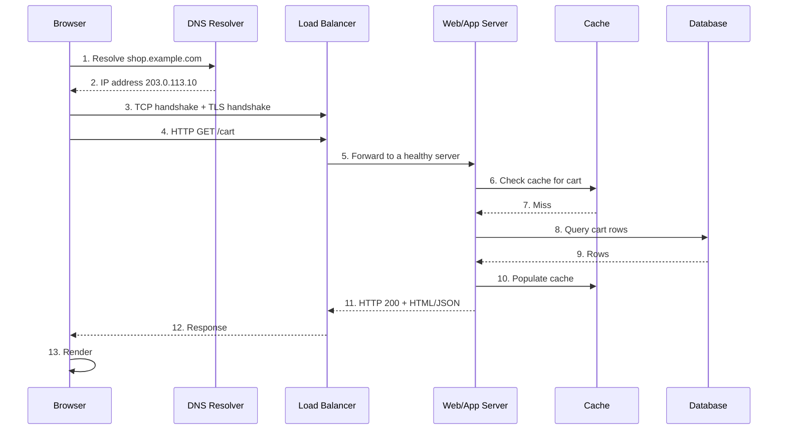
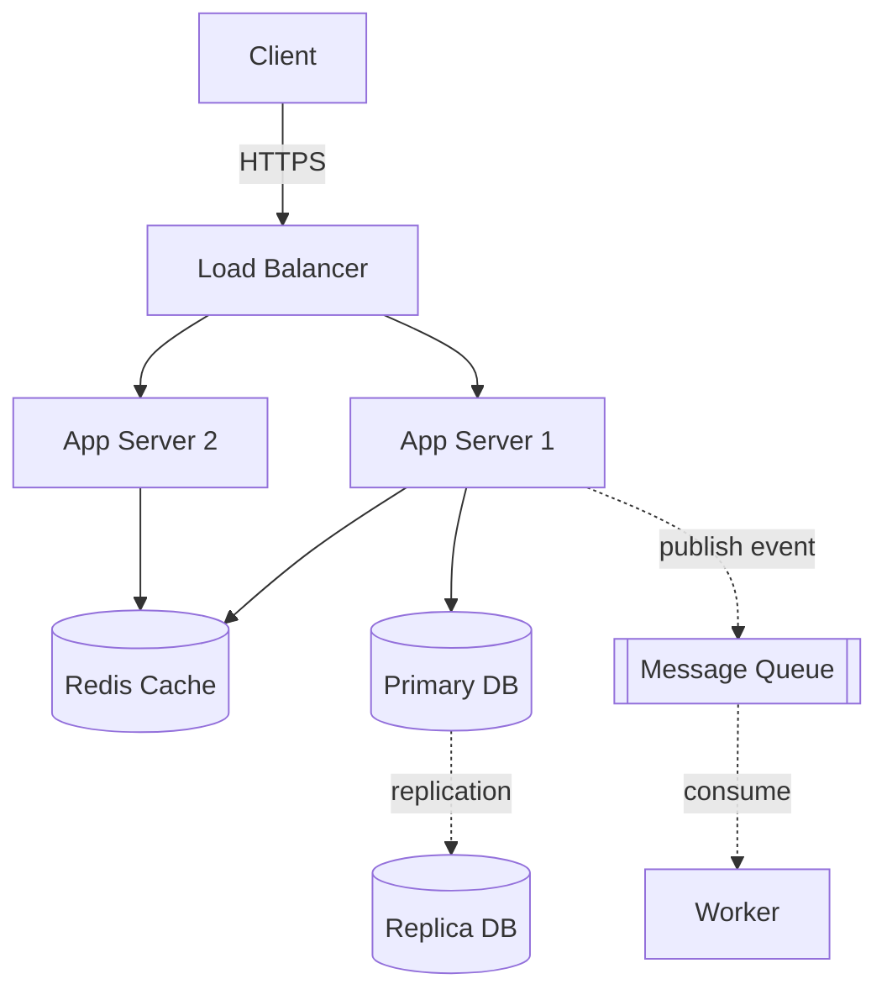

# 01 — Fundamentals: How the Web Talks, and How to Estimate It

> Prerequisites: none. This is the foundation everything else builds on.

## Introduction

Before you can design a system that serves millions of users, you need a crisp mental model of what actually happens when someone types a URL and hits Enter. This document walks the entire path — from a name like `example.com` to packets on a wire to bytes rendered on a screen — and then teaches you to do **back-of-the-envelope estimation**: the skill of quickly sizing a system (queries per second, storage, bandwidth) using a few memorized numbers and arithmetic.

The problem these fundamentals solve: **systems fail or get over/under-built when engineers don't understand the layers beneath them or can't sanity-check a design's scale.** A cache "fixes latency" only if you know where the latency was. A database "won't fit" only relative to a storage estimate. This is the literacy that makes the rest of the series meaningful.

---

## 1. The Client-Server Model

Almost every system you'll design is a variation of: **clients** make requests, **servers** fulfill them.

- **Client**: anything that initiates a request — a browser, a mobile app, a backend service, a CLI tool, an IoT sensor.
- **Server**: a process that listens for requests and returns responses.

The same machine can be both (your API server is a *client* to its database). This recursion — clients of clients of clients — is the structure of all distributed systems.

```
   ┌────────┐   request    ┌────────┐   request   ┌──────────┐
   │ Browser│ ───────────▶ │  API   │ ──────────▶ │ Database │
   │(client)│ ◀─────────── │(server │ ◀────────── │ (server) │
   └────────┘   response   │ +client)│  response  └──────────┘
                           └────────┘
```

**Peer-to-peer (P2P)** is the alternative model where nodes are both clients and servers to each other (BitTorrent, blockchains). Most business systems are client-server; we focus there.

---

## 2. The Request Lifecycle (the full journey)

What happens when you load `https://shop.example.com/cart`?



Each numbered hop has a cost (latency) and a chance of failure. Good system design is largely about **shortening this path** (caching, CDNs), **removing single points of failure** (redundancy), and **handling each failure mode** (retries, timeouts).

---

## 3. DNS — turning names into addresses

Humans use names (`example.com`); the network routes by **IP addresses** (`203.0.113.10`). **DNS (Domain Name System)** is the distributed phone book that translates between them.

**Resolution flow (recursive):**

```
Browser cache → OS cache → Recursive resolver (e.g. 8.8.8.8)
   → Root nameserver (knows .com servers)
   → TLD nameserver (.com → knows example.com's authoritative server)
   → Authoritative nameserver (returns 203.0.113.10)
```

Results are **cached** at every level according to the record's **TTL** (time-to-live, e.g. 300 s). Low TTL = faster failover/changes but more DNS traffic; high TTL = less traffic but slower to propagate changes.

**Common record types:**

| Record | Purpose | Example |
|--------|---------|---------|
| `A` | name → IPv4 | `example.com → 203.0.113.10` |
| `AAAA` | name → IPv6 | `example.com → 2001:db8::1` |
| `CNAME` | alias to another name | `www → example.com` |
| `MX` | mail servers | `→ mail.example.com` |
| `TXT` | arbitrary text (SPF, verification) | `v=spf1 ...` |
| `NS` | delegates a zone | `→ ns1.provider.com` |

DNS is also a **load-balancing and failover tool**: returning multiple A records, or geo-routing (return the nearest datacenter's IP). See `03_load_balancing.md` (GSLB).

---

## 4. IP, TCP, and UDP — moving the bytes

These live in the network stack. Think of it in layers (simplified):

```
Application   HTTP, gRPC, DNS, WebSocket        "what the message means"
Transport     TCP, UDP                          "reliable vs fast delivery"
Network       IP                                "addressing & routing"
Link          Ethernet, Wi-Fi                   "the physical hop"
```

- **IP (Internet Protocol):** addresses and routes packets between hosts. It's *best-effort*: packets may be lost, duplicated, or arrive out of order. IPv4 (32-bit, ~4.3B addresses) is exhausted; IPv6 (128-bit) is the long-term answer.

- **TCP (Transmission Control Protocol):** builds a **reliable, ordered, connection-oriented** stream on top of IP. It guarantees delivery via acknowledgments and retransmission, orders packets, and does **flow control** (don't overwhelm the receiver) and **congestion control** (don't overwhelm the network). The cost: a **3-way handshake** before data flows (SYN → SYN-ACK → ACK = one round trip).

```
Client                 Server
  | ---- SYN --------->  |
  | <--- SYN-ACK ------- |   (1 round trip before any data)
  | ---- ACK + DATA -->  |
```

- **UDP (User Datagram Protocol):** **connectionless, unreliable, no ordering** — just "fire and forget" datagrams. No handshake, minimal overhead, lower latency. Used where speed beats completeness: DNS queries, live video/voice (VoIP), gaming, and QUIC/HTTP/3.

| | TCP | UDP |
|---|-----|-----|
| Connection | Yes (handshake) | No |
| Reliability | Guaranteed delivery & order | None |
| Speed/overhead | Higher latency, more overhead | Lower latency, lean |
| Use cases | Web, APIs, file transfer, DB | DNS, streaming, gaming, QUIC |

**Takeaway:** Use TCP when correctness matters (almost all business APIs). Use UDP when occasional loss is acceptable and latency is king.

---

## 5. HTTP and HTTPS

**HTTP (HyperText Transfer Protocol)** is the request-response application protocol the web runs on. A request has a **method**, a **path**, **headers**, and an optional **body**; a response has a **status code**, headers, and a body.

### HTTP methods (verbs)

| Method | Meaning | Safe? | Idempotent? |
|--------|---------|-------|-------------|
| `GET` | Read a resource | Yes | Yes |
| `HEAD` | Like GET, headers only | Yes | Yes |
| `POST` | Create / submit (non-idempotent action) | No | No |
| `PUT` | Replace a resource fully | No | Yes |
| `PATCH` | Partial update | No | No (usually) |
| `DELETE` | Remove a resource | No | Yes |
| `OPTIONS` | Discover allowed methods (CORS preflight) | Yes | Yes |

- **Safe** = no server state change. **Idempotent** = doing it N times == doing it once. Idempotency is critical for safe retries (see `10_api_design.md`).

### Status codes

| Range | Class | Common examples |
|-------|-------|-----------------|
| 1xx | Informational | 100 Continue, 101 Switching Protocols |
| 2xx | Success | 200 OK, 201 Created, 204 No Content |
| 3xx | Redirection | 301 Moved Permanently, 304 Not Modified |
| 4xx | Client error | 400 Bad Request, 401 Unauthorized, 403 Forbidden, 404 Not Found, 429 Too Many Requests |
| 5xx | Server error | 500 Internal Error, 502 Bad Gateway, 503 Unavailable, 504 Gateway Timeout |

Memorize the bolded ones — `200/201/204`, `301/304`, `400/401/403/404/429`, `500/502/503/504` — they recur constantly in monitoring and debugging.

### HTTP versions

| Feature | HTTP/1.1 | HTTP/2 | HTTP/3 |
|---------|----------|--------|--------|
| Transport | TCP | TCP | **QUIC over UDP** |
| Multiplexing | No (1 request at a time per conn; pipelining broken) | Yes (many streams per connection) | Yes (no head-of-line blocking) |
| Header compression | None | HPACK | QPACK |
| Head-of-line blocking | At HTTP layer | Solved at HTTP, but **TCP-level HOL remains** | Solved (independent streams) |
| Connection setup | TCP handshake | TCP + TLS | Combined QUIC handshake (0-RTT possible) |
| Server push | No | Yes (now deprecated in practice) | Limited |

- **HTTP/1.1:** one request per connection at a time → browsers open ~6 parallel connections per host as a workaround.
- **HTTP/2:** multiplexes many concurrent streams over **one** TCP connection. But a single lost TCP packet stalls *all* streams (TCP head-of-line blocking).
- **HTTP/3:** runs over **QUIC** (built on UDP), giving independent streams (one lost packet only stalls its own stream) and faster handshakes. Now widely deployed.

### HTTPS and TLS

**HTTPS = HTTP over TLS.** **TLS (Transport Layer Security)** provides:

1. **Encryption** — eavesdroppers see ciphertext.
2. **Integrity** — tampering is detected.
3. **Authentication** — the server proves its identity via a certificate signed by a trusted Certificate Authority (CA).

**TLS handshake (TLS 1.3, simplified):**

```
Client → Server: ClientHello (supported ciphers, key share)
Server → Client: ServerHello + certificate + key share
Both: derive shared symmetric key (Diffie-Hellman)
→ Encrypted application data flows
```

TLS 1.3 needs **1 round trip** (TLS 1.2 needed 2). It uses **asymmetric crypto** to safely agree on a **symmetric key**, then encrypts the bulk traffic with the fast symmetric key. The certificate chain (leaf → intermediate → trusted root) is how the client trusts the server.

---

## 6. WebSockets — full-duplex, persistent connections

Plain HTTP is request-response: the client must ask before the server can speak. For **real-time, server-initiated** updates (chat, live dashboards, multiplayer games, trading tickers), polling is wasteful.

**WebSockets** start as an HTTP request with an `Upgrade: websocket` header, then "upgrade" the connection to a persistent, **bidirectional** channel over the same TCP connection. After the handshake, either side can send messages anytime with low overhead.

```
Client → Server:  GET /chat  Upgrade: websocket  (HTTP)
Server → Client:  101 Switching Protocols
=========== now a persistent full-duplex channel ===========
Server → Client:  "new message from Bob"   (no request needed)
Client → Server:  "typing..."
```

**Alternatives:** Server-Sent Events (SSE, one-way server→client over HTTP), long polling (fallback). Use WebSockets when you need true bidirectional, low-latency, high-frequency messaging.

---

## 7. REST vs RPC / gRPC

Two dominant styles for how services expose functionality (full treatment in `10_api_design.md`).

- **REST (Representational State Transfer):** model the domain as **resources** (nouns) identified by URLs, manipulated with HTTP verbs. `GET /users/42`, `POST /orders`. Typically JSON over HTTP/1.1. Human-readable, cacheable, ubiquitous.

- **RPC (Remote Procedure Call):** model the domain as **actions** (verbs/functions) you call as if local: `createUser(...)`, `chargeCard(...)`. **gRPC** is Google's modern RPC framework using **Protocol Buffers** (compact binary) over **HTTP/2**, with generated client/server stubs and streaming.

| | REST | gRPC |
|---|------|------|
| Style | Resources/nouns | Procedures/verbs |
| Payload | JSON (text) | Protobuf (binary, compact) |
| Transport | Usually HTTP/1.1 | HTTP/2 |
| Contract | OpenAPI (optional) | `.proto` (required, strongly typed) |
| Streaming | Limited | First-class (bidirectional) |
| Browser support | Native | Needs gRPC-Web proxy |
| Best for | Public APIs, broad clients | Internal microservice-to-service, low latency |

**Rule of thumb:** REST for public/external APIs and browser clients; gRPC for high-performance internal service-to-service calls. **GraphQL** is a third option (client specifies exactly which fields it wants) — covered in `10_api_design.md`.

---

## 8. Network Latency (and why it dominates)

Latency = how long one round trip takes. Throughput = how much data per second. They're different: a satellite link can have huge throughput but terrible latency.

Key facts (see the full table in `README.md`):

- Same-datacenter round trip ≈ **0.5 ms**.
- Cross-continent round trip ≈ **150 ms** — bounded by the speed of light, not improvable by faster hardware.
- A disk seek (10 ms) ≈ 20 same-DC round trips. RAM (100 ns) is ~100,000× faster than that disk seek.

**Implication:** chatty designs (many sequential round trips) are slow, especially across regions. Batch requests, cache aggressively, move computation/data closer to users (CDNs, edge), and parallelize independent calls. A page that makes 30 sequential cross-region calls *cannot* be fast (30 × 150 ms = 4.5 s) no matter how fast your code is.

---

## 9. Back-of-the-Envelope Estimation

The single most useful interview *and* real-world skill: quickly estimate **QPS, storage, and bandwidth** so you can size servers, databases, and caches. The goal is **order-of-magnitude correctness**, not precision.

### The toolkit (memorize these)

- **Seconds per day ≈ 86,400 ≈ 10^5.**
- **Powers of two:** 2^10 ≈ 1 K, 2^20 ≈ 1 M, 2^30 ≈ 1 G, 2^40 ≈ 1 T.
- **Latency anchors:** RAM 100 ns, SSD random read 100 µs, same-DC RTT 0.5 ms, disk seek 10 ms, cross-continent RTT 150 ms.
- A typical commodity server handles **~1,000s of simple QPS**; a single SSD-backed DB node, **low thousands** of simple queries/s.

### Step 1 — QPS (queries per second)

```
Average QPS = daily requests / 86,400
```

> 1 million requests/day ≈ 1,000,000 / 86,400 ≈ **12 QPS** average.

But traffic isn't flat. Apply a **peak factor** (typically 2–10×) to size for the busy hour:

```
Peak QPS ≈ Average QPS × peak_factor   (use ~2–3× as a default)
```

**Worked example — a Twitter-like feed read:**
- 300 M monthly active users, each opens the app ~5 times/day → 1.5 B reads/day.
- Average read QPS = 1.5 × 10^9 / 10^5 = **15,000 QPS**.
- Peak (×2) ≈ **30,000 QPS**. → You'll need a fleet behind a load balancer + heavy caching, not one server.

### Step 2 — Storage

```python
# Estimate yearly storage for a tweet-like product.
writes_per_day      = 50_000_000        # 50M new tweets/day
avg_bytes_per_item  = 300               # text + metadata, ~300 bytes
replication_factor  = 3                 # keep 3 copies for durability
overhead_factor     = 1.5               # indexes, formatting, slack

daily_bytes  = writes_per_day * avg_bytes_per_item
yearly_bytes = daily_bytes * 365 * replication_factor * overhead_factor

GB = 1024 ** 3
TB = 1024 ** 4
print(f"Raw/day:  {daily_bytes / GB:.1f} GB")          # ~14 GB/day raw
print(f"Per year: {yearly_bytes / TB:.2f} TB")         # ~22 TB/year stored
```

Output (approx):
```
Raw/day:  14.0 GB
Per year: 22.46 TB
```

So a text-only product is cheap to store; the cost explodes when you add **media** (images/video). Re-run with `avg_bytes_per_item = 200_000` (a 200 KB image) and you get terabytes *per day* — which is exactly why media goes to object storage + CDN (see `12_storage_cdn.md`).

### Step 3 — Bandwidth

```
Bandwidth (bytes/sec) = QPS × average response size
```

**Worked example:**
- 30,000 peak QPS, average response 2 KB.
- 30,000 × 2 KB = 60,000 KB/s ≈ **60 MB/s ≈ 480 Mbps** of egress.
- That's well within a single 1 Gbps NIC, but a 10× spike (600 MB/s) is not — plan for CDN offload and multiple egress points.

### Step 4 — Sanity-check against capacity

Compare your estimate to known limits:
- **30,000 QPS** vs ~2,000 QPS/server → need ~15–30 app servers (with headroom).
- **22 TB** vs ~2–4 TB/node comfortable → need ~6–12 DB shards (replication aside).
- **480 Mbps** vs 1 Gbps NIC → fine at average, risky at peak.

### Powers-of-two & latency tables (quick reference)

| 2^n | ≈ | Bytes name |
|-----|---|------------|
| 10 | 1 thousand | KB |
| 20 | 1 million | MB |
| 30 | 1 billion | GB |
| 40 | 1 trillion | TB |
| 50 | 1 quadrillion | PB |

| Latency anchor | Time |
|----------------|------|
| RAM read | 100 ns |
| SSD random read (4 KB) | ~150 µs |
| Same-DC round trip | ~0.5 ms |
| SSD sequential 1 MB | ~1 ms |
| Disk seek (HDD) | ~10 ms |
| Cross-continent RTT | ~150 ms |

(Full version in `README.md`.)

---

## 10. How to Read a System-Design Diagram

System diagrams are a shared visual language. Conventions you'll see everywhere:

```
┌──────────┐                        Rectangles  = services/processes
│ Service  │                        Cylinders    = datastores (DB, cache)
└──────────┘                        Arrows       = direction of a request
     │  ──────▶  solid arrow        Dashed arrow  = async / event flow
     ▼                              Double box    = a cluster/replicated set
 ╔══════════╗
 ║ DB (x3)  ║   ← replicated set
 ╚══════════╝
```



**How to read one:**
1. **Find the client and follow the arrows** in request direction — that's the hot path.
2. **Identify datastores** (cylinders) — where state lives is where consistency and scaling problems live.
3. **Spot single points of failure** — anything with no replica/peer. (Here: the Primary DB write path.)
4. **Distinguish sync (solid) from async (dashed)** — async edges are where eventual consistency and queues enter.
5. **Look for the caches and CDNs** — they tell you the read path's intended latency.
6. **Note the boundaries** — datacenter/region boxes reveal where the expensive cross-region hops are.

---

## Key Takeaways

- Every system is **clients and servers**, often recursively; design = shortening the request path, removing single points of failure, and handling each failure mode.
- The **request lifecycle** is: DNS → TCP → TLS → HTTP → app → cache/DB → response. Each hop costs latency and can fail.
- **DNS** maps names to IPs with TTL-based caching and doubles as a load-balancing/failover tool.
- **TCP** = reliable & ordered (most APIs); **UDP** = fast & lossy (DNS, streaming, QUIC).
- Know your **HTTP methods, status codes, and versions** (1.1 → 2 → 3/QUIC). **HTTPS = HTTP + TLS** for encryption, integrity, and authentication.
- **WebSockets** for real-time bidirectional; **REST** for public/broad APIs; **gRPC** for fast internal service-to-service.
- **Latency is often the budget**: same-DC ≈ 0.5 ms, cross-continent ≈ 150 ms (speed-of-light bound). Avoid chatty/sequential cross-region calls.
- **Back-of-the-envelope estimation**: QPS = daily/86,400 (×peak factor); storage = items × size × replication × overhead; bandwidth = QPS × response size. Then sanity-check against ~2k QPS/server and ~TB/node.
- Read diagrams by following arrows from the client, locating state, and hunting single points of failure.
