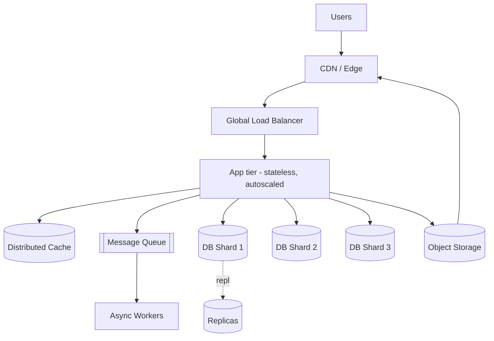

# 02 — Scalability: Growing From One Server to Millions of Users

> Prerequisites: `01_fundamentals.md` (request lifecycle, estimation).

## Introduction

**Scalability** is a system's ability to handle growing load — more users, more requests, more data — by adding resources, ideally without redesigning everything. A system "scales" if doubling its resources roughly doubles the work it can do (or at least increases it meaningfully) without a collapse in latency or reliability.

**The problem it solves:** a design that works for 100 users often falls over at 100,000. A single server has a hard ceiling — CPU, RAM, disk I/O, network, and connection limits. When you hit it, requests queue, latency spikes, and the system tips over. Scalability is the discipline of *anticipating* and *engineering past* those ceilings.

This document covers the two ways to scale, the stateless/stateful distinction that makes horizontal scaling possible, how sessions are handled, why reads and writes scale differently, the canonical evolution from one box to a distributed system, and how to plan capacity.

---

## 1. Two Ways to Scale: Vertical vs Horizontal

```
   VERTICAL (scale up)              HORIZONTAL (scale out)
   ┌───────────────┐               ┌────┐ ┌────┐ ┌────┐ ┌────┐
   │   one big     │     vs        │srv │ │srv │ │srv │ │srv │
   │   server      │               └────┘ └────┘ └────┘ └────┘
   │  (more CPU,   │                  ▲       ▲ behind a load balancer
   │   RAM, disk)  │
   └───────────────┘
```

- **Vertical scaling (scale up):** make one machine more powerful — more CPU cores, RAM, faster disks. Simple, no code changes, no distributed-systems complexity. But there's a **hard physical ceiling** (the biggest available instance), cost grows non-linearly, and the machine remains a **single point of failure**.

- **Horizontal scaling (scale out):** add more machines and spread load across them (via a load balancer — see `03_load_balancing.md`). Near-limitless ceiling, built-in redundancy (one node dying isn't fatal), and cheaper commodity hardware. The cost: you now have a **distributed system** — load balancing, state coordination, consistency, partial failure (see `14_distributed_systems.md`).

| Dimension | Vertical (scale up) | Horizontal (scale out) |
|-----------|--------------------|------------------------|
| How | Bigger machine | More machines |
| Ceiling | Hard (biggest instance) | Effectively unlimited |
| Complexity | Low | High (distributed) |
| Fault tolerance | Poor (SPOF) | Good (redundant) |
| Cost curve | Steep at the top | Linear-ish, commodity |
| Typical use | Databases (initially), quick wins | Stateless app tiers, web servers |

**Practical reality:** most systems do both — scale individual nodes up to a sweet spot, then scale out. Stateless web/app tiers love horizontal scaling; databases are often scaled up first (easier) before the harder work of sharding (see `06_replication_sharding.md`).

---

## 2. Stateless vs Stateful Services (the key to scaling out)

This distinction is *the* enabler of horizontal scaling.

- **Stateless service:** holds no client-specific data between requests. Every request carries everything needed to process it. Any server can handle any request — so you can add/remove servers freely and route requests to whichever is least busy.

- **Stateful service:** keeps client/session data in its own memory or local disk. A given client *must* return to the *same* server (or data is lost), which complicates load balancing, failover, and scaling.

```
STATELESS                              STATEFUL
request → [any server] → DB            request → [server that has my session]
(server holds nothing)                 (server holds my data in memory)
add/remove servers freely              must route me back to the same box
```

**Design principle:** push state *out* of the application servers into shared, purpose-built stores — a database, a distributed cache (Redis), or object storage. Make the app tier stateless. Then the app tier scales trivially by cloning.

---

## 3. Session Handling

A classic source of accidental statefulness is the **user session** (login state, shopping cart, preferences). Three approaches:

### a) Sticky sessions (session affinity)
The load balancer pins each user to one server (by cookie or IP hash). Simple, but it *reintroduces* statefulness: that server is now a SPOF for those users, and load can become uneven. Use sparingly. (See `03_load_balancing.md`.)

### b) Centralized session store (recommended)
Store sessions in a fast shared store (Redis/Memcached). App servers stay stateless; any server reads the session by ID from the cookie.

```python
# Stateless app server: session lives in shared Redis, not local memory.
import redis, json
r = redis.Redis(host="session-cache", port=6379)

def get_session(session_id: str) -> dict:
    raw = r.get(f"sess:{session_id}")
    return json.loads(raw) if raw else {}

def save_session(session_id: str, data: dict, ttl=1800):
    r.setex(f"sess:{session_id}", ttl, json.dumps(data))
```

### c) Client-side tokens (stateless sessions)
Encode session data in a signed token (JWT) stored in the client's cookie. The server verifies the signature — no server-side lookup needed. Scales beautifully, but tokens can't be easily revoked before expiry and shouldn't hold large/sensitive data. (See `17_security.md`.)

| Approach | Server state | Scales out? | Failover | Notes |
|----------|-------------|-------------|----------|-------|
| Sticky sessions | Yes (local) | Awkward | Bad (lose session) | Simplest, avoid at scale |
| Central store | Yes (shared) | Great | Good | Most common; needs a fast cache |
| Client token (JWT) | None | Excellent | Excellent | Revocation & size caveats |

---

## 4. Scaling Reads vs Writes (they're not the same)

Most systems are **read-heavy** (often 90%+ reads). Reads and writes scale by different mechanisms:

**Scaling reads:**
- **Caching** at every layer (CDN, app, DB) — serve from memory, never touch the DB (`04_caching.md`).
- **Read replicas** — copies of the DB that serve read queries; the leader handles writes (`06_replication_sharding.md`). Add replicas to add read capacity.
- **CDNs** for static/cacheable content close to users (`12_storage_cdn.md`).

**Scaling writes (harder):**
- **Sharding/partitioning** — split data across nodes so each handles a slice of writes (`06_replication_sharding.md`, `08_consistent_hashing.md`).
- **Write batching / async ingestion** — buffer writes through a queue/log (Kafka) and apply them downstream (`09_messaging_streaming.md`).
- **Choosing a write-optimized store** — LSM-tree databases (Cassandra) absorb high write volume better than B-tree stores for some workloads.

```
READS                                    WRITES
add replicas / caches / CDN  (easy)      shard by key / queue + batch  (hard)
        ▲                                        ▲
  leader → replica → replica            shard A   shard B   shard C
```

**Why writes are harder:** every copy of the data must eventually agree. More write throughput means more coordination, which fights consistency (see CAP, `07_cap_consistency.md`). Reads can be served from any stale-but-close copy; writes can't.

---

## 5. The Evolution: Single Server → Distributed System

A typical product grows through recognizable stages. Each stage solves the previous bottleneck.

### Stage 0 — Everything on one box
Web server + app + database on a single machine.
```
[ Browser ] → [ one server: web + app + DB ]
```
Fine for an MVP. Bottleneck: any spike, and CPU/DB contention kills it; one crash = total outage.

### Stage 1 — Split the tiers
Separate the database onto its own machine so the app and DB don't fight for resources.
```
[ Browser ] → [ App Server ] → [ DB Server ]
```

### Stage 2 — Add a load balancer + clone the app tier
Make the app stateless, run multiple copies behind a load balancer.
```
              ┌→ [ App 1 ] ┐
[ Browser ] → LB           ├→ [ DB ]
              └→ [ App 2 ] ┘
```

### Stage 3 — Add caching and read replicas
Cache hot reads in Redis; offload reads to DB replicas.
```
              ┌→ [ App 1 ] ┐   ┌→ [ Cache (Redis) ]
[ Browser ] → LB           ├──▶│
              └→ [ App N ] ┘   ├→ [ DB Primary ] ──repl──▶ [ Replicas ]
```

### Stage 4 — CDN, object storage, and message queues
Static assets & media to CDN/object store; decouple slow work via queues + workers.

### Stage 5 — Shard the database, go multi-region
Partition data across shards; replicate across regions for latency and disaster recovery.



**Key insight:** you rarely jump straight to Stage 5. Premature distribution adds complexity and bugs. **Scale to the next stage when measurements show you need it** — not before.

---

## 6. A Note on Scalability Limits — Amdahl & the serial bottleneck

Adding servers doesn't help if a **shared, serial component** is the bottleneck. **Amdahl's Law** captures this: if a fraction `s` of the work is inherently serial (can't be parallelized), your maximum speedup is capped at `1/s` no matter how many machines you add.

> If 10% of every request must hit a single, un-shardable database lock, you can never go more than 10× faster — buying 1,000 servers won't break that ceiling.

**Implication:** to scale, you must attack the serial bottlenecks — the shared DB write path, a global lock, a single coordinator. This is why sharding, caching, and async processing matter so much.

---

## 7. Capacity Planning

Capacity planning answers: **"How many of each resource do I need, now and in N months?"** It combines estimation (`01_fundamentals.md`) with measured per-node capacity and a growth model.

### The method

1. **Measure unit capacity.** Load-test one node: how many QPS before latency (e.g., p99) exceeds your target? Suppose **2,000 QPS/app server** and **3,000 simple reads/s per DB replica**.
2. **Estimate demand.** From traffic: peak ≈ 30,000 QPS (worked in `01_fundamentals.md`).
3. **Divide and add headroom.** Never plan to run at 100% — target ~60–70% utilization so you survive spikes and failures.

```python
peak_qps          = 30_000
qps_per_server    = 2_000
target_utilization = 0.65          # leave 35% headroom

import math
needed = math.ceil(peak_qps / (qps_per_server * target_utilization))
print(f"App servers needed: {needed}")   # ceil(30000 / 1300) = 24
```

4. **Apply the N+M redundancy rule.** Add enough spare nodes to survive failures (e.g., N+2: tolerate 2 node losses, and one Availability Zone going down). If you need 24 to serve traffic, run them spread across ≥3 zones so losing a zone (8 nodes) still leaves you above demand.
5. **Project growth.** If traffic grows 8%/month, in 12 months it's ~2.5× (1.08^12). Plan the data tier for that, since resharding is painful.
6. **Autoscale the stateless tiers.** Set autoscaling on the app tier to track demand automatically (scale on CPU or request rate); keep stateful tiers (DBs) provisioned more conservatively.

### Quick reference: per-node rough capacities (order of magnitude)

| Component | Rough capacity (simple workload) |
|-----------|----------------------------------|
| App server (stateless) | ~1,000s of QPS |
| Redis/Memcached node | ~100,000+ ops/s (in-memory) |
| SQL DB node (reads) | low thousands of queries/s |
| SQL DB node (writes) | hundreds–low thousands/s |
| 1 Gbps NIC | ~125 MB/s egress |

Treat these as starting points; *always measure your actual workload.*

---

## When to Use / Trade-offs

| Situation | Reach for |
|-----------|-----------|
| Quick win, low complexity, modest load | **Vertical scaling** first |
| Read-heavy, latency-sensitive | **Caching + read replicas + CDN** |
| Write-heavy, data outgrows one node | **Sharding** (accept the complexity) |
| Spiky/unpredictable traffic, stateless tier | **Horizontal autoscaling** |
| Bursty slow work (emails, video encode) | **Async queue + workers** |
| Sessions across many servers | **Central session store or JWT**, not sticky |

**Core trade-off:** horizontal scaling buys near-unlimited capacity and fault tolerance at the price of distributed-systems complexity (consistency, coordination, partial failure). Don't pay that price until measurements justify it. **Make services stateless wherever possible** — that one decision unlocks almost everything else.

---

## Key Takeaways

- **Vertical** = bigger box (simple, capped, SPOF). **Horizontal** = more boxes (unlimited-ish, redundant, complex). Most real systems combine both.
- **Stateless services are the foundation of horizontal scaling** — push state into shared stores (DB, Redis, object storage) so any server can serve any request.
- Handle **sessions** with a central store or signed tokens (JWT); avoid sticky sessions at scale.
- **Reads scale easily** (caches, replicas, CDN); **writes scale hard** (sharding, queues) because copies must agree.
- Systems evolve **single box → split tiers → LB + clones → cache + replicas → CDN + queues → shards + multi-region.** Advance a stage only when measurements demand it.
- **Amdahl's Law:** a single serial bottleneck caps your speedup — find and eliminate shared serial components.
- **Capacity planning** = measured unit capacity ÷ estimated peak demand, plus headroom (60–70% target), N+M redundancy across zones, and a growth projection. Autoscale stateless tiers.
