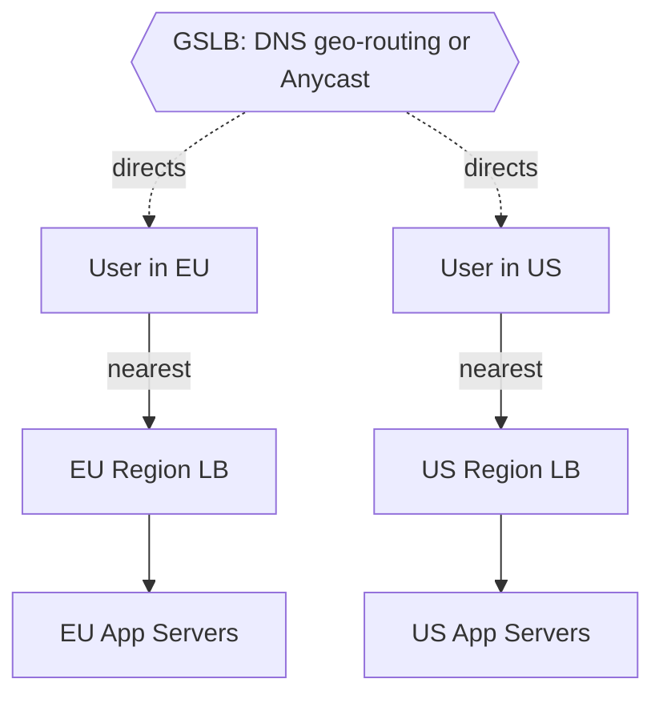

# 03 — Load Balancing: Spreading Traffic Without Falling Over

> Prerequisites: `01_fundamentals.md` (TCP/HTTP, request lifecycle), `02_scalability.md` (horizontal scaling, statelessness).

## Introduction

A **load balancer (LB)** sits between clients and a pool of backend servers and distributes incoming requests across them. It's the component that makes horizontal scaling actually work: clients talk to one stable address, and the LB decides which of N interchangeable servers handles each request.

**The problem it solves:** once you scale out to multiple servers (`02_scalability.md`), three new problems appear — (1) how do clients find a server? (2) how do you spread load *evenly* so no server is overwhelmed while others idle? (3) what happens when a server dies mid-traffic? A load balancer answers all three: a single entry point, even distribution, and automatic removal of unhealthy servers.

```
                    ┌──────────┐
                    │  Server 1│  ✓ healthy
   clients ──▶ ┌───┐│  Server 2│  ✓ healthy
   clients ──▶ │ LB│  Server 3│  ✗ unhealthy (removed)
   clients ──▶ └───┘│  Server 4│  ✓ healthy
                    └──────────┘
```

Beyond distribution, LBs provide **high availability** (route around failures), enable **zero-downtime deploys** (drain one server at a time), and often add **TLS termination, compression, and request routing**.

---

## 1. What a Load Balancer Does

- **Distributes** requests across healthy backends by some algorithm.
- **Health-checks** backends and stops sending traffic to failed ones.
- **Terminates TLS** (decrypts HTTPS once at the edge, freeing backends from crypto cost).
- **Routes** (L7) based on path/host/headers (e.g., `/api/*` → API pool, `/static/*` → static pool).
- **Provides a stable virtual IP / DNS name** so backends can change freely behind it.
- Enables **graceful operations**: draining connections from a server before taking it down for a deploy.

---

## 2. Layer 4 vs Layer 7 Load Balancing

LBs operate at different layers of the network stack (see `01_fundamentals.md`).

- **Layer 4 (L4) — transport level (TCP/UDP):** the LB sees IPs, ports, and packets — *not* the contents. It forwards connections based on connection-level info. Very fast, low overhead, protocol-agnostic. But it can't make decisions based on the URL, cookies, or HTTP headers.

- **Layer 7 (L7) — application level (HTTP/HTTPS):** the LB understands HTTP. It can route by path/host/header, terminate TLS, rewrite requests, do sticky sessions by cookie, and inspect content. More CPU per request, but far more flexible. This is what most web systems use.

```
L4 LB                                   L7 LB
sees: src/dst IP + port                 sees: full HTTP request
"send this TCP connection               "GET /api/orders with cookie X →
 to backend #3"                          route to the orders service, pin
                                         to the same backend"
```

| Feature | L4 (transport) | L7 (application) |
|---------|----------------|------------------|
| Inspects | IP + port | HTTP method/path/host/headers/cookies |
| Speed | Faster, lighter | Slightly heavier (parses HTTP) |
| Routing | Connection-level | Content-based (path/host) |
| TLS termination | No (passthrough) | Yes |
| Sticky sessions | By IP only | By cookie |
| Examples | AWS NLB, IPVS, HAProxy (TCP mode) | AWS ALB, NGINX, HAProxy (HTTP mode), Envoy |

**Rule of thumb:** L7 for web/API traffic (you want content routing + TLS + cookies). L4 for raw TCP/UDP services, extreme throughput, or non-HTTP protocols.

---

## 3. Load-Balancing Algorithms

How does the LB pick which backend gets the next request?

| Algorithm | How it works | Best when | Caveat |
|-----------|-------------|-----------|--------|
| **Round-robin** | Cycle through servers in order: 1,2,3,1,2,3 | Backends roughly equal, requests uniform | Ignores actual load |
| **Weighted round-robin** | Bigger servers get more turns (weights) | Heterogeneous server sizes | Static weights, not adaptive |
| **Least connections** | Send to the server with fewest active connections | Variable request durations | Slight tracking overhead |
| **Weighted least connections** | Least-connections, scaled by capacity | Mixed sizes + variable durations | More complex |
| **IP hash** | `hash(client_ip) % N` → same client → same server | Cheap session affinity | Reshuffles badly when N changes; uneven if IPs skewed |
| **Consistent hashing** | Hash onto a ring; minimal reshuffle when servers change | Caches/sharded backends, affinity at scale | More complex (see `08_consistent_hashing.md`) |
| **Least response time** | Pick fastest-responding backend | Latency-sensitive | Needs live latency tracking |
| **Random (+ two choices)** | Pick 2 at random, send to the less loaded | Simple, surprisingly even | — |

**"Power of two choices"** deserves a mention: picking two servers at random and choosing the less loaded one gives nearly as good balance as checking *all* servers, at a fraction of the cost. Widely used in practice.

```python
# Tiny illustration of three strategies (single-process, conceptual).
import itertools, hashlib

servers = ["s1", "s2", "s3"]

# Round-robin
rr = itertools.cycle(servers)
def round_robin():
    return next(rr)

# Least connections
active = {s: 0 for s in servers}
def least_connections():
    return min(active, key=active.get)

# IP hash (sticky-ish)
def ip_hash(client_ip: str):
    h = int(hashlib.md5(client_ip.encode()).hexdigest(), 16)
    return servers[h % len(servers)]
```

**Note:** `hash(ip) % N` is fragile — when `N` changes (a server is added/removed), almost every client remaps to a different server, wrecking cache locality and sessions. **Consistent hashing** (`08_consistent_hashing.md`) fixes exactly this.

---

## 4. Health Checks

An LB must know which backends are alive. Two kinds:

- **Active health checks:** the LB periodically probes each backend (e.g., `GET /healthz` every 5 s). If it fails K consecutive times, mark unhealthy and stop routing to it; when it passes again, restore it.
- **Passive health checks:** the LB watches real traffic — if a backend returns errors/timeouts, eject it.

A good `/healthz` endpoint should be **lightweight** and reflect *real* readiness (can it reach its DB/dependencies?), distinguishing:
- **Liveness** — "is the process alive?" (restart if not)
- **Readiness** — "can it serve traffic *right now*?" (route around if not, e.g., during warmup or when a dependency is down)

```nginx
# NGINX (with health_check, available in NGINX Plus / open-source 'ngx_http_upstream' passive)
upstream app_pool {
    server 10.0.0.11:8080 max_fails=3 fail_timeout=15s;
    server 10.0.0.12:8080 max_fails=3 fail_timeout=15s;
}
# After 3 failures within 15s, NGINX stops sending to that server for 15s (passive check).
```

---

## 5. Sticky Sessions (Session Affinity)

**Sticky sessions** pin a client to a specific backend so requests in a session keep hitting the server that holds their state. Implemented by L7 LBs via a cookie, or by L4 via IP hash.

**The trade-off:** stickiness reintroduces statefulness (see `02_scalability.md`). It can cause uneven load, and if the sticky server dies, those users lose their session. **Prefer stateless servers with a shared session store (Redis) or JWTs**, and use stickiness only when you truly can't (e.g., legacy in-memory session apps, or to improve local cache hit rates).

```nginx
upstream app_pool {
    ip_hash;                       # affinity by client IP (L4-style stickiness)
    server 10.0.0.11:8080;
    server 10.0.0.12:8080;
}
# Or, L7 cookie-based affinity (NGINX Plus):  sticky cookie srv_id expires=1h;
```

---

## 6. Global Server Load Balancing (GSLB) & Anycast

Everything above balances within one datacenter. **GSLB** balances across **multiple datacenters/regions**, primarily for **latency** (serve users from the nearest region) and **disaster recovery** (fail over to another region if one goes down).

Two main mechanisms:

- **DNS-based GSLB:** the authoritative DNS server returns different IPs based on the client's location/health (geo-routing). Simple and widely used, but limited by DNS caching/TTL — failover is only as fast as the TTL.

- **Anycast:** the *same* IP address is announced from multiple locations via BGP routing. The network itself routes each client to the topologically nearest site. Fast failover (routing reconverges automatically), used heavily by CDNs and DNS providers.



GSLB picks the *region*; the regional LB picks the *server*. See `12_storage_cdn.md` for how CDNs use anycast at the edge.

---

## 7. Load Balancer High Availability (don't make the LB a SPOF)

If all traffic flows through one LB, that LB is a **single point of failure** — the very thing LBs exist to eliminate. So LBs themselves are deployed redundantly:

- **Active-passive pair:** two LBs share a **virtual IP (VIP)**. The active one serves; the passive one takes over the VIP (via a protocol like VRRP/keepalived) if the active fails.
- **Active-active:** multiple LBs serve simultaneously, fronted by DNS round-robin or anycast.
- **Managed cloud LBs** (AWS ALB/NLB, GCP LB) are themselves horizontally scaled and HA by design — you don't manage the redundancy.

```
            ┌─────────┐
            │ VIP     │  (floats between the two)
   clients ─┤         ├─ active LB  ──▶ backends
            │         │     │ heartbeat
            └─────────┤     ▼
                      └─ passive LB (takes VIP if active dies)
```

---

## 8. Hardware vs Software Load Balancers

| Type | Examples | Pros | Cons |
|------|----------|------|------|
| **Hardware** | F5 BIG-IP, Citrix ADC | Extreme throughput, purpose-built | Expensive, less flexible, scaling = buy more boxes |
| **Software** | NGINX, HAProxy, Envoy | Cheap, flexible, runs anywhere, scriptable | Tied to commodity hardware limits |
| **Cloud/managed** | AWS ALB/NLB, GCP LB, Azure LB | HA + autoscaling handled for you, pay-as-you-go | Vendor lock-in, less low-level control |

Modern systems overwhelmingly use **software/cloud** LBs. NGINX and HAProxy are the workhorses; **Envoy** powers most service meshes (`11_microservices.md`).

### A small NGINX config (L7, round-robin, TLS termination, health-aware)

```nginx
http {
    upstream app_pool {
        least_conn;                                   # algorithm
        server 10.0.0.11:8080 max_fails=3 fail_timeout=15s;
        server 10.0.0.12:8080 max_fails=3 fail_timeout=15s;
        server 10.0.0.13:8080 max_fails=3 fail_timeout=15s;
    }

    server {
        listen 443 ssl;
        server_name shop.example.com;

        ssl_certificate     /etc/ssl/shop.crt;        # TLS terminated here
        ssl_certificate_key /etc/ssl/shop.key;

        location /api/ {                               # L7 content routing
            proxy_pass http://app_pool;
            proxy_set_header Host $host;
            proxy_set_header X-Forwarded-For $remote_addr;
            proxy_connect_timeout 2s;
            proxy_next_upstream error timeout http_502; # retry next server on failure
        }

        location /healthz { return 200 "ok"; }         # LB's own liveness
    }
}
```

This single config shows: an algorithm (`least_conn`), a backend pool, passive health checks (`max_fails`), TLS termination, L7 path routing (`/api/`), per-request timeouts, and automatic retry to the next upstream on failure.

---

## When to Use / Trade-offs

- **Always** put a load balancer in front of any horizontally scaled tier — it's how you get even distribution, failover, and zero-downtime deploys.
- **L7** for HTTP/API traffic (routing, TLS, cookies); **L4** for raw TCP/UDP or extreme throughput.
- **Round-robin** is a fine default; switch to **least-connections** when request durations vary; use **consistent hashing** for caches/affinity at scale.
- **Avoid sticky sessions** unless forced — prefer stateless servers + shared session store.
- **Never let the LB be a SPOF** — run it active-passive/active-active or use a managed cloud LB.
- Use **GSLB/anycast** when you operate in multiple regions for latency and DR.

**Trade-offs:** L7 features cost CPU; stickiness costs even distribution; DNS-based GSLB costs failover speed (TTL-bound); managed LBs cost flexibility/lock-in. Pick the simplest option that meets your routing, latency, and HA requirements.

---

## Key Takeaways

- A **load balancer** is the entry point that makes horizontal scaling real: one stable address, even distribution, automatic failover.
- **L4** balances connections (fast, content-blind); **L7** balances HTTP (routes by path/host/cookie, terminates TLS). Web systems usually want L7.
- Pick an **algorithm** for your workload: round-robin (default), weighted (mixed sizes), least-connections (variable durations), consistent hashing (caches/affinity). Avoid plain `hash % N`.
- **Health checks** (active + passive) keep traffic off dead/unready backends; distinguish liveness from readiness.
- **Sticky sessions** trade even load for affinity — prefer stateless + shared session store.
- Scale across regions with **GSLB (DNS geo-routing) or anycast** for latency and disaster recovery.
- **Make the LB itself HA** (active-passive VIP, active-active, or managed cloud LB) — don't recreate a single point of failure.
- **NGINX/HAProxy/Envoy** (software) and cloud LBs dominate today; hardware LBs are niche.
