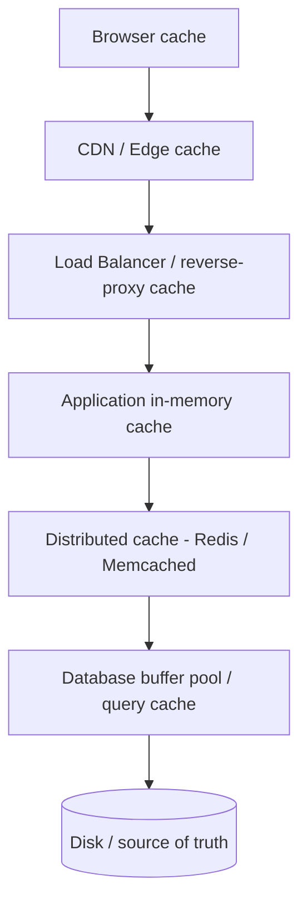

# 04 — Caching: Trading Memory for Speed

> Prerequisites: `01_fundamentals.md` (latency numbers), `02_scalability.md` (scaling reads), `03_load_balancing.md` (the request path).

## Introduction

A **cache** is a small, fast store that holds copies of data that's expensive to fetch or compute, so future requests can be served quickly. Caching is arguably the single highest-leverage performance technique in system design: it turns a 10 ms database query or a 150 ms cross-region call into a sub-millisecond memory lookup.

**The problem it solves:** recall the latency numbers (`01_fundamentals.md`) — RAM is ~100,000× faster than a disk seek, and the same data is often requested over and over (the **80/20 rule**: ~80% of requests hit ~20% of the data). Recomputing or re-fetching the *same* hot data on every request wastes time and overloads the backend. A cache stores the result of expensive work and reuses it.

```
WITHOUT CACHE                          WITH CACHE
request ─▶ DB query (10 ms) ─▶ result  request ─▶ cache hit (0.5 ms) ─▶ result
            (every time)                          (most of the time)
```

The payoff is huge, but caching introduces *the* hardest problem in computer science: **invalidation** — keeping the cached copy from going stale.

---

## 1. Cache Hits, Misses, and Hit Ratio

- **Cache hit:** requested data is in the cache → fast.
- **Cache miss:** not in the cache → fetch from the source (slow), then (usually) store it for next time.
- **Hit ratio** = hits / (hits + misses). This is *the* metric of a cache. A 95% hit ratio means only 1 in 20 requests touches the slow backend.

**Effective latency** is a weighted average:

```
avg_latency = hit_ratio × cache_latency + (1 − hit_ratio) × backend_latency
```

> With cache=0.5 ms, backend=10 ms: at 95% hit ratio, avg ≈ 0.95×0.5 + 0.05×10 = **0.975 ms**. At 50% hit ratio, avg ≈ **5.25 ms**. A few points of hit ratio matter enormously — and they're driven by cache size, eviction policy, and TTL.

---

## 2. Where Caching Happens — the Layers

Caching exists at *every* layer of the stack. Each layer that hits avoids all the layers below it.



| Layer | Example | Caches | Latency | Notes |
|-------|---------|--------|---------|-------|
| **Client** | Browser cache, HTTP `Cache-Control` | Static assets, API responses | ~0 ms | Controlled via headers/ETags |
| **CDN / edge** | Cloudflare, CloudFront | Images, JS/CSS, cacheable HTML | ~10–50 ms | Closest to users (`12_storage_cdn.md`) |
| **Reverse proxy** | NGINX/Varnish cache | Whole HTTP responses | ~1 ms | At the LB edge |
| **Application** | In-process LRU dict | Computed objects | <0.1 ms | Fastest, but per-instance (not shared) |
| **Distributed** | Redis, Memcached | Sessions, query results, objects | ~0.5–1 ms | Shared across all app servers |
| **Database** | Buffer pool, materialized views | Hot pages, precomputed results | ~1 ms | Built into the DB engine |

**Application (local) vs distributed cache trade-off:** a local in-process cache is fastest but each server has its own copy (cache duplication, inconsistency, cold on restart). A distributed cache (Redis) is shared (consistent, survives app restarts) but adds a network hop. Many systems use **both** (a small local cache in front of a shared Redis).

---

## 3. Caching Patterns (read & write strategies)

How does data get *into* and stay correct *in* the cache? These patterns differ in who manages the cache and when.

### Cache-aside (lazy loading) — the most common

The application manages the cache. On read: check cache; on miss, load from DB and populate the cache. On write: update the DB and **invalidate** (or update) the cache entry.

```
READ:  app → cache?  hit→return
                      miss→ DB → store in cache → return
WRITE: app → DB → delete/invalidate cache key
```

Pros: only requested data is cached (memory-efficient); cache failures don't break reads (just slower). Cons: first request always misses (cold start); risk of staleness if invalidation is missed; a brief race window where a stale value can be re-cached.

### Read-through

The cache itself sits in front of the DB and loads on miss transparently (the app only talks to the cache). Same effect as cache-aside, but the loading logic lives in the cache layer/library, not the app.

### Write-through

On write, the app writes to the cache, and the cache **synchronously** writes to the DB. Cache and DB are always consistent; reads are always warm. Cost: every write pays the cache + DB latency, and you cache data that may never be read.

### Write-back (write-behind)

On write, update the cache and acknowledge immediately; the cache **asynchronously** flushes to the DB later (batched). Very fast writes, great for write-heavy/bursty workloads. Risk: **data loss** if the cache dies before flushing — needs durability (e.g., Redis AOF) or replication.

### Write-around

Writes go straight to the DB, **bypassing** the cache; the cache is populated only on subsequent reads (via cache-aside). Good when written data is rarely re-read soon (avoids polluting the cache with cold writes). Cost: a read right after a write is a miss.

| Pattern | Write path | Read freshness | Best for | Main risk |
|---------|-----------|----------------|----------|-----------|
| **Cache-aside** | DB, then invalidate | First read misses | General read-heavy (default) | Stale on missed invalidation |
| **Read-through** | (cache loads on miss) | First read misses | Simpler app code | Same as cache-aside |
| **Write-through** | Cache + DB (sync) | Always fresh & warm | Read-after-write needs | Slow writes |
| **Write-back** | Cache now, DB later | Fast writes | Write-heavy/bursty | Data loss on cache failure |
| **Write-around** | DB only | Read-after-write misses | Write-once-read-rarely | Cold reads after writes |

---

## 4. Eviction Policies (the cache is full — what goes?)

A cache has limited memory. When full, an **eviction policy** decides what to evict.

| Policy | Evicts | Good when | Weakness |
|--------|--------|-----------|----------|
| **LRU** (Least Recently Used) | The entry not touched for longest | Recency predicts reuse (most workloads) | Hurt by big sequential scans |
| **LFU** (Least Frequently Used) | The entry accessed fewest times | Some keys are persistently hot | Old-but-once-popular keys linger; needs aging |
| **FIFO** (First In First Out) | Oldest inserted, regardless of use | Simple, fair-ish | Ignores access patterns |
| **TTL** (Time To Live) | Anything older than its expiry | Data has a natural freshness window | Not size-based by itself |
| **Random** | A random entry | Cheap, avoids pathological cases | Unpredictable |

**TTL is usually combined with another policy:** set a TTL so entries can't be infinitely stale *and* run LRU/LFU to bound memory. Redis's default eviction (`allkeys-lru`) plus per-key `EXPIRE` is a typical real-world combo. LRU is the sensible default for most caches; consider LFU (e.g., Redis `allkeys-lfu`) when a stable set of keys is hot over long periods.

---

## 5. Cache Invalidation — the hard problem

> "There are only two hard things in Computer Science: cache invalidation and naming things." — Phil Karlton

The source of truth changes; the cached copy must not lie. Strategies:

1. **TTL expiry (passive):** let entries expire after N seconds. Simple, self-healing, bounds staleness — but you serve stale data for up to the TTL, and a flood of simultaneous expiries can stampede the backend.
2. **Write invalidation (active):** on every write, delete (or update) the affected cache keys. Fresh, but you must correctly identify *every* key affected by a write — easy to miss, especially for derived/aggregated data.
3. **Write-through:** keep cache and DB in lockstep on write (see above) — no staleness, slower writes.
4. **Versioned keys:** include a version/timestamp in the key (`user:42:v7`). A write bumps the version, so old entries are simply never read again (and age out). Avoids races, costs key churn.
5. **Event-driven invalidation:** publish change events (e.g., via a message bus or DB change-data-capture) so all caches invalidate the right keys. Scales to many caches but adds infrastructure (`09_messaging_streaming.md`).

**Why it's hard:** correctness requires knowing *exactly* which cached entries a given write affects — including indirect ones (a user's name change might invalidate every cached page that displays it). **Prefer short TTLs as a safety net** even when you do active invalidation, so a missed invalidation self-corrects.

---

## 6. Thundering Herd / Cache Stampede

When a **hot key** expires (or the cache restarts cold), *many* concurrent requests all miss at once and hammer the backend simultaneously — potentially knocking it over. This is the **thundering herd** (a.k.a. cache stampede / dogpile).

```
hot key expires
        │
   1000 requests miss at the same instant
        │
        ▼
   all 1000 hit the database  ← backend overload / cascading failure
```

**Mitigations:**

- **Locking / request coalescing (single-flight):** the first miss takes a lock and recomputes; concurrent requests wait for that single result instead of all recomputing.
- **Early/probabilistic recomputation:** refresh a value *before* it expires (e.g., when it's 90% through its TTL, with jitter) so it never all-expires under load.
- **Stale-while-revalidate:** serve the slightly stale value immediately while one background task refreshes it.
- **TTL jitter:** add randomness to TTLs so a batch of keys created together don't all expire on the same tick.
- **Negative caching:** cache "not found" results too, so a flood of requests for a missing key doesn't repeatedly hit the DB.

```python
# Single-flight: only one caller recomputes a key; others wait for the result.
import threading

class SingleFlight:
    def __init__(self):
        self._locks = {}
        self._guard = threading.Lock()

    def do(self, key, loader):
        with self._guard:
            lock = self._locks.setdefault(key, threading.Lock())
        with lock:                       # only one thread computes per key
            return loader()
```

---

## 7. Redis vs Memcached

The two dominant distributed caches.

| Feature | **Redis** | **Memcached** |
|---------|-----------|---------------|
| Data model | Rich: strings, hashes, lists, sets, sorted sets, streams, bitmaps, HLL | Simple key→value (opaque blobs) |
| Persistence | Optional (RDB snapshots, AOF log) | None (pure cache) |
| Replication / HA | Yes (replicas, Sentinel, Cluster) | Not built-in |
| Sharding | Built-in (Redis Cluster) | Client-side |
| Threading | Mostly single-threaded core (very fast) | Multi-threaded |
| Extra features | Pub/sub, Lua scripts, transactions, TTL, geo, atomic ops | Just caching |
| Best for | When you need structures, persistence, or HA | Pure, simple, high-throughput caching |

**Rule of thumb:** default to **Redis** — its data structures, persistence, and HA make it more versatile. Choose **Memcached** for the narrow case of a simple, multi-threaded, very-high-throughput object cache where you want nothing but key→value. Redis can also double as a session store, rate limiter (`19_rate_limiting.md`), and leaderboard (sorted sets).

---

## 8. Distributed Caching

When one cache node isn't enough (memory or throughput), spread the cache across many nodes. The problem: **which node holds which key?**

- **Naive (`hash(key) % N`):** distributes keys, but adding/removing a node remaps *almost all* keys → mass cache misses → backend stampede. Bad for elastic clusters.
- **Consistent hashing:** maps keys onto a ring; adding/removing a node only moves ~1/N of keys. This is the standard for distributed caches and is covered fully in `08_consistent_hashing.md`.

Other concerns: **replication** (so a node failure doesn't lose its slice or cause a stampede), **client-side vs proxy-based sharding**, and keeping a small **local (L1) cache** in front of the distributed (L2) cache to cut network hops on the hottest keys.

```
              ┌─ Redis node A (keys on ring segment 1)
client ─ ring ┼─ Redis node B (segment 2)
   hashes key └─ Redis node C (segment 3)
```

---

## 9. Worked Example: Cache-Aside with an LRU Cache (Python)

A self-contained implementation showing **cache-aside reads**, **LRU eviction**, **TTL expiry**, and **write invalidation**.

```python
import time
from collections import OrderedDict

class LRUCache:
    """In-process LRU cache with per-entry TTL."""
    def __init__(self, capacity: int):
        self.capacity = capacity
        self.store: "OrderedDict[str, tuple]" = OrderedDict()  # key -> (value, expires_at)

    def get(self, key):
        item = self.store.get(key)
        if item is None:
            return None                       # miss
        value, expires_at = item
        if expires_at is not None and time.time() > expires_at:
            del self.store[key]               # expired -> treat as miss
            return None
        self.store.move_to_end(key)           # mark most-recently-used
        return value

    def set(self, key, value, ttl=None):
        expires_at = time.time() + ttl if ttl else None
        if key in self.store:
            self.store.move_to_end(key)
        self.store[key] = (value, expires_at)
        if len(self.store) > self.capacity:
            self.store.popitem(last=False)    # evict least-recently-used

    def invalidate(self, key):
        self.store.pop(key, None)


# ---- A fake slow backend (stand-in for a database) ----
def db_read_user(user_id):
    time.sleep(0.01)                          # simulate a 10 ms query
    return {"id": user_id, "name": f"User{user_id}"}

def db_write_user(user_id, name):
    time.sleep(0.01)
    # ... UPDATE users SET name = name WHERE id = user_id ...
    return {"id": user_id, "name": name}


cache = LRUCache(capacity=1000)

# ---- CACHE-ASIDE READ ----
def get_user(user_id):
    key = f"user:{user_id}"
    cached = cache.get(key)
    if cached is not None:
        return cached                         # HIT
    user = db_read_user(user_id)              # MISS -> load from DB
    cache.set(key, user, ttl=300)             # populate (with TTL safety net)
    return user

# ---- WRITE WITH INVALIDATION ----
def update_user(user_id, name):
    user = db_write_user(user_id, name)       # source of truth first
    cache.invalidate(f"user:{user_id}")       # then invalidate the stale copy
    return user


# ---- Demo ----
if __name__ == "__main__":
    t0 = time.time(); get_user(42); print(f"miss took {(time.time()-t0)*1000:.1f} ms")  # ~10 ms
    t0 = time.time(); get_user(42); print(f"hit  took {(time.time()-t0)*1000:.3f} ms")  # ~0 ms
    update_user(42, "Renamed")                # invalidates cache
    t0 = time.time(); get_user(42); print(f"miss took {(time.time()-t0)*1000:.1f} ms")  # ~10 ms again
```

Typical output:
```
miss took 10.3 ms
hit  took 0.004 ms
miss took 10.2 ms
```

This demonstrates the full loop: a cold miss hits the DB, the warm hit is ~2,500× faster, and a write correctly invalidates so the next read re-fetches fresh data. Note the **TTL of 300 s acts as a safety net** in case an invalidation is ever missed. (Python's standard library also offers `functools.lru_cache` for pure-function memoization, but it has no TTL or invalidation — fine for deterministic computations, not for data that changes.)

---

## When to Use / Trade-offs

**Cache when:**
- Reads vastly outnumber writes, and the same data is re-requested (high temporal locality).
- The backend operation is expensive (slow query, heavy computation, remote call).
- Slightly stale data is acceptable for some bounded TTL.

**Be cautious / avoid when:**
- Data must always be perfectly fresh (strong consistency) — caching adds staleness windows.
- Writes dominate and data is rarely re-read — the cache mostly churns (consider write-around or no cache).
- Per-user data is huge and rarely reused — low hit ratio means the cache pays its cost without the benefit.

**Core trade-offs:** caching trades **memory and consistency for latency and backend load**. More cache = higher hit ratio but more staleness risk and memory cost. Every cache decision is really three decisions: *what to cache, for how long (TTL), and how to invalidate.* Always pair active invalidation with a TTL safety net, and protect hot keys against stampedes.

---

## Key Takeaways

- A cache trades memory for speed; the metric that matters is the **hit ratio** — a few points swing average latency dramatically.
- Caching happens at **every layer** (browser → CDN → proxy → app → distributed cache → DB); a hit at one layer skips all below it. Local caches are fastest; distributed caches (Redis) are shared.
- Choose a **pattern**: cache-aside (default), read-through, write-through (always fresh, slow writes), write-back (fast writes, loss risk), write-around (skip cold writes).
- Pick an **eviction policy** (LRU is the usual default; LFU for stable hot sets) and almost always add a **TTL**.
- **Invalidation is the hard part** — combine active invalidation with short TTLs as a safety net; consider versioned keys or event-driven invalidation.
- Defend hot keys against the **thundering herd** with single-flight locks, early refresh, stale-while-revalidate, and TTL jitter.
- **Redis** is the versatile default (structures, persistence, HA); **Memcached** for pure simple high-throughput caching.
- Scale a distributed cache with **consistent hashing** (`08_consistent_hashing.md`), not `hash % N`.
