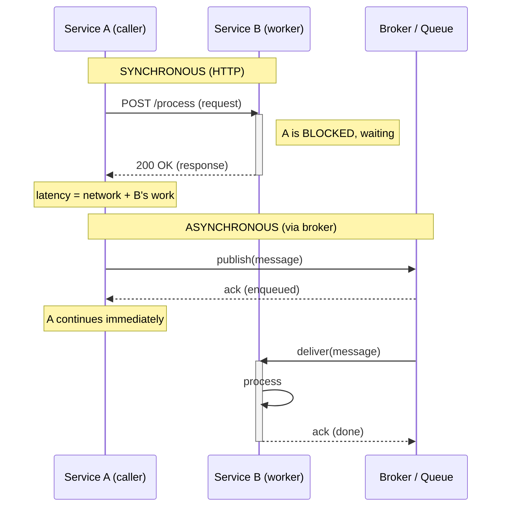
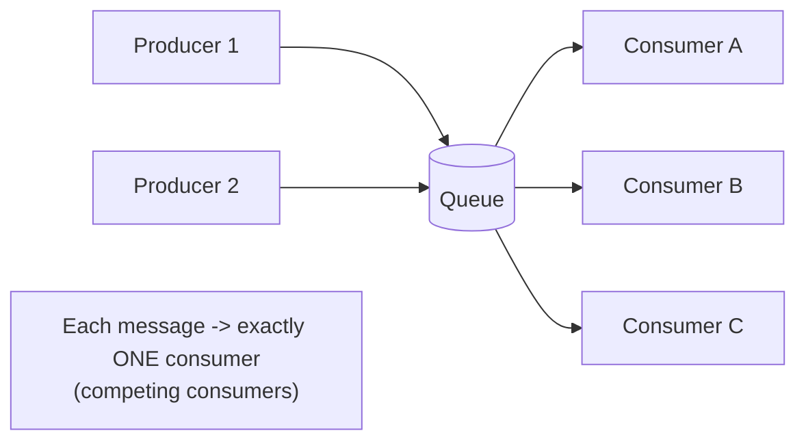
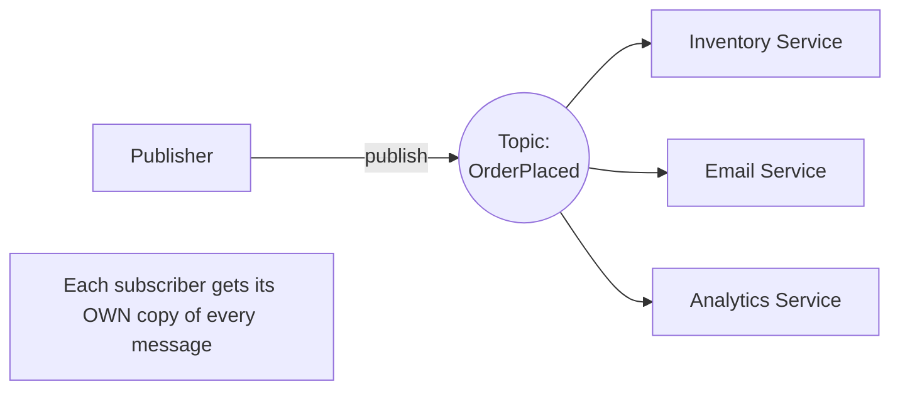
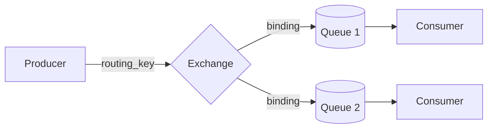
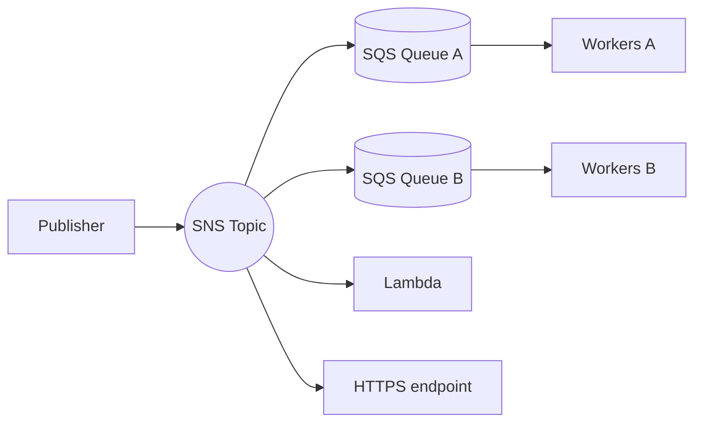
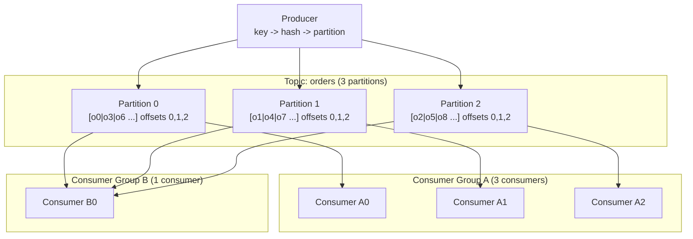
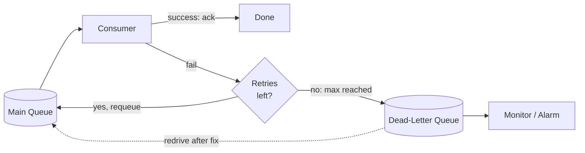

# Messaging & Streaming

Messaging and streaming systems let services communicate **asynchronously** by passing messages through an intermediary instead of calling each other directly. They form the backbone of resilient, scalable distributed systems by decoupling who produces work from who consumes it, smoothing out load spikes, and enabling event-driven architectures. This document covers message queues, publish/subscribe, brokers like RabbitMQ/SQS/SNS, and event streaming with Apache Kafka.

---

## The Problem It Solves

In a naive distributed system, Service A calls Service B directly over the network (e.g., an HTTP request). This tightly couples the two services in several dimensions, and messaging breaks each one:

- **Temporal coupling** — With a direct call, B must be alive and reachable *at the exact moment* A calls it. If B is down, restarting, or overloaded, A's request fails. A message broker stores the message durably, so A can produce even when B is offline; B processes it later. Producer and consumer no longer need to run at the same time.
- **Spatial coupling** — A direct call requires A to know *where* B lives (host, port, address) and how many instances exist. With a broker, A sends to a logical destination (a queue or topic); it does not know or care which consumer instance picks it up, or how many there are.
- **Synchronization coupling** — In a synchronous call, A *blocks* waiting for B to finish. If B is slow, A is slow. Messaging lets A "fire and forget": hand the message to the broker and move on immediately. A's latency is no longer tied to B's processing time.

Additional problems messaging solves:

- **Load leveling (buffering)** — A burst of 10,000 requests/sec can be absorbed into a queue and drained by consumers at a steady 1,000/sec, protecting downstream systems from being overwhelmed. The queue acts as a shock absorber.
- **Work distribution** — Many consumer instances can pull from the same queue, parallelizing work and scaling horizontally.
- **Fan-out** — One event can be delivered to many independent subscribers, each doing something different (email, analytics, audit log) without the producer knowing about any of them.
- **Resilience & retries** — If a consumer crashes mid-processing, the message can be redelivered rather than lost.

---

## Synchronous vs Asynchronous Communication

**Synchronous (request/response):** The caller sends a request and *waits* (blocks) for the response before continuing. Classic example: an HTTP REST call or a gRPC unary call. The caller's thread is occupied until the callee replies or times out. The caller's latency = network + callee's processing time.

**Asynchronous (fire-and-forget / event-driven):** The caller sends a message to a broker and continues immediately without waiting for the work to be done. A response, if any, comes back later through a separate channel (a callback, a reply queue, or a follow-up event). The caller's latency is just the time to enqueue.

A subtle but important distinction:

- **Blocking vs non-blocking** is about whether the *calling thread* waits. You can do synchronous request/response in a non-blocking way (async/await, futures) — the semantics are still "I need the answer to proceed," but the thread is freed to do other work.
- **Sync vs async communication** is about the *interaction pattern* — whether the caller's logic depends on an immediate response.

**Latency coupling:** In synchronous chains, latencies add up. If A → B → C synchronously and C is slow, A is slow too. A slow dependency anywhere in the chain degrades the whole request. Asynchronous messaging breaks this coupling — A is done the moment it enqueues.

**Failure propagation:** Synchronous calls propagate failures upward immediately (B's 500 becomes A's problem right now), which can cascade into outages without protection (see `19_rate_limiting.md` and circuit breakers). Asynchronous messaging isolates failures — if a consumer fails, the message stays in the queue and is retried; the producer is unaffected.

| Aspect | Synchronous | Asynchronous (via broker) |
|---|---|---|
| Interaction | Request → wait → response | Send → continue (response later, if any) |
| Caller latency | Network + callee processing | Time to enqueue only |
| Coupling | Temporal + spatial + sync | Decoupled in all three |
| Failure handling | Propagates immediately, can cascade | Isolated; retried via broker |
| Load spikes | Overwhelms downstream | Absorbed by the queue |
| Complexity | Simpler mental model | More moving parts (broker, retries, ordering) |
| Result delivery | Immediate, inline | Eventual; needs callback/polling/event |
| Best for | Reads needing fresh data, RPC | Background jobs, events, decoupling |

### Sequence diagram: synchronous vs asynchronous



---

## Message Queues (Point-to-Point)

A **message queue** implements point-to-point delivery: a producer puts a message on a queue, and **exactly one** consumer receives and processes it. Even if there are many consumers attached to the queue, each individual message goes to only one of them.

**Competing consumers pattern:** Multiple consumer instances subscribe to the same queue and "compete" to grab the next available message. The broker hands each message to one free consumer. This is how you scale throughput: add more consumers, and the broker spreads work across them automatically. It also provides load balancing and fault tolerance — if one consumer is busy or dies, others keep draining the queue.

**Work distribution & load leveling:** Queues are ideal for distributing background jobs (resize image, send email, generate report). Producers can enqueue work faster than any single consumer can handle; the queue buffers it and consumers drain at their own pace, protecting them from spikes.



ASCII view of competing consumers:

```
                         +-----------+      grab next free
 Producer ---> [m5 m4 m3 m2 m1] ---> | Consumer A | <- gets m1
                  Queue (FIFO-ish)    +-----------+
                                      | Consumer B | <- gets m2
                                      +-----------+
                                      | Consumer C | <- gets m3
                                      +-----------+
   Each message is delivered to exactly one consumer.
```

Key properties:
- One message → one consumer (no duplication across consumers).
- Order is typically FIFO *per queue*, but with multiple competing consumers, processing order is not guaranteed (consumer B might finish m2 before A finishes m1).
- Once acknowledged, the message is removed from the queue.

---

## Publish/Subscribe (Pub/Sub)

In **publish/subscribe**, a producer (publisher) sends a message to a **topic**, and the broker delivers a copy to **every** subscriber interested in that topic. This is fan-out: one message → many consumers, each receiving its own copy.

This is fundamentally different from a queue. With a queue, three consumers split the workload (each message handled once). With pub/sub, three subscribers each get *all* the messages and react independently.

**Use cases:** An `OrderPlaced` event published once can trigger the inventory service (decrement stock), the email service (send confirmation), and the analytics service (record the sale) — all independently, none aware of the others.



ASCII fan-out:

```
                          +--> Subscriber 1 (Inventory)   gets copy
 Publisher --> [Topic] ---+--> Subscriber 2 (Email)       gets copy
                          +--> Subscriber 3 (Analytics)   gets copy

   One published message -> a copy delivered to EVERY subscriber.
```

### Point-to-point vs Pub/Sub

| Aspect | Point-to-Point (Queue) | Publish/Subscribe (Topic) |
|---|---|---|
| Delivery | One message → one consumer | One message → all subscribers |
| Pattern | Competing consumers | Fan-out |
| Purpose | Distribute/parallelize work | Broadcast events |
| Coupling | Producer unaware of consumer count | Producer unaware of subscriber count |
| Adding consumers | Increases throughput (splits load) | Each gets a full copy |
| Typical tech | SQS, RabbitMQ queue | SNS, RabbitMQ fanout exchange, Kafka topic |

Note: many systems blur the line. Kafka, for example, gives queue-like behavior *within* a consumer group and pub/sub-like behavior *across* consumer groups (see Kafka section).

---

## Message Brokers

A **message broker** is the middleware that receives, stores, routes, and delivers messages. Below are three widely used systems.

### RabbitMQ (AMQP)

RabbitMQ implements the **AMQP 0-9-1** protocol. Its core insight: producers do **not** publish directly to queues — they publish to an **exchange**, and the exchange routes messages to queues based on **bindings** and a **routing key**.

- **Exchange** — the routing component. Producers publish here.
- **Queue** — buffers messages until a consumer reads them.
- **Binding** — a rule linking an exchange to a queue (often with a binding/routing key pattern).
- **Routing key** — a string the producer attaches to each message, used by the exchange to decide routing.

**Exchange types:**

| Exchange type | Routing behavior |
|---|---|
| `direct` | Route to queues whose binding key *exactly* matches the message's routing key. |
| `topic` | Route by pattern matching on dotted routing keys. `*` matches one word, `#` matches zero+ words. E.g. binding `logs.*.error` matches `logs.auth.error`. |
| `fanout` | Ignore routing key; broadcast to *all* bound queues (pub/sub). |
| `headers` | Route based on message header attributes instead of routing key. |

**Acknowledgements (acks):** A consumer sends an `ack` after successfully processing a message; only then does RabbitMQ delete it. If the consumer dies before acking, RabbitMQ requeues the message for another consumer. With *manual acks* (recommended), you ack after the work succeeds — giving at-least-once delivery. *Auto-ack* acks on delivery (before processing), giving at-most-once.

**Prefetch (QoS):** `prefetch_count` (basic.qos) limits how many unacknowledged messages a consumer can hold at once. Setting `prefetch=1` means "don't give me a new message until I've acked the current one" — this prevents a fast-but-overloaded consumer from hoarding messages and gives true round-robin load balancing. Higher prefetch improves throughput but can unbalance load.



### AWS SQS (Simple Queue Service)

A fully managed, highly scalable queue (point-to-point).

- **Standard queues** — nearly unlimited throughput, **at-least-once** delivery (occasional duplicates), **best-effort ordering** (not strictly FIFO).
- **FIFO queues** — strict ordering and **exactly-once processing** within the queue, but lower throughput (limited TPS, raisable with batching/high-throughput mode). Use a `MessageGroupId` to order related messages and a `MessageDeduplicationId` to suppress duplicates.
- **Visibility timeout** — when a consumer receives a message, it becomes *invisible* to other consumers for a configured duration. The consumer processes it and then deletes it. If it fails to delete before the timeout expires (crash, slow processing), the message becomes visible again and is redelivered. This is how SQS achieves reliability without long-held locks. Tuning this is critical: too short → duplicate processing; too long → slow recovery from crashes.
- **Long polling** — `WaitTimeSeconds` lets a `ReceiveMessage` call wait for messages to arrive, reducing empty responses and cost.

### AWS SNS (Simple Notification Service)

A fully managed **pub/sub** service. Publishers send to a **topic**; SNS fans out to subscribers.

- Subscribers can be **SQS queues**, **Lambda functions**, **HTTP/S endpoints**, email, or SMS.
- The classic **"fan-out" pattern**: SNS topic → multiple SQS queues. SNS broadcasts; each SQS queue durably buffers a copy for its own consumer group. This combines pub/sub (SNS) with durable, independent processing (SQS).
- **Message filtering** — subscriptions can attach filter policies so a subscriber only receives messages matching certain attributes.



### Broker comparison

| Feature | RabbitMQ | SQS / SNS | Apache Kafka |
|---|---|---|---|
| Model | Queue + exchanges (AMQP) | SQS = queue, SNS = pub/sub | Distributed commit log |
| Primary use | Flexible routing, task queues | Managed queue/fan-out on AWS | High-throughput event streaming |
| Consumption | Push (broker pushes) | Pull (poll) | Pull (poll), offset-based |
| Message retention | Until acked/deleted | Until deleted (max 14 days) | Time/size-based; can keep for days/forever |
| Replay | No (consumed = gone) | No | Yes — reset offset and re-read |
| Ordering | Per-queue FIFO | FIFO queues only | Per-partition |
| Throughput | High | Very high (managed) | Very high (millions/sec) |
| Ops burden | Self-managed (or hosted) | Zero (fully managed) | High (cluster, partitions) |
| Routing | Rich (direct/topic/fanout/headers) | Basic + SNS filtering | Partition key |

---

## Event Streaming with Apache Kafka

Kafka is not a traditional queue — it is a **distributed, replicated, append-only commit log**. Messages (called **records** or **events**) are appended to the end of a log and retained for a configured period, regardless of whether they have been consumed. Consumers track their own position; the broker doesn't delete messages when they're read.

**Core concepts:**

- **Topic** — a named stream of records (e.g., `orders`, `clicks`). Logically a category of events.
- **Partition** — each topic is split into one or more partitions. A partition is an ordered, immutable, append-only sequence of records. Partitions are the unit of **parallelism** and **ordering**. A topic's partitions can live on different brokers, distributing load.
- **Offset** — each record in a partition gets a monotonically increasing integer ID called its offset. Offsets are unique *within a partition*. Consumers commit offsets to mark how far they've read.
- **Consumer group** — a set of consumer instances sharing a `group.id`. Kafka assigns each partition to *exactly one* consumer in the group, so partitions are distributed across consumers for parallelism. Different consumer groups read the *same* topic independently (each maintains its own offsets) — this is how Kafka does pub/sub.
- **Replication** — each partition has a leader and N-1 follower replicas (`replication.factor`) on different brokers. Producers and consumers talk to the leader; followers stay in sync (the **ISR**, in-sync replicas). If the leader fails, a follower is promoted — providing fault tolerance and durability.
- **Log retention** — records are kept for `retention.ms` (e.g., 7 days) or until `retention.bytes`, then deleted. Independent of consumption.
- **Log compaction** — an alternative to time-based retention: Kafka keeps *at least the latest* record for each key, discarding older records with the same key. Useful for changelog/state topics where you only care about the current value per key.

**Ordering guarantee:** Kafka guarantees order **only within a partition**, not across partitions. Records in partition 0 are strictly ordered by offset; there is no global order across all partitions of a topic.

**Partition key → partition assignment:** When producing, you may supply a **key**. Kafka hashes the key (`hash(key) % numPartitions`) to choose the partition. This means **all records with the same key go to the same partition**, and therefore are processed in order relative to each other. With no key, records are distributed round-robin (no per-key ordering).

This creates a fundamental tension:
- **Ordering** requires related events share a key (and thus a partition).
- **Parallelism** requires spreading work across many partitions/consumers.
- A single partition is consumed by a single consumer in a group, so the number of partitions caps the parallelism of a consumer group. Choose your key and partition count to balance ordering needs against throughput. Example: key by `customer_id` to order each customer's events while parallelizing across customers.



In the diagram: Group A has one consumer per partition (max parallelism). Group B reads the *same* data independently with a single consumer handling all three partitions. Each group commits its own offsets, so they can be at completely different positions in the log.

ASCII of a single partition (the commit log):

```
Partition 0:  append --> [ e0 | e1 | e2 | e3 | e4 | e5 ] --> (new writes go here)
offset:          0    1    2    3    4    5
                                  ^                 ^
                          Group B at offset 2   Group A at offset 5
                          (lag = 3)             (caught up)
```

---

## Delivery Semantics

When you send a message, how many times might the consumer actually process it? Three guarantees:

- **At-most-once** — each message is delivered zero or one time. No retries on failure; if processing fails or the consumer crashes, the message is lost. Achieved by acknowledging *before* processing (or auto-ack). Lowest overhead, but data loss is possible. Acceptable for high-volume, low-value data (e.g., metrics samples).

- **At-least-once** — each message is delivered one or more times; never lost, but **duplicates are possible**. Achieved by acknowledging/committing the offset *after* processing succeeds. If the consumer crashes after processing but before acking, the message is redelivered → duplicate. This is the most common default (SQS standard, RabbitMQ manual ack, Kafka with commit-after-process).

- **Exactly-once** — each message takes effect once and only once. The hardest to achieve and often misunderstood — true end-to-end exactly-once across arbitrary systems is generally impossible, but it can be approximated within a closed system.

**Idempotency — making at-least-once safe:** Since exactly-once is hard, the pragmatic approach is to design consumers to be **idempotent** — processing the same message twice has the same effect as processing it once. Techniques:
- Use a unique message/business ID and track processed IDs (dedupe table / cache).
- Use idempotent operations (e.g., `SET balance = 100` instead of `balance += 10`; upserts instead of inserts).
- Conditional writes / optimistic concurrency (only apply if not already applied).

This turns "at-least-once + idempotent consumer" into *effectively* exactly-once, which is what most production systems actually do.

**Kafka idempotent producer & transactions:**
- **Idempotent producer** (`enable.idempotence=true`) — Kafka assigns each producer a PID and sequence numbers, so retries that re-send the same record don't create duplicates *in the log*. Prevents producer-side duplicates.
- **Transactions** — a producer can write to multiple partitions/topics and commit offsets atomically. Combined with `isolation.level=read_committed` on the consumer, this enables **exactly-once semantics (EOS)** for the common Kafka read-process-write pattern (consume → transform → produce). Often called "effectively-once."

| Semantic | Duplicates? | Loss? | How achieved | Use when |
|---|---|---|---|---|
| At-most-once | No | Possible | Ack/commit *before* processing | Loss tolerable, throughput matters |
| At-least-once | Possible | No | Ack/commit *after* processing | Default; pair with idempotency |
| Exactly-once | No | No | Kafka transactions / dedup + idempotent ops | Financial/critical, within a system |

---

## Dead-Letter Queues (DLQ)

A **dead-letter queue** is a separate queue where messages are sent when they cannot be processed successfully. It prevents a single bad message from blocking the queue forever or being silently lost.

**When a message goes to the DLQ:**
- **Max retries exceeded** — the message failed processing N times (e.g., SQS `maxReceiveCount` on a redrive policy; RabbitMQ via rejected/nacked messages and a dead-letter exchange).
- **Poison messages** — malformed or un-processable messages that will *always* fail (bad schema, missing field, code bug). Without a DLQ these cause infinite retry loops, wasting resources and blocking progress.
- **TTL expiry** — a message that sat in the queue longer than its time-to-live.
- **Queue length limit** — overflow messages may be dead-lettered.

**Redrive:** Once the underlying issue is fixed (deploy a fix, correct the data), you can **redrive** messages from the DLQ back to the source queue for reprocessing. SQS has a built-in redrive feature; with RabbitMQ you republish from the DLQ.

**Monitoring:** A growing DLQ is a critical alert — it means messages are failing. Always monitor DLQ depth and the age of the oldest message, and alarm on non-zero / growth. Inspect DLQ contents to diagnose the root cause.



---

## Backpressure & Flow Control

**Backpressure** is the mechanism by which a system signals "slow down — I can't keep up." It arises when producers generate work faster than consumers can process it. Without flow control, the queue grows unbounded, memory fills, and the system eventually fails.

**Consumer lag** is the key metric: how far behind consumers are. In Kafka, lag = (latest offset in partition) − (consumer's committed offset). Rising lag means consumers can't keep pace; it must be watched and alarmed on.

**Strategies for handling backpressure:**

- **Buffering** — let the queue absorb bursts (load leveling). Works for *temporary* spikes, but a buffer is not a solution for sustained overload — it just delays the problem and adds latency. Bound your buffers.
- **Throttling / rate limiting** — slow the producers down, or cap intake. The consumer (or a coordinator) signals producers to reduce their rate. See `19_rate_limiting.md`.
- **Scaling consumers** — add more consumer instances (competing consumers / more partitions in Kafka, up to the partition count) to increase drain rate.
- **Prefetch / bounded in-flight limits** — RabbitMQ `prefetch_count` and similar caps limit how many unacked messages a consumer holds, preventing it from being overwhelmed and providing natural backpressure.
- **Pull-based (poll) consumption** — Kafka and SQS are **pull** models: consumers fetch when they're ready, so they inherently can't be overwhelmed by a faster producer — they simply fetch slower, and lag (not memory) grows. This is a major advantage over push-based delivery where a fast producer can swamp a slow consumer. (RabbitMQ uses push, mitigated by prefetch.)
- **Dropping / sampling / load shedding** — when data is lossy-tolerant (metrics, telemetry), drop or sample messages under overload rather than fall over. Better to lose some non-critical data than crash.

Push vs pull is the crux: **pull-based** systems give the consumer control over its intake rate (built-in backpressure); **push-based** systems need explicit flow control (prefetch, credits, acks) to avoid overwhelming consumers.

---

## Queues vs Streams: When to Use Which

Both move messages, but they have different consumption models and guarantees. The decision usually comes down to: do you need to *replay* history and have *multiple independent consumers*, or are you *distributing discrete units of work*?

| Dimension | Queue (SQS, RabbitMQ) | Stream (Kafka, Kinesis) |
|---|---|---|
| Mental model | A to-do list of tasks | An append-only event log |
| Consumption | Message removed when acked | Read by offset; data stays |
| Replay | No — consumed = gone | Yes — reset offset, re-read history |
| Retention | Until processed (then deleted) | Time/size-based (days, forever) |
| Consumers per message | One (competing consumers) | Many independent groups, each full copy |
| Ordering | Per-queue (FIFO option) | Per-partition |
| Model | Push or pull | Pull (offset-based) |
| Ack model | Ack/delete per message | Commit offset (position) |
| Throughput | High | Very high |
| Scaling unit | Consumers | Partitions |

**Use a QUEUE when:**
- You have discrete **tasks/jobs** to process once (resize image, send email, charge card).
- You want **competing consumers** to split a workload.
- **RPC-style** async work where one worker handles each request.
- You need load leveling for background processing.
- You don't need to replay or have multiple independent readers.

**Use a STREAM when:**
- You're doing **event sourcing** or need an immutable audit log.
- You need to **replay** events (reprocess after a bug fix, bootstrap a new service, recompute analytics).
- You have **multiple independent consumers** each needing all events (analytics + search index + notifications from one event stream).
- You need **very high throughput** of events.
- You want to retain history and let new consumers read from the beginning.

A useful heuristic: *"Will more than one team/service want to read this, possibly in the future, possibly from the past?"* → stream. *"Is this a unit of work to be done once?"* → queue. (Note: SNS→SQS fan-out can also give independent consumers without Kafka, but without replay.)

---

## Code Example

### Kafka producer + consumer (Python, `confluent-kafka`)

```python
# pip install confluent-kafka
# Producer: publishes order events, keyed by customer_id so each
# customer's events land on the same partition (preserving per-customer order).
from confluent_kafka import Producer
import json

producer = Producer({
    "bootstrap.servers": "localhost:9092",
    "enable.idempotence": True,   # no producer-side duplicates on retry
    "acks": "all",                 # wait for all in-sync replicas (durability)
})

def delivery_report(err, msg):
    if err is not None:
        print(f"Delivery failed: {err}")
    else:
        print(f"Delivered to {msg.topic()} [partition {msg.partition()}] @ offset {msg.offset()}")

orders = [("cust-42", {"order_id": 1001, "amount": 59.99}),
          ("cust-7",  {"order_id": 1002, "amount": 12.50})]

for customer_id, order in orders:
    producer.produce(
        topic="orders",
        key=customer_id.encode("utf-8"),          # key -> partition assignment
        value=json.dumps(order).encode("utf-8"),
        callback=delivery_report,
    )

producer.flush()  # block until all messages are delivered
```

```python
# Consumer: part of a consumer group. Kafka assigns partitions across
# all members of "order-processors". Commit offset AFTER processing
# (at-least-once); make handle_order idempotent to stay safe on redelivery.
from confluent_kafka import Consumer
import json

consumer = Consumer({
    "bootstrap.servers": "localhost:9092",
    "group.id": "order-processors",      # consumer group id
    "auto.offset.reset": "earliest",     # new group starts at the log's beginning
    "enable.auto.commit": False,         # we commit manually after success
})

consumer.subscribe(["orders"])

def handle_order(order):
    # Idempotent: upsert by order_id so reprocessing a duplicate is harmless.
    print(f"Processing order {order['order_id']} amount {order['amount']}")

try:
    while True:
        msg = consumer.poll(timeout=1.0)   # PULL model: fetch when ready (backpressure-friendly)
        if msg is None:
            continue
        if msg.error():
            print(f"Consumer error: {msg.error()}")
            continue
        order = json.loads(msg.value().decode("utf-8"))
        handle_order(order)
        consumer.commit(msg)               # commit offset only after success
finally:
    consumer.close()
```

### RabbitMQ producer + consumer (Python, `pika`)

```python
# pip install pika
# Producer: publish a durable task to a durable queue.
import pika, json

conn = pika.BlockingConnection(pika.ConnectionParameters("localhost"))
channel = conn.channel()
channel.queue_declare(queue="tasks", durable=True)  # survive broker restart

channel.basic_publish(
    exchange="",                 # default exchange -> routes by queue name
    routing_key="tasks",
    body=json.dumps({"task": "resize", "image_id": 77}),
    properties=pika.BasicProperties(delivery_mode=2),  # persistent message
)
print("Task enqueued")
conn.close()
```

```python
# Consumer: competing consumer with manual ack (at-least-once).
import pika, json

conn = pika.BlockingConnection(pika.ConnectionParameters("localhost"))
channel = conn.channel()
channel.queue_declare(queue="tasks", durable=True)
channel.basic_qos(prefetch_count=1)  # one unacked message at a time -> fair dispatch + backpressure

def on_message(ch, method, properties, body):
    task = json.loads(body)
    print(f"Working on {task}")
    # ... do the work (idempotently) ...
    ch.basic_ack(delivery_tag=method.delivery_tag)  # ack AFTER success

channel.basic_consume(queue="tasks", on_message_callback=on_message)
print("Waiting for tasks...")
channel.start_consuming()
```

### Config snippet: Kafka consumer group

```properties
# Consumer group configuration
group.id=order-processors
# Where a brand-new group (no committed offset) starts:
#   earliest = from the beginning of the log (reprocess all history)
#   latest   = only new messages from now on
auto.offset.reset=earliest
enable.auto.commit=false          # commit manually after processing succeeds
isolation.level=read_committed    # only read records from committed transactions
max.poll.records=500              # max records returned per poll() (tune backpressure)
session.timeout.ms=10000          # group coordinator marks consumer dead after this
```

---

## Trade-offs

- **Operational complexity** — Adding a broker means another stateful system to deploy, monitor, secure, scale, and recover. Kafka especially is heavy to operate (partitions, replication, rebalancing, ZooKeeper/KRaft). Managed services (SQS/SNS, MSK, Confluent Cloud) trade money for reduced ops burden.
- **Ordering vs throughput** — Strict ordering forces serialization (single partition / single consumer / FIFO queue), which caps parallelism. More parallelism (more partitions/consumers) means weaker or only-partial ordering. You usually pick per-key ordering as the compromise.
- **Duplicate handling** — At-least-once (the practical default) means consumers *will* see duplicates eventually. You must design idempotent consumers; this is real engineering cost that's easy to forget until a redelivery corrupts state. True exactly-once is expensive and limited in scope.
- **Latency** — Asynchronous messaging adds a hop and eventual-consistency: the result isn't available the instant you enqueue. For user-facing reads needing fresh data, synchronous calls may be better. Async shines for work that can happen "soon" rather than "now."
- **Debugging & observability** — Decoupled, async flows are harder to trace end-to-end than a synchronous call stack. You need correlation IDs, distributed tracing, and queue/lag dashboards.
- **Delivery vs durability vs cost** — More durability (acks=all, replication, persistent messages) means higher latency and storage cost. Tune to the value of the data.
- **Coupling shifts, not vanishes** — Producers and consumers now couple on the *message schema/contract*. Schema evolution (versioning, a schema registry) becomes a first-class concern.

---

## Key Takeaways

- **Messaging decouples** producers from consumers temporally, spatially, and synchronously — enabling resilience, independent scaling, and load leveling.
- **Synchronous** = request/response, caller waits, latencies and failures chain. **Asynchronous** = fire-and-forget via a broker, isolated failures, absorbed spikes.
- **Queues (point-to-point):** one message → one consumer; competing consumers parallelize and load-balance discrete work.
- **Pub/Sub:** one message → every subscriber; fan-out for broadcasting events to independent consumers.
- **Brokers:** RabbitMQ (rich AMQP routing via exchanges/bindings, push + prefetch), SQS/SNS (managed queue + fan-out, visibility timeout), Kafka (distributed log).
- **Kafka** is a replicated commit log: topics → partitions (ordering + parallelism unit) → offsets; consumer groups split partitions; different groups read independently; data is retained and **replayable**.
- **Partition key** decides the partition: same key → same partition → ordered, but limits parallelism. Order is guaranteed **per partition only**.
- **Delivery semantics:** at-most-once (may lose), at-least-once (may duplicate — the common default), exactly-once (hard). **Idempotent consumers** make at-least-once safe and are the pragmatic standard.
- **Dead-letter queues** capture poison/failed messages after max retries; monitor depth, fix, then redrive.
- **Backpressure:** watch consumer lag; use bounded buffers, throttling, scaling, prefetch limits, and prefer **pull-based** consumption (Kafka/SQS) for natural flow control.
- **Queues for tasks/jobs/RPC-style work; streams for events, replay, multiple consumers, and high throughput.**
- Everything is a trade-off: **ordering vs throughput**, **durability vs latency/cost**, **simplicity vs decoupling**. (See also `14_sagas.md` for coordinating multi-step workflows over messaging, and `19_rate_limiting.md` for throttling.)
```
