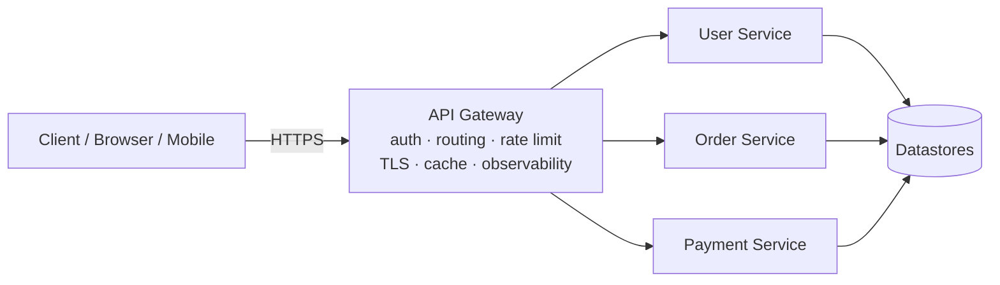

# API Design

An API (Application Programming Interface) is the contract that lets one piece of software talk to another over a network. Good API design defines a stable, predictable surface so that clients and servers can evolve independently. This document covers the major styles (REST, GraphQL, gRPC, WebSockets/SSE) and the cross-cutting concerns every API must handle: versioning, pagination, errors, rate limiting, idempotency, and gateways.

## The Problem It Solves

When two systems need to cooperate, they need a shared agreement about *how* to communicate: what requests look like, what responses mean, and what happens on failure. Without a contract, every client would be coupled to the server's internal implementation, and any change on the server would break every consumer.

An API is that contract. It provides:

- **Decoupling** — clients depend on the interface, not the implementation. The server can refactor its database, rewrite its language, or scale out without touching clients, as long as the contract holds.
- **A stable abstraction** — the API exposes intent ("create an order") rather than mechanics ("INSERT INTO orders ...").
- **Independent evolution** — versioning and backward compatibility let the server add features while old clients keep working.
- **A trust/security boundary** — authentication, authorization, validation, and rate limiting are enforced at the contract edge.

The hard part of API design is that a public contract is *hard to change*. Once clients depend on it, you can rarely break it. So the goal is an interface that is correct, consistent, and evolvable from day one.

## API Styles Overview

There is no single "best" API style — each optimizes for different constraints. REST is the ubiquitous default for resource-oriented web APIs; GraphQL shines when clients need flexible, aggregated reads; gRPC dominates high-performance internal service-to-service calls; WebSockets/SSE handle real-time push.

| Style | Transport | Payload format | Schema / typing | Streaming support | Browser friendly | Typical use case |
|---|---|---|---|---|---|---|
| **REST** | HTTP/1.1, HTTP/2 | JSON (usually), any | Optional (OpenAPI) | Limited (chunked) | Excellent (native) | Public web APIs, CRUD over resources |
| **GraphQL** | HTTP (POST), WS for subs | JSON | Strong (SDL schema) | Subscriptions (over WS) | Excellent | Aggregating data, flexible client-driven reads, mobile |
| **gRPC** | HTTP/2 | Binary (Protobuf) | Strong (.proto IDL) | Native (4 modes) | Needs grpc-web proxy | Internal microservices, low-latency, polyglot |
| **WebSockets** | TCP via HTTP Upgrade | Any (text/binary) | None (app-defined) | Full-duplex | Excellent (native) | Chat, live collaboration, games, trading |
| **SSE** | HTTP/1.1+ | text/event-stream | None | Server→client only | Good (native EventSource) | Live feeds, notifications, progress, LLM token streams |

## REST

REST (Representational State Transfer) is an architectural style, not a protocol. It models the system as a set of **resources** identified by **URIs**, manipulated through a uniform set of HTTP methods. It is the default for most public web APIs because it leverages HTTP's existing semantics, caching, and tooling.

### Resources & URIs

A resource is a noun — a thing the API exposes (a user, an order, a comment). URIs identify resources and should be hierarchical and noun-based, not verb-based.

```
GET    /users                # collection of users
GET    /users/123            # a single user
GET    /users/123/orders     # orders belonging to user 123
GET    /orders/456           # a single order
```

Avoid verbs in paths (`/getUser`, `/createOrder`) — the HTTP method already expresses the verb. Use plural nouns for collections and keep nesting shallow (rarely more than one level deep).

### HTTP Verbs and Their Semantics

| Verb | Semantics | Safe? | Idempotent? | Typical success code |
|---|---|---|---|---|
| **GET** | Read a resource or collection; never mutates | Yes | Yes | 200 |
| **POST** | Create a subordinate resource, or non-idempotent action | No | No | 201 (created), 200/202 |
| **PUT** | Replace a resource entirely (full update / create-at-id) | No | Yes | 200 / 204 |
| **PATCH** | Partial update of a resource | No | No (usually) | 200 / 204 |
| **DELETE** | Remove a resource | No | Yes | 204 / 200 |

- **Safe** methods do not change server state (GET, HEAD, OPTIONS). They can be cached and prefetched.
- **PUT vs PATCH**: PUT sends the *entire* new representation and replaces it; PATCH sends only the fields to change.

### Statelessness

Each request must contain all the information needed to process it — the server stores no client session context between requests. Authentication, for example, travels on every request (e.g., a bearer token), not in server-held session state.

Statelessness makes REST APIs horizontally scalable: any server instance can handle any request, so requests can be load-balanced freely and instances added or removed without sticky sessions. State that must persist lives in a database or cache, not in the request handler's memory.

### Status Codes

Use the most specific standard status code. Clients rely on these for control flow.

| Code | Name | Meaning |
|---|---|---|
| **200** | OK | Success; response body contains the result |
| **201** | Created | New resource created; `Location` header points to it |
| **202** | Accepted | Request accepted for async processing; not yet done |
| **204** | No Content | Success with no response body (common for DELETE/PUT) |
| **400** | Bad Request | Malformed syntax / invalid request the client must fix |
| **401** | Unauthorized | Missing or invalid authentication credentials |
| **403** | Forbidden | Authenticated but not permitted to do this |
| **404** | Not Found | Resource does not exist (or is hidden) |
| **409** | Conflict | Request conflicts with current state (e.g., duplicate, version clash) |
| **422** | Unprocessable Entity | Syntax valid but semantically invalid (validation failure) |
| **429** | Too Many Requests | Rate limit exceeded; see `Retry-After` |
| **500** | Internal Server Error | Unexpected server-side failure |
| **503** | Service Unavailable | Server temporarily down/overloaded; retry later |

Rule of thumb: `4xx` means the client did something wrong (don't retry blindly); `5xx` means the server failed (safe to retry with backoff for idempotent requests).

### Idempotency

An operation is **idempotent** if performing it multiple times has the same effect as performing it once. This matters for retries: if a client times out and retries, an idempotent call is safe.

- **GET, PUT, DELETE** are idempotent. `PUT /users/123 {name:"A"}` sets the same state no matter how many times you send it. `DELETE /orders/456` leaves the order deleted whether called once or five times.
- **POST is *not* idempotent** by default — `POST /orders` twice creates two orders.
- **PATCH** is generally not idempotent (e.g., `PATCH {balance: +10}`), though it can be designed to be.

To make POST safely retryable, use an **idempotency key** (see the dedicated section below): the client generates a unique key, sends it in a header, and the server deduplicates retries with the same key.

### HATEOAS

HATEOAS (Hypermedia As The Engine Of Application State) is the REST principle that responses include **links** to related actions and resources, so clients discover what they can do next rather than hardcoding URIs.

```json
{
  "id": 456,
  "status": "pending",
  "total": 99.90,
  "_links": {
    "self":   { "href": "/orders/456" },
    "cancel": { "href": "/orders/456/cancel", "method": "POST" },
    "pay":    { "href": "/orders/456/payment", "method": "POST" },
    "customer": { "href": "/users/123" }
  }
}
```

In theory this fully decouples clients from URL structure. In practice it is **rarely fully adopted** because most clients are written against documentation, hardcode URLs anyway, and don't dynamically navigate links — the added payload and complexity often aren't worth it for typical JSON APIs.

### Concrete REST Example

Request:

```http
POST /users/123/orders HTTP/1.1
Host: api.example.com
Authorization: Bearer eyJhbGciOi...
Content-Type: application/json

{
  "items": [
    { "sku": "BOOK-001", "quantity": 2 },
    { "sku": "PEN-042",  "quantity": 5 }
  ],
  "shipping_address_id": 77
}
```

Response:

```http
HTTP/1.1 201 Created
Location: /orders/456
Content-Type: application/json

{
  "id": 456,
  "user_id": 123,
  "status": "pending",
  "items": [
    { "sku": "BOOK-001", "quantity": 2, "unit_price": 19.95 },
    { "sku": "PEN-042",  "quantity": 5, "unit_price": 1.20 }
  ],
  "total": 45.90,
  "created_at": "2026-06-22T10:15:30Z"
}
```

## GraphQL

GraphQL is a query language and runtime for APIs. Instead of many endpoints returning fixed shapes, GraphQL exposes a **single endpoint** (typically `POST /graphql`) and lets the client specify exactly which fields it wants. The server is described by a strongly-typed **schema**.

### Schema / SDL

The schema is defined in SDL (Schema Definition Language) and serves as the contract:

```graphql
type User {
  id: ID!
  name: String!
  email: String!
  orders: [Order!]!
}

type Order {
  id: ID!
  status: OrderStatus!
  total: Float!
  items: [OrderItem!]!
}

type OrderItem {
  sku: String!
  quantity: Int!
}

enum OrderStatus { PENDING PAID SHIPPED CANCELLED }

type Query {
  user(id: ID!): User
  orders(status: OrderStatus): [Order!]!
}

type Mutation {
  createOrder(userId: ID!, items: [OrderItemInput!]!): Order!
}

input OrderItemInput { sku: String!, quantity: Int! }
```

The `!` marks non-nullable fields. **Queries** read data; **Mutations** write data; **Subscriptions** (over WebSockets) push real-time updates.

### Resolvers

Each field in the schema is backed by a **resolver** — a function that knows how to fetch that field's data. When a query arrives, the runtime walks the requested tree and calls resolvers, composing the result. Resolvers can pull from databases, other services, or caches, which is how a single GraphQL field can aggregate many backends.

### Solving Over-fetching / Under-fetching

With REST, endpoints return fixed shapes:

- **Over-fetching**: `GET /users/123` returns the full user object even if the client only needs the name — wasted bytes.
- **Under-fetching (N+1 round trips)**: to show a user and their order totals, the client calls `GET /users/123`, then `GET /users/123/orders` — multiple round trips.

GraphQL lets the client ask for exactly the fields it needs in one round trip:

```graphql
query {
  user(id: "123") {
    name
    orders {
      id
      total
    }
  }
}
```

Response:

```json
{
  "data": {
    "user": {
      "name": "Ada Lovelace",
      "orders": [
        { "id": "456", "total": 45.90 },
        { "id": "457", "total": 12.00 }
      ]
    }
  }
}
```

### The N+1 Problem & DataLoader

GraphQL solves client-side round trips but can create a **server-side N+1 problem**. If a query asks for 100 users and each user's `orders` resolver hits the database separately, that's 1 query for users + 100 queries for orders = N+1 database calls.

**DataLoader** solves this with **batching and caching**. Within a single request tick, DataLoader collects all the individual `load(userId)` calls, then dispatches one batched query (`SELECT * FROM orders WHERE user_id IN (...)`), and caches results per request. This collapses N+1 into 2 queries.

### Downsides

- **Caching is harder** — REST leverages HTTP caching by URL/verb; GraphQL POSTs to one endpoint with varying bodies, so HTTP caches don't help. You need application-level or persisted-query caching.
- **Complexity** — schema, resolvers, and tooling add overhead vs. a simple REST handler.
- **Query cost** — a malicious or careless deeply-nested query can be very expensive. Mitigate with **depth limiting**, **query cost analysis**, **complexity scoring**, and **persisted queries** (only allow-listed queries run).

## gRPC & Protocol Buffers

gRPC is a high-performance RPC framework built on **HTTP/2** that uses **Protocol Buffers (protobuf)** — a compact binary serialization format — as its payload. It's the standard for internal, polyglot, low-latency service-to-service communication.

### How It Works

- **HTTP/2 transport** provides multiplexing (many calls over one connection), header compression, and bidirectional streaming.
- **Binary protobuf** payloads are far smaller and faster to serialize/parse than JSON.
- Communication is modeled as calling **methods on a remote service** (RPC) rather than manipulating resources.

### IDL: the `.proto` File

The contract is an **IDL** (Interface Definition Language) `.proto` file defining services and messages:

```protobuf
syntax = "proto3";

package orders.v1;

service OrderService {
  rpc GetOrder(GetOrderRequest) returns (Order);
  rpc ListOrders(ListOrdersRequest) returns (stream Order);          // server streaming
  rpc CreateOrders(stream CreateOrderRequest) returns (CreateSummary); // client streaming
  rpc Chat(stream ChatMessage) returns (stream ChatMessage);         // bidirectional
}

message GetOrderRequest {
  string order_id = 1;
}

message Order {
  string id = 1;
  string user_id = 2;
  OrderStatus status = 3;
  double total = 4;
  repeated OrderItem items = 5;
}

message OrderItem {
  string sku = 1;
  int32 quantity = 2;
}

enum OrderStatus {
  ORDER_STATUS_UNSPECIFIED = 0;
  PENDING = 1;
  PAID = 2;
  SHIPPED = 3;
}
```

The numbered field tags (`= 1`, `= 2`) are how fields are identified on the wire — never reuse or change a tag once deployed, as that breaks compatibility.

### Code Generation

The `protoc` compiler (with language plugins) generates strongly-typed client stubs and server interfaces in many languages from the same `.proto`. Clients call generated methods as if local; servers implement the generated interface. This gives compile-time type safety across language boundaries.

### The Four RPC Types

1. **Unary** — one request, one response (like a normal function call): `GetOrder`.
2. **Server streaming** — one request, a stream of responses: `ListOrders` streams orders as they're found.
3. **Client streaming** — a stream of requests, one response: `CreateOrders` uploads many, gets a summary.
4. **Bidirectional streaming** — both sides stream independently over one connection: `Chat`.

### Strengths & Downsides

**Strengths**: excellent performance, small payloads, strong typing, first-class streaming, great for polyglot internal systems.

**Downsides**:
- **Browser support** is limited — browsers can't speak raw gRPC, so you need **grpc-web** plus a proxy (e.g., Envoy) to translate.
- Payloads are **binary and not human-readable**, making ad-hoc debugging harder than with JSON (you need tooling like `grpcurl`).
- Tighter coupling to the `.proto` and more build tooling than REST.

## WebSockets & Server-Sent Events (SSE)

Standard HTTP request/response is client-initiated. For server-pushed, real-time data you need a different mechanism.

- **WebSockets** provide a persistent, **full-duplex** (both directions, simultaneously) connection over a single TCP socket, established by an HTTP `Upgrade` handshake. Either side can send a message at any time.
- **SSE (Server-Sent Events)** is a **one-way, server→client** stream over a long-lived HTTP response (`Content-Type: text/event-stream`). The browser's native `EventSource` API consumes it, with automatic reconnection built in.

### When to Use Each

- Use **WebSockets** when the client also needs to send frequently and with low latency: chat, multiplayer games, collaborative editing, live trading.
- Use **SSE** when data flows only from server to client: live notifications, dashboards, progress updates, news feeds, and streaming LLM token output. It's simpler, works over plain HTTP, and reconnects automatically.

### Comparison: Polling → WebSocket

| Technique | Direction | Connection | Latency | Overhead | Notes |
|---|---|---|---|---|---|
| **Short polling** | Client pulls | New request each interval | High (interval-bound) | High (constant requests) | Simple but wasteful; data is stale between polls |
| **Long polling** | Client pulls | Request held open until data | Medium | Medium | Server holds request until update or timeout, then client re-requests |
| **SSE** | Server → client | One long-lived HTTP stream | Low | Low | Native browser support, auto-reconnect, server push only |
| **WebSocket** | Bidirectional | One persistent TCP socket | Lowest | Lowest per message | Full-duplex; needs its own protocol/handling on top |

### Example (SSE)

```http
GET /orders/456/events HTTP/1.1
Accept: text/event-stream
```

```
HTTP/1.1 200 OK
Content-Type: text/event-stream
Cache-Control: no-cache

event: status
data: {"order_id":"456","status":"PAID"}

event: status
data: {"order_id":"456","status":"SHIPPED"}
```

## API Versioning

APIs change, but existing clients must keep working. Versioning lets you introduce breaking changes without breaking consumers. Additive, backward-compatible changes (new optional fields, new endpoints) ideally don't require a new version; only breaking changes do.

| Strategy | Example | Pros | Cons |
|---|---|---|---|
| **URI path** | `GET /v1/users/123` | Obvious, easy to route, cache-friendly, easy to test in a browser | Pollutes URLs; technically violates "one URI per resource"; clients must rewrite URLs to upgrade |
| **Custom header / media type** | `Accept: application/vnd.example.v2+json` | Keeps URLs clean; aligns with content negotiation | Less visible/discoverable; harder to test by hand; some caches ignore headers |
| **Query parameter** | `GET /users/123?version=2` | Simple, optional defaulting | Easy to omit; muddies caching and analytics |

**URI path versioning is the most common** in public APIs for its simplicity and visibility. Media-type versioning is the most "RESTfully pure."

**Deprecation policy**: announce deprecation in advance, return a `Deprecation` and `Sunset` header (RFC 8594) on old versions, document a clear timeline, monitor remaining usage, and only remove after the sunset date. Never silently break.

## Pagination

Returning huge collections in one response is slow and memory-heavy, so APIs paginate. The two main approaches are offset-based and cursor (keyset) based.

### Offset / Limit

```http
GET /orders?limit=20&offset=40
```

```json
{
  "data": [ /* 20 orders, rows 41–60 */ ],
  "limit": 20,
  "offset": 40,
  "total": 1357
}
```

Problems with offset:
- **Drift / inconsistency**: if rows are inserted or deleted while paging, items can be skipped or shown twice (the offset shifts under you).
- **Deep-page cost**: `OFFSET 1000000` forces the database to scan and discard a million rows — performance degrades the deeper you go.

### Cursor / Keyset

A cursor encodes "where you left off" (typically the sort key of the last item), so the next page is fetched with a `WHERE key > last_key` clause — fast and stable regardless of inserts/deletes.

```http
GET /orders?limit=20&cursor=eyJpZCI6NDU2LCJ0cyI6IjIwMjYtMDYtMjIifQ
```

```json
{
  "data": [ /* up to 20 orders after the cursor */ ],
  "page_info": {
    "has_next_page": true,
    "next_cursor": "eyJpZCI6NDc2LCJ0cyI6IjIwMjYtMDYtMjEifQ"
  }
}
```

The cursor is **opaque** — clients treat it as a meaningless token (often base64-encoded JSON) and just pass it back. This keeps the server free to change its internal pagination scheme.

| Aspect | Offset / Limit | Cursor / Keyset |
|---|---|---|
| Jump to arbitrary page | Yes (page N) | No (sequential only) |
| Stable under inserts/deletes | No (drift) | Yes |
| Deep-page performance | Poor (scans & skips) | Excellent (indexed seek) |
| Total count available | Easy | Hard/expensive |
| Implementation complexity | Low | Higher |
| Best for | Small/static datasets, admin UIs with page numbers | Large/changing feeds, infinite scroll |

## Filtering, Sorting, Field Selection

Beyond pagination, clients need to narrow and shape collection responses. Use query parameters with consistent conventions.

**Filtering** — restrict which resources are returned:

```http
GET /orders?status=paid&min_total=50&created_after=2026-01-01
```

A common convention for richer operators uses bracketed suffixes:

```http
GET /orders?filter[status]=paid&filter[total][gte]=50
```

**Sorting** — order results; allow multiple keys, with `-` for descending:

```http
GET /orders?sort=-created_at,total
```
(sort by `created_at` descending, then `total` ascending)

**Field selection (sparse fieldsets)** — let clients request only the fields they need, reducing payload size (REST's answer to over-fetching):

```http
GET /orders?fields=id,status,total
```

```json
{
  "data": [
    { "id": 456, "status": "paid", "total": 45.90 },
    { "id": 457, "status": "pending", "total": 12.00 }
  ]
}
```

Keep these conventions consistent across all endpoints, and validate/allow-list filterable and sortable fields to prevent abuse and inefficient queries.

## Rate Limiting & Throttling

Rate limiting protects an API from overload and abuse by capping how many requests a client may make in a time window. Common algorithms include the **token bucket** and **leaky bucket** (which smooth bursts), and **fixed window** / **sliding window** counters.

When a client exceeds its limit, return **`429 Too Many Requests`** with a **`Retry-After`** header, and expose remaining quota via `RateLimit` headers:

```http
HTTP/1.1 429 Too Many Requests
Retry-After: 30
RateLimit-Limit: 100
RateLimit-Remaining: 0
RateLimit-Reset: 30

{ "error": { "code": "rate_limited", "message": "Too many requests" } }
```

This is a brief overview — see [`19_rate_limiting.md`](19_rate_limiting.md) for the algorithms, distributed enforcement, and design trade-offs in depth.

## Idempotency Keys

POST is not idempotent, but network failures make retries necessary. The **idempotency key** pattern lets clients safely retry mutating requests (creating orders, charging payments) without risk of duplicate side effects.

**Pattern**:
1. The client generates a unique key (e.g., a UUID) and sends it in an `Idempotency-Key` header.
2. On first receipt, the server processes the request, stores the result keyed by that key (with a TTL), and returns the response.
3. On any retry with the **same key**, the server detects it already processed that key and returns the **stored result** instead of executing again.

```http
POST /payments HTTP/1.1
Idempotency-Key: 7f3b2c1a-9e44-4b6d-bf2e-1a2b3c4d5e6f
Content-Type: application/json

{ "amount": 4590, "currency": "USD", "order_id": "456" }
```

Example flow:

- **First request** → server charges the card, stores `{key → 201 response, charge_id}`, returns `201 Created`.
- **Network timeout, client retries** with the same `Idempotency-Key` → server finds the stored result and returns the **same** `201 Created` and `charge_id` — **no second charge**.
- A different request body reusing an existing key should be rejected (e.g., `422`), since the key is meant to identify one logical operation.

This is the production-grade way to make payments and other critical POSTs safe under retries.

## Error Formats

Inconsistent error responses are a major source of client pain. Use a **single, consistent error envelope** across the whole API so clients can handle failures uniformly.

A widely-used standard is **RFC 7807 Problem Details**, served as `application/problem+json`:

```http
HTTP/1.1 422 Unprocessable Entity
Content-Type: application/problem+json

{
  "type": "https://api.example.com/problems/validation-error",
  "title": "Validation failed",
  "status": 422,
  "detail": "One or more fields are invalid.",
  "instance": "/orders",
  "errors": [
    { "field": "items[0].quantity", "code": "min", "message": "must be at least 1" },
    { "field": "shipping_address_id", "code": "required", "message": "is required" }
  ]
}
```

Key principles:

- **Machine-readable codes vs. human messages**: include a stable `code` (e.g., `"validation-error"`, `"rate_limited"`) that clients can branch on, *and* a human-readable `message`/`detail` for logs and developers. Never make clients parse the message string for logic.
- **Validation errors as arrays**: return *all* field errors at once (an `errors` array) rather than failing on the first, so clients can show every problem in one pass.
- **Don't leak internals**: avoid stack traces or SQL in production error bodies.
- Match the HTTP status code to the error semantics (400 vs. 401 vs. 403 vs. 409 vs. 422).

## API Gateways

An API gateway is a single entry point that sits in front of your backend services and handles cross-cutting concerns so individual services don't have to. It's the front door of a microservices architecture.

**Responsibilities**:
- **Routing** — direct each request to the right backend service.
- **Authentication & authorization** — validate tokens/keys before requests reach services.
- **Rate limiting & throttling** — enforce quotas centrally.
- **TLS termination** — handle HTTPS so internal services can speak plain HTTP.
- **Request aggregation** — combine calls to multiple services into one client response.
- **Caching** — cache responses at the edge.
- **Observability** — centralized logging, metrics, and tracing.



Examples: **Kong**, **AWS API Gateway**, **Google Apigee**, and **Envoy** (often used as both a gateway and a service-mesh proxy, including for grpc-web translation).

## Authentication Overview

APIs must verify *who* is calling (authentication) and *what they may do* (authorization). Common mechanisms:

- **API keys** — a static secret string identifying the client; simple, good for server-to-server and low-sensitivity use, but no per-user identity and hard to scope/rotate.
- **OAuth2 / OIDC bearer tokens** — the standard for delegated access; clients obtain an access token and send `Authorization: Bearer <token>`. OIDC adds an identity layer on top of OAuth2.
- **JWT (JSON Web Token)** — a signed, self-contained token carrying claims; lets servers verify the token without a database lookup (stateless auth).
- **mTLS (mutual TLS)** — both client and server present certificates; strong, common for internal service-to-service trust.

This is intentionally brief — see [`17_security.md`](17_security.md) for the deep dive on auth flows, token storage, scopes, and threats.

## Trade-offs

- **Choosing a style**:
  - Public, resource-oriented, broad client base, cacheable → **REST**.
  - Clients with varied/aggregated data needs, mobile bandwidth concerns → **GraphQL**.
  - Internal, high-throughput, low-latency, polyglot services → **gRPC**.
  - Real-time push, bidirectional → **WebSockets**; one-way server push → **SSE**.
- **Consistency** is worth more than cleverness. Uniform conventions for naming, errors, pagination, and versioning across every endpoint reduce client effort more than any single optimization.
- **Evolvability**: design for change. Prefer additive, backward-compatible changes; make breaking changes only behind a version; treat the contract as a long-term commitment because public APIs are extremely hard to change once adopted.
- **Performance vs. readability**: binary protocols (gRPC) win on speed; text (JSON/REST/GraphQL) wins on debuggability and tooling.
- **Flexibility vs. cacheability**: GraphQL's flexibility costs you HTTP caching; REST's fixed shapes are easy to cache.

## Key Takeaways

- An API is a **contract** that decouples clients from server implementation and enables independent evolution.
- **REST** models resources via URIs and HTTP verbs; use correct **status codes**, respect **idempotency** (GET/PUT/DELETE are idempotent, POST is not), and keep it **stateless**.
- **GraphQL** lets clients fetch exactly what they need from one endpoint, fixing over/under-fetching — but watch the **N+1 problem** (use **DataLoader**), harder caching, and query-cost limits.
- **gRPC** over HTTP/2 with **protobuf** gives fast, strongly-typed, streaming-capable internal APIs; the cost is binary payloads and limited browser support (grpc-web).
- **WebSockets** are full-duplex; **SSE** is one-way server→client and simpler — choose based on direction and latency needs.
- Handle cross-cutting concerns deliberately: **versioning** (prefer URI path), **pagination** (cursor for large/changing data), **filtering/sorting/field selection**, **rate limiting** (429 + Retry-After), **idempotency keys** for safe retries, and **consistent error envelopes** (RFC 7807).
- An **API gateway** centralizes routing, auth, rate limiting, TLS, and observability.
- See [`17_security.md`](17_security.md) for authentication/authorization and [`19_rate_limiting.md`](19_rate_limiting.md) for rate-limiting internals.
