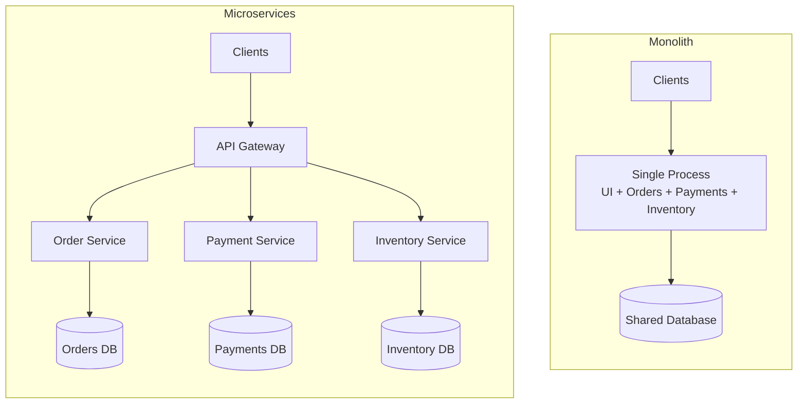
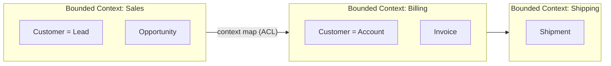
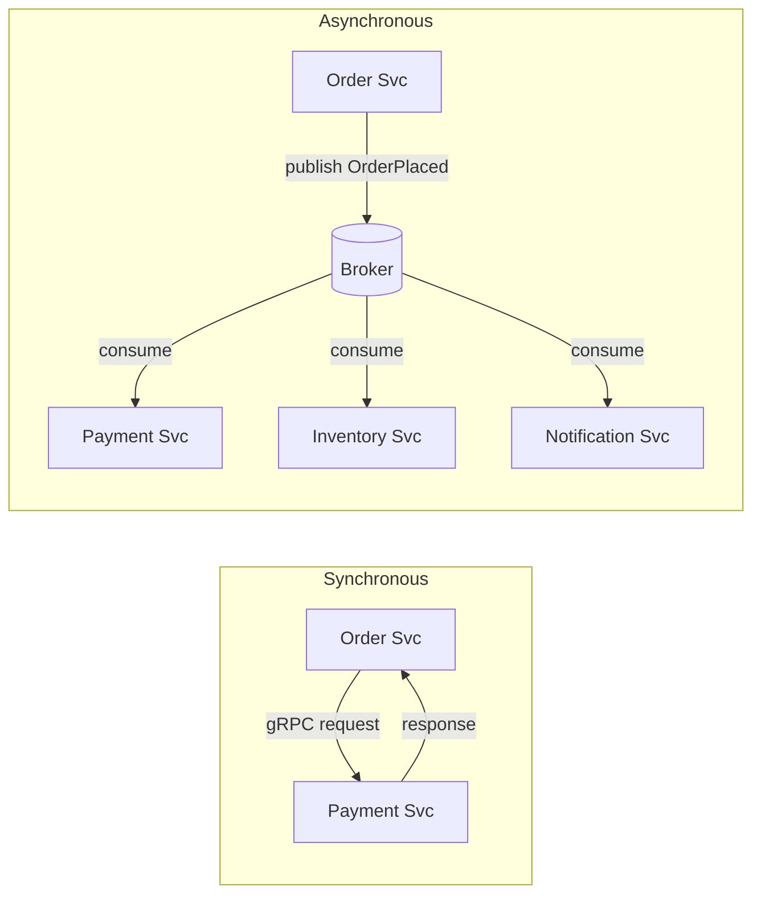
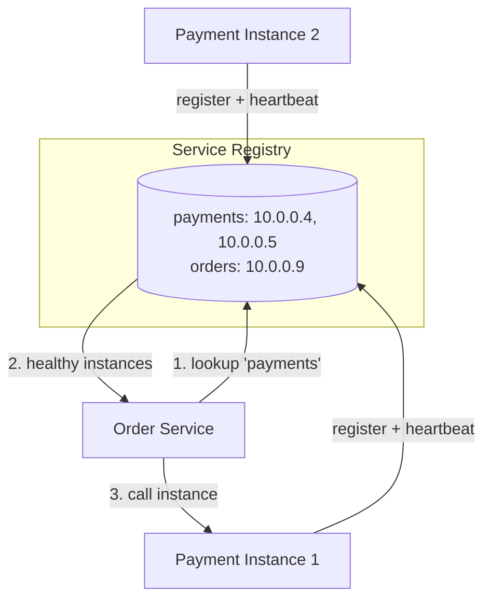
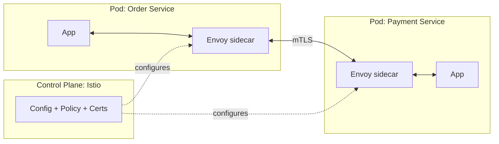
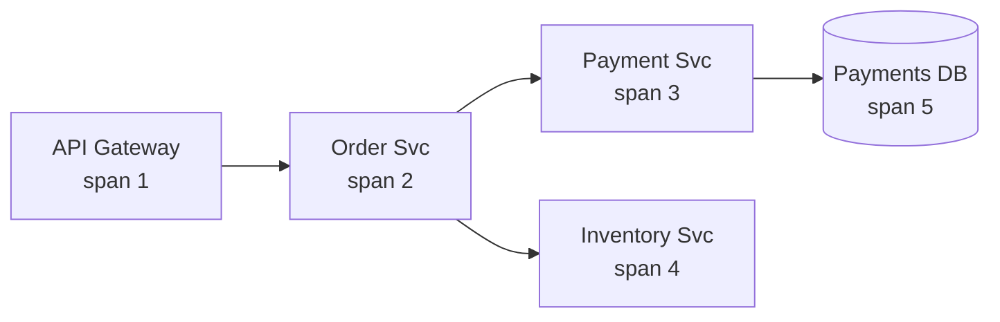
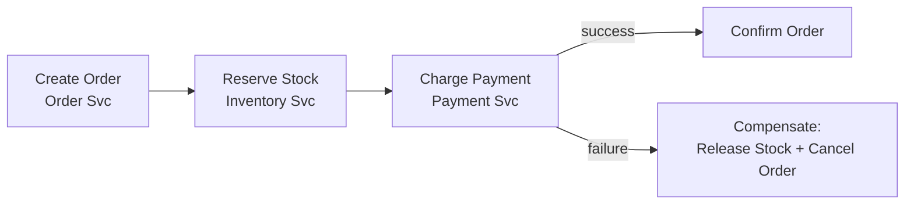

# Microservices

Microservices is an architectural style that structures an application as a collection of small, independently deployable services, each owning a single business capability and its own data. The promise is organizational and operational scalability: many teams shipping independently, scaling, and choosing technology per service. The cost is a large jump in distributed-systems complexity — the network, partial failure, and data consistency all become first-class problems.

---

## The Problem It Solves

As a system and the organization building it grow, a single deployable unit (the monolith) becomes a bottleneck — not primarily a technical one, but a *coordination* one.

- **Independent deployment.** In a monolith, every change — no matter how small — ships the entire application. A one-line fix in the billing module forces a redeploy of search, checkout, and everything else. Release cadence collapses to the speed of the slowest, most cautious team.
- **Independent scaling.** A monolith scales as one block. If image processing is CPU-heavy but the rest is light, you must scale *everything* to scale that one hot path, wasting resources.
- **Team autonomy.** Above ~2-3 teams, a shared codebase and shared release train create constant merge conflicts, cross-team coupling, and "you broke the build" friction. Conway's Law observes that systems mirror the communication structure of the organization that builds them — microservices deliberately align service boundaries with team boundaries so teams can move without coordinating.
- **Fault isolation.** A memory leak or runaway thread in one monolith module can take down the whole process. Isolating capabilities into separate processes limits the blast radius.
- **Technology evolution.** A monolith locks you into one language, framework, and (often) one database. Replacing or upgrading any of them is an all-or-nothing migration.

Microservices trade these monolith *limits at scale* for the inherent costs of a distributed system. That trade only pays off past a certain scale of team and system — see "When NOT to Use Microservices."

---

## Monolith vs Microservices

**Monolith.** A single deployable artifact (one process / one binary / one WAR) containing all business logic, typically talking to one shared database. Internal calls are in-process function calls.

**Microservices.** Many small deployable services, each owning one capability and its own datastore, communicating over the network (HTTP/gRPC or messaging).

**Modular monolith.** A middle ground worth naming up front: a *single deployable* whose code is organized into strongly-bounded internal modules with explicit interfaces and no cross-module database access. It gives you most of the boundary discipline of microservices with none of the network cost. It is the recommended *starting point* for most systems and the safest base from which to later extract services.

### Comparison

| Dimension | Monolith | Microservices |
|---|---|---|
| **Deployment** | One artifact; deploy all at once; simple pipeline | Many artifacts; independent deploys; needs CI/CD per service |
| **Scaling** | Scale the whole app (vertical or N identical copies) | Scale each service independently to its own load profile |
| **Tech diversity** | One stack, usually one DB | Polyglot — right language/DB per service (at a governance cost) |
| **Fault isolation** | One crash can affect everything in-process | A failed service is contained — *if* callers degrade gracefully |
| **Operational complexity** | Low — one thing to run, log, monitor | High — service discovery, tracing, mesh, many pipelines |
| **Data consistency** | Easy — ACID transactions across modules in one DB | Hard — no cross-service transactions; eventual consistency, sagas |
| **Latency** | In-process calls (nanoseconds) | Network calls (milliseconds) + serialization overhead |
| **Team autonomy** | Low — shared codebase, shared release | High — teams own services end-to-end |
| **Debugging** | Single stack trace, single process | Distributed — needs correlation IDs and distributed tracing |

### Topology



The key visual difference: the monolith shares one process and one database; microservices split both, and a gateway fronts them.

---

## Service Boundaries & Domain-Driven Design

The single most important — and most often botched — decision in microservices is *where to draw the lines*. Bad boundaries produce a "distributed monolith": all the network cost with none of the autonomy. Domain-Driven Design (DDD) gives the vocabulary to get this right.

- **Bounded Context.** An explicit boundary within which a domain model and its terms have a single, consistent meaning. "Customer" in the *Sales* context (a lead with a pipeline stage) is a different model from "Customer" in the *Billing* context (an account with payment methods). Each bounded context is a strong candidate for a service.
- **Ubiquitous Language.** Within a bounded context, code, conversation, and the model use the *same* terms. This shared language is what keeps a service's model coherent and is a signal of where a context ends — when the language shifts, you've likely crossed a boundary.
- **Aggregate.** A cluster of objects treated as a single consistency unit, with one *aggregate root* as the only entry point. Aggregates are the natural unit of a transaction; a service typically owns one or a few aggregates. They also bound *what must be strongly consistent together* (everything else is eventual).
- **Context Mapping.** Describes the relationships *between* bounded contexts — e.g., upstream/downstream, customer/supplier, conformist, anti-corruption layer (ACL). An ACL translates another context's model into yours so foreign concepts don't leak in.

### How to find boundaries

- **By business capability, NOT by technical layer.** Split into `Orders`, `Payments`, `Inventory` — *not* `WebTier`, `ServiceTier`, `DataTier`. Layered splits force every feature to touch every service (chatty, lock-step deploys). Capability splits let a feature live mostly in one service.
- **Align with team ownership** (Conway's Law) — one team should own a service end to end.
- **Follow the data and the transaction.** Things that must change together atomically belong in the same service/aggregate. If a "boundary" forces a distributed transaction for an ordinary operation, it's in the wrong place.

### Anti-patterns to avoid

- **Distributed monolith** — services that must be deployed together, share a database, or break in lock-step. You paid the network tax but kept the coupling.
- **Chatty services** — a single user action fans out into dozens of synchronous calls. Symptom of boundaries drawn too fine or by layer. Coalesce, or move to async.
- **Nanoservices** — services so small the coordination overhead dwarfs the work they do.



---

## Inter-Service Communication

Once split, services must talk over the network. The fundamental choice is **synchronous** (request/response, caller waits) vs **asynchronous** (messaging, fire-and-forget or event-driven).

### Synchronous: REST / gRPC

- **REST over HTTP/JSON** — ubiquitous, human-readable, cacheable, easy to debug. Good for public/edge APIs.
- **gRPC** — HTTP/2 + Protocol Buffers (binary). Lower latency, smaller payloads, streaming, strongly-typed contracts via `.proto`. Preferred for high-throughput internal service-to-service calls.

Synchronous calls are simple to reason about but create **temporal coupling**: the caller is only as available as the callee. A chain of N synchronous calls multiplies failure probability and adds latency at every hop. Mitigate with timeouts, retries (with backoff + jitter), and circuit breakers.

### Asynchronous: events / messaging

The caller publishes an event or message and does not wait. A broker (Kafka, RabbitMQ, SQS) decouples producer from consumer in time and availability. This is the basis of **event-driven architecture** and gives the strongest resilience and decoupling — at the cost of eventual consistency and harder reasoning about end-to-end flows. For broker semantics, delivery guarantees, partitioning, and streaming, see `09_messaging_streaming.md`.

### Choreography vs Orchestration

Two ways to coordinate a multi-service business process:

- **Choreography** — each service reacts to events and emits its own; no central controller. Highly decoupled and resilient, but the overall flow is *implicit* and emergent, which can be hard to follow and debug.
- **Orchestration** — a central coordinator (orchestrator) explicitly tells each service what to do and tracks progress. The flow is *explicit* and easy to observe/modify, but the orchestrator is a coupling point and potential bottleneck.

### Trade-offs

| | Synchronous (REST/gRPC) | Asynchronous (events) |
|---|---|---|
| Coupling | Temporal — both must be up | Decoupled in time |
| Latency | Immediate response | Higher end-to-end, but non-blocking |
| Resilience | Failure propagates up the chain | Broker buffers; consumer can catch up |
| Reasoning | Easy (linear) | Harder (eventual, distributed) |
| Best for | Queries, user-facing reads | State changes, integration, fan-out |



---

## API Gateway

An **API Gateway** is a single entry point that sits between external clients and the internal services. Rather than exposing dozens of services directly, clients hit the gateway, which routes to the right service.

Typical responsibilities:

- **Routing** requests to the correct backend service.
- **Cross-cutting concerns** offloaded from every service: authentication/authorization, TLS termination, rate limiting, request/response transformation, caching, and request aggregation.
- **Protocol translation** (e.g., external REST → internal gRPC).

**Backend-for-Frontend (BFF).** Instead of one gateway serving every client type, you provide a dedicated gateway per client experience — e.g., a `web-bff`, a `mobile-bff`. Each BFF tailors aggregation and payload shape to its client (mobile needs slimmer responses; web may aggregate more), avoiding a one-size-fits-all gateway that satisfies nobody.

Common implementations: Kong, NGINX, Envoy, AWS API Gateway, Spring Cloud Gateway. For API design conventions, versioning, and contract details, see `10_api_design.md`.

---

## Service Discovery

Services come and go (autoscaling, restarts, failures) and their IPs are dynamic. **Service discovery** lets a caller find a healthy instance of a callee without hard-coded addresses.

- **Service registry** — a database of `service name → healthy instances`. Instances *register* on startup and *deregister* on shutdown; the registry **health-checks** them and evicts unhealthy ones. Examples: **Consul**, **Eureka**, **etcd**, Zookeeper.
- **Client-side discovery** — the client queries the registry, gets the list of instances, and load-balances itself (e.g., Netflix Eureka + Ribbon). Fewer hops, but discovery logic lives in every client.
- **Server-side discovery** — the client calls a fixed load balancer / router, which consults the registry and forwards. Simpler clients; the LB is an extra hop and component.
- **DNS-based** — the platform maps service names to addresses via DNS (e.g., Kubernetes Services: `payments.default.svc.cluster.local` resolves to a stable virtual IP, with kube-proxy or the mesh load-balancing across pods). Most cloud-native systems get discovery "for free" from the orchestrator.



---

## Service Mesh

As the number of services grows, every service re-implements the same networking concerns: retries, timeouts, TLS, load balancing, metrics. A **service mesh** moves this into the infrastructure layer so application code doesn't have to.

- **Sidecar proxy pattern.** A lightweight proxy (commonly **Envoy**) is deployed *alongside* each service instance (e.g., a second container in the same Kubernetes pod). All inbound and outbound traffic flows through the sidecar — the application just talks to `localhost` and the proxy handles the network.
- **Data plane vs control plane.**
  - *Data plane* — the fleet of sidecar proxies that actually carry traffic.
  - *Control plane* — the brain (**Istio**, **Linkerd**) that configures all the proxies: distributing policy, certificates, and routing rules.
- **What it provides** (without changing app code):
  - **mTLS** — automatic mutual-TLS encryption and service identity between all services.
  - **Traffic shaping** — canary releases, blue/green, weighted routing, traffic mirroring.
  - **Resilience** — retries, timeouts, circuit breaking, fault injection.
  - **Observability** — uniform metrics, logs, and trace propagation for all traffic.



A mesh adds latency (an extra proxy hop each way) and operational weight, so adopt it when service count and networking concerns justify it.

---

## Configuration & Secrets Management

Each service needs configuration (endpoints, feature flags, tuning) and secrets (DB passwords, API keys). The **12-factor** principle is to keep config in the *environment*, strictly separated from code, so the same artifact runs unchanged across dev/staging/prod.

- **Externalized config** — never bake environment-specific values into the build. Inject at runtime via env vars, mounted files, or a config server.
- **Config servers** — centralized, versioned config with dynamic refresh (Spring Cloud Config, Consul KV, Kubernetes ConfigMaps).
- **Secret stores** — secrets must be encrypted at rest and access-controlled, never in source control or plain env in code: **HashiCorp Vault**, **AWS Secrets Manager**, **Kubernetes Secrets** (base64, encrypt at rest with KMS).
- **Rotation** — credentials should rotate automatically; Vault can issue short-lived, dynamic database credentials that expire, shrinking the window of a leaked secret.

```yaml
# Kubernetes: ConfigMap (non-sensitive) vs Secret (sensitive), injected as env
apiVersion: v1
kind: ConfigMap
metadata:
  name: order-service-config
data:
  PAYMENT_SERVICE_URL: "http://payment.default.svc.cluster.local"
  MAX_RETRIES: "3"
---
apiVersion: v1
kind: Secret
metadata:
  name: order-service-secrets
type: Opaque
stringData:
  DB_PASSWORD: "set-via-vault-or-sealed-secret-not-here"
```

```yaml
# Pod consuming both, with config separated from the image
spec:
  containers:
    - name: order-service
      image: registry/order-service:1.4.2
      envFrom:
        - configMapRef: { name: order-service-config }
        - secretRef: { name: order-service-secrets }
```

For deeper coverage of identity, encryption, and threat modeling, see `17_security.md`.

---

## Distributed Tracing & Observability

In a monolith a single stack trace explains a failure. In microservices one user request fans across many services — you need **observability** to understand behavior you didn't anticipate. The **three pillars**:

- **Logs** — discrete, timestamped events. Structured (JSON) and centralized (ELK/Loki) so they're queryable across services.
- **Metrics** — aggregated numeric time series (request rate, error rate, latency percentiles, saturation — the RED/USE methods). Cheap to store, great for dashboards and alerts (Prometheus + Grafana).
- **Traces** — the path of a single request across services.

### Tracing concepts

- **Trace** — the end-to-end journey of one request, identified by a `trace_id`.
- **Span** — one unit of work within a trace (e.g., the time spent in the Payment service), with a `span_id`, parent span, start/end timestamps, and attributes. A trace is a tree of spans.
- **Correlation / context propagation** — to stitch spans together, the `trace_id` and parent `span_id` must travel with the request from service to service, usually as HTTP headers. The **W3C Trace Context** standard defines the `traceparent` header for exactly this, so tools interoperate.
- **OpenTelemetry (OTel)** — the vendor-neutral standard for generating and exporting telemetry (traces, metrics, logs). Instrument once with OTel; export to any backend.
- **Backends** — **Jaeger**, **Zipkin** (and commercial APMs) collect, store, and visualize traces as waterfall/Gantt views, making it obvious which hop was slow or failed.

```
traceparent: 00-4bf92f3577b34da6a3ce929d0e0e4736-00f067aa0ba902b7-01
             ^ver ^------------ trace-id ------------^ ^- span-id -^ ^flags
```



All five spans above share one `trace_id`; a tracing UI renders them as a timeline so you can see where the time went.

---

## Data Per Service & Distributed Transactions

The defining data rule of microservices:

- **Database per service.** Each service owns its data and is the *only* thing that touches its database. Others access it *only* through the service's API/events.
- **No shared database.** A shared DB is the classic distributed-monolith trap: it couples services through the schema, so no one can change a table without coordinating, and it destroys the autonomy that justified the split.

This decentralization creates the central challenge: **there is no cross-service transaction.** You cannot wrap "deduct inventory" and "charge payment" — which now live in different databases — in one ACID transaction.

### Why 2PC is avoided

A classic answer is the **two-phase commit (2PC)** distributed transaction. It is generally avoided in microservices because it is a *synchronous, blocking* protocol: participants hold locks while awaiting the coordinator, the coordinator is a single point of failure, it scales poorly, and many modern datastores don't support it. It trades availability for consistency in a way that fights the whole architecture.

### The Saga pattern

Instead, a business transaction spanning services is modeled as a **saga**: a sequence of *local* transactions, each in one service. If a step fails, the saga runs **compensating transactions** to semantically undo the prior steps (e.g., "refund payment" compensates "charge payment"). Two coordination styles, mirroring the earlier section:

- **Choreography-based saga** — services react to each other's events; no central coordinator.
- **Orchestration-based saga** — a saga orchestrator drives the steps and compensations explicitly.

The result is **eventual consistency**: the system is briefly inconsistent and converges to a correct state. This is acceptable for most business processes and is the trade you accept for service autonomy. Sagas, compensations, the outbox pattern, and idempotency are covered in depth in `14_distributed_transactions.md`.



---

## When NOT to Use Microservices

Microservices are a solution to *scale* problems — of team and system. Adopting them before you have those problems is a common, expensive mistake.

- **Small team / single team.** If one team can own the whole system, microservices add coordination overhead (many repos, pipelines, deploys) without the autonomy benefit.
- **Early-stage products.** Requirements churn rapidly and you don't yet know the domain. Moving a boundary in a monolith is a refactor; moving it across services is a migration.
- **Unclear domain boundaries.** If you can't confidently identify bounded contexts, you'll draw the wrong service lines and build a distributed monolith — the worst of both worlds.
- **Operational immaturity.** Microservices *require* mature CI/CD, containerization/orchestration, centralized logging, metrics, tracing, and on-call discipline. Without them you have distribution without observability — undebuggable.

**Monolith first.** The widely recommended path (Fowler's "MonolithFirst") is to start with a **modular monolith**: enforce clean internal module boundaries and database separation *in-process*. When real scaling pressure appears and the boundaries have proven stable, **extract** services along those seams. You get fast early iteration and a low-risk, evidence-driven path to microservices later.

---

## Trade-offs

- **Complexity tax.** You trade in-process simplicity for distributed-systems complexity: service discovery, gateways, mesh, config/secrets, and observability all become required infrastructure.
- **Network failure modes.** Every call can be slow, fail, or partially succeed. You must design for timeouts, retries (idempotency!), circuit breakers, and partial degradation — the network is unreliable by default.
- **Data consistency.** No cross-service ACID; you adopt eventual consistency and sagas, which are harder to design and reason about than a single transaction.
- **Testing.** Unit tests stay easy, but integration and end-to-end testing across services require contract testing, service virtualization, and substantial test environments.
- **Deployment & infra needs.** Real value depends on containers, orchestration (Kubernetes), automated CI/CD per service, and a platform/SRE capability. The fixed cost is high.
- **Operational/cost overhead.** More moving parts to monitor, secure, and pay for; cognitive load per engineer rises.

---

## Key Takeaways

- Microservices solve **organizational and operational scaling**, not raw performance — their main payoff is letting many teams deploy and scale independently.
- The hardest and most important task is **finding boundaries** via DDD bounded contexts and business capabilities — get this wrong and you build a **distributed monolith**.
- **Database per service** with **no shared DB** is non-negotiable; the price is **eventual consistency** and **sagas** instead of cross-service transactions (2PC is avoided).
- Communication is **synchronous (REST/gRPC)** or **asynchronous (events)**; async maximizes decoupling and resilience but trades away simplicity of reasoning — see `09_messaging_streaming.md`.
- Distribution demands supporting infrastructure: **API gateway / BFF** (`10_api_design.md`), **service discovery**, optionally a **service mesh** for mTLS/traffic/resilience, **externalized config & secrets** (`17_security.md`), and **distributed tracing/observability** (OpenTelemetry, W3C traceparent, Jaeger).
- There is a real **complexity tax**: only adopt past genuine scale, with mature CI/CD and observability. **Start with a modular monolith** and extract services along proven seams.
- Saga design, compensations, and distributed-transaction patterns are covered in `14_distributed_transactions.md`.
