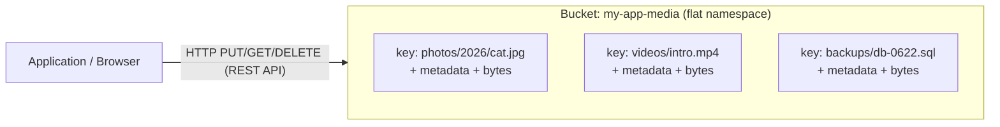
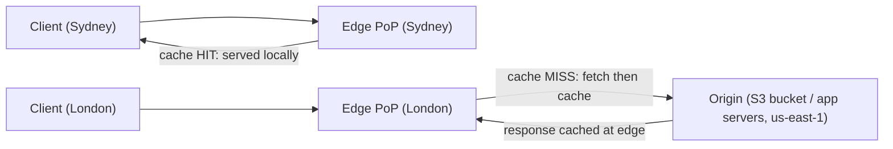
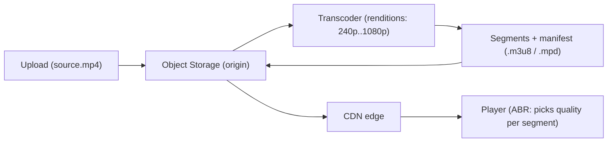

# Storage & CDNs

Picking the right storage abstraction is one of the highest-leverage decisions in a system design: it dictates latency, cost, scalability, and the access patterns your application can support. This chapter covers the three foundational storage types (block, file, object), goes deep on object/blob storage and durability, then explores how Content Delivery Networks (CDNs) put bytes physically close to users so they load fast and cheap, anywhere in the world.

---

## The Problem It Solves

Every system has to put bytes *somewhere*, but "somewhere" is not one thing. The data you store has an **access pattern**, and the storage you choose must match it:

- A database needs **low-latency, random, byte-level reads and writes** to a volume it exclusively controls.
- A fleet of legacy app servers needs a **shared filesystem** they can all mount and see the same files.
- A photo-sharing app needs to store **billions of immutable user uploads** cheaply and serve them globally.
- An analytics team needs to dump **petabytes of raw logs** somewhere queryable later.

Choosing the wrong abstraction is expensive: putting a transactional database on object storage is slow and awkward; storing 50 billion thumbnails on a single block volume is impossible. The first half of this chapter is about **matching the storage abstraction to the access pattern**.

The second problem is **distance**. A user in Sydney fetching a file from a server in Virginia pays ~200 ms of round-trip latency *per request* just due to the speed of light through fiber. Multiply that by every image, script, and video segment on a page and the experience falls apart. CDNs solve **serving content fast and cheap globally** by caching copies of your content at hundreds of edge locations near users, while also offloading traffic from (and shielding) your origin servers.

---

## Storage Types: Block vs File vs Object

There are three primary storage abstractions. They differ in *what unit you address*, *how you access it*, and *how far it scales*.

### Block Storage

Block storage exposes a **raw volume** — an array of fixed-size blocks (e.g., 512 B or 4 KB sectors) with no inherent structure. The operating system sees it as a **bare disk**: you format it with a filesystem (ext4, XFS, NTFS) or hand the raw device to a database. It is the lowest-level, lowest-latency abstraction, and is almost always **attached to a single machine at a time** (single-attach).

Examples: **AWS EBS** (Elastic Block Store), **GCP Persistent Disk**, **Azure Managed Disks**, on-prem **SAN** (Storage Area Network) over iSCSI / Fibre Channel.

```
  ┌─────────────────────────────┐
  │     Virtual Machine / DB     │
  │  ┌───────────────────────┐  │
  │  │  Filesystem (ext4)    │  │   OS formats & mounts the raw device
  │  └───────────────────────┘  │
  └──────────────┬──────────────┘
                 │  block protocol (iSCSI / NVMe / virtio)
                 ▼
  ┌─────────────────────────────┐
  │   Block Volume (raw blocks)  │
  │  [blk0][blk1][blk2][blk3]... │   no concept of files — just numbered blocks
  └─────────────────────────────┘
```

**Key traits:** lowest latency, exclusive single-host attachment, you manage the filesystem, capacity is provisioned up front (you pay for the size you allocate, not what you use).

### File Storage

File storage presents a **hierarchical filesystem** — directories and files with paths like `/home/parveen/report.txt`. Crucially, it supports **shared access**: many clients can mount the same filesystem over the network and read/write the same files concurrently, with the storage system handling locking and consistency.

Access is via network file protocols: **NFS** (Network File System, common on Linux/Unix) and **SMB/CIFS** (common on Windows).

Examples: **AWS EFS** (Elastic File System), **Amazon FSx**, **GCP Filestore**, **Azure Files**, on-prem **NetApp** / NAS appliances.

```
     ┌──────────┐   ┌──────────┐   ┌──────────┐
     │ Server A │   │ Server B │   │ Server C │   many clients mount the
     └────┬─────┘   └────┬─────┘   └────┬─────┘   same share simultaneously
          │ NFS/SMB      │              │
          └──────────────┼──────────────┘
                         ▼
        ┌────────────────────────────────────┐
        │      Shared Network Filesystem       │
        │  /                                   │
        │  ├── home/                           │
        │  │   ├── parveen/report.txt          │
        │  │   └── asha/notes.md               │
        │  └── shared/configs/app.yaml         │
        └────────────────────────────────────┘
```

**Key traits:** hierarchical paths, POSIX-like semantics (permissions, locks, partial in-place writes), shared/concurrent mounts, elastic capacity in cloud variants. Higher overhead per operation than block storage.

### Object Storage

Object storage is a **flat namespace** of **objects**. Each object is a blob of bytes plus **metadata**, identified by a **unique key** within a **bucket** (container). There are no real directories — the "folder" structure you see is just key prefixes (`photos/2026/cat.jpg` is a single key with slashes in it). You access objects over an **HTTP REST API** (`GET`, `PUT`, `DELETE`), not a mount point.

Objects are effectively **immutable-ish**: there is no in-place editing of part of an object. To change one, you **overwrite the whole object** (`PUT` a new version). This constraint is exactly what lets object stores scale to trillions of objects and exabytes.

Examples: **Amazon S3**, **Google Cloud Storage (GCS)**, **Azure Blob Storage**, **MinIO** (self-hosted, S3-compatible), **Cloudflare R2**.



**Key traits:** virtually unlimited scale, accessed via HTTP, rich metadata, pay-per-use (storage + requests + egress), no in-place mutation, eventual-to-strong consistency depending on provider.

### Comparison Table

| Dimension | Block Storage | File Storage | Object Storage |
|---|---|---|---|
| **Access protocol** | iSCSI / NVMe / Fibre Channel (raw device) | NFS / SMB (mounted) | HTTP(S) REST API |
| **Granularity / unit** | Fixed-size blocks | Files & directories | Whole objects (key → blob) |
| **Addressing** | Block offset on a volume | Path (`/dir/file`) | Bucket + key |
| **Scalability** | Limited (per-volume size caps, single host) | High but bounded; shared mount limits | Effectively unlimited (exabytes, trillions of objects) |
| **Performance / latency** | Lowest latency, highest IOPS | Moderate (network FS overhead) | Higher latency (HTTP), high *throughput* & parallelism |
| **Mutability** | Full random read/write in place | Full random read/write in place | Immutable per object; overwrite to change (versioned) |
| **Sharing** | Single-attach (usually one host) | Multi-client shared mount | Concurrent via API (no mount) |
| **Typical use** | Databases, VM boot disks, low-latency I/O | Shared home dirs, legacy apps, content shares | Uploads, backups, static assets, data lakes, media |
| **Cost model** | Pay for provisioned capacity (+ IOPS) | Pay for used capacity (often pricier/GB) | Cheapest per GB; pay for requests + egress too |

---

## When to Use Each

Use the access pattern to decide:

- **Block storage → databases and anything latency-sensitive that one host owns.**
  - Run PostgreSQL / MySQL / MongoDB data files on an EBS volume.
  - VM boot/root disks.
  - A message broker's commit log, a search index's local segments.
  - *Why:* you need fast random I/O and a filesystem, and only one machine writes to it.

- **File storage → shared filesystems and lift-and-shift legacy apps.**
  - Shared **home directories** for a cluster of dev/login nodes.
  - A **legacy application** that hard-codes reading/writing files on a POSIX path and can't be rewritten to use an API.
  - **Content management** where multiple app servers must see the same uploaded files on a common mount.
  - WordPress / shared media roots across an autoscaling web tier.
  - *Why:* multiple hosts need concurrent, POSIX-style access to the same files.

- **Object storage → unstructured data at scale, accessed over HTTP.**
  - **User uploads**: profile pictures, documents, attachments.
  - **Backups & archives**: database snapshots, log dumps.
  - **Static assets**: images, CSS, JS, fonts — ideally fronted by a CDN.
  - **Data lake**: raw analytics data (Parquet/JSON/CSV) for Spark/Athena.
  - **Media**: source video/audio and their derivatives.
  - *Why:* huge scale, cheap, durable, globally reachable; you never needed in-place mutation or a mount.

A useful rule of thumb: **block for state a single process owns, file for shared mounts you can't avoid, object for everything else at scale.**

---

## Blob/Object Storage Deep Dive

Object storage (often called "blob storage") is the workhorse of modern systems, so it deserves a closer look. Examples reference **Amazon S3**, but GCS / Azure Blob have direct equivalents.

### Buckets, Keys, Prefixes, Metadata

- **Bucket**: a globally named container for objects (e.g., `acme-prod-media`). Region-scoped, with its own access policy.
- **Key**: the unique identifier of an object within a bucket, e.g., `images/users/42/avatar.png`.
- **Prefix**: a leading portion of a key (`images/users/42/`). The namespace is **flat** — prefixes are not real directories, but APIs let you *list by prefix* and a delimiter (`/`) to simulate folders.
- **Object**: the bytes (the "blob") plus **metadata** — system metadata (size, last-modified, ETag, storage class, content-type) and **user-defined metadata** (`x-amz-meta-...` key/value pairs, e.g., `x-amz-meta-uploaded-by: parveen`).

### Consistency

Historically S3 was **eventually consistent** for overwrites and listings. **Since December 2020, Amazon S3 provides strong read-after-write consistency** for all objects: after a successful `PUT` (new object or overwrite) or `DELETE`, a subsequent `GET`/`LIST` is guaranteed to see the latest data, with no extra cost or configuration. GCS and Azure Blob are likewise strongly consistent today.

> Note: this strong consistency is **per-object**. There are no multi-object transactions — you cannot atomically update two objects together.

### Storage Classes / Tiers

Object stores offer tiers that trade **retrieval speed and access cost** against **storage cost**. Cold data costs far less to store but more (and slower) to retrieve.

| Storage class (S3) | Use case | Storage cost | Retrieval | Min duration / notes |
|---|---|---|---|---|
| **S3 Standard** | Hot, frequently accessed | Highest | Instant, free | None |
| **S3 Standard-IA** (Infrequent Access) | Accessed monthly-ish | Lower | Instant, per-GB retrieval fee | 30-day min |
| **S3 One Zone-IA** | IA but single AZ (re-creatable data) | Lower than Std-IA | Instant, retrieval fee | Single AZ → less durable to AZ loss |
| **S3 Intelligent-Tiering** | Unknown/changing access | Auto-tiers + small monitoring fee | Instant | Moves objects between tiers automatically |
| **S3 Glacier Instant Retrieval** | Archive, rare but instant access | Low | Milliseconds, retrieval fee | 90-day min |
| **S3 Glacier Flexible Retrieval** | Archive, minutes-to-hours OK | Very low | Minutes to 12 h | 90-day min |
| **S3 Glacier Deep Archive** | Long-term cold archive | Lowest | Hours (≈12 h) | 180-day min |

A typical pattern: keep data in **Standard** while hot, transition to **Standard-IA** after 30 days, then to **Glacier Deep Archive** after 365 days, and expire after 7 years.

### Lifecycle Policies

Lifecycle rules automate tier transitions and deletions so you don't pay Standard prices for cold data:

```json
{
  "Rules": [
    {
      "ID": "archive-and-expire-logs",
      "Filter": { "Prefix": "logs/" },
      "Status": "Enabled",
      "Transitions": [
        { "Days": 30,  "StorageClass": "STANDARD_IA" },
        { "Days": 90,  "StorageClass": "GLACIER" },
        { "Days": 365, "StorageClass": "DEEP_ARCHIVE" }
      ],
      "Expiration": { "Days": 2555 },
      "NoncurrentVersionExpiration": { "NoncurrentDays": 90 }
    }
  ]
}
```

### Versioning

With **versioning** enabled, every overwrite or delete preserves prior versions instead of destroying them. A `DELETE` inserts a **delete marker** (a soft delete) rather than removing the data, so you can recover. This protects against accidental overwrites/deletes and ransomware, at the cost of storing all versions (pair it with `NoncurrentVersionExpiration` to control cost).

### Presigned URLs

A **presigned URL** grants **temporary, scoped access** to a private object without exposing your credentials. You sign a URL with your secret key; it embeds the operation, expiry, and signature. Anyone holding the URL can perform exactly that operation until it expires — ideal for letting a browser **upload directly to S3** (bypassing your servers) or download a private file for N minutes.

```python
import boto3

s3 = boto3.client("s3")

# Let a client UPLOAD directly to the bucket for 5 minutes:
upload_url = s3.generate_presigned_url(
    ClientMethod="put_object",
    Params={"Bucket": "acme-uploads", "Key": "users/42/avatar.png",
            "ContentType": "image/png"},
    ExpiresIn=300,           # seconds
)

# Let a client DOWNLOAD a private object for 1 hour:
download_url = s3.generate_presigned_url(
    ClientMethod="get_object",
    Params={"Bucket": "acme-private", "Key": "reports/q2.pdf"},
    ExpiresIn=3600,
)
# The browser then does:  PUT upload_url  (with the file body)
#                or:       GET download_url
```

### Multipart Upload

For large objects, **multipart upload** splits the object into parts (e.g., 5 MB–5 GB each), uploads them **in parallel**, and assembles them server-side on completion. Benefits:

- **Throughput**: parallel parts saturate bandwidth.
- **Resilience**: a failed part is retried individually — no restarting the whole upload.
- **Streaming**: you can start uploading before you know the total size.

Flow: `CreateMultipartUpload` → `UploadPart` (×N, in parallel) → `CompleteMultipartUpload`. AWS recommends multipart for objects over ~100 MB and requires it above 5 GB.

---

## Durability & Availability Tiers

These two terms are constantly confused but mean very different things.

- **Durability** = the probability that your data is **not lost** over a year. S3 Standard is designed for **99.999999999% (eleven 9s)** of durability. Practically: if you store 10 million objects, you'd expect to lose **one object every ~10,000 years**. Durability is about *not losing bytes*.

- **Availability** = the probability that the service is **reachable and can serve** your data at any given moment. S3 Standard offers a **99.99%** availability SLA. Availability is about *being able to get to your bytes right now*. A region outage can make data **temporarily unavailable** (you can't read it) while it remains perfectly **durable** (nothing was lost).

> **The crisp distinction:** durability answers "is my data still there?"; availability answers "can I reach it this second?" You can have high durability with temporary low availability (outage), but you cannot meaningfully serve data you've lost.

### How object stores achieve eleven 9s

- **Replication across Availability Zones (AZs):** S3 Standard stores each object redundantly across **≥3 physically separate AZs** in a region. Losing an entire data center does not lose data.
- **Erasure coding:** rather than naive N-copy replication, data is split into *k* data shards + *m* parity shards spread across devices/AZs. Any *k* of the *k+m* shards reconstruct the object. This gives high durability with far less storage overhead than full replication (e.g., 1.5× vs 3×).
- **Continuous integrity checks:** background processes verify checksums and **self-heal** by rebuilding shards from parity when a device fails.
- Single-AZ classes (e.g., **S3 One Zone-IA**) trade durability against AZ failure for lower cost — still 11 nines against device failure, but vulnerable to losing that one AZ.

### Example SLA tiers

| Class | Designed durability | Availability SLA |
|---|---|---|
| S3 Standard | 99.999999999% (11 nines) | 99.99% |
| S3 Standard-IA | 99.999999999% | 99.9% |
| S3 One Zone-IA | 99.999999999% (within 1 AZ) | 99.5% |
| S3 Glacier Deep Archive | 99.999999999% | 99.9% (after restore) |

---

## Content Delivery Networks (CDNs)

A **CDN** is a globally distributed network of caching servers — **edge Points of Presence (PoPs)** — placed close to end users. Instead of every request traveling to your single **origin** (your servers or an object-storage bucket), users hit the **nearest edge**, which serves a cached copy.

Examples: **Amazon CloudFront**, **Cloudflare**, **Akamai**, **Fastly**, **Google Cloud CDN**.

Why CDNs exist:

- **Latency:** edges are physically near users (tens of ms instead of hundreds). Bytes don't cross oceans on every request.
- **Origin offload:** cached responses never touch your origin, so a viral asset served by one edge cache doesn't melt your servers. This also cuts your origin egress bill.
- **Availability & scale:** edges absorb huge traffic spikes; the origin sees a fraction of it.
- **DDoS absorption:** the CDN's massive distributed capacity soaks up volumetric attacks at the edge before they reach your origin; most CDNs bundle WAF/DDoS protection.
- **TLS termination & compression** at the edge, closer to the user.



On a **cache hit**, the edge answers directly. On a **cache miss**, the edge fetches from the origin once, caches it, and serves all subsequent nearby users from the cache.

### Push vs Pull CDNs

CDNs populate their caches in one of two ways:

- **Pull CDN (origin pull, lazy):** you do nothing special. The first request for an asset is a **cache miss**; the edge **pulls** it from your origin, caches it per its TTL, and serves the rest from cache. Content expires and is re-pulled when stale. This is the default for almost all web traffic.
- **Push CDN:** you proactively **upload** content to the CDN's storage ahead of time. The CDN serves only what you've pushed; nothing is fetched lazily. Used for large or infrequently changing files (big video/software downloads) where you want full control over what's stored and to avoid origin-pull spikes.

| Aspect | Pull CDN | Push CDN |
|---|---|---|
| **Who populates cache** | CDN, lazily on first miss | You, proactively upload |
| **Setup effort** | Minimal (just point at origin) | Higher (manage uploads/sync) |
| **First-request latency** | Slower (initial miss → origin pull) | Fast (already present) |
| **Origin load** | Periodic re-pulls on expiry | Near zero after push |
| **Storage cost on CDN** | Only popular content | Everything you push (even unused) |
| **Best for** | Typical websites, dynamic-ish assets, many small files | Large media/binaries, infrequently changing, controlled releases |
| **Staleness control** | TTL + invalidation | You re-push to update |

### Edge Caching & Cache-Control

Each edge keeps a cache keyed by a **cache key** — by default the request URL (host + path + query string), often extended by selected headers/cookies. The **TTL** (time to live) determines how long a cached response is considered **fresh** before the edge must revalidate or re-fetch.

TTLs and behavior are driven primarily by HTTP **`Cache-Control`** headers from the origin:

- `max-age=SECONDS` — how long **browsers** may treat the response as fresh.
- `s-maxage=SECONDS` — overrides `max-age` for **shared caches** (CDNs/proxies) specifically.
- `public` — may be cached by shared caches (CDNs).
- `private` — may be cached only by the end user's browser, **not** by the CDN (e.g., per-user data).
- `no-cache` — may be stored, but must **revalidate** with the origin before reuse.
- `no-store` — must **not** be stored anywhere (sensitive data).
- `stale-while-revalidate=SECONDS` — serve the stale copy immediately while asynchronously revalidating in the background (great for perceived performance).

**Revalidation** uses validators so an unchanged resource isn't re-downloaded:

- **`ETag`** — an opaque version fingerprint of the content. The client/edge later sends **`If-None-Match: <etag>`**; if unchanged, the origin returns **`304 Not Modified`** with no body.
- **`Last-Modified`** + **`If-Modified-Since`** — a timestamp-based equivalent.

**`Vary`** tells caches that the response differs based on certain request headers, so they store separate variants — e.g., `Vary: Accept-Encoding` (gzip vs brotli) or `Vary: Accept-Language`. Over-broad `Vary` (like `Vary: User-Agent`) shatters cache hit rates.

Example response headers for a long-lived, fingerprinted static asset:

```http
HTTP/1.1 200 OK
Content-Type: application/javascript
Cache-Control: public, max-age=31536000, immutable
ETag: "9f8b1c2d4e5f"
Vary: Accept-Encoding
```

Example for a personalized API response (never cached by the CDN):

```http
HTTP/1.1 200 OK
Content-Type: application/json
Cache-Control: private, no-store
```

A conditional revalidation exchange:

```http
GET /app.9f8b1c.js HTTP/1.1
Host: cdn.example.com
If-None-Match: "9f8b1c2d4e5f"

HTTP/1.1 304 Not Modified
ETag: "9f8b1c2d4e5f"
Cache-Control: public, max-age=31536000
```

### Cache Invalidation

> "There are only two hard things in Computer Science: cache invalidation and naming things." — Phil Karlton

When content changes before its TTL expires, you have two options:

1. **Purge / invalidation:** explicitly tell the CDN to drop a path (e.g., CloudFront `CreateInvalidation` for `/images/banner.png`). It works, but invalidations are **slow to propagate** across all PoPs (seconds to minutes), can be **rate-limited and billed**, and create a brief origin-load spike as every edge re-pulls.

2. **Versioned URLs / cache busting:** include a **content fingerprint** in the filename or query string so a changed asset gets a **brand-new URL**:
   - `app.js` → `app.9f8b1c.js` (hash of contents in the name)
   - `style.css?v=8a3f` (version query param)

   When content changes, the build emits a new hash → a new URL → guaranteed cache miss → fresh fetch, while the old URL's cached copies simply age out harmlessly. Reference the fingerprinted name from your HTML (which itself is served with a short TTL).

**Why versioned URLs beat purges:**

- **Instant & global:** a new URL is *never* in any cache, so the update is effective everywhere immediately — no propagation delay.
- **No purge cost / rate limits.**
- **Cacheable forever:** because the URL is immutable, you can set `max-age=31536000, immutable`, maximizing hit rates.
- **Atomic deploys & easy rollback:** old and new versions coexist; rolling back just points HTML at the previous hash.

The standard pattern: **long-cache your fingerprinted assets, short-cache (or no-store) your HTML/manifest that references them.**

---

## Media Storage

Images, audio, and especially video have their own well-worn architecture.

**Origin + CDN:** store original media as **objects in object storage** (the origin) and serve everything through a **CDN**. The bucket is durable and cheap; the CDN makes delivery fast and offloads egress.

**Transcoding:** an uploaded source video must be converted into multiple **codecs, resolutions, and bitrates** (e.g., 240p/480p/720p/1080p) so it plays on any device and network. A transcoding pipeline (e.g., AWS Elemental MediaConvert, FFmpeg jobs) is triggered on upload, writes the renditions back to the bucket.

**Adaptive Bitrate Streaming (ABR) — HLS / DASH:** instead of one big file, video is chopped into short **segments** (2–10 s) at each quality level, described by a **manifest/playlist** (`.m3u8` for **HLS**, `.mpd` for **MPEG-DASH**). The player monitors bandwidth and **switches quality segment-by-segment** — bumping up on a fast connection, dropping down to avoid buffering on a slow one. Segments and manifests are plain files served beautifully by a CDN.



**Thumbnails & derivatives:** generate downscaled images / poster frames / preview clips on upload (or on-the-fly via an image-resizing service at the edge), store them as separate objects, and serve via CDN. Avoid shipping a 4 MB original where a 30 KB thumbnail will do.

**Signed URLs for access control:** for paid or private media, serve via **signed URLs / signed cookies** (CloudFront signed URLs, or object-store presigned URLs). The link is valid only for a specific path and a short window, optionally restricted by IP. This lets the **CDN** enforce access without your origin being in the request path for every byte.

---

## Data Lake vs Data Warehouse (Intro)

Both store analytics data, but they sit at opposite ends of the structure spectrum. (This is a brief intro; each is a deep topic.)

- **Data Lake:** stores **raw, unstructured/semi-structured data** (JSON, CSV, Parquet, logs, images) cheaply in **object storage**, with **schema-on-read** — you impose structure *when you query*, not when you write. Flexible and cheap, but undisciplined lakes become "data swamps." Typical stack: **S3 + Apache Spark / Presto / Athena**. The modern **lakehouse** (table formats like **Delta Lake**, **Apache Iceberg**, **Apache Hudi**) adds ACID transactions, schema enforcement, and time travel on top of the lake — closing much of the gap with warehouses.

- **Data Warehouse:** stores **structured, cleaned, modeled data** with **schema-on-write** — you define schemas and transform data *before* loading. Optimized (columnar, indexed) for fast **SQL analytics and BI**. Typical systems: **Snowflake**, **Google BigQuery**, **Amazon Redshift**.

| Dimension | Data Lake | Data Warehouse |
|---|---|---|
| **Data** | Raw, any format (structured + unstructured) | Structured, curated |
| **Schema** | Schema-on-read | Schema-on-write |
| **Storage** | Object storage (S3/GCS), cheap | Optimized columnar store, pricier |
| **Cost per GB** | Low | Higher |
| **Primary users** | Data scientists, ML, exploratory | Analysts, BI, dashboards |
| **Query** | Spark / Presto / Athena (varied engines) | SQL, fast and tuned |
| **Performance** | Variable; depends on engine/layout | High for structured analytical queries |
| **Examples** | S3 + Spark; Delta/Iceberg lakehouse | Snowflake, BigQuery, Redshift |

A common modern architecture uses **both**: land raw data in the lake, then transform curated subsets into the warehouse (or query the lake directly via a lakehouse).

---

## Trade-offs

- **Cost vs latency vs durability:** colder tiers (Glacier, One Zone-IA) are far cheaper to store but slower/pricier to retrieve or less resilient to AZ loss. You pick a point on the triangle per dataset; lifecycle policies let it move over time.
- **Storage abstraction vs flexibility:** block is fastest but single-host and capped; object scales infinitely but is immutable and higher-latency; file is convenient but the most expensive per GB and has shared-mount limits. Match it to the access pattern, not to habit.
- **Consistency:** object stores give strong *per-object* read-after-write, but **no cross-object transactions**. If you need multi-key atomicity, that's a database's job, not a bucket's.
- **Cache staleness vs freshness:** long TTLs maximize hit rate, offload, and speed — but risk serving stale content. Short TTLs / `no-cache` keep content fresh but hammer the origin. **Fingerprinted URLs** resolve the tension: immutable, infinitely cacheable asset URLs plus short-TTL HTML.
- **Push vs pull CDN:** pull is effortless but pays a first-miss penalty and periodic re-pulls; push gives control and zero origin load but you manage what's stored.
- **Durability ≠ availability:** investing in cross-AZ/region durability does not by itself keep you online during an outage; availability needs failover and multi-region serving on top.

---

## Key Takeaways

- **Three storage abstractions:** **block** (raw volume, single host, databases, lowest latency), **file** (shared POSIX mounts via NFS/SMB, legacy/shared apps), **object** (flat HTTP-addressable blobs, infinitely scalable, the default for uploads/backups/assets/data lakes).
- **Match storage to access pattern:** block for state one process owns, file for unavoidable shared mounts, object for everything else at scale.
- **Object storage essentials:** buckets + keys + prefixes + metadata; **strong read-after-write consistency** (S3 since Dec 2020); **storage classes** and **lifecycle policies** to control cost; **versioning** for safety; **presigned URLs** for scoped direct access; **multipart upload** for large objects.
- **Durability vs availability are different:** S3 is designed for **eleven 9s (99.999999999%) durability** via cross-AZ replication/erasure coding, with a separate availability SLA (~99.99%). Durable = not lost; available = reachable now.
- **CDNs put content near users:** edge PoPs cut latency, offload and shield the origin, and absorb DDoS. **Pull** (lazy, default) vs **push** (proactive upload).
- **Cache control matters:** `Cache-Control` (`max-age`, `s-maxage`, `public/private`, `no-cache/no-store`, `stale-while-revalidate`), `ETag`/`If-None-Match` revalidation, and `Vary`.
- **Prefer versioned/fingerprinted URLs over purges** for cache invalidation: instant, global, free, and infinitely cacheable.
- **Media pattern:** object store origin + CDN, transcoding into ABR (HLS/DASH) renditions, thumbnails/derivatives, signed URLs for access control.
- **Lake vs warehouse:** lake = raw, schema-on-read, cheap object storage (Spark/Athena; lakehouse via Delta/Iceberg); warehouse = structured, schema-on-write, fast SQL/BI (Snowflake/BigQuery/Redshift). Many systems use both.
