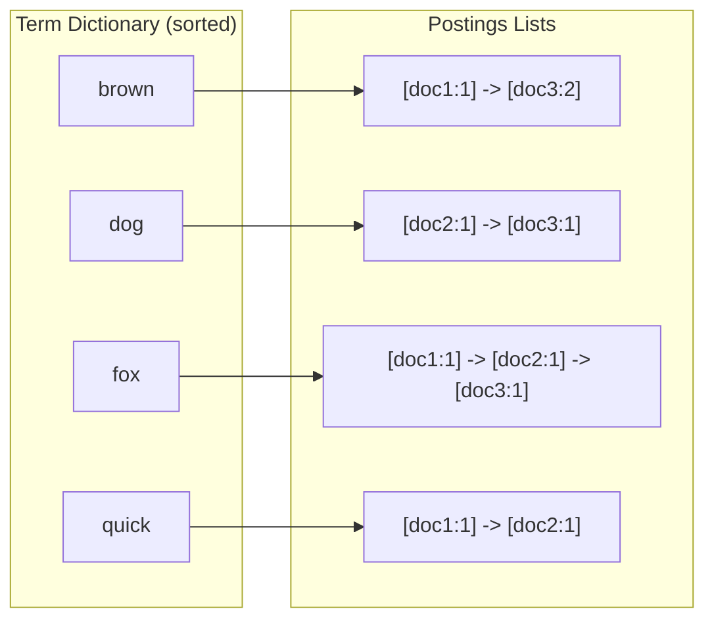
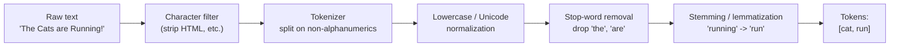
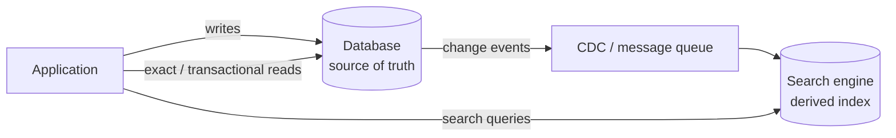

# Search & Indexing

Full-text search is the problem of finding documents that contain a set of words and returning them in order of *relevance*, fast, even across millions or billions of documents. This document builds the core ideas from scratch: the inverted index, the text-analysis pipeline, relevance ranking (TF-IDF and BM25), and how production systems like Apache Lucene, Elasticsearch, and OpenSearch package these ideas at scale.

---

## The Problem It Solves

Imagine a `documents` table in a relational database and a query like:

```sql
SELECT * FROM documents WHERE body LIKE '%database%';
```

This works for a toy dataset but breaks down quickly:

- **No index can help a leading wildcard.** A B-tree index on `body` orders rows by the *full* string value. `LIKE 'database%'` (prefix) can use it, but `LIKE '%database%'` (substring) cannot — the database must read and scan **every row**. This is an `O(N × L)` full-table scan (N rows, L average length).
- **No relevance ranking.** `LIKE` returns a boolean match/no-match. It cannot say document A is *more* about "database" than document B. There is no notion of "the word appears 12 times" or "this is a rare, meaningful word."
- **No linguistic understanding.** `LIKE '%run%'` will not match "running" or "ran", and it *will* wrongly match "runtime" and "overrun". It has no concept of word boundaries, stemming, synonyms, or case/accent folding.
- **No multi-term scoring.** Searching for `database indexing fast` as three independent terms, scoring documents by how many terms matched and how important each is, is awkward and slow with `LIKE`/`AND`/`OR` chains.

Full-text search engines solve this by **pre-computing an index keyed by words, not by rows**, so a query becomes a fast dictionary lookup plus a ranking computation — independent of total corpus size for the lookup itself.

---

## The Inverted Index

### Forward index vs inverted index

A **forward index** maps each document to the list of terms it contains. This is the "natural" layout — it is literally how you store documents.

```
doc1 -> [the, cat, sat, on, the, mat]
doc2 -> [the, dog, sat, on, the, log]
```

To answer "which documents contain `cat`?", a forward index forces you to scan every document's term list. That is the same scaling problem as `LIKE`.

An **inverted index** flips the mapping: each *term* points to the list of documents that contain it (its **postings list**).

```
cat -> [doc1]
sat -> [doc1, doc2]
dog -> [doc2]
```

Now "which documents contain `cat`?" is a single lookup. This inversion is the foundational trick of all search engines.

### Worked example

Take three small documents (already lowercased; stop words like "the"/"is" removed for clarity):

| Doc | Original text                              | Terms after analysis              |
|-----|--------------------------------------------|-----------------------------------|
| 1   | "The quick brown fox"                      | quick, brown, fox                 |
| 2   | "The quick fox jumps over the lazy dog"    | quick, fox, jumps, lazy, dog      |
| 3   | "Brown dog and brown fox"                  | brown, dog, brown, fox            |

The resulting inverted index stores, for each term, a postings list of `doc_id` along with the **term frequency** (how many times it appears in that doc) and optionally **positions** (token offsets, used for phrase queries):

```
TERM     POSTINGS  (doc_id: freq @positions)
-------  ------------------------------------------------
brown -> { 1: 1 @[1],  3: 2 @[0,3] }
dog   -> { 2: 1 @[4],  3: 1 @[2] }
fox   -> { 1: 1 @[2],  2: 1 @[1],  3: 1 @[4] }
jumps -> { 2: 1 @[2] }
lazy  -> { 2: 1 @[3] }
quick -> { 1: 1 @[0],  2: 1 @[0] }
```

The set of all unique terms is called the **dictionary** (or term dictionary / vocabulary). Each dictionary entry points to its postings list.

### Structure diagram



ASCII view of the same structure:

```
DICTIONARY            POSTINGS LISTS
+----------+          +-----------------------------------+
| brown    |--------> | doc1(f=1) -> doc3(f=2)            |
+----------+          +-----------------------------------+
| dog      |--------> | doc2(f=1) -> doc3(f=1)            |
+----------+          +-----------------------------------+
| fox      |--------> | doc1(f=1) -> doc2(f=1) -> doc3(f=1)|
+----------+          +-----------------------------------+
| quick    |--------> | doc1(f=1) -> doc2(f=1)            |
+----------+          +-----------------------------------+
```

Postings lists are kept **sorted by doc ID**. That makes intersecting two lists (for a boolean `AND`) a linear merge, and enables compression (delta/gap encoding: store differences between consecutive doc IDs instead of absolute IDs).

---

## Text Analysis Pipeline

Raw text cannot be indexed directly — `"Running"`, `"running"`, and `"RUN"` should usually be treated as the same searchable token. The **analyzer** (analysis pipeline) transforms a string into a stream of normalized **tokens**.



Stages:

1. **Tokenization** — split the text into candidate tokens, typically on whitespace and punctuation. `"e-mail, fast!"` -> `["e", "mail", "fast"]` (or `["e-mail", "fast"]` depending on the tokenizer). For languages without spaces (Chinese, Japanese) tokenization is much harder and uses dictionaries or n-grams.

2. **Normalization**
   - **Lowercasing**: `"Cat"` -> `"cat"`.
   - **Unicode normalization** (NFC/NFKC): collapse equivalent code-point sequences, fold accents (`"café"` -> `"cafe"`), so visually identical text matches consistently.

3. **Stop-word removal** — drop extremely common, low-information words (`the, is, a, and, of`). Saves index space and speeds queries, but loses information (e.g., "to be or not to be" becomes empty). Modern engines often *keep* stop words because BM25 already down-weights them and they matter for phrases.

4. **Stemming vs lemmatization** — reduce inflected forms to a common root:
   - **Stemming** (e.g., the **Porter stemmer**) applies crude suffix-stripping rules. Fast, language-specific, sometimes wrong: `"running" -> "run"`, but `"universe"/"university" -> "univers"` (collision), and stems need not be real words (`"happiness" -> "happi"`).
   - **Lemmatization** uses a dictionary and part-of-speech to find the true base form (**lemma**): `"better" -> "good"`, `"ran" -> "run"`. More accurate, slower, needs linguistic resources.

5. **N-grams** — break tokens or text into overlapping substrings.
   - **Character n-grams**: `"fox"` (3-grams) -> still `"fox"`; `"foxes"` -> `["fox","oxe","xes"]`. Enable fuzzy/substring/typo-tolerant matching.
   - **Edge n-grams**: prefixes only — `"fox"` -> `["f","fo","fox"]`. The backbone of autocomplete (see below).
   - **Word n-grams (shingles)**: `["quick","brown","fox"]` -> `["quick brown","brown fox"]`. Help phrase-like matching.

### Why the query must use the SAME analyzer

The index stores *analyzed* tokens. If documents are stemmed and lowercased to `run`, but a query for `"Running"` is matched literally, it will look up `Running`, find nothing, and return zero results. **The query string must pass through the same (or a compatible) analyzer** so it produces the same token form (`run`) and lands on the right postings list. Mismatched analyzers between index time and query time are one of the most common search bugs.

(Some engines deliberately use a *different but compatible* analyzer at search time — e.g., an `edge_ngram` analyzer when indexing but a plain analyzer when querying for autocomplete — but this is a careful, intentional choice, not the default.)

---

## Build an Inverted Index in Python

A self-contained, runnable implementation from scratch: a tokenizer, an `InvertedIndex` with boolean `AND` search and TF-IDF ranking.

```python
import math
import re
from collections import defaultdict

# ----------------------------------------------------------------------
# 1. Tokenizer / analyzer
# ----------------------------------------------------------------------

STOP_WORDS = {
    "a", "an", "and", "are", "as", "at", "be", "by", "for", "from",
    "in", "is", "it", "of", "on", "or", "that", "the", "to", "was", "with",
}


def _crude_stem(token):
    """A tiny, deliberately simple stemmer (NOT the full Porter algorithm).

    Real systems use the Porter/Snowball stemmer. This only strips a few
    common English suffixes so the demo shows the idea.
    """
    for suffix in ("ingly", "ing", "edly", "ed", "ies", "es", "s", "ly"):
        if len(token) > len(suffix) + 2 and token.endswith(suffix):
            return token[: -len(suffix)]
    return token


def analyze(text, *, remove_stop=True, stem=True):
    """Turn raw text into a list of normalized tokens.

    Steps: lowercase -> split on non-alphanumerics -> drop stop words
    -> optional crude stemming. The SAME function is used for both
    indexing and querying, guaranteeing matching token forms.
    """
    text = text.lower()
    # split on anything that is not a letter or digit
    raw_tokens = re.findall(r"[a-z0-9]+", text)
    tokens = []
    for tok in raw_tokens:
        if remove_stop and tok in STOP_WORDS:
            continue
        tokens.append(_crude_stem(tok) if stem else tok)
    return tokens


# ----------------------------------------------------------------------
# 2. Inverted index
# ----------------------------------------------------------------------

class InvertedIndex:
    def __init__(self):
        # term -> {doc_id: term_frequency}
        self.postings = defaultdict(dict)
        # doc_id -> number of tokens in the document (for length norm)
        self.doc_lengths = {}
        # original text, handy for displaying results
        self.documents = {}
        self.doc_count = 0

    def add_document(self, doc_id, text):
        tokens = analyze(text)
        self.documents[doc_id] = text
        self.doc_lengths[doc_id] = len(tokens)
        self.doc_count += 1

        # term frequency within this document
        tf = defaultdict(int)
        for tok in tokens:
            tf[tok] += 1
        for term, freq in tf.items():
            self.postings[term][doc_id] = freq

    def document_frequency(self, term):
        """How many documents contain the term."""
        return len(self.postings.get(term, {}))

    # ------------------------------------------------------------------
    # 3. Boolean AND search
    # ------------------------------------------------------------------
    def search_and(self, query):
        """Return the set of doc_ids containing ALL query terms."""
        terms = analyze(query)
        if not terms:
            return set()
        # start from the rarest term's postings (smallest list) for efficiency
        terms.sort(key=self.document_frequency)
        result = set(self.postings.get(terms[0], {}).keys())
        for term in terms[1:]:
            result &= set(self.postings.get(term, {}).keys())
            if not result:
                break
        return result

    # ------------------------------------------------------------------
    # 4. TF-IDF ranking
    # ------------------------------------------------------------------
    def _idf(self, term):
        """Inverse document frequency with smoothing.

        idf = ln( (N + 1) / (df + 1) ) + 1   (always positive)
        """
        df = self.document_frequency(term)
        return math.log((self.doc_count + 1) / (df + 1)) + 1.0

    def search(self, query, top_k=10):
        """Rank documents by summed TF-IDF over the query terms.

        Uses OR semantics for recall (any matching term contributes),
        which is the common default for relevance ranking. Score for a
        document = sum over query terms of  tf(term, doc) * idf(term).
        """
        terms = analyze(query)
        scores = defaultdict(float)
        for term in terms:
            idf = self._idf(term)
            for doc_id, tf in self.postings.get(term, {}).items():
                scores[doc_id] += tf * idf
        ranked = sorted(scores.items(), key=lambda kv: kv[1], reverse=True)
        return ranked[:top_k]


# ----------------------------------------------------------------------
# 5. Demo
# ----------------------------------------------------------------------

if __name__ == "__main__":
    index = InvertedIndex()
    corpus = {
        1: "The quick brown fox",
        2: "The quick fox jumps over the lazy dog",
        3: "Brown dog and brown fox running fast",
        4: "Databases store rows; search engines store inverted indexes",
    }
    for doc_id, text in corpus.items():
        index.add_document(doc_id, text)

    print("Boolean AND  'brown fox' ->", sorted(index.search_and("brown fox")))
    print("Boolean AND  'quick dog' ->", sorted(index.search_and("quick dog")))

    print("\nRanked search for 'brown fox':")
    for doc_id, score in index.search("brown fox"):
        print(f"  doc{doc_id}  score={score:.4f}  | {index.documents[doc_id]}")

# ----------------------------------------------------------------------
# Example output (scores depend on the smoothing constants above):
#
# Boolean AND  'brown fox' -> [1, 3]
# Boolean AND  'quick dog' -> [2]
#
# Ranked search for 'brown fox':
#   doc3  score=3.0530  | Brown dog and brown fox running fast
#   doc1  score=2.0265  | The quick brown fox
#   doc2  score=1.0000  | The quick fox jumps over the lazy dog
#
# doc3 ranks first because "brown" appears twice (tf=2) and "brown" is
# rarer than "fox" (higher idf).
# ----------------------------------------------------------------------
```

The code is correct and runnable as-is. It demonstrates: a shared analyzer, postings storing `{doc_id: term_frequency}`, doc-length tracking, boolean `AND` (intersection of postings, starting from the rarest term), and additive TF-IDF ranking.

---

## Ranking: TF-IDF & BM25

Boolean matching tells you *whether* a document matches. **Ranking** tells you *how well*. Two classic schemes:

### TF-IDF

The intuition: a term is important to a document if it appears **often in that document** (term frequency) but **rarely across the corpus** (inverse document frequency).

- **Term Frequency (TF)** — count of term `t` in document `d`. Often dampened (e.g., `1 + log(tf)`) so the 100th occurrence matters less than the 2nd.
- **Inverse Document Frequency (IDF)** — penalizes common terms. With `N` total documents and `df(t)` documents containing `t`:

  ```
  idf(t) = log( N / df(t) )           (basic form)
  idf(t) = log( (N + 1) / (df(t)+1) ) + 1   (smoothed, used in the code)
  ```

  A word in every document has `idf ≈ 0` (contributes nothing); a rare word has a high `idf`.

- **TF-IDF score** of a document for a query is the sum over query terms:

  ```
  score(q, d) = Σ  tf(t, d) · idf(t)
              t∈q
  ```

TF-IDF is simple and effective, but raw `tf` grows without bound (a document repeating a word 1000 times scores absurdly high) and it has no principled length normalization (long documents naturally contain more term occurrences).

### BM25 (Okapi BM25)

BM25 fixes both problems and is the modern default (used by **Lucene**, **Elasticsearch**, and **OpenSearch**). For a document `d`, query term `t`, with term frequency `f(t,d)`:

```
                            f(t,d) · (k1 + 1)
score(q,d) = Σ idf(t) · ----------------------------------------
            t∈q          f(t,d) + k1 · (1 - b + b · |d| / avgdl)
```

Where:

- `idf(t)` — usually `ln( (N - df + 0.5) / (df + 0.5) + 1 )` (the `+1` keeps it non-negative).
- `f(t,d)` — term frequency of `t` in `d`.
- `|d|` — length of document `d` (in tokens); `avgdl` — average document length in the corpus.
- **`k1`** (typically `1.2`) — controls **term-frequency saturation**. As `f(t,d)` grows, the contribution approaches a ceiling of `idf · (k1+1)` instead of growing linearly. Higher `k1` = slower saturation. This is BM25's key advantage over TF-IDF: the 10th occurrence of a word adds far less than the 2nd.
- **`b`** (typically `0.75`, range `0..1`) — controls **length normalization**. `b = 0` disables it; `b = 1` fully normalizes by document length, so a term hit in a short document counts more than the same hit in a long, padded document.

### Comparison

| Aspect                     | TF-IDF                          | BM25                                            |
|----------------------------|---------------------------------|-------------------------------------------------|
| TF handling                | Linear (or `log`), unbounded    | Saturating (`k1`), bounded contribution         |
| Length normalization       | Ad hoc / cosine norm needed     | Built-in, tunable via `b`                        |
| Tunable parameters         | Few                             | `k1`, `b`                                        |
| Production use             | Classic / educational           | Default in Lucene, Elasticsearch, OpenSearch    |
| Behavior on term spamming  | Easily gamed                    | Robust (saturation caps the gain)               |

In practice BM25 produces noticeably better rankings on real corpora, which is why it replaced TF-IDF as Lucene's default scoring (Lucene 6.0+, 2016).

---

## Phrase & Proximity Queries

Boolean and ranked search treat a query as a *bag of words* — order does not matter, so `"new york"` matches a document containing "york" and "new" anywhere. A **phrase query** `"new york"` should match only documents where the words appear **adjacent and in order**.

This is why postings can store **positions** (token offsets), not just doc IDs and frequencies:

```
new  -> { doc7: [3, 41] }     # "new" at positions 3 and 41
york -> { doc7: [4, 90] }     # "york" at positions 4 and 90
```

**Phrase matching idea:** intersect the documents that contain *all* phrase terms, then for each candidate doc check whether there exist positions `p1, p2, ...` such that the terms appear consecutively. For the two-word phrase above, look for a position `p` in `new`'s list such that `p + 1` exists in `york`'s list. Here `new@3` and `york@4` -> adjacent -> match. `new@41` has no `york@42`, so that occurrence does not match.

**Proximity (slop) queries** generalize this: `"machine learning"~3` matches if the terms appear within 3 positions of each other (in any order, depending on settings), implemented by allowing a position gap up to the slop value during the same positional intersection.

Storing positions makes the index larger, which is the trade-off for supporting phrase and proximity search.

---

## Elasticsearch / OpenSearch & Apache Lucene

### Apache Lucene — the engine underneath

**Lucene** is the Java library that actually implements inverted indexes, analyzers, BM25 scoring, and query execution. Elasticsearch and OpenSearch are distributed servers *built on top of Lucene* — each shard is a Lucene index.

Key Lucene concepts:

- **Segments** — a Lucene index is split into segments, each a self-contained mini inverted index. New documents are buffered in memory and flushed to a new segment.
- **Immutable segment files** — once written, a segment is **never modified**. This makes them cache-friendly, safe to read without locking, and simple to replicate. A "delete" just marks the doc in a separate tombstone bitset; an "update" = delete + re-insert into a new segment.
- **Near-real-time (NRT) refresh** — newly indexed docs are not searchable until a **refresh** makes a new segment visible (Elasticsearch default: every `1s`). Hence search is *near*-real-time, not instant — there is a small visibility lag.
- **Merging** — many small segments hurt query speed and accumulate deleted docs. A background **merge** combines smaller segments into larger ones and physically drops deleted documents. This trades I/O for steadier query performance.

### Elasticsearch / OpenSearch — the distributed layer

- An **index** is a logical collection of documents, split into **shards** (each shard = one Lucene index). Sharding enables horizontal scale; queries fan out to all shards and results are merged.
- **Replicas** are copies of shards for high availability and read throughput.
- **Inverted index per shard** — each shard maintains its own inverted index, dictionary, and BM25 statistics.
- **Mapping & analyzers** — the *mapping* defines field types and which analyzer each text field uses at index and search time (mirroring the analysis-pipeline section above).
- **OpenSearch** is the Apache-2.0-licensed community fork of Elasticsearch, created and backed by AWS after Elasticsearch changed its license (2021). The two share Lucene heritage and are largely API-compatible for core search, though they have diverged over time.

A minimal **query DSL** example (JSON):

```json
{
  "query": {
    "bool": {
      "must": [
        { "match": { "title": "inverted index" } }
      ],
      "filter": [
        { "term": { "status": "published" } },
        { "range": { "year": { "gte": 2020 } } }
      ]
    }
  },
  "size": 10
}
```

Here `must.match` runs analyzed, scored full-text matching (contributes to BM25 relevance), while `filter` clauses are non-scoring boolean constraints (cacheable, faster). This cleanly separates "relevance" from "filtering."

---

## Search vs Database Queries

| Dimension              | Relational Database (B-tree)            | Search Engine (inverted index)                 |
|------------------------|-----------------------------------------|------------------------------------------------|
| Core index             | B-tree / hash on column values          | Inverted index (term -> postings)              |
| Best at                | Exact match, range scans, joins, sorts  | Full-text match, relevance ranking             |
| Substring/`%term%`     | Full scan (no index help)               | Native, fast                                   |
| Relevance scoring      | None (boolean match)                    | TF-IDF / BM25, ranked results                  |
| Fuzzy / typo tolerance | None / extensions only                  | Edit distance, n-grams, fuzzy queries          |
| Linguistic analysis    | None                                    | Analyzers: stemming, stop words, synonyms      |
| Consistency model      | Strong, ACID transactions               | Eventually consistent, NRT (refresh lag)       |
| Updates                | In-place, transactional                 | Immutable segments + merges                    |
| Aggregations           | `GROUP BY`, exact                       | Facets/aggregations (often approximate)        |

**When to use which:**

- Use the **database** as the **source of truth**: it gives ACID guarantees, transactional integrity, and efficient point/range lookups by primary or foreign key.
- Use the **search engine** as a **derived index** for full-text, relevance-ranked, fuzzy, and faceted queries.

**Common pattern — DB as source of truth + search engine kept in sync:**



The search index is rebuilt from the database, so it is **disposable and reconstructable**. Keeping it in sync has two common approaches and a caveat:

- **Dual-write** (app writes to DB *and* search engine): simple but not atomic — a crash between the two writes leaves them inconsistent. Avoid as the primary mechanism.
- **Change Data Capture (CDC)** (stream the DB's commit log/outbox into the search index): more reliable, decoupled, and the preferred approach. Combine with an **outbox table** to make the DB write and the event publish atomic.
- **Caveat:** because of refresh lag and async replication, expect **eventual consistency** — a freshly written row may not appear in search results for a short window.

---

## Autocomplete / Typeahead (Intro)

Autocomplete returns suggestions as the user types a prefix (`"data"` -> `"databases"`, `"data structures"`, `"dataframe"`). Common approaches:

- **Prefix queries** (`LIKE 'data%'` or a search-engine `prefix` query) — works, but can be slow over large vocabularies and doesn't pre-rank.
- **Edge n-grams** — at index time, index `["d","da","dat","data","datab", ...]` for each term. Then a plain lookup of the typed prefix is an exact-match query against the postings — fast, scales well, costs extra index size.
- **Completion suggester (FST)** — Lucene's suggester stores terms in a **Finite State Transducer**, a compact automaton enabling extremely fast in-memory prefix traversal with weights for ranking.
- **Trie (prefix tree)** — an in-memory tree where each path from the root spells a prefix; nodes at word boundaries hold completions and a popularity score. Traverse to the prefix node, then collect/rank descendant words.

**Ranking** suggestions is usually by **popularity** (query/click frequency), not text relevance — people want the *most likely* completion, not the most textually similar.

A trie for `cat`, `car`, `card`, `dog`:

```
        (root)
        /    \
       c      d
       |      |
       a      o
      / \     |
     t*  r    g*
         |
         d*      (* = end of a valid word)
```

Typing `"ca"` walks `root -> c -> a`, then collects descendants: `cat`, `car`, `card`, ranked by popularity.

This is just an introduction; for end-to-end design (data partitioning, ranking pipelines, update strategy, caching, scale estimation) see the dedicated typeahead system-design exercise.

---

## Trade-offs

- **Index size vs query speed** — storing positions enables phrase queries but enlarges the index; edge n-grams make autocomplete fast but multiply token counts; more analysis (synonyms, n-grams) improves recall at storage/compute cost.
- **Freshness vs throughput** — NRT refresh interval is a dial: shorter refresh = fresher results but more segments and more merge work; longer refresh = higher indexing throughput but more visibility lag.
- **Relevance tuning is never "done"** — BM25 `k1`/`b`, field boosts, analyzers, synonyms, and stop-word choices all affect ranking quality and require evaluation against real queries (precision/recall, click metrics, A/B tests).
- **Eventual consistency between DB and search index** — the derived index lags the source of truth; designs must tolerate stale or briefly-missing results, and need a reliable sync mechanism (CDC/outbox) plus the ability to fully rebuild the index.
- **Recall vs precision** — aggressive stemming/fuzzy matching finds more documents (recall) but introduces false matches (precision); these must be balanced per use case.
- **Memory vs disk** — FSTs/tries for autocomplete and term dictionaries are fast in memory but compete for RAM with the OS page cache that keeps hot segments fast.

---

## Key Takeaways

- A database `LIKE '%term%'` scan cannot scale for full-text search and offers no relevance ranking; search engines precompute an **inverted index** keyed by terms.
- The **inverted index** maps `term -> postings list` (doc IDs, term frequencies, optional positions); it is built and queried through the **same analyzer**.
- The **analysis pipeline** (tokenize, normalize, stop words, stem/lemmatize, n-grams) determines what is searchable — query and index must use compatible analyzers or results silently break.
- **TF-IDF** ranks by term frequency × inverse document frequency; **BM25** adds term-frequency saturation (`k1`) and length normalization (`b`) and is the modern default in Lucene/Elasticsearch/OpenSearch.
- **Positions** in postings enable **phrase and proximity** queries.
- **Lucene** provides the inverted index, immutable **segments**, NRT **refresh**, and **merging**; **Elasticsearch/OpenSearch** add distribution (indices, shards, replicas, mappings). **OpenSearch** is the community/AWS fork of Elasticsearch.
- Use the **database as the source of truth** and the **search engine as a derived, reconstructable index**, kept in sync via **CDC/outbox** (not raw dual-writes), accepting **eventual consistency**.
- **Autocomplete** uses prefix queries, edge n-grams, FST completion suggesters, or tries, typically ranked by **popularity**.
