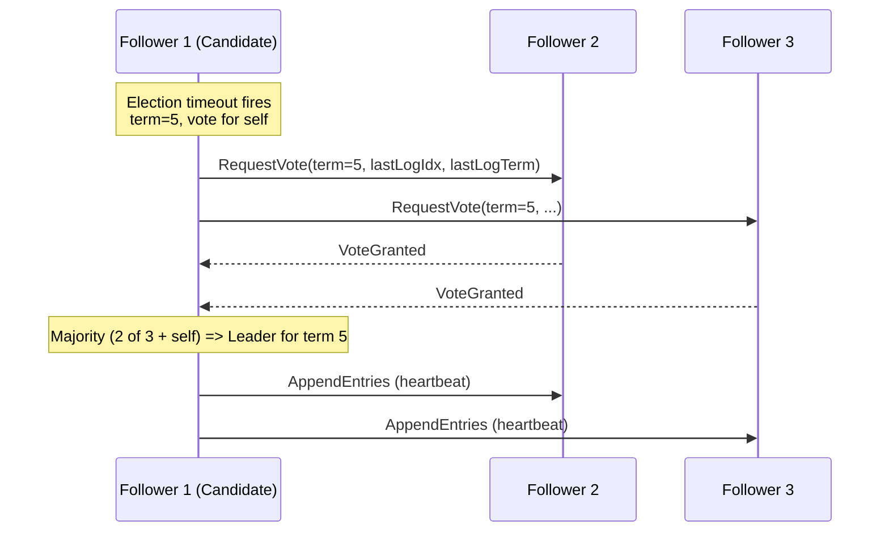
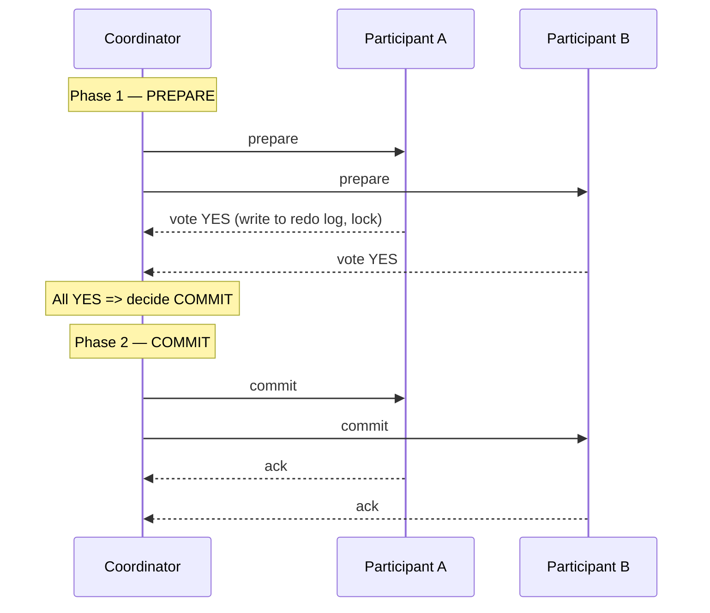

# Distributed Systems Fundamentals

> **Scope:** What makes distributed systems hard, time & ordering, consensus (Paxos & Raft), leader election, distributed transactions (2PC & Saga), idempotency & exactly-once, and distributed locks.

---

## 1. Introduction

A **distributed system** is a collection of independent computers (nodes) that communicate over a network and present themselves to the user as a single coherent system. Examples: a database cluster, a microservices backend, a CDN, Kafka, Cassandra, Kubernetes.

We build them because a single machine eventually hits a wall:

| Motivation | Single machine limit | Distributed answer |
|---|---|---|
| **Scalability** | CPU/RAM/disk ceiling | Add more nodes (horizontal scaling) |
| **Availability** | One machine = one point of failure | Replicate across nodes/zones |
| **Latency** | Far from users | Place data/compute near users |
| **Durability** | One disk can die | Replicate data |

The catch: the moment you split work across a network, you inherit a category of problems that simply do not exist on a single machine.

---

## 2. Why Distributed Systems Are Hard

### 2.1 Partial failure

On one machine, code either runs or the machine is down — binary. In a distributed system, **some nodes fail while others keep running**, and the survivors often *cannot tell the difference* between:

- a node that crashed,
- a node that is slow,
- a network link that dropped the message.

This ambiguity is the root of most distributed-systems difficulty. A request that times out may have:
1. never arrived,
2. arrived but the response was lost,
3. been processed twice.

You can never be 100% sure which happened. This forces designs around **idempotency**, **retries**, and **timeouts** (covered later and in `15_reliability_availability.md`).

### 2.2 No global clock

There is no single, shared "now." Each node has its own clock, and clocks drift. You **cannot** reliably order events across machines by wall-clock time. NTP synchronizes clocks only to within milliseconds-to-tens-of-milliseconds, which is an eternity for ordering closely-spaced events. (See §3 on logical clocks.)

### 2.3 The network is unreliable

Messages can be lost, duplicated, delayed, or reordered. Bandwidth is finite; latency is non-zero and variable.

### 2.4 The Fallacies of Distributed Computing

A famous list (Deutsch & Gosling, Sun Microsystems) of false assumptions engineers keep making:

| # | Fallacy | Reality |
|---|---|---|
| 1 | The network is reliable | Packets drop; links partition |
| 2 | Latency is zero | Round trips cost milliseconds-to-seconds |
| 3 | Bandwidth is infinite | Pipes saturate; payload size matters |
| 4 | The network is secure | Assume hostile networks (see `17_security.md`) |
| 5 | Topology doesn't change | Nodes join/leave; routes shift |
| 6 | There is one administrator | Many teams/clouds/orgs |
| 7 | Transport cost is zero | Serialization, NICs, encryption all cost |
| 8 | The network is homogeneous | Mixed hardware, protocols, versions |

> **Takeaway:** Design as if every one of these is false, because each one is.

### 2.5 The CAP theorem (brief)

When a network **P**artition happens, you must choose between **C**onsistency (every read sees the latest write) and **A**vailability (every request gets a non-error response). You cannot have both during a partition.

```
                  Partition occurs
                        │
            ┌───────────┴───────────┐
        choose C                 choose A
   (reject/block requests)   (serve possibly stale data)
     e.g. CP systems            e.g. AP systems
   (HBase, etcd, ZK)        (Cassandra, Dynamo def.)
```

In the absence of partitions, you trade **latency vs consistency** (the PACELC extension).

---

## 3. Time and Ordering

Since there's no global clock, we use **logical clocks** to capture *causality* ("happened-before") rather than real time.

### 3.1 The happened-before relation (→)

Defined by Leslie Lamport:
- If `a` and `b` are in the same process and `a` occurs first, then `a → b`.
- If `a` is a *send* and `b` is the matching *receive*, then `a → b`.
- Transitive: if `a → b` and `b → c`, then `a → c`.

If neither `a → b` nor `b → a`, the events are **concurrent** — there is genuinely no defined order.

### 3.2 Lamport timestamps

A single integer counter per process gives a total-ish ordering consistent with causality.

**Rules:**
1. Increment local counter before each event.
2. On send, attach the counter.
3. On receive, set `local = max(local, received) + 1`.

```python
class LamportClock:
    def __init__(self):
        self.time = 0

    def tick(self):          # local event
        self.time += 1
        return self.time

    def send(self):          # before sending a message
        self.time += 1
        return self.time     # piggyback this on the message

    def recv(self, received_ts):
        self.time = max(self.time, received_ts) + 1
        return self.time
```

**Guarantee:** if `a → b` then `LC(a) < LC(b)`.
**Limitation:** the converse is NOT true. `LC(a) < LC(b)` does not imply `a → b` — they might be concurrent. Lamport clocks cannot *detect* concurrency.

### 3.3 Vector clocks

A vector of counters, one entry per process. They **can** detect concurrency.

**Rules** (process `i`):
1. On local event: `V[i] += 1`.
2. On send: increment then attach the whole vector.
3. On receive: element-wise `V[k] = max(V[k], recv[k])` for all `k`, then `V[i] += 1`.

**Comparison:**
- `V(a) < V(b)` (every element ≤, at least one strictly <) ⟹ `a → b` (a causally precedes b).
- Neither dominates ⟹ **concurrent** (a conflict — e.g., two simultaneous edits).

```
Process A: [1,0,0] --send--> ...
Process B:        recv -> [1,1,0]
Compare [1,0,0] vs [1,1,0]:  A's < B's  =>  A happened-before B

But [2,0,0] vs [0,0,1]: neither dominates => CONCURRENT
```

| Clock | Detects causality | Detects concurrency | Size |
|---|---|---|---|
| Lamport | Partial (one direction) | No | O(1) |
| Vector | Yes | Yes | O(N) nodes |

Vector clocks power conflict detection in systems like Dynamo and Riak (siblings).

---

## 4. Consensus

**The problem:** get a set of nodes to *agree on a single value* (or an ordered sequence of values), even when some nodes fail and messages are delayed. This underpins leader election, distributed locks, atomic commit, replicated state machines, and configuration stores (etcd, ZooKeeper, Consul).

A correct consensus algorithm guarantees:
- **Agreement:** no two correct nodes decide different values.
- **Validity:** the decided value was proposed by some node.
- **Termination:** every correct node eventually decides.

> **FLP impossibility:** in a fully asynchronous system with even one faulty process, no deterministic algorithm can guarantee *all three*. Real systems sidestep this with timeouts/randomization (i.e., they give up perfect termination guarantees during pathological timing).

### 4.1 Paxos (overview)

Paxos (Lamport) solves consensus but is famously hard to understand and implement. Roles: **Proposers**, **Acceptors**, **Learners**. Single-decree Paxos has two phases:

1. **Prepare/Promise:** a proposer picks a proposal number `n`, asks a majority of acceptors to *promise* not to accept anything lower; acceptors reply with any value they've already accepted.
2. **Accept/Accepted:** the proposer sends `accept(n, value)`; if a majority accept, the value is chosen.

Multi-Paxos optimizes the steady state by electing a stable leader so you skip Phase 1 each round. It works, it's proven correct — but its subtlety motivated Raft.

### 4.2 Raft (explained)

Raft was designed for **understandability** while being equivalent in power to Multi-Paxos. It decomposes consensus into three subproblems:

1. **Leader election**
2. **Log replication**
3. **Safety**

#### Node states & terms

Each node is in one of three states. Time is divided into **terms** (monotonically increasing integers); each term has at most one leader.

```
            times out, starts election
   ┌──────────────────────────────────────────┐
   │                                            ▼
┌──────────┐  wins majority   ┌────────┐   discovers higher term  ┌───────────┐
│ Follower │ ───────────────► │Candidate│ ───────────────────────►│ Follower  │
└──────────┘                  └────────┘                          └───────────┘
   ▲                              │ wins
   │ discovers current leader      ▼
   │ or higher term           ┌────────┐
   └──────────────────────────│ Leader │
                              └────────┘
```

#### Leader election

- Followers expect periodic **heartbeats** (empty `AppendEntries`) from the leader.
- If a follower hears nothing within its **randomized election timeout** (e.g., 150–300 ms), it becomes a **Candidate**, increments the term, votes for itself, and sends `RequestVote` RPCs.
- A node grants its vote if it hasn't voted this term **and** the candidate's log is at least as up-to-date.
- A candidate that gets a **majority** becomes Leader and starts sending heartbeats.
- **Randomized timeouts** make split votes rare; if one happens, terms increment and a new election retries.



#### Log replication

Once elected, the leader serves all client writes:

1. Client sends a command to the **leader**.
2. Leader appends it to its log as a new entry (uncommitted) and sends `AppendEntries` to followers.
3. When a **majority** have written the entry to their logs, the leader marks it **committed**, applies it to its state machine, and replies to the client.
4. Followers learn of the commit on the next `AppendEntries` and apply it too.

```
Leader log:   [1:x=1][2:y=2][3:z=3]    <- index:command
                                  └─ replicated to majority => COMMITTED, apply
Follower A:   [1:x=1][2:y=2][3:z=3]
Follower B:   [1:x=1][2:y=2]           <- catching up; leader retries AppendEntries
```

**Log Matching property:** `AppendEntries` includes the index & term of the *preceding* entry. A follower rejects the append if its log doesn't match there, and the leader backs up and retries until logs converge. This guarantees that if two logs share an entry at the same index+term, all preceding entries are identical.

**Election restriction (safety):** a candidate cannot win unless its log contains all committed entries. Voters refuse candidates with stale logs. This guarantees a new leader never overwrites committed data.

> Used by: **etcd** (and thus Kubernetes), **Consul**, **CockroachDB**, **TiKV**, **MongoDB** (Raft-like).

---

## 5. Leader Election (general)

Beyond Raft, "elect one coordinator" is a recurring need (e.g., which replica is primary, which worker owns a shard). Approaches:

| Mechanism | How | Used by |
|---|---|---|
| **Consensus-based** | Raft/Paxos elects leader as part of protocol | etcd, Consul |
| **Lease / lock on a store** | Acquire a TTL lease in etcd/ZK/Redis; holder is leader | Kubernetes leader-election |
| **Bully algorithm** | Highest-ID live node wins | classic textbook |
| **ZooKeeper ephemeral znodes** | Lowest sequential ephemeral node is leader; watch predecessor | Kafka (older), HBase |

**Key requirement:** avoid **split brain** (two leaders). Solutions: require a majority quorum, use **fencing tokens** (monotonic numbers so stale leaders are rejected — see §8).

---

## 6. Distributed Transactions

A transaction spanning multiple services/databases needs atomicity: all-or-nothing across nodes.

### 6.1 Two-Phase Commit (2PC)

A **coordinator** drives all **participants** to a unanimous decision.



- **Phase 1 (Prepare/Vote):** coordinator asks each participant to prepare; each durably logs the change and votes YES (and *locks* resources) or NO.
- **Phase 2 (Commit/Abort):** if all voted YES, coordinator says COMMIT; otherwise ABORT. Participants finalize and release locks.

**The blocking problem:** if the **coordinator crashes after participants voted YES but before sending the decision**, participants are stuck holding locks indefinitely — they've promised to commit but can't decide alone. 2PC is therefore a *blocking* protocol and a single point of failure at the coordinator. (3PC adds a phase to reduce blocking but assumes synchronous timing and is rarely used.)

2PC also scales poorly: it holds locks across the network round trips, hurting throughput and availability. Hence microservices favor **Sagas**.

### 6.2 The Saga Pattern

A **Saga** is a sequence of **local** transactions. Each local transaction updates one service and publishes an event/message that triggers the next. If a step fails, the saga runs **compensating transactions** to semantically undo the prior steps. There is **no distributed lock** and no global atomicity — instead you get **eventual consistency** with explicit rollback logic.

> Compensation is *semantic* undo, not a rollback: you can't un-send an email, so you send a cancellation; you can't un-charge necessarily, so you refund.

#### Choreography vs Orchestration

```
CHOREOGRAPHY (events, no central brain)
  Order  --OrderCreated-->  Payment  --PaymentDone-->  Inventory  --Reserved-->  Shipping
   ^                                                                                 |
   └────────────────────── on failure: emit compensating events ────────────────────┘

ORCHESTRATION (central coordinator issues commands)
                 ┌───────────────── Orchestrator ─────────────────┐
                 │  1.charge  2.reserve  3.ship  (else: compensate)│
                 └───┬───────────┬───────────┬─────────────────────┘
                  Payment     Inventory    Shipping
```

| | Choreography | Orchestration |
|---|---|---|
| Control | Decentralized, event-driven | Central orchestrator |
| Coupling | Loose; services emit/listen | Services coupled to orchestrator |
| Visibility | Hard to see whole flow | Flow explicit in one place |
| Best for | Few steps, simple flows | Complex flows, many steps |
| Risk | Cyclic event spaghetti | Orchestrator becomes a bottleneck/SPOF |

#### Orchestrated saga example (Python)

```python
class SagaStep:
    def __init__(self, action, compensation):
        self.action = action            # callable -> may raise
        self.compensation = compensation  # callable to undo

class SagaOrchestrator:
    def __init__(self, steps):
        self.steps = steps

    def execute(self, ctx):
        completed = []
        try:
            for step in self.steps:
                step.action(ctx)
                completed.append(step)   # remember for rollback
            return "COMMITTED"
        except Exception as e:
            # Run compensations in REVERSE order
            for step in reversed(completed):
                try:
                    step.compensation(ctx)
                except Exception:
                    # Compensation must itself be retried/idempotent;
                    # log and alert — this is the hardest part of sagas.
                    pass
            return f"ROLLED_BACK: {e}"

# --- order workflow ---
def charge(ctx):    ctx["payment_id"] = payment.charge(ctx["user"], ctx["amount"])
def refund(ctx):    payment.refund(ctx["payment_id"])

def reserve(ctx):   ctx["resv_id"] = inventory.reserve(ctx["sku"], ctx["qty"])
def release(ctx):   inventory.release(ctx["resv_id"])

def ship(ctx):      ctx["ship_id"] = shipping.create(ctx["order_id"])
# (shipping is the last step here; if it failed we'd compensate prior steps)

saga = SagaOrchestrator([
    SagaStep(charge,  refund),
    SagaStep(reserve, release),
    SagaStep(ship,    lambda ctx: None),
])
result = saga.execute({"user": "u1", "amount": 50, "sku": "ABC", "qty": 2, "order_id": "o99"})
```

If `reserve` fails, the orchestrator calls `refund` to compensate the completed `charge`. Note compensations run in reverse and must be **idempotent** (they may be retried).

---

## 7. Idempotency & Exactly-Once

Because retries are unavoidable (§2.1), an operation may be delivered more than once. **Idempotency** means processing a request twice has the same effect as processing it once.

- `SET balance = 100` is idempotent. `balance = balance + 100` is **not**.
- Pattern: client sends an **idempotency key** (UUID); server records processed keys and ignores duplicates.

```python
def charge_once(idempotency_key, amount):
    # Atomic insert; unique constraint on idempotency_key
    if store.exists(idempotency_key):
        return store.get_result(idempotency_key)   # return prior result
    result = payment_gateway.charge(amount)
    store.save(idempotency_key, result)            # persist before returning
    return result
```

**"Exactly-once" is a myth at the network layer** — you cannot guarantee a message is *delivered* exactly once. What you *can* achieve is **exactly-once processing (effective semantics)** = at-least-once delivery + idempotent handlers (or deduplication). This is how Kafka's "exactly-once semantics," idempotent producers, and transactional outbox patterns actually work.

| Delivery guarantee | Meaning | Cost |
|---|---|---|
| At-most-once | May be lost, never duplicated | Cheapest, lossy |
| At-least-once | Never lost, may duplicate | Needs idempotent consumers |
| Exactly-once (effective) | No loss, no visible duplicate | At-least-once + dedup/idempotency |

---

## 8. Distributed Locks

A distributed lock lets only one node hold a resource across machines. Common implementations use a store with TTLs (Redis, etcd, ZooKeeper).

Naive Redis lock:
```
SET lock:resource <random_token> NX PX 30000   # set if-not-exists, 30s expiry
# ... do work ...
# release ONLY if token matches (Lua script for atomicity)
```
The random token + check-before-delete prevents you from releasing *someone else's* lock after your TTL expired.

### 8.1 Redlock and its caveats

**Redlock** is an algorithm to acquire a lock across N independent Redis masters (acquire on a majority within a time bound). It improves on a single-instance lock, but it is **controversial** (Martin Kleppmann's critique):

1. **Clock dependence:** Redlock's safety relies on bounded clock drift across nodes. A clock jump (NTP step, VM pause, GC stall) can let two clients believe they hold the lock simultaneously.
2. **GC pauses / process stalls:** a client can acquire a lock, pause (long GC or VM freeze) past the TTL, the lock expires and is granted to another client, then the first client wakes and acts — **two holders**.
3. **It is not a consensus system.** For correctness-critical locking you want a system with a real consensus log (etcd/ZooKeeper) and, crucially, **fencing tokens**.

### 8.2 Fencing tokens (the real fix)

Each lock grant returns a **monotonically increasing token**. The protected resource (e.g., storage) rejects any write carrying a token lower than the highest it has seen. So even if an old holder wakes up, its stale token is rejected.

```
Client A gets lock, token=33 ──pause─────────────► writes with token 33  (REJECTED, < 34)
Client B gets lock, token=34 ──► writes with token 34  (accepted; storage now expects >=34)
```

> **Takeaway:** Use distributed locks for *efficiency* (avoid duplicate work) freely; for *correctness* (must never double-execute), prefer a consensus store **plus** fencing tokens, and/or make the operation idempotent so a double-execute is harmless.

---

## 9. Key Takeaways

- **Partial failure + no global clock + unreliable network** are the irreducible hard core of distributed systems; the *fallacies of distributed computing* enumerate the wrong assumptions to avoid.
- Order events by **causality** (Lamport / vector clocks), not wall-clock time. Vector clocks can detect concurrency; Lamport clocks cannot.
- **Consensus** (agreement on a value/log) is foundational; **Raft** makes it understandable via leader election, log replication, and safety rules. FLP says perfect consensus is impossible in pure async — real systems use timeouts.
- Avoid split-brain with **majority quorums** and **fencing tokens**.
- **2PC** gives atomicity but blocks if the coordinator dies; microservices prefer **Sagas** (local transactions + compensations, eventual consistency) in choreography or orchestration style.
- Networks force retries; design **idempotent** operations. "Exactly-once" is achieved as at-least-once delivery + idempotent/deduplicating processing.
- **Redlock** has clock/pause caveats; correctness-critical locking needs consensus + fencing tokens or idempotency.

---
*Related: `15_reliability_availability.md` (failover, retries, timeouts), `16_observability.md` (tracing across nodes), `17_security.md` (untrusted networks).*
