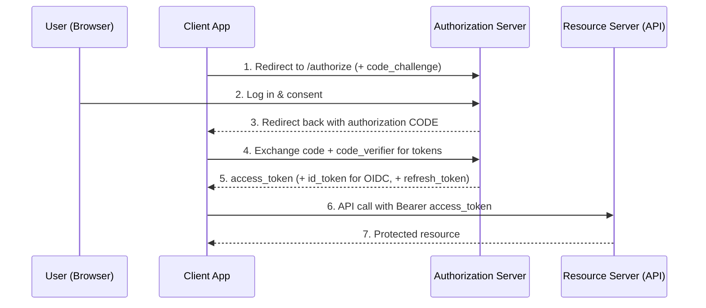

# Security Fundamentals

> **Scope:** Authentication vs authorization, sessions vs tokens (JWT), OAuth 2.0 & OpenID Connect, RBAC vs ABAC, TLS/mTLS & encryption, secrets management, common attacks & defenses (SQLi, XSS, CSRF, SSRF, DDoS), API keys & rate limiting, least privilege, and zero-trust.

---

## 1. Authentication vs Authorization

Two distinct questions, frequently confused:

| | **Authentication (AuthN)** | **Authorization (AuthZ)** |
|---|---|---|
| Question | *Who are you?* | *What are you allowed to do?* |
| Verifies | Identity (credentials) | Permissions |
| Happens | First | After AuthN |
| Example | Logging in with password + OTP | "Can this user delete that file?" |

A request flows: **AuthN** (establish identity) → **AuthZ** (check permission for the action) → execute. Getting AuthN right but skipping AuthZ is a classic source of breaches (e.g., a logged-in user accessing *another* user's data — **IDOR / broken object-level authorization**).

**Factors of authentication** (combine for MFA):
- Something you **know** (password, PIN)
- Something you **have** (phone, hardware key)
- Something you **are** (biometric)

---

## 2. Sessions vs Tokens

After login, the server needs to remember the user across stateless HTTP requests. Two models:

### 2.1 Server-side sessions (stateful)

```
Login → server creates session, stores it server-side, returns a session_id cookie
Each request → cookie sent → server looks up session in store (Redis/DB)
```

- Server holds state; logout = delete the session (easy revocation).
- Needs a shared/sticky session store to scale horizontally.

### 2.2 Tokens (stateless) — JWT

The server issues a signed **token** the client sends on each request (usually `Authorization: Bearer <token>`). The server **verifies the signature** instead of a database lookup — no server-side session state.

### 2.3 JWT structure

A **JSON Web Token** has three Base64URL parts joined by dots: `header.payload.signature`.

```
eyJhbGciOiJIUzI1NiJ9 . eyJzdWIiOiIxMjMiLCJyb2xlIjoiYWRtaW4ifQ . SflKxw...

HEADER    {"alg":"HS256","typ":"JWT"}
PAYLOAD   {"sub":"123","role":"admin","exp":1719200000,"iss":"auth.example"}  (CLAIMS)
SIGNATURE HMAC-SHA256(base64(header) + "." + base64(payload), secret)
```

- **Header:** algorithm & type.
- **Payload (claims):** `sub` (subject/user), `exp` (expiry), `iat`, `iss`, `aud`, plus custom claims (e.g., `role`). **Claims are NOT encrypted — only Base64-encoded.** Anyone can read them.
- **Signature:** proves the token wasn't tampered with and was issued by someone holding the secret/private key.

### 2.4 JWT pitfalls

| Pitfall | Defense |
|---|---|
| Putting secrets/PII in the payload | It's readable — never store sensitive data in claims |
| **`alg: none` attack** | Reject unsigned tokens; pin allowed algorithms |
| **Algorithm confusion** (RS256→HS256, using public key as HMAC secret) | Verify with the *expected* algorithm only |
| **Hard to revoke** before `exp` | Use short-lived access tokens + refresh tokens; maintain a denylist for emergencies |
| Long expiry = long-lived theft window | Keep `exp` short (minutes) |
| Weak/leaked signing secret | Strong secret/asymmetric keys; rotate them |
| Not validating `iss`/`aud`/`exp` | Always validate standard claims |

> **Sessions vs JWT trade-off:** sessions = easy revocation, server state; JWT = stateless scaling, but **revocation is hard**. Common pattern: **short-lived access JWT** (≈5–15 min) + **long-lived refresh token** (stored securely, revocable server-side).

---

## 3. OAuth 2.0 & OpenID Connect

- **OAuth 2.0** is an **authorization** framework: it lets an app obtain *delegated access* to resources on a user's behalf **without sharing the password**. ("Let this app read my Google contacts.")
- **OpenID Connect (OIDC)** is an **authentication** layer *on top of* OAuth 2.0: it adds an **ID token** (a JWT) that proves *who the user is*. ("Sign in with Google.")

> Rule of thumb: OAuth 2.0 = access (authorization). OIDC = login (authentication). They're commonly used together.

### Roles
- **Resource Owner** (the user), **Client** (the app), **Authorization Server** (issues tokens), **Resource Server** (the API holding data).

### 3.1 Authorization Code flow (with PKCE)

The recommended flow for web/mobile/SPA apps. PKCE (**Proof Key for Code Exchange**) protects against authorization-code interception.



The short-lived **code** is exchanged server-side (or with PKCE) for tokens, so tokens never appear in the browser URL/history.

### 3.2 Other grant types

| Grant | Use case | Notes |
|---|---|---|
| **Authorization Code + PKCE** | Web, mobile, SPA | Default, most secure |
| **Client Credentials** | Machine-to-machine (no user) | App authenticates as itself |
| **Refresh Token** | Get new access token silently | Rotate refresh tokens |
| **Device Code** | TVs, CLIs (limited input) | User authorizes on another device |
| Implicit *(deprecated)* | Old SPAs | Avoid — tokens leak in URL |
| Password *(deprecated)* | Legacy | Avoid — app sees the password |

---

## 4. Authorization Models: RBAC vs ABAC

| | **RBAC** (Role-Based) | **ABAC** (Attribute-Based) |
|---|---|---|
| Decision based on | User's **role(s)** | **Attributes** of user, resource, action, environment |
| Example | `role=editor` can edit articles | `dept == resource.dept AND time in business_hours` |
| Pros | Simple, easy to audit | Fine-grained, context-aware, dynamic |
| Cons | "Role explosion" for fine-grained needs | Complex to design/debug; harder to audit |
| Policy form | role → permissions mapping | boolean rules over attributes |

```
RBAC:  user → roles → permissions → resources
ABAC:  decision = f(subject attrs, resource attrs, action, environment/context)
```

Many systems combine them (RBAC for coarse roles, ABAC for fine conditions). Tools: Open Policy Agent (OPA), AWS IAM (policy-based ≈ ABAC), casbin.

---

## 5. TLS/mTLS & Encryption

### 5.1 Encryption in transit vs at rest

| | **In transit** | **At rest** |
|---|---|---|
| Protects | Data moving over the network | Data stored on disk/DB/backups |
| Mechanism | **TLS** (HTTPS) | Disk/DB/field encryption (AES-256) |
| Threat | Eavesdropping, MITM | Stolen disk, leaked backup |

### 5.2 TLS (Transport Layer Security)

TLS gives **confidentiality** (encryption), **integrity** (tamper detection), and **authentication** (server proves identity via an X.509 certificate signed by a trusted CA). Simplified handshake:

```
Client                                Server
  │── ClientHello (ciphers, random) ──►│
  │◄─ ServerHello + Certificate ───────│   (cert proves server identity)
  │   verify cert chain to a trusted CA │
  │── key exchange (e.g., ECDHE) ──────►│   (derive shared session key)
  │◄══════ encrypted application data ══►│   (symmetric AES from here)
```

Asymmetric crypto authenticates and exchanges a key; fast symmetric crypto encrypts the bulk data. Use TLS 1.2+ (prefer 1.3), strong ciphers, and valid certs.

### 5.3 mTLS (mutual TLS)

In standard TLS only the **server** presents a certificate. In **mTLS** the **client also presents a certificate**, so *both* sides authenticate. Used for service-to-service auth inside microservices/service meshes (Istio, Linkerd) and is a cornerstone of zero-trust networks.

```
Standard TLS:  client verifies server
mTLS:          client verifies server  AND  server verifies client
```

### 5.4 Key terms
- **Symmetric** (AES): one shared key, fast — for bulk data.
- **Asymmetric** (RSA/ECC): public/private key pair — for key exchange & signatures.
- **Hashing** (SHA-256): one-way, for integrity. For **passwords** use slow, salted hashes — **bcrypt, scrypt, or Argon2** — never plain SHA/MD5.

---

## 6. Secrets Management

Secrets = passwords, API keys, DB credentials, private keys, signing keys.

**Anti-patterns:** hardcoding secrets in code, committing them to git, baking into Docker images, plaintext config files, logging them.

**Practices:**
- Store in a dedicated **secrets manager**: HashiCorp Vault, AWS/GCP/Azure Secret Manager, Kubernetes Secrets (encrypt at rest!).
- **Inject at runtime** (env vars/mounted files), don't bake in.
- **Rotate** regularly and on suspected compromise; support **dynamic/short-lived** secrets (Vault can generate per-session DB creds).
- **Least privilege** scope per secret.
- **Audit** access; scan repos for leaked secrets (gitleaks, truffleHog).

---

## 7. Common Attacks & Defenses

| Attack | What it is | Primary defenses |
|---|---|---|
| **SQL Injection** | Untrusted input alters a SQL query (`' OR 1=1 --`) | **Parameterized queries / prepared statements**, ORMs, input validation, least-privilege DB user |
| **XSS** (Cross-Site Scripting) | Attacker injects JS that runs in victims' browsers | Output **encoding/escaping**, **Content-Security-Policy**, sanitize HTML, `HttpOnly` cookies |
| **CSRF** (Cross-Site Request Forgery) | Tricks an authenticated user's browser into a state-changing request | **CSRF tokens**, **SameSite cookies**, check Origin/Referer |
| **SSRF** (Server-Side Request Forgery) | Server is tricked into requesting attacker-chosen URLs (e.g., cloud metadata `169.254.169.254`) | Allowlist outbound hosts, block internal IP ranges, no raw user URLs, IMDSv2 |
| **DDoS** | Flood of traffic exhausts resources | Rate limiting, CDN/WAF, autoscaling, upstream scrubbing (Cloudflare/AWS Shield) |

### 7.1 SQL injection — the fix in code

```python
# VULNERABLE — string concatenation
cur.execute("SELECT * FROM users WHERE email = '" + email + "'")
#   email = "x' OR '1'='1"  -> returns all users

# SAFE — parameterized query (driver escapes/binds the value)
cur.execute("SELECT * FROM users WHERE email = %s", (email,))
```

### 7.2 XSS — encode on output

```python
# VULNERABLE: render raw user input into HTML
html = f"<div>Hello {username}</div>"     # username = "<script>steal()</script>"

# SAFE: escape on output (templating engines auto-escape by default)
import html as h
safe = f"<div>Hello {h.escape(username)}</div>"
```
Add a Content-Security-Policy header to constrain what scripts can run, and set session cookies `HttpOnly; Secure; SameSite=Lax`.

### 7.3 CSRF vs XSS (commonly confused)
- **XSS** = the site runs the attacker's script (a code-injection flaw). **CSRF** = the attacker's site forces the *victim's* browser to make an authenticated request to *your* site (abuses ambient cookies). `SameSite` cookies + anti-CSRF tokens defend CSRF; output encoding + CSP defend XSS.

> Reference: the **OWASP Top 10** is the canonical catalog of web app risks (includes injection, broken access control, etc.). Use it as a checklist.

---

## 8. API Keys & Rate Limiting

### 8.1 API keys
- Identify the calling **application** (not a user). Coarse-grained; good for public/partner APIs.
- Send in a header (`X-API-Key` / `Authorization`), never in URLs (they leak into logs/history).
- Scope per key, allow rotation, store **hashed** server-side.
- API keys are *weaker* than OAuth tokens — they're long-lived bearer credentials; treat them as secrets.

### 8.2 Rate limiting

Protects against abuse, DDoS, and runaway clients; enforces fair use and quotas. Common algorithms:

| Algorithm | Idea | Property |
|---|---|---|
| **Token bucket** | Tokens refill at a rate; each request spends one | Allows bursts up to bucket size |
| **Leaky bucket** | Requests drain at a fixed rate | Smooths bursts into steady flow |
| **Fixed window** | N requests per fixed time window | Simple; boundary spikes |
| **Sliding window** | Rolling window count | Smoother, more accurate |

```python
# Token bucket (sketch)
class TokenBucket:
    def __init__(self, rate, capacity):
        self.rate, self.capacity = rate, capacity
        self.tokens, self.last = capacity, time.time()
    def allow(self):
        now = time.time()
        self.tokens = min(self.capacity, self.tokens + (now - self.last) * self.rate)
        self.last = now
        if self.tokens >= 1:
            self.tokens -= 1
            return True
        return False     # 429 Too Many Requests
```
Respond with **HTTP 429** and `Retry-After` / `RateLimit-*` headers so clients back off (see backoff in `15_reliability_availability.md`).

---

## 9. Principle of Least Privilege & Zero-Trust

### 9.1 Principle of Least Privilege (PoLP)

Every user, service, and process should have **only the permissions it needs, for only as long as it needs them** — nothing more. Limits the blast radius of a compromise.

- Scope IAM roles narrowly; avoid wildcard `*` permissions.
- Prefer time-bound, just-in-time access over standing admin rights.
- Separate duties; default-deny.

### 9.2 Zero-Trust

The old "castle-and-moat" model trusted anything *inside* the network perimeter. **Zero-trust** assumes the network is always hostile: **"never trust, always verify."**

```
Perimeter model:  trust inside the firewall  → flat internal network, lateral movement is easy
Zero-trust:       verify every request, every time, regardless of network location
```

Principles:
- **Verify explicitly** — authenticate & authorize every request using identity, device, and context (not network location).
- **Least privilege** — minimal, just-in-time access.
- **Assume breach** — segment (micro-segmentation), encrypt everywhere (mTLS service-to-service), log and inspect continuously.

This is why **mTLS between services** (§5.3), strong **identity** (§3), per-request **authorization** (§1, §4), and **least privilege** (§9.1) all reinforce each other.

---

## 10. Key Takeaways

- **AuthN** (who you are) precedes **AuthZ** (what you may do); always enforce object-level authorization, not just login.
- **Sessions** are stateful and easily revoked; **JWTs** are stateless and scale but are hard to revoke and only **signed, not encrypted** — never put secrets in claims; validate `alg`/`exp`/`iss`/`aud`. Pair short-lived access tokens with refresh tokens.
- **OAuth 2.0** = delegated authorization; **OIDC** = authentication on top. Use **Authorization Code + PKCE**; avoid implicit/password grants.
- Choose **RBAC** for simple role mapping, **ABAC** for fine-grained, context-aware policy (often combined).
- Encrypt **in transit (TLS 1.2+/1.3)** and **at rest (AES)**; use **mTLS** for service-to-service auth; hash passwords with **bcrypt/scrypt/Argon2**.
- Keep secrets in a **secrets manager**, inject at runtime, rotate, never commit.
- Defend the **OWASP** classics: parameterized queries (SQLi), output encoding + CSP (XSS), tokens + SameSite (CSRF), allowlists + block internal IPs (SSRF), rate limiting + WAF/CDN (DDoS).
- Apply **least privilege** everywhere and adopt **zero-trust**: never trust the network, verify every request, assume breach.

---
*Related: `14_distributed_systems.md` (untrusted network, fallacy #4), `16_observability.md` (don't log secrets/PII; audit logs), `15_reliability_availability.md` (rate limiting, backoff, DDoS resilience).*
