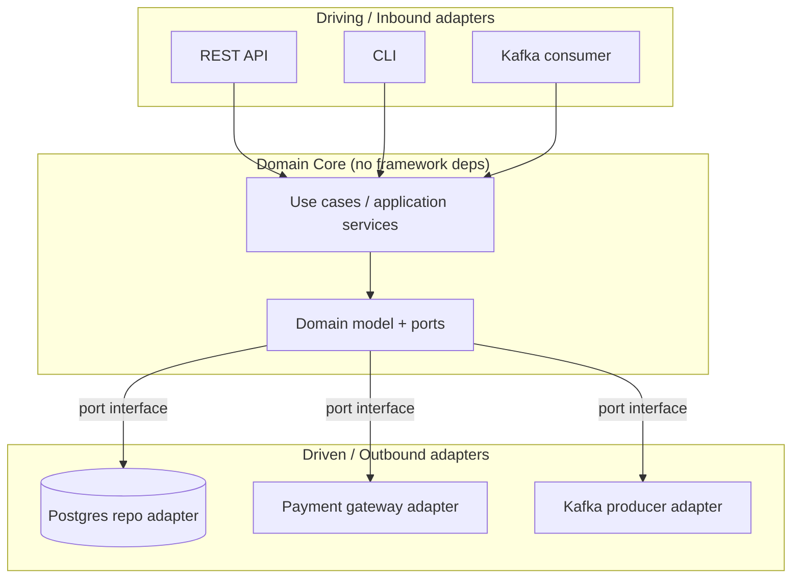
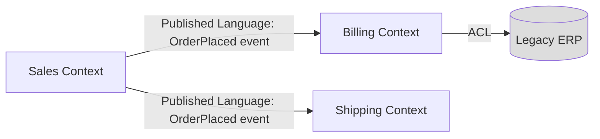
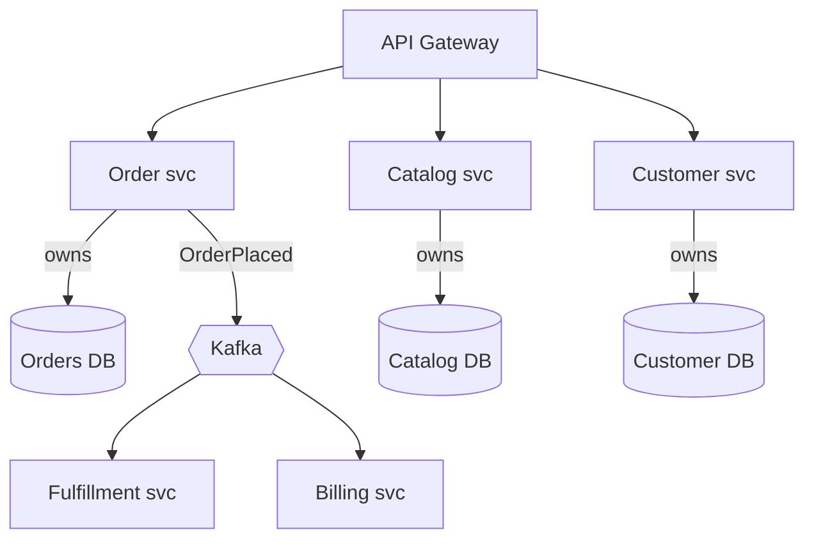
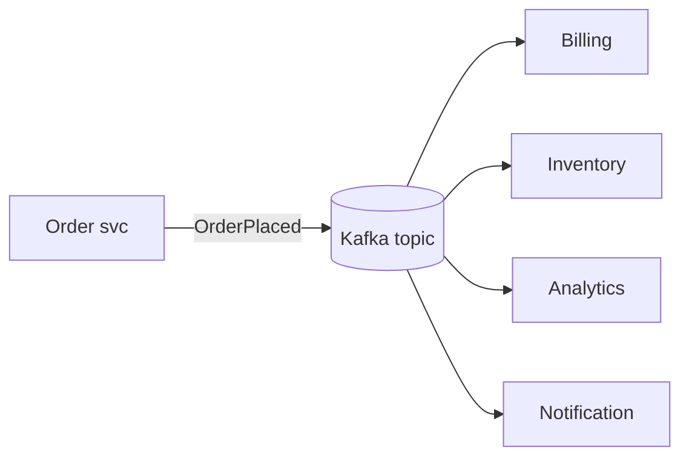
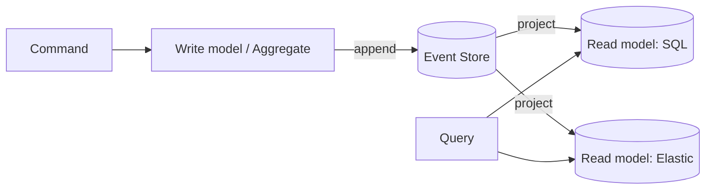
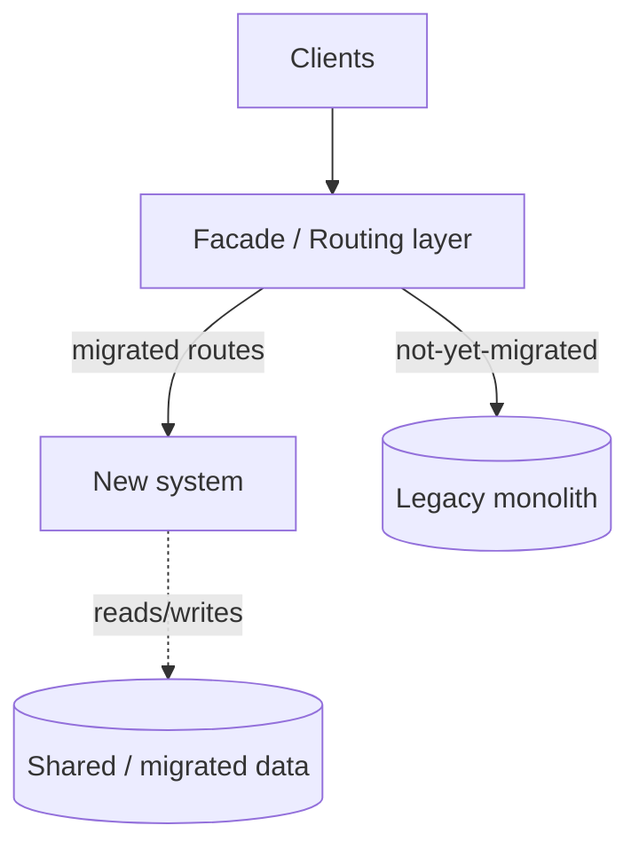
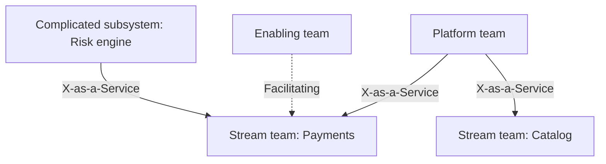

# 01 — Enterprise Architecture Patterns

> Audience: senior/staff engineers and architects choosing the structural style for systems that will live for a decade and be maintained by many teams.

## Introduction

An "architecture pattern" here means the **dominant structural decomposition** of a system: how responsibilities are split, where state lives, how components communicate, and how the design maps onto teams. At enterprise scale the wrong choice is expensive to reverse — it shapes hiring, deployment, data ownership, and compliance boundaries for years.

This doc surveys the patterns you will actually defend in an architecture review board, then gives explicit selection criteria and the organizational forces (Conway's Law, Team Topologies) that constrain the choice.

## Why it matters at enterprise scale

- **Coupling is the enemy of change.** Enterprises change continuously (M&A, regulation, market). Patterns that localize change reduce blast radius and coordination cost.
- **Decomposition determines team autonomy.** Architecture *is* org design. A pattern that requires 6 teams to deploy together kills velocity regardless of code quality.
- **Compliance maps to boundaries.** PCI scope, data residency, and audit are far cheaper when they align with clean module/service boundaries.
- **Reversibility has a price.** Distributed architectures buy independent scaling/deployment at the cost of operational complexity, eventual consistency, and debugging difficulty. You pay this whether or not you needed it.

---

## 1. Layered / N-Tier

The default enterprise structure: presentation → application/business → domain → data access → database. Each layer depends only on the one below.

```
┌─────────────────────────────────┐
│ Presentation (UI / API)         │
├─────────────────────────────────┤
│ Application / Service layer      │  orchestration, transactions
├─────────────────────────────────┤
│ Domain / Business logic          │  rules, entities
├─────────────────────────────────┤
│ Data access (repositories/DAO)   │
├─────────────────────────────────┤
│ Database / external systems      │
└─────────────────────────────────┘
```

**Strengths:** universally understood, easy onboarding, clean separation of UI/logic/data.
**Weaknesses:** "layer leakage" (business logic in controllers or stored procs); tends toward a **shared database** that becomes the real integration point; the domain layer often ends up anemic (data bags + transaction scripts).

**Use when:** CRUD-heavy line-of-business apps, internal tools, teams new to a domain.

---

## 2. Hexagonal (Ports & Adapters) / Clean Architecture

Invert the dependency direction: the **domain core depends on nothing**; infrastructure depends on the core via interfaces (ports). Adapters implement ports for the web, DB, message bus, etc.



**Key rule:** dependencies point *inward*. The domain defines `interface PaymentPort`; the adapter implements it. You can swap Postgres for DynamoDB or REST for gRPC without touching domain code, and you can unit-test the core with no I/O.

**Strengths:** highly testable, framework-agnostic, protects business rules from infrastructure churn.
**Weaknesses:** more indirection/boilerplate; over-applied to trivial CRUD it adds ceremony with little payoff.

**Use when:** rich domain logic with long life and changing infrastructure; the inner pattern for each microservice in a larger system.

---

## 3. Domain-Driven Design (DDD)

DDD is a set of techniques for taming complexity in large domains. The strategic patterns matter most at enterprise scale.

### Strategic DDD
- **Ubiquitous language:** one shared vocabulary per context, used in code, docs, and conversation. "Order" in Sales ≠ "Order" in Fulfillment.
- **Bounded context:** an explicit boundary within which a model is consistent. Each context has its own model and language. This is the unit that most often becomes a service or module.
- **Context mapping:** how contexts relate — *Partnership*, *Customer/Supplier*, *Conformist*, *Anti-Corruption Layer (ACL)*, *Open Host Service*, *Published Language*, *Shared Kernel*.



### Tactical DDD (inside one context)
- **Entity:** identity-bearing object (`Customer` with an ID).
- **Value object:** immutable, equality by value (`Money`, `Address`).
- **Aggregate:** a consistency boundary; one **aggregate root** guards invariants. **Rule of thumb: one transaction = one aggregate.** Reference other aggregates by ID, not by object reference.
- **Repository:** persistence per aggregate root.
- **Domain event:** something that happened (`OrderPlaced`).

```java
// Aggregate root enforcing an invariant
public class Order {                       // aggregate root
    private final OrderId id;
    private final List<OrderLine> lines;   // entities inside the aggregate
    private OrderStatus status;

    public void addLine(ProductId p, Quantity q, Money price) {
        if (status != OrderStatus.DRAFT)
            throw new IllegalStateException("Cannot modify a submitted order");
        lines.add(new OrderLine(p, q, price));
    }

    public void submit() {
        if (lines.isEmpty()) throw new IllegalStateException("Empty order");
        this.status = OrderStatus.SUBMITTED;
        DomainEvents.raise(new OrderSubmitted(id, totalAmount()));  // reference Customer by ID, never load it here
    }
}
```

**Use when:** the domain is complex and contested across teams. Skip tactical DDD for simple CRUD.

---

## 4. Microservices at Enterprise Scale

Independently deployable services, each owning its data, communicating over the network. The enterprise reality differs from the textbook:

- **Service per bounded context**, not per noun. "FooService, BarService" sprawl creates a distributed monolith.
- **Database per service** — the non-negotiable that makes services independent. Sharing a DB recreates coupling.
- **Inter-service comms:** synchronous (REST/gRPC) for queries; asynchronous (events) for state propagation. Prefer async to decouple availability.
- **Platform investment is mandatory:** service mesh (Istio/Linkerd), centralized config, CI/CD per service, distributed tracing, a service catalog. Without a platform team, microservices collapse under operational load.



**Strengths:** independent deploy/scale/tech choice; team autonomy; fault isolation.
**Weaknesses:** distributed-systems tax — eventual consistency, partial failure, network latency, observability complexity, no cross-service transactions (use sagas).

> **Distributed transactions:** there are none. Use the **Saga** pattern (choreographed via events or orchestrated via a coordinator like Temporal/AWS Step Functions) with compensating actions.

---

## 5. Event-Driven Architecture (EDA)

Components communicate by producing/consuming events on a durable log/broker. Producers don't know consumers.



- **Event notification** (thin, "go fetch") vs **event-carried state transfer** (fat, self-contained) vs **event sourcing** (the log *is* the source of truth).
- Decouples teams in time and space; new consumers added without touching producers.
- **Costs:** harder to reason about end-to-end flow; requires idempotent consumers, schema governance (a schema registry, e.g. Confluent/Avro), and careful ordering/partitioning.

See `02_enterprise_integration.md` for brokers, idempotency, and the outbox pattern.

---

## 6. CQRS + Event Sourcing

**CQRS** (Command Query Responsibility Segregation): separate the write model (commands, validation, invariants) from one or more read models (denormalized, query-optimized).

**Event Sourcing (ES):** persist state as an append-only sequence of events; current state is a fold over the event stream. Often paired with CQRS but independent of it.



**Strengths:** full audit/history for free (great for finance/regulated domains); read and write scale independently; temporal queries ("state as of date X").
**Weaknesses:** **high complexity** — eventual consistency between write and read sides, event versioning/upcasting, replay/projection-rebuild machinery. Easy to over-apply.

**Use when:** auditability is a hard requirement, complex domain with high write throughput, or you genuinely need divergent read models. **Anti-pattern:** ES on a simple CRUD app.

---

## 7. Modular Monolith

A single deployable unit with **strictly enforced internal module boundaries** (each module = bounded context, with its own schema and a public API; no reaching into another module's internals).

```
┌──────────── Single deployable ────────────┐
│  [Sales] [Billing] [Inventory] [Shipping]  │   modules, each w/ its own schema
│   └ public API only; no cross-module SQL   │
└────────────────────────────────────────────┘
```

**Strengths:** simple deploy/ops, in-process calls (no network), single transaction when needed, easy refactoring — and a clean path to extract modules into services later (modules with clear boundaries become services).
**Weaknesses:** scales as one unit; one bad module can take down the process; discipline required (enforce with ArchUnit, module systems, or build-time checks).

**Use when:** you want microservice-style boundaries without the operational tax — often the *right starting point*. "Start with a modular monolith; extract services when a boundary proves it needs independent scaling/deployment."

---

## 8. The Strangler Fig

Incremental replacement of a legacy system: route traffic through a façade; redirect feature slices to the new system one at a time; the old system shrinks until it can be retired.



**Why it wins:** avoids the catastrophic big-bang rewrite; delivers value incrementally; each slice is independently testable and reversible.
**Watch out for:** the façade becoming permanent; data synchronization between old and new during the transition; "last 20%" of hard-to-migrate functionality lingering for years. See `10_migration_modernization.md`.

---

## Choosing Between Them

| Pattern | Complexity | Team autonomy | Scaling granularity | Consistency | Best fit |
|---|---|---|---|---|---|
| Layered/N-tier | Low | Low | Whole app | Strong (single DB) | CRUD LOB apps, internal tools |
| Hexagonal | Low–Med | n/a (inner style) | n/a | Strong | Any service with real domain logic |
| Modular monolith | Med | Med (per module) | Whole app | Strong (in-process) | Most new systems; pre-microservices |
| Microservices | High | High | Per service | Eventual | Many teams, divergent scale needs |
| EDA | Med–High | High | Per consumer | Eventual | Decoupled, reactive, many consumers |
| CQRS+ES | High | Med | Read/write separate | Eventual | Audit-heavy, complex write domains |
| Strangler fig | Med (process) | Grows over time | Incremental | Mixed during transition | Replacing legacy safely |

**Decision heuristics**
- Start as simple as the problem allows: **modular monolith with hexagonal modules** is a strong default.
- Distribute only where you have a *concrete* driver: independent scaling, independent deploy cadence, team autonomy, or fault isolation. "Microservices for resume" is an anti-pattern.
- Reach for EDA when you need temporal/availability decoupling and multiple independent reactions to a state change.
- Reach for CQRS/ES only when auditability or read/write asymmetry justifies the complexity.
- Patterns compose: a service can be a hexagonal core, participate in EDA, and use CQRS internally.

### Common anti-patterns
- **Distributed monolith:** microservices that must deploy together / share a DB — all the cost, none of the benefit.
- **Anemic domain model:** "objects" with only getters/setters; logic scattered in services.
- **Shared database as integration point:** the most seductive and damaging coupling in the enterprise.
- **Entity services:** one service per database table — chatty, coupled, no real ownership.
- **Premature decomposition:** splitting before the boundaries are understood; you'll split wrong.

---

## Conway's Law & Team Topologies

> "Organizations design systems that mirror their own communication structure." — Melvin Conway, 1967

This is not a curiosity — it's a design force. If three teams build a compiler, you get a three-pass compiler. Therefore: **design the team boundaries and the service boundaries together** (the "Inverse Conway Maneuver" — shape teams to get the architecture you want).

**Team Topologies (Skelton & Pais)** gives four team types and three interaction modes:

| Team type | Role |
|---|---|
| **Stream-aligned** | Owns a slice of business value end-to-end (the default team) |
| **Platform** | Provides paved-road internal services (CI/CD, mesh, observability) to reduce cognitive load on stream teams |
| **Enabling** | Coaches stream teams to adopt new skills/tech, then leaves |
| **Complicated-subsystem** | Owns a part needing deep specialism (e.g. a pricing/risk engine) |

Interaction modes: **Collaboration** (temporary, high-bandwidth), **X-as-a-Service** (one consumes another's well-defined service), **Facilitating** (enabling helps another).



**Key idea:** a team's **cognitive load** is the real constraint. A platform team exists to lower it so stream-aligned teams can own their services (including on-call). Microservices without this support structure overload teams and fail.

---

## Key Takeaways
- Architecture is a **trade-off exercise**, not a search for the "best" pattern. Record decisions as ADRs.
- **Default to simplicity**: hexagonal modules inside a modular monolith; distribute on concrete evidence.
- **DDD bounded contexts** are the most reliable seams for both services and teams.
- **There are no distributed transactions** — design for eventual consistency and sagas the moment you cross a service boundary.
- **Conway's Law is unavoidable**: design org and architecture together, and fund a platform team to keep cognitive load survivable.
- CQRS/ES and microservices are powerful and *expensive*; apply them where a real driver justifies the cost.
