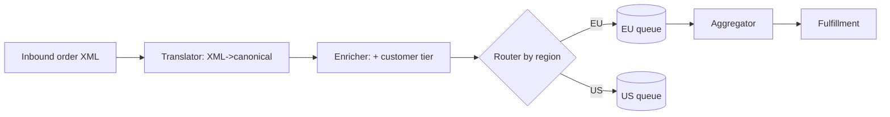
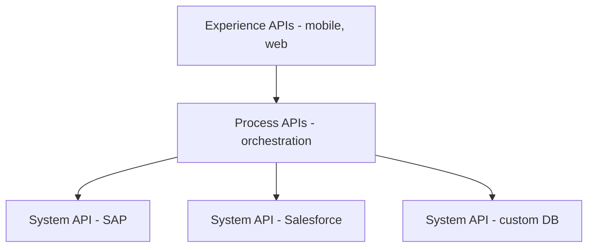
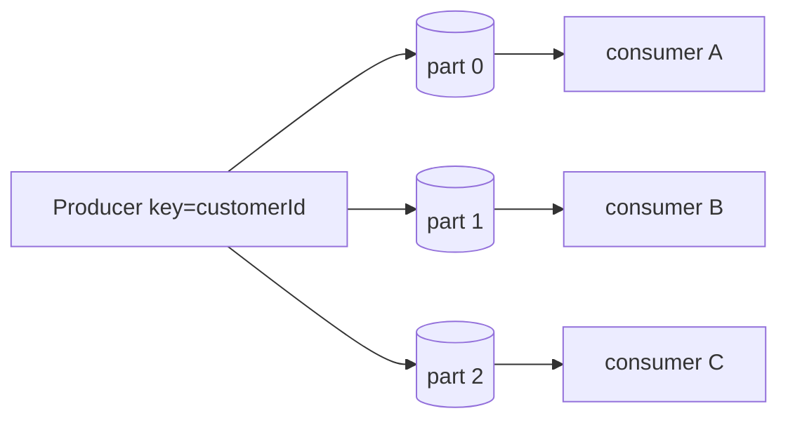
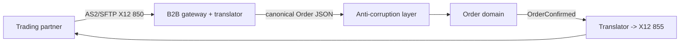
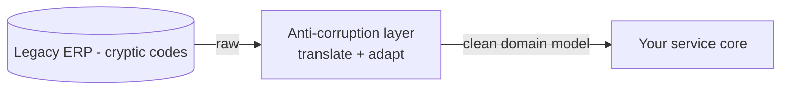
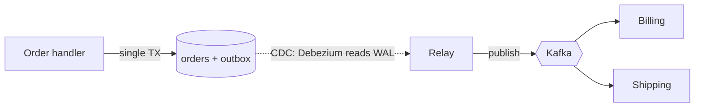

# 02 — Enterprise Integration

> Audience: architects connecting dozens-to-hundreds of systems (custom services, SaaS, mainframes, partners) reliably and at scale.

## Introduction

Integration is where enterprise architecture lives or dies. Any organization of size runs a *portfolio* of systems built at different times, in different stacks, by different teams and vendors. The value is in the *flows between them* — an order in the storefront must become a charge in billing, a pick in the warehouse, a ledger entry in finance, and a row in the data warehouse. This doc covers the patterns, middleware, and code-level techniques for making those flows correct, decoupled, and observable.

## Why it matters at enterprise scale

- **Integration is the dominant source of incidents and cost.** Most "the system is down" reports are really "an integration broke."
- **Tight coupling propagates failure.** Synchronous chains create cascading outages; a slow downstream takes down everyone upstream.
- **Partners and compliance set the rules.** B2B/EDI standards, regulators, and SLAs dictate formats, ordering, and auditability you don't control.
- **Exactly-once is a myth on the network.** You must design for at-least-once delivery + idempotency, or you will double-charge customers.

---

## Enterprise Integration Patterns (EIP)

The Hohpe/Woolf catalog is the shared vocabulary. The core messaging patterns:

| Pattern | Purpose | Real-world example |
|---|---|---|
| **Message Channel** | Logical pipe between sender/receiver | Kafka topic, SQS queue, MQ queue |
| **Message Router** | Send a message to a destination based on content/rules | Kafka Streams branch, Camel `choice()` |
| **Message Translator** | Convert between data formats/models | XML→JSON, Avro→canonical model |
| **Content Enricher** | Add data from another source | Look up customer profile before publishing |
| **Aggregator** | Combine related messages into one | Collect all order lines, emit one order |
| **Splitter** | Break one message into many | Order → per-line fulfillment messages |
| **Dead Letter Channel** | Park un-processable messages | DLQ for poison messages |
| **Idempotent Receiver** | Safely handle duplicate messages | Dedup by message key (below) |



Apache Camel / Spring Integration / MuleSoft implement these patterns directly as a DSL.

---

## ESB vs API-Led / Microservices Integration

### Enterprise Service Bus (ESB)
A central middleware bus (TIBCO, IBM Integration Bus, MuleSoft, WSO2) that does routing, transformation, and orchestration in the middle.

```
[App A] ─┐                     ┌─ [App C]
[App B] ─┼──►  E S B  ◄────────┼─ [App D]
         │  (route/transform/   │
[Legacy]─┘     orchestrate)     └─ [SaaS]
```

**Pros:** centralized governance, mature connectors, single place for transformation.
**Cons:** the bus becomes a **monolithic single point of failure and a deployment bottleneck**; "smart pipes, dumb endpoints" concentrates logic in middleware no team fully owns. The classic enterprise anti-pattern is the **god-ESB**.

### API-Led / "Smart endpoints, dumb pipes"
Decentralize: services expose well-defined APIs; integration logic lives in the endpoints; the network just transports. Layered as **System APIs** (unlock systems of record) → **Process APIs** (orchestrate/compose) → **Experience APIs** (channel-specific).



**Modern default:** API-led for synchronous request/response + **event streaming (Kafka)** for asynchronous propagation. The ESB survives mainly for legacy protocol bridging (SOAP, EDI, mainframe).

| Aspect | ESB | API-led / microservices |
|---|---|---|
| Logic location | Central bus | Endpoints |
| Failure blast radius | Whole bus | Per service |
| Governance | Strong, central | Federated (needs API mgmt + schema registry) |
| Change agility | Low (shared deploy) | High |
| Best for | Legacy protocol mediation | New, distributed estates |

---

## API Gateway & Management

The gateway is the front door for synchronous APIs: it does authN/Z, rate limiting, routing, TLS termination, request/response transformation, and observability — keeping that cross-cutting logic out of every service.

| Concern | Examples |
|---|---|
| Cloud-managed | AWS API Gateway, Azure API Management, GCP Apigee |
| Self-hosted / k8s | Kong, Apigee Hybrid, Gloo, Ambassador/Emissary |
| Full lifecycle mgmt | Apigee, Azure APIM, Kong Konnect (dev portal, monetization, analytics) |

**API gateway vs API management:** the *gateway* is the runtime data plane; *API management* adds the control plane — developer portal, key issuance, versioning, quotas/monetization, analytics. At enterprise scale you need both.

```yaml
# Kong declarative config: rate-limit + key-auth on an upstream service
services:
  - name: orders-api
    url: http://orders.internal:8080
    routes:
      - name: orders-v1
        paths: ["/v1/orders"]
    plugins:
      - name: key-auth
      - name: rate-limiting
        config: { minute: 600, policy: redis }
      - name: correlation-id
        config: { header_name: X-Request-Id, generator: uuid }
```

> Anti-pattern: putting **business logic** in the gateway. Keep it to cross-cutting concerns. Also beware the **per-team BFF sprawl** vs a single shared gateway — choose deliberately.

---

## Message Brokers at Enterprise Scale

| Broker | Model | Sweet spot |
|---|---|---|
| **Apache Kafka** (Confluent, MSK, Event Hubs API) | Distributed, partitioned, replayable **log** | High-throughput event streaming, event sourcing, stream processing, fan-out |
| **RabbitMQ** | Smart broker, flexible routing (AMQP exchanges) | Complex routing, task queues, request/reply, lower volume |
| **IBM MQ / TIBCO EMS** | Mature, transactional queues | Legacy/financial systems, guaranteed once-and-only-once-ish, mainframe |
| **Cloud-native** | SQS/SNS, Pub/Sub, Service Bus | Serverless, managed, fan-out, decoupling |

**Kafka specifics that matter at scale:**
- **Partitions** are the unit of parallelism *and* ordering. Ordering is guaranteed only *within* a partition. Choose the partition key (e.g. `customerId`) so related events stay ordered.
- **Consumer groups** scale horizontally up to the partition count.
- **Retention + compaction** turn the topic into a replayable source of truth or a latest-state changelog.
- **Schema Registry** (Avro/Protobuf/JSON-Schema) enforces compatibility so producers can't break consumers.
- Delivery is **at-least-once** by default — hence idempotent consumers (below).



---

## B2B / EDI

Trading-partner integration still runs on decades-old standards:

- **EDI standards:** ANSI X12 (US), EDIFACT (international); common docs: 850 (PO), 810 (invoice), 856 (ship notice).
- **Transport/protocols:** AS2 (signed/encrypted HTTP), SFTP, VANs (value-added networks).
- **Patterns:** translate EDI ↔ your canonical model at the edge (a **translator** + **ACL**), never let EDI structures leak into your domain.
- **Tooling:** IBM Sterling, OpenText, SAP, MuleSoft, Cleo, plus cloud B2B (AWS B2BI, Azure Logic Apps Integration Account).



---

## Webhooks

Outbound event delivery to external/partner systems over HTTP. Enterprise-grade webhooks require:
- **Signing** (HMAC over body + timestamp) so receivers verify authenticity.
- **Retries with backoff + DLQ** for failed deliveries; receivers must be **idempotent** (send an event ID).
- **At-least-once** semantics — same rules as brokers.
- Outbound delivery from a durable store (the outbox), not fire-and-forget in request handlers.

---

## ETL / Streaming Integration

| Style | When | Tech |
|---|---|---|
| **Batch ETL/ELT** | Nightly loads, warehouse refresh | Informatica, dbt, AWS Glue, Azure Data Factory, Airflow |
| **CDC (Change Data Capture)** | Near-real-time replication from OLTP | Debezium, AWS DMS, GoldenGate, Fivetran |
| **Stream processing** | Continuous enrichment/aggregation | Kafka Streams, Flink, Spark Structured Streaming |

**CDC + outbox** is the modern way to get reliable events out of a database without dual-write bugs. See below.

---

## Anti-Corruption Layer (ACL)

A translation/isolation layer that prevents a foreign or legacy model from polluting your domain. It maps the external model to your **canonical/domain model** and quarantines the legacy's quirks.



**Use whenever** you integrate with a legacy system, a vendor SaaS, or a partner whose model you don't control. It's the single most valuable defensive integration pattern.

---

## Idempotent Consumers

Because delivery is at-least-once, consumers **will** see duplicates (redelivery after a crash, producer retries, rebalances). Make processing idempotent by deduplicating on a stable message ID.

```java
@KafkaListener(topics = "payments", groupId = "ledger")
@Transactional
public void onPayment(PaymentEvent evt) {
    // 1) Dedup: insert the event id; PK conflict => already processed
    int inserted = jdbc.update(
        "INSERT INTO processed_events(event_id) VALUES (?) ON CONFLICT DO NOTHING",
        evt.getEventId());
    if (inserted == 0) {
        log.info("Duplicate {} ignored", evt.getEventId());
        return;                                  // safe no-op
    }
    // 2) Do the real work in the SAME transaction as the dedup insert
    ledger.post(evt.getAccountId(), evt.getAmount());
}
```

Keys: a **stable, producer-assigned event ID**; dedup write in the **same transaction** as the effect; bound the dedup table (TTL/partition by time). For non-transactional effects, make the operation naturally idempotent (e.g. `PUT`/upsert keyed by event ID).

---

## The Outbox Pattern

**Problem (dual write):** a handler must update its DB *and* publish an event. If it writes the DB then crashes before publishing — or publishes then the DB rolls back — state and events diverge. You cannot atomically commit a DB transaction and a broker publish.

**Solution:** write the event to an **outbox table in the same local transaction** as the business change. A separate relay (CDC like Debezium, or a polling publisher) reads the outbox and publishes to the broker, marking rows sent. Atomicity is local; publishing is eventually consistent and reliable.



```sql
-- Outbox table written in the same TX as the business change
CREATE TABLE outbox (
    id           UUID PRIMARY KEY DEFAULT gen_random_uuid(),
    aggregate_id UUID        NOT NULL,
    type         TEXT        NOT NULL,          -- e.g. 'OrderPlaced'
    payload      JSONB       NOT NULL,
    occurred_at  TIMESTAMPTZ NOT NULL DEFAULT now(),
    published_at TIMESTAMPTZ                     -- NULL until relayed
);
```

```java
@Transactional
public void placeOrder(PlaceOrder cmd) {
    Order order = Order.create(cmd);
    orderRepository.save(order);                 // business state
    outboxRepository.save(new OutboxRecord(      // event, SAME transaction
        order.id(), "OrderPlaced", toJson(new OrderPlaced(order))));
    // commit: both rows persist atomically. Relay/Debezium publishes asynchronously.
}
```

> Pair the outbox (reliable produce) with the **idempotent consumer** (reliable consume) to get effective end-to-end exactly-once *processing* on top of at-least-once *delivery*. This combination is the backbone of correct enterprise event flows.

---

## Anti-patterns
- **Dual writes** to DB + broker without an outbox → silent data/event divergence.
- **God-ESB** concentrating all logic in unowned middleware.
- **Shared database integration** between systems → invisible coupling, no contract.
- **Synchronous request chains** N levels deep → cascading failures; prefer async or add circuit breakers/timeouts/bulkheads.
- **Leaking foreign models** into your domain (no ACL).
- **Assuming exactly-once delivery** or **global ordering** from a broker.
- **No schema governance** → producers break consumers in production.

## Key Takeaways
- Treat **at-least-once + idempotency + outbox** as the default contract for reliable messaging; exactly-once delivery does not exist.
- Prefer **smart endpoints, dumb pipes** (API-led + Kafka) over a central god-ESB; keep transformation/logic out of gateways.
- Always front foreign/legacy systems with an **anti-corruption layer** and a **canonical model**.
- Choose the broker by semantics: **Kafka** for high-throughput replayable streams, **RabbitMQ** for rich routing, **MQ** for legacy/financial transactional queues.
- Govern schemas (registry + compatibility) and observe flows end-to-end with correlation IDs — integration is your top incident source.
