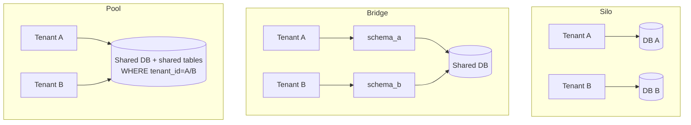
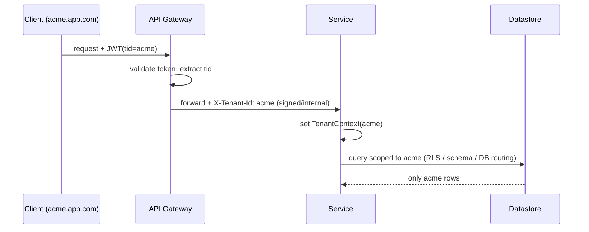
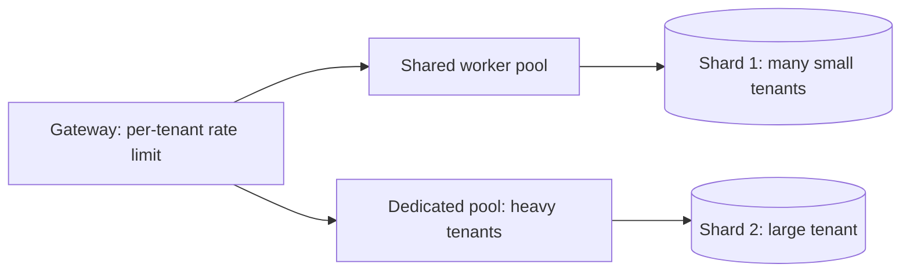
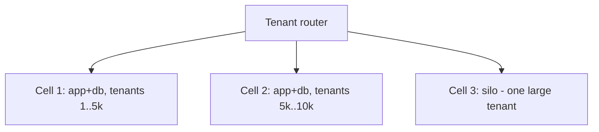
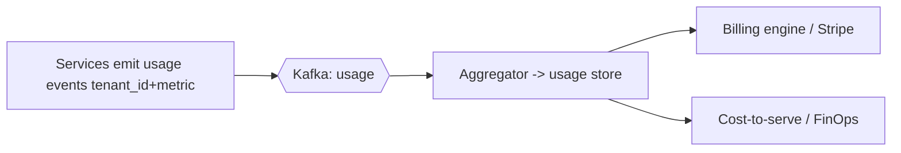

# 03 — Multi-Tenancy

> Audience: architects building SaaS or shared internal platforms that serve many customers (tenants) from one logical system.

## Introduction

**Multi-tenancy** is the architectural property of serving many independent customers ("tenants") from a single deployment of software and infrastructure, while keeping each tenant's data and experience **isolated**. A tenant is typically a customer organization (e.g. "Acme Corp"), within which there are many users.

The opposite is **single-tenancy** — one dedicated stack per customer (the classic on-prem / managed-hosting model). Multi-tenancy trades some isolation for dramatic gains in operational efficiency, and it is the economic foundation of SaaS.

## Why SaaS needs it

- **Unit economics.** A single shared fleet amortizes infrastructure and operations across thousands of tenants. Per-tenant stacks don't scale below a high price point.
- **Operate once.** One version, one upgrade, one set of dashboards. You patch a vulnerability for everyone at once instead of N times.
- **Onboarding velocity.** A new tenant is a config/row, not an infrastructure project — sign-up to live in minutes.
- **Elastic pooling.** Tenants' peaks rarely coincide; pooled capacity is far cheaper than provisioning each tenant for its own peak.

The central tension: **isolation vs. efficiency vs. operational complexity**. More isolation = stronger security/blast-radius guarantees and easier compliance, but higher cost and more to operate.

---

## Isolation Models: Silo / Pool / Bridge

The AWS SaaS terminology (silo/pool/bridge) maps cleanly to the three data isolation strategies:

| Model | Mechanism | Isolation | Cost/tenant | Density | Ops complexity | Noisy-neighbor risk |
|---|---|---|---|---|---|---|
| **Silo** | Separate **database** (or whole stack) per tenant | Strongest | Highest | Lowest | High (N DBs) | None |
| **Bridge** | Shared DB, **separate schema** per tenant | Strong | Medium | Medium | Medium | Low–Medium |
| **Pool** | Shared DB + **shared schema** with `tenant_id` | Weakest (logical) | Lowest | Highest | Low | High |



**How to choose:**
- **Silo** for tenants with strict regulatory/contractual isolation (healthcare, financial, large enterprise deals), data-residency requirements, or "we need our own database" sales objections. Also enables per-tenant restore/scaling.
- **Pool** for high-volume, lower-tier/SMB tenants where margin depends on density. Most early-stage SaaS starts here.
- **Bridge** as a middle ground, or to mix tiers within one platform.

**Reality:** mature SaaS is usually **hybrid** — pool the long tail, silo the whitelabel/enterprise tenants, and let tier drive placement. Design the application so the isolation model is a deployment-time/tenant-level decision, not hardcoded.

---

## Tenant Routing & Context Propagation

Every request must be resolved to a tenant *before* any data access, and that tenant context must flow through the entire call chain.

**Resolving the tenant** (pick one, be consistent):
- Subdomain: `acme.app.com` → tenant `acme`
- Path: `app.com/t/acme/...`
- JWT claim: `tid` / `org_id` in the access token (preferred for APIs)
- Header: `X-Tenant-Id` (internal service-to-service only, never trusted from clients)



**Context propagation** — resolve once at the edge, store in a request-scoped context, and propagate it everywhere (including async work and outbound events). A leaked or missing tenant context is the #1 cause of cross-tenant data breaches.

```java
// Resolve at the edge (filter), bind to the request scope
public class TenantFilter implements Filter {
    public void doFilter(ServletRequest req, ServletResponse res, FilterChain chain) {
        String tenant = JwtUtil.claim(req, "tid");
        if (tenant == null) { reject(res, 401); return; }
        TenantContext.set(tenant);                    // ThreadLocal / scoped value
        try { chain.doFilter(req, res); }
        finally { TenantContext.clear(); }            // ALWAYS clear to avoid leakage across pooled threads
    }
}
```

> **Critical:** propagate tenant context onto background threads, message consumers, and emitted events. Never rely on a default/ambient tenant. Add automated tests that assert a query with no tenant filter fails closed.

---

## Per-Tenant Data Isolation & Security (Pool model): Row-Level Security

In the pool model, isolation is *logical*, so it must be enforced defensively — never rely solely on every developer remembering `WHERE tenant_id = ?`. **PostgreSQL Row-Level Security (RLS)** enforces it in the database, so even a forgotten/buggy query cannot leak across tenants.

```sql
-- 1) Every tenant-scoped table carries a tenant_id
ALTER TABLE orders ADD COLUMN tenant_id TEXT NOT NULL;

-- 2) Enable + FORCE RLS (FORCE applies it even to the table owner)
ALTER TABLE orders ENABLE ROW LEVEL SECURITY;
ALTER TABLE orders FORCE  ROW LEVEL SECURITY;

-- 3) Policy: a session can only see/affect its own tenant's rows.
--    Reads tenant from a session GUC set per request.
CREATE POLICY tenant_isolation ON orders
    USING      (tenant_id = current_setting('app.current_tenant', true))
    WITH CHECK (tenant_id = current_setting('app.current_tenant', true));
```

```java
// Per-request, set the GUC the policy reads. Use SET LOCAL inside the TX
// so it cannot bleed into the next request when the connection returns to the pool.
try (var conn = dataSource.getConnection()) {
    conn.setAutoCommit(false);
    try (var ps = conn.prepareStatement("SET LOCAL app.current_tenant = ?")) {
        ps.setString(1, TenantContext.get());
        ps.execute();
    }
    // ... all subsequent queries on this connection are auto-scoped by RLS ...
    conn.commit();
}
```

Defense in depth for pool: RLS **plus** application-layer scoping **plus** the connection's app role lacking `BYPASSRLS`. Cloud equivalents: same RLS in Azure SQL / Aurora Postgres; AWS also documents tenant isolation via IAM + dynamic policies for DynamoDB (leading-key `tenant_id#...`).

---

## Noisy-Neighbor Problem

In pooled resources, one tenant's spike (a huge report, a runaway batch) degrades everyone. Mitigations:

- **Per-tenant rate limiting & quotas** at the gateway (e.g. token bucket keyed by `tenant_id`).
- **Connection/thread quotas** so one tenant can't exhaust the pool.
- **Workload isolation:** route heavy/async jobs to separate worker pools or queues, partitioned by tenant.
- **Tiering / shard placement:** move heavy tenants to dedicated shards or promote them to a silo.
- **Per-tenant observability:** emit `tenant_id` on every metric/log/trace so you can *see* the noisy neighbor and act.



---

## Per-Tenant Customization

SaaS tenants want to feel bespoke without forking the codebase.

- **Configuration over code:** feature flags, settings, themes/branding, locale — all data, scoped by tenant.
- **Schema extensibility:** custom fields via EAV, JSONB columns, or per-tenant "custom field" definitions (Salesforce-style).
- **Workflow/rules:** tenant-configurable business rules via a rules engine, not branches in code.
- **Extensibility points:** webhooks, scoped API keys, and sandboxed extension runtimes — never tenant-specific code branches in the core (`if (tenant == "acme")` is a maintainability disaster and a classic anti-pattern).

---

## Scaling

- **Stateless services** scale horizontally regardless of model; tenant context travels in the request.
- **Data tier** is the hard part: **shard by `tenant_id`**, with a tenant→shard mapping in a routing/lookup service. Keep a tenant whole within a shard to preserve transactional locality.
- **Pool placement is dynamic:** small tenants pack densely; promote a tenant to its own shard/silo when its load or contract demands. Build a "tenant placement" service early.
- **Cell-based architecture** (a.k.a. cells/pods): partition the whole stack into independent cells, each serving a bounded set of tenants. Limits blast radius, caps cell size, and gives a clean scaling unit — the dominant pattern at very large SaaS scale.



---

## Billing / Metering

Multi-tenant SaaS monetizes by tenant, so usage must be measured per tenant from day one.

- **Meter** consumption per tenant: API calls, storage, compute-seconds, seats, events. Emit metering events (to Kafka) tagged with `tenant_id` and dimension.
- **Aggregate** into a usage store; reconcile (metering must be auditable — it's revenue).
- **Pricing models:** flat subscription, per-seat, usage-based, tiered, hybrid. Tie to entitlements/feature flags.
- **Tooling:** Stripe Billing, AWS Marketplace Metering, or in-house; for cost attribution use cloud tags + `tenant_id` to compute **cost-to-serve per tenant** (essential FinOps for SaaS — you must know which tenants are unprofitable).



---

## Onboarding

Tenant provisioning should be automated and idempotent:

1. Create tenant record + assign tier/plan → determines isolation model & cell/shard placement.
2. Provision resources: pool (insert rows / create schema) or silo (IaC: new DB/stack) — orchestrated via Terraform/Step Functions/Temporal.
3. Bootstrap: admin user, identity federation (SSO via SAML/OIDC for enterprise tenants), default config/seed data.
4. Activate entitlements & metering; emit `TenantOnboarded` event.
5. Smoke-test isolation (a test asserting the new tenant cannot read another's data).

> The onboarding pipeline must be **fully automated** — manual provisioning caps your growth and is error-prone (a misconfigured tenant = a data-leak risk).

---

## Anti-patterns
- **Trusting a client-supplied `X-Tenant-Id`** without a verified token claim → trivial cross-tenant access.
- **Relying only on application `WHERE tenant_id=?`** with no DB-enforced RLS → one forgotten clause leaks data.
- **Ambient/default tenant** or failing to clear pooled-thread context → cross-request leakage.
- **`if (tenant == "x")` branches** in core code → unmaintainable, untestable forks.
- **No per-tenant observability/metering** → blind to noisy neighbors and cost-to-serve.
- **Single shared shard for everyone forever** → no path to isolate or scale a big tenant.

## Key Takeaways
- Multi-tenancy trades isolation for efficiency; choose **silo/bridge/pool** per tenant tier — mature SaaS is **hybrid**.
- Resolve tenant **once at the edge** from a trusted token claim and **propagate context everywhere**, including async and events.
- In the pool model, enforce isolation **in the database (RLS)**, not just in app code — fail closed.
- Plan for **noisy neighbors** (quotas, workload isolation) and **scaling** (shard by tenant, cell-based architecture) from the start.
- Meter **per tenant** for billing *and* cost-to-serve; automate onboarding end-to-end with an isolation smoke test.
