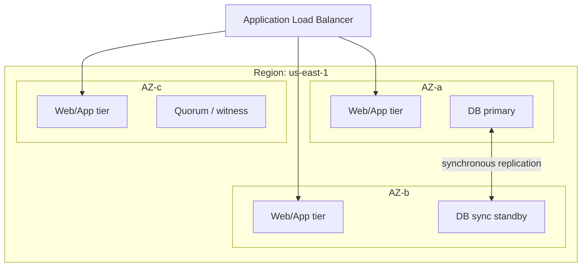
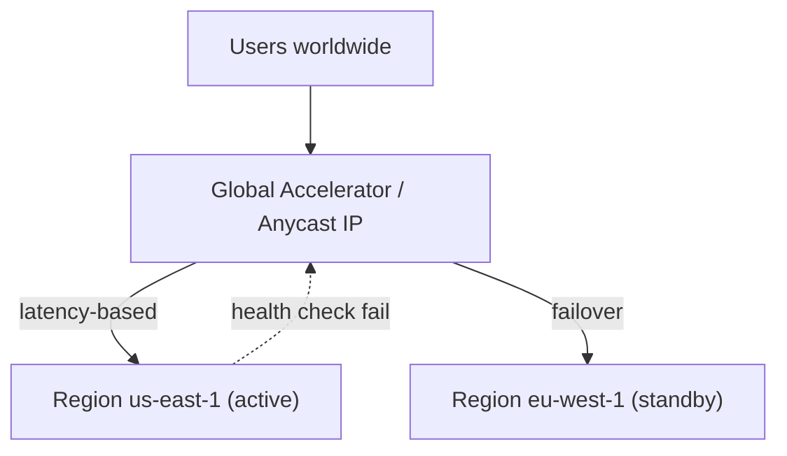

# High Availability & Disaster Recovery at Enterprise Scale

## Introduction

High Availability (HA) and Disaster Recovery (DR) are distinct but related disciplines that are frequently conflated. Getting the distinction right is the first job of an architect.

- **High Availability** is about *masking component failures* so that the system keeps serving requests within a single failure domain (a host, a rack, a data center, an Availability Zone). HA is measured in seconds of failover and is automatic.
- **Disaster Recovery** is about *surviving the loss of an entire site or region* — a flood, a fiber cut, a region-wide cloud outage, a ransomware event, or a botched deployment that corrupts data. DR is measured in minutes to hours and frequently involves a human decision to "declare a disaster."

A system can be highly available *within* a region and still have no DR posture if that region disappears. Conversely, you can have a DR plan and still suffer poor availability if individual component failures take you down. Enterprises need both, scoped appropriately to each workload's criticality.

## Why It Matters at Enterprise Scale

At enterprise scale, the cost of downtime is rarely just lost revenue. It includes:

- **Regulatory exposure** — financial services (e.g., the EU's DORA, FFIEC guidance), healthcare (HIPAA contingency planning), and others mandate tested recovery capabilities. Auditors will ask for evidence of DR tests.
- **Contractual SLAs** — penalty clauses and service credits owed to customers.
- **Reputational damage** — a multi-hour outage of a payments platform is a headline.
- **Cascading failure** — in a microservices estate, one unavailable dependency can stall dozens of downstream services if bulkheads and timeouts are not in place.

Crucially, availability is a *product of dependencies*. If your service depends on five components each at 99.9%, your theoretical ceiling is 0.999^5 ≈ 99.5% — markedly worse than any single component. This multiplicative reality is why redundancy and graceful degradation are non-negotiable.

## Availability Tiers & The Nines

Availability is expressed as a percentage of uptime over a period. The allowable downtime shrinks dramatically with each nine.

| Availability | "Nines"     | Downtime / year | Downtime / month | Downtime / day | Typical use case |
|--------------|-------------|-----------------|------------------|----------------|------------------|
| 99%          | Two nines   | 3d 15h 36m      | 7h 18m           | 14m 24s        | Internal tooling, batch |
| 99.9%        | Three nines | 8h 45m 57s      | 43m 49s          | 1m 26s         | Standard SaaS tier |
| 99.95%       | —           | 4h 22m 58s      | 21m 54s          | 43s            | Business apps |
| 99.99%       | Four nines  | 52m 35s         | 4m 22s           | 8.6s           | E-commerce, core APIs |
| 99.999%      | Five nines  | 5m 15s          | 26s              | 0.86s          | Telco, payments rails |

**Practical caution:** Five nines is extraordinarily expensive and is *not* achievable if your deployment process requires downtime, if a single human can fat-finger a `DROP TABLE`, or if you have any synchronous single point of failure. Most enterprises target **99.9%–99.99%** for customer-facing tier-1 systems and explicitly accept lower for everything else. Measure availability from the *customer's* perspective (successful requests / total requests, often as an SLO error budget), not from infrastructure uptime — a server can be "up" while returning 500s.

### Error budgets

Tie the SLO to an **error budget**: at 99.9% you may "spend" ~43 minutes of unavailability per month. When the budget is exhausted, feature work freezes and reliability work takes priority. This converts availability from an aspiration into an engineering control.

## Redundancy: Active-Active vs Active-Passive

Redundancy eliminates single points of failure (SPOFs). The two fundamental topologies:

### Active-Passive (failover)

One node serves traffic; a standby is kept ready (and ideally warm) and is promoted on failure.

```
        ┌──────────────┐
 ──────▶│   Active     │  (serving)
        └──────────────┘
               │ replication
               ▼
        ┌──────────────┐
        │   Passive    │  (standby, idle)
        └──────────────┘
```

- **Pros:** Simpler. No need to reconcile concurrent writes; the standby can be authoritative after promotion. Easier for stateful systems (most relational databases use this model — e.g., PostgreSQL streaming replication with a promoted replica, AWS RDS Multi-AZ).
- **Cons:** Wasted capacity (the passive node does no useful work). Failover takes time (DNS/connection re-pointing, replica promotion, cache warming). Risk of **split-brain** if both nodes think they are active — mitigated with quorum/fencing (STONITH).

### Active-Active

All nodes serve traffic simultaneously behind a load balancer.

```
              ┌──────────────┐
       ┌─────▶│   Node A     │
       │      └──────────────┘
 ──▶ [LB]
       │      ┌──────────────┐
       └─────▶│   Node B     │
              └──────────────┘
```

- **Pros:** No wasted capacity; both nodes absorb load. Failover is implicit — losing a node just removes it from rotation. Better latency if nodes are geo-distributed.
- **Cons:** Harder for stateful systems. Concurrent writes need conflict resolution (last-write-wins, CRDTs, or partitioned ownership). Capacity must be sized so that surviving nodes can absorb the full load (the "N+1" rule — if you run two active nodes at 60% each, losing one overloads the survivor at 120%).

> **Rule of thumb:** Active-active for stateless tiers (web/API). Active-passive or partitioned-active for the data tier, unless you adopt a database explicitly built for multi-master/multi-region writes (Spanner, CockroachDB, Cassandra, DynamoDB global tables) and accept their consistency trade-offs.

## Multi-AZ vs Multi-Region

### Availability Zones (AZs)

An AZ is an isolated data center (or cluster of them) within a region, with independent power, cooling, and networking, connected to sibling AZs by low-latency (single-digit millisecond) links. **Multi-AZ is the baseline for HA** and protects against the loss of one data center.



Because inter-AZ latency is low, you can use **synchronous replication** across AZs (RPO = 0) without crippling write latency. This is why AWS RDS Multi-AZ, Aurora, and Azure zone-redundant deployments default to synchronous in-region replication.

### Multi-Region

Multi-region protects against the loss of an entire region. Inter-region latency is tens to hundreds of milliseconds, which forces hard choices:

- **Synchronous cross-region replication** is usually impractical for write-heavy workloads — every write pays the round-trip latency, and a partition stalls writes.
- **Asynchronous replication** is the norm, which means a non-zero RPO (you can lose the in-flight, un-replicated writes).

| Dimension          | Multi-AZ                          | Multi-Region                                   |
|--------------------|-----------------------------------|------------------------------------------------|
| Protects against   | DC/AZ failure                     | Regional outage, natural disaster              |
| Inter-site latency | ~1–2 ms                           | ~30–150+ ms                                    |
| Replication        | Synchronous feasible (RPO 0)      | Usually async (RPO > 0)                        |
| Data residency     | Single jurisdiction               | Can span jurisdictions (compliance concern)    |
| Complexity         | Moderate                          | High (traffic mgmt, conflict handling, ops)    |
| Cost               | Modest premium                    | ~2x+ infra plus egress                         |

**Architect's guidance:** Default everything to multi-AZ. Reserve full multi-region active-active for the small set of tier-0/tier-1 systems whose RTO/RPO and regulatory requirements justify the cost and operational burden. For most, **multi-region active-passive (warm standby)** is the pragmatic middle ground.

## Global Traffic Management

Routing users to a healthy site is the connective tissue of multi-region design.

- **DNS-based GSLB (Global Server Load Balancing):** Route 53, Azure Traffic Manager, NS1, Akamai GTM. Health-check endpoints and return the IP of a healthy/closest region. Supports failover, geolocation, latency-based, and weighted routing. **Caveat:** DNS TTLs and resolver caching mean failover is not instant — clients may cache stale records for minutes. Keep TTLs low (30–60s) for failover-critical records, and accept that some clients ignore TTLs.
- **Anycast:** A single IP advertised from many locations via BGP; the network routes to the nearest PoP. Used by global load balancers (AWS Global Accelerator, GCP Global LB, Cloudflare). Failover is at the network layer (BGP withdrawal) — faster and TTL-independent. Preferred for the edge.
- **Health checks** must validate real application health (a synthetic transaction hitting the DB), not just a TCP port. Shallow checks cause "the site is up but broken" scenarios.



## Data Replication Across Regions

This is the crux of DR design — and where most RPO is determined.

### Synchronous replication

The write is not acknowledged to the client until it is durably committed at *both* the primary and the replica.

- **RPO = 0** (no data loss on failover).
- **Latency cost:** every write pays the inter-site round trip. Fine across AZs; usually unacceptable across regions.
- **Availability cost:** if the replica is unreachable, you must either block writes (favoring consistency) or relax to async (favoring availability). This is the CAP trade-off in operational form.

### Asynchronous replication

The primary acknowledges the write locally and ships changes to the replica in the background.

- **Low write latency** and primary stays available during replica issues.
- **RPO > 0:** on a sudden primary loss, un-shipped writes are lost. Measure **replication lag** continuously — it *is* your real-time RPO.

```
 SYNC (RPO=0):    client → primary → replica ──ack──┐
                                                     └──▶ client  (slow, safe)

 ASYNC (RPO>0):   client → primary ──ack──▶ client
                              └┄┄(lag)┄┄▶ replica       (fast, may lose tail)
```

Real technologies: PostgreSQL synchronous_commit + streaming replication; MySQL semi-sync; AWS Aurora Global Database (sub-second async cross-region); DynamoDB Global Tables (multi-master, last-writer-wins); Kafka MirrorMaker 2 / Cluster Linking; Cassandra tunable consistency (`LOCAL_QUORUM` per-region).

## Failover & Failback

**Failover** is promoting the standby to primary. The hard parts:

1. **Detection** — distinguish a real failure from a transient blip or a network partition (avoid flapping). Require multiple failed health checks across observers.
2. **Fencing** — guarantee the old primary cannot continue accepting writes (STONITH, lease/epoch tokens, revoking its DB credentials) to prevent split-brain and divergent data.
3. **Promotion** — promote the replica, repoint traffic (DNS/GSLB/connection strings), update service discovery.
4. **DNS/cache propagation** — accept TTL-bound delay.

**Failback** is returning to the original site after recovery. This is frequently *harder* than failover because the original primary is now stale and must be re-synchronized from the new primary before it can resume — often requiring a reverse-replication setup and a controlled cutover during a maintenance window. **Many incidents are caused by careless failback.** Treat failback as a first-class, rehearsed procedure, not an afterthought.

## Disaster Recovery Strategies

The four canonical strategies (per AWS/industry taxonomy) trade RTO/RPO against cost:

```
  Cost & Readiness  ──────────────────────────────────────▶  higher
  ┌────────────┐  ┌────────────┐  ┌──────────────┐  ┌────────────────┐
  │  Backup &  │  │   Pilot    │  │     Warm     │  │  Hot / Active- │
  │  Restore   │  │   Light    │  │   Standby    │  │     Active     │
  └────────────┘  └────────────┘  └──────────────┘  └────────────────┘
   RTO: hours      RTO: 10s min    RTO: minutes       RTO: seconds
   RPO: hours      RPO: minutes    RPO: seconds       RPO: ~0
```

| Strategy        | What's running in DR site                          | Typical RTO   | Typical RPO   | Relative cost | When to use |
|-----------------|----------------------------------------------------|---------------|---------------|---------------|-------------|
| Backup & Restore| Nothing; backups in object storage                 | Hours–days    | Hours         | $             | Tier-3, dev, archival |
| Pilot Light     | Core data replicated; minimal infra (DB on, app off)| 10s of min   | Minutes       | $$            | Tier-2, cost-sensitive |
| Warm Standby    | Scaled-down full stack, always running, data replicating | Minutes  | Seconds–min   | $$$           | Tier-1 default |
| Hot / Multi-site| Full-scale, active-active, both serving traffic    | Seconds (near-0)| Near-0      | $$$$          | Tier-0 payments/critical |

**Key insight:** RTO and RPO are *requirements set by the business*, not by engineering. Engineering chooses a strategy that meets them at acceptable cost. Document RTO/RPO per workload tier and revisit annually. Don't gold-plate a tier-3 reporting job with hot multi-site, and don't under-protect the order ledger.

## Backup Strategy: The 3-2-1 Rule

Replication is **not** backup. Replication faithfully copies corruption, accidental deletes, and ransomware encryption to the replica in real time. Backups protect against logical/data-loss events that replication cannot.

The **3-2-1 rule** (extended to 3-2-1-1-0):

- **3** copies of the data (1 primary + 2 backups).
- **2** different media/storage types.
- **1** copy off-site (different region/account/provider).
- **1** copy offline / immutable / air-gapped (the **anti-ransomware** copy — e.g., S3 Object Lock in compliance mode, immutable vaults).
- **0** errors — backups are verified by **test restores**. An untested backup is a hypothesis, not a backup.

Additional practices: cross-account replication (so a compromised production account cannot delete backups), encryption of backups, documented retention aligned to compliance, and **point-in-time recovery (PITR)** for databases to recover to the moment before a bad transaction.

## Chaos Engineering & GameDays

You do not have a DR plan until you have *executed* it. Theoretical DR is fiction.

- **Chaos engineering:** deliberately inject failures in controlled conditions to surface weaknesses before they surface themselves. Tooling: AWS Fault Injection Service, Gremlin, Chaos Mesh, LitmusChaos, the Netflix Simian Army lineage. Start in non-prod, define a steady-state hypothesis and a blast-radius limit, and have an abort/rollback.
- **GameDays:** scheduled, scoped DR exercises where teams execute the runbook against a simulated disaster (e.g., "us-east-1 is gone"). Measure *actual* RTO/RPO and compare against targets. The gap is your homework.
- **Regular regional failover drills** are increasingly an audit and regulatory expectation (DORA mandates resilience testing). Rotate which region is "primary" so failover is routine, not heroic.

## Runbooks

A runbook is the executable, step-by-step procedure for handling a specific incident — written *before* the incident, when people are calm.

A good DR runbook contains:
- **Trigger / declaration criteria** — who can declare a disaster, and on what signals.
- **Roles** — Incident Commander, Comms lead, Ops, Scribe (ICS-style).
- **Exact steps** — commands, console paths, expected outputs, decision points. Avoid prose; use numbered, copy-pasteable steps. Prefer automation (a single tested script/pipeline) over manual steps wherever possible — humans under stress make errors.
- **Verification** — how to confirm the failover succeeded (synthetic transactions, dashboards).
- **Failback procedure** — the often-neglected return path.
- **Comms templates** — status-page updates, stakeholder notifications.

Store runbooks where they remain accessible *when production is down* (not solely in a wiki hosted in the failing region). Review and version them after every incident and GameDay.

## Anti-Patterns

- **Confusing replication with backup.** Replication propagates corruption; it is not a recovery tool against logical errors or ransomware.
- **Untested DR.** A DR plan that has never been executed will fail on the day it matters. Most DR failures are discovered *during* the disaster.
- **DNS-only failover with long TTLs.** Resolvers cache; some ignore TTLs entirely. Pair DNS with anycast/health-checked global LBs for critical paths.
- **Asymmetric capacity.** Failing over to a standby region that is sized at 30% and never load-tested at full scale — it collapses under real traffic. Periodically test the standby at production load.
- **Ignoring failback.** Spending months building failover and zero effort on the return path.
- **No fencing / split-brain.** Two "primaries" accepting writes corrupts data irreparably. Always fence the old primary.
- **Single account / single provider for backups.** A compromised or deleted account takes backups with it. Isolate backup accounts; consider immutability.
- **Multiplicative dependency blindness.** Claiming "four nines" while depending on three two-nines services. Compute the real composite SLO.
- **Over-engineering low-tier workloads.** Hot multi-site for a nightly report wastes money that should fund tier-0 resilience.

## Key Takeaways

- HA masks component failures within a region (automatic, seconds); DR survives the loss of a region/site (often human-triggered, minutes–hours). You need both, scoped per tier.
- Each additional nine is exponentially more expensive; target 99.9–99.99% for tier-1 and measure availability from the customer's perspective with error budgets.
- Multi-AZ is the HA baseline (synchronous, RPO 0 feasible). Multi-region is for DR/regional resilience and almost always implies async replication and non-zero RPO.
- Replication ≠ backup. Use 3-2-1(-1-0) with at least one immutable, off-site, verified copy to survive corruption and ransomware.
- Choose a DR strategy (backup-restore → pilot light → warm standby → hot) to meet *business-defined* RTO/RPO at acceptable cost.
- Failover requires detection, fencing, promotion, and traffic re-routing; failback is harder and must be rehearsed.
- Test relentlessly: chaos engineering and GameDays turn theoretical DR into proven DR. Untested DR is no DR.
- Maintain versioned, automated, accessible runbooks — and store them where they survive the outage they describe.
