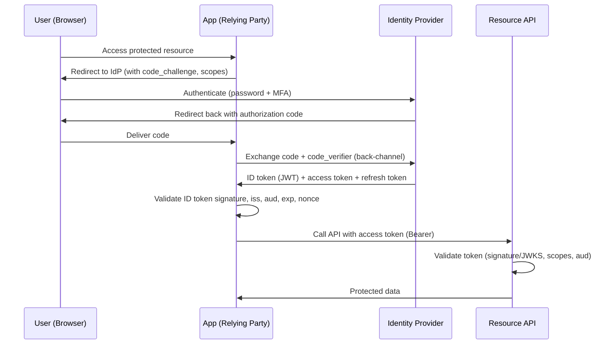
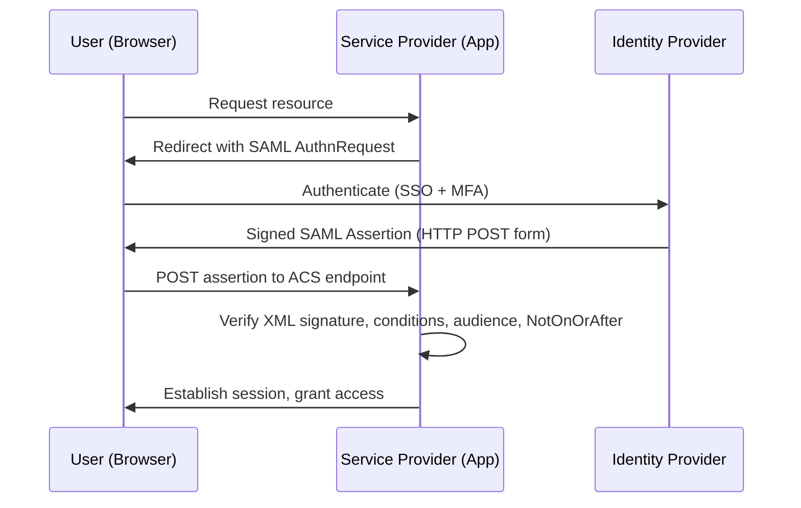
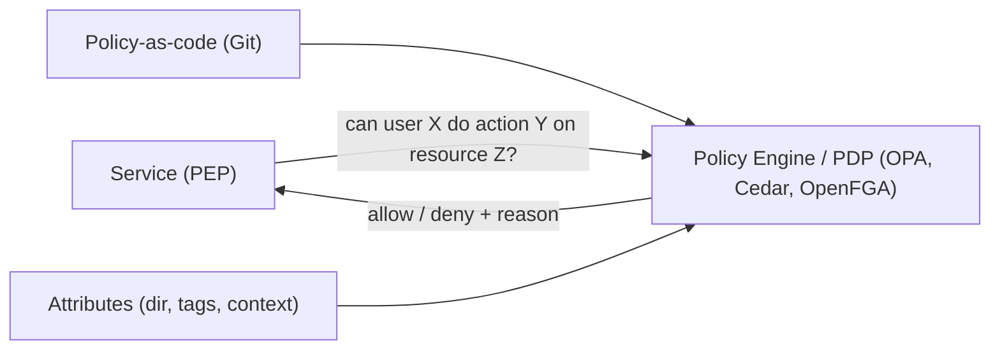
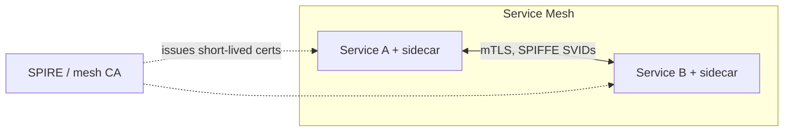
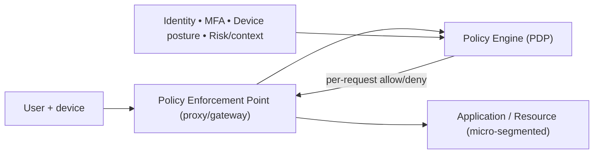

# Enterprise Identity & Access Management and Security

## Introduction

Identity and Access Management (IAM) answers two questions for every request that touches the enterprise: **who are you** (authentication) and **what are you allowed to do** (authorization). At enterprise scale this extends well beyond human logins to encompass workloads, services, machines, and third parties — and it must do so across dozens of SaaS apps, multiple clouds, and on-prem systems, under the constant scrutiny of auditors.

Security architecture wraps IAM: encryption, secrets management, network trust models, and audit logging. The modern center of gravity is **zero trust** — the assumption that the network is hostile and that every access must be explicitly verified, regardless of origin.

## Why It Matters at Enterprise Scale

- **Identity is the new perimeter.** With SaaS, remote work, and cloud, the network firewall no longer defines the boundary. The overwhelming majority of breaches involve stolen or misused credentials. Identity *is* the attack surface.
- **Scale and sprawl.** A large enterprise has tens of thousands of identities (employees, contractors, partners) and far more *machine* identities (services, pods, functions) — often outnumbering humans 10:1. Each is a potential entry point.
- **Joiner-Mover-Leaver.** People constantly join, change roles, and leave. Stale entitlements ("access creep") are a top audit finding. Lifecycle automation is essential.
- **Compliance.** SOC 2, ISO 27001, HIPAA, PCI-DSS, and SOX all mandate access control, least privilege, segregation of duties, and audit trails. IAM is where most of these controls live.

## Single Sign-On (SSO)

SSO lets a user authenticate once with a central **Identity Provider (IdP)** and gain access to many **Service Providers / Relying Parties (apps)** without re-entering credentials. Benefits: one strong credential to protect (paired with MFA), centralized policy and deprovisioning, reduced password fatigue and phishing surface, and a single audit point.

The IdP is now the most security-critical system in the enterprise — its compromise is catastrophic, so it must be hardened, MFA-protected (preferably phishing-resistant FIDO2/WebAuthn), and heavily monitored.

## SAML 2.0 vs OIDC / OAuth 2.0

These are the two dominant federation protocols. They are often confused because OIDC is built *on top of* OAuth 2.0.

- **OAuth 2.0** is an **authorization** framework — it issues *access tokens* that let a client call an API on a resource owner's behalf. It is **not** an authentication protocol by itself (a common and dangerous misconception — using a raw OAuth access token as proof of identity is an anti-pattern).
- **OIDC (OpenID Connect)** is a thin **authentication** layer on top of OAuth 2.0. It adds an **ID token** (a signed JWT containing identity claims) and a standardized `/userinfo` endpoint. OIDC = "who you are"; OAuth = "what you can access."
- **SAML 2.0** is an older XML-based standard that does both authentication and authorization assertion via signed XML assertions. It remains dominant for enterprise web SSO and legacy apps.

| Dimension          | SAML 2.0                          | OIDC / OAuth 2.0                         |
|--------------------|-----------------------------------|------------------------------------------|
| Format             | XML assertions                    | JSON / JWT tokens                        |
| Transport          | Browser POST/redirect (front-channel) | HTTP redirects + REST (back-channel) |
| Primary use        | Enterprise web SSO, legacy        | Modern web, mobile, SPA, APIs            |
| Mobile/SPA support | Poor                              | Excellent (PKCE)                         |
| Token              | SAML assertion                    | ID token (auth) + access/refresh (authz) |
| Complexity         | Heavier (XML signing/canonicalization) | Lighter, JSON/REST native           |
| Best for           | "I have AD-backed web apps"       | "I have APIs, mobile, and microservices" |

**Guidance:** Use **OIDC** for anything new — mobile apps, SPAs, microservice APIs. Use the **Authorization Code flow with PKCE** for public clients (no implicit flow — it is deprecated and leaks tokens in the URL). Retain **SAML** where vendor apps only support it. Most enterprise IdPs (Okta, Entra ID, Ping) speak both, so you can standardize the IdP while meeting each app where it is.

### OIDC Authorization Code + PKCE flow



### SAML SP-initiated flow



**Validation is where SAML/OIDC deployments get breached.** Always verify signatures, issuer (`iss`), audience (`aud`), expiry (`exp`/`NotOnOrAfter`), and `nonce`/`InResponseTo`. Historic SAML vulnerabilities (XML signature wrapping, comment-injection canonicalization bugs) all stem from sloppy assertion validation. Use a vetted library; never hand-roll XML/JWT verification.

## Federation

Federation establishes trust between identity domains so users authenticated in one domain access resources in another without a separate account. Patterns:

- **B2E (workforce):** corporate IdP federated to SaaS apps.
- **B2B (partner):** your IdP trusts a partner's IdP (or via a hub). Entra ID B2B, Okta Org2Org. Critical for supply chains and M&A.
- **B2C (customer):** customer IdP (Auth0, Cognito, Entra External ID) with social logins.
- **Cloud workforce federation:** federate the corporate IdP to AWS IAM Identity Center / Azure / GCP so engineers get short-lived cloud credentials via SSO instead of long-lived static keys — a major security win.

## Directory Services

The directory is the authoritative store of identities and groups.

- **LDAP** — the protocol/data model (hierarchical DIT) underlying most directories. OpenLDAP, 389-DS.
- **Active Directory (AD)** — Microsoft's on-prem directory using LDAP + Kerberos + DNS. Still the backbone of most enterprises for Windows auth, group policy, and Kerberos SSO.
- **Entra ID (formerly Azure AD)** — Microsoft's cloud IdP. *Not* an LDAP directory; it speaks SAML/OIDC/SCIM. Typically synced from on-prem AD via Entra Connect ("hybrid identity"). Backbone for Microsoft 365 and Azure.
- **Okta** — vendor-neutral cloud IdP and "universal directory," strong in heterogeneous SaaS estates.
- **SCIM** — the standard for *provisioning* (create/update/deactivate accounts) across apps. SSO handles login; SCIM handles lifecycle. Together they implement Joiner-Mover-Leaver automation — automatic deprovisioning on termination is a key control.

## Authorization Models at Scale: RBAC vs ABAC vs PBAC

| Model | Decision basis | Strengths | Weaknesses | Scale fit |
|-------|----------------|-----------|------------|-----------|
| **RBAC** | User → Role → Permissions | Simple, auditable, intuitive | "Role explosion"; coarse-grained; can't express context | Good for stable org structures |
| **ABAC** | Attributes of subject, resource, action, environment evaluated by policy | Fine-grained, context-aware (time, location, data classification), fewer artifacts | Harder to reason about/audit; policy complexity | Large, dynamic, data-centric |
| **PBAC** | Centralized policies (often ABAC under the hood) externalized from app code | Central governance, consistent enforcement, auditable policy-as-code | Requires a policy engine and discipline | Microservices, zero trust |

- **RBAC** assigns permissions to roles, roles to users. Works well until you need exceptions ("EU managers can approve refunds under €500 during business hours") — encoding that as roles causes **role explosion** (thousands of near-duplicate roles).
- **ABAC** evaluates *attributes* — `subject.department == resource.owner_dept AND resource.classification != "restricted" AND env.time in business_hours`. Expressive, but policies can become opaque; invest in testing and explainability.
- **PBAC** externalizes authorization into a central **policy engine** queried by services — **Open Policy Agent (OPA)/Rego**, AWS Cedar/Verified Permissions, OpenFGA (Google Zanzibar-style relationship-based). This is the modern microservices pattern: **policy decision point (PDP)** separate from **policy enforcement points (PEP)** in each service, with policy-as-code in version control.

**Practical hybrid:** Most mature enterprises use **RBAC for coarse grants + ABAC/PBAC for fine-grained, contextual decisions**, externalized to a PDP. Always pair with **least privilege** and **segregation of duties** (the person who requests cannot approve their own access).



## Privileged Access Management (PAM)

Privileged accounts (admins, root, DBAs, break-glass) are the crown jewels. PAM controls them:

- **Credential vaulting & rotation** — privileged passwords/keys stored in a vault, rotated automatically, never known to humans.
- **Just-in-Time (JIT) access** — no standing admin rights; access is requested, approved, and time-boxed (zero standing privilege). Entra PIM, CyberArk, BeyondTrust, Teleport.
- **Session brokering & recording** — admins connect through a broker that records the session for audit; no direct credentials.
- **Break-glass accounts** — emergency accounts, MFA-protected, heavily alarmed, used only when normal paths fail, with mandatory post-use review.

The goal: **zero standing privilege** — privilege exists only for the moment it is needed and is fully audited.

## Secrets Management

Application secrets (DB passwords, API keys, certificates, tokens) must never live in code, config files, container images, or environment variables checked into source.

- **HashiCorp Vault** — dynamic secrets (generates short-lived DB credentials on demand), encryption-as-a-service, leasing/revocation, PKI.
- **Cloud KMS / Secrets Managers** — AWS KMS + Secrets Manager, Azure Key Vault, GCP Secret Manager + Cloud KMS. Managed, IAM-integrated, auto-rotation.
- **Principles:** centralize; prefer **dynamic, short-lived** secrets over static; rotate automatically; scope tightly (one secret, one consumer); audit every access. Pair with secret-scanning in CI to block commits that leak credentials.

```hcl
# Example: Vault dynamic database secret — a short-lived, auto-revoked credential
path "database/creds/reporting-ro" {
  capabilities = ["read"]   # app reads a fresh username/password with a 1h TTL
}
# Vault generates the DB user, leases it, and revokes it on expiry — no static password exists.
```

## Service-to-Service Authentication

Machine identities now dominate. Services must authenticate to each other without embedded static secrets.

- **mTLS (mutual TLS):** both client and server present X.509 certificates. The basis for service-mesh auth (Istio, Linkerd) — each workload gets a short-lived identity certificate, encrypting and authenticating all service-to-service traffic.
- **Workload identity:** bind identity to the workload, not a stored secret. **SPIFFE/SPIRE** issues cryptographically verifiable IDs (SVIDs) to workloads. Cloud equivalents: AWS IAM Roles for Service Accounts (IRSA) on EKS, GKE Workload Identity, Azure Workload Identity — the pod assumes a role via a federated token, eliminating long-lived keys.
- **OAuth 2.0 client credentials grant** for service-to-service API auth where a token model fits.



## Zero-Trust Architecture

Zero trust replaces "trusted internal network" with **"never trust, always verify."** Core tenets (per NIST SP 800-207):

1. **No implicit trust by network location** — being "inside the VPN" grants nothing.
2. **Verify explicitly** — authenticate and authorize every request using identity, device posture, and context.
3. **Least privilege & micro-segmentation** — minimal, just-enough access; lateral movement is contained.
4. **Assume breach** — design as if attackers are already inside; encrypt everything, log everything, limit blast radius.

Building blocks: strong identity + MFA (phishing-resistant), device trust/posture, a **policy engine** (PDP) making per-request decisions, micro-segmentation, and continuous monitoring. **Zero Trust Network Access (ZTNA)** replaces the flat VPN with per-application, identity-aware access (BeyondCorp, Cloudflare Access, Zscaler).



## Encryption & Key Management

- **In transit:** TLS 1.2+ (prefer 1.3) everywhere — external *and* internal (zero trust: no plaintext on the wire). mTLS for service-to-service.
- **At rest:** disk/volume, database, and object-store encryption (AES-256). Cloud services make this default; the real work is **key management**.
- **Key management hierarchy:** envelope encryption — data encrypted with a **Data Encryption Key (DEK)**, the DEK encrypted by a **Key Encryption Key (KEK)** held in KMS/HSM. The KEK never leaves the HSM boundary.
- **HSM (Hardware Security Module):** tamper-resistant hardware (FIPS 140-2/140-3 validated) that performs crypto operations without exposing keys. AWS CloudHSM, Azure Dedicated HSM, Thales. Required by PCI-DSS for cardholder-data key operations.
- **BYOK / HYOK:** Bring/Hold Your Own Key — customer controls keys (and can revoke to render data unreadable). Important for data-residency and regulated workloads.
- **Rotation & lifecycle:** automate key rotation; separate duties for key management (a developer should not be able to both use and export a KEK).

```
 Plaintext ──encrypt──▶ Ciphertext
      ▲ DEK (per object)
      │ encrypted by
      ▼ KEK (in HSM/KMS, never exported)   ◀── rotation, access policy, audit
```

## Audit Logging

Every authentication, authorization decision, and privileged action must be logged — for forensics, compliance, and detection.

- **What to log:** logins/failures, MFA events, token issuance, authorization denials, privilege grants/use, secret access, admin/config changes, data access for regulated data.
- **Properties:** **immutable/tamper-evident** (write-once, hash-chained, WORM storage), time-synchronized (NTP), retained per compliance (often 1–7 years), centralized into a SIEM (Splunk, Sentinel, Elastic, Chronicle), and shipped *off the host* in real time so an attacker who compromises a box cannot erase the trail.
- Feed logs to detection (anomalous access, impossible travel, privilege escalation) and to **access reviews/recertification**. Logging without alerting and review is just storage. (See `07_compliance_governance.md` for retention and immutability requirements.)

## Anti-Patterns

- **Using OAuth access tokens as proof of identity.** OAuth authorizes; it does not authenticate. Use OIDC ID tokens for identity.
- **Skipping token/assertion validation** — not checking signature, `iss`, `aud`, `exp`, `nonce`. The root cause of most SAML/JWT breaches. Never hand-roll verification.
- **Implicit flow / tokens in URLs** for SPAs and mobile. Use Authorization Code + PKCE.
- **Standing privileged access.** Long-lived admin rights and shared root accounts. Use JIT/PAM and zero standing privilege.
- **Long-lived static credentials** (cloud access keys, embedded API keys, secrets in env/Git). Use workload identity, dynamic/short-lived secrets, and federation.
- **Role explosion.** Thousands of bespoke RBAC roles. Adopt ABAC/PBAC for contextual rules.
- **Authorization logic scattered in every service.** Centralize on a PDP with policy-as-code.
- **Trusting the internal network.** "It's behind the firewall" is not a control. Adopt zero trust; encrypt internal traffic.
- **No automated deprovisioning.** Manual offboarding leaves dormant accounts (a leading breach vector). Automate Leaver via SCIM.
- **Logs on the compromised host only.** Ship audit logs off-box, immutable, in real time.
- **Self-managed crypto.** Rolling your own algorithms or storing KEKs in app config. Use KMS/HSM and standard libraries.

## Key Takeaways

- Identity is the perimeter; the IdP is the most security-critical system you run — harden it, MFA it (phishing-resistant), monitor it.
- OIDC/OAuth2 for new apps (Auth Code + PKCE), SAML for legacy; standardize on one IdP that speaks both. OAuth authorizes, OIDC authenticates — don't confuse them.
- Combine RBAC (coarse) with ABAC/PBAC (fine-grained, contextual) and externalize decisions to a central policy engine with policy-as-code.
- Eliminate standing privilege and static secrets: JIT/PAM, dynamic short-lived secrets, and workload identity (SPIFFE/mTLS, IRSA) for machines.
- Adopt zero trust: never trust the network, verify every request with identity + device + context, micro-segment, assume breach.
- Encrypt in transit (TLS 1.3/mTLS) and at rest (envelope encryption with KEKs in KMS/HSM); automate key rotation and separate duties.
- Log every auth and privileged action immutably, off-host, centralized — and actually review and alert on it.
- Automate the full identity lifecycle (SCIM) so access is granted least-privilege and revoked promptly.
