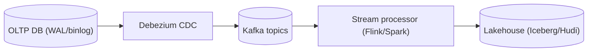
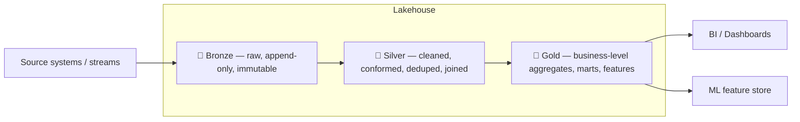
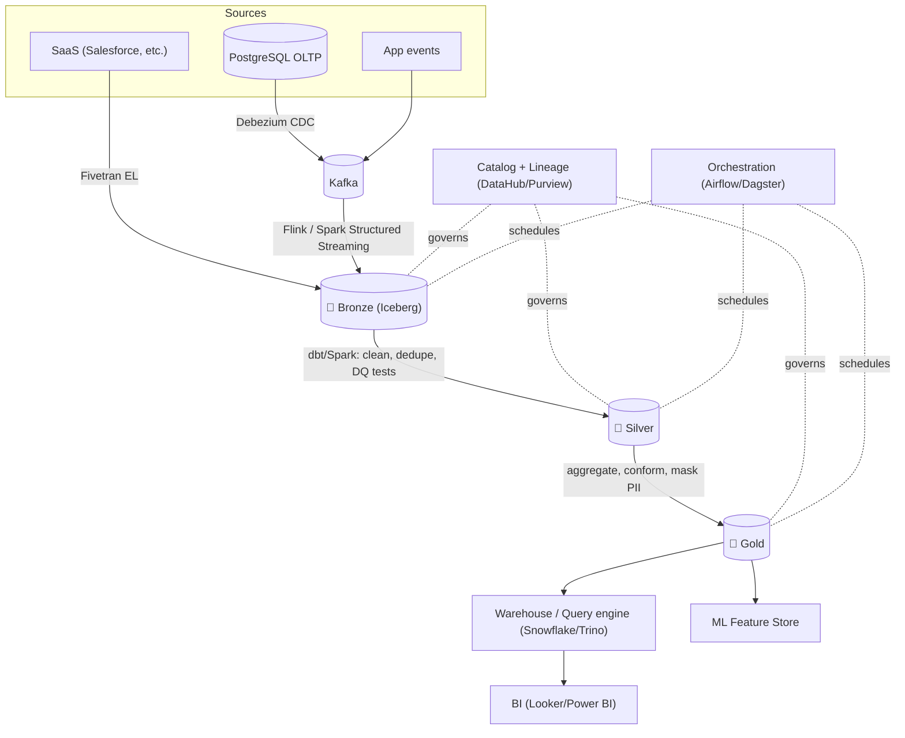

# The Enterprise Data Platform

## Introduction

The enterprise data platform is the set of systems that capture, store, process, govern, and serve data across the organization — powering everything from operational applications to analytics, BI, and machine learning. Designing it well is a balancing act between *operational* systems optimized for transactions and *analytical* systems optimized for large-scale aggregation, joined by pipelines that move and reshape data while preserving correctness, lineage, and governance.

This document covers the analytical/data-engineering side of the platform: warehouses, lakes, lakehouses, processing paradigms, ingestion patterns, and the governance that keeps it trustworthy.

## Why It Matters at Enterprise Scale

- **Data is decoupled from a single app.** Hundreds of source systems must be integrated to answer cross-domain questions ("lifetime value by region by product line").
- **Volume, velocity, variety.** Terabytes-to-petabytes, real-time streams, and structured/semi-structured/unstructured data coexist.
- **Trust is everything.** Bad data produces confidently wrong decisions. Governance, quality, and lineage are not optional add-ons — they determine whether the platform is used or quietly abandoned.
- **Cost.** Cloud data platforms can become runaway cost centers (compute on huge scans, data egress, redundant copies). Architecture choices have direct financial consequences.
- **Compliance.** PII, residency, retention, and right-to-be-forgotten obligations cut across the entire platform (see `07_compliance_governance.md`).

## OLTP vs OLAP

The foundational distinction.

| Dimension      | OLTP (Online Transaction Processing)     | OLAP (Online Analytical Processing)        |
|----------------|------------------------------------------|--------------------------------------------|
| Purpose        | Run the business (operational apps)      | Analyze the business (BI, ML)              |
| Workload       | Many small reads/writes, point lookups   | Few large, scan-heavy aggregations         |
| Data model     | Normalized (3NF)                         | Denormalized (star/snowflake schema)       |
| Storage        | Row-oriented                             | Column-oriented                            |
| Latency target | Milliseconds per transaction             | Seconds–minutes per query                  |
| Examples       | PostgreSQL, MySQL, Oracle, SQL Server    | Snowflake, BigQuery, Redshift, Databricks  |

**Why columnar wins for analytics:** OLAP queries touch few columns across many rows. Column storage reads only the needed columns, compresses better (homogeneous values), and enables vectorized execution. Formats: **Parquet/ORC** on disk; columnar engines in warehouses. Conversely, row storage is ideal for OLTP, where you touch whole records.

**Don't run analytics on the OLTP database.** Heavy scans contend with operational transactions and degrade the customer-facing app. Move analytical work to an OLAP system fed by pipelines (or read replicas/CDC).

## Data Warehouse

A data warehouse is a centralized, governed, **schema-on-write** analytical store of cleaned, structured data, optimized for SQL analytics and BI.

- **Snowflake** — separates storage from compute ("virtual warehouses"); multi-cloud; strong concurrency and sharing.
- **Amazon Redshift** — AWS-native MPP warehouse; RA3 nodes separate compute/storage; Spectrum queries S3.
- **Google BigQuery** — serverless, fully managed; you pay per query/slot; massive scale with no cluster to manage.
- **Azure Synapse / Microsoft Fabric** — Azure's integrated analytics.

Warehouses excel at fast, governed SQL on structured data but historically struggled with unstructured data, ML feature pipelines, and the cost of loading everything up front. They typically use **star schemas** (fact tables + dimension tables) for BI.

## Data Lake

A data lake stores raw data of *any* type (structured, semi-structured, unstructured) in cheap object storage with **schema-on-read** — you impose structure at query time, not load time.

- **Storage:** Amazon S3, Azure Data Lake Storage (ADLS) Gen2, Google Cloud Storage.
- **Strengths:** cheap, infinitely scalable, format-agnostic, ideal for ML/raw retention and "store now, decide later."
- **Risk — the "data swamp":** without governance, cataloging, and quality, a lake degenerates into an ungoverned dumping ground no one trusts or can navigate. The lake's flexibility is also its failure mode.

## The Lakehouse

The lakehouse merges the cheap, open storage of the lake with the reliability, performance, and governance of the warehouse — by adding a **transactional table format** over object-store files (typically Parquet).

Open table formats:

- **Delta Lake** — ACID transactions, time travel, schema enforcement/evolution; Databricks origin, now broadly supported.
- **Apache Iceberg** — open, vendor-neutral, hidden partitioning, schema/partition evolution, strong engine interoperability (Snowflake, Spark, Trino, Flink, BigQuery). Increasingly the industry standard for openness.
- **Apache Hudi** — optimized for upserts/incremental processing and CDC ingestion.

These formats provide ACID transactions, time travel (query historical snapshots), schema enforcement, and efficient upserts/deletes over a data lake — closing the gap with warehouses while keeping data in open formats you control (avoiding lock-in and duplicate copies).

```
  Warehouse:  governed, fast, structured        ── but ── proprietary, costly to load all
  Lake:       cheap, any data, open             ── but ── no ACID, "swamp" risk
  Lakehouse:  ACID + governance OVER cheap open object storage  (best of both)
```

## ETL vs ELT

Both move data from sources to the analytical store; they differ on *where transformation happens*.

- **ETL (Extract, Transform, Load):** transform in a dedicated engine *before* loading. Classic with on-prem warehouses where storage/compute were scarce. Tools: Informatica, Talend, SSIS.
- **ELT (Extract, Load, Transform):** load raw data first, then transform *inside* the powerful, elastic cloud warehouse/lakehouse. The modern default — cloud compute is cheap and elastic, and keeping raw data enables reprocessing. Tools: Fivetran/Airbyte (EL) + **dbt** (the T, as version-controlled SQL with tests and lineage).

**Guidance:** Prefer **ELT** in the cloud — it preserves raw data (enabling reprocessing when logic changes or bugs are found) and leverages elastic warehouse compute. Use ETL when you must transform/mask before landing (e.g., stripping PII before it ever touches the lake) or for legacy constraints.

## Batch vs Streaming

- **Batch:** process bounded data on a schedule (hourly/daily). High throughput, simpler, cheaper. Engine: **Apache Spark** (and managed Databricks, EMR, Dataproc).
- **Streaming:** process unbounded data continuously, event-by-event or in micro-batches, for low latency (seconds). Engines: **Apache Flink** (true streaming, event-time, exactly-once), Spark Structured Streaming, Kafka Streams.
- **Apache Kafka** — the durable, partitioned, replayable event log that is the backbone of streaming and event-driven architectures; the integration spine for CDC, microservices events, and real-time pipelines. (Pulsar, Kinesis, Pub/Sub are alternatives.)

**Lambda vs Kappa:** The older *Lambda* architecture runs parallel batch and speed layers and reconciles them (complex — two codebases). The *Kappa* architecture processes everything as a stream and replays the log for reprocessing (simpler; favored when your stream engine and log are robust). Choose by latency needs: most enterprises run batch for the bulk and add streaming only where real-time materially changes the outcome (fraud, personalization, operational dashboards).

## Change Data Capture (CDC)

CDC captures row-level changes (insert/update/delete) from source OLTP databases *as they happen*, typically by reading the database transaction log (e.g., the WAL/binlog), and streams them downstream.

- **Why:** low-impact (reads the log, not the tables — no heavy queries against production), near-real-time, captures deletes, enables incremental ingestion instead of full reloads.
- **Tools:** **Debezium** (open source, Kafka Connect), Fivetran, AWS DMS, GoldenGate.
- **Pattern:** Source DB → CDC → Kafka → lakehouse (often into Hudi/Iceberg for efficient upserts). CDC is the primary modern bridge from OLTP to the analytical platform.



## The Medallion Architecture

A layered refinement pattern (popularized by Databricks) that progressively improves data quality and structure — applicable to any lakehouse.



- **Bronze (raw):** ingest as-is, append-only, immutable. Your replayable source of truth; preserve everything (including bad records) so you can reprocess.
- **Silver (cleaned/conformed):** validate, deduplicate, conform schemas, join, apply data-quality rules. Trustworthy, queryable, the workhorse layer.
- **Gold (curated):** business-level aggregates, dimensional marts, ML feature tables — optimized for consumption.

The value: **reproducibility** (replay from bronze when logic changes), clear quality gates, and separation of concerns. Apply masking/PII handling at the silver/gold boundary per governance rules.

## Data Mesh vs Centralized

As platforms scale, the *organizational* model matters as much as the technology.

| Aspect          | Centralized (warehouse / single platform team) | Data Mesh (decentralized)                      |
|-----------------|------------------------------------------------|------------------------------------------------|
| Ownership       | One central data team owns all pipelines       | Domain teams own their data as products        |
| Strength        | Consistency, control, simpler governance       | Scales org-ically; domain expertise; less bottleneck |
| Weakness        | Central team becomes a bottleneck at scale     | Risk of inconsistency without strong federated governance |
| Governance      | Centralized                                    | **Federated computational governance** (global policies, local execution) |
| Fit             | Small/medium orgs, fewer domains               | Large orgs with many autonomous domains        |

**Data mesh** (Zhamak Dehghani) rests on four principles: domain-oriented ownership, **data-as-a-product** (discoverable, addressable, trustworthy, with SLAs), self-serve data platform, and federated computational governance. It is an organizational/socio-technical shift, not a product you buy. **Reality check:** mesh adds coordination overhead and only pays off when central bottlenecks are real. Many enterprises run a **hybrid** — central platform/governance with domain-owned products on top. Don't adopt mesh to solve a problem you don't yet have.

## Data Governance, Catalog & Lineage

Governance makes the platform *trustworthy* and *usable*.

- **Data Catalog:** searchable inventory of datasets with metadata, owners, descriptions, and classifications, so people can *find* and understand data. Tools: Collibra, Alation, **DataHub**, **OpenMetadata**, Unity Catalog, AWS Glue Data Catalog, Microsoft Purview.
- **Data Lineage:** traces data's journey from source through every transformation to consumption. Essential for impact analysis ("if I change this column, what breaks?"), debugging, and regulatory traceability ("where did this PII come from and where did it go?"). Often captured automatically (OpenLineage, dbt, Spark listeners).
- **Data Classification:** tag data by sensitivity (public / internal / confidential / restricted; PII / PHI / cardholder). Classification drives masking, access, and retention policy.
- **Access governance:** fine-grained access (row/column-level security, dynamic masking) integrated with IAM (see `05_iam_security.md`).

## Master Data Management (MDM)

MDM creates a single, authoritative, deduplicated record ("golden record") for core business entities — customer, product, supplier, account — across disparate systems.

- **Problem it solves:** the same customer exists as five subtly different records across CRM, billing, and support, breaking analytics and customer experience.
- **Approach:** match/merge/survivorship rules to resolve duplicates and conflicts into a canonical entity, then syndicate it. Styles: registry, consolidation, centralized, coexistence.
- **Tools:** Informatica MDM, Reltio, SAP MDG, Profisee. MDM is as much about data stewardship and governance process as technology.

## Data Quality

Untrustworthy data is worse than no data — it produces confidently wrong decisions. Embed quality as automated tests in pipelines (typically at the bronze→silver gate).

Dimensions: **accuracy, completeness, consistency, timeliness, uniqueness, validity.**

```yaml
# Example data-quality assertions (dbt tests / Great Expectations style)
models:
  - name: silver_orders
    columns:
      - name: order_id
        tests: [unique, not_null]          # uniqueness, completeness
      - name: order_total
        tests:
          - not_null
          - dbt_utils.accepted_range: {min_value: 0}   # validity
      - name: customer_id
        tests:
          - relationships: {to: ref('dim_customer'), field: customer_id}  # referential integrity
```

Tools: **dbt tests**, **Great Expectations**, **Soda**, Monte Carlo / Anomalo (data observability). Fail the pipeline (or quarantine bad records) rather than silently propagating bad data downstream.

## End-to-End Pipeline Example

A realistic enterprise pipeline combining the above:



Orchestration (**Airflow**, **Dagster**, Prefect) coordinates dependencies, retries, and scheduling across the DAG; the catalog and lineage tooling observe the whole flow.

## Anti-Patterns

- **Running analytics on the production OLTP database.** Scans starve transactions; use OLAP fed by CDC/replicas.
- **The data swamp.** A lake with no catalog, classification, or quality — undiscoverable and untrusted.
- **No raw/bronze retention.** Transforming on ingest with no immutable raw copy means you cannot reprocess when logic changes or bugs surface. Keep bronze.
- **Streaming everywhere by default.** Real-time is complex and costly; use it only where latency materially changes the decision.
- **Quality as an afterthought.** Discovering bad data in the executive dashboard. Test at ingestion gates and fail fast.
- **Lineage/catalog skipped** until an auditor or a "where did this number come from?" fire drill forces it.
- **Premature data mesh.** Adopting decentralized ownership before central bottlenecks exist, adding coordination cost with no benefit.
- **Copy sprawl.** Duplicating the same dataset across many stores/teams — cost, drift, and governance nightmares. Favor open lakehouse tables shared in place.
- **Ignoring PII in pipelines.** Loading sensitive data unmasked into the lake where it spreads uncontrollably. Classify and mask early.

## Key Takeaways

- Separate OLTP (operational, row-store, normalized) from OLAP (analytical, columnar, denormalized); never analyze on the transactional database.
- The **lakehouse** (Iceberg/Delta/Hudi over object storage) is the modern convergence — ACID and governance over cheap, open storage; prefer open formats to avoid lock-in and copy sprawl.
- Default to **ELT** in the cloud to preserve raw data and leverage elastic compute; reserve ETL for pre-load masking/legacy needs.
- Use **batch** for the bulk; add **streaming** (Kafka + Flink/Spark) only where real-time changes outcomes. **CDC** (Debezium) is the modern bridge from OLTP to analytics.
- Structure refinement with the **medallion** (bronze→silver→gold) for reproducibility and clear quality gates.
- **Governance is the platform's foundation, not a feature:** catalog, lineage, classification, MDM, and automated data-quality tests are what make data trustworthy and the platform actually used.
- Choose centralized vs **data mesh** by organizational scale; mesh is a socio-technical shift — adopt it only when central bottlenecks are real, and always with federated governance.
