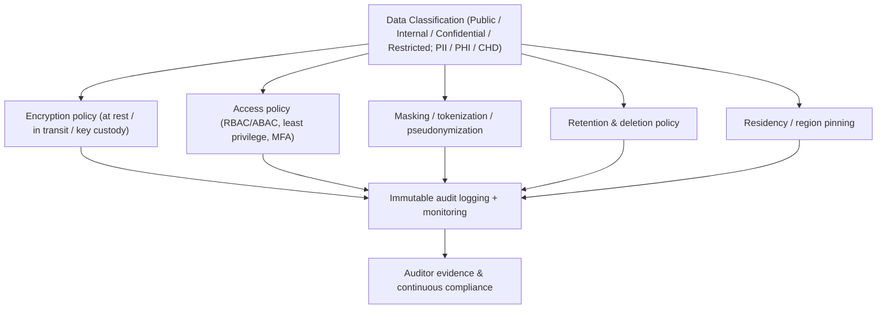

# Enterprise Compliance & Governance

## Introduction

Compliance is the discipline of designing, operating, and *proving* that systems meet legal, regulatory, and contractual obligations. Governance is the framework of policies, ownership, and controls that makes compliance repeatable rather than heroic. For an architect, the central insight is this: **compliance is an architectural concern, not a paperwork exercise.** Requirements like encryption, audit immutability, data residency, retention, and the right to erasure must be designed into the system from day one — retrofitting them is expensive, error-prone, and sometimes impossible.

This document surveys the major regimes (GDPR, HIPAA, PCI-DSS, SOC 2, ISO 27001), shows how each *shapes architecture*, and covers the cross-cutting mechanisms — data classification, PII handling, audit immutability, access reviews, and the shared-responsibility model.

## Why It Matters at Enterprise Scale

- **Material financial and legal risk.** GDPR fines reach up to €20M or 4% of global annual turnover; HIPAA and PCI penalties are severe; PCI non-compliance can revoke the ability to process cards at all.
- **It gates revenue.** Enterprise customers will not buy without a SOC 2 report or ISO 27001 certificate. Compliance is a sales prerequisite, not just risk management.
- **It is cross-cutting.** A single customer record may simultaneously be subject to GDPR (EU resident), contain PHI (HIPAA), and include a card number (PCI). The architecture must satisfy all applicable regimes at once.
- **Auditability is continuous.** Auditors require *evidence over time*, not a point-in-time snapshot. Controls must be operating and logged continuously.

## The Major Regimes

### GDPR (General Data Protection Regulation)

EU regulation protecting personal data of EU/EEA residents (applies extraterritorially to any org processing their data).

- **Data subject rights:** access, rectification, **erasure ("right to be forgotten")**, portability, restriction, and objection. Architecture must be able to *find, export, and delete* all of an individual's data on request, across every system and backup — which is hard if data is scattered or copied uncontrollably.
- **Consent:** must be freely given, specific, informed, and revocable; you must record *what* was consented to and *when*, and stop processing on withdrawal.
- **Right to be forgotten:** deletion across primary stores, replicas, backups, logs, and analytics. Common architectural pattern: **crypto-shredding** — encrypt each subject's data with a per-subject key and delete the key to render data unrecoverable (since physically purging immutable backups is impractical).
- **Data residency / transfer:** restrictions on moving personal data outside the EU; drives region-pinned storage and processing.
- **Privacy by design & by default** (Article 25): build privacy in from the start; minimize data collected.
- **Breach notification:** within 72 hours of awareness to the supervisory authority.
- **Roles:** **Controller** (decides purposes/means) vs **Processor** (acts on controller's instructions) — your role determines your obligations.

### HIPAA (Health Insurance Portability and Accountability Act)

US law protecting **PHI (Protected Health Information)** — health data that identifies an individual.

- **Rules:** Privacy Rule (use/disclosure), **Security Rule** (administrative, physical, technical safeguards for ePHI), Breach Notification Rule.
- **Technical safeguards:** access control, audit controls, integrity, transmission security (encryption), unique user IDs. Encryption of ePHI at rest and in transit is the de facto requirement.
- **BAA (Business Associate Agreement):** any vendor (including cloud providers) handling PHI must sign a BAA. Use only HIPAA-eligible cloud services and *configure them in scope* — eligibility is necessary, not sufficient.
- **Minimum necessary:** access only the PHI required for the task.

### PCI-DSS (Payment Card Industry Data Security Standard)

Contractual standard (not law) for any entity that stores, processes, or transmits **cardholder data (CHD)**.

- **Scope is everything.** PCI applies to the **Cardholder Data Environment (CDE)** — all systems that touch CHD. The dominant strategy is **scope reduction**: minimize the systems in the CDE via network segmentation, and avoid storing CHD at all.
- **Tokenization & truncation:** replace the **PAN (Primary Account Number)** with a non-sensitive **token** (reversible only via a secured token vault). Tokenization removes systems from PCI scope because they never hold real card data — the single most effective PCI architecture pattern. Outsourcing to a payment processor (Stripe, Adyen) shifts most scope to them.
- **Never store sensitive authentication data** (full magnetic stripe, CVV, PIN) post-authorization — ever.
- **Encryption, key management (HSM), segmentation, logging, quarterly scans, annual assessment.** Strong key management (often HSM-backed) is mandatory.

### SOC 2 (System and Organization Controls 2)

An AICPA *attestation* (auditor's report), not a certification, evaluating controls against the **Trust Services Criteria**: **Security** (required), plus optional Availability, Processing Integrity, Confidentiality, Privacy.

- **Type I** = controls designed appropriately at a point in time. **Type II** = controls *operated effectively over a period* (typically 6–12 months) — what enterprise buyers expect.
- Heavy emphasis on **evidence**: access reviews, change management, monitoring, incident response, vendor management. Architecturally it pushes you toward automated audit logging, IaC with change controls, and centralized access governance.

### ISO 27001

International *certification* standard for an **Information Security Management System (ISMS)** — a risk-based management framework. **Annex A** lists controls (the 2022 revision groups them into organizational, people, physical, and technological). Certification by an accredited body, with surveillance audits. Globally recognized; complements SOC 2 (process/management focus vs SOC 2's attestation focus).

| Regime    | Type            | Protects            | Geography     | Penalty driver                  | Key architectural lever |
|-----------|-----------------|---------------------|---------------|---------------------------------|-------------------------|
| GDPR      | Law             | Personal data (EU)  | EU + extraterritorial | Up to 4% global revenue   | Erasure, residency, consent records |
| HIPAA     | Law             | PHI (health)        | US            | Fines, criminal liability       | Encryption, BAA, audit, access |
| PCI-DSS   | Contract/standard | Cardholder data   | Global (card networks) | Fines, loss of processing | Tokenization, segmentation, scope reduction |
| SOC 2     | Attestation     | Customer data/security | US-centric | Lost deals (trust)              | Audit logging, change mgmt, access reviews |
| ISO 27001 | Certification   | Information assets  | Global        | Lost deals, decertification     | ISMS, risk treatment, Annex A controls |

## How Compliance Shapes Architecture

The regimes differ in scope but converge on the same technical controls. Build these once, reuse across regimes:

- **Encryption** — at rest (AES-256, envelope encryption with KMS/HSM-held keys) and in transit (TLS 1.2+/1.3, mTLS internally). Required or strongly expected by all five. See `05_iam_security.md` for key management.
- **Audit trails** — comprehensive, immutable logging of access and changes (below).
- **Data retention & deletion** — retain only as long as lawful/necessary (GDPR minimization) yet long enough to satisfy mandated retention; automate deletion. These can *conflict* (e.g., financial records must be kept while GDPR wants erasure) — resolve via legal basis and per-data-type retention policy.
- **Data classification** — tag data by sensitivity to drive every other control.
- **PII/PHI handling** — masking, tokenization, pseudonymization, minimization.
- **Access control** — least privilege, segregation of duties, MFA, periodic access reviews.
- **Network segmentation** — isolate regulated environments (PCI CDE, PHI zones) to shrink scope and blast radius.
- **Data residency** — pin storage/processing to regions; constrains multi-region DR design (see `04_high_availability_dr.md`).



### Data Classification

Classification is the keystone — it determines which controls apply to which data.

| Classification | Examples                          | Typical controls |
|----------------|-----------------------------------|------------------|
| Public         | Marketing pages, public docs      | Integrity only   |
| Internal       | Internal wikis, non-sensitive ops | Access control   |
| Confidential   | Financials, source code, contracts| Encryption + restricted access + audit |
| Restricted     | PII, PHI, cardholder data, secrets| Encryption + masking/tokenization + strict least-privilege + full audit + residency |

Apply tags at ingestion and propagate them through the data platform (see `06_data_platform.md`) so masking/access/retention are enforced automatically by classification rather than ad hoc.

### PII Handling: Masking, Tokenization, Pseudonymization

Distinct techniques — choosing correctly matters for both compliance and usability:

| Technique        | Reversible? | What it does | Use case |
|------------------|-------------|--------------|----------|
| **Masking** (static/dynamic) | No (static); display-only (dynamic) | Hides/obscures (e.g., `****-****-****-1234`) | Showing data to lower-privilege users; non-prod test data |
| **Tokenization** | Yes (via secure vault) | Replaces value with an unrelated token | PCI scope reduction; preserve referential use without exposing data |
| **Pseudonymization** | Yes (with separate key) | Replaces identifiers with pseudonyms; re-identifiable only with extra info | GDPR-favored; analytics on personal data with reduced risk |
| **Anonymization** | No (irreversible) | Removes identifiability entirely | Data falls outside GDPR scope if truly anonymous (a high bar) |
| **Crypto-shredding** | N/A | Per-subject encryption key; delete key to "erase" | GDPR right-to-be-forgotten across backups |

```sql
-- Dynamic data masking example (SQL Server / Snowflake-style):
-- analysts see masked values; only the 'pii_reader' role sees the real email.
CREATE MASKING POLICY email_mask AS (val string) RETURNS string ->
  CASE WHEN CURRENT_ROLE() IN ('PII_READER') THEN val
       ELSE regexp_replace(val, '.+@', '****@') END;
ALTER TABLE customers MODIFY COLUMN email SET MASKING POLICY email_mask;
```

**Principle of data minimization:** the safest sensitive data is the data you never collect or store. Tokenize/avoid storing CHD; collect only the PII you have a lawful basis and genuine need for.

## Audit Logging & Immutability

Audit logs are the evidentiary backbone of every regime — they prove controls operate and enable forensics.

- **What to capture:** who, what, when, where, and the outcome — authentications, authorization decisions, privileged actions, configuration changes, and **access to regulated data** (HIPAA explicitly requires logging PHI access).
- **Immutability / tamper-evidence:** logs must be **write-once (WORM)** and tamper-evident. Mechanisms: cloud object storage with **Object Lock / immutability** (S3 Object Lock compliance mode, Azure immutable blob), hash-chaining/Merkle structures, append-only stores, and shipping logs *off the originating host in real time* so an attacker who compromises a server cannot erase the trail. AWS CloudTrail with log-file validation is a common control.
- **Retention:** align to the strictest applicable requirement (PCI: ≥1 year, 3 months immediately available; many regimes/contracts demand longer — financial/SOX often 7 years).
- **Time integrity:** synchronized clocks (NTP) so cross-system correlation and ordering are reliable.
- **Centralization + monitoring:** aggregate into a SIEM and alert. Logs that are never reviewed satisfy the letter but not the intent — auditors look for evidence of *active monitoring* and response.

```
 App/host ──(stream in real time)──▶ Central log pipeline ──▶ Immutable store (WORM/Object Lock)
                                              │                       │
                                              ▼                       ▼
                                          SIEM (alert)          Retained N years, hash-verified
```

## Access Reviews (Recertification)

Periodic recertification that each person's access is still appropriate — a cornerstone control for SOC 2, ISO 27001, HIPAA, and SOX.

- **Cadence:** typically quarterly for privileged/regulated access, at least annually for the rest, plus event-driven reviews on role change (Mover) and prompt revocation on termination (Leaver).
- **Process:** managers/data owners attest line-by-line; revocations are tracked to closure with evidence retained for auditors.
- **Segregation of duties (SoD):** ensure no individual holds a toxic combination (e.g., can both create and approve payments). Reviews must detect SoD violations.
- **Automation:** identity governance tools (SailPoint, Saviynt, Okta IGA) drive campaigns and produce audit evidence. Tie to least privilege and JIT/PAM from `05_iam_security.md` — the less standing access exists, the cheaper reviews become.

## The Shared-Responsibility Model

In the cloud, security and compliance obligations are **split** between provider and customer. Misunderstanding this split is a leading cause of breaches and audit failures.

```
  ┌──────────────────────────────────────────────────────────┐
  │ CUSTOMER  — security/compliance "IN the cloud"             │
  │  • Data classification, encryption choices & key custody   │
  │  • IAM: identities, roles, least privilege, MFA            │
  │  • OS/app patching (IaaS), app code, configuration         │
  │  • Network/firewall config, segmentation                   │
  │  • Logging enablement & monitoring; backups                │
  ├──────────────────────────────────────────────────────────┤
  │ PROVIDER  — security "OF the cloud"                         │
  │  • Physical data centers, hardware, host hypervisor        │
  │  • Managed-service infra, global network backbone          │
  │  • Foundational compliance certifications of the platform  │
  └──────────────────────────────────────────────────────────┘
```

- The line **shifts with the service model:** IaaS leaves more to you (OS, patching); PaaS/serverless and SaaS shift more to the provider — but **never** the customer's responsibility for **data, identity, and configuration**.
- **The provider's compliance does not equal yours.** AWS/Azure/GCP being SOC 2 / HIPAA / PCI compliant gives you a compliant *foundation*; you must still configure your workload in scope, sign the BAA (HIPAA), enable logging, manage keys, and pass your own audit. The vast majority of cloud breaches stem from **customer misconfiguration**, not provider failure (e.g., public S3 buckets).
- Cloud compliance programs (AWS Artifact, Azure compliance docs, GCP) provide the *provider-side* evidence; you supply the rest.

## Anti-Patterns

- **Treating compliance as paperwork.** Bolting controls on after build instead of designing encryption, audit, residency, and erasure in from day one.
- **"The cloud is compliant, so we are."** Misreading shared responsibility; leaving data/IAM/config insecure on a compliant platform.
- **Storing data you don't need.** Especially CHD/PII — every stored byte expands scope, risk, and erasure burden. Minimize and tokenize.
- **PCI scope creep.** Letting CHD flow through unsegmented systems instead of tokenizing and segmenting to shrink the CDE.
- **Mutable or host-local audit logs.** An attacker (or a careless admin) can erase them. Use WORM/immutable, off-host, real-time.
- **No way to delete a subject's data.** Discovering at the first GDPR erasure request that data is scattered across systems and immutable backups with no plan. Design crypto-shredding/lineage up front.
- **Logging without monitoring.** Collecting audit data no one reviews — fails the spirit of the control and misses breaches.
- **Stale access.** Skipping recertification; dormant and over-privileged accounts accumulate (top audit finding).
- **Conflicting retention/erasure with no policy.** Letting "keep forever" and "delete on request" collide unmanaged; define per-data-type retention with legal basis.
- **One-size-fits-all controls.** Applying restricted-tier controls to public data (wasteful) or internal-tier controls to PII (dangerous). Drive controls from classification.

## Key Takeaways

- Compliance is an **architectural concern**: encryption, immutable audit, residency, retention, and erasure must be designed in, not retrofitted.
- The regimes differ in scope (GDPR=personal data, HIPAA=PHI, PCI=cardholder data, SOC 2/ISO 27001=security management) but **converge on the same controls** — build encryption, audit, access governance, and classification once and reuse.
- **Data classification is the keystone** — it drives encryption, access, masking, retention, and residency decisions automatically.
- Minimize and protect sensitive data: **tokenize** to cut PCI scope, **mask/pseudonymize** for use without exposure, and **crypto-shred** to satisfy GDPR erasure across immutable backups.
- Audit logs must be **immutable, off-host, time-synced, retained, and actively monitored** — and they are the evidence auditors demand over time (SOC 2 Type II, etc.).
- Run periodic **access reviews** with segregation of duties; pair with least privilege/JIT to keep them cheap and effective.
- Understand the **shared-responsibility model**: the provider secures the cloud; *you* are always responsible for your data, identities, and configuration — a compliant platform is not a compliant workload.
