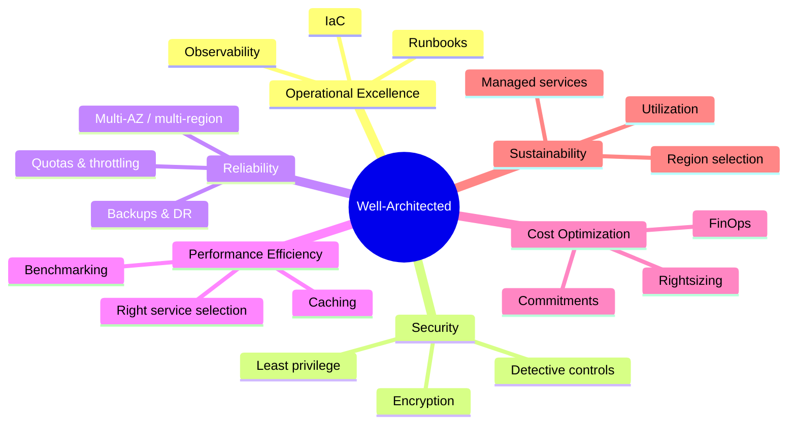
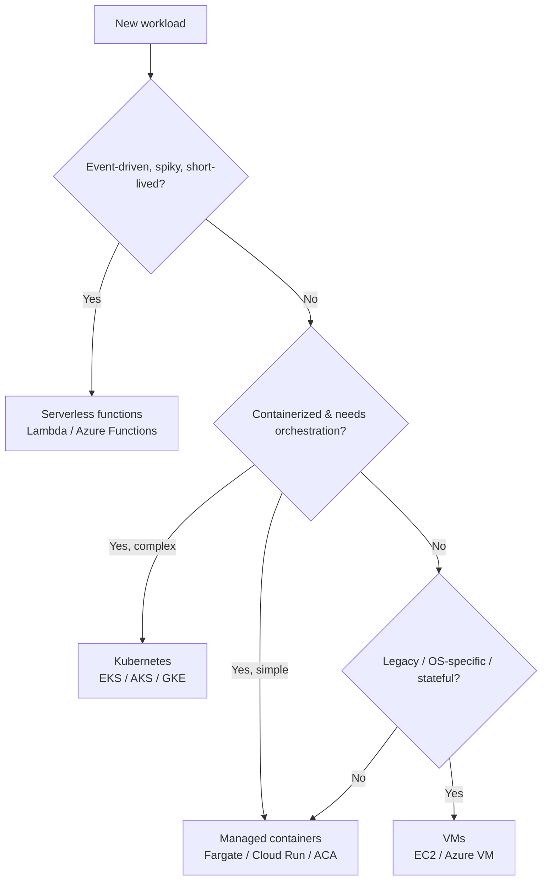
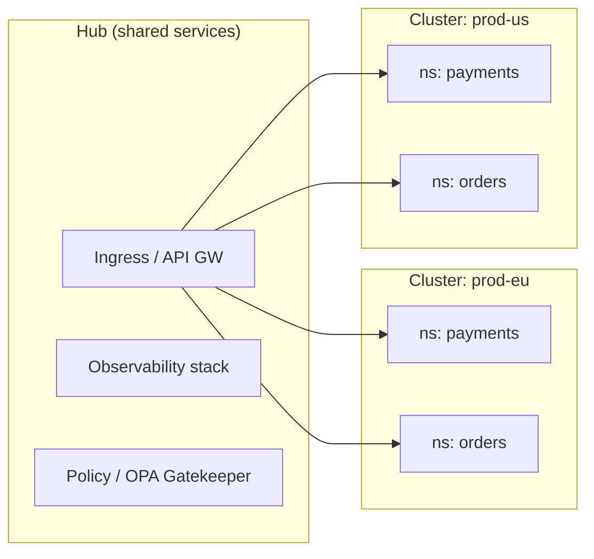
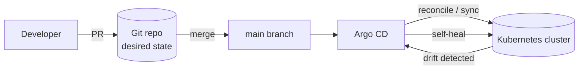
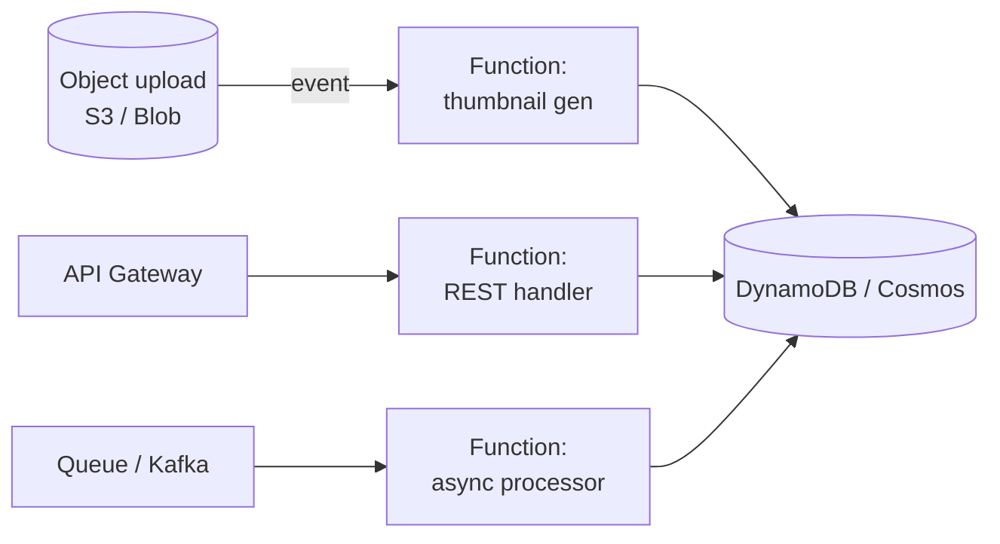
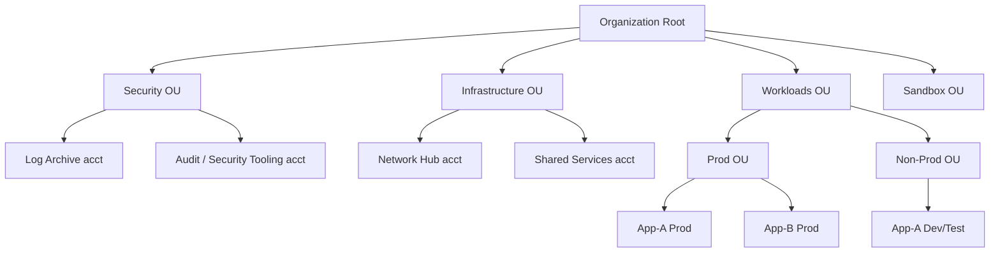
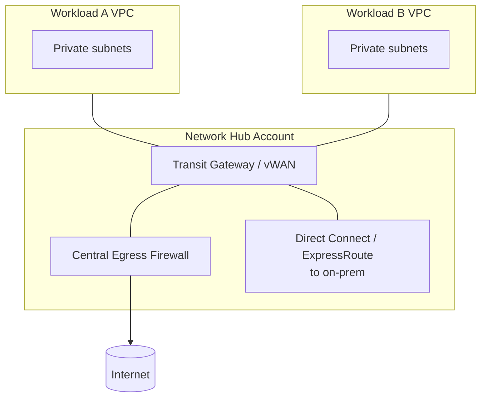
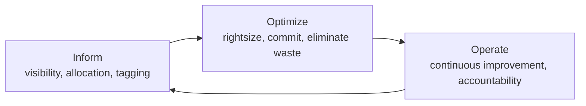
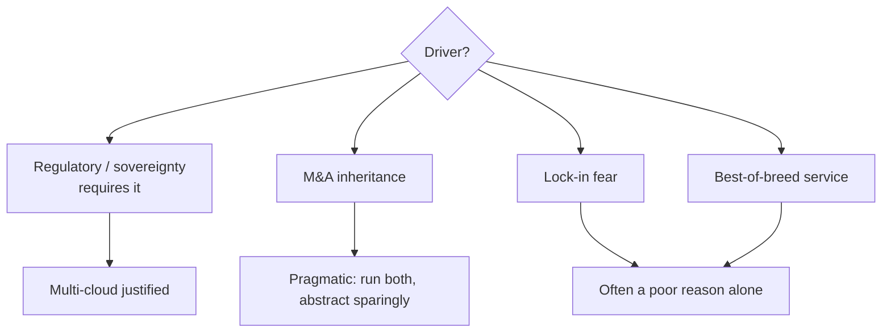

# 08 — Enterprise Cloud Architecture

> Audience: senior engineers, staff engineers, and architects responsible for designing, operating, and governing cloud platforms at enterprise scale.

## Introduction

Cloud architecture at enterprise scale is fundamentally different from spinning up a few VMs for a side project. You are designing for hundreds of teams, thousands of workloads, strict regulatory regimes (SOX, HIPAA, GxP, PCI-DSS, GDPR), multi-year cost commitments measured in tens of millions of dollars, and an organizational reality where the platform itself is a product consumed by internal customers.

The hard part is rarely the technology. It is the combination of **governance at scale** (how do you let 200 teams move fast without 200 ways of doing security?), **cost accountability** (who pays for that idle GPU fleet?), and **blast-radius containment** (how do you ensure one team's mistake cannot take down a regulated production workload?).

This document covers the foundational decisions: the Well-Architected Framework as a shared vocabulary, service models, compute selection, Kubernetes and serverless at scale, Infrastructure as Code, landing zones, networking, cost/FinOps, and the multi-cloud question.

---

## Why It Matters at Enterprise Scale

| Concern | Startup reality | Enterprise reality |
|---|---|---|
| Accounts | 1–3 accounts, shared | Hundreds of accounts/subscriptions/projects, hierarchical |
| Identity | A handful of IAM users | Federated SSO, SCIM, 10k+ identities, role-based access |
| Cost | One credit card | Showback/chargeback, committed-use discounts, FinOps team |
| Compliance | Best-effort | Auditable controls, evidence collection, segregation of duties |
| Change | Anyone can `terraform apply` | Pipelines, approvals, policy-as-code gates |
| Failure | Restart the app | Documented RTO/RPO, multi-region DR, audited postmortems |

The cost of getting the foundation wrong is enormous: re-architecting a landing zone after 300 accounts already exist is a multi-quarter program. The decisions in this document are **low-frequency, high-blast-radius**, which is exactly why they deserve architect-level rigor.

---

## The Well-Architected Framework

Both AWS and Azure (and GCP's equivalent "Architecture Framework") converge on a set of pillars. Treat them as a checklist and a shared language for design reviews, not as marketing.



### The six pillars

1. **Operational Excellence** — Everything as code, small reversible changes, observability built in, and the ability to learn from failure (postmortems, game days). Metric: deployment frequency, change failure rate, MTTR.

2. **Security** — Identity is the new perimeter. Least-privilege IAM, encryption in transit and at rest (KMS/Key Vault with key rotation), network segmentation, detective controls (GuardDuty, Defender for Cloud, Security Command Center), and centralized audit logging (CloudTrail org trail, Azure Activity Log). Apply defense in depth.

3. **Reliability** — Design for failure: multi-AZ by default, multi-region for tier-0 systems, automated recovery, and explicit RTO/RPO targets. Manage service quotas as a first-class concern — many "outages" are quota exhaustion.

4. **Performance Efficiency** — Select the right primitive (don't run a queue on a VM when SQS exists), use caching aggressively (CloudFront/Front Door, ElastiCache/Redis), and validate with load tests rather than intuition.

5. **Cost Optimization** — Covered in depth below. The pillar most often deferred and most expensive to retrofit.

6. **Sustainability** — Increasingly a board-level concern (ESG reporting). Favor high-utilization, managed/serverless services, efficient regions, and ARM-based instances (Graviton) which improve both cost and carbon.

> **Anti-pattern:** Treating the framework as a one-time audit. It should be wired into your design-review template and your IaC policy checks.

---

## Service Models: IaaS / PaaS / SaaS

```
            Responsibility
  You manage  ◄───────────────────────────────►  Provider manages

  On-Prem    IaaS         PaaS          SaaS
  ┌──────┐  ┌──────┐    ┌──────┐      ┌──────┐
  │ App  │  │ App  │    │ App  │      │ App  │  ← provider
  │ Data │  │ Data │    │ Data │      │ Data │  ← provider
  │ Run  │  │ Run  │    │ Run  │ prov │ Run  │  ← provider
  │ OS   │  │ OS   │    │ OS   │ prov │ OS   │  ← provider
  │ Virt │  │ Virt │prov│ Virt │ prov │ Virt │  ← provider
  │ HW   │  │ HW   │prov│ HW   │ prov │ HW   │  ← provider
  └──────┘  └──────┘    └──────┘      └──────┘
   you all   you = App    you = App     you = config
            +OS+Data     +Data only      only
```

- **IaaS** (EC2, Azure VMs, Compute Engine): maximum control, maximum operational burden. Use for lift-and-shift, legacy OS dependencies, or specialized workloads.
- **PaaS** (RDS/Aurora, App Service, Cloud Run, managed Kafka): the provider runs the undifferentiated heavy lifting. The enterprise default for new builds — you trade some control for massive operational leverage.
- **SaaS** (Workday, Salesforce, Snowflake, Datadog): buy, don't build, for anything that is not a competitive differentiator.

**Architect's rule of thumb:** Prefer the highest-level abstraction that meets your requirements. Drop down a level only when you have a concrete reason (cost at scale, compliance, latency, or a missing feature).

---

## Compute Options



| Option | Granularity of control | Ops burden | Best for |
|---|---|---|---|
| VMs | OS-level | High | Legacy, licensing-bound, GPU/HPC |
| Managed containers (Fargate, Cloud Run, Azure Container Apps) | Container | Low | Stateless services, batch, "K8s without K8s" |
| Kubernetes (EKS/AKS/GKE) | Cluster | Medium–High | Many services, complex networking, platform teams |
| Serverless functions | Function | Lowest | Event glue, APIs with spiky traffic, automation |

---

## Containers & Kubernetes at Enterprise Scale

Kubernetes is the de-facto standard for container orchestration, but at enterprise scale the cluster is the easy part. The hard parts are **multi-tenancy, governance, networking, and the platform team operating model**.

### Cluster topology patterns



Two dominant models:

- **Few large multi-tenant clusters** — teams get namespaces, separated by RBAC, ResourceQuotas, NetworkPolicies, and admission control. Lower cost, higher operational efficiency, but a weaker isolation boundary. Most enterprises start here.
- **Many smaller clusters** — stronger isolation (often required for PCI/regulated workloads), simpler blast radius, but more clusters to patch and higher baseline cost. Fleet management tools (Rancher, EKS/GKE Fleet, Azure Arc) become essential.

A common pragmatic answer: **multi-tenant clusters per environment + per-region, with dedicated clusters carved out only for the few workloads that demand hard isolation.**

### Namespace as the tenancy unit

```yaml
apiVersion: v1
kind: Namespace
metadata:
  name: payments
  labels:
    team: payments
    cost-center: "CC-4471"
    data-classification: restricted
---
apiVersion: v1
kind: ResourceQuota
metadata:
  name: payments-quota
  namespace: payments
spec:
  hard:
    requests.cpu: "100"
    requests.memory: 200Gi
    limits.cpu: "200"
    limits.memory: 400Gi
    pods: "300"
---
apiVersion: networking.k8s.io/v1
kind: NetworkPolicy
metadata:
  name: default-deny-ingress
  namespace: payments
spec:
  podSelector: {}            # all pods in namespace
  policyTypes: [Ingress]     # deny all ingress unless explicitly allowed
```

`default-deny` NetworkPolicies are a baseline control — without them, every pod can talk to every other pod across tenants.

### Ingress & traffic management

```yaml
apiVersion: networking.k8s.io/v1
kind: Ingress
metadata:
  name: orders
  namespace: orders
  annotations:
    kubernetes.io/ingress.class: nginx
    cert-manager.io/cluster-issuer: letsencrypt-prod
spec:
  tls:
    - hosts: [orders.example.com]
      secretName: orders-tls
  rules:
    - host: orders.example.com
      http:
        paths:
          - path: /
            pathType: Prefix
            backend:
              service:
                name: orders
                port:
                  number: 80
```

At scale, ingress controllers (NGINX, Envoy-based gateways implementing the **Gateway API**) front a cloud load balancer. Many enterprises layer a **service mesh** (Istio, Linkerd) for mTLS between services, fine-grained traffic shifting, and telemetry — but only adopt it when the complexity is justified by real requirements (zero-trust east-west, canary at the mesh layer).

### Autoscaling

Three layers, often confused:

- **HPA (Horizontal Pod Autoscaler)** — scales pod replicas on CPU/memory or custom metrics.
- **VPA (Vertical Pod Autoscaler)** — adjusts pod requests/limits.
- **Cluster Autoscaler / Karpenter** — adds/removes nodes. Karpenter (AWS) provisions right-sized nodes just-in-time and is a major cost lever.

```yaml
apiVersion: autoscaling/v2
kind: HorizontalPodAutoscaler
metadata:
  name: orders
  namespace: orders
spec:
  scaleTargetRef:
    apiVersion: apps/v1
    kind: Deployment
    name: orders
  minReplicas: 3
  maxReplicas: 50
  metrics:
    - type: Resource
      resource:
        name: cpu
        target:
          type: Utilization
          averageUtilization: 65
```

For event-driven scaling (queue depth, Kafka lag), use **KEDA** to scale on external metrics — including scale-to-zero.

### GitOps as the operating model

The enterprise standard is **GitOps**: Git is the single source of truth, and an in-cluster agent (**Argo CD** or **Flux**) continuously reconciles cluster state to the repo. This gives you auditability, drift detection, and PR-based change control.



> **Anti-pattern:** `kubectl apply` from laptops to prod. It defeats auditability and guarantees config drift. Lock down direct write access; the pipeline and the GitOps agent are the only mutators.

---

## Serverless

Serverless (Lambda, Azure Functions, Cloud Functions/Run, plus managed eventing) removes server management entirely and bills per invocation. It shines for **event-driven, spiky, and glue workloads**.



### When it fits

- Unpredictable or spiky traffic (idle most of the time, occasional bursts).
- Event processing: file uploads, stream records, webhooks, scheduled jobs.
- Automation/glue: reacting to cloud events, ops tooling.
- Low-to-moderate steady throughput where per-request billing beats a always-on VM.

### When it does not

- **Steady high throughput** — at sustained load, provisioned compute is cheaper.
- **Latency-sensitive paths sensitive to cold starts** — mitigate with provisioned concurrency, but that erodes the cost story.
- **Long-running or stateful** workloads (though limits have grown — Lambda now supports 15-min executions; for longer, use Step Functions/containers).
- **Heavy vendor lock-in concerns** — function code is portable; the surrounding event plumbing is not.

```hcl
# Terraform: a Lambda triggered by an SQS queue
resource "aws_lambda_function" "processor" {
  function_name = "order-processor"
  runtime       = "python3.12"
  handler       = "app.handler"
  memory_size   = 512
  timeout       = 30
  role          = aws_iam_role.lambda.arn
  filename      = "build/processor.zip"
  architectures = ["arm64"] # Graviton: ~20% cheaper
}

resource "aws_lambda_event_source_mapping" "sqs" {
  event_source_arn = aws_sqs_queue.orders.arn
  function_name    = aws_lambda_function.processor.arn
  batch_size       = 10
}
```

> **Anti-pattern:** The "Lambda pinball machine" — dozens of tiny functions chained synchronously, each adding cold-start latency and making the system impossible to reason about. Use orchestration (Step Functions/Durable Functions) for workflows, and consolidate functions that always run together.

---

## Infrastructure as Code

IaC is non-negotiable at enterprise scale. **Terraform** (and OpenTofu) is the cross-cloud standard; cloud-native options include CloudFormation/CDK and Bicep; **Pulumi** offers general-purpose languages.

Key enterprise practices:

- **Remote, locked state** (S3 + DynamoDB lock, or Terraform Cloud/Enterprise) — never local state for shared infra.
- **Modules** for reusable, opinionated, compliant building blocks (a "golden" VPC module, a "golden" EKS module).
- **Policy as code** — Sentinel, OPA/Conftest, or Checkov gates in the pipeline to enforce tagging, encryption, and no-public-S3 rules *before* apply.
- **Plan in PR, apply on merge** — `terraform plan` posted to the PR for review; apply only via pipeline.

```hcl
terraform {
  required_version = ">= 1.6"
  backend "s3" {
    bucket         = "acme-tf-state-prod"
    key            = "network/vpc.tfstate"
    region         = "eu-west-1"
    dynamodb_table = "tf-locks"
    encrypt        = true
  }
}

module "vpc" {
  source  = "terraform-aws-modules/vpc/aws"
  version = "~> 5.0"

  name = "prod-eu"
  cidr = "10.20.0.0/16"

  azs             = ["eu-west-1a", "eu-west-1b", "eu-west-1c"]
  private_subnets = ["10.20.0.0/20", "10.20.16.0/20", "10.20.32.0/20"]
  public_subnets  = ["10.20.96.0/22", "10.20.100.0/22", "10.20.104.0/22"]

  enable_nat_gateway = true
  single_nat_gateway = false   # one NAT/AZ for HA (cost vs resilience)

  enable_flow_log = true       # VPC flow logs for security/audit

  tags = {
    Environment = "prod"
    CostCenter  = "CC-4471"
    ManagedBy   = "terraform"
  }
}
```

> **Anti-pattern:** A single monolithic Terraform state for the entire estate. A `plan` takes 20 minutes, blast radius is the whole company, and concurrent changes collide. Split by lifecycle and ownership (network / platform / app), wire dependencies with remote state data sources or a tool like Terragrunt.

---

## Landing Zones & Multi-Account/Org Structure

A **landing zone** is the pre-baked, governed foundation that new workloads land into: account structure, identity, networking, logging, and guardrails. Tooling: **AWS Control Tower + Organizations + Account Factory (AFT)**, **Azure Landing Zones (CAF) + Management Groups**, **GCP Organization + folders + Assured Workloads**.



Why one-account-per-workload-per-environment is the norm:

- **Hard blast-radius and security boundary** — IAM and quotas are per-account.
- **Clean cost attribution** — the account is the natural billing/showback unit.
- **Independent guardrails** — Service Control Policies (SCPs) / Azure Policy applied at the OU/Management Group level enforce controls (e.g., "deny creating resources outside approved regions", "deny disabling encryption") that individual teams cannot override.

```json
// Example SCP: restrict to approved regions (deny everything else)
{
  "Version": "2012-10-17",
  "Statement": [{
    "Sid": "DenyOutsideApprovedRegions",
    "Effect": "Deny",
    "NotAction": ["iam:*", "organizations:*", "support:*", "cloudfront:*"],
    "Resource": "*",
    "Condition": {
      "StringNotEquals": {
        "aws:RequestedRegion": ["eu-west-1", "eu-central-1"]
      }
    }
  }]
}
```

Centralized accounts:
- **Log Archive** — immutable, centralized destination for org-wide audit logs (write-once, restricted access).
- **Audit/Security** — home for security tooling with cross-account read roles.
- **Network Hub** — Transit Gateway / vWAN, shared ingress/egress, central firewall.

---

## Networking



Core building blocks:

- **VPC / VNet** — the network boundary, sized with a deliberate CIDR plan (IPAM is essential; overlapping CIDRs are a top cause of migration pain).
- **Subnets** — public (load balancers, NAT) vs private (workloads) vs isolated (databases), spread across AZs.
- **Peering vs Transit Gateway/vWAN** — peering is non-transitive and becomes an N² mess; a **hub-and-spoke via Transit Gateway** (AWS) or **Virtual WAN/hub** (Azure) is the scalable pattern.
- **PrivateLink / Private Endpoints** — expose a service privately across accounts/VPCs without traversing the internet or requiring peering. The preferred way to consume both cloud services (S3, DynamoDB via gateway/interface endpoints) and partner SaaS. Keeps traffic on the cloud backbone and simplifies security groups.

```
On-prem ──DirectConnect/ExpressRoute──► Hub ──TGW──► Spokes (private)
                                          │
SaaS / cloud services ◄──PrivateLink──────┘ (no public exposure)
```

> **Anti-pattern:** Full-mesh VPC peering across dozens of VPCs. It does not scale (route table limits, no transitivity) and is an operational nightmare. Centralize on a transit hub from day one.

---

## Cost Optimization & FinOps

Cloud cost is an engineering problem, not just a finance problem. **FinOps** is the operating model that brings engineering, finance, and product together to make cost a first-class, real-time decision input.



### Levers, in order of impact

1. **Eliminate waste** — idle resources, orphaned volumes/IPs, over-provisioned non-prod left running 24/7. Schedule non-prod to shut down nights/weekends (~65% savings on those resources).
2. **Rightsizing** — match instance/size to actual utilization (CPU, memory, network). Use Compute Optimizer / Azure Advisor recommendations; pair with Karpenter/VPA in K8s.
3. **Commitment discounts** — Savings Plans / Reserved Instances / Committed Use Discounts for the stable baseline (1–3 year commitments for 30–60% off). Cover the predictable floor, leave the spiky top on-demand.
4. **Spot / Preemptible** — up to 90% off for interruptible, stateless, fault-tolerant workloads (batch, CI, stateless web behind a queue). Karpenter and managed node groups handle interruption gracefully.
5. **Architectural** — serverless for spiky workloads, Graviton/ARM (~20% cheaper + greener), tiered storage (lifecycle policies to move cold data to Glacier/Archive), and **data egress awareness** (egress fees are a silent budget killer — keep chatty services co-located).

### Accountability

- **Mandatory tagging** enforced via policy (cost-center, environment, owner). Untagged = un-attributable = waste.
- **Showback** (visibility) maturing to **chargeback** (teams own their bill).
- **Anomaly detection & budgets** with alerts to the owning team, not a central inbox.

```hcl
# Enforce a cost-center tag at the org level (Azure Policy concept; AWS uses Tag Policies + SCPs)
# Deny resource creation if the cost-center tag is missing.
```

> **Anti-pattern:** "We'll optimize later." Cost is structural — it is baked into architecture choices (egress topology, instance families, single vs multi-AZ NAT). Retrofitting is far harder than choosing well up front. Equally bad: optimizing pennies on rightsizing while ignoring a six-figure egress or idle-environment problem. Go after the big rocks first.

---

## Multi-Cloud vs Single-Cloud



| | Single-cloud | Multi-cloud |
|---|---|---|
| Operational simplicity | High | Low (2x tooling, skills, IAM models) |
| Negotiating leverage | Lower | Higher |
| Best-of-breed access | Constrained | Flexible |
| Lowest-common-denominator risk | None | High (you forgo managed services to stay portable) |
| Skills/staffing cost | 1x | ~2x |
| Resilience to provider outage | Per-region/DR | True provider-independence (rarely needed) |

**Architect's honest take:** Most enterprises end up multi-cloud through M&A and SaaS, not deliberate design. Deliberate, deep multi-cloud (running the *same* workload portably across providers) usually costs more than it saves, because you give up managed services to chase portability. A better default:

- **Pick a primary cloud** and go deep on its managed services.
- Stay **portable at the layer that's cheap to keep portable** — containers, Terraform, open data formats (Parquet, Iceberg), and standards (OpenTelemetry, Kubernetes).
- Be genuinely multi-cloud only where there is a real driver: data sovereignty, a uniquely better service (e.g., BigQuery), or a hard regulatory mandate.

> **Anti-pattern:** Building an abstraction layer over all clouds "to avoid lock-in." You trade real, valuable managed services for a lowest-common-denominator platform you now have to maintain — the worst of both worlds.

---

## Key Takeaways

- **Foundations are low-frequency, high-blast-radius.** Invest architect time in the landing zone, account structure, networking topology, and IaC patterns before scaling teams onto the platform.
- **Use the Well-Architected pillars as a shared design-review language** and wire them into policy-as-code, not as a one-time audit.
- **Prefer the highest useful abstraction:** SaaS > PaaS/managed > IaaS; serverless/managed containers before raw Kubernetes; raw VMs only with a concrete reason.
- **Kubernetes' hard problems are tenancy and governance**, not the cluster. Default-deny networking, ResourceQuotas, admission control, and GitOps (Argo/Flux) are table stakes.
- **Serverless wins for spiky/event-driven/glue** workloads; provisioned compute wins for steady high throughput.
- **IaC with remote locked state, modules, and policy-as-code** is non-negotiable; never `kubectl`/`terraform apply` from laptops to prod.
- **Hub-and-spoke networking + PrivateLink**; avoid full-mesh peering.
- **Cost is an architecture decision.** Eliminate waste first, then commit the baseline, then spot the interruptible. Make cost attributable through enforced tagging and FinOps accountability.
- **Default to single-cloud depth; be multi-cloud only where a real driver exists.** Stay portable cheaply (containers, Terraform, open formats), not expensively (lowest-common-denominator abstraction layers).
