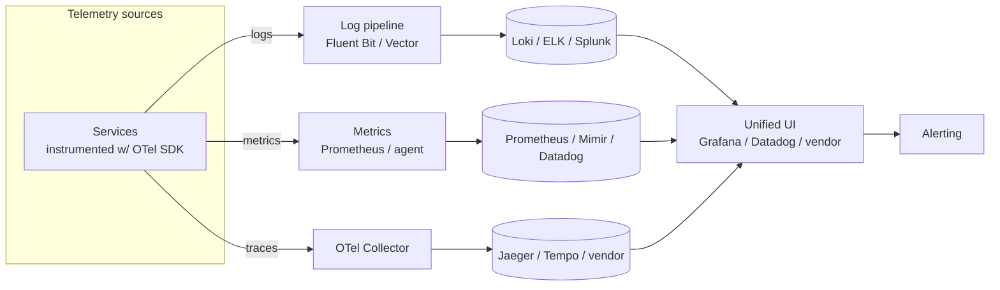
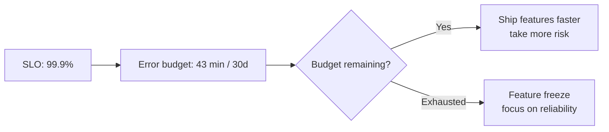
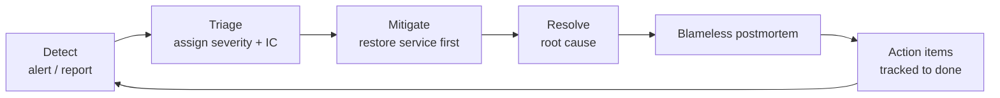
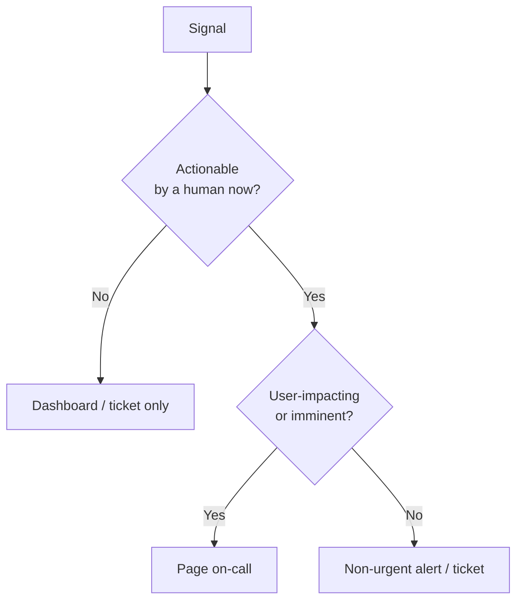
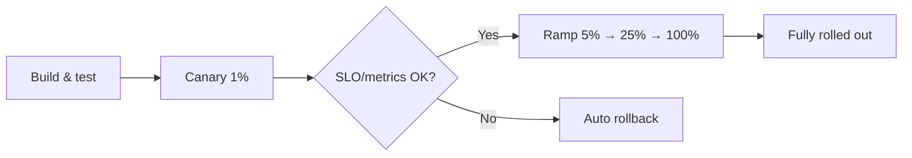
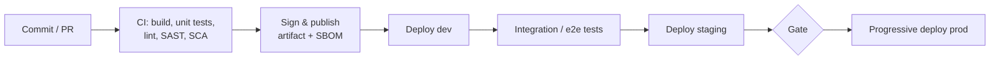

# 09 — Enterprise Observability & Operations

> Audience: senior engineers, SREs, and architects responsible for keeping large-scale, multi-team systems healthy, debuggable, and reliable.

## Introduction

**Monitoring** tells you whether the system is working. **Observability** lets you ask arbitrary questions about *why* it isn't — without shipping new code to answer them. At enterprise scale, with hundreds of services, polyglot stacks, and incidents that span team boundaries, observability is the difference between a 5-minute and a 5-hour mean-time-to-resolution.

This document covers the three pillars (logs, metrics, traces) at scale, APM, SRE practice (SLOs, error budgets, toil), incident management, alerting strategy, capacity management, progressive delivery, and CI/CD. The recurring theme: **operations at scale must be engineered, governed, and measured — not improvised.**

---

## Why It Matters at Enterprise Scale

- **Distributed by default.** A single user request fans out across dozens of services. Without distributed tracing you cannot answer "where did the latency go?"
- **Cost of telemetry is itself significant.** Log/metric volume from thousands of hosts can rival compute spend. Observability has its own FinOps problem.
- **Cross-team incidents.** An outage rarely respects org boundaries. You need shared standards (correlation IDs, OpenTelemetry semantic conventions) so anyone can follow a request across teams.
- **Regulatory & audit.** Many industries require retained, tamper-evident logs and demonstrable incident processes.
- **MTTR is a business metric.** Every minute of a tier-0 outage has a dollar figure. Observability and disciplined incident response directly move it.

---

## The Three Pillars at Scale



A request carries a **trace ID** and **span IDs**; logs are stamped with the same IDs and resource attributes. This correlation — pivoting from a spiking metric to the exemplar trace to the relevant logs — is the entire point. Without it you have three disconnected silos.

### Logs — centralized logging

High-cardinality, high-volume event records. Enterprise stacks:

- **ELK / OpenSearch** — Elasticsearch + Logstash + Kibana. Powerful full-text search; operationally heavy and storage-hungry at scale.
- **Splunk** — best-in-class search/SPL and compliance features; premium pricing.
- **Grafana Loki** — indexes only labels, not log content; far cheaper at scale, pairs naturally with Prometheus/Grafana.

Practices:
- **Structured (JSON) logs**, never free-text grep targets.
- **Sampling and tiering** — keep DEBUG out of prod by default; tier hot (searchable) vs cold (archived to object storage) to control cost.
- **PII discipline** — scrub/redact at the collector; logs are a common compliance leak.

```json
{
  "ts": "2026-06-23T10:14:22.481Z",
  "level": "ERROR",
  "service": "orders-api",
  "trace_id": "4bf92f3577b34da6a3ce929d0e0e4736",
  "span_id": "00f067aa0ba902b7",
  "msg": "payment authorization failed",
  "order_id": "ord_8821",
  "downstream": "payments-svc",
  "status": 503
}
```

### Metrics

Numeric time series, cheap to store and fast to query — the backbone of dashboards and alerts.

- **Prometheus** — pull-based, the CNCF standard; **Thanos/Mimir/Cortex** add long-term storage and horizontal scale (single Prometheus does not scale to a whole enterprise).
- **Datadog / managed** — turnkey, broad integrations, usage-based cost that must be governed.

Focus on the **RED** method for services (Rate, Errors, Duration) and **USE** for resources (Utilization, Saturation, Errors).

```yaml
# Prometheus alert rule
groups:
  - name: orders-slo
    rules:
      - alert: OrdersHighErrorRate
        expr: |
          sum(rate(http_requests_total{service="orders-api",code=~"5.."}[5m]))
            / sum(rate(http_requests_total{service="orders-api"}[5m])) > 0.02
        for: 10m
        labels: { severity: page }
        annotations:
          summary: "orders-api 5xx rate >2% for 10m"
          runbook: "https://runbooks.acme.io/orders/high-error-rate"
```

### Distributed tracing

A trace follows one request across all services. **OpenTelemetry (OTel)** is the vendor-neutral standard for instrumentation (SDKs + Collector); backends include **Jaeger**, **Grafana Tempo**, and commercial APMs.

```
[trace_id=4bf9...]
  span: api-gateway          [=========================] 240ms
    span: orders-api         [====================]      180ms
      span: payments-svc       [========]                70ms  ← bottleneck
      span: inventory-svc      [===]                     25ms
      span: postgres query     [==]                      18ms
```

- **Standardize on OTel** to avoid re-instrumenting when you change backends.
- **Tail-based sampling** at the Collector keeps the interesting traces (errors, slow) while dropping the boring majority — the key to making tracing affordable at scale.

### APM

Application Performance Monitoring (Datadog APM, Dynatrace, New Relic, Grafana Cloud) layers code-level visibility — slow DB queries, N+1s, GC pauses, dependency maps — on top of the pillars. Increasingly APMs consume OTel directly, so OTel-first instrumentation keeps you portable.

---

## SRE Practices

### SLI / SLO / Error Budgets

- **SLI** (Service Level Indicator) — a measured signal, e.g. "proportion of requests served in <300ms with a 2xx/3xx".
- **SLO** (Objective) — the target, e.g. "99.9% over a rolling 28 days".
- **Error budget** — `100% - SLO`. At 99.9%, you may "spend" ~43 minutes of failure per 30 days.

The error budget converts reliability into a **shared currency** between dev and ops:



This is the policy lever that ends the dev-vs-ops tug-of-war: if the budget is healthy, ship aggressively; if it's blown, reliability work takes priority. Pick SLOs for **user-facing journeys**, not internal CPU graphs — the SLO should reflect what the customer feels.

> **Anti-pattern:** "100% availability" SLOs. They are impossible, infinitely expensive, and remove the error budget's signaling value. Set SLOs slightly above what users actually need.

### Toil reduction

Toil = manual, repetitive, automatable, no-enduring-value work that scales with load. Google's guidance: cap toil at ~50% of an SRE's time and systematically automate it away. Track it; if a team's toil grows with traffic, the system isn't engineered to scale.

---

## Incident Management



### Severity levels (typical)

| Sev | Meaning | Response |
|---|---|---|
| SEV1 | Major outage / data loss; tier-0 down | All-hands, IC assigned, exec comms, 24/7 |
| SEV2 | Significant degradation; key feature down | On-call + IC, rapid response |
| SEV3 | Minor / partial; workaround exists | Business hours, normal queue |
| SEV4 | Cosmetic / low impact | Backlog |

### Roles & process

- **Incident Commander (IC)** — owns coordination and decisions, *not* the hands-on fix. Separates command from debugging.
- **On-call** — sustainable rotations (follow-the-sun for global orgs), clear escalation paths, paid/comped, and humane (alert volume is a staffing/health issue, not just a tech one).
- **Runbooks** — every page should link to a runbook with diagnosis steps and known mitigations. A page with no runbook is a gap.
- **Mitigate before you diagnose.** Restore service (roll back, fail over, shed load) first; root-cause later. Customers care about uptime, not your hypothesis.

### Blameless postmortems

Focus on **systems and contributing factors, not individuals**. The goal is learning and durable fixes, not punishment — punishment drives the truth underground and you stop learning. Output: a timeline, contributing causes, what went well/poorly, and **tracked action items with owners and due dates** (untracked actions are theater).

---

## Alerting Strategy & Alert Fatigue



Principles:

- **Alert on symptoms, not causes.** Page on "users see errors / latency" (SLO burn), not on "CPU at 80%". High CPU may be harmless; a slow user journey never is.
- **Every page must be actionable and urgent.** If a human can't or needn't act immediately, it's a dashboard or a ticket, not a page.
- **Use multi-window, multi-burn-rate SLO alerts** — page fast on a severe burn, ticket on a slow burn. This catches both sudden outages and slow leaks without noise.
- **Fight alert fatigue ruthlessly.** Fatigue causes real pages to be ignored — a safety problem. Track alert volume per on-call shift as a health metric; review and prune noisy alerts in the postmortem/retro cycle. Deduplicate and group at the routing layer (PagerDuty/Opsgenie).

> **Anti-pattern:** Hundreds of CPU/disk/memory threshold alerts inherited from legacy monitoring. They generate noise, train responders to ignore pages, and miss actual user impact. Delete them; alert on SLOs.

---

## Capacity Management

- **Forecast from demand**, not from last month's bill. Tie capacity to business drivers (orders/sec, active users) and known events (Black Friday, product launches, marketing campaigns).
- **Load test to find the knee** of the curve — the point where latency degrades nonlinearly. Headroom should sit comfortably below it.
- **Autoscaling handles the day-to-day** (HPA/Karpenter), but autoscaling is not capacity *planning* — you still need quota headroom, regional capacity reservations for big events, and database/stateful-tier planning (those scale slowly).
- **Watch the slow-to-scale tiers:** databases, stateful stores, third-party rate limits, and provider quotas are the usual ceilings during a surge.

---

## Change Management & Progressive Delivery

Most incidents are triggered by change. The goal is **small, frequent, reversible changes** with automated safety, not heavyweight change-approval boards that slow everyone down and don't actually reduce risk.



### Strategies

- **Blue-Green** — two identical environments; switch traffic from blue to green atomically. Instant rollback (switch back), but doubles infra during cutover.
- **Canary** — route a small % to the new version, watch SLOs/error rate, ramp gradually, auto-roll-back on regression. The default for high-traffic services. Tools: Argo Rollouts, Flagger, service mesh traffic splitting.
- **Feature flags** — decouple *deploy* from *release*. Ship dark, enable per-cohort, kill instantly without a redeploy. Tools: LaunchDarkly, Unleash, OpenFeature. Also enables A/B testing and ops kill-switches.

```yaml
# Argo Rollouts canary
apiVersion: argoproj.io/v1alpha1
kind: Rollout
metadata: { name: orders }
spec:
  strategy:
    canary:
      steps:
        - setWeight: 5
        - pause: { duration: 5m }
        - analysis:                      # auto-abort if SLO query fails
            templates: [{ templateName: success-rate }]
        - setWeight: 25
        - pause: { duration: 10m }
        - setWeight: 100
```

> **Anti-pattern:** Big-bang Friday-evening deploys to 100% with manual rollback. Combine progressive delivery + feature flags so a bad change touches 1% of traffic for 5 minutes and rolls back automatically.

---

## CI/CD Pipelines



Enterprise essentials:

- **Pipeline as code** (GitHub Actions, GitLab CI, Jenkins-as-code, Tekton, Argo Workflows) — versioned, reviewed, reproducible.
- **Shift-left security** — SAST, dependency/SCA scanning, secret scanning, IaC scanning (Checkov/tfsec), and container image scanning *in* the pipeline, failing the build on critical findings.
- **Supply-chain integrity** — sign artifacts (Sigstore/cosign), generate an **SBOM**, and verify provenance (SLSA). Increasingly a compliance and customer requirement.
- **Separate CI from CD; deploy via GitOps.** CI produces a signed artifact; CD (Argo/Flux) reconciles the desired state. No human pushes to prod directly.
- **DORA metrics** — track deployment frequency, lead time, change failure rate, MTTR. They are the empirically validated measure of delivery performance and a good north star for platform investment.

> **Anti-pattern:** Snowflake build agents with hand-installed tooling, and "the pipeline only works on Jenkins box #3." Make agents ephemeral and reproducible (containers), and keep all pipeline config in the repo.

---

## Key Takeaways

- **Observability ≠ monitoring.** Engineer for asking unknown questions: correlated logs, metrics, and traces stitched by trace IDs and OpenTelemetry conventions.
- **Standardize on OpenTelemetry** to stay backend-portable; control telemetry cost with structured logs, tiering, and tail-based trace sampling — telemetry has its own FinOps problem.
- **SLOs and error budgets** turn reliability into a shared, data-driven currency that governs how aggressively teams ship.
- **Incident management is a discipline:** clear severities, an Incident Commander separate from the fixers, runbooks behind every page, mitigate-before-diagnose, and blameless postmortems with tracked actions.
- **Alert on user-facing symptoms, page only when actionable and urgent**, and treat alert fatigue as a safety problem — prune relentlessly.
- **Capacity planning forecasts from business demand** and respects slow-to-scale tiers (databases, quotas); autoscaling is not a substitute for planning.
- **Progressive delivery (canary + feature flags) with automated rollback** makes change safe; small/frequent/reversible beats heavyweight approval boards.
- **CI/CD with shift-left security, signed artifacts/SBOMs, and GitOps deploys**; measure delivery with DORA metrics.
