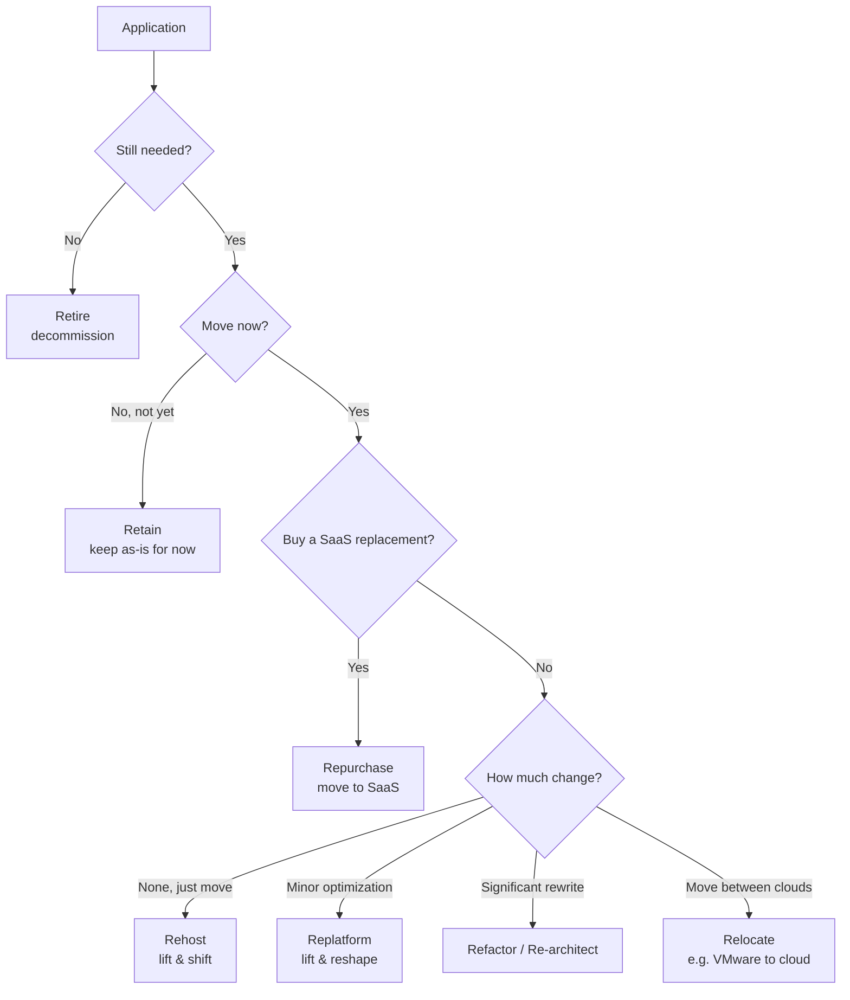
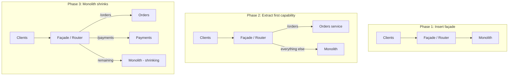
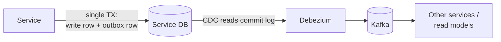
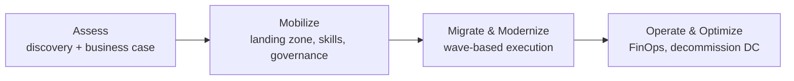
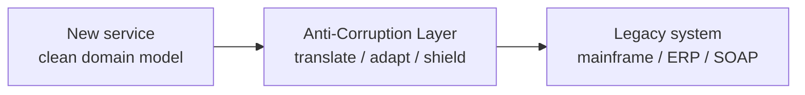
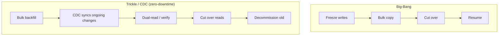
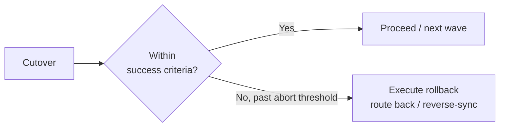

# 10 — Enterprise Migration & Modernization

> Audience: architects and engineering leaders responsible for moving large legacy estates to modern platforms without breaking the business.

## Introduction

Modernization is where architecture meets organizational reality. The technical patterns (strangler fig, anti-corruption layers, CDC) are well understood; the hard part is executing them on a live, revenue-generating, often-undocumented system that the business cannot afford to have go down — while teams keep shipping features.

The cardinal rule of enterprise modernization: **migrate to reduce risk and unlock value, not to chase technology.** Every migration is a bet that the cost and risk of moving are repaid by lower run-cost, faster delivery, or removed business constraints. If you can't articulate that payback, don't move it.

This document covers the 7 Rs decision framework, the strangler fig for monolith decomposition, database decomposition with outbox/CDC, on-prem-to-cloud phasing, legacy integration via anti-corruption layers, data migration strategies, risk/rollback, and how to measure success.

---

## Why It Matters at Enterprise Scale

- **The estate is huge and entangled.** Thousands of applications with undocumented dependencies; you cannot "just rewrite it."
- **Downtime has a direct cost.** A core-banking or ERP cutover gone wrong is a board-level event.
- **Data gravity.** Petabytes of data and the systems around it make "move the data" the hardest, riskiest step.
- **People and process** move slower than technology. A microservices architecture imposed on a siloed org produces a distributed monolith.
- **Sunk cost and risk aversion** mean the default is "retain forever." A disciplined framework is needed to make defensible move/keep decisions.

---

## The 7 Rs

A decision framework for each application in the portfolio. Run a portfolio assessment, then assign each app an R.



| R | What it means | When | Effort / Risk |
|---|---|---|---|
| **Rehost** | Lift & shift, no code change (VM → VM) | Speed, datacenter exit deadline | Low / Low |
| **Replatform** | Lift & reshape — minor changes (self-managed DB → RDS) | Capture managed-service wins cheaply | Low-Med / Low-Med |
| **Repurchase** | Replace with SaaS/COTS | Non-differentiating (CRM, HR, email) | Med / Med (data + process change) |
| **Refactor / Re-architect** | Significant rewrite (monolith → microservices, serverless) | High business value, agility/scale constrained | High / High |
| **Retire** | Decommission | No longer used (you'll find 10–20% are dead) | Low / Low — pure savings |
| **Retain** | Keep as-is (revisit later) | Recently invested, hard dependency, no payback yet | None / None |
| **Relocate** | Move infra wholesale, no change (VMware → VMware Cloud) | Hypervisor-level migration | Low / Low |

**Sequencing strategy:** start with Retire (free wins) and Rehost (build cloud muscle and momentum), defer the expensive Refactors to the apps with the clearest business payback. Refactoring everything is the classic over-reach — most of the estate doesn't deserve it.

> **Anti-pattern:** "Refactor everything to microservices." Most apps don't justify it; you burn years and money re-architecting commodity systems that should have been rehosted or repurchased.

---

## Monolith → Microservices: The Strangler Fig

Named after the strangler fig vine that grows around a tree until the tree is gone. You **incrementally replace** the monolith function by function, routing traffic to new services behind a façade, until the monolith withers. This avoids the catastrophic "big-bang rewrite" — the single most common cause of failed modernization programs.



### Step by step

1. **Insert a façade** (API gateway / reverse proxy) in front of the monolith. No behavior change yet — but now you control routing. This is the enabling move.
2. **Pick the first slice carefully.** Choose a capability that is high-value, relatively decoupled, and has a clear bounded context (use Domain-Driven Design to find seams). A good first extraction proves the pattern with low risk.
3. **Build the new service**, route its traffic at the façade, and run **dark/parallel** (shadow traffic, compare outputs) before cutting over.
4. **Cut over incrementally** (canary % at the façade), keeping a fast rollback (route back to the monolith).
5. **Repeat**, peeling off bounded contexts. The monolith shrinks until it can be retired — or stabilizes as a deliberately retained core.

### The data problem

Extracting the *code* is the easy half. The service usually still reaches into the shared monolith database — that shared DB is the real coupling. Decomposing the data is the hard part, covered next.

> **Anti-pattern (Distributed Monolith):** Splitting code into services that still share one database and must be deployed together. You get all the operational pain of distribution with none of the independence. Each service must own its data.

---

## Database Decomposition: Outbox + CDC

Goal: give each service its own data store, broken cleanly off the shared database, without losing consistency.

### The dual-write trap

The naive approach — a service writes to its DB *and* publishes an event in the same flow — is the **dual-write problem**: the two writes are not atomic, so a crash between them leaves the database and the event stream inconsistent. Never rely on dual writes.

### The Transactional Outbox + CDC pattern

Write the business change **and** an event row to an `outbox` table in **one local transaction** (atomic). A separate relay reads the outbox and publishes — guaranteeing the event is published if and only if the transaction committed.



```sql
-- One transaction: business change + outbox event, atomically
BEGIN;
  UPDATE orders SET status = 'CONFIRMED' WHERE id = 8821;
  INSERT INTO outbox (id, aggregate, type, payload)
  VALUES (gen_random_uuid(), 'order', 'OrderConfirmed',
          '{"orderId":8821,"status":"CONFIRMED"}');
COMMIT;
```

**CDC (Change Data Capture)** with **Debezium** tails the database transaction log and streams committed changes to **Kafka** — no application polling, low latency, and it captures the outbox rows reliably. CDC is also the backbone of zero-downtime data migration (below) because it continuously syncs old → new.

Consumers must be **idempotent** (handle at-least-once delivery / duplicate events) — design for it from the start.

---

## On-Prem → Cloud Migration Phases



1. **Assess** — Discover the estate (dependency mapping with tools like AWS Application Discovery Service, Azure Migrate, or commercial CMDB/discovery). Build the TCO business case and assign each app an R. *You cannot migrate what you cannot see — discovery is non-negotiable.*
2. **Mobilize** — Stand up the landing zone (see doc 08: accounts, networking, guardrails, IaC), establish connectivity (Direct Connect/ExpressRoute), build skills, and define the operating model. Run a few low-risk pilot migrations to de-risk the factory.
3. **Migrate & modernize** — Execute in **waves**, grouped by dependency (move tightly-coupled apps together to avoid chatty cross-DC traffic and egress cost). Tooling: AWS MGN/DMS, Azure Migrate, CloudEndure-style replication. Each wave: replicate → test → cut over → validate.
4. **Operate & optimize** — Run on the new platform, apply FinOps rightsizing, and **decommission the source** — the savings only land when you turn off and exit the datacenter. Leaving both running is a common, expensive failure.

> **Anti-pattern:** Migrating without dependency mapping. You move one app, discover it depended on three others still on-prem, and now suffer latency and egress costs across a hybrid link. Map dependencies first; migrate in coherent waves.

---

## Legacy Integration: The Anti-Corruption Layer

You rarely modernize in isolation — new services must talk to legacy systems (mainframe, ERP, ancient SOAP APIs) whose models are messy and would pollute clean new designs. An **Anti-Corruption Layer (ACL)** is a translation boundary that maps the legacy model into your clean domain model, isolating the new system from legacy concepts.



- Keeps the legacy data model and quirks from leaking into your new bounded context.
- Localizes change: when the legacy system is finally retired, you replace only the ACL.
- Often implemented as an adapter/facade service or integration layer (with patterns like CQRS read-models fed by CDC from the legacy DB for read-heavy access).

> **Anti-pattern:** Letting new services call the legacy schema/API directly. The legacy model spreads through your codebase, and you can never retire it — you've built a new monolith glued to the old one.

---

## Data Migration Strategies

Moving the data is usually the riskiest part of any migration. Two ends of a spectrum:



| | Big-Bang | Trickle / CDC |
|---|---|---|
| Downtime | Yes — maintenance window | Near-zero |
| Complexity | Lower | Higher (sync + reconciliation) |
| Rollback | Cleaner (old system untouched until cutover) | Possible but more involved |
| Best for | Small datasets, tolerant windows, simple systems | Large datasets, 24/7 systems, low risk tolerance |

### Zero-downtime cutover with CDC (the enterprise default for critical data)

1. **Bulk backfill** historical data to the target.
2. **Enable CDC** (Debezium / AWS DMS / GoldenGate) so ongoing changes replicate continuously, old → new.
3. **Verify** with reconciliation (row counts, checksums) and, ideally, **dual-read + compare** in production.
4. **Cut over reads**, then writes, at the application/façade layer — often progressively (canary).
5. **Keep CDC running briefly in reverse** (new → old) as a rollback safety net before decommissioning.

> **Anti-pattern:** A big-bang migration of a large dataset with no validation step and no rollback plan, run in a single overnight window. When (not if) reconciliation fails at 4 a.m., there's no path back. Always validate, always keep a rollback.

---

## Risk Management & Rollback

- **Reversibility is the master control.** Prefer migration patterns where you can route/fail back fast (strangler façade routing, CDC reverse-sync, blue-green). Design the rollback *before* the cutover.
- **Run old and new in parallel** during transition (parallel run / dual-write-for-verification, shadow traffic). Compare outputs to build confidence before trusting the new system.
- **Wave-based, incremental** execution limits blast radius — never bet the whole program on one cutover.
- **Backups and a tested restore** before any destructive step. Untested backups are not backups.
- **Communication & runbooks** — every cutover has a documented plan, a go/no-go checklist, defined success criteria, an abort threshold, and a named decision-maker.



---

## Measuring Success

A migration "done" technically can still be a business failure. Measure outcomes, not activity:

- **Business value** — run-cost reduction (TCO), faster lead time / deployment frequency (DORA), removed scaling/regulatory constraints, retired licenses.
- **Reliability** — SLO adherence and MTTR before vs after.
- **Cost** — actual run-cost vs the business-case projection; flag and explain variance. (Don't forget: migration *cost money* — track payback period.)
- **Decommissioning** — % of source systems actually turned off. **This is the real finish line** — savings are only realized when the old datacenter/license is gone, not when the new system goes live.
- **Adoption** — for repurchase/refactor, are teams/users actually using the new system, or running a shadow copy of the old one?

> **Anti-pattern:** Declaring victory at "the new system is live" while the legacy system keeps running "just in case." You now pay for both, realize none of the savings, and the program quietly fails its business case. Drive to decommission.

---

## Key Takeaways

- **Migrate for risk reduction and business value, not for technology.** If you can't state the payback, retain or retire.
- **Use the 7 Rs** to make portfolio-level decisions; sequence Retire/Rehost first for quick wins, reserve expensive Refactors for high-payback apps.
- **The strangler fig beats the big-bang rewrite.** Insert a façade, peel off bounded contexts incrementally, keep rollback cheap.
- **Each service owns its data.** Decompose the shared database with the **transactional outbox + CDC (Debezium/Kafka)** pattern; never rely on dual writes; make consumers idempotent.
- **On-prem → cloud is phased (Assess → Mobilize → Migrate → Optimize) and wave-based.** Dependency mapping first; decommission the source to realize savings.
- **Shield new systems from legacy with an Anti-Corruption Layer** so the legacy model never leaks and can eventually be retired.
- **For critical data, use CDC-based zero-downtime migration** with bulk backfill, continuous sync, reconciliation/dual-read verification, and a reverse-sync rollback path. Big-bang only for small/tolerant cases.
- **Reversibility, parallel runs, tested backups, and explicit go/no-go runbooks** are how you manage migration risk.
- **Success = business outcomes + decommissioned legacy**, not "the new system is live."
