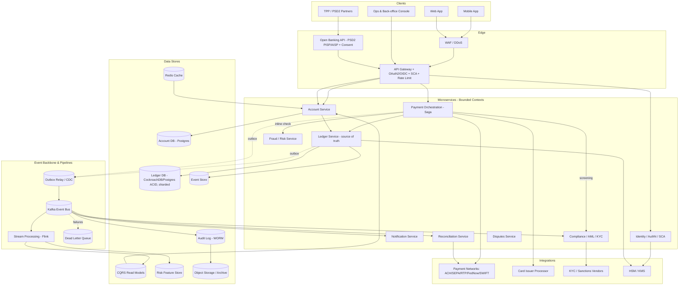
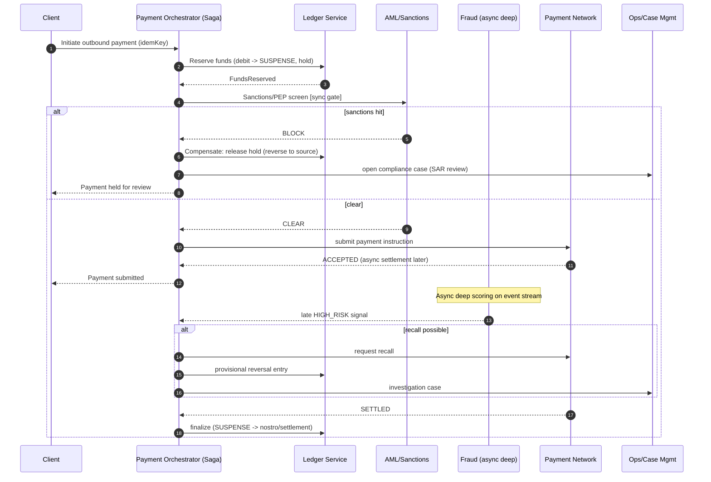

# Core Banking & Payments Platform — Enterprise Architecture Scenario

**Executive Summary.** This document describes the end-to-end enterprise architecture for a cloud-native **Core Banking and Payments Platform** serving retail and SME customers across a multi-region footprint. The platform owns customer accounts, an authoritative **double-entry ledger**, real-time and batch **payments/transfers**, **fraud and risk** scoring, and **regulatory compliance** (PCI-DSS, PSD2, SOX, AML/KYC). The central design tension is moving money correctly: every cent must be accounted for with **strong consistency**, **idempotency**, and an immutable **audit trail**, while non-monetary surfaces (notifications, analytics, fraud feedback) are allowed to be eventually consistent for scale. We adopt a **microservices**, **event-driven** architecture using the **saga pattern** for cross-service money movement, **CQRS** with **event sourcing** for the ledger, the **transactional outbox** pattern for reliable event publication, and **idempotency keys** end-to-end. The ledger of record runs on a horizontally-scalable ACID SQL engine (PostgreSQL evolving to CockroachDB for multi-region) precisely because money requires serializable correctness, not eventual convergence. This document is intended for presentation to an Architecture Review Board (ARB).

---

## Context & Business Requirements

The business is a digital-first bank (or BaaS provider) launching a regulated deposit-and-payments platform. It must onboard customers, hold customer funds, and move money in and out via multiple rails while satisfying regulators in every jurisdiction it operates.

**Business drivers**

- Launch a competitive, low-latency digital banking experience (mobile + web + partner APIs).
- Support **Open Banking / PSD2** so licensed third parties (TPPs) can initiate payments (PISP) and access account information (AISP) with **Strong Customer Authentication (SCA)**.
- Reduce fraud losses to under industry benchmark via real-time scoring.
- Pass **SOX** controls audits and bank examinations with a complete, tamper-evident audit trail.
- Scale to tens of millions of accounts without re-platforming.

**Users & actors**

| Actor | Description | Primary interactions |
|-------|-------------|----------------------|
| Retail customer | Individual account holder | View balance, transfer, pay bills, cards |
| SME customer | Business account holder | Bulk payments, payroll batch, statements |
| TPP (PISP/AISP) | Licensed third party under PSD2 | Initiate payment, fetch account info via APIs |
| Operations / Back office | Bank staff | Reconciliation, disputes, manual review |
| Compliance officer | AML/KYC, sanctions | Case review, SAR filing, audit |
| Fraud analyst | Risk team | Investigate flagged transactions |
| Regulator / Auditor | External | Examinations, evidence requests |
| Payment networks | SWIFT, SEPA, ACH, RTP/FedNow, card schemes | Settlement, clearing |

**Scope.** In scope: accounts, ledger, payments (internal, ACH/SEPA batch, RTP/FedNow real-time, card funding), fraud/risk, AML/KYC, compliance reporting, notifications, audit. Out of scope (consumed as external systems): card issuer processor, KYC data vendors, sanctions list providers, core network gateways, data lake/BI.

**Constraints.** Regulated environment; data residency per region; PCI-DSS scope minimization (no raw PAN in core services — tokenize at the edge); 7-year retention for financial records (SOX) and AML records.

---

## Functional Requirements

1. **Account management** — open/close accounts, multiple account types (checking, savings, virtual sub-accounts/wallets), multi-currency balances, holds/authorizations, statements.
2. **Double-entry ledger** — every monetary event produces balanced debit/credit postings; immutable journal; derive balances; support reversals via compensating entries (never edit history).
3. **Real-time payments** — intra-bank instant transfer, RTP/FedNow, push-to-card, P2P; target end-to-end completion in seconds.
4. **Batch payments** — ACH/SEPA file generation and ingestion, payroll/bulk disbursement, scheduled/recurring payments, direct debits.
5. **Idempotent operations** — all money-moving APIs accept an `Idempotency-Key`; duplicate requests return the original result, never a second posting.
6. **Fraud & risk scoring** — synchronous risk check inline for high-risk flows; asynchronous deep scoring; velocity rules, device fingerprinting, ML model scoring; hold/decline/step-up.
7. **AML/KYC & sanctions** — onboarding KYC, ongoing screening, sanctions/PEP list screening on payments, transaction monitoring, case management, SAR/CTR generation.
8. **Compliance & reporting** — PSD2 SCA + consent management, PCI-DSS cardholder handling, SOX-aligned controls, regulatory reporting extracts.
9. **Notifications** — push/SMS/email for transactions, SCA challenges, fraud alerts.
10. **Audit trail** — immutable, tamper-evident record of every state change, who/what/when, queryable for investigations and audits.
11. **Reconciliation** — automated reconciliation between internal ledger and external network/nostro statements; break detection and aging.
12. **Disputes/chargebacks** — case lifecycle, provisional credits via ledger entries.

---

## Non-Functional Requirements

| Category | Requirement | Target |
|----------|-------------|--------|
| Availability (core ledger/payments) | Money-movement APIs uptime | 99.99% (≈52 min/yr) |
| Availability (read/non-critical) | Balance reads, notifications | 99.9% |
| Latency — internal transfer | p99 API to "accepted" | < 300 ms |
| Latency — ledger posting commit | p99 commit | < 100 ms |
| Latency — inline fraud check | p99 | < 150 ms |
| Latency — balance read | p99 | < 50 ms |
| Throughput — peak payments | Sustained TPS | 5,000 TPS (burst 15,000) |
| Throughput — batch | ACH file processing | 10M entries / window |
| Consistency — ledger | Money movement | Strict serializable / ACID |
| Consistency — read models | Balances projection lag | < 1 s p99 (eventual) |
| Durability | Committed ledger entries | 11 nines (no loss) |
| RPO (ledger) | Max data loss | 0 (synchronous replication) |
| RTO (region failure) | Time to restore | < 15 min |
| Idempotency | Duplicate suppression window | 24 h minimum, key TTL 7 days |
| Security | Encryption | TLS 1.3 in transit, AES-256 at rest, HSM-backed keys |
| Compliance | Card data | PCI-DSS L1; PAN tokenized, never stored in core |
| Compliance | Strong auth | PSD2 SCA (2FA, dynamic linking) |
| Auditability | Trail completeness | 100% of monetary state changes, 7-yr retention |
| Scalability | Accounts | 50M accounts, linear horizontal scale |
| Recovery testing | DR drill cadence | Quarterly, evidenced for SOX |

---

## Capacity / Scale Estimates

Back-of-envelope sizing for a mid-to-large digital bank.

**Accounts & customers**
- Customers: 20M; Accounts (incl. sub-wallets): ~50M.
- Average balance row size (ledger account record): ~0.5 KB.
- Account/balance table: 50M × 0.5 KB ≈ **25 GB** (hot, fits in memory/SSD, sharded).

**Payment / transaction volume**
- Active accounts performing ~30 monetary transactions/month.
- Monetary events/month: 50M × 30 ≈ 1.5B/month ≈ **50M/day**.
- Even distribution: 50M / 86,400 s ≈ **~580 TPS average**.
- Peak factor ×8 (paydays, end-of-month, promotions): **~4,600 TPS**, design headroom **5,000 sustained / 15,000 burst**.

**Ledger entries/day (double-entry)**
- Each monetary event = at least 2 postings (debit + credit); complex payments (fees, FX, intermediary) average ~3 postings.
- Postings/day: 50M events × 3 ≈ **150M ledger postings/day**.
- Posting row ≈ 0.3 KB → 150M × 0.3 KB ≈ **45 GB/day** raw.

**Storage/year**
- Ledger postings: 45 GB/day × 365 ≈ **16 TB/year** (before compression/archival; ~5–6 TB compressed).
- Event store (event sourcing, all domain events incl. non-monetary, ~3× postings): ~**50 GB/day** → ~18 TB/year raw.
- Audit log: every state change + reads-of-sensitive-data; estimate ~200M records/day × 0.4 KB ≈ **80 GB/day** → ~29 TB/year (compressed + tiered to object storage / WORM).
- 7-year retention (SOX/AML): ledger + audit ≈ (16+29) TB/yr × 7 ≈ **~315 TB** before compression; tier cold data to immutable object storage (S3 Object Lock / WORM).

**Compute (rough)**
- At 5,000 TPS with p99 < 300 ms and ~50 ms service CPU per request, a single instance handling ~200 req/s ⇒ ~25 instances per critical service for throughput, ×N for HA and headroom (target 2–3× ⇒ ~60–75 pods across AZs).
- Kafka: 50M events/day × 1 KB ≈ 50 GB/day; with replication factor 3 and 7-day retention on hot topics ≈ ~1 TB hot. Partition payment topics ~64–128 partitions for parallelism.

**Read amplification**
- Balance/statement reads ~10× writes ⇒ ~5,800 reads/s average, served from CQRS read replicas + cache (Redis), p99 < 50 ms.

---

## High-Level Architecture



---

## Core Components / Services

Bounded contexts follow Domain-Driven Design. Each owns its data; no shared databases. Communication is synchronous (gRPC/REST) where a caller needs an immediate result, and asynchronous (Kafka events via outbox) otherwise.

| Service | Responsibility | Sync/Async | Owns data |
|---------|----------------|-----------|-----------|
| **Account Service** | Account lifecycle, account metadata, holds/authorizations, exposes balance (read model) | Sync reads; async projections | Account DB + read model |
| **Ledger Service** | Authoritative double-entry ledger; appends balanced journal entries; computes balances; reversals via compensation; **source of truth for money** | Sync (strongly consistent) | Ledger DB + Event store |
| **Payment Orchestration** | Coordinates multi-step payments as a **saga**; idempotency; calls fraud/AML; posts to ledger; submits to networks; compensation on failure | Sync orchestration + async | Saga/state store |
| **Fraud / Risk Service** | Inline risk score (< 150 ms), async deep scoring, velocity rules, device intel, ML model serving, hold/step-up/decline decisions | Sync inline + async stream | Feature store |
| **Compliance / AML / KYC** | Onboarding KYC, sanctions/PEP screening, transaction monitoring, case management, SAR/CTR | Sync screening gate + async monitoring | Case DB |
| **Identity / AuthN / SCA** | OAuth2/OIDC, MFA, PSD2 SCA with dynamic linking, consent | Sync | Identity store |
| **Notification Service** | Event-driven push/SMS/email, SCA challenge delivery, alerting | Async | — |
| **Reconciliation Service** | Match internal ledger vs. network/nostro statements; break detection/aging | Async/batch | Recon DB |
| **Disputes Service** | Chargeback/dispute lifecycle; provisional credits via ledger | Async + sync | Dispute DB |
| **Open Banking / PSD2 API** | PISP/AISP endpoints, consent management, TPP eIDAS cert validation | Sync | Consent store |

**Why Ledger is its own service and source of truth:** isolating it lets us apply the strictest consistency, smallest PCI/SOX-relevant blast radius, and tightest change control. All balances are *derived* from immutable journal entries; nothing outside Ledger Service may write postings.

---

## Data Architecture

**Store selection & rationale**

| Store | Technology | Why |
|-------|-----------|-----|
| Ledger of record | CockroachDB (or PostgreSQL + Citus) | ACID, serializable isolation, horizontal scale, multi-region with strong consistency. Money requires correctness over availability under partition. |
| Account DB | PostgreSQL | Relational integrity for account metadata/holds. |
| Event store | Kafka (log) + EventStoreDB / append-only Postgres table | Event sourcing — full history of domain events, replay, audit. |
| Read models (CQRS) | PostgreSQL read replicas + Elasticsearch (search) | Optimized query/projection shapes; offloads ledger. |
| Cache | Redis | Sub-50ms balance reads, idempotency-key store, rate limits. |
| Risk feature store | Redis + Feast/Cassandra | Low-latency online features for inline scoring. |
| Audit log | Append-only + object storage with **WORM** (S3 Object Lock) | Tamper-evident, immutable, 7-yr retention. |
| Archive | Object storage (tiered) | Cold ledger/audit, cost-efficient retention. |

**Double-entry ledger schema sketch**

```sql
-- Chart of accounts: every ledger account is internal (customer wallets,
-- nostro, suspense, fees, settlement) and has a normal balance side.
CREATE TABLE ledger_account (
    account_id      UUID PRIMARY KEY,
    external_ref    TEXT,                 -- maps to customer account / GL code
    currency        CHAR(3) NOT NULL,
    account_type    TEXT NOT NULL,        -- ASSET | LIABILITY | EQUITY | REVENUE | EXPENSE
    normal_side     CHAR(1) NOT NULL,     -- 'D' or 'C'
    status          TEXT NOT NULL DEFAULT 'ACTIVE',
    created_at      TIMESTAMPTZ NOT NULL DEFAULT now()
);

-- A journal entry = one balanced business event (sum debits == sum credits).
-- Immutable: never UPDATE/DELETE. Reversals create a new compensating entry.
CREATE TABLE journal_entry (
    entry_id        UUID PRIMARY KEY,
    idempotency_key TEXT UNIQUE NOT NULL,   -- enforces exactly-once posting
    correlation_id  UUID NOT NULL,          -- saga / payment id
    entry_type      TEXT NOT NULL,          -- TRANSFER | FEE | FX | REVERSAL ...
    reverses_entry  UUID REFERENCES journal_entry(entry_id),
    description     TEXT,
    posted_at       TIMESTAMPTZ NOT NULL DEFAULT now(),
    created_by      TEXT NOT NULL
);

-- Individual postings (the legs). Each row debits or credits one account.
CREATE TABLE journal_posting (
    posting_id      UUID PRIMARY KEY,
    entry_id        UUID NOT NULL REFERENCES journal_entry(entry_id),
    account_id      UUID NOT NULL REFERENCES ledger_account(account_id),
    direction       CHAR(1) NOT NULL CHECK (direction IN ('D','C')),
    amount_minor    BIGINT NOT NULL CHECK (amount_minor > 0), -- minor units, no floats
    currency        CHAR(3) NOT NULL,
    seq             INT NOT NULL
);

-- Balance is materialized from postings (running balance) for fast reads,
-- but is reconstructable by summing postings (event-sourced ground truth).
CREATE TABLE account_balance (
    account_id      UUID PRIMARY KEY REFERENCES ledger_account(account_id),
    available_minor BIGINT NOT NULL,
    posted_minor    BIGINT NOT NULL,
    currency        CHAR(3) NOT NULL,
    last_entry_id   UUID,
    version         BIGINT NOT NULL,        -- optimistic concurrency control
    updated_at      TIMESTAMPTZ NOT NULL DEFAULT now()
);

-- Invariant enforced in the posting transaction:
--   SUM(amount_minor) WHERE direction='D' == SUM(amount_minor) WHERE direction='C'
-- per entry_id, per currency. The whole entry commits atomically (ACID) or not at all.
```

**Money is stored as integer minor units (e.g., cents) — never floating point.** Balance updates use **optimistic concurrency** (`version`) to prevent lost updates under contention; hot accounts (e.g., settlement/suspense) may use serializable retries or a sharded "counter" pattern.

**Partitioning / sharding**

- **Ledger:** shard by `account_id` hash so a customer's postings co-locate; cross-shard transfers run within a distributed transaction (CockroachDB handles 2PC internally) or as a saga between two single-shard postings via a suspense account.
- **Event store / Kafka:** partition payment topics by `account_id` (or `correlation_id`) to preserve per-account ordering and enable parallel consumers.
- **Time-based archival:** journal/audit partitioned by month; cold partitions tiered to object storage.

**Event store & CQRS.** The Ledger and Payment services use **event sourcing**: domain events (`TransferInitiated`, `FundsReserved`, `EntryPosted`, `PaymentSettled`, `PaymentFailed`) are the source of truth. The **write side** appends events transactionally; the **transactional outbox** + CDC (Debezium) reliably publishes them to Kafka. **Read models** (balances, statements, search) are projections built by stream processors (Flink). This decouples write throughput from read fan-out and gives free replay/audit.

---

## Key Workflows

### Workflow 1 — Idempotent money transfer with saga + outbox

```mermaid
sequenceDiagram
    autonumber
    participant C as Client
    participant GW as API Gateway
    participant PAY as Payment Orchestrator (Saga)
    participant IDEM as Idempotency Store (Redis)
    participant FR as Fraud Service
    participant LED as Ledger Service
    participant DB as Ledger DB (ACID)
    participant OBX as Outbox/CDC
    participant BUS as Kafka
    participant NOTIF as Notification

    C->>GW: POST /transfers (Idempotency-Key: K, amount, from, to)
    GW->>PAY: forward (authenticated, SCA satisfied)
    PAY->>IDEM: check key K
    alt key seen (duplicate)
        IDEM-->>PAY: stored response
        PAY-->>C: 200 original result (no double posting)
    else new key
        PAY->>IDEM: reserve K (PENDING)
        PAY->>FR: score(transfer)  [sync, <150ms]
        alt high risk
            FR-->>PAY: DECLINE / STEP_UP
            PAY-->>C: 402 / SCA challenge
        else approved
            FR-->>PAY: APPROVE
            PAY->>LED: postEntry(entry, idemKey=K)
            LED->>DB: BEGIN; insert balanced entry + postings; update balances (version check); INSERT outbox row; COMMIT
            DB-->>LED: committed (ACID, all-or-nothing)
            LED-->>PAY: EntryPosted
            PAY->>IDEM: store response for K (DONE)
            PAY-->>C: 201 Transfer accepted
            OBX-->>BUS: publish EntryPosted (exactly-once via outbox)
            BUS-->>NOTIF: notify sender & receiver
        end
    end
```

The **debit and credit commit in one ACID transaction together with the outbox row**, so the event is published if and only if the money moved — no dual-write inconsistency.

### Workflow 2 — Cross-rail payment that triggers asynchronous fraud review (saga with compensation)



Funds are first moved to a **suspense account** (reservation), not deleted; every step has a **compensating transaction** so the saga can unwind cleanly without breaking the double-entry invariant.

---

## Cross-Cutting Concerns

**Security & compliance**
- **PCI-DSS L1:** PANs are tokenized at the edge by a PCI-scoped tokenization vault; core banking services and the ledger handle only tokens — minimizing PCI scope. Network segmentation, quarterly ASV scans, key management via **HSM/KMS**.
- **PSD2:** Open Banking APIs enforce **SCA** (two-factor, with **dynamic linking** of amount+payee into the auth), TPP identity via eIDAS certificates, and explicit **consent** lifecycle. Strong customer authentication exemptions (low-value/TRA) evaluated by the risk engine.
- **SOX:** segregation of duties, change management with approvals, immutable audit trail, evidenced quarterly DR tests, automated controls reporting. No human may edit ledger history.
- **AML/KYC:** onboarding identity verification, ongoing sanctions/PEP screening, transaction monitoring rules + ML, case management, SAR/CTR generation, 7-year record retention.
- **Encryption:** TLS 1.3 in transit, AES-256 at rest, field-level encryption for PII, envelope encryption with KMS-managed DEKs/KEKs.
- **Zero-trust / least privilege:** mTLS between services, short-lived workload identities, secrets in a vault, RBAC/ABAC.

**HA / DR**
- Multi-AZ active-active for stateless services; ledger uses synchronous replication across AZs (**RPO = 0**), asynchronous cross-region for DR.
- **RTO < 15 min** via automated failover; CockroachDB survives AZ loss without data loss; Kafka replication factor 3 (min ISR 2).
- Regional active-active is the target; until then, active-passive with continuous replication and quarterly failover drills (SOX-evidenced).

**Observability**
- Distributed tracing (OpenTelemetry) with `correlation_id` propagated across saga steps; metrics (Prometheus/Grafana), structured logs (ELK/Loki).
- Business-level SLOs and alerting: posting latency, saga failure rate, DLQ depth, reconciliation breaks, fraud decline rate.
- Every monetary state change emits an audit event to the WORM store.

**Scaling**
- Stateless services scale horizontally behind the gateway (HPA on CPU/RPS).
- Ledger scales by sharding on `account_id`; read load offloaded to CQRS replicas + Redis.
- Kafka partitions scale consumer parallelism; backpressure + DLQ for poison messages.

**Idempotency strategy**
- Clients send an `Idempotency-Key` per money-moving request. The orchestrator records key→result; duplicates return the stored result.
- Defense in depth: the `journal_entry.idempotency_key` **unique constraint** in the ACID ledger guarantees a second posting can never commit even if the app layer is bypassed or retried concurrently.

**Exactly-once semantics**
- True exactly-once delivery across systems is impossible; we achieve **effectively-once processing** via: (1) idempotency keys, (2) the **transactional outbox** (event published atomically with the state change), and (3) **idempotent consumers** (dedupe by event id / use upserts in projections). The ledger's unique constraint is the final backstop.

---

## Key Trade-offs & Decisions

| Decision | Chosen approach | Alternative considered | Rationale |
|----------|-----------------|------------------------|-----------|
| Ledger consistency | Strong / serializable ACID | Eventual consistency | Money must never be lost, double-spent, or out of balance; correctness > availability under partition (CP side of CAP for ledger). |
| Ledger datastore | CockroachDB / PostgreSQL (SQL) | NoSQL (Cassandra/Dynamo) | Need multi-row ACID transactions and balance invariants; NoSQL's eventual consistency and lack of cross-row transactions are unsafe for postings. NoSQL used only for read/feature stores. |
| Cross-service money movement | Saga + compensation, funds via suspense | Distributed 2PC across services | 2PC across microservices is fragile and blocking; sagas give resilience and clear compensation while preserving double-entry. |
| Write/read model | CQRS (separate read models) | Single model for read+write | Read fan-out (10×) would contend with critical postings; CQRS isolates and lets each side scale/optimize independently. |
| Ledger persistence | Event sourcing (immutable journal) | Mutable balance rows only | Immutability gives audit, replay, and SOX tamper-evidence; balances are a cheap projection. |
| Event publication | Transactional outbox + CDC | Direct dual-write to Kafka | Avoids dual-write inconsistency (publish iff committed); guarantees no lost/ghost events. |
| Fraud check placement | Inline gate (fast) + async deep | Fully async only | High-risk flows need a synchronous decision; deep ML scoring runs async to keep p99 low. |
| Real-time vs batch | Both rails, shared ledger | Real-time only | ACH/SEPA economics and reach require batch; RTP/FedNow for instant; ledger unifies them. |
| Card data handling | Tokenize at edge, no PAN in core | Store PAN encrypted in core | Drastically reduces PCI-DSS scope and audit cost; core never touches cardholder data. |
| Idempotency enforcement | App key + DB unique constraint | App-layer only | App caches can be bypassed/race; the DB constraint is the unbreakable backstop. |
| Sync vs async comms | Sync for decisions, async for fan-out | All synchronous | Async (events) decouples non-critical consumers, improves resilience and scale; sync only where a caller must wait. |

---

## Tech Stack

| Layer | Technology |
|-------|-----------|
| Clients | iOS/Android (native), React web, partner REST/Open Banking APIs |
| Edge / API | Cloud WAF + DDoS, API Gateway (Kong/Apigee/AWS API GW), OAuth2/OIDC (Keycloak/Auth0), mTLS |
| Service runtime | Java (Spring Boot) / Kotlin / Go microservices on Kubernetes (EKS/GKE) |
| Inter-service comms | gRPC + REST; async via Kafka |
| Event backbone | Apache Kafka (RF=3); Debezium CDC for outbox; Schema Registry (Avro/Protobuf) |
| Stream processing | Apache Flink (projections, monitoring, feature pipelines) |
| Ledger / OLTP | CockroachDB (multi-region ACID) or PostgreSQL + Citus |
| Account & domain DBs | PostgreSQL |
| Event store | Kafka log + EventStoreDB / append-only Postgres |
| Read models / search | PostgreSQL read replicas, Elasticsearch/OpenSearch |
| Cache / idempotency | Redis (cluster) |
| Risk / ML | Online feature store (Feast/Redis/Cassandra), model serving (Seldon/KServe), Python ML |
| Compliance | Sanctions/PEP screening vendor, KYC vendor APIs, case management, rules engine (Drools) |
| Secrets & keys | HashiCorp Vault, cloud KMS, HSM (PCI), tokenization vault |
| Audit / archive | Append-only store + S3 Object Lock (WORM), tiered object storage |
| Observability | OpenTelemetry, Prometheus, Grafana, ELK/Loki, Jaeger/Tempo |
| CI/CD & IaC | GitOps (Argo CD), Terraform, policy-as-code (OPA), SAST/DAST, change approvals |
| Payment networks | ACH/SEPA gateways, RTP/FedNow, SWIFT, card scheme connectors |

---

*Prepared for Architecture Review Board. The non-negotiable invariant of this platform: **the double-entry ledger is strongly consistent, immutable, and idempotent — every cent is debited from one account and credited to another within a single ACID transaction, with a complete, tamper-evident audit trail.***
