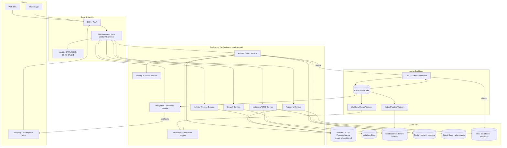
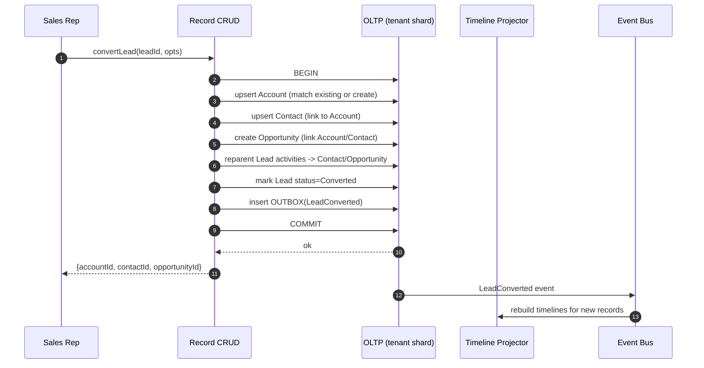

# Enterprise CRM Platform — End-to-End Architecture Scenario

> A principal-architect-level reference design for a multi-tenant, metadata-driven SaaS CRM (a "Salesforce-like" platform) covering Accounts, Contacts, Leads, Opportunities, customizable objects/fields/workflows, reporting/analytics, integrations, activity timeline, and full-text search.

---

## Context & Business Requirements

We are building **NovaCRM**, a horizontally-scaled, multi-tenant SaaS CRM sold to organizations ranging from 5-seat startups to 50,000-seat global enterprises. Customers ("tenants" / "orgs") manage their **sales pipeline** (Leads → Opportunities → Closed-Won), their **customer 360** (Accounts, Contacts, Activities), and increasingly model **their own business processes** through custom objects, fields, validation rules, and automation.

The differentiating bet is that NovaCRM is **metadata-driven**: every tenant can extend the schema, build page layouts, define workflow automation, and create reports *without provisioning new infrastructure or deploying code*. This implies a **Universal Data Dictionary (UDD)** runtime where application logic is interpreted from metadata rather than compiled per tenant.

Business drivers:

| Driver | Implication |
|---|---|
| Land-and-expand SaaS GTM | Self-service onboarding; seamless tenant provisioning in seconds, not days |
| Enterprise procurement | SOC 2 Type II, ISO 27001, GDPR/CCPA, data residency (EU/US/APAC), SSO/SCIM |
| Platform extensibility = stickiness | Customizable objects/fields/workflows are first-class, not bolt-on |
| Ecosystem / AppExchange-style integrations | Public REST/GraphQL APIs, webhooks, event bus, OAuth app marketplace |
| Analytics as upsell | Reports, dashboards, and a CDC pipeline to a warehouse for BI |

Out of scope for this document: billing/metering subsystem internals, the mobile client architecture, and the marketing-automation product line (treated as an adjacent integrated product).

---

## Functional Requirements

1. **Core CRM objects**: CRUD + sharing for Accounts, Contacts, Leads, Opportunities, Cases, Activities (Tasks/Events/Calls/Emails).
2. **Lead-to-Opportunity conversion**: convert a Lead into Account + Contact + Opportunity atomically, preserving the activity history.
3. **Custom objects & fields**: tenants define new objects, fields (text, number, picklist, lookup, formula, rollup), relationships, and page layouts at runtime.
4. **Workflow & automation engine**: declarative rules — field updates, record creation, outbound webhooks, email alerts, approval processes — triggered on record save (before/after) and on time-based schedules.
5. **Validation rules & formula fields**: server-side expression evaluation on save.
6. **Activity timeline**: a unified, reverse-chronological feed of all interactions on any record.
7. **Reporting & analytics**: ad-hoc report builder, dashboards, scheduled report delivery; near-real-time operational reports + heavy historical analytics offloaded to a warehouse.
8. **Full-text search**: global search across all objects (standard + custom) with tenant-scoped relevance, type-ahead, and filters.
9. **Integrations**: public REST + GraphQL APIs, Bulk/Batch API, webhooks (outbound), inbound event ingestion, an internal/external **event bus** (CDC + platform events).
10. **Identity & access**: SAML/OIDC SSO, SCIM provisioning, OAuth 2.0 for apps, role hierarchy + sharing rules + field-level security.

### Non-Functional Requirements

| Category | Target |
|---|---|
| **Availability** | 99.95% for core API/UI (≈4.4 h/yr); 99.9% for async (workflow, search index, analytics) |
| **Latency** | Record read p99 < 150 ms; record save (sync rules) p99 < 400 ms; global search p95 < 250 ms; report (operational) p95 < 3 s |
| **Throughput** | Sustained 60k API req/s platform-wide; 8k record-writes/s peak; 12k search QPS peak |
| **Durability** | RPO ≤ 5 min, RTO ≤ 30 min (regional failover); 11 nines storage durability for object data |
| **Scalability** | Linear horizontal scale to 100k tenants / 5M MAU without per-tenant infra |
| **Tenant isolation** | Strict logical isolation; noisy-neighbor protection via per-tenant quotas + governor limits |
| **Compliance** | SOC 2 Type II, ISO 27001, GDPR/CCPA, HIPAA-eligible tier, data residency by region |
| **Security** | Encryption in transit (TLS 1.3) and at rest (AES-256, per-tenant key option via KMS), RBAC + ABAC, audit logging, field-level encryption (Shield-style) |
| **Consistency** | Strong consistency within a tenant for transactional writes; eventual consistency for search/analytics/timeline projections (target convergence < 2 s) |

---

## Capacity / Scale Estimates

Assumptions for a mature deployment in a single mega-region (numbers per region; platform = 3 regions):

| Dimension | Estimate | Notes |
|---|---|---|
| Tenants (orgs) | 100,000 | Power-law distribution; top 1% hold ~60% of data |
| Total users | 8,000,000 | Monthly active ~5M |
| Concurrent active users (peak) | ~600,000 | ~12% of MAU at business-hour peak |
| Records per org (median) | ~250,000 | p99 org: ~500M records |
| Total records | ~120 billion | Across standard + custom objects |
| API calls/day | ~5 billion | ~58k req/s avg, ~60k+ peak |
| Record writes/s (peak) | ~8,000 | Each may fan out to N async workflow jobs |
| Search QPS (peak) | ~12,000 | Type-ahead inflates read volume |
| Workflow jobs/day | ~2 billion | Avg ~2–3 automation actions per write |
| CDC events/day | ~10 billion | Every committed mutation emits a change event |
| Reporting queries/day | ~80 million | Operational live; heavy/historical → warehouse |
| Avg record size | ~3 KB | Wide custom-field orgs skew higher |
| Hot data (OLTP) | ~150 TB/region | Last 18–24 months actively queried |
| Warehouse (analytics) | ~4 PB | Full history + derived marts |
| Search index size | ~40 TB/region | Tenant-sharded Elasticsearch |

**Governor limits** (per-tenant, per-transaction) protect shared infra, e.g.: max 50k rows per query, 100 SOQL-equivalent queries per request, 2k async jobs queued per org, API call quota = `f(seat_count)` (e.g., 1,000 calls/day/seat) with burst tokens.

---

## High-Level Architecture



The architecture is **stateless app tier + sharded stateful data tier + async event backbone**. Every committed write goes through a **transactional outbox**, is published to the **event bus**, and fans out to workflow execution, search indexing, timeline projection, integration/webhooks, and CDC-to-warehouse — decoupling the synchronous save path from expensive downstream work.

---

## Core Components / Services (Bounded Contexts)

| Service | Responsibility | Sync/Async |
|---|---|---|
| **Metadata / UDD Service** | Source of truth for tenant schema: objects, fields, layouts, picklists, validation/workflow definitions. Compiles metadata into cached "describe" structures and query plans. | Sync (read-heavy, cached) |
| **Record CRUD Service** | Generic, metadata-interpreted persistence for *all* objects (standard + custom). Maps logical fields → physical storage, enforces validation/formula on save, writes outbox. | Sync |
| **Sharing & Access Service** | Computes record visibility: org-wide defaults, role hierarchy, sharing rules, teams, field-level security. Maintains denormalized share tables. | Sync (cached) |
| **Workflow / Automation Engine** | Evaluates rules on change events; executes field updates, record creates, approvals, email alerts, outbound actions; handles time-based/scheduled triggers. | Async |
| **Search Service** | Query parsing, tenant-scoped relevance, type-ahead, facets; reads tenant-sharded Elasticsearch. | Sync (read) |
| **Index Pipeline** | Consumes change events, transforms records → search docs, applies ACL filters, upserts to ES. | Async |
| **Reporting Service** | Report/dashboard definitions; routes operational queries to OLTP read replicas and heavy/historical queries to the warehouse. | Sync + scheduled |
| **Activity Timeline Service** | Materialized, paginated, reverse-chron feed per record; merges tasks, events, emails, field-history, system events. | Async projection + sync read |
| **Integration / Webhook Service** | Outbound webhook delivery (with retries/DLQ/HMAC signing), inbound event ingestion, API app registry, platform events. | Async |
| **Identity Service** | SAML/OIDC SSO, SCIM user provisioning, OAuth2 authorization server, session/token issuance. | Sync |
| **API Gateway** | AuthN, routing, per-tenant rate limiting + **governor limits**, request tracing. | Sync |

---

## Data Architecture

### Store selection & rationale

| Store | Technology | Why |
|---|---|---|
| **OLTP / object data** | Postgres (Aurora) or CockroachDB, **sharded by `tenant_id`** | Strong per-tenant transactions; partitioning gives isolation + noisy-neighbor control; mature ecosystem. |
| **Metadata store** | Postgres (separate cluster) + Redis cache | Low write volume, extremely high read volume; aggressively cached as compiled "describe" objects. |
| **Search** | Elasticsearch / OpenSearch, **tenant-routed shards** | Inverted index, relevance scoring, type-ahead, facets; large tenants get dedicated indices. |
| **Cache / sessions** | Redis (cluster) | Hot records, share-rule results, metadata describes, sessions, rate-limit counters. |
| **Attachments / files** | S3 (object store) + CloudFront | Cheap, durable blob storage; pre-signed URLs; offloads BLOBs from OLTP. |
| **Event bus** | Apache Kafka (MSK) | Durable, ordered-per-key, high-throughput backbone for CDC + workflow + webhooks. |
| **Analytics warehouse** | Snowflake (or BigQuery) | Columnar, elastic compute, decoupled storage; serves heavy/historical reporting & BI. |
| **Time-based jobs** | Quartz-style scheduler + Kafka | Schedules workflow/time-triggered actions and report delivery. |

### Multi-tenancy & physical model

NovaCRM uses a **shared-schema, metadata-driven physical model** (the classic large-scale SaaS pattern). Custom fields are **not** DDL columns; instead, every object's data lives in a small set of **wide pivot/value tables** keyed by `(tenant_id, object_id, record_id)` with typed value columns, plus indexed "custom index" tables for queryable custom fields. `tenant_id` is the **leading partition key everywhere**, enabling row-level isolation and pruning.

```text
-- Metadata (UDD)
TENANT(tenant_id PK, name, region, edition, data_residency, kms_key_id)
OBJECT_DEF(tenant_id, object_id PK, api_name, label, is_custom)
FIELD_DEF(tenant_id, object_id, field_id PK, api_name, data_type,
          is_indexed, formula_expr, picklist_id, lookup_to_object_id)
LAYOUT_DEF(tenant_id, object_id, layout_json)
RULE_DEF(tenant_id, object_id, rule_id, type[validation|workflow|flow],
         trigger[before|after|time], criteria_expr, actions_json)

-- Data (shared, tenant-partitioned)
RECORD(tenant_id, object_id, record_id PK, owner_id, created, modified, row_version)
FIELD_VALUE(tenant_id, object_id, record_id, field_id,
            value_string, value_num, value_date, value_ref)   -- EAV-style values
CUSTOM_INDEX(tenant_id, object_id, field_id, value, record_id) -- for indexed custom fields

-- Sharing (denormalized for fast visibility checks)
RECORD_SHARE(tenant_id, record_id, principal_id, access_level)  -- user/role/group

-- Reliability
OUTBOX(tenant_id, event_id PK, aggregate_id, type, payload, published_at)

-- Activity
ACTIVITY(tenant_id, activity_id PK, related_record_id, type, actor_id, ts, payload)
FIELD_HISTORY(tenant_id, record_id, field_id, old_val, new_val, actor_id, ts)
```

> **Hybrid option for top-tier tenants:** the largest orgs (or HIPAA/residency-sensitive tenants) can be placed on an **isolated shard or dedicated database** ("pod/cell" model), trading density for blast-radius reduction and stronger isolation.

### Analytics pipeline

OLTP `OUTBOX` → **CDC dispatcher** → Kafka → stream loader → **Snowflake** raw layer → dbt transforms → star-schema marts (e.g., `fact_opportunity`, `dim_account`). Reporting Service routes: *operational* reports (small, recent, tenant-scoped) → OLTP **read replicas**; *historical/aggregate* reports → warehouse. This keeps heavy analytics off the transactional path.

---

## Key Workflows

### 1) Custom-object record save through workflow rules (the metadata-driven write path)

```mermaid
sequenceDiagram
    autonumber
    participant C as Client
    participant GW as API Gateway (governor)
    participant UDD as Metadata/UDD
    participant REC as Record CRUD
    participant DB as OLTP (tenant shard)
    participant BUS as Event Bus (Kafka)
    participant WF as Workflow Workers
    participant IDX as Index Pipeline
    participant ES as Elasticsearch

    C->>GW: POST /records/Custom__c {fields}
    GW->>GW: AuthN + rate/governor check (tenant quota)
    GW->>REC: create(tenant, object, payload)
    REC->>UDD: describe(object) [cached]
    UDD-->>REC: field defs, validation, before-save rules
    REC->>REC: validate + evaluate formulas + before-save automation
    REC->>DB: BEGIN; insert RECORD + FIELD_VALUE; insert OUTBOX; COMMIT
    DB-->>REC: ok (row_version)
    REC-->>GW: 201 Created (synchronous part done)
    GW-->>C: 201 {record_id}

    Note over DB,BUS: Async fan-out via transactional outbox
    DB->>BUS: CDC publish (RecordCreated)
    BUS->>WF: after-save workflow rules
    WF->>REC: field updates / create child / approval / email
    BUS->>IDX: index event
    IDX->>ES: upsert search doc (ACL-filtered)
```

The synchronous path is intentionally minimal (validate → persist → outbox → return). All "expensive" automation (after-save rules, search indexing, timeline projection, webhooks, warehouse CDC) happens **asynchronously** off the event bus, keeping save p99 within budget while preserving exactly-once-ish semantics via the outbox + idempotent consumers.

### 2) Lead-to-Opportunity conversion (transactional, multi-object)



Conversion is a **single ACID transaction within the tenant shard** (all objects co-located by `tenant_id`), guaranteeing no orphaned records. Downstream timeline rebuild and workflow triggers are async.

---

## Cross-Cutting Concerns

**Security & compliance**
- Identity: SAML/OIDC SSO, **SCIM** for user lifecycle, OAuth 2.0 authZ server for apps; short-lived JWTs + refresh.
- AuthZ: layered **RBAC (roles/profiles) + ABAC (sharing rules, field-level security)**; visibility resolved by Sharing Service against denormalized `RECORD_SHARE`.
- Encryption: TLS 1.3 in transit; AES-256 at rest; **per-tenant KMS keys** (BYOK) and optional **field-level encryption** for PII.
- Compliance: SOC 2 Type II, ISO 27001, GDPR/CCPA (data-subject export/erasure jobs run via the async engine), HIPAA-eligible pod; **data residency** enforced by region pinning at tenant provisioning.
- Auditing: immutable audit log (login, config change, data export) shipped to SIEM; `FIELD_HISTORY` for record-level change tracking.

**HA / DR**
- Active-active app tier across AZs; OLTP with synchronous standby (AZ) + async cross-region replica.
- RPO ≤ 5 min via continuous replication + CDC; RTO ≤ 30 min via region failover runbook + DNS/global-routing cutover.
- Kafka multi-AZ with replication factor 3; ES cross-zone replicas; periodic logical backups + PITR.

**Observability**
- Tracing: OpenTelemetry end-to-end (gateway → service → DB → consumer), trace-id propagated through Kafka headers.
- Metrics: Prometheus + Grafana; per-tenant SLO dashboards; **governor-limit consumption** metrics surfaced to tenants.
- Logging: structured logs (tenant_id tagged) → ELK/Loki; alerting via PagerDuty on SLO burn.

**Scaling & noisy-neighbor control**
- Stateless app tier autoscales on CPU/queue-depth.
- **Governor limits + per-tenant rate limiting** at the gateway (token buckets keyed by tenant) prevent one org from starving others.
- **Cell/pod sharding**: tenants mapped to shards via a routing table; hot tenants rebalanced or promoted to dedicated cells.
- Async backpressure: workflow/index queues partitioned by tenant; per-tenant concurrency caps stop a single org's automation storm from monopolizing workers.

---

## Key Trade-offs & Decisions

| Decision | Chosen | Alternative | Rationale |
|---|---|---|---|
| Physical schema for custom fields | Shared-schema EAV / pivot tables (UDD) | DDL column-per-field, or DB-per-tenant | UDD scales to 100k tenants without DDL churn or per-tenant migrations; accept query-planner complexity + need for custom indexes. |
| Tenant isolation | Logical (tenant_id partition) + optional dedicated pods | Full DB-per-tenant | Density/cost efficiency for the long tail; dedicated pods reserved for whales/regulated tenants. |
| Write path | Thin sync save + async fan-out via outbox/event bus | Synchronous inline automation | Keeps p99 low and bounds blast radius; cost = eventual consistency for search/timeline/analytics. |
| Search store | Dedicated Elasticsearch | Postgres full-text (`tsvector`) | FTS at 12k QPS with relevance/facets/type-ahead needs a purpose-built engine; cost = index lag + dual-write complexity. |
| Analytics | CDC → Snowflake warehouse | Reporting directly on OLTP | Protects OLTP from heavy scans; enables PB-scale history; cost = pipeline + slight staleness. |
| Consistency | Strong within tenant txn; eventual for projections | Global strong consistency | Matches user expectations (my edit is durable) while allowing scalable async derivation. |
| Eventing | Kafka + transactional outbox | Dual-write / 2PC | Reliable, ordered, replayable; avoids distributed-transaction fragility. |

---

## Tech Stack

| Layer | Technology |
|---|---|
| **Edge** | CloudFront/Fastly CDN, AWS WAF, NGINX/Envoy |
| **API Gateway** | Kong / Envoy + custom governor-limit service (Redis token buckets) |
| **App services** | Java (Spring Boot) / Kotlin and Go microservices; gRPC internal, REST + GraphQL external |
| **Identity** | Keycloak / Auth0 (SAML, OIDC, OAuth2, SCIM) |
| **OLTP** | Amazon Aurora PostgreSQL (sharded) or CockroachDB |
| **Metadata + cache** | PostgreSQL + Redis (ElastiCache) |
| **Search** | Elasticsearch / OpenSearch |
| **Event bus** | Apache Kafka (Amazon MSK), Debezium-style CDC, transactional outbox |
| **Stream processing** | Kafka Streams / Apache Flink |
| **Object storage** | Amazon S3 + CloudFront (pre-signed URLs) |
| **Warehouse + transforms** | Snowflake (or BigQuery) + dbt |
| **Workflow engine** | In-house rules engine on Kafka workers; Temporal for long-running approvals; Quartz for schedules |
| **Container platform** | Kubernetes (EKS), Helm, Istio service mesh |
| **CI/CD & IaC** | GitHub Actions, ArgoCD, Terraform |
| **Observability** | OpenTelemetry, Prometheus, Grafana, ELK/Loki, Jaeger, PagerDuty |
| **Secrets / KMS** | HashiCorp Vault, AWS KMS (BYOK) |

---

*End of scenario — NovaCRM Enterprise CRM Platform.*
