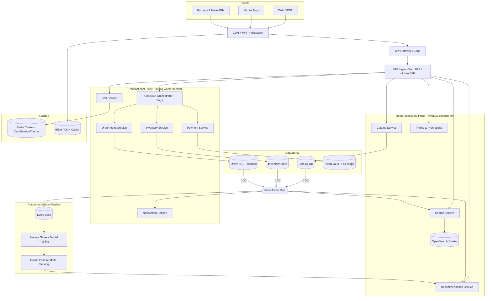
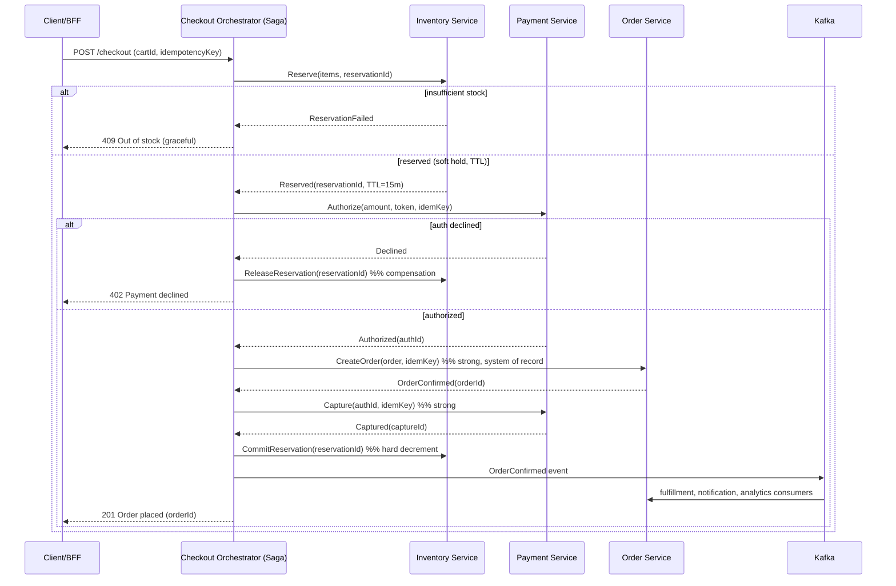
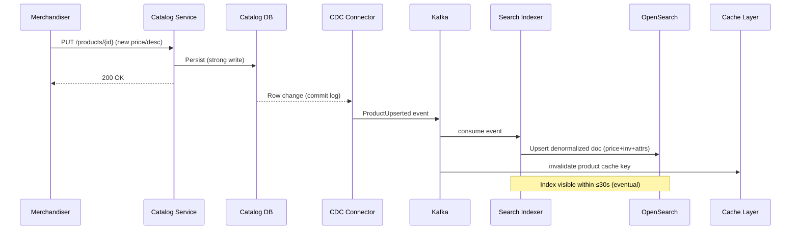

# Enterprise Architecture Scenario: Large-Scale E-Commerce Platform

**Executive Summary** — This document presents an end-to-end enterprise architecture for "Helix Commerce," a multi-region, large-scale e-commerce platform serving tens of millions of daily shoppers across web, mobile, and partner channels. The architecture is built on an event-driven microservices foundation that deliberately separates the read-optimized browse/discovery plane (product catalog, search, recommendations) from the write-critical transactional plane (cart, checkout, inventory, order management, payments). We embrace **eventual consistency** where business tolerance permits — catalog propagation, recommendations, and soft inventory reservations — and enforce **strong consistency** where money and customer trust are at stake — payment capture and final order persistence. The design targets 99.99% availability for the storefront, sub-200ms p95 browse latency, and the ability to absorb a **10x Black Friday surge** through CDN offload, multi-layer caching, queue-based load leveling, horizontal autoscaling, and graceful degradation. Core enterprise patterns applied throughout include CQRS, Change Data Capture (CDC), the saga pattern for distributed checkout, cache-aside, and idempotency keys for safe retries.

---

## Context & Business Requirements

Helix Commerce is the flagship digital storefront for a global retailer operating in North America, EMEA, and APAC. The business is transitioning from a legacy on-premise monolith to a cloud-native platform to support aggressive growth, faster feature velocity, and resilience during promotional peaks (Black Friday, Cyber Monday, regional mega-sale days such as Singles' Day).

**Business drivers:**
- **Growth & GMV** — Annual Gross Merchandise Value of ~$12B, growing 18% YoY. Black Friday week alone accounts for ~8% of annual GMV.
- **Conversion sensitivity** — Every 100ms of added latency measurably reduces conversion; the storefront must stay fast even under load.
- **Catalog breadth** — ~50 million SKUs across 1P (first-party) and 3P (marketplace seller) inventory, with rich attributes, variants, and localized content.
- **Omnichannel** — Web, iOS/Android apps, progressive web app, and partner/affiliate APIs must share a consistent commerce backend.
- **Trust & compliance** — Payment handling must be PCI-DSS Level 1 compliant; customer data must respect GDPR/CCPA. Oversell incidents (charging for unavailable stock) must be near-zero.
- **Time-to-market** — Independent teams must deploy bounded contexts independently, multiple times per day.

**User base:**
- ~25 million Daily Active Users (DAU) at steady state.
- ~120 million registered customers; ~300 million product page views/day at steady state.
- Tens of thousands of internal users: merchandisers, category managers, customer-service agents, fulfillment operators.

---

## Functional Requirements

1. **Product Catalog** — Create, update, and retire products; manage variants (size/color), categories, attributes, media, and localized descriptions/pricing for multiple locales and currencies.
2. **Search & Browse** — Full-text and faceted search, autocomplete/typeahead, category navigation, filtering, sorting, and merchandised collections; relevance tuning and synonyms.
3. **Cart** — Add/remove/update line items; persistent carts for logged-in users and ephemeral carts for guests; cart merge on login; price and promotion re-evaluation.
4. **Checkout** — Multi-step or single-page checkout: address capture, shipping options, promo/coupon application, tax calculation, payment selection, order review, and placement.
5. **Inventory Management** — Real-time availability, soft reservations during checkout, hard decrement on order confirmation, multi-warehouse Available-to-Promise (ATP), backorder/pre-order handling.
6. **Order Management (OMS)** — Order lifecycle (created → confirmed → fulfilled → shipped → delivered → returned), order orchestration across warehouses, cancellations, partial shipments, returns/refunds.
7. **Payments** — Authorization, capture, refunds, multiple payment methods (cards, wallets, BNPL, gift cards), 3-D Secure, tokenization, and reconciliation.
8. **Pricing & Promotions** — Base/list pricing, dynamic promotions, coupon codes, cart-level and item-level discounts, loyalty rewards, A/B-tested offers.
9. **Recommendations** — "Customers also bought," personalized home feed, similar items, trending, and post-purchase upsell — served at low latency.
10. **Notifications** — Order confirmations, shipping updates, abandoned-cart reminders, price-drop alerts via email/SMS/push.

---

## Non-Functional Requirements

| NFR | Target | Notes |
|-----|--------|-------|
| Storefront availability | 99.99% (≤ ~52 min/yr downtime) | Browse/search must survive partial backend failure via degradation |
| Checkout/payment availability | 99.95% | Stricter consistency means slightly lower availability budget |
| Browse/search latency (p95) | ≤ 200 ms | Served largely from cache/CDN/search cluster |
| Add-to-cart latency (p95) | ≤ 150 ms | Redis-backed |
| Checkout submit latency (p95) | ≤ 1.5 s | Includes payment auth round-trip |
| Search query throughput | 80k QPS peak | OpenSearch cluster, scaled out |
| Steady-state API RPS | ~50k RPS | Aggregate across services |
| Peak multiplier (Black Friday) | **10x** steady state | Pre-scaled + autoscaling + load leveling |
| Order durability | RPO ≤ 0 (no committed-order loss) | Synchronous replication for order/payment stores |
| Recovery Time Objective (RTO) | ≤ 15 min for transactional core | Multi-AZ failover; cross-region for DR |
| Data freshness — catalog → search | ≤ 30 s (eventual) | CDC pipeline |
| Inventory accuracy | Oversell rate < 0.05% | Soft reservation + reconciliation |
| Compliance | PCI-DSS Level 1, GDPR, CCPA, SOC 2 | Cardholder data isolated; tokenized |
| Security | TLS 1.3 everywhere; encryption at rest (KMS) | WAF + bot mitigation at edge |
| Scalability | Horizontal, stateless services | No sticky sessions in app tier |

---

## Capacity / Scale Estimates

Back-of-envelope sizing to justify infrastructure choices. Numbers are deliberately rounded.

**Traffic (steady state):**
- DAU: 25M. Assume each active user generates ~12 page views ⇒ **300M page views/day**.
- Seconds/day ≈ 86,400. Average page-view rate ≈ 300M / 86,400 ≈ **3,500 PV/s**.
- Peak-to-average ratio for a daily cycle ≈ 4x ⇒ steady-state peak ≈ **14k PV/s**.
- Each page view fans out to ~3–4 API/backend calls ⇒ steady-state peak API rate ≈ **~50k RPS**.
- Search: ~25% of page views trigger a query ⇒ steady peak ≈ 3,500 QPS; with autocomplete keystrokes (each ~5 calls), search subsystem peaks near **~20k QPS** steady, headroom designed to **80k QPS**.

**Black Friday (10x multiplier):**
- Peak page views ≈ 140k PV/s.
- Peak aggregate API ≈ **~500k RPS** (target with CDN offload reducing origin to a fraction).
- CDN offload of ~85% of static + cacheable content ⇒ origin sees ~75k RPS dynamic; the rest absorbed at edge.

**Orders:**
- Steady state: ~1.2M orders/day ⇒ avg ~14 orders/s; daily peak ~60 orders/s.
- Black Friday: ~12M orders/day, with intraday spikes to **~2,000 orders/s** during doorbuster drops — smoothed by queue-based load leveling.
- Conversion ~3.5% of sessions.

**Catalog & storage:**
- 50M SKUs × ~5 KB structured record ⇒ **~250 GB** catalog core; with variants, history, and localized content ⇒ **~1.5 TB**.
- Media (images/video) on object storage + CDN: ~30 images/product avg × 50M ⇒ ~1.5B objects, **~300 TB** in object storage.
- Search index: denormalized doc ~3 KB × 50M × replicas(2) ⇒ **~300 GB** primary, ~1 TB with replicas/overhead.
- Orders: 1.2M/day × 365 ≈ 440M/yr; ~10 KB/order incl. line items ⇒ **~4.4 TB/yr** (hot in SQL, aged to cold storage/warehouse).
- Cart (Redis): ~30M concurrent active carts × ~5 KB ⇒ **~150 GB** working set; sharded Redis cluster.
- Clickstream/events: ~300M PV/day × ~1 KB ⇒ **~300 GB/day** into the event lake for recommendations/analytics.

These estimates drive: a sharded catalog store, a multi-node OpenSearch cluster, a large Redis cluster for cart, partitioned SQL for orders, and a high-throughput message bus (Kafka) for events.

---

## High-Level Architecture



---

## Core Components / Services

Each bounded context is owned by an independent team, deployed independently, and communicates synchronously (request/response) only where necessary and asynchronously (events) by preference.

| Service / Bounded Context | Responsibility | Consistency Model | Primary Store | Scaling Pattern |
|---|---|---|---|---|
| **Catalog** | Source of truth for products, variants, attributes, media refs, localization | Strong (write) / eventual (downstream) | Catalog DB (document/relational) | Read replicas + cache-aside |
| **Search** | Query, facets, autocomplete, relevance | Eventual (CDC-fed index) | OpenSearch | Shard + replica scale-out |
| **Cart** | Line items, totals, promo eval, guest/auth carts | Eventual; last-write-wins per cart | Redis (durable AOF + backup) | Sharded by cartId |
| **Checkout** | Orchestrates reservation → payment → order via saga | Strong at boundaries; saga for cross-service | Saga state store | Stateless workers + queue |
| **Inventory** | ATP, soft reservation, hard decrement, multi-warehouse | Eventual reservation / strong decrement | Inventory store (SQL + cache) | Partition by SKU/warehouse |
| **Order / OMS** | Order lifecycle, orchestration, returns, status | Strong (system of record) | Sharded SQL | Shard by orderId/customerId |
| **Payment** | Auth, capture, refund, tokenization, 3DS | Strong + idempotent | Token vault (PCI) + ledger | Isolated PCI enclave |
| **Pricing & Promotions** | Base price, discounts, coupons, loyalty | Strong rules / eventual price cache | Rules DB + cache | Read-heavy cache |
| **Recommendation** | Personalized + contextual recs | Eventual / best-effort | Feature store + model serving | Horizontally scaled serving |
| **Notification** | Email/SMS/push, templating, preferences | Eventual / at-least-once | Queue + provider | Worker pool autoscale |

**Subsection highlights:**

- **Catalog Service** — Exposes write APIs to merchandisers and read APIs to BFF. On write, persists to Catalog DB and emits `ProductUpserted`/`ProductRetired` events via CDC. Reads are cache-aside against Redis with short TTL; cache misses hydrate from read replicas.
- **Search Service** — Owns the OpenSearch index. It is a pure projection of catalog + inventory + pricing built by consuming CDC/event streams. It never writes to source-of-truth stores. Supports synonym dictionaries, boosting, and per-locale analyzers.
- **Checkout Orchestrator** — A stateless saga coordinator. It does not own data beyond saga/transaction state; it composes Inventory, Pricing, Payment, and OMS via commands and compensations.
- **Payment Service** — Lives inside a network-segmented PCI cardholder data environment (CDE). Card data is tokenized at the edge; downstream services see only tokens.

---

## Data Architecture

**Store selection and rationale:**

| Data | Store | Why |
|---|---|---|
| Product catalog | Document store (e.g., MongoDB/Aurora w/ JSON) | Flexible variant/attribute schemas, high read volume, read replicas |
| Search index | OpenSearch/Elasticsearch | Inverted index, faceting, relevance, autocomplete — purpose-built |
| Cart | Redis Cluster | Ephemeral, ultra-low latency, TTL-based expiry, high write rate |
| Orders | Sharded relational SQL (Aurora/PostgreSQL) | ACID, system of record, financial integrity, joins for OMS |
| Inventory | SQL + Redis counter cache | Strong decrement requires transactions; reads served from cache |
| Payment tokens / ledger | Hardened vault + append-only ledger | PCI isolation, immutability, auditability |
| Events / clickstream | Kafka → Data Lake (S3/Parquet) | High-throughput append, replay, analytics |
| Recommendations features | Feature store (online + offline) | Low-latency serving + batch training |

**Schema sketch (orders, simplified):**

```sql
-- ORDERS (sharded by customer_id)
order(
  order_id        UUID PRIMARY KEY,
  customer_id     UUID NOT NULL,
  status          VARCHAR,         -- CREATED, CONFIRMED, SHIPPED, ...
  currency        CHAR(3),
  grand_total     NUMERIC(12,2),
  idempotency_key VARCHAR UNIQUE,  -- safe retries
  created_at      TIMESTAMPTZ,
  updated_at      TIMESTAMPTZ
);

order_line(
  order_id   UUID REFERENCES order(order_id),
  line_no    INT,
  sku        VARCHAR,
  qty        INT,
  unit_price NUMERIC(12,2),
  PRIMARY KEY (order_id, line_no)
);

payment(
  payment_id      UUID PRIMARY KEY,
  order_id        UUID,
  auth_id         VARCHAR,
  capture_id      VARCHAR,
  amount          NUMERIC(12,2),
  state           VARCHAR,         -- AUTHORIZED, CAPTURED, REFUNDED
  idempotency_key VARCHAR UNIQUE
);

-- INVENTORY (partitioned by sku/warehouse)
inventory(
  sku          VARCHAR,
  warehouse_id VARCHAR,
  on_hand      INT,
  reserved     INT,    -- soft reservations
  available    INT GENERATED AS (on_hand - reserved),
  PRIMARY KEY (sku, warehouse_id)
);
```

**Sharding & caching strategy:**
- **Orders** sharded by `customer_id` (hash) so a customer's history lives on one shard; cross-shard reporting offloaded to the data warehouse.
- **Inventory** partitioned by `sku`/`warehouse_id`; hot SKUs get dedicated Redis counters to avoid DB hot-rows during drops.
- **Catalog** uses cache-aside (Redis) with versioned keys; writes invalidate by emitting events that the cache layer consumes.
- **Cart** sharded by `cartId` across Redis cluster slots; AOF persistence + periodic snapshot for durability.
- **Multi-layer caching:** browser → CDN edge → BFF response cache → service cache (Redis) → DB read replicas.

**CDC pipeline:** Source-of-truth databases (Catalog, Inventory, Orders) stream row-level changes via CDC (Debezium connectors) into Kafka. Downstream consumers (Search indexer, Recommendation feature builder, Notification, analytics lake) build their own read-optimized projections — the essence of **CQRS** at the data tier. This decouples write models from the many read models and bounds catalog→search freshness to ≤30s.

---

## Key Workflows

### Workflow 1 — Checkout with inventory reservation, payment, and order saga

The checkout orchestrator runs a **saga**: each step has a forward action and a compensating action. Idempotency keys make every step safe to retry. Inventory reservation is a *soft* (eventually consistent) hold; payment capture and final order write are *strongly consistent*.



**Notes:** If `CreateOrder` succeeds but `Capture` fails transiently, the saga retries capture (idempotent). If capture ultimately fails, the order is canceled and reservation released — no oversell, no orphan charge. Reservation TTL auto-expires abandoned checkouts, returning stock.

### Workflow 2 — Catalog update propagating to search via CDC/event



---

## Cross-Cutting Concerns

**Security & PCI** — The Payment Service runs in a segmented PCI Cardholder Data Environment with its own VPC/subnets, restricted IAM, and no general developer access. Card numbers are tokenized at the edge (via the payment gateway / hosted fields) so the broader platform is descoped from handling PANs. TLS 1.3 in transit; KMS-managed encryption at rest. A WAF with bot mitigation and rate limiting sits at the CDN edge. Secrets in a managed vault; mTLS between services in the mesh. Regular SAST/DAST and SOC 2 controls.

**HA / DR** — All stateless services run multi-AZ behind load balancers. Transactional stores (Orders, Payments) use **synchronous multi-AZ replication** ⇒ **RPO ≤ 0** for committed transactions; **RTO ≤ 15 min** via automated failover. Cross-region asynchronous replication provides regional DR (RPO ≤ 5 min, RTO ≤ 1 hr). Search/catalog projections are rebuildable from source-of-truth + event replay, so they tolerate higher RPO. Backups are tested via regular game-days.

**Observability** — Distributed tracing (OpenTelemetry) with trace IDs propagated from the edge through the saga; centralized structured logging; RED/USE metrics dashboards; SLO-based alerting with error budgets. Synthetic checkout canaries run continuously. Business KPIs (conversion, oversell rate, payment success) are first-class signals.

**Autoscaling** — Horizontal pod autoscaling on CPU + custom metrics (RPS, queue depth). Pre-scaling schedules ahead of known events. Cluster autoscaler adds nodes; OpenSearch and Redis are pre-sized for peak (stateful tiers scale slower, so they lead). Connection pooling and circuit breakers protect downstream stores.

**Caching layers** — (1) CDN edge for static + cacheable product pages; (2) BFF response cache for composed views; (3) Redis cache-aside for catalog/pricing; (4) DB read replicas. Cache stampede protection via request coalescing and jittered TTLs.

**Peak / Black-Friday playbook:**
- **Pre-event:** capacity freeze, pre-scale stateful tiers, warm caches, load-test at 12x, raise rate limits selectively, review runbooks.
- **Queue-based load leveling:** order placement publishes to a durable queue; OMS workers drain at a controlled rate, smoothing the ~2,000 orders/s spikes into sustainable throughput. The user gets an immediate "order received" acknowledgment; confirmation finalizes asynchronously.
- **Graceful degradation:** if Recommendation or Personalization is overloaded, fall back to cached/non-personalized lists; if pricing service is slow, serve last-known cached prices; search degrades to cached popular queries. Checkout and payment are *never* shed.
- **Feature flags & kill switches:** non-essential features (rich reviews, live inventory badges, personalization) can be toggled off instantly to shed load.
- **Load shedding & prioritization:** the edge prioritizes checkout/payment traffic over browse when saturated; bot traffic is throttled aggressively.
- **Hot-SKU protection:** doorbuster SKUs use dedicated Redis decrement counters + virtual waiting room to prevent DB hot-row contention and oversell.

---

## Key Trade-offs & Decisions

| Decision | Chosen Approach | Alternative | Rationale |
|---|---|---|---|
| Catalog/search consistency | **Eventual** (CDC-fed index, ≤30s) | Strong synchronous index writes | Decouples write path, enables independent scaling; 30s staleness is business-acceptable for browse |
| Payment & final order | **Strong consistency** (ACID + sync replication) | Eventual | Money and order integrity demand zero loss / no double charge |
| Architecture style | **Microservices, event-driven** | Modular monolith | Independent deploys, team autonomy, targeted scaling at e-commerce scale |
| Read/write separation | **CQRS** (projections via events) | Single model for reads & writes | Read models (search/reco) differ radically from write models; enables 10x read scale-out |
| Inventory reservation | **Soft reservation + TTL, hard decrement on confirm** | Hard decrement at add-to-cart | Avoids stranding stock in abandoned carts while bounding oversell |
| Oversell handling | **Accept tiny oversell risk + reconcile**, hot-SKU counters | Pessimistic global lock per SKU | Locking kills throughput at peak; small reconciled oversell is cheaper than lost throughput |
| Checkout execution | **Saga (orchestrated) with compensations** | 2-phase distributed transaction (2PC) | 2PC doesn't scale across services/clouds; saga is resilient and horizontally scalable |
| Order placement at peak | **Async via queue (load leveling)** | Fully synchronous order write | Smooths 2,000 orders/s spikes, protects OMS/DB, keeps UX responsive |
| Safe retries | **Idempotency keys** on payment/order | At-most-once best effort | Network retries must not double-charge or duplicate orders |
| Cart store | **Redis (in-memory)** | Relational DB | Cart is high-churn, ephemeral, latency-sensitive; SQL would be overkill and slower |
| PCI scope | **Tokenize at edge, isolate CDE** | Handle PANs platform-wide | Drastically reduces PCI audit surface and risk |

---

## Tech Stack

| Layer | Technology (representative) |
|---|---|
| Clients | React/Next.js (web/PWA), Swift/Kotlin (native), GraphQL/REST BFF |
| Edge | CDN (CloudFront/Akamai/Fastly), WAF, bot management, hosted payment fields |
| API Gateway / BFF | API Gateway + per-channel BFF (Node.js / Kotlin) |
| Service runtime | Kubernetes (EKS/GKE), containers, service mesh (Istio/Linkerd) with mTLS |
| Languages | Java/Kotlin (Spring Boot), Go (latency-critical services), Python (ML) |
| Messaging / streaming | Apache Kafka; CDC via Debezium |
| Search | OpenSearch / Elasticsearch |
| Caching | Redis Cluster (cart, cache-aside), CDN edge cache |
| Catalog store | MongoDB / Aurora (JSON-capable relational) |
| Transactional DB | Amazon Aurora PostgreSQL / PostgreSQL (sharded) |
| Payments | Payment gateway (Stripe/Adyen/Braintree), tokenization vault |
| Data lake / analytics | S3 + Parquet, Spark, Snowflake/BigQuery warehouse |
| ML / recommendations | Feature store (Feast), SageMaker/Vertex AI, online model serving |
| Notifications | Email/SMS/push providers + Kafka-driven workers |
| Observability | OpenTelemetry, Prometheus/Grafana, ELK/Datadog, distributed tracing |
| IaC / CI-CD | Terraform, GitOps (ArgoCD), automated canary deploys |
| Secrets / security | KMS, HashiCorp Vault / cloud secrets manager |

---

*Prepared for the Architecture Review Board. This design favors resilience and read-scale for discovery, strict integrity for money, and operability under extreme peak — the defining constraints of large-scale e-commerce.*
