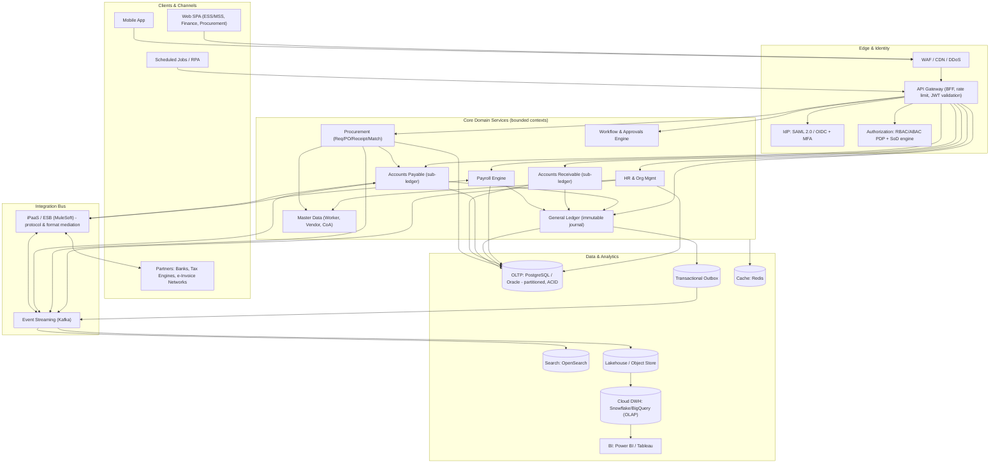
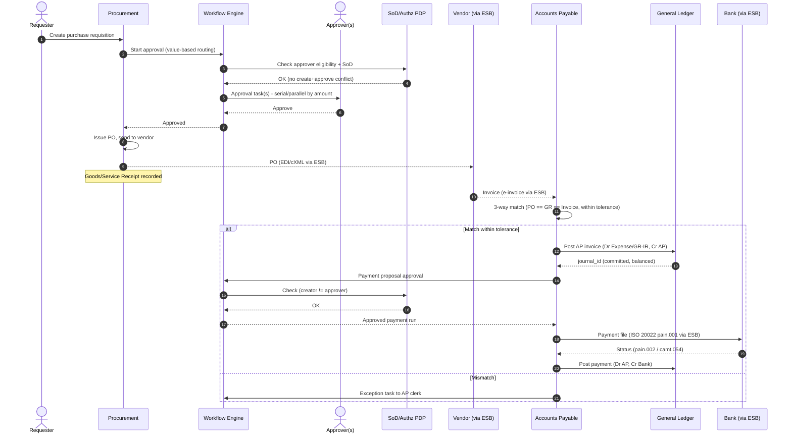
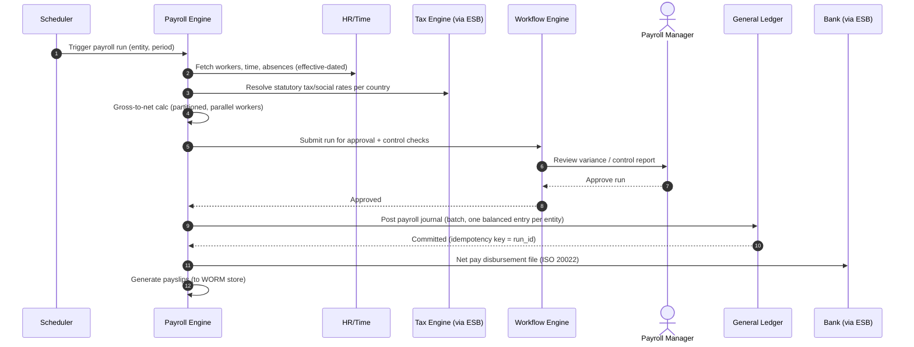

# Enterprise ERP / HR Platform — End-to-End Architecture Scenario

> A principal-architect reference design for a global, multi-entity ERP & HR platform spanning **HR/Payroll**, **Finance/General Ledger**, and **Procurement**, with a workflow/approvals engine, RBAC + Segregation of Duties (SoD), multi-currency/multi-country support, an integration bus, and **strongly consistent financial postings**. Reference points: SAP S/4HANA, Oracle Fusion, Workday.

---

## Context & Business Requirements

A multinational manufacturing & services group ("Acme Global") is consolidating ~12 legacy systems (regional payroll vendors, an aging on-prem SAP ECC, spreadsheet-driven procurement, and bolt-on expense tools) onto a single cloud-native ERP/HR platform.

**Business drivers**

| Driver | Description |
|---|---|
| Single source of truth | One employee master, one chart of accounts (CoA), one vendor master across all entities. |
| Statutory compliance | Local GAAP + IFRS dual reporting, SoX internal controls, GDPR (EU), country payroll/tax law (US, UK, DE, IN, JP, BR). |
| Faster financial close | Reduce month-end close from 12 business days to ≤ 4. |
| Auditability | Immutable journal, full lineage from source document → GL → financial statement. |
| Self-service | Employee/Manager self-service (ESS/MSS), real-time analytics for finance & HR leaders. |
| M&A agility | Onboard a newly acquired legal entity within one quarter. |

**Scope of business processes**
- **Hire-to-Retire** (recruiting hand-off, onboarding, org management, time & attendance, payroll, offboarding).
- **Procure-to-Pay (P2P)** (requisition → PO → goods receipt → invoice → 3-way match → payment → GL).
- **Record-to-Report (R2R)** (journal entry, sub-ledger reconciliation, intercompany, period close, consolidation, statutory + management reporting).

**Key constraints**
- Regulated industry; financial data must be **immutable and append-only** once posted.
- Global footprint: 24×7 operation; no single maintenance window works for all regions.
- Data residency: EU and certain country payroll data must remain in-region.

---

## Functional Requirements

**HR & Payroll**
- Worker master data (employees, contingent workers), org structures, position management, effective-dated records.
- Time & attendance capture, absence/leave management.
- Gross-to-net payroll calculation per country, statutory tax & social contributions, off-cycle/retro payroll.
- ESS/MSS for changes (address, dependents, time-off) routed through approvals.

**Finance / General Ledger**
- Double-entry, **immutable journal** with balanced debits/credits enforced at posting.
- Multi-ledger (local GAAP, IFRS, group/management), parallel currencies.
- Sub-ledgers (AP, AR, Fixed Assets) reconciling to GL.
- Intercompany postings, currency revaluation, period open/close, year-end close.
- Multi-entity consolidation & eliminations.

**Procurement**
- Requisition, sourcing, purchase orders, goods/services receipt.
- 3-way match (PO ↔ GR ↔ Invoice), tolerance handling, vendor master, catalog/punchout.

**Cross-cutting functional**
- Configurable **workflow & approvals engine** (parallel/serial, delegation, escalation, value-based routing).
- **RBAC + ABAC** with **Segregation of Duties** conflict detection (e.g., a user cannot both create a vendor and approve its payment).
- Reporting & analytics (operational + dimensional warehouse).
- Integration bus to/from banks, tax engines, benefits providers, MES, CRM, e-invoicing networks.

## Non-Functional Requirements

| Category | Requirement |
|---|---|
| **Availability** | Core transactional services (GL, P2P, ESS) **99.95%** (≈ 4.4h/yr). Payroll calc engine 99.9% within payroll windows. Analytics 99.5%. |
| **Latency** | Interactive API reads p99 ≤ 300 ms; transactional write (e.g., post journal) p99 ≤ 800 ms; approval action p99 ≤ 500 ms. |
| **Throughput** | Sustain 3–5k transactional req/s peak; payroll batch 250k employees in ≤ 4h; close batch 50M journal lines processed in ≤ 6h. |
| **Consistency** | **Strong consistency (ACID, serializable where needed)** for any operation touching the GL or sub-ledgers. Eventual consistency acceptable for analytics, search, and notifications. |
| **Compliance** | SoX (ITGC, change mgmt, SoD), IFRS + local GAAP, GDPR/data residency, country payroll/tax statutes, PCI-adjacent for bank payment files, retention 7–10 yrs. |
| **Security** | SSO via SAML 2.0 / OIDC, MFA, least privilege, encryption in transit (TLS 1.3) and at rest (AES-256, KMS/HSM), full audit trail, field-level encryption for PII/comp. |
| **RPO / RTO** | Financial data RPO ≤ 5 min, RTO ≤ 1 h. Analytics RPO ≤ 1 h, RTO ≤ 4 h. |
| **Auditability** | Every posting carries source-doc lineage, user, timestamp, before/after for master data; tamper-evident (hash-chained) journal. |

---

## Capacity / Scale Estimates

Assume **250,000 employees** across **45 legal entities**, **22 countries**, **18 transaction currencies**, group reporting currency **USD** + IFRS.

| Dimension | Estimate | Notes |
|---|---|---|
| Employees / workers | 250,000 (220k perm + 30k contingent) | Master data ~250k rows, effective-dated → ~5–10M historical records. |
| Daily logins (ESS/MSS) | ~120,000 DAU | Peaks at start of business per region (rolling). |
| Interactive API peak | 3,000–5,000 req/s | 90% reads. |
| Journal lines / day (steady) | ~2–4 million | AP/AR/payroll postings, intercompany. |
| Journal lines / month-end close | ~50 million in 6h window | ≈ 2,300 lines/s sustained, bursts to 8k/s. |
| Payroll run | 250k employees, biweekly/monthly mix | Largest single run ~150k employees → ≤ 4h; ~30M calc result rows. |
| POs / day | ~40,000 | + ~120k requisition lines, ~30k invoices/day. |
| Approval tasks / day | ~250,000 | Workflow engine throughput ~5–10/s steady, bursts at period boundaries. |
| Data volume (OLTP) | ~25–40 TB live | GL + sub-ledgers + HR; 7–10 yr retention archived. |
| Data warehouse (OLAP) | ~200–400 TB | History + dimensional models. |
| Integration messages | ~5–8 million/day | Bank files, e-invoices, tax calls, benefits, MES feeds. |

**Sizing rationale (close window):** 50M lines / (6h × 3600s) ≈ 2,315 lines/s average; with skew toward consolidation tasks, provision the GL engine for ~8k lines/s burst via partitioned, horizontally-scaled posting workers writing to a partitioned ledger.

---

## High-Level Architecture



**Architecture style:** Modular monolith-of-modules / **domain-driven microservices** behind an API gateway. Strongly-consistent financial cores share carefully bounded ACID stores; loosely-coupled domains integrate via events. The **integration bus** decouples internal services from the volatile external partner landscape.

---

## Core Components / Services (Bounded Contexts)

| Bounded Context | Responsibility | Consistency model | Owns data |
|---|---|---|---|
| **HR & Org Management** | Worker master, positions, effective-dated org, time & absence. | Strong within context; emits events. | Worker, Position, Org Unit, Time entries |
| **Payroll Engine** | Country-specific gross-to-net, statutory calc, retro/off-cycle; posts results to GL. | Strong per pay run; idempotent batch. | Pay results, calc rules, payslips |
| **General Ledger** | Double-entry immutable journal, multi-ledger/currency, period control, intercompany. | **Serializable ACID**; append-only. | Journal entries, balances, periods, CoA |
| **Accounts Payable** | Vendor invoices, 3-way match outcome, payment proposal/run. | Strong; reconciles to GL. | AP open items, payment batches |
| **Accounts Receivable** | Customer invoices, collections, dunning. | Strong; reconciles to GL. | AR open items |
| **Procurement** | Requisition, PO, goods/service receipt, sourcing, catalog. | Strong within order lifecycle. | Requisition, PO, GR |
| **Workflow & Approvals** | BPMN-based routing, delegation, escalation, value/SoD-aware steps. | Strong on task state; orchestrates sagas. | Process instances, tasks |
| **Master Data Mgmt (MDM)** | Golden records (Worker, Vendor, Customer, CoA, cost centers), match/merge, governance. | Strong; publishes reference data. | Golden records, mappings |
| **Authorization / SoD** | RBAC role catalog, ABAC policies, SoD conflict ruleset, access certification. | Strong reads; cached at gateway. | Roles, policies, SoD matrix |
| **Reporting/Analytics** | Operational reports + dimensional warehouse, statutory + management reporting. | Eventual (ELT pipeline). | Dimensional models, marts |
| **Integration** | ESB/iPaaS adapters, e-invoicing, bank connectivity, tax engine calls. | At-least-once + idempotency. | Connector state, message logs |

---

## Data Architecture

**Polyglot persistence — store chosen per workload:**

| Store | Technology | Why |
|---|---|---|
| **Transactional core (GL, sub-ledgers, HR)** | **PostgreSQL** (Aurora/Cloud SQL) or **Oracle Exadata** | ACID, serializable isolation, mature partitioning, strong referential integrity for financial postings. Oracle for the heaviest GL/consolidation if licensing exists; Postgres for newer services. |
| **Transactional outbox** | Same OLTP DB | Atomic write of business change + event row → reliable CDC/event publish (no dual-write). |
| **Event log / streaming** | **Apache Kafka** (Confluent) | Durable, ordered, replayable event backbone; CDC via Debezium. |
| **Cache / session / locks** | **Redis** | Hot reference data (CoA, FX rates, RBAC decisions), distributed locks for period/posting control. |
| **Search** | **OpenSearch / Elasticsearch** | Worker/vendor/PO/invoice search, faceted UI. Eventually consistent projection. |
| **Lakehouse + Warehouse** | **S3/ADLS + Snowflake / BigQuery** | Dimensional OLAP, consolidation, large-scale analytics, ML on workforce/spend. |
| **Document / file store** | **S3/Blob** (WORM/object-lock) | Payslips, invoice images, bank files, statutory archives — immutable retention. |
| **BI semantic layer** | **dbt + Power BI / Tableau** | Governed metrics, statutory + management reporting. |

### Immutable double-entry journal — schema sketch

```sql
-- Journal header: one balanced document
CREATE TABLE gl_journal_entry (
  journal_id      BIGINT       PRIMARY KEY,            -- monotonic / snowflake id
  entity_id       INT          NOT NULL,               -- legal entity
  ledger_id       INT          NOT NULL,               -- local GAAP / IFRS / group
  period_id       INT          NOT NULL REFERENCES gl_period(period_id),
  currency        CHAR(3)      NOT NULL,
  source_doc_type VARCHAR(20)  NOT NULL,               -- 'AP_INVOICE','PAYROLL','MANUAL'
  source_doc_id   BIGINT       NOT NULL,
  status          VARCHAR(12)  NOT NULL,               -- POSTED | REVERSED (no UPDATE/DELETE of POSTED)
  prev_hash       BYTEA,                               -- hash chain over prior entry (tamper-evident)
  entry_hash      BYTEA        NOT NULL,
  created_by      VARCHAR(64)  NOT NULL,
  posted_at       TIMESTAMPTZ  NOT NULL DEFAULT now()
) PARTITION BY RANGE (period_id);

CREATE TABLE gl_journal_line (
  journal_id      BIGINT       NOT NULL REFERENCES gl_journal_entry(journal_id),
  line_no         INT          NOT NULL,
  account_id      INT          NOT NULL REFERENCES gl_account(account_id),
  cost_center     INT,
  debit_amount    NUMERIC(20,4) NOT NULL DEFAULT 0,
  credit_amount   NUMERIC(20,4) NOT NULL DEFAULT 0,
  txn_currency    CHAR(3)      NOT NULL,
  group_amount    NUMERIC(20,4) NOT NULL,              -- converted to reporting currency
  fx_rate         NUMERIC(18,8) NOT NULL,
  PRIMARY KEY (journal_id, line_no)
);

-- Enforce balance at commit: SUM(debit) = SUM(credit) per (journal_id, currency)
-- via deferred constraint trigger; POSTED rows are append-only (corrections = reversing entry).
```

**Design notes**
- **Append-only / immutable:** posted entries are never updated or deleted; corrections post a *reversing* entry. A **hash chain** (`prev_hash → entry_hash`) makes the ledger tamper-evident for SoX/audit.
- **Effective-dated HR master data:** `valid_from`/`valid_to` columns so historical org/comp are reconstructable (no destructive updates).
- **Multi-currency:** every line stores transaction currency + reporting (group) amount and FX rate snapshot; parallel ledgers store parallel valuations.
- **Partitioning:** GL partitioned by `period_id` (and sub-partitioned by entity) so close-window batch and archival operate per partition.
- **CDC → analytics:** Debezium streams committed changes from the outbox to Kafka → lakehouse → Snowflake (ELT via dbt). OLTP is never queried directly for heavy analytics.

---

## Key Workflows

### 1) Procure-to-Pay with approvals, 3-way match, and GL posting



**Consistency choice (P2P):** The **AP invoice posting + GL journal** is a single ACID transaction inside the finance core (shared OLTP, serializable) — debits must equal credits or the whole posting rolls back. The longer-running, cross-service P2P process (req → PO → receipt → invoice → payment) is orchestrated as a **saga** by the workflow engine, because it spans days/services and external partners; each step is independently committed with compensating actions (e.g., cancel PO, reverse accrual). We deliberately **avoid 2PC across services** (see trade-offs).

### 2) Payroll run → GL posting (batch, idempotent)



**Consistency choice (payroll):** The run is **idempotent** — keyed by `run_id`; re-execution after failure does not double-post. GL posting per entity is a single balanced ACID transaction. Disbursement file generation only proceeds after the GL commit succeeds (outbox-driven).

---

## Cross-Cutting Concerns

### Security & Compliance
- **AuthN:** SAML 2.0 / OIDC SSO via enterprise IdP (Entra ID / Okta / Ping), MFA enforced; service-to-service via mTLS + short-lived JWT/OAuth2 client credentials.
- **AuthZ:** **RBAC** (job-function role catalog) layered with **ABAC** (entity, country, cost-center, data-residency attributes). A central **PDP** evaluates policy; decisions cached at the gateway. 
- **Segregation of Duties:** an SoD conflict matrix (e.g., *Maintain Vendor* ⊕ *Approve Payment*, *Post Journal* ⊕ *Approve Period Close*) is enforced both **preventively** (role provisioning blocks toxic combinations) and **detectively** (periodic access certification + violation reports for SoX auditors).
- **Data protection:** TLS 1.3 in transit; AES-256 at rest with KMS/HSM-managed keys; **field-level encryption** for PII (national IDs, bank details, compensation). GDPR: data-residency-aware storage, right-to-erasure handled via pseudonymization (financial records retained for statutory periods).
- **Audit:** immutable, hash-chained journal; full CRUD audit trail on master data with before/after; tamper-evident, write-once logs. ITGC controls for change management, access, and operations satisfy **SoX**.

### High Availability & DR
- Active-active across ≥ 2 AZs per region; **multi-region** active-passive for the financial core (RPO ≤ 5 min via synchronous-in-region + async cross-region replication).
- Database: synchronous replica in-region (zero data loss for committed txns), asynchronous standby cross-region; automated failover with health checks.
- Kafka: replication factor 3, min-ISR 2; idempotent producers + exactly-once semantics for posting events.
- DR drills quarterly; documented RTO ≤ 1h for financial services.

### Observability
- **Metrics** (Prometheus/Grafana), **distributed tracing** (OpenTelemetry → Jaeger/Tempo) following a posting end-to-end, **structured logs** (ELK/Loki).
- Business SLOs dashboarded: posting latency, approval cycle time, payroll run duration, close progress, integration message backlog/DLQ depth.
- Reconciliation monitors: sub-ledger vs GL daily tie-out, outbox lag, FX-rate freshness.

### Scaling
- Stateless domain services autoscale (HPA/Kubernetes) on CPU + queue depth.
- GL posting workers scale horizontally; partition by entity/period to avoid hot rows; bulk-load path for close-window batch.
- Read scaling via read replicas + Redis caching of reference data; analytics offloaded entirely to the warehouse (CQRS read side).
- Backpressure on the bus via Kafka consumer groups; DLQs + replay for failed integrations.

---

## Key Trade-offs & Decisions

| Decision | Options considered | Choice & rationale |
|---|---|---|
| Cross-module financial consistency | **2PC/XA** vs **Saga** vs **shared ACID core** | **Shared ACID transaction** within the finance core (GL + sub-ledgers, same DB) for the actual posting — debits/credits must be atomic. **Saga** for long-running cross-service processes (P2P, payroll lifecycle). **Avoid 2PC across microservices** (poor availability, distributed-lock coupling, doesn't scale). |
| Journal mutability | Updatable rows vs **immutable append-only** | Immutable + reversing entries + hash chain — required for SoX/audit and tamper-evidence. |
| Architecture granularity | Pure microservices vs **modular domains** | Group strongly-consistent finance contexts to share an ACID store (avoid distributed transactions); keep HR, procurement, analytics loosely coupled via events. |
| OLTP vs OLAP | One DB vs **CQRS / separate warehouse** | Separate: never run heavy consolidation/reporting on the transactional store; ELT to Snowflake/BigQuery. Eventual consistency on analytics is acceptable. |
| Integration coupling | Point-to-point vs **ESB/iPaaS + Kafka** | Bus decouples internal services from volatile external partners (banks, tax, e-invoice); Kafka for internal events, MuleSoft for protocol/format mediation. |
| Dual-write reliability | App-level dual write vs **Transactional Outbox + CDC** | Outbox + Debezium guarantees the event is published iff the DB commit succeeds — no lost or phantom events. |
| Build vs buy payroll/tax | In-house country rules vs **tax/payroll engine** | Buy statutory tax/rate engines per country (compliance churn is enormous); own orchestration & GL integration. |
| Identity | Custom vs **federated SSO + central PDP** | Federated SAML/OIDC + centralized RBAC/ABAC/SoD; reuse enterprise IdP, satisfy access-certification controls. |

---

## Tech Stack

| Layer | Technology |
|---|---|
| **Frontend** | React/TypeScript SPA, BFF pattern; native mobile (Swift/Kotlin) or React Native. |
| **API / Edge** | Kong / AWS API Gateway, Cloudflare/Akamai WAF + CDN. |
| **Services runtime** | Java 21 (Spring Boot) / .NET for finance cores; Go for high-throughput integration workers; containerized on **Kubernetes (EKS/AKS/GKE)**. |
| **Workflow engine** | **Camunda 8 (Zeebe)** / Flowable — BPMN, sagas, human tasks, delegation/escalation. |
| **Identity & AuthZ** | Microsoft Entra ID / Okta / PingFederate (SAML 2.0, OIDC, MFA); **OPA / Open Policy Agent** or PlainID for ABAC PDP; custom SoD ruleset engine. |
| **OLTP** | **PostgreSQL (Aurora / Cloud SQL)** and **Oracle Exadata** for heaviest GL/consolidation. |
| **Eventing / CDC** | **Apache Kafka (Confluent)** + **Debezium** (transactional outbox). |
| **Integration bus** | **MuleSoft Anypoint** / Boomi (iPaaS, ESB); ISO 20022 (pain/camt) bank connectivity, EDI/cXML/Peppol e-invoicing. |
| **Cache / locks** | Redis (ElastiCache / Memorystore). |
| **Search** | OpenSearch / Elasticsearch. |
| **Lakehouse / DWH** | S3/ADLS + **Snowflake** or **BigQuery**; **dbt** transformations; Airflow/Dagster orchestration. |
| **BI / Reporting** | Power BI / Tableau; statutory disclosure tooling. |
| **Object/document store** | S3 / Azure Blob with Object Lock (WORM) for payslips, invoices, bank/statutory archives. |
| **Tax / payroll** | Country payroll engines + tax engines (e.g., Avalara/Vertex for indirect tax) via ESB. |
| **Observability** | OpenTelemetry, Prometheus + Grafana, Jaeger/Tempo, ELK/Loki, PagerDuty. |
| **IaC / CI-CD** | Terraform, Helm, GitOps (Argo CD), with SoX-compliant change-management gates. |
| **Secrets / keys** | HashiCorp Vault, cloud KMS/HSM. |

---

*Reference benchmarks: SAP S/4HANA (universal journal, immutable ledger), Oracle Fusion (multi-ledger, consolidation), Workday (effective-dated HCM, in-memory object model). This design borrows their proven patterns — immutable double-entry GL, parallel ledgers, effective-dated master data, and SoD-aware approvals — in a cloud-native, event-driven implementation.*
