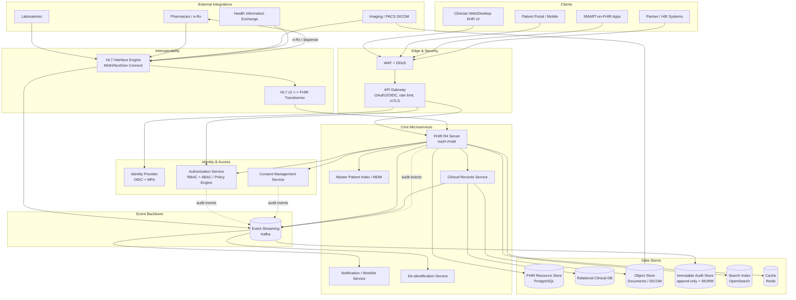
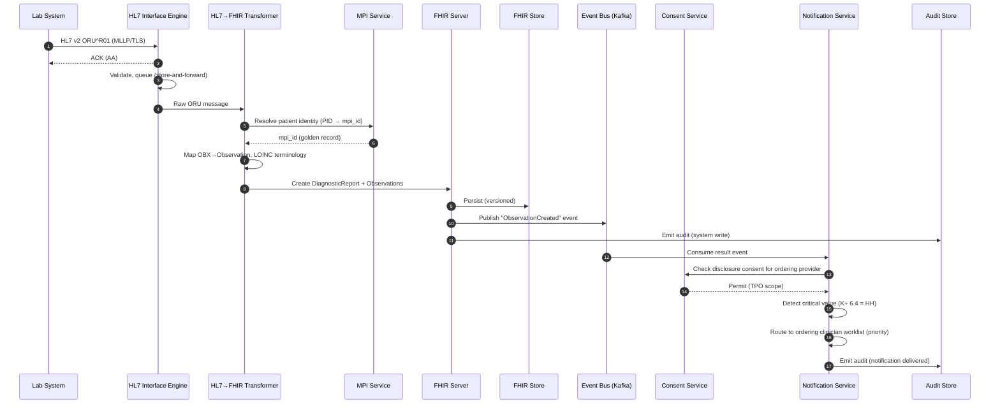
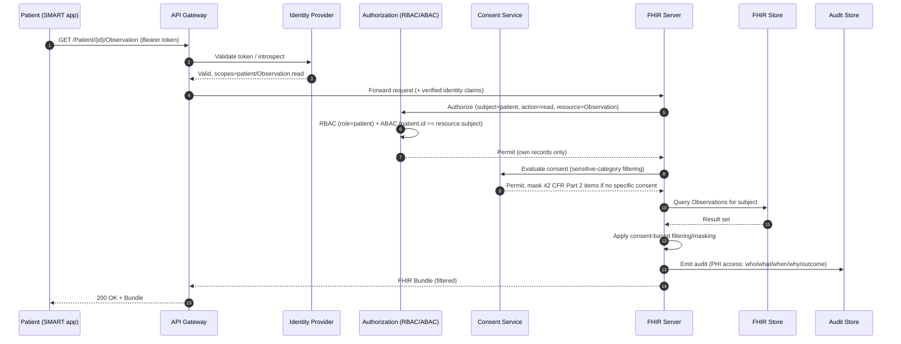

# Electronic Health Records (EHR) Platform — Enterprise Architecture Scenario

> **Audience:** Architecture Review Board (ARB)
> **Author:** Principal Enterprise Architect
> **Status:** Proposed for ARB approval
> **Classification:** Internal / Contains references to PHI handling controls

**Executive Summary.** This document describes the end-to-end enterprise architecture for a multi-tenant **Electronic Health Records (EHR) platform** serving an integrated delivery network of hospitals and ambulatory clinics. The platform manages longitudinal patient records, enforces **HIPAA/HITRUST**-compliant handling of Protected Health Information (PHI), and provides standards-based interoperability through **HL7 v2.x** (inbound feeds from legacy systems) and **FHIR R4** (modern API surface for apps, partners, and patient access). The design is **microservices-based and event-driven**, anchored by a **Master Patient Index (MPI)** for patient identity master data management, a **FHIR-native clinical store**, a **build-on-buy HL7 interface engine**, granular **patient consent management**, and an **immutable, tamper-evident audit trail** covering every PHI access. Security follows **zero-trust** principles with **RBAC + ABAC** authorization, encryption in transit and at rest, and **field-level encryption** for the most sensitive PHI elements. The system targets **99.99% availability** with active-active multi-region deployment, an **RPO of 5 minutes and RTO of 30 minutes**, and integrates bidirectionally with **laboratories, pharmacies, and imaging (DICOM/PACS)** providers.

---

## Context & Business Requirements

The platform supports a regional Integrated Delivery Network (IDN):

| Dimension | Scale |
|---|---|
| Acute-care hospitals | 12 |
| Ambulatory / outpatient clinics | 180 |
| Registered patients (longitudinal records) | 8,000,000 |
| Active patients (seen in trailing 12 months) | 3,200,000 |
| Credentialed providers (physicians, NPs, PAs) | 22,000 |
| Total clinical/admin staff (system users) | 65,000 |
| Concurrent users at peak (weekday mornings) | ~18,000 |
| External integration partners (labs, pharmacies, imaging, HIE) | ~140 |

**Stakeholders and their needs**

- **Patients** — secure self-service access to their own records, lab results, medications, and visit summaries via a patient portal and third-party SMART-on-FHIR apps; control over consent and data sharing; ability to exercise HIPAA "right of access."
- **Clinicians (physicians, nurses, specialists)** — fast, reliable retrieval of the complete longitudinal record at the point of care; sub-second chart loads; clinical decision support inputs; break-glass access in emergencies.
- **Care coordinators & referral staff** — cross-facility record sharing within the IDN and with external Health Information Exchanges (HIEs).
- **Laboratories** — submit results (HL7 v2 ORU) and receive orders (ORM/OML).
- **Pharmacies** — receive e-prescriptions, return dispense/fill status.
- **Imaging centers / Radiology (PACS)** — exchange DICOM studies and structured reports.
- **Compliance / Privacy Office (HIPAA Security & Privacy Officers)** — provable audit trail, consent enforcement, breach detection, and reporting.
- **IT Operations / SRE** — operability, observability, DR readiness.

**Business drivers**

1. Replace fragmented, facility-siloed legacy systems with a unified longitudinal record.
2. Achieve and maintain **HITRUST CSF certification** and HIPAA Security Rule compliance.
3. Enable modern interoperability (21st Century Cures Act / ONC information-blocking rules require FHIR-based patient access APIs).
4. Reduce clinician burnout via fast, reliable access at the point of care.
5. Support population-health analytics on de-identified data.

**Constraints**

- PHI must remain within approved jurisdictions (US data residency).
- Legacy ancillary systems speak HL7 v2 only; they cannot be replaced near-term.
- Zero tolerance for silent data loss of clinical results.

---

## Functional Requirements

1. **Patient record management** — create, read, update, and maintain longitudinal patient charts: demographics, encounters, problems, allergies, medications, immunizations, vitals, clinical notes, lab results, imaging references, and care plans.
2. **Master Patient Index (MPI)** — deterministic + probabilistic patient matching, duplicate detection, merge/unmerge with full reversibility and audit.
3. **FHIR R4 API** — full RESTful CRUD on core FHIR resources (Patient, Encounter, Observation, Condition, MedicationRequest, AllergyIntolerance, DiagnosticReport, DocumentReference, ImagingStudy, Consent, Provenance, etc.), search, `_history`, and bulk export (`$export`).
4. **HL7 v2 interoperability** — ingest ADT (admit/discharge/transfer), ORU (results), ORM/OML (orders), SIU (scheduling), MDM (documents); transform to FHIR; and emit outbound HL7 to downstream systems.
5. **SMART-on-FHIR app launch** — OAuth2/OIDC-based authorization for clinician-facing and patient-facing apps with scoped access.
6. **Consent management** — capture, store, version, and enforce granular consent (treatment, payment, operations, research, data-sharing, sensitive-category segmentation such as behavioral health / substance use under 42 CFR Part 2).
7. **Immutable audit logging** — record every PHI access (who, what, when, why, from where, outcome) in a tamper-evident, append-only store.
8. **Lab integration** — receive results, normalize to FHIR `Observation`/`DiagnosticReport`, link to orders, notify ordering clinician.
9. **Pharmacy integration** — transmit e-prescriptions (`MedicationRequest`), receive fill/dispense status (`MedicationDispense`).
10. **Imaging integration** — register DICOM studies, store/reference imaging objects, expose `ImagingStudy` with WADO-RS retrieval links.
11. **Clinician notifications** — route actionable events (critical lab values, new results) to the responsible provider's inbox/worklist.
12. **Break-glass access** — emergency override of normal consent/authorization with mandatory justification and heightened audit.
13. **Patient self-service** — portal access to records, results, medication lists, and consent controls.
14. **De-identification** — produce de-identified/limited datasets for analytics and research per HIPAA Safe Harbor / Expert Determination.

---

## Non-Functional Requirements

| Category | Requirement | Target |
|---|---|---|
| **Availability** | Platform-wide uptime (core read path) | **99.99%** (≤ 52.6 min/yr downtime) |
| Availability | Write path / ingestion | 99.95% |
| **Latency** | FHIR read (single resource) p95 | < 200 ms |
| Latency | FHIR search p95 | < 500 ms |
| Latency | Chart load (composite, p95) | < 1.5 s |
| Latency | HL7 message ingest → persisted (p95) | < 3 s |
| **Throughput** | Sustained FHIR API | 1,500 RPS, burst 6,000 RPS |
| Throughput | HL7 inbound messages | 350 msg/s sustained, 1,200 msg/s burst |
| **Durability** | Clinical data durability | 11 nines (no clinical result loss) |
| **DR — RPO** | Max acceptable data loss | **5 minutes** |
| **DR — RTO** | Max time to restore service | **30 minutes** |
| **Compliance** | HIPAA Security & Privacy Rule | Mandatory |
| Compliance | HITRUST CSF certification | Required |
| Compliance | 42 CFR Part 2 (SUD records) | Required |
| Compliance | ONC Cures Act / USCDI / FHIR API | Required |
| **Security** | Encryption in transit | TLS 1.3 |
| Security | Encryption at rest | AES-256 (envelope encryption via KMS/HSM) |
| Security | Field-level encryption | SSN, behavioral-health, genetic markers |
| Security | Authentication | OIDC + MFA for all human users |
| Security | Authorization | RBAC + ABAC, deny-by-default |
| **Auditability** | PHI access logged | 100% of accesses, immutable |
| **Data retention** | Adult medical records | Minimum 10 years (or per state law) |
| Data retention | Pediatric records | Until age of majority + state-mandated years (≥ 21 yrs) |
| Data retention | Audit logs | ≥ 7 years (HIPAA 6 yr + buffer) |
| **Scalability** | Horizontal scale of stateless services | Auto-scale on CPU/RPS/queue depth |

---

## Capacity / Scale Estimates

**Assumptions and derived math.**

**Encounters / clinical activity**
- Active patients: 3.2M; average **4 encounters/patient/year** ⇒ 12.8M encounters/yr ⇒ ~**35,000 encounters/day**.
- Peak concentration: ~60% of activity in an 8-hour window ⇒ ~21,000 encounters in 8 h ⇒ ~**0.73 encounters/s avg**, peaking ~3–4×.
- Each encounter generates ~**25 FHIR resource writes** (Encounter, Observations for vitals, Conditions, notes, orders) ⇒ 35,000 × 25 ≈ **875,000 clinical writes/day**.

**HL7 inbound volume**
- Lab results: 3.2M active patients, ~6 lab panels/patient/yr ⇒ 19.2M ORU/yr ⇒ ~53,000/day.
- ADT events: ~12 hospitals × ~800 beds avg turnover + clinic scheduling ⇒ ~120,000 ADT/day.
- Orders, pharmacy, scheduling, MDM combined ⇒ ~100,000/day.
- **Total ≈ 273,000 HL7 messages/day**; concentrated into business hours ⇒ ~**9–10 msg/s avg**, bursts to **350+/s** (batch lab dumps). Provision interface engine for 1,200 msg/s burst headroom.

**FHIR API RPS**
- 18,000 concurrent users × ~1 chart action / 30 s × ~10 FHIR calls/action ⇒ 18,000 × (10/30) ≈ **6,000 RPS at peak**.
- Plus patient portal + SMART apps + partner integrations: budget **1,500 RPS sustained, 6,000 RPS burst** behind the API gateway with caching.

**Document & imaging storage**
- Clinical documents (notes, PDFs, CCDs): 875K writes/day, ~20% are documents averaging 250 KB ⇒ 175,000 docs × 250 KB ≈ **44 GB/day** ⇒ ~**16 TB/year**.
- Imaging (DICOM): ~3,000 studies/day across the network; average study **120 MB** (CT/MR heavier, X-ray lighter) ⇒ 3,000 × 120 MB ≈ **360 GB/day** ⇒ ~**130 TB/year** of imaging.
- Structured FHIR resources: ~875K/day × ~4 KB avg (incl. history versions) ≈ **3.5 GB/day** ⇒ ~**1.3 TB/year** (excluding indexes/replicas).

**Audit volume**
- Every FHIR/PHI access logged: at peak 6,000 RPS ⇒ up to **6,000 audit events/s**; sustained ~1,500/s ⇒ ~130M audit events/day. At ~1.5 KB/event ⇒ ~**195 GB/day** ⇒ ~**70 TB/year** (compressed, tiered to cold storage).

**Aggregate yearly storage (Year 1, before replication):** clinical ~1.3 TB + documents ~16 TB + imaging ~130 TB + audit ~70 TB ≈ **~217 TB/yr**. With 3× replication + cross-region DR copies, provision **~700 TB/yr** raw, growing ~15%/yr.

---

## High-Level Architecture



---

## Core Components / Services

The platform is decomposed into bounded contexts following Domain-Driven Design. Each owns its data and communicates via APIs (sync) and the event backbone (async).

| Bounded Context / Service | Responsibility | Key Patterns | Primary Store |
|---|---|---|---|
| **Patient / MPI (MDM)** | Authoritative patient identity; deterministic + probabilistic matching; duplicate detection; merge/unmerge; cross-reference of source-system IDs | Master Data Management, idempotent matching, event sourcing for merges | Relational + match index |
| **Clinical Records** | Longitudinal clinical data orchestration: encounters, problems, meds, allergies, vitals, notes, care plans | CQRS read models, transactional write path | Relational + FHIR store |
| **FHIR API Server** | Standards-compliant FHIR R4 RESTful surface, search, history, bulk export, SMART-on-FHIR | API facade, validation against profiles (US Core) | FHIR Resource Store |
| **HL7 Interface Engine** | Inbound/outbound HL7 v2 channels, ACK/NACK, retries, sequencing, queueing; protocol bridging (MLLP, SFTP, TCP) | Pipes-and-filters, channel-per-source, store-and-forward | Engine queue + object store |
| **HL7↔FHIR Transformer** | Map and normalize HL7 v2 segments to FHIR resources and back; terminology mapping (LOINC, SNOMED, RxNorm) | Anti-corruption layer, terminology services | Stateless |
| **Consent Management** | Capture/version/evaluate consent directives; enforce TPO scopes, sensitive-data segmentation (42 CFR Part 2), data-sharing rules | Policy as data; FHIR `Consent` resources | Relational + policy store |
| **Authorization (RBAC/ABAC)** | Centralized policy decision point; role + attribute + context-based decisions; break-glass | PDP/PEP (XACML-style / OPA), deny-by-default | Policy store |
| **Audit / Logging** | Capture and seal every PHI access; tamper-evident chain; query API for compliance | Append-only log, hash-chaining, WORM | Immutable audit store |
| **Document / Imaging Store** | Persist clinical documents and DICOM objects; expose references, WADO-RS retrieval | Content-addressed object storage | Object store + DICOM web |
| **Identity** | Authenticate humans and machines; MFA; OIDC tokens; service identities (mTLS, SPIFFE) | Zero-trust, short-lived tokens | IdP directory |
| **Notification / Worklist** | Route critical results and tasks to responsible providers | Event-driven pub/sub, inbox projection | Event-derived store |
| **De-identification** | Produce Safe Harbor / Limited datasets for analytics & research | Tokenization, generalization, date-shifting | Analytics zone |

---

## Data Architecture

The platform is **polyglot-persistent**: each store is chosen to fit the shape and access pattern of its data.

| Store | Technology (representative) | Holds | Why this store |
|---|---|---|---|
| **FHIR Resource Store** | PostgreSQL (HAPI FHIR JPA) or FHIR-optimized doc store | Versioned FHIR R4 resources + `_history` | Native FHIR semantics, resource versioning, rich search params, USCDI conformance |
| **Relational Clinical DB** | PostgreSQL | Structured normalized clinical data, MPI, consent, referential joins | ACID transactions, strong consistency, complex relational queries |
| **Object Store** | S3-compatible (with Object Lock / WORM) | Clinical documents, PDFs, CCDs, DICOM `.dcm` objects | Cheap, durable (11 nines), lifecycle tiering, immutability locks |
| **Audit Event Store** | Append-only ledger (e.g., QLDB-style / Kafka + WORM sink) | Immutable, hash-chained audit records | Tamper-evidence, cryptographic verifiability, no in-place mutation |
| **Search Index** | OpenSearch | FHIR search params, full-text on notes | Fast faceted/free-text search offloaded from primary store |
| **Cache** | Redis | Hot resources, sessions, consent decisions (short TTL) | Sub-200ms reads, reduce DB load |
| **Event Backbone** | Apache Kafka | Domain events, HL7 ingestion stream, audit fan-out | Durable, ordered, replayable, decoupling |

### FHIR Resource sketch (example: lab result Observation)

```json
{
  "resourceType": "Observation",
  "id": "obs-9f3a2c",
  "meta": {
    "versionId": "1",
    "lastUpdated": "2026-06-22T14:03:11Z",
    "profile": ["http://hl7.org/fhir/us/core/StructureDefinition/us-core-observation-lab"],
    "security": [{ "system": "http://terminology.hl7.org/CodeSystem/v3-Confidentiality", "code": "R" }]
  },
  "status": "final",
  "category": [{ "coding": [{ "system": "...observation-category", "code": "laboratory" }]}],
  "code": { "coding": [{ "system": "http://loinc.org", "code": "2823-3", "display": "Potassium [Moles/volume] in Serum or Plasma" }]},
  "subject": { "reference": "Patient/mpi-44213" },
  "encounter": { "reference": "Encounter/enc-7781" },
  "effectiveDateTime": "2026-06-22T13:50:00Z",
  "performer": [{ "reference": "Organization/lab-quest-022" }],
  "valueQuantity": { "value": 6.4, "unit": "mmol/L", "system": "http://unitsofmeasure.org", "code": "mmol/L" },
  "interpretation": [{ "coding": [{ "system": "...v3-ObservationInterpretation", "code": "HH", "display": "Critical high" }]}],
  "referenceRange": [{ "low": { "value": 3.5 }, "high": { "value": 5.1 } }]
}
```

### Relational sketch (MPI + consent, simplified)

```sql
-- Master Patient Index: golden record + source cross-references
CREATE TABLE mpi_patient (
    mpi_id          UUID PRIMARY KEY,
    given_name_enc  BYTEA,          -- field-level encrypted
    family_name_enc BYTEA,
    dob             DATE,
    ssn_enc         BYTEA,          -- field-level encrypted (separate key)
    sex             CHAR(1),
    match_status    VARCHAR(16),    -- active | merged | review
    survivor_mpi_id UUID NULL,      -- set when merged into another record
    created_at      TIMESTAMPTZ NOT NULL,
    updated_at      TIMESTAMPTZ NOT NULL
);

CREATE TABLE mpi_source_xref (
    mpi_id        UUID REFERENCES mpi_patient(mpi_id),
    source_system VARCHAR(64),
    source_id     VARCHAR(128),
    PRIMARY KEY (source_system, source_id)
);

-- Consent directives (FHIR Consent-backed)
CREATE TABLE consent_directive (
    consent_id    UUID PRIMARY KEY,
    mpi_id        UUID REFERENCES mpi_patient(mpi_id),
    scope         VARCHAR(32),      -- treatment|research|disclosure
    category      VARCHAR(64),      -- e.g., 42cfrpart2, behavioral-health
    decision      VARCHAR(8),       -- permit | deny
    actor_org     VARCHAR(128) NULL,
    valid_from    TIMESTAMPTZ,
    valid_to      TIMESTAMPTZ NULL,
    version       INT NOT NULL,
    superseded_by UUID NULL
);
```

### Encryption model

- **In transit:** TLS 1.3 everywhere, including service-to-service via **mutual TLS** (zero-trust; no implicit network trust). External partner channels use mTLS or VPN + MLLP-over-TLS.
- **At rest:** AES-256 envelope encryption. Data keys (DEKs) are wrapped by master keys (KEKs) in a **KMS/HSM (FIPS 140-2 Level 3)**. Per-tenant and per-store key separation.
- **Field-level encryption:** Highly sensitive PHI (SSN, behavioral-health/SUD content, genetic markers) is encrypted at the application layer with **dedicated keys** so that even DBAs with storage access cannot read it. Decryption requires both DB access and an authorization decision.
- **Key rotation:** automated KEK rotation; DEK re-wrapping without re-encrypting bulk data.
- **De-identification zone:** analytics datasets are tokenized (consistent pseudonyms), date-shifted, and stripped of the 18 HIPAA identifiers before leaving the PHI boundary.

---

## Key Workflows

### Workflow 1 — Inbound lab result (HL7 ORU → FHIR → notify) with consent + audit



### Workflow 2 — Patient accesses records via FHIR API with consent enforcement



---

## Cross-Cutting Concerns

**HIPAA Security Rule alignment.** Administrative, physical, and technical safeguards are implemented: unique user identification, automatic logoff, encryption/decryption, audit controls, integrity controls, and transmission security. Business Associate Agreements (BAAs) govern all external partners and cloud providers. Annual risk analysis feeds the HITRUST CSF control mapping.

**PHI encryption & de-identification.** Defense in depth as described in *Data Architecture*: TLS 1.3 + mTLS in transit, AES-256 envelope encryption at rest, and field-level encryption for the most sensitive elements. The de-identification service produces Safe Harbor and Expert-Determination datasets, keeping all analytics outside the PHI trust boundary.

**Consent enforcement.** Consent is evaluated as a **Policy Enforcement Point** on every read/disclosure. Directives are versioned FHIR `Consent` resources. Sensitive categories (behavioral health, SUD/42 CFR Part 2, HIV, genetic) are **segmented** and masked by default unless a specific consent exists. Consent decisions are cached briefly with explicit invalidation on directive change.

**Immutable audit trail.** Every PHI access produces an audit record `{principal, role, action, resource, patient_mpi_id, purpose-of-use, source IP/app, timestamp, outcome}`. Records are written append-only and **hash-chained** (each entry includes the hash of the prior entry), then sealed into a **WORM** object tier. Periodic anchoring of chain digests provides tamper-evidence. The audit store is logically and physically separated from operational data and is itself access-controlled and audited.

**High Availability / Disaster Recovery.** Deployed **active-active across two regions** (US). Stateless services auto-scale behind regional load balancers; databases use synchronous replicas within region and asynchronous cross-region replication. Kafka spans availability zones. **RPO = 5 min** (async cross-region lag bound), **RTO = 30 min** (automated regional failover with DNS/global LB shift). Regular game-day DR drills validate failover and backup restoration. Object/audit stores use cross-region replication with immutability locks preserved.

**Observability.** Distributed tracing (OpenTelemetry) propagates a correlation ID from gateway through every service and into audit events. Metrics (RED/USE) and structured logs feed dashboards and SLO-based alerting. **Note:** operational logs are scrubbed of PHI; only the dedicated audit pipeline records PHI access details.

**Break-glass access.** In emergencies a clinician may invoke break-glass to bypass normal consent/role restrictions. This requires explicit justification entry, elevates the audit severity, triggers real-time alerts to the Privacy Office, and is time-boxed and reviewed post-hoc. Break-glass never disables auditing — it intensifies it.

**Zero-trust posture.** No implicit trust between services; every call is authenticated (mTLS/service identity) and authorized at the PDP. Network segmentation isolates the PHI data plane, the audit plane, and the analytics/de-identified plane.

---

## Key Trade-offs & Decisions

| Decision | Chosen Approach | Alternative Considered | Rationale |
|---|---|---|---|
| **Clinical persistence model** | FHIR-native resource store (HAPI FHIR JPA on PostgreSQL) as system of record, with a relational read model for complex queries | Pure relational schema with FHIR as a thin API facade | FHIR-native preserves resource fidelity, versioning, and USCDI conformance; avoids lossy bidirectional mapping. Relational read model added only where join-heavy queries demand it (CQRS). |
| **Interface engine** | **Buy** a proven engine (Mirth/NextGen Connect) and extend with custom channels | Build a bespoke HL7 engine in-house | HL7 v2 quirks, ACK/retry semantics, and connector breadth are commodity; buying de-risks interoperability and accelerates delivery. Custom transformer (ACL) stays in-house for FHIR mapping control. |
| **Consent model** | Granular, attribute-based directives (FHIR `Consent`) with category segmentation, evaluated as a PEP | Coarse all-or-nothing opt-in/opt-out | Regulatory reality (42 CFR Part 2, sensitive categories) and Cures Act require fine-grained, enforceable control; coarse consent cannot satisfy compliance. |
| **Service granularity** | Microservices by bounded context, event-driven backbone | Modular monolith | Independent scaling (FHIR read path vs. HL7 ingest vs. audit), team autonomy, and failure isolation justify the operational cost; clear DDD boundaries keep coupling low. |
| **Audit storage** | Append-only, hash-chained, WORM-sealed, separate plane | Standard relational audit table | Tamper-evidence and non-repudiation are compliance-critical; a mutable table is insufficient and a liability in breach investigations. |
| **Data residency** | All PHI confined to US regions; de-identified analytics may use broader infra | Global multi-region for latency | Legal/contractual residency constraints dominate; latency addressed via in-region active-active rather than global spread of PHI. |
| **Identity matching** | Hybrid deterministic + probabilistic MPI with human review queue | Pure deterministic matching on demographics | Real-world demographic data is noisy; probabilistic matching reduces duplicates while review queue prevents erroneous auto-merges. |
| **Imaging storage** | Object store + DICOMweb (WADO-RS), references in FHIR `ImagingStudy` | Store DICOM blobs in the database | Imaging is large and write-once; object storage is cheaper, more durable, and natively tiered; DB holds only metadata/references. |

---

## Tech Stack

| Layer | Technology (representative) | Notes |
|---|---|---|
| **Client / UX** | React/TypeScript clinician web app; native mobile patient app; SMART-on-FHIR app launch | OAuth2/OIDC scoped tokens |
| **Edge / Security** | WAF + DDoS protection; API Gateway (Kong / AWS API Gateway / Apigee) | TLS 1.3 termination, rate limiting, mTLS to backends |
| **Identity & Access** | Keycloak / Okta (OIDC + MFA); Open Policy Agent (OPA) for ABAC; SPIFFE/SPIRE for service identity | Deny-by-default PDP/PEP |
| **FHIR Server** | **HAPI FHIR** (R4, US Core profiles) | RESTful CRUD, search, `$export`, validation |
| **HL7 Interface Engine** | **Mirth / NextGen Connect** | ADT, ORU, ORM/OML, SIU, MDM channels; MLLP/SFTP |
| **Terminology** | LOINC, SNOMED CT, RxNorm, ICD-10; terminology server (Ontoserver/HAPI tx) | Code mapping & validation |
| **Microservices runtime** | Java/Spring Boot + Kotlin; containerized on Kubernetes | Auto-scaling, rolling deploys |
| **Event backbone** | Apache Kafka | Ordered, durable, replayable events; HL7 ingest stream |
| **Relational store** | PostgreSQL (HA, synchronous replicas) | Clinical relational, MPI, consent |
| **FHIR resource store** | PostgreSQL (HAPI JPA) | Versioned resources + history |
| **Search** | OpenSearch | FHIR search params, free-text on notes |
| **Cache** | Redis | Hot reads, sessions, consent decision cache |
| **Object / imaging store** | S3-compatible with Object Lock (WORM); DICOMweb gateway | Documents, DICOM, immutability |
| **Audit store** | Append-only ledger (QLDB-style) + Kafka + WORM object sink | Hash-chained, tamper-evident |
| **Secrets / keys** | HashiCorp Vault + KMS/HSM (FIPS 140-2 L3) | Envelope encryption, key rotation |
| **Observability** | OpenTelemetry, Prometheus, Grafana, centralized logging (PHI-scrubbed) | Tracing, metrics, SLO alerting |
| **CI/CD & IaC** | GitOps (Argo CD), Terraform, container scanning, SBOM | Policy-as-code, drift detection |
| **DR / Backup** | Cross-region async replication; point-in-time recovery; automated game-days | RPO 5 min / RTO 30 min |

---

*End of architecture scenario. Prepared for ARB review; pending sign-off from the Privacy Officer (HIPAA), Security (HITRUST), and Interoperability working group.*
