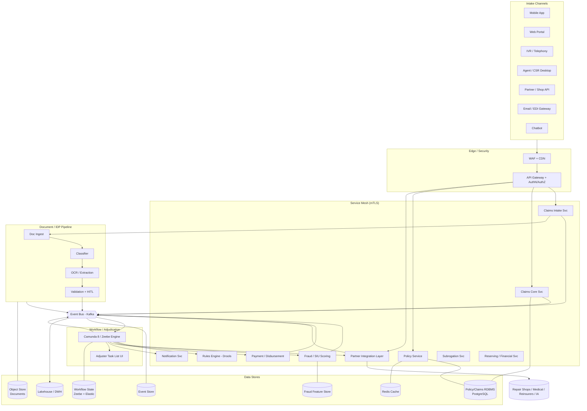
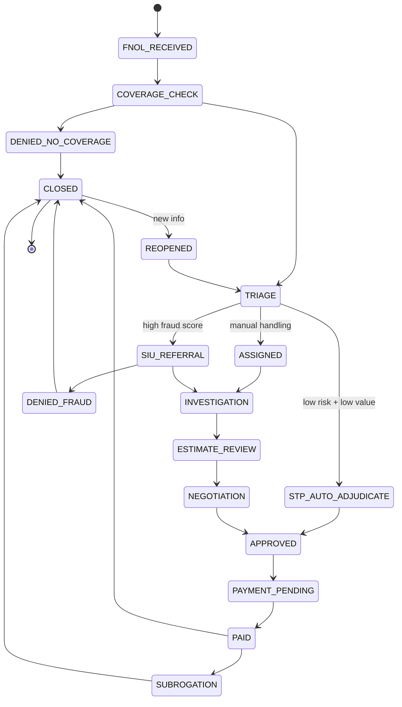
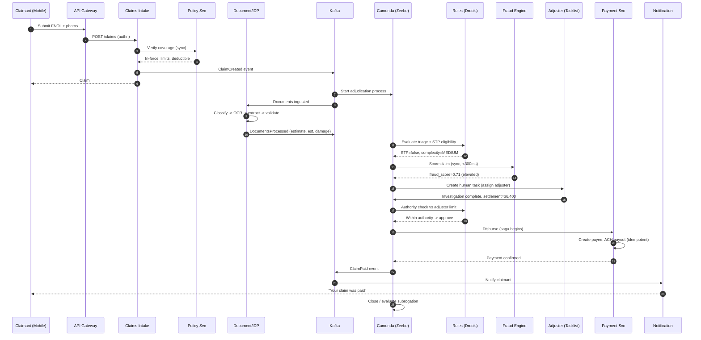
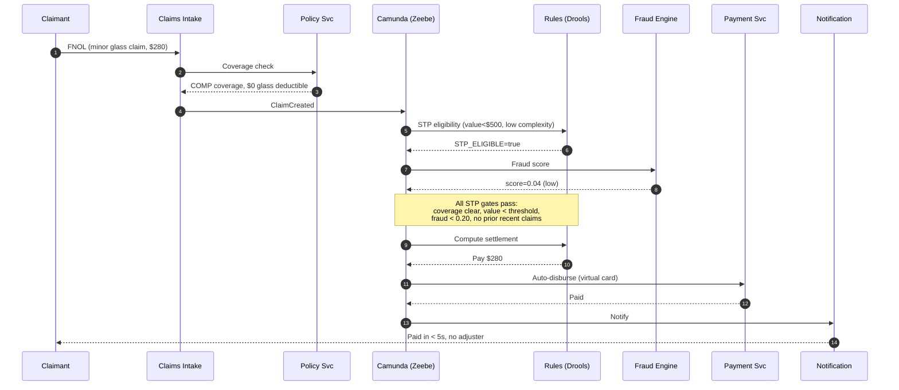

# Insurance Claims Processing Platform — Enterprise Architecture Scenario

**Executive Summary.** This document describes the end-to-end enterprise architecture for a multi-line **Insurance Claims Processing Platform** serving a mid-to-large carrier writing Auto, Property (Homeowners), and Health/Medical lines. The platform digitizes the full claim lifecycle — from multi-channel **First Notice of Loss (FNOL)** intake through **intelligent document processing (IDP)**, **rules-based triage**, **ML fraud scoring**, **BPMN-orchestrated adjudication**, and **payment disbursement** — while integrating a broad partner ecosystem (repair shops, medical providers, independent adjusters, reinsurers) and satisfying regulatory obligations (NAIC model regs, state DOI prompt-pay rules, HIPAA for medical lines, PCI-DSS for disbursements, SOX, GDPR/CCPA). The design is **microservices-based**, **event-driven (EDA)**, uses a **BPM/workflow engine (Camunda 8)** for long-running stateful orchestration, a **business rules engine (Drools)** for adjudication and triage decisioning, and supports **straight-through processing (STP)** for low-risk, low-value claims to drive cycle-time and cost reduction. Sagas coordinate distributed transactions across payment and partner boundaries. The target is 99.95% availability for intake and a P95 auto-decision latency under 5 seconds for STP-eligible claims.

---

## Context & Business Requirements

**The Insurer.** "Meridian Mutual" is a US multi-state carrier with ~6.5M active policies across three lines of business (LOBs):

| LOB | Active Policies | Annual Claims | Avg Severity | Notes |
|-----|----------------:|--------------:|-------------:|-------|
| Personal Auto | 3.8M | ~760K | $4,800 | High volume, photo-heavy, STP candidate |
| Homeowners / Property | 2.1M | ~315K | $11,200 | CAT-event spikes, contractor estimates |
| Health / Supplemental Medical | 0.6M | ~1.05M | $640 | HIPAA-regulated, high transaction count, EOB-driven |
| **Total** | **6.5M** | **~2.12M/yr** | — | |

**Lines of Business behavior.** Auto and Health dominate transaction volume; Property dominates severity and complexity (especially during catastrophe / CAT events such as hurricanes and hail storms, which can produce 10–30x daily intake spikes within a region).

**User populations.**
- **Claimants / Policyholders (~6.5M)** — file claims via mobile app, web portal, IVR/phone, or agent. Expect self-service status, photo upload, e-signature, and rapid disbursement.
- **Adjusters (~2,400 internal + ~3,500 independent/IA)** — desk adjusters, field adjusters, complex/large-loss specialists. Primary workflow users.
- **SIU investigators (~180)** — Special Investigation Unit handling suspected fraud referrals.
- **Partners (~40K endpoints)** — DRP (Direct Repair Program) body shops, medical providers/clearinghouses, towing/salvage vendors, rental car networks, reinsurers, and third-party claim administrators (TPAs).
- **Regulators / Auditors** — state DOIs, internal audit, external SOX auditors requiring immutable audit trails and statutory reporting.

**Business drivers.** Reduce claim cycle time (FNOL-to-close), increase STP rate from a baseline 12% to a target 35% on eligible auto/health claims, reduce leakage and fraud loss (fraud is estimated at 8–10% of incurred losses industry-wide), and improve NPS via transparent, fast claimant experience — all while maintaining strict regulatory compliance and auditability.

---

## Functional Requirements

1. **Policy inquiry & verification** — real-time coverage verification at FNOL (policy in force, coverage limits, deductibles, exclusions, endorsements, prior claims).
2. **Multi-channel claims intake (FNOL)** — mobile app, web portal, IVR/telephony, agent/CSR desktop, partner API (e.g., shop initiates), email/EDI, and chatbot.
3. **Document capture & IDP** — ingest photos, PDFs, EOBs, police reports, medical bills (HCFA-1500/UB-04), repair estimates; classify, extract, and validate via OCR/IDP.
4. **Claims registration** — create claim, assign claim number, establish reserves, associate exposures/coverages, parties, and loss details.
5. **Automated triage & segmentation** — route claims by complexity, severity, LOB, and fraud risk via the rules engine; identify STP-eligible claims.
6. **Workflow / adjudication orchestration** — long-running BPMN process driving tasks: coverage confirmation, investigation, estimate review, negotiation, settlement, approval, payment, subrogation, salvage, closure.
7. **Fraud detection (SIU)** — real-time ML scoring at intake plus batch/network analytics; generate referrals and red-flag indicators.
8. **Rules-based decisioning** — coverage rules, reserving rules, authority limits, settlement calculation, STP eligibility, prompt-pay deadlines.
9. **Partner integrations** — DRP estimate exchange, medical EDI (X12 837/835/EOB), reinsurance cession/recovery, IA assignment, salvage/parts.
10. **Payments & disbursement** — multi-rail payouts (ACH, virtual card, RTP, check), payee management, tax (1099) handling, escheatment.
11. **Notifications** — multi-channel (push, SMS, email, letters) status updates, requests for info, settlement offers.
12. **Subrogation & recovery** — identify, pursue, and recover from at-fault third parties / their carriers.
13. **Reserving & financials** — case reserves, IBNR feed, reinsurance recoverables, GL posting.
14. **Audit, compliance & reporting** — immutable audit trail, statutory & regulatory reporting, prompt-pay SLA tracking.
15. **Catastrophe (CAT) handling** — CAT event tagging, surge capacity, geospatial batch assignment.

---

## Non-Functional Requirements

| Category | Requirement | Target |
|---|---|---|
| **Availability — Intake** | FNOL channels (mobile/web/API) must accept claims | 99.95% (≈ 4.4 h/yr) |
| **Availability — Core** | Adjudication, workflow, partner APIs | 99.9% (≈ 8.8 h/yr) |
| **Availability — Disbursement** | Payment service | 99.9%, with idempotent retry |
| **Latency — Coverage check** | Real-time policy verification at FNOL | P95 < 800 ms |
| **Latency — STP decision** | End-to-end auto-adjudication (eligible claims) | P95 < 5 s |
| **Latency — Fraud score (online)** | Synchronous scoring call | P95 < 300 ms |
| **Latency — API gateway** | Added overhead per hop | P99 < 50 ms |
| **Throughput — Intake** | Sustained claim creation | 100 claims/s peak (CAT surge) |
| **Throughput — IDP** | Document pages processed | 2,000 pages/min sustained, burst 8,000 |
| **Throughput — Events** | Event bus | 25K events/s sustained |
| **Durability** | Documents & claim records | 11 nines (object store), no data loss |
| **RPO** | Recovery Point Objective | ≤ 15 s (core), 0 for committed payments |
| **RTO** | Recovery Time Objective | ≤ 30 min (core), ≤ 1 h (full region failover) |
| **Compliance** | HIPAA (Health LOB), PCI-DSS (payments), SOX, NAIC/state DOI, GDPR/CCPA | Audited, enforced |
| **Security** | Encryption in transit (TLS 1.3) & at rest (AES-256), mTLS service mesh, RBAC/ABAC, field-level PII/PHI encryption | Zero-trust |
| **Auditability** | Immutable, tamper-evident audit log retained 7–10 yrs | Append-only WORM |
| **Prompt-pay SLA** | State-mandated payment deadlines (e.g., 15–30 days) | 100% tracked, alerting at 70% of window |
| **Data retention** | Claim records | 7–10 yrs post-close per state |

---

## Capacity / Scale Estimates

**Baseline volumes.**
- Active policies: **6.5M**.
- Annual claims: **2.12M** → **~5,800 claims/day** average.
- Peak day (non-CAT) ≈ 3x average ≈ **~17K claims/day** ≈ ~0.2 claims/s average, but bursty: peak intake provisioned for **100 claims/s** to absorb CAT surges (a regional CAT event can drive 30K+ claims in 24–48h).

**Document volume (per LOB averages).**

| LOB | Docs/claim | Pages/doc (avg) | Annual claims | Annual pages |
|-----|-----------:|----------------:|--------------:|-------------:|
| Auto | 8 (photos+estimate+police rpt) | 1.4 | 760K | ~8.5M |
| Property | 14 (photos+estimates+inventory) | 1.6 | 315K | ~7.1M |
| Health | 4 (bill+EOB+notes) | 2.2 | 1.05M | ~9.2M |
| **Total** | — | — | 2.12M | **~24.8M pages/yr** |

**IDP throughput sizing.** 24.8M pages/yr ÷ (365 × 24 × 3600) ≈ **0.79 pages/s** average. But documents arrive in bursts tied to intake. Provision for **2,000 pages/min sustained (~33 pages/s)** with burst to 8,000/min during CAT, giving ~40x headroom over average. With ~1.5 s GPU-OCR per page and ~0.5 s extraction, a single IDP worker handles ~0.5 pages/s; **~70 concurrent IDP workers** cover sustained load, autoscaling to ~270 for burst.

**Storage growth.**
- **Documents/images:** assume avg 1.8 MB/page (high-res photos dominate auto/property). 24.8M pages × 1.8 MB ≈ **~44.6 TB/yr** raw. With derivatives (thumbnails, OCR text layers, redacted copies) ≈ **~60 TB/yr**. Over 10-yr retention → **~600 TB**, tiered (hot → warm → cold/Glacier).
- **Structured claim data:** ~2.12M claims/yr × ~40 KB (claim + exposures + parties + notes index) ≈ **~85 GB/yr** in the relational store (excluding documents); with full transactional history and audit ≈ **~300 GB/yr**.
- **Event store:** 2.12M claims × ~120 lifecycle events × ~1.5 KB ≈ **~380 GB/yr** (compacted, with snapshots).
- **Fraud feature store:** online (Redis/feature store) holds rolling features for active claims; offline (Parquet/lakehouse) retains ~2–3 yrs of training data ≈ **~5 TB**.

**Compute (rough).** ~30 microservices, each 3–6 replicas baseline; ~150–250 pods at baseline scaling to ~600 during CAT. Camunda Zeebe brokers: 5-node cluster, partition count 12, replication factor 3.

---

## High-Level Architecture



---

## Core Components / Services

The platform is decomposed into **bounded contexts** following Domain-Driven Design. Each owns its data and communicates via APIs (sync) and domain events (async).

| Service / Context | Responsibility | Key Tech | Data Store | Communication |
|---|---|---|---|---|
| **Policy Service** | Coverage verification, limits, deductibles, endorsements, prior-claims lookup | Java/Spring | PostgreSQL (read-replica + cache) | Sync REST/gRPC; cached |
| **Claims Intake** | Channel-agnostic FNOL capture, validation, dedupe, claim creation | Node/TS | Postgres + Kafka | Sync intake, async events |
| **Claims Core** | Claim aggregate: exposures, parties, coverages, notes, status | Java/Spring | PostgreSQL | Sync + events |
| **Workflow / Adjudication Engine** | BPMN orchestration of long-running claim lifecycle; human task assignment | Camunda 8 (Zeebe) | Zeebe + Elasticsearch | Job workers, events |
| **Document / IDP** | Ingest, classify, OCR, extract, validate; human-in-the-loop fallback | Python, ML models, Tesseract/Textract/Azure DI | Object store + index | Async pipeline |
| **Fraud / SIU** | Online ML scoring + batch network analytics; red flags; SIU referral | Python, MLflow, GNN/GBM | Feature store + lakehouse | Sync score + async batch |
| **Rules Engine** | Coverage, reserving, authority, STP eligibility, prompt-pay rules | Drools (DMN where apt) | Rule repository (KIE) | Sync decision API |
| **Payment / Disbursement** | Multi-rail payouts, payee mgmt, idempotency, 1099, escheatment | Java/Spring | Postgres (ledger) | Saga participant |
| **Partner Integration Layer** | DRP estimates, medical EDI (X12), reinsurance, IA assignment, salvage | Apache Camel / MuleSoft | Postgres + queues | Adapters, anti-corruption |
| **Notification Service** | Push/SMS/email/letters, templating, preferences, throttling | Node/TS | Postgres + provider APIs | Event-driven |
| **Subrogation Service** | Recovery identification, demand mgmt, inter-carrier arbitration | Java/Spring | Postgres | Events |
| **Reserving / Financial** | Case reserves, GL posting, reinsurance recoverables, IBNR feed | Java/Spring | Postgres | Events |

---

## Data Architecture

**Polyglot persistence** — each store chosen for its access pattern:

| Store | Technology | Why | Pattern |
|---|---|---|---|
| **Policy / Claims relational DB** | PostgreSQL (HA, read replicas) | Strong consistency, complex relational joins (claim↔exposure↔party↔coverage), ACID for financial integrity | OLTP, normalized |
| **Document object store** | S3 / Azure Blob (WORM, versioned) | Cheap, durable (11 nines), tiered lifecycle, immutable for compliance | Blob + metadata index |
| **Workflow state store** | Zeebe (RocksDB) + Elasticsearch (Operate) | Long-running process state, durable, queryable history, exporters | Event-sourced log |
| **Fraud feature store** | Online: Redis/Feast; Offline: Parquet lakehouse | Low-latency online features (<10ms); reproducible training sets | Dual online/offline |
| **Event store / bus** | Apache Kafka (log compaction, tiered storage) | Durable event backbone, replay, EDA, audit feed | Append-only log |
| **Analytics / DWH** | Lakehouse (Delta/Iceberg) + Snowflake | Reporting, statutory filings, ML training, BI | Columnar OLAP |
| **Cache** | Redis | Policy/coverage hot reads, rate limiting, session | Cache-aside |

**Claim schema sketch (simplified, relational core).**

```sql
CREATE TABLE claim (
  claim_id        UUID PRIMARY KEY,
  claim_number    VARCHAR(20) UNIQUE NOT NULL,
  policy_id       UUID NOT NULL,
  lob             VARCHAR(16) NOT NULL,         -- AUTO | PROPERTY | HEALTH
  loss_date       TIMESTAMPTZ NOT NULL,
  reported_date   TIMESTAMPTZ NOT NULL,
  fnol_channel    VARCHAR(16) NOT NULL,         -- MOBILE | WEB | IVR | CSR | PARTNER | EDI
  status          VARCHAR(32) NOT NULL,         -- lifecycle state (see below)
  cat_code        VARCHAR(12),                  -- catastrophe event tag (nullable)
  fraud_score     NUMERIC(5,4),                 -- 0.0000 - 1.0000
  stp_eligible    BOOLEAN DEFAULT FALSE,
  total_reserve   NUMERIC(14,2) DEFAULT 0,
  total_paid      NUMERIC(14,2) DEFAULT 0,
  assigned_to     UUID,                         -- adjuster id (nullable for STP)
  created_at      TIMESTAMPTZ DEFAULT now(),
  updated_at      TIMESTAMPTZ DEFAULT now()
);

CREATE TABLE claim_exposure (
  exposure_id     UUID PRIMARY KEY,
  claim_id        UUID NOT NULL REFERENCES claim(claim_id),
  coverage_code   VARCHAR(16) NOT NULL,         -- e.g. COLL, COMP, BI, PD, DWELL
  reserve_amount  NUMERIC(14,2) DEFAULT 0,
  paid_amount     NUMERIC(14,2) DEFAULT 0,
  status          VARCHAR(16) NOT NULL
);

CREATE TABLE claim_party (
  party_id        UUID PRIMARY KEY,
  claim_id        UUID NOT NULL REFERENCES claim(claim_id),
  role            VARCHAR(24) NOT NULL,         -- CLAIMANT | INSURED | CLAIMANT_ATTY | PROVIDER | SHOP
  party_ref       UUID,
  pii_token       VARCHAR(64)                   -- tokenized PII/PHI reference
);

CREATE TABLE claim_event (                      -- audit / event-sourced projection
  event_id        BIGSERIAL PRIMARY KEY,
  claim_id        UUID NOT NULL,
  event_type      VARCHAR(48) NOT NULL,
  payload         JSONB NOT NULL,
  actor           VARCHAR(64) NOT NULL,
  occurred_at     TIMESTAMPTZ DEFAULT now()
);
```

**Claim lifecycle states.**



**Partitioning & scaling.**
- **Claims RDBMS:** partition `claim` and `claim_event` by **reported_date (monthly range)** for time-bound retention/archival, sub-sharded by `lob` for the high-volume Health line. Read replicas serve coverage lookups and portal reads. Hot/active claims (open) kept in primary; closed claims aged to archive partitions.
- **Object store:** keyed by `lob/yyyy/mm/claim_id/doc_id`; lifecycle policy hot (90d) → warm (1y) → cold/archive (10y).
- **Kafka:** topics partitioned by `claim_id` (preserves per-claim ordering); 12–24 partitions per high-volume topic.
- **Feature store:** online keyed by `claim_id` + `policy_id`; TTL-bounded for open claims.

---

## Key Workflows

### Workflow 1 — FNOL through Disbursement (full adjudication, BPMN-orchestrated)



### Workflow 2 — Straight-Through Processing (auto-approval, no human touch)



**STP gating logic (Drools decision).** A claim is auto-approved only if ALL hold: coverage unambiguous; total < LOB STP value threshold (Auto glass $1,500, Health $400); fraud_score < 0.20; no open litigation/attorney; no SIU history; document extraction confidence > 0.92; no CAT-event flag (CAT claims always reviewed). Any miss routes to manual triage — a **fail-safe default to human handling**.

---

## Cross-Cutting Concerns

**Security & Compliance.**
- **Zero-trust service mesh** (mTLS via Istio/Linkerd); every service-to-service call authenticated.
- **AuthN/AuthZ:** OIDC/OAuth2 at the gateway; **RBAC + ABAC** (attribute-based, e.g., adjuster authority limits, LOB scoping, state licensing) enforced at the service layer.
- **PII/PHI protection:** field-level encryption and **tokenization** (vault) for SSN, medical data; HIPAA-segregated Health LOB data plane; PCI-DSS scope minimization — payment card/bank data isolated in the Payment service behind a tokenized vault, gateway never sees raw instruments.
- **Data residency / privacy:** GDPR/CCPA right-to-erasure handled via tokenization (crypto-shredding) since raw claim records are statutorily retained.

**HA / DR.**
- Multi-AZ active-active within region; **active-passive cross-region** (warm standby) for full DR. RPO ≤ 15 s via async DB replication + Kafka mirroring; **RPO = 0 for committed payments** via synchronous ledger write before disbursement.
- RTO ≤ 30 min (intra-region failover, automated), ≤ 1 h cross-region. DR runbooks tested quarterly via game days. Zeebe partitions replicated (RF=3) for workflow durability.

**Observability.**
- **Three pillars:** metrics (Prometheus/Grafana), distributed tracing (OpenTelemetry → Jaeger/Tempo, with `claim_id` as trace correlation), structured logs (ELK/Loki).
- **Business observability:** cycle-time dashboards, STP rate, prompt-pay SLA burn-down, fraud-referral funnel, IDP extraction confidence trends.

**Workflow resilience.**
- Camunda jobs are **idempotent and retriable** with exponential backoff; failed jobs go to incident/DLQ for ops. **Saga pattern** with compensating actions across payment/partner boundaries (e.g., if disbursement fails post-approval, compensate by reverting claim to PAYMENT_PENDING and alerting). Process timers enforce SLAs (escalate stalled tasks).

**Fraud / ML model ops (MLOps).**
- Online GBM/feature-store scoring (<300ms) + offline **graph network analytics (GNN)** for organized fraud rings (shared addresses, providers, repair shops). Model registry (MLflow), champion/challenger A/B, drift monitoring, scheduled retraining. **Explainability (SHAP)** required — adverse fraud decisions must be explainable for regulatory/appeal purposes. Human-in-the-loop SIU validation feeds labels back.

**Audit trail.**
- Every state transition and decision emits an immutable event to an **append-only, WORM-backed audit log** (Kafka → object store, optionally hash-chained for tamper evidence). Captures actor, timestamp, before/after, rule version, model version. Retained 7–10 yrs, serving SOX, DOI exams, and dispute defense.

**Scaling the document pipeline.**
- Stateless IDP workers autoscale on queue depth (KEDA on Kafka lag). GPU pool for OCR; **CPU/GPU separation** of classification vs. extraction. Backpressure via bounded queues; low-confidence extractions routed to **human-in-the-loop (HITL)** review rather than blocking. CAT surge handled by burst autoscaling and priority queuing (life-safety/property claims prioritized).

---

## Key Trade-offs & Decisions

| Decision | Chosen Approach | Alternative | Rationale |
|---|---|---|---|
| **Workflow coordination** | **Orchestration via BPMN engine (Camunda 8)** for the claim lifecycle | Pure choreography (events only) | Claims are long-running, stateful, audited, with human tasks, timers, SLAs, and compensation — explicit orchestration gives visibility, auditability, and process governance. Choreography retained for loosely-coupled side-effects (notifications). |
| **Decisioning** | **Externalized business rules engine (Drools/DMN)** | Hardcoded logic in services | Coverage, authority, STP, and prompt-pay rules change frequently and per-state; business analysts must update them without code deploys; versioned rules are auditable. |
| **IDP** | **Buy + augment** (cloud IDP — Textract/Azure DI — plus custom extraction/HITL) | Build OCR/IDP in-house | Cloud IDP gives mature OCR/forms; custom layer adds insurance-specific extraction (estimates, EOBs) and confidence-based HITL. Build-from-scratch is slow and undifferentiated. |
| **STP thresholds** | **Conservative thresholds, fail-safe to human** | Aggressive STP to maximize automation | Wrongful auto-approval = leakage + regulatory risk; auto-deny = bad-faith exposure. Start conservative, expand thresholds as model confidence and monitoring mature. |
| **Sync vs async** | **Sync for coverage/fraud-score (user-facing); async/event-driven for the rest** | Fully synchronous | Coverage and online fraud must be fast and inline; downstream adjudication, IDP, partner exchange, payments are long-running and benefit from EDA decoupling and resilience. |
| **Transaction consistency** | **Saga (orchestrated) across payment/partner boundaries** | Distributed 2PC | 2PC doesn't scale across heterogeneous partners/payment rails; sagas with compensation fit the long-lived, partially-failing nature of claims. |
| **Data model** | **Polyglot persistence per bounded context** | Single shared monolithic DB | Avoids coupling; each store fits its access pattern; shared DB creates contention and blocks independent scaling. RDBMS retained where ACID financial integrity is required. |
| **Partner integration** | **Anti-corruption layer + adapters (Camel/Mule)** | Direct point-to-point integrations | 40K+ heterogeneous partners with varied protocols (X12 EDI, REST, SFTP); ACL isolates domain model from partner formats and absorbs change. |
| **Multi-tenancy of LOBs** | **Shared platform, LOB-segregated data planes (esp. HIPAA Health)** | Separate platform per LOB | Reuse of intake/workflow/payment with isolation where compliance demands; lower TCO than three siloed platforms. |

---

## Tech Stack

| Layer | Technology | Notes |
|---|---|---|
| **Client / Channels** | iOS/Android (native), React web portal, Twilio/Genesys IVR, chatbot (NLU) | Multi-channel FNOL |
| **Edge** | CDN, WAF, Kong / Apigee API Gateway | TLS 1.3, rate limiting, OAuth2/OIDC |
| **Service mesh** | Istio (mTLS, traffic policy) | Zero-trust, canary |
| **Microservices runtime** | Java 21 / Spring Boot, Node.js/TypeScript, Python (ML/IDP) | Polyglot per context |
| **Workflow / BPM** | **Camunda 8 (Zeebe)** — BPMN engine; **Flowable** as alternative | Long-running orchestration, human tasks, DMN |
| **Rules engine** | **Drools / KIE (DMN)** | Externalized decisioning, versioned |
| **Document / IDP** | AWS Textract / Azure Document Intelligence + custom Python (PyTorch), Tesseract fallback | OCR + forms + extraction |
| **Fraud / ML** | Python, XGBoost/LightGBM (online), GNN (network), Feast feature store, MLflow registry, SHAP | Real-time + batch |
| **Eventing** | Apache Kafka (tiered storage, Schema Registry/Avro) | EDA backbone, audit feed |
| **Integration** | Apache Camel / MuleSoft, X12 EDI engine (837/835) | Partner ACL/adapters |
| **Payments** | Payment orchestration (e.g., Modern Treasury / in-house ledger), ACH/RTP/virtual card/check rails | Idempotent, PCI vault |
| **Relational DB** | PostgreSQL (Patroni HA, read replicas) | OLTP, partitioned |
| **Object store** | Amazon S3 / Azure Blob (WORM, lifecycle tiering) | Documents, immutable |
| **Cache** | Redis | Coverage hot reads, sessions |
| **Analytics** | Lakehouse (Delta/Iceberg) + Snowflake, dbt | Reporting, statutory, ML training |
| **Observability** | OpenTelemetry, Prometheus, Grafana, Jaeger/Tempo, ELK/Loki | Metrics/traces/logs |
| **Secrets / vault** | HashiCorp Vault | Tokenization, PII/PHI, PCI |
| **Platform** | Kubernetes (EKS/AKS), KEDA autoscaling, ArgoCD GitOps, Terraform IaC | Multi-AZ, multi-region DR |
| **Identity** | OIDC IdP (Okta/Entra), RBAC + ABAC | AuthN/AuthZ |

---

*Authored for the Architecture Review Board — Meridian Mutual Claims Modernization Program.*
