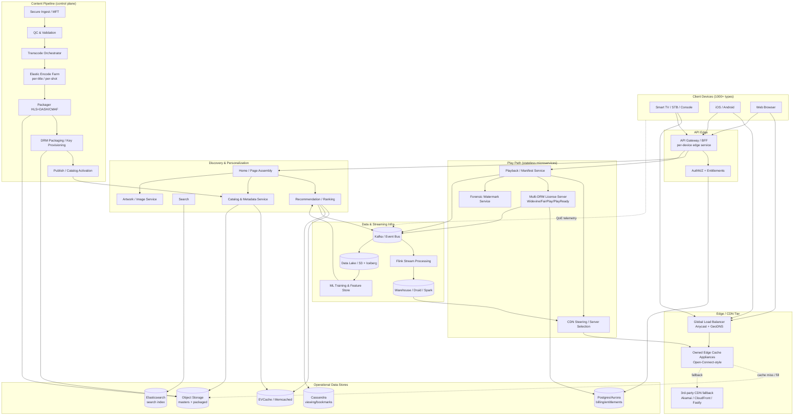

# Global Video Streaming Platform — Enterprise Architecture Scenario

> A principal-architect-level, end-to-end reference design for a Netflix-class on-demand (and live-capable) video streaming platform operating at global scale. The document walks from business drivers through capacity math, architecture, data, critical workflows, cross-cutting concerns, trade-offs, and a concrete technology stack.

---

## Context & Business Requirements

We operate a direct-to-consumer subscription video-on-demand (SVOD) service, "StreamCo", serving a global subscriber base across ~190 countries on 1,000+ device types (Smart TVs, set-top boxes, game consoles, iOS/Android, web browsers, casting). The business goal is to deliver high-quality, instantly-startable video with minimal rebuffering, personalized to each member, at a content-delivery cost that scales sub-linearly with watch time.

**Business drivers**

| Driver | Why it matters |
|---|---|
| Engagement / retention | Streaming quality of experience (QoE) — fast startup, no rebuffer, high bitrate — directly correlates with retention and churn reduction. |
| Content cost leverage | Encoding and CDN egress dominate variable cost. Per-title/per-shot encoding and owned edge caching reduce bandwidth bills by 20–50%. |
| Global reach | Catalog and licensing vary by territory; the platform must enforce geo-availability and localized metadata. |
| Content protection | Studio licensing contracts mandate multi-DRM and forensic/session watermarking for premium (4K/HDR) titles. |
| Personalization | Recommendations drive the majority of viewing; the home page must be assembled per-member, per-device, in tens of milliseconds. |
| New-content launch spikes | Tentpole releases produce thunderous-herd concurrency that must not degrade the steady-state experience. |

**Scope**: SVOD catalog + roadmap for live events. Out of scope for v1: ad-supported tier billing internals, content acquisition/rights negotiation systems (treated as upstream).

---

## Functional Requirements

1. **Content ingestion**: Accept studio mezzanine masters (ProRes/JPEG2000/IMF) via secure aspera/managed-file-transfer; validate, QC, and register into the pipeline.
2. **Transcoding/packaging**: Produce an adaptive bitrate (ABR) ladder per title using per-title and per-shot encoding; package into HLS + DASH (CMAF/fMP4) with multiple codecs (H.264/AVC, H.265/HEVC, AV1) and audio (AAC, EAC3, Atmos).
3. **DRM packaging**: Encrypt with CENC (cbcs/cenc) and provision keys for Widevine, FairPlay, and PlayReady.
4. **Catalog & metadata**: Manage titles, episodes, seasons, artwork, trailers, localized text, availability windows, and maturity ratings.
5. **Discovery & personalization**: Generate per-member home pages (rows/ranking), search, "because you watched", trending, and continue-watching.
6. **Playback**: Manifest delivery, ABR switching, multi-DRM license acquisition, bookmarks/resume, multi-profile, parental controls.
7. **Entitlements**: Enforce subscription tier, concurrent-stream limits, geo/territory availability, and device registration.
8. **QoE analytics**: Capture client-side playback telemetry (startup time, rebuffer ratio, bitrate, errors) for monitoring and ABR/encoding feedback loops.
9. **A/B experimentation**: Run experiments on artwork, ranking, ABR algorithms, and UI.

## Non-Functional Requirements

| Category | Target |
|---|---|
| **Availability** | 99.99% for the play path (manifest + license + segment delivery). Control plane (catalog admin, ingest) 99.9%. |
| **Latency** | Home page assembly p99 < 300 ms; recommendation row p99 < 80 ms; **video startup (click-to-first-frame) p50 < 1.0 s, p95 < 2.0 s**; DRM license acquisition p99 < 250 ms; rebuffer ratio < 0.4%. |
| **Throughput** | Sustain tens of millions of concurrent streams; tens of Tbps aggregate egress at peak; recommendation tier > 1M QPS. |
| **Durability** | Source masters & packaged assets: 11 nines (object storage with cross-region replication). |
| **Scalability** | Horizontal, stateless services on the play path; storage and caches partitioned. Elastic transcode farm. |
| **Compliance** | GDPR/CCPA (PII handling, right-to-erasure), PCI-DSS (delegated to payment processor / tokenization), COPPA for kids profiles, content-licensing geo-restrictions, accessibility (CEA-608/708 captions, audio description, WCAG for UI). |
| **Security** | Multi-DRM, session-based forensic watermarking for 4K/HDR, TLS 1.3 everywhere, mTLS service-to-service, signed/expiring CDN URLs, hardware-backed key storage (HSM/KMS), zero-trust internal network. |
| **DR** | Active-active multi-region; regional evacuation (failover) within minutes; RPO ≈ 0 for entitlements, RTO < 5 min for play path. |

---

## Capacity / Scale Estimates

Assumptions stated explicitly so the math is auditable.

**Subscriber & concurrency**

| Metric | Estimate | Derivation |
|---|---|---|
| Total subscribers | 260M | Given target. |
| Daily active accounts | ~110M | ~42% DAU/total. |
| Peak concurrent streams | ~12M | Evening prime-time across overlapping time zones; ~11% of DAU concurrent at peak. |
| Avg play sessions/day | ~250M | ~2.3 sessions per DAU. |
| Avg session length | ~50 min | Mixed films + episodic. |

**Bandwidth / egress**

- Average sustained bitrate (blended SD/HD/4K, ABR) ≈ **4.5 Mbps**.
- Peak egress ≈ 12M streams × 4.5 Mbps ≈ **54 Tbps** at the edge.
- Daily watch time ≈ 250M sessions × 50 min ≈ **~208M hours/day**.
- Daily egress ≈ 208M hr × 3600 s × 4.5 Mbps ≈ **~420 PB/day** delivered (≈ 150+ exabytes/year). The overwhelming majority is served from owned edge cache appliances (>90% offload), not origin.

**Encoding / ingest**

- New & refreshed titles/day: ~3,000 asset-hours of source/day.
- Each source hour fans out to ~50–120 encoded renditions (codec × resolution × bitrate × audio × DRM scheme), driven by per-shot encoding decisions.
- **Transcode compute: ~250,000–400,000 transcode-core-hours/day** on an elastic, spot-heavy farm; large catalog re-encodes (e.g., AV1 backfill) are scheduled as background batch.
- Packaged-asset storage (multi-codec, multi-DRM, all renditions): tens of PB, growing; masters archived to cold/glacier tiers.

**Personalization / metadata**

- Recommendation/ranking requests: **> 1.2M QPS** at peak (home page rows + lazy-loaded rows + search).
- Catalog/metadata reads: ~3M QPS, served almost entirely from cache (EVCache) with > 99% hit ratio.
- Viewing-event ingestion (telemetry): **~5–8M events/sec** at peak into the streaming bus.

---

## High-Level Architecture



---

## Core Components / Services (Bounded Contexts)

| Bounded context | Responsibility | Notes |
|---|---|---|
| **API Edge / BFF** | Device-specific Backend-for-Frontend; request fan-out, response shaping, fallback/hedging. | One BFF per device family (TV, mobile, web) to handle wildly different UI contracts. GraphQL federation or device-tailored REST. |
| **AuthN/Z & Entitlements** | Token issuance/validation, subscription tier, geo availability, concurrent-stream gating, device registration. | Authoritative source for "can this member play this title here, now". |
| **Catalog & Metadata** | Titles, seasons/episodes, availability windows, ratings, localized text, relationships. | Read-heavy, heavily cached; write path via content publish. |
| **Artwork / Image Service** | Per-device, per-locale, per-experiment artwork variants; dynamic resize/transcode. | Personalized thumbnails are a known engagement lever (A/B tested). |
| **Discovery: Home/Page Assembly** | Composes the member home page from ranked rows. | Aggregator that calls Recommendation + Catalog + Artwork with strict latency budget & fallbacks. |
| **Recommendation / Ranking** | Candidate generation + ranking models; row generation, "because you watched", trending. | Online serving over precomputed features + real-time signals. |
| **Search** | Query understanding, autocomplete, relevance ranking. | Backed by Elasticsearch/OpenSearch with locale-aware analyzers. |
| **Playback / Manifest** | Issues device-appropriate HLS/DASH manifest, encodes ABR ladder availability, applies entitlement + geo. | Stateless; the heartbeat of the play path. |
| **CDN Steering / Server Selection** | Picks best edge server/CDN per client based on real-time health, fill state, ISP, geo, QoE feedback. | Data-driven; consumes near-real-time QoE from Flink. |
| **Multi-DRM License Server** | Issues Widevine/FairPlay/PlayReady licenses, enforces policy (HDCP level, output protection, persistence, rental windows). | Talks to KMS/HSM for content keys; lowest-latency tier. |
| **Forensic Watermark Service** | Session-based / A-B variant watermarking for premium content traceability. | Required by studio contracts for 4K/HDR. |
| **Content Pipeline** | Ingest → QC → transcode orchestration → encode → package → DRM → publish. | Control plane; workflow-driven, idempotent, resumable. |
| **Viewing/QoE Analytics** | Ingest, process, and serve playback telemetry for ops, steering, and ML. | Kafka + Flink; powers both real-time steering and offline model training. |
| **Experimentation** | Allocation, exposure logging, metrics. | Cross-cuts discovery, playback, and UI. |

---

## Data Architecture

**Polyglot persistence** — each store chosen for its access pattern.

| Store | Technology | Data | Why |
|---|---|---|---|
| Object storage | S3 (+ Glacier for masters) | Source mezzanine masters, packaged ABR segments, manifests, artwork. | Cheap, durable (11 nines), CDN origin, lifecycle tiering. |
| Wide-column | Apache Cassandra | Viewing history, bookmarks/continue-watching, playback session state, member feature snapshots. | Massive write throughput, multi-region active-active, tunable consistency, no single point of failure. |
| Cache | EVCache (Memcached) | Catalog/metadata, precomputed home rows, entitlement lookups, session tokens. | Microsecond reads at >1M QPS; multi-zone replication; absorbs read storms. |
| Relational | Aurora / PostgreSQL | Billing, subscriptions, entitlements ledger, device registry. | Strong consistency & transactions for money/access decisions. |
| Search | Elasticsearch / OpenSearch | Title/person search index, autocomplete. | Inverted index, locale analyzers, relevance scoring. |
| Event bus | Apache Kafka | Viewing events, playback/license events, pipeline events, CDC. | Durable, replayable, high-throughput backbone. |
| Stream processing | Apache Flink | Real-time QoE aggregation, steering signals, sessionization. | Exactly-once, event-time windows, stateful. |
| Data lake / warehouse | S3 + Iceberg, Spark, Druid | Long-term analytics, OLAP, dashboards, ML training sets. | Decouple storage/compute; sub-second OLAP via Druid. |
| Feature store | (online) EVCache/DynamoDB + (offline) Iceberg | Member & content features for recommendations. | Consistent train/serve features. |

**Schema sketches**

Catalog title (document, served from cache):
```json
{
  "titleId": "tt-90210",
  "type": "series",
  "localized": { "en-US": {"name":"...","synopsis":"..."}, "ja-JP": {...} },
  "maturity": { "us": "TV-MA", "de": "FSK16" },
  "availability": [ { "territory":"US", "window":{"start":"...","end":"..."} } ],
  "seasons": [ { "seasonId":"s1", "episodes":["ep-1","ep-2"] } ],
  "assets": { "artwork": ["img-a","img-b"], "trailer": "tt-90210-trl" }
}
```

Cassandra — viewing/bookmark (partition by member for locality):
```
TABLE viewing_history (
  member_id    uuid,         -- partition key
  title_id     text,
  event_ts     timestamp,    -- clustering key (DESC)
  position_ms  bigint,
  duration_ms  bigint,
  device_id    text,
  PRIMARY KEY ((member_id), event_ts)
) WITH CLUSTERING ORDER BY (event_ts DESC);

TABLE bookmark (
  member_id uuid, title_id text, position_ms bigint, updated_ts timestamp,
  PRIMARY KEY ((member_id), title_id)
);
```

Packaged-asset manifest registry (maps title+device+drm → manifest/segment paths):
```
asset_rendition( asset_id, profile_id, codec, resolution, bitrate_kbps,
                 container[cmaf], drm_scheme[cenc|cbcs], s3_path, checksum )
```

---

## Key Workflows

### Workflow 1 — Ingest-to-Publish Transcoding Pipeline

```mermaid
sequenceDiagram
    autonumber
    participant ST as Studio / Source
    participant MFT as Secure Ingest (MFT/Aspera)
    participant QC as QC & Validation
    participant ORCH as Transcode Orchestrator
    participant FARM as Elastic Encode Farm
    participant PKG as Packager (HLS+DASH/CMAF)
    participant DRM as DRM Packaging + KMS
    participant OBJ as Object Storage (Origin)
    participant CAT as Catalog Service
    participant CDN as Edge Cache Appliances

    ST->>MFT: Upload mezzanine master (IMF/ProRes)
    MFT->>OBJ: Land master, checksum, register
    MFT->>QC: Trigger validation
    QC->>QC: Spec/loudness/A-V sync/caption checks
    QC->>ORCH: QC passed -> create encode job
    ORCH->>FARM: Split into shots; per-shot complexity analysis
    FARM->>FARM: Per-title/per-shot encode (AVC/HEVC/AV1, audio)
    FARM->>PKG: Renditions ready
    PKG->>PKG: Package CMAF; emit HLS + DASH manifests
    PKG->>DRM: Request CENC encryption keys
    DRM->>DRM: KMS/HSM issues content keys (cenc + cbcs)
    DRM->>OBJ: Store encrypted segments + manifests
    DRM->>ORCH: Packaging complete
    ORCH->>CAT: Activate asset (availability window)
    CAT->>CDN: Pre-position / prewarm popular titles
    Note over CAT,CDN: Title now playable; popular content<br/>proactively pushed to edge during off-peak
```

Key properties: every step is **idempotent and resumable** (workflow engine checkpoints), shots are encoded in parallel for throughput, and proactive **edge prepositioning** during off-peak fills owned cache appliances before launch spikes (avoiding origin thundering herd).

### Workflow 2 — Playback Start with License Acquisition

```mermaid
sequenceDiagram
    autonumber
    participant C as Client Player
    participant GW as API Edge / BFF
    participant ENT as Entitlements
    participant PB as Playback / Manifest
    participant STEER as CDN Steering
    participant LIC as Multi-DRM License Server
    participant KMS as KMS / HSM
    participant CDN as Edge Cache

    C->>GW: Play(titleId, deviceCtx, authToken)
    GW->>ENT: Authorize (tier, geo, concurrency, maturity)
    ENT-->>GW: OK + entitlement claims
    GW->>PB: Get manifest(titleId, device profile)
    PB->>STEER: Best edge server(s) for client
    STEER-->>PB: Ranked edge URLs (signed, expiring)
    PB-->>C: HLS/DASH manifest (ABR ladder + DRM init)
    C->>CDN: GET init + first media segments (low bitrate first)
    CDN-->>C: Segments (encrypted)
    C->>LIC: License request (PSSH, device cert, scheme)
    LIC->>ENT: Re-verify entitlement + output policy
    LIC->>KMS: Fetch content key (wrapped)
    KMS-->>LIC: Content key
    LIC-->>C: DRM license (key + policy: HDCP, persistence, window)
    C->>C: Decrypt + decode; ABR ramps up by bandwidth/buffer
    C-->>GW: Heartbeat (concurrency) + QoE telemetry (async)
    Note over C,CDN: First frame target p50 < 1s:<br/>parallel manifest+license, low-bitrate start, edge-local segments
```

Latency tactics on the play path: low-bitrate first segment for fast startup, parallel manifest + license acquisition, signed short-lived CDN URLs, hedged requests across edge candidates, and aggressive client-side prefetch of likely-next titles.

---

## Cross-Cutting Concerns

**Security & compliance**
- **Multi-DRM** (Widevine L1/L3, FairPlay, PlayReady SL3000) with CENC (`cenc` for PlayReady/Widevine, `cbcs` for FairPlay/CMAF). Output protection (HDCP level) enforced per license policy for 4K/HDR.
- **Forensic watermarking** (session-based A/B variant) on premium tiers for leak traceability per studio contracts.
- Content keys never leave **KMS/HSM** unwrapped; license server requests wrapped keys.
- **Signed, short-TTL CDN URLs**; token-based segment authorization.
- TLS 1.3 north-south, **mTLS** east-west via service mesh; zero-trust internal network.
- **GDPR/CCPA**: PII minimization, encryption at rest (KMS), right-to-erasure orchestrated across Cassandra/lake; **COPPA** for kids profiles (no behavioral tracking). PCI scope delegated to tokenized payment processor.
- Geo enforcement at entitlement + manifest + license layers (defense in depth) using authoritative IP-geo + account territory.

**HA / DR**
- **Active-active multi-region** (e.g., 3 AWS regions). Members are served from the nearest healthy region; state replicated via Cassandra multi-region and Kafka mirroring.
- **Regional evacuation**: traffic can be drained from a failing region within minutes via GeoDNS/Anycast steering; capacity is pre-provisioned (N-1 region failure tolerated).
- Cassandra `LOCAL_QUORUM` for low-latency local consistency with async cross-region replication; entitlements ledger in Aurora Global Database.
- Edge tier has multi-CDN fallback (owned appliances → 3rd-party CDN) so segment delivery survives appliance/region issues.

**Resilience engineering**
- **Chaos engineering** (failure injection, region evacuation drills, latency injection) continuously validates resilience in production.
- Circuit breakers, bulkheads, timeouts, and **fallbacks** (e.g., stale-but-served home rows, default ranking) on every play-path dependency — the play path degrades gracefully, never hard-fails.
- Hedged requests + concurrency-limited retries.

**Observability**
- Distributed tracing (OpenTelemetry), RED/USE metrics (Prometheus/Atlas-style TSDB), structured logs.
- **Real-time QoE pipeline** (Kafka → Flink → Druid) powers playback dashboards, anomaly detection, and CDN steering feedback within seconds.
- SLO-based alerting (error budgets) on startup time, rebuffer ratio, license success rate, and availability.

**Scaling**
- Stateless services autoscale on RPS/CPU; caches and Cassandra scale by partitioning.
- Encode farm runs primarily on **spot/preemptible** capacity with checkpointing; large re-encodes deprioritized as background.
- Launch-spike protection: edge **prepositioning** + load shedding + request coalescing at origin.

---

## Key Trade-offs & Decisions

| Decision | Alternatives | Rationale |
|---|---|---|
| **Owned edge cache appliances** embedded in ISPs (Open-Connect-style) | Pure 3rd-party multi-CDN | At ~420 PB/day, owned edge offload (>90%) is dramatically cheaper and improves QoE by being inside the ISP; 3rd-party CDN kept as fallback/overflow. |
| **Per-title / per-shot encoding** | Fixed bitrate ladder | 20–50% bitrate savings at equal quality; higher encode compute cost is worth it given egress dominates cost. |
| **CMAF + multi-DRM (cbcs)** | Separate HLS/TS + DASH packaging | CMAF/fMP4 lets one set of segments serve HLS & DASH (storage + cache efficiency); `cbcs` common encryption spans FairPlay/Widevine/PlayReady. |
| **AV1 rollout as backfill** | AV1-first | AV1 gives best compression but high encode cost and limited HW decode; roll out for high-traffic titles & capable devices, fall back to HEVC/AVC. |
| **Cassandra for viewing state** | Single relational DB | Need multi-region active-active, huge write volume, and AP-leaning availability; viewing data tolerates eventual consistency. |
| **Aurora for entitlements/billing** | Cassandra everywhere | Money & access decisions need strong consistency/transactions. |
| **Stateless play path + heavy caching + fallbacks** | Fewer, richer stateful services | Maximizes availability (99.99%) and graceful degradation; cache-first keeps p99 latency low under load. |
| **Active-active multi-region** | Active-passive | Lower latency globally, instant failover, no cold standby waste; cost is replication complexity and conflict handling. |
| **Precomputed recommendation rows + online re-rank** | Fully online generation | Meets >1M QPS at <80 ms p99 by precomputing candidates offline and re-ranking with light real-time signals online. |
| **Eventual consistency on home page** | Strong consistency | A slightly stale row is acceptable; availability and latency win. |

---

## Tech Stack

| Layer | Technology |
|---|---|
| **Clients/Players** | ExoPlayer (Android), AVPlayer (iOS/tvOS), Shaka Player / hls.js (web), native TV SDKs; common ABR/QoE telemetry SDK. |
| **Streaming formats** | HLS + MPEG-DASH, **CMAF/fMP4**, codecs AVC/HEVC/AV1, audio AAC/EAC3/Dolby Atmos; captions CEA-608/708, WebVTT, IMSC. |
| **DRM** | Google **Widevine**, Apple **FairPlay**, Microsoft **PlayReady**; multi-DRM license server; CENC (cenc/cbcs). |
| **Watermarking** | Session-based forensic watermarking (A/B variant) for premium content. |
| **CDN/Edge** | Owned edge cache appliances (Open-Connect-style) + multi-CDN (Akamai/CloudFront/Fastly); Anycast + GeoDNS global load balancing. |
| **Ingest/Transcode** | Secure MFT/Aspera ingest; workflow orchestration (Conductor/Temporal/Step Functions); elastic encode farm on spot EC2; per-title/per-shot encoding; FFmpeg/x264/x265/SVT-AV1; packagers (Shaka Packager / Bento4 / Unified Streaming). |
| **API/Services** | JVM microservices (Java/Kotlin + Spring Boot) and Node/Go BFFs; gRPC + GraphQL; service mesh (Envoy/Istio) with mTLS. |
| **Data stores** | Apache **Cassandra**, **EVCache** (Memcached), Aurora/PostgreSQL, Elasticsearch/OpenSearch, S3 (+ Glacier). |
| **Streaming/Analytics** | Apache **Kafka**, Apache **Flink**, Apache **Druid**, Apache Spark, S3 + Apache Iceberg data lake. |
| **ML/Personalization** | TensorFlow/PyTorch training; online feature store; candidate-gen + ranking model serving; experimentation platform. |
| **Infra/Platform** | AWS multi-region; Kubernetes/EKS + autoscaling; Terraform IaC; CI/CD; **Spinnaker**-style continuous delivery. |
| **Security** | AWS KMS/CloudHSM, OAuth2/OIDC tokens, TLS 1.3, signed URLs, WAF, secrets manager. |
| **Observability/Resilience** | OpenTelemetry, Prometheus/Atlas TSDB, Grafana, distributed tracing; circuit breakers (resilience4j/Hystrix-style); **chaos engineering** (Chaos Monkey / fault injection). |

---

*End of scenario.*
